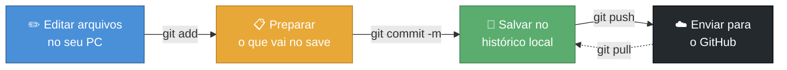
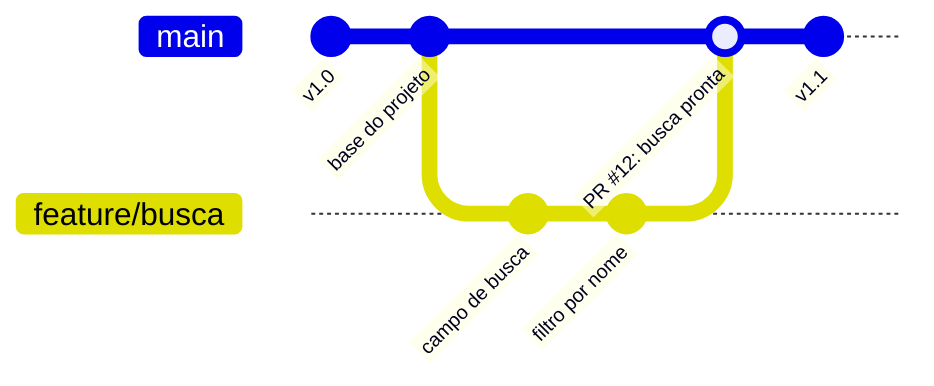
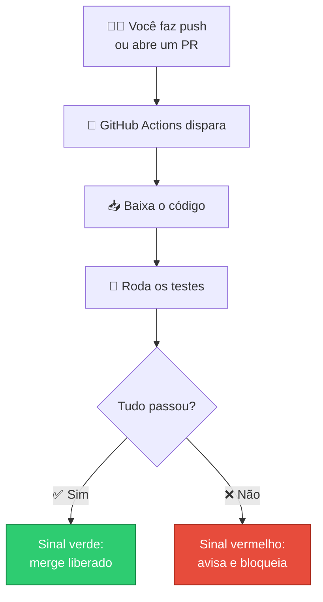
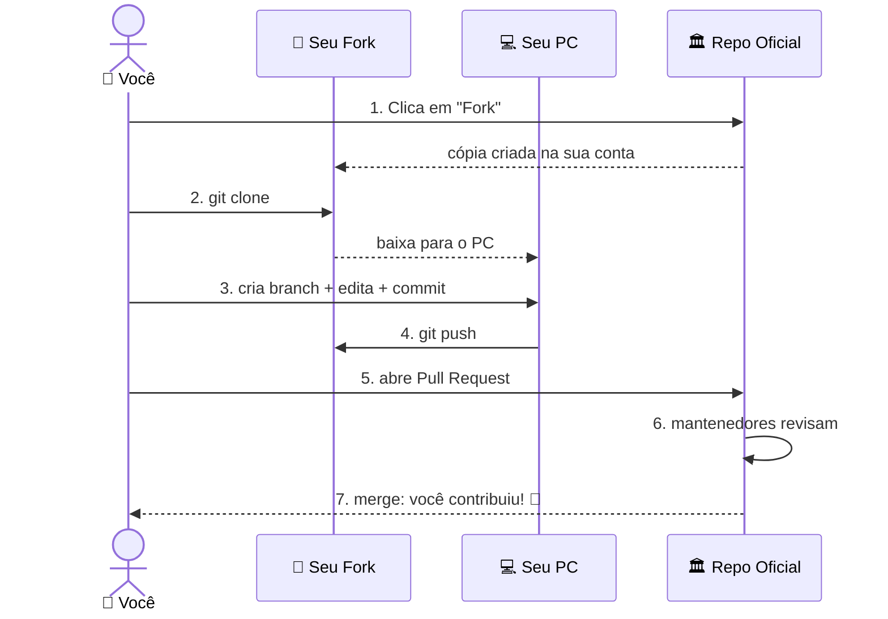

# GitHub - Gerenciamento de Código

> [!quote] O LinkedIn de quem escreve código
> *No GitHub o seu trabalho não fica numa pasta no computador: ele vira histórico, vira portfólio e vira convite para colaborar com pessoas do mundo inteiro.*

> [!info] Onde esta aula se encaixa
> Esta é a visão **Roadmap do futuro**: foco em **colaborar, publicar projetos e montar portfólio**. A mecânica detalhada do Git (áreas de trabalho, todos os comandos, branches passo a passo) está em [[GitHub e controle de versão]]. As duas aulas se completam: lá você aprende a *operar*; aqui você aprende a *aparecer e colaborar*.

---

## 🕹️ O que é controle de versão (e por que você vai amar)

> [!info] Conceito
> **Controle de versão** guarda o histórico de todas as mudanças de um projeto. Cada estado salvo pode ser consultado, comparado e restaurado a qualquer momento.

Pense em dois jogos que você já conhece:

- 💾 **Save game:** antes de uma fase difícil, você salva. Se morrer, volta para o save. Cada `commit` no Git é um save do seu projeto.
- ⏳ **Máquina do tempo do código:** deu ruim hoje? Abra o histórico, escolha a versão de ontem que funcionava e volte para ela, sem perder nada.

> [!warning] O problema que isso resolve
> A alternativa amadora é a pasta `projeto_final_v2_AGORA_VAI_ESSE.zip`: ela não diz **o que** mudou, **quando**, **quem** mexeu nem **por quê**. O controle de versão responde tudo isso sozinho, e ainda deixa várias pessoas mexerem no mesmo projeto sem sobrescrever o trabalho uma da outra.

---

## 🔀 Git x GitHub: não são a mesma coisa

> [!info] A distinção que mais confunde iniciantes

| | **Git** | **GitHub** |
|---|---------|------------|
| **O que é** | Programa de controle de versão | Site que hospeda projetos Git na nuvem |
| **Onde roda** | No seu computador (local) | Na internet (servidores da Microsoft) |
| **Precisa de internet?** | Não | Sim |
| **Faz** | Salvar histórico, criar branches, comparar versões | Guardar o projeto online, colaboração, portfólio, automação |
| **Analogia** | O **motor** | A **garagem compartilhada** com vitrine para o mundo |

> [!success] Em uma frase
> **Git** controla as versões. **GitHub** publica essas versões na internet e adiciona tudo que torna o trabalho em equipe possível. Existem concorrentes (GitLab, Bitbucket), mas o GitHub é o mais usado do planeta.

![[Recursos/Roadmap do futuro/GitHub/git-logo.png|Git: a ferramenta local de controle de versão]] ![[Recursos/Roadmap do futuro/GitHub/github-logo.png|GitHub: a plataforma na nuvem]]

---

## 🧱 Conceitos essenciais (o vocabulário da casa)

> [!info] Os termos que você vai ouvir todo dia

| Conceito | O que é | Analogia |
|----------|---------|----------|
| **Repositório (repo)** | A pasta do projeto com todo o histórico | A "pasta do jogo" com todos os saves |
| **Commit** | Um ponto salvo no histórico, com mensagem | Um save game com etiqueta |
| **Branch** | Uma linha paralela de desenvolvimento | Um "mundo alternativo" para testar sem quebrar o principal |
| **Merge** | Juntar uma branch em outra | Trazer o mundo alternativo de volta ao principal |
| **Clone** | Baixar um repo da internet para o PC | Instalar o jogo na sua máquina |
| **Fork** | Cópia de um projeto dos outros na SUA conta | Copiar a receita de alguém para o seu caderno |
| **Push** | Enviar seus commits do PC para o GitHub | Subir seu save para a nuvem |
| **Pull** | Trazer mudanças do GitHub para o PC | Baixar o save mais recente da nuvem |

> [!tip] Fork x Clone: a confusão clássica
> **Clone** baixa o projeto para o seu computador. **Fork** cria uma cópia do projeto dos outros **dentro da sua conta GitHub**, que você pode modificar livremente. Para contribuir com um projeto que não é seu, o caminho é: fork (copiar para sua conta) e depois clone (baixar a sua cópia).

---

## 🔁 O fluxo básico: add → commit → push

> [!info] O ciclo que você vai repetir milhares de vezes
> Editou um arquivo? Então: **prepara** (`add`), **salva no histórico** (`commit`) e **envia para o GitHub** (`push`). Esse trio é o coração do dia a dia.



```bash
git add arquivo.py          # 1. prepara o arquivo
git commit -m "minha msg"   # 2. salva no histórico, com mensagem
git push                    # 3. envia para o GitHub
```

> [!success] A mensagem do commit é mensagem para o futuro
> Escreva o que a mudança **faz**, não o que você fez. Prefira `corrige cálculo da média` a `mudei umas coisas`. Daqui a seis meses, você vai agradecer a si mesmo.

> [!note] Quer o passo a passo completo dos comandos?
> A instalação, a configuração inicial (`git config`), a Staging Area, `git status`, `git log`, branches e o `git revert` estão detalhados em [[GitHub e controle de versão]].

---

## 📬 Pull Requests: como o código entra em equipe

> [!info] O coração da colaboração
> Um **Pull Request (PR)** é um pedido formal: "terminei esta funcionalidade na minha branch, por favor revisem e juntem ao projeto principal". Antes do merge, o time **revisa**, comenta linha por linha e aprova. É controle de qualidade embutido.



> [!tip] Boas práticas de PR (2026)
> - **Pequeno e focado:** um PR resolve uma coisa só. PR gigante ninguém revisa direito.
> - **Descrição clara:** o que mudou e por quê.
> - **Ligue à Issue:** escrever `Fixes #42` na descrição fecha a Issue 42 automaticamente quando o PR for aceito.
> - **Revise seu próprio diff antes** de pedir revisão.

> [!info] Revisão de código
> Na aba **"Files changed"** do PR, linhas verdes foram adicionadas e vermelhas removidas. Quem revisa pode comentar em qualquer linha, sugerir alterações e aprovar. Esse hábito, ler e comentar o código dos colegas, é uma das competências mais valorizadas no mercado.

---

## 🐛 Issues: a lista de tarefas viva do projeto

> [!info] Conceito
> **Issues** são registros de tudo que precisa de atenção: um bug, uma ideia de funcionalidade, uma pergunta, uma tarefa. Cada Issue tem número, título, descrição, responsável, etiquetas (`labels`) e discussão.

| Recurso da Issue | Para que serve |
|------------------|----------------|
| **Labels** (etiquetas) | Classificar: `bug`, `enhancement`, `good first issue`, `documentation` |
| **Assignees** (responsáveis) | Quem vai resolver |
| **Milestones** | Agrupar Issues numa entrega (ex.: "Versão 2.0") |
| **Vínculo com PR** | `Fixes #42` no PR fecha a Issue ao dar merge |

> [!tip] Caçando sua primeira contribuição
> Muitos projetos open source marcam Issues fáceis com a label **`good first issue`**, justamente para quem está começando. É a porta de entrada para contribuir com projetos reais e famosos.

---

## 📝 README e Markdown: o cartão de visitas do projeto

> [!info] O arquivo mais importante do repositório
> O **README.md** é a primeira coisa que aparece ao abrir um repositório. Ele explica **o que é o projeto, como instalar e como usar**. Um projeto sem README parece abandonado, por melhor que seja o código.

Ele é escrito em **Markdown**, a mesma linguagem simples de formatação que você usa no Obsidian e no WhatsApp (negrito, listas, links). Os principais:

| Você escreve | Resultado |
|--------------|-----------|
| `# Título` | Título grande |
| `## Subtítulo` | Subtítulo |
| `**negrito**` | **negrito** |
| `*itálico*` | *itálico* |
| `- item` | Lista com marcador |
| `[texto](url)` | Link clicável |
| `` | Imagem |
| `` `código` `` | Trecho de código |

> [!success] O README de PERFIL: seu mini-site de carreira
> Existe um truque poderoso: crie um repositório **com exatamente o mesmo nome do seu usuário** (ex.: usuário `ana-souza` cria o repo `ana-souza`). O README desse repo vira o **topo do seu perfil**, visível para qualquer recrutador. É portfólio, bio e vitrine de skills em um só lugar.

---

## ⚙️ GitHub Actions: o robô que trabalha por você (CI)

> [!info] Visão geral
> **GitHub Actions** automatiza tarefas. Você descreve num arquivo o que quer que aconteça (rodar testes, verificar o código, publicar o site) e o GitHub executa **sozinho** nos servidores dele a cada push ou PR.

A sigla **CI** (*Integração Contínua*) é exatamente isso: cada mudança é testada automaticamente antes de entrar no projeto. Se um teste falha, o GitHub avisa e **bloqueia** o merge, impedindo que código quebrado chegue ao principal.



> [!info] Como se parece
> Os fluxos ficam em arquivos `.yml` dentro da pasta `.github/workflows/`. Um exemplo mínimo:
>
> ```yaml
> name: CI
> on: push
> jobs:
>   testar:
>     runs-on: ubuntu-latest
>     steps:
>       - uses: actions/checkout@v4
>       - run: echo "Rodando testes..."
> ```
>
> Em 2026, o GitHub processa **bilhões** de execuções de Actions por mês. Você não precisa dominar isso agora, mas precisa reconhecer aquele ✅ ou ❌ verde/vermelho que aparece nos PRs.

---

## 🌐 GitHub Pages: seu site no ar, de graça

> [!success] Hospedagem gratuita de sites estáticos
> O **GitHub Pages** transforma um repositório em um **site público de verdade**, com endereço `seu-usuario.github.io`, HTTPS incluído e custo zero. É a forma mais rápida de colocar um portfólio, um currículo online ou a página de um projeto no ar.

| Serve para | Não serve para |
|------------|----------------|
| Portfólio, currículo online | Sistemas com banco de dados |
| Página de projeto, documentação | Backend (PHP, Node, Python no servidor) |
| Blog estático, landing page | Login com senha guardada no servidor |

> [!info] Como liga
> No repositório: **Settings → Pages → Source**, escolha a branch (geralmente `main`) e salve. Em segundos o site fica disponível. Curiosidade: o próprio site de aulas que você está lendo é publicado assim, com GitHub Pages.

---

## 🤖 GitHub Copilot: o par de programação com IA

> [!info] Visão geral
> O **GitHub Copilot** é um assistente de IA integrado ao editor (VS Code, JetBrains). Ele sugere código enquanto você digita, explica trechos, escreve testes e, na versão mais nova, age como um **agente** que executa tarefas inteiras.

| Modo (2026) | O que faz |
|-------------|-----------|
| **Autocompletar** | Sugere a próxima linha ou função enquanto você digita |
| **Chat** | Você pergunta em português; ele explica e gera código |
| **Agent Mode** | Edita vários arquivos, roda comandos no terminal e corrige erros sozinho |
| **Coding Agent** | Você atribui uma Issue; ele volta com um Pull Request pronto para revisão |

> [!warning] A IA sugere, você decide
> O Copilot acelera muito, mas **erra**. Ele não entende o contexto do seu projeto como você. Por isso a regra de ouro de 2026: **nunca aceite código que você não entende**. A IA é o copiloto; o piloto é você. Estudantes têm acesso gratuito pelo **GitHub Student Developer Pack**.

> [!tip] Conexão com a aula de IA
> Esse mesmo princípio de "programar conversando com a IA" é o tema de [[Vibe Coding - programação com IA]]. O Copilot é uma das ferramentas que tornam isso possível.

---

## 🤝 Colaboração de verdade: o fluxo fork → PR

> [!info] Como milhões de pessoas constroem juntas sem caos
> Em projetos open source, você não tem permissão de escrever direto no repositório oficial. O caminho padrão é: **forke** (copie para sua conta), trabalhe na sua cópia e mande um **Pull Request** pedindo para incluírem sua contribuição.



> [!success] Por que isso muda sua carreira
> Cada PR aceito num projeto conhecido aparece no seu perfil **para sempre**. Recrutadores olham o GitHub antes da entrevista: contribuições reais valem mais que qualquer linha no currículo.

---

## 🏆 Por que GitHub está no Roadmap do futuro

> [!success] Não é só ferramenta, é presença profissional
> - 📂 **Portfólio público:** seus projetos ficam visíveis para quem contrata.
> - 🌍 **Open source:** contribua com projetos reais e construa reputação.
> - 🤖 **Automação + IA:** Actions e Copilot fazem o trabalho repetitivo por você.
> - 📈 **Escala absurda:** em 2026 são **180+ milhões de desenvolvedores** e **630 milhões de repositórios**, com um novo dev entrando a cada segundo. É onde o software do mundo é construído.

---

## 🧪 Atividades Mão na Massa

> [!example] 🧪 Atividade 1: Criar conta e seu primeiro repositório
>
> **Ferramenta:** [github.com](https://github.com)
>
> **O que fazer:**
> 1. Crie uma conta em [github.com](https://github.com) (use um nome de usuário profissional: seu nome serve de "marca").
> 2. Clique no botão verde **New** (ou no `+` no topo → **New repository**).
> 3. Dê o nome `meu-primeiro-repo`, marque **Public**, marque **Add a README file** e clique em **Create repository**.
>
> **Resultado observável:** acesse `https://github.com/SEU_USUARIO/meu-primeiro-repo` no navegador. O repositório existe, é público e já mostra o README na página inicial.
>
> **Entregável:** print da página do repositório com a URL visível na barra de endereço.

---

> [!example] 🧪 Atividade 2: Fazer um commit pelo navegador
>
> **Ferramenta:** o repositório da Atividade 1 (sem instalar nada).
>
> **O que fazer:**
> 1. No seu repositório, clique no arquivo `README.md` e depois no ícone de **lápis** (Edit).
> 2. Escreva, usando Markdown:
>    ```markdown
>    # Meu Primeiro Repositório
>    Estou aprendendo Git e GitHub na aula do IFF.
>    - [x] Criei minha conta
>    - [x] Fiz meu primeiro commit
>    ```
> 3. Role até o fim, escreva a mensagem de commit `atualiza README com checklist` e clique em **Commit changes**.
>
> **Resultado observável:** a página do repositório agora exibe o README formatado (título grande, lista com caixas marcadas). Clique na aba **Commits** (ou no relógio com o número de commits): seu commit aparece no histórico com data e mensagem.
>
> **Entregável:** print da aba de histórico mostrando seu commit `atualiza README com checklist`.

---

> [!example] 🧪 Atividade 3: Criar um branch e abrir um Pull Request
>
> **Ferramenta:** o mesmo repositório (tudo pelo navegador).
>
> **O que fazer:**
> 1. No topo da lista de arquivos, clique no seletor de branch (escrito `main`), digite `nova-secao` e clique em **Create branch: nova-secao**.
> 2. Garanta que está na branch `nova-secao` (o seletor deve mostrar esse nome). Edite o `README.md` e acrescente ao final:
>    ```markdown
>    ## Sobre mim
>    Estudante de Engenharia no IFF, curtindo programação.
>    ```
> 3. Faça commit dessa mudança **na branch `nova-secao`**.
> 4. Vá na aba **Pull requests** → **New pull request**. Escolha comparar `main` ← `nova-secao`, clique em **Create pull request**, escreva uma descrição e confirme.
> 5. Na aba **Files changed**, observe as linhas verdes. Depois clique em **Merge pull request** → **Confirm merge**.
>
> **Resultado observável:** o PR fica com o selo roxo **Merged**, e a branch `main` passa a conter a seção "Sobre mim". Você executou o fluxo real de um desenvolvedor profissional.
>
> **Entregável:** print do Pull Request já com o status **Merged**.

---

> [!example] 🧪 Atividade 4: Publicar um site real com GitHub Pages
>
> **Ferramenta:** um novo repositório + GitHub Pages.
>
> **O que fazer:**
> 1. Crie um repositório novo chamado `meu-site`, **Public**, marcando **Add a README file**.
> 2. Clique em **Add file → Create new file**, nomeie o arquivo `index.html` e cole:
>    ```html
>    <!DOCTYPE html>
>    <html lang="pt-br">
>    <head><meta charset="utf-8"><title>Meu Site</title></head>
>    <body>
>      <h1>Olá! Este é meu primeiro site no ar 🚀</h1>
>      <p>Publicado de graça com GitHub Pages.</p>
>    </body>
>    </html>
>    ```
> 3. Faça commit do arquivo.
> 4. Vá em **Settings → Pages**. Em **Source**, escolha **Deploy from a branch**, selecione a branch `main` e a pasta `/ (root)`, e clique em **Save**.
> 5. Aguarde cerca de 1 minuto e atualize a página de Settings → Pages: aparecerá a URL `https://SEU_USUARIO.github.io/meu-site/`.
>
> **Resultado observável:** abra a URL no navegador. Seu site está **publicamente no ar na internet**, com o título e o texto que você escreveu. Compartilhe o link com um colega: ele consegue abrir do celular dele.
>
> **Entregável:** o link do seu site funcionando (`https://SEU_USUARIO.github.io/meu-site/`) e um print da página aberta no navegador.

---

> [!example] 🧪 Atividade 5 (Desafio): Contribuir num projeto via fork
>
> **Ferramenta:** o repositório de um colega de turma (combinem em duplas).
>
> **O que fazer:**
> 1. Abra o repositório `meu-primeiro-repo` de um colega e clique em **Fork** (canto superior direito). Agora existe uma cópia na **sua** conta.
> 2. No seu fork, edite o `README.md` adicionando uma linha: `Revisado por SEU_NOME 👍`. Faça commit.
> 3. Clique em **Contribute → Open pull request** para propor essa mudança ao repositório **original** do colega.
> 4. Peça ao colega para revisar e dar **merge** no seu PR. Façam o caminho inverso também (você recebe o PR dele).
>
> **Resultado observável:** o PR aparece no repositório do colega com seu usuário como autor. Após o merge, sua contribuição entra no projeto dele e fica registrada no histórico para sempre.
>
> **Entregável:** print do PR aceito (status **Merged**) no repositório do colega, com seu nome como autor.

---

> [!question] ✅ Quiz conceitual (opcional, para fixar)
> 1. Qual a diferença entre **Git** e **GitHub**?
> 2. Na sequência `add`, `commit`, `push`, o que cada passo faz?
> 3. Quando usar **fork** em vez de **clone**?
> 4. Para que serve um **Pull Request** e o que acontece na revisão?
> 5. O que o **GitHub Actions** faz quando um teste falha num PR?
> 6. Por que criar um repositório com o **mesmo nome do seu usuário** é uma jogada de carreira?

---

## 📎 Veja Também

- [[GitHub e controle de versão]]
- [[Vibe Coding - programação com IA]]
- [[Python - principal linguagem]]
- [[Obsidian - notas e conhecimento conectado]]

---

> [!note] 📚 Fontes (2026)
> - [Octoverse 2026: um novo dev a cada segundo (180M+ devs, 630M repos): GitHub Blog](https://github.blog/news-insights/octoverse/octoverse-a-new-developer-joins-github-every-second-as-ai-leads-typescript-to-1/)
> - [GitHub Statistics 2026 (usuários, repos, Copilot): Skillademia](https://www.skillademia.com/statistics/github-statistics/)
> - [GitHub Copilot 2026: Agent Mode e Coding Agent (guia completo): NxCode](https://www.nxcode.io/resources/news/github-copilot-complete-guide-2026-features-pricing-agents)
> - [What's new with GitHub Copilot coding agent: GitHub Blog](https://github.blog/ai-and-ml/github-copilot/whats-new-with-github-copilot-coding-agent/)
> - [GitHub Actions: construa seu primeiro pipeline CI/CD em 2026: DEV Community](https://dev.to/_d7eb1c1703182e3ce1782/github-actions-complete-guide-build-your-first-cicd-pipeline-in-2026-6m6)
> - [Início rápido para GitHub Actions: GitHub Docs (pt-br)](https://docs.github.com/en/actions/get-started/quickstart)
> - [Como hospedar seu portfólio de graça no GitHub Pages: DIO](https://www.dio.me/articles/como-hospedar-seu-site-de-portfolio-gratuitamente-no-github-pages)
> - [Como criar um README para o perfil do GitHub: Alura](https://www.alura.com.br/artigos/como-criar-um-readme-para-seu-perfil-github)
> - [Pull Request Best Practices (2026): DeployHQ](https://www.deployhq.com/blog/the-perfect-pull-request-best-practices-for-collaborative-development)
