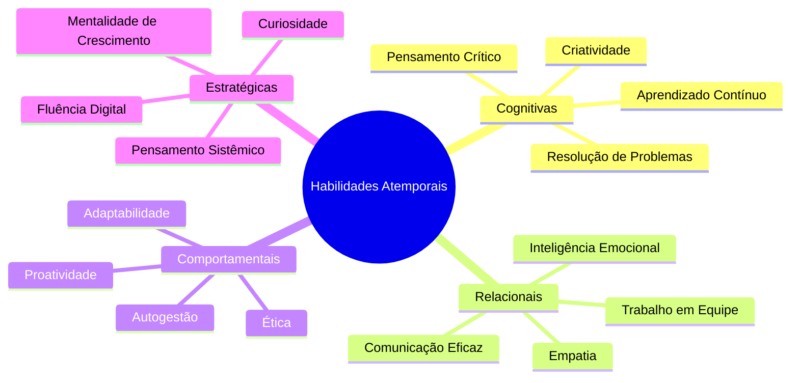
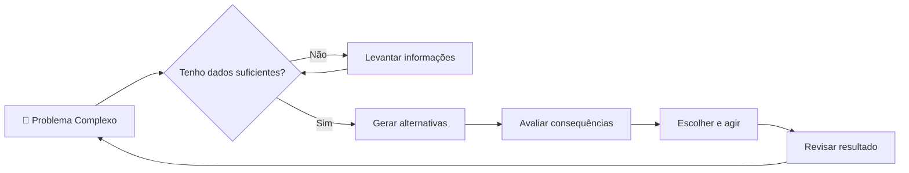
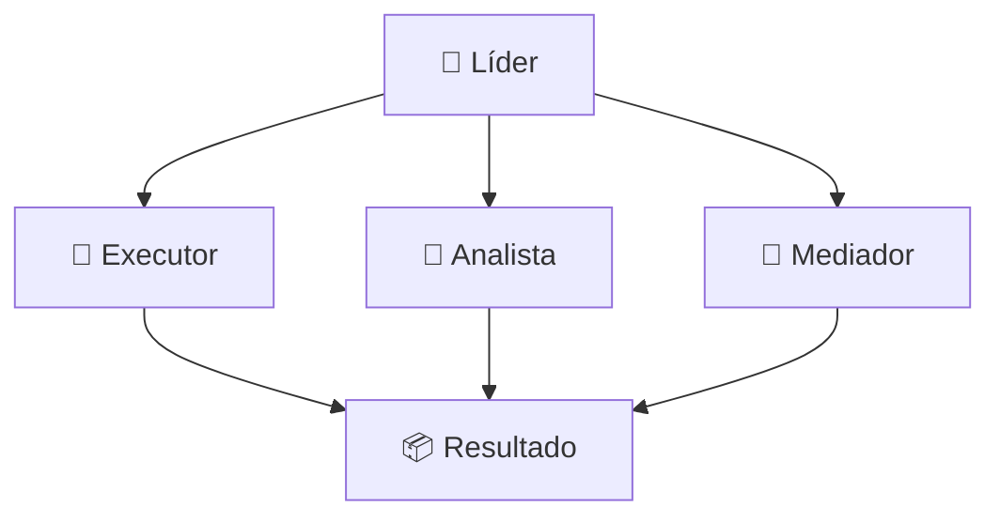
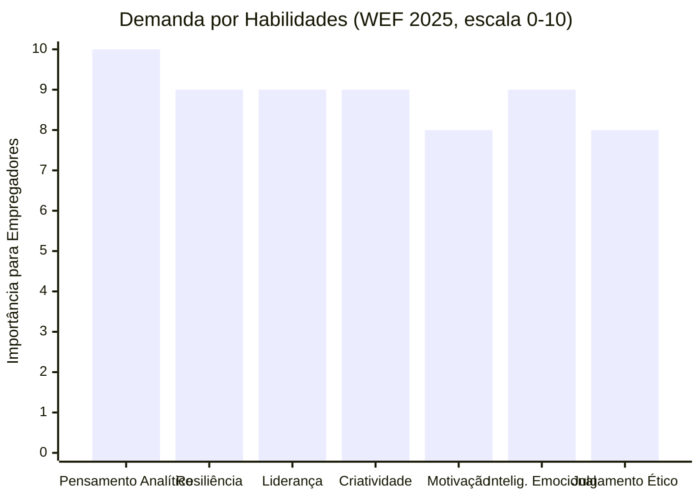
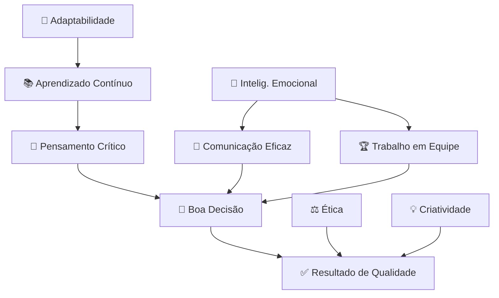

# Habilidades Atemporais

> [!quote] À Prova de Futuro
> *Em um mundo onde a tecnologia está mudando nossa forma de viver e trabalhar, existem habilidades que permanecerão relevantes com o tempo. Devemos dominá-las para nos tornarmos à prova de futuro.*

---

## 🌍 Por Que Isso É Urgente Agora?

> [!warning] ⚡ O Grande Reset de Habilidades (2025)
> O **Future of Jobs Report 2025** do Fórum Econômico Mundial ouviu mais de **1.000 grandes empregadores** representando 14 milhões de trabalhadores em 55 países. A conclusão: **39% das habilidades centrais dos trabalhadores mudarão até 2030**. E 50% dos profissionais precisarão de requalificação ainda nesta década.

### 📊 O Que as Empresas Procuram (Dados Reais 2025-2026)

| Fonte | Dado | Número |
|---|---|---|
| WEF Future of Jobs 2025 | Habilidades cognitivas humanas no topo do ranking | 7 em 10 empresas |
| Indeed Hiring Lab | Vagas no Brasil que citam soft skill como requisito | 43% |
| Sólides (2025) | Demissões causadas por falhas comportamentais, não técnicas | +90% |
| Executivos BR (2025) | "Comunicação e escuta ativa" é a habilidade mais importante | 70,3% |
| WEF (2025) | Pensamento analítico: competência central essencial | #1 ranking |

> [!tip] 💡 O que isso significa pra você?
> Hard skills te colocam no processo seletivo. Soft skills te mantêm empregado e te fazem crescer. Mais de 90% das demissões acontecem por problemas comportamentais, não técnicos.

---

## 🗺️ O Mapa das Habilidades Atemporais



---

## 🌟 Habilidades Valorizadas Globalmente

> [!info] O que Não Pode Ser Automatizado
> Estas são as competências humanas que a tecnologia não substitui.

---

### 1️⃣ Pensamento Crítico e Filosofia Analítica

> [!tip] Descrição
> *Analisar, julgar e argumentar com lógica.*

**Por que é atemporal:** Toda decisão importante, de comprar um produto a votar num candidato, exige análise. A IA pode processar dados; você precisa julgar se esses dados fazem sentido para sua realidade.

**Sinal de alerta:** Você aceita a primeira informação que lê sem questionar a fonte? Esse é o ponto de partida para desenvolver pensamento crítico.

> [!example] 🧪 Atividade: Teste de Pensamento Crítico Online
> **Ação:** Acesse o site [criticalthinking.org](https://www.criticalthinking.org/pages/college-and-university-students/799) ou o teste gratuito de raciocínio lógico do [Queziton](https://queziton.com.br) e complete ao menos 10 questões de lógica/argumentação.
> **Ferramenta:** Celular ou computador com acesso à internet.
> **Resultado observável:** Ao final, anote sua porcentagem de acerto e identifique o tipo de questão em que mais errou (falácias? dados estatísticos? cause e efeito?). Escreva 2 frases sobre o que esse resultado revela do seu raciocínio atual.

---

### 2️⃣ Resolução de Problemas Complexos

> [!tip] Descrição
> *Lidar com incertezas, ambiguidade e decisões difíceis.*

**Por que é atemporal:** Quanto mais a IA resolve problemas simples e repetitivos, mais valorizado fica o profissional que consegue navegar em situações ambíguas, sem resposta pronta, com múltiplas variáveis.

**Exemplo real:** Um engenheiro que sabe usar IA para cálculos ainda precisa decidir qual solução adotar quando os dados apontam direções diferentes.



---

### 3️⃣ Comunicação Eficaz

> [!tip] Descrição
> *Clareza ao falar, escrever e escutar.*

**Por que é atemporal:** 70,3% dos executivos brasileiros apontam comunicação e escuta ativa como a habilidade mais crítica em contratações (pesquisa 2025). Mesmo quem trabalha sozinho com máquinas precisa comunicar resultados, propor ideias e negociar recursos.

**Dimensões da comunicação eficaz:**
- **Falar:** estrutura clara, vocabulário adequado ao público, confiança
- **Escrever:** coesão, objetividade, tom correto
- **Escutar:** atenção ativa, sem interromper, confirmar entendimento
- **Não-verbal:** postura, contato visual, linguagem corporal

> [!example] 🧪 Atividade: Grave Sua Explicação de 2 Minutos
> **Ação:** Escolha um tema que você conhece bem (uma matéria da escola, um jogo, um hobby) e grave um vídeo ou áudio de exatamente 2 minutos explicando esse tema para alguém que nunca ouviu falar dele. Use apenas o cronômetro do celular.
> **Ferramenta:** Câmera ou gravador de voz do celular.
> **Resultado observável:** Assista ou ouça a gravação e responda: (1) Ficou claro do início ao fim? (2) Usou vícios de linguagem ("né", "tipo", "aí")? (3) O tempo foi bem distribuído? Anote 3 pontos concretos para melhorar na próxima gravação.

---

### 4️⃣ Criatividade

> [!tip] Descrição
> *Inovar, imaginar soluções, pensar fora da caixa.*

**Por que é atemporal:** A IA gera conteúdo treinada em padrões existentes. Criar algo genuinamente novo, propor uma solução que ainda não existe, conectar ideias de campos diferentes, é exclusivamente humano.

**Mito desmontado:** Criatividade não é dom. É treino. Músicos praticam escalas; escritores praticam escrever todo dia; designers praticam observar. A criatividade cresce com exercício deliberado.

---

### 5️⃣ Adaptabilidade

> [!tip] Descrição
> *Aprender, desaprender, se ajustar rápido.*

**Por que é atemporal:** O WEF 2025 coloca resiliência, flexibilidade e agilidade como o segundo cluster de habilidades mais importante para empregadores globais. Quem não se adapta, fica obsoleto: isso vale para tecnologias, empresas e também para pessoas.

**Adaptabilidade em 3 níveis:**

| Nível | O que é | Exemplo |
|---|---|---|
| Micro | Ajustar ao novo software, novo colega, nova rotina | Aprender uma ferramenta em 1 semana |
| Médio | Mudar de área ou função dentro da mesma empresa | De suporte técnico para análise de dados |
| Macro | Reinvenção completa de carreira | De operador de máquina para técnico em automação |

---

### 6️⃣ Aprendizado Contínuo (Learning Agility)

> [!tip] Descrição
> *Aprender de forma autônoma. Aprender a ser autodidata.*

**Por que é atemporal:** O conhecimento técnico tem prazo de validade cada vez menor. O WEF estima que 39% das habilidades atuais estarão desatualizadas até 2030. Quem sabe aprender por conta própria nunca fica sem opções.

**O ciclo do autodidata:**

```mermaid
cycle
    Identificar lacuna
    Buscar fonte confiável
    Praticar ativamente
    Testar o aprendizado
    Refletir e ajustar
```

> [!tip] 🎯 Estratégias práticas de aprendizado contínuo
> - **YouTube + PDFs oficiais:** muito conteúdo técnico de qualidade é gratuito
> - **Projetos reais:** aprende-se fazendo, não apenas assistindo
> - **Ensinando:** quem ensina fixa 90% do conteúdo (pirâmide de aprendizado)
> - **Comunidades online:** Discord, fóruns, GitHub, grupos de estudo

---

### 7️⃣ Trabalho em Equipe e Colaboração

> [!tip] Descrição
> *Saber cooperar com diversos perfis.*

**Por que é atemporal:** Projetos complexos exigem múltiplas competências. Saber trabalhar com pessoas que pensam, comunicam e tomam decisões de forma diferente da sua é uma habilidade que multiplica o que qualquer pessoa consegue fazer sozinha.

**Papéis numa equipe funcional:**



---

### 8️⃣ Inteligência Emocional

> [!tip] Descrição
> *Autoconsciência, empatia, controle emocional.*

**Por que é atemporal:** Segundo dados de PwC e McKinsey (2025), inteligência emocional recebe pontuação 9/10 em demanda empresarial, ficando atrás apenas do pensamento crítico. Lidar com conflitos, pressão, frustração e com as emoções dos outros é irreplicável por máquinas.

**Os 5 pilares da inteligência emocional (Daniel Goleman):**

| Pilar | O que significa | Sinal de baixo desenvolvimento |
|---|---|---|
| Autoconsciência | Reconhecer suas próprias emoções | Explodir sem saber por quê |
| Autorregulação | Controlar reações impulsivas | Mandar mensagem raivosa e se arrepender |
| Motivação | Agir por propósito, não só por recompensa | Desistir quando a recompensa demora |
| Empatia | Entender o ponto de vista do outro | Achar que "todo mundo pensa igual" |
| Habilidades sociais | Construir e manter relacionamentos | Evitar conversas difíceis |

> [!example] 🧪 Atividade: Pedir Feedback Real sobre Uma Habilidade Sua
> **Ação:** Escolha uma pessoa de confiança (colega de turma, familiar, amigo próximo) e peça diretamente: *"Qual é a habilidade minha que você acha que precisa melhorar mais? Pode ser honesto."* Ouça sem interromper e sem se defender. Anote a resposta textualmente.
> **Ferramenta:** Conversa presencial ou mensagem de texto/áudio.
> **Resultado observável:** Compare a resposta com sua própria percepção. Se houve surpresa, isso é dado concreto de ponto cego na sua autoconsciência. Escreva 1 ação específica que você pode fazer nos próximos 7 dias para trabalhar essa habilidade.

---

### 9️⃣ Autogestão e Proatividade

> [!tip] Descrição
> *Gerenciar tempo, energia e metas com autonomia.*

**Por que é atemporal:** O trabalho remoto e as novas formas de contratação (freelance, projetos, portfolio) exigem cada vez mais que o profissional seja seu próprio gestor. Quem espera que alguém diga o que fazer fica para trás.

**Autogestão não é workaholismo.** É saber priorizar, descansar estrategicamente e entregar o que importa sem precisar de supervisão constante.

---

### 🔟 Ética e Responsabilidade

> [!tip] Descrição
> *Integridade, confiabilidade e ética no trabalho.*

**Por que é atemporal:** Numa era em que a IA pode gerar deepfakes, espalhar desinformação e automatizar fraudes, a ética humana vira diferencial competitivo e, mais importante, vira filtro de sobrevivência social. Empresas perdem contratos e reputação por falhas éticas de seus funcionários.

> [!warning] ⚠️ Ética na Era da IA
> Usar IA para fazer um trabalho que é seu e entregar como próprio é desonestidade acadêmica. Usar IA como ferramenta para melhorar seu trabalho, com transparência, é competência profissional. A diferença está na intenção e na honestidade.

---

### 1️⃣1️⃣ Curiosidade e Mentalidade de Crescimento

> [!tip] Descrição
> *Desejo constante de aprender e evoluir.*

**Por que é atemporal:** Carol Dweck, pesquisadora de Stanford, demonstrou que pessoas com mentalidade de crescimento (growth mindset) superam pessoas com mentalidade fixa ao longo do tempo, independentemente do ponto de partida. A crença de que se pode melhorar é, em si, uma habilidade.

**Mentalidade fixa vs. crescimento:**

| Situação | Mentalidade Fixa | Mentalidade de Crescimento |
|---|---|---|
| Errou numa prova | "Não sou bom nisso." | "O que posso aprender com esse erro?" |
| Tarefa difícil | "Não vou conseguir." | "Ainda não consegui, mas posso tentar de novo." |
| Alguém foi melhor | "Eles têm talento, eu não." | "O que eles fazem que eu posso aprender?" |

---

### 1️⃣2️⃣ Cultura Digital e Fluência Tecnológica

> [!tip] Descrição
> *Entender e dialogar com tecnologias, mesmo sem ser técnico.*

**Por que é atemporal:** Não é sobre saber programar (embora ajude muito). É sobre não ter medo de tecnologia nova, entender como ela funciona a ponto de usá-la bem e identificar quando ela está sendo usada de forma errada ou manipuladora.

**Fluência digital em 2025-2026 inclui:**
- Usar IA como ferramenta de trabalho (não como bengala)
- Identificar desinformação e deepfakes
- Entender noções básicas de privacidade e segurança digital
- Colaborar em ambientes digitais (docs compartilhados, projetos online)

---

## 📈 O Que o Mercado Diz em 2026

> [!info] 📊 Panorama Atual
> Com o avanço da IA, as empresas estão ficando **mais seletivas**, não menos. O mercado de trabalho de 2026 exige que o profissional traga algo que a IA ainda não entrega: julgamento, empatia, ética e criatividade genuína.



**Tendência skills-based hiring no Brasil:**
- 43% das vagas já citam soft skill como requisito obrigatório (Indeed Hiring Lab, 2025)
- Skills-based hiring supera a exigência de diploma em processos seletivos
- "O que você sabe fazer te coloca no jogo. Como você faz te mantém nele."

---

## 🔗 Como Essas Habilidades Se Conectam



> [!tip] 🎯 Insight-chave
> Nenhuma dessas habilidades existe isolada. Pensamento crítico sem comunicação não chega a lugar nenhum. Criatividade sem trabalho em equipe não se converte em produto. Inteligência emocional sem ética pode ser manipulação. O diferencial está em combinar e integrar.

---

## 🗓️ Plano de 30 Dias: Pratique Uma Habilidade por Semana

| Semana | Foco | Ação Mínima Diária (10 min) |
|---|---|---|
| 1 | Comunicação | Grave 1 áudio explicando algo que aprendeu hoje |
| 2 | Pensamento Crítico | Questione 1 notícia: qual é a fonte? Tem dados? |
| 3 | Inteligência Emocional | Antes de reagir a algo ruim, espere 5 minutos |
| 4 | Aprendizado Contínuo | Aprenda 1 coisa nova por dia e ensine para alguém |

> [!success] 🏁 Meta de 30 dias
> Ao final do mês, você terá praticado as 4 habilidades mais demandadas pelo mercado segundo o WEF 2025: pensamento analítico, resiliência/adaptabilidade, comunicação e aprendizado contínuo. Não como teoria: como prática observável.

---

> [!note] 📚 Fontes (2026)
> - [Future of Jobs Report 2025, World Economic Forum](https://www.weforum.org/publications/the-future-of-jobs-report-2025/) : ranking global de habilidades, 1.000+ empregadores, 55 países
> - [WEF: Jobs of the Future and Skills You Need](https://www.weforum.org/stories/2025/01/future-of-jobs-report-2025-jobs-of-the-future-and-the-skills-you-need-to-get-them/) : pensamento analítico no topo, 39% das skills mudarão até 2030
> - [Skills em Alta 2026, QueroBoisa](https://querobolsa.com.br/revista/skills) : 9 competências-chave para 2026 no mercado brasileiro
> - [Com Avanço da IA, Empresas Buscam Soft Skills, Brazil Economy](https://brazileconomy.com.br/2025/12/seletividade-rigorosa/) : seletividade rigorosa em 2026
> - [Soft Skills: 10 Competências Mais Valorizadas em 2026, Vagas.com](https://www.vagas.com.br/blog/candidatos/competencias-mais-valorizadas/) : dados do mercado BR
> - [Habilidades Humanas no Futuro do Trabalho, RH Pra Você](https://rhpravoce.com.br/colab/habilidades-humanas-no-futuro-do-trabalho) : 90% demissões por falhas comportamentais
> - [Soft Skills na Era da IA, LEADedu](https://www.leadedu.com.br/en/blog/soft-skills-na-era-da-inteligencia-artificial-conheca-as-habilidades-essenciais) : inteligência emocional 9/10 em demanda empresarial
> - [Skill-Based Hiring, CIEE-PR](https://cieepr.org.br/blog/skill-based-hiring-conheca-a-tendencia-que-esta-mudando-o-recrutamento/) : 43% vagas BR citam soft skill como requisito (Indeed Hiring Lab)
