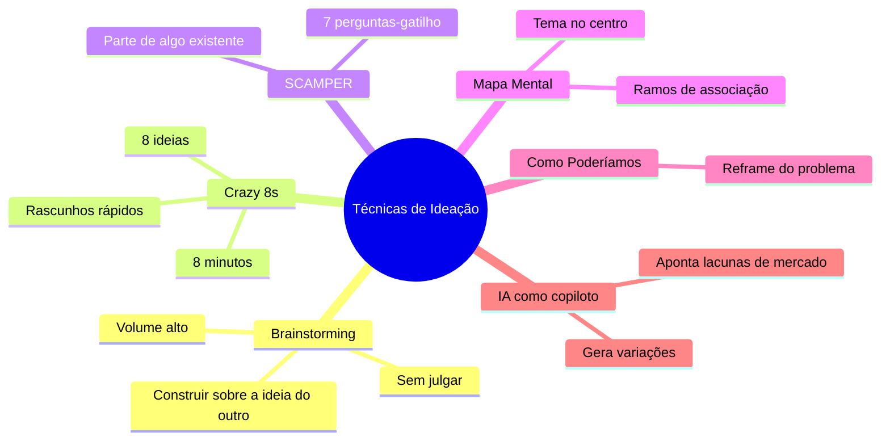
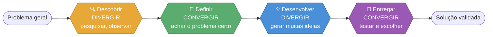
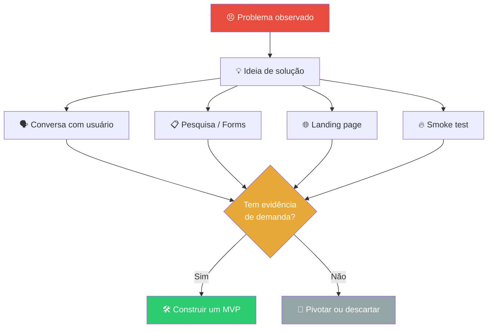
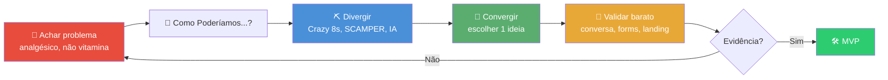

# Idealização

> [!quote] Da Ideia à Validação
> *A ideia genial que ninguém validou costuma valer menos que a ideia mediana que já tem cinco usuários esperando. Antes de construir, descubra se alguém realmente quer.*

> [!info] O que você vai aprender
> Como sair de "tenho um problema" até "tenho uma ideia que alguém pagaria para usar", sem gastar meses construindo algo que ninguém quer. O caminho é: **achar um bom problema → gerar muitas ideias → escolher uma → testar barato**.

---

## 🎯 Achar um Problema que Vale a Pena

> [!tip] Comece pelo problema, não pela solução
> O erro clássico do iniciante é se apaixonar por uma solução ("vou fazer um app de IA!") antes de saber qual dor ela resolve. Boas ideias nascem de **problemas reais e frequentes**.

Uma forma simples de filtrar problemas é a metáfora **vitamina vs. analgésico**:

| Tipo | O que é | Exemplo | Vale a pena? |
|------|---------|---------|--------------|
| 💊 **Analgésico** | Resolve uma dor urgente e concreta | "Perco notas de aula soltas em 5 apps" | Sim, gera adoção |
| 🍊 **Vitamina** | Benefício indireto, "seria bom ter" | "App que talvez melhore meu foco" | Difícil engajar |

> [!info] Jobs to be Done (JTBD)
> Em vez de perguntar "que produto quero fazer?", pergunte **"que tarefa a pessoa está tentando concluir?"**. As pessoas não querem uma furadeira, querem um **furo na parede**. Pontos de dor só existem dentro de uma tarefa que alguém quer realizar.

> [!tip] Onde caçar problemas em 2026
> - **Sua própria rotina:** o que te irrita toda semana?
> - **Comunidades:** Reddit, grupos de WhatsApp/Discord, comentários do YouTube ("alguém sabe como...?")
> - **Reviews 1-2 estrelas** de produtos existentes: reclamação = oportunidade
> - **Tendências:** o que está crescendo (ferramentas de IA, automação) mas ainda mal resolvido?

---

## 🍃 Como Poderíamos...? (How Might We)

> [!info] A pergunta que abre a ideação
> Antes de gerar ideias, transforme o problema numa pergunta convidativa que começa com **"Como poderíamos...?"** (em inglês, *How Might We*, HMW). Ela é otimista (sugere que há solução), aberta (não impõe uma resposta) e focada.

| Reclamação (fechada) | Como Poderíamos...? (aberta) |
|----------------------|------------------------------|
| "Alunos esquecem os prazos" | Como poderíamos lembrar os alunos dos prazos de forma que eles não ignorem? |
| "O cardápio do RU é confuso" | Como poderíamos ajudar o aluno a decidir o que comer em 10 segundos? |

> [!tip] Regra de ouro do HMW
> Não muito amplo ("como poderíamos melhorar a educação?" = paralisa), não muito estreito ("como poderíamos colocar um botão vermelho?" = já é a solução). Fique no meio: específico no problema, livre na solução.

---

## ⛏️ Técnicas de Ideação

> [!info] Quantidade gera qualidade
> Na fase de gerar ideias, a regra é **adiar o julgamento**: quanto mais ideias, maior a chance de uma boa aparecer. Ideia "ruim" puxa ideia boa. Critique depois.

---

### 💥 Crazy 8s

> [!tip] 8 ideias em 8 minutos
> Dobre uma folha em 8 partes. Coloque um cronômetro de 8 minutos. Faça **um rascunho de ideia por quadrado**, 1 minuto cada. O tempo curto é proposital: não dá pra ser perfeccionista, então o cérebro larga a primeira ideia óbvia e parte para alternativas.

---

### 🔄 SCAMPER

> [!info] Transformar o que já existe
> SCAMPER é uma checklist de 7 perguntas-gatilho aplicadas a um produto que já existe. Cada letra força um ângulo novo.

| Letra | Pergunta-gatilho | Exemplo aplicado a um caderno escolar |
|-------|------------------|----------------------------------------|
| **S** ubstituir | O que dá pra trocar? | Trocar papel por app de notas |
| **C** ombinar | O que dá pra juntar? | Caderno + gravador de áudio da aula |
| **A** daptar | O que dá pra adaptar de outro lugar? | Trazer "curtidas" das redes sociais |
| **M** odificar | O que ampliar ou reduzir? | Versão mínima só com checklist |
| **P** ôr em outro uso | Pra que mais serviria? | Caderno vira portfólio compartilhável |
| **E** liminar | O que dá pra remover? | Tirar capas, deixar só o essencial |
| **R** everter | E se invertesse a ordem? | O professor preenche, o aluno completa |

---

### 🧠 Mapa Mental

> [!tip] Pensamento em ramos
> Coloque o tema no **centro** e vá puxando ramos de associação livre. Cada ramo gera sub-ramos. É ótimo para explorar um tema amplo antes de focar. Você vai fazer um na atividade abaixo.

---

## 🤖 IA como Copiloto de Ideação (2026)

> [!info] A IA não tem a ideia por você, ela amplia a sua
> Em 2026, usar uma IA (ChatGPT, Claude, Copilot) como **parceiro de brainstorming** é padrão. Ela quebra vieses, gera variações em segundos e aponta o que já existe no mercado. Mas toda sugestão precisa de **verificação humana**: a IA inventa, exagera e não conhece seu contexto real.

> [!tip] Como prompar bem para ideação
> 1. **Dê contexto e restrições:** público, orçamento, plataforma, tempo. Prompt vago gera ideia genérica.
> 2. **Peça um método:** "Faça um SCAMPER sobre [produto]" rende mais que "me dê ideias".
> 3. **Peça lacunas de mercado:** "Liste o que já existe para [problema] e onde estão os pontos fracos."
> 4. **Trate como rascunho:** a IA acelera o divergir; quem decide é você.

> [!warning] O risco da "ideia genial" da IA
> Uma ideia que parece brilhante na conversa com a IA ainda não foi validada por nenhum humano real. A IA confirma com entusiasmo quase tudo. Saída da conversa ≠ demanda do mercado.

---

## 🔷 Divergir e Convergir: o Duplo Diamante

> [!info] Dois movimentos, repetidos duas vezes
> Todo processo de criação alterna entre **divergir** (abrir, explorar, gerar muitas opções sem julgar) e **convergir** (fechar, decidir, escolher o melhor). O modelo do **Duplo Diamante**, formalizado pelo Design Council (Reino Unido), mostra que isso acontece **duas vezes**: uma para entender o problema, outra para criar a solução.

![[double-diamond.jpg|Duplo Diamante: Descobrir, Definir, Desenvolver, Entregar]]

> [!danger] O erro de pular para a solução
> A maior armadilha é **convergir cedo demais**: escolher a primeira ideia antes de entender o problema de verdade. O primeiro diamante existe justamente para te segurar nesse impulso. Entenda o problema antes de se apaixonar pela solução.

---

## 🧪 Validar Rápido e Barato

> [!info] Validar é buscar evidência, não confirmação
> Depois de escolher uma ideia, o objetivo é descobrir **o mais rápido e barato possível** se ela resolve uma dor real, antes de construir o produto inteiro. A meta saudável: validar em **4 a 6 semanas**. Se está demorando mais, provavelmente você está construindo demais ou fugindo da verdade.

| Técnica | O que é | Custo | Sinal que você busca |
|---------|---------|-------|----------------------|
| 🗣️ **Conversa com usuário** | 5 a 20 entrevistas curtas sobre a dor | Quase zero | Os mesmos problemas se repetem |
| 📋 **Pesquisa / survey** | Formulário com público maior | Zero | Padrões quantitativos |
| 🌐 **Landing page** | Página descrevendo o produto + botão "quero" | Baixo | Taxa de cadastro / cliques |
| 🔥 **Smoke test** | Oferecer o produto que ainda não existe | Baixo | Alguém tenta comprar / se inscrever |
| 🛠️ **MVP** | Versão mínima que entrega o valor central | Médio | Uso real e recorrente |

> [!tip] MVP de "Concierge" (o truque do iniciante)
> Você não precisa programar para validar. Entregue o serviço **na mão**, manualmente, para os primeiros usuários. Quer validar um "agente de viagens com IA"? Monte as viagens você mesmo no começo. Se ninguém quer nem a versão manual, o app automático também não venderia.

> [!warning] Cuidado com o falso "sim"
> Amigos e familiares dizem "que ideia legal!" por educação. Isso **não é validação**. Sinal real é comportamento: a pessoa se cadastra, paga, indica, ou pelo menos para tudo para te contar a dor dela. Pergunte sobre o passado ("como você resolve isso hoje?"), não sobre o futuro ("você usaria?").

---

## 🗺️ Juntando Tudo: do Problema à Decisão

> [!success] A grande lição
> Idealizar não é ter um lampejo de genialidade no chuveiro. É um **processo**: caçar dores reais, gerar muitas ideias, escolher com critério e testar com o menor custo possível. A ideia só vira projeto quando o mercado responde.

---

## 🧰 Atividades Mão na Massa

> [!example] 🧪 Atividade 1: Mapa de Ideias no Excalidraw
>
> **Ferramenta:** [excalidraw.com](https://excalidraw.com) (grátis, sem login)
>
> **O que fazer:**
> 1. Escolha **um problema real** que te incomoda no IFF ou no dia a dia (ex.: achar sala vaga para estudar, organizar trabalhos em grupo).
> 2. Acesse o Excalidraw e escreva o problema **no centro** da tela.
> 3. Puxe ramos com possíveis soluções. De cada solução, puxe sub-ramos (variações, públicos, recursos). Mire em **pelo menos 12 ideias**.
> 4. Pinte de verde as 2 ideias que mais parecem **analgésico** (dor urgente).
>
> **Resultado observável (artefato):** o mapa mental no Excalidraw, exportado como **PNG** (menu → Export image), com o problema no centro, 12+ ideias nos ramos e as 2 favoritas em verde.

---

> [!example] 🧪 Atividade 2: SCAMPER sobre um Produto Real
>
> **Ferramenta:** [excalidraw.com](https://excalidraw.com) ou [whimsical.com](https://whimsical.com) (grátis)
>
> **O que fazer:**
> 1. Escolha um produto que você usa (ex.: app de transporte, marmita, mochila, plataforma de aula).
> 2. Crie **7 caixas** na ferramenta, uma para cada letra do SCAMPER (Substituir, Combinar, Adaptar, Modificar, Pôr em outro uso, Eliminar, Reverter).
> 3. Em cada caixa, escreva **uma variação concreta** do produto gerada por aquela pergunta-gatilho. Nada de "melhorar": tem que ser uma mudança específica e descrita.
>
> **Resultado observável (artefato):** o board com as **7 variações escritas**, uma por letra. Marque com uma estrela a variação que você acha que poderia virar um produto de verdade.

---

> [!example] 🧪 Atividade 3: Validar com uma Pesquisa Real (Google Forms)
>
> **Ferramenta:** [forms.google.com](https://forms.google.com) (grátis, conta Google)
>
> **O que fazer:**
> 1. Pegue **uma** das ideias geradas nas atividades anteriores.
> 2. Crie um Google Forms curto (4 a 6 perguntas) focado no **comportamento atual**, não no futuro. Exemplos de boas perguntas:
>    - "Com que frequência você enfrenta [o problema]?"
>    - "Como você resolve isso hoje?"
>    - "Quanto tempo/dinheiro isso te custa?"
>    - "Deixe seu e-mail se quiser testar uma solução." (mede interesse real)
> 3. Compartilhe o link com colegas e colete **pelo menos 5 respostas reais**.
>
> **Resultado observável (artefato):** print da aba **"Respostas"** do Forms mostrando 5+ respostas, com uma frase sua: o problema se confirmou ou não? Por quê?
>
> **Desafio extra:** crie uma landing page de 1 página no [carrd.co](https://carrd.co) (grátis, até 3 sites) descrevendo a solução com um botão "Quero testar" e veja quantos colegas clicam.

---

> [!question] 🧠 Quiz rápido (conceitual, opcional)
> 1. Qual é mais fácil de validar: um produto "vitamina" ou "analgésico"? Por quê?
> 2. O que significa "divergir" e "convergir"? Em que ordem aparecem no Duplo Diamante?
> 3. Por que "minha família disse que adorou a ideia" não conta como validação?
> 4. Cite duas formas de validar uma ideia **sem escrever uma linha de código**.

---

> [!note] 📚 Fontes (2026)
> - [What is Ideation? (atualizado 2026) | Interaction Design Foundation](https://ixdf.org/literature/topics/ideation)
> - [What is Brainstorming? 10 Effective Techniques (atualizado 2026) | IxDF](https://ixdf.org/literature/topics/brainstorming)
> - [10 Powerful Ideation Techniques to Unleash Creative Thinking in 2026 | ITONICS](https://www.itonics-innovation.com/blog/powerful-ideation-techniques)
> - [Crazy Eights Template & Example for Teams | Miro](https://miro.com/templates/crazy-eights/)
> - [Double Diamond Design Process Explained (2026) | UXPin](https://www.uxpin.com/studio/blog/double-diamond-design-process/)
> - [The Double Diamond Process: From Problems to Solutions | Maze](https://maze.co/blog/double-diamond-design-process/)
> - [Startup Validation Framework 2026: How to Test Ideas Fast | Presta](https://wearepresta.com/startup-validation-framework-2026-the-ultimate-guide-to-testing-ideas/)
> - [Landing Page to MVP in 2026: The Lean Path | Valtorian](https://www.valtorian.com/blog/landing-to-mvp)
> - [Validating Your Startup Idea: The Lean Customer Feedback Playbook | Altar.io](https://altar.io/validating-your-startup-idea-lean-customer-feedback-playbook/)
> - [Is Your Product a 'Vitamin' or 'Painkiller?' | Entrepreneur](https://www.entrepreneur.com/starting-a-business/is-your-product-a-vitamin-or-painkiller/230736)
> - [Pain points only exist within the context of jobs-to-be-done](https://scully.substack.com/p/pain-points-only-exist-within-the)
> - [75+ ChatGPT Prompts for Ideation in Innovation | ITONICS](https://www.itonics-innovation.com/blog/chatgpt-prompts-for-ideation)
> - Imagem: [Double Diamond Design Model, Wikimedia Commons (J.A. Nychka, Univ. of Alberta, CC BY-SA)](https://commons.wikimedia.org/wiki/File:Double_diamond_design_model_2021.jpg)
