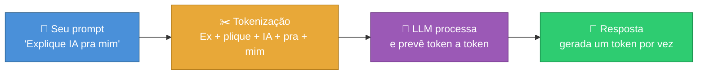
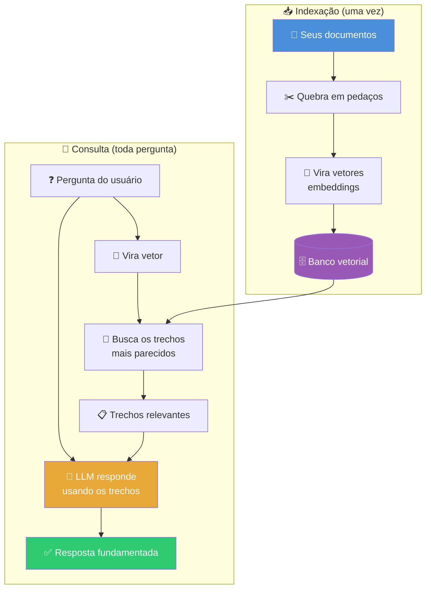
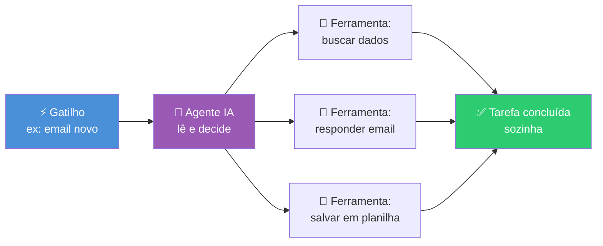
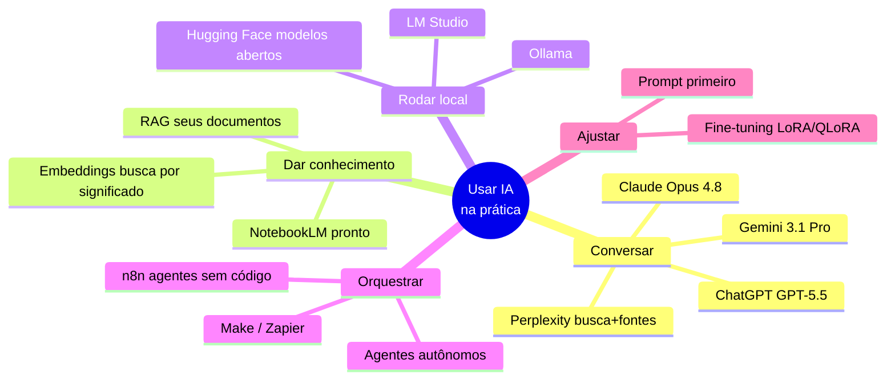

# Inteligência Artificial

> [!quote] O diferencial não é saber, é usar
> *Saber sobre IA virou commodity: está a 5 segundos de distância. Quem larga na frente é quem **usa e orquestra** essas ferramentas no trabalho real, todo dia.*

> [!info] 🧭 Esta aula é a parte PRÁTICA (mão na massa)
> A teoria de IA (o que é, história, tipos, redes neurais, ética) já está em outras disciplinas, **não vamos repetir**:
> - [[Tópicos/Fundamentos da computação/Inteligência Artificial|IA em Fundamentos da Computação]]: conceitos, machine learning, redes neurais, deep learning.
> - [[Tópicos/Empreendedorismo/Inteligência Artificial|IA em Empreendedorismo]]: IA aplicada a negócios, marca, automação comercial.
> - **Aqui (Roadmap do Futuro):** como você, na prática, conversa com a IA, dá memória e conhecimento a ela, e a coloca pra trabalhar sozinha.
>
> Ferramentas com aula própria neste módulo: [[Ollama - gerenciamento de modelos de IA|Ollama]], [[N8N - automações visuais sem código|n8n]], [[Vibe Coding - programação com IA|Vibe Coding]], [[Fluxos e orquestração|Fluxos e Orquestração]].

---

## 🧠 LLM: o que é, na prática

Um **LLM** (Large Language Model, modelo de linguagem grande) é, no fundo, uma **máquina de adivinhar a próxima palavra**. Você dá um começo de texto, ele calcula qual pedaço de palavra é mais provável vir em seguida, escreve, e repete. ChatGPT, Claude e Gemini são todos LLMs com essa mesma mecânica por baixo.

> [!tip] Analogia do teclado turbinado
> Pense no corretor do celular que sugere a próxima palavra. Um LLM é isso levado ao extremo: treinado em quase toda a internet, ele não sugere uma palavra, ele escreve textos, códigos e respostas inteiras, mantendo o contexto da conversa.

A arquitetura que tornou isso possível se chama **Transformer** (2017). O detalhe que importa pra você: o mecanismo de **atenção** deixa o modelo "olhar" pra todas as palavras ao mesmo tempo e pesar quais importam mais. É por isso que ele entende contexto tão bem.

![[Recursos/Roadmap do futuro/Inteligência artificial/transformer.png|Arquitetura Transformer: a base dos LLMs modernos]]

> [!warning] Ele não "sabe", ele prevê
> O LLM gera o texto **mais provável**, não o **mais verdadeiro**. Quando ele inventa um fato com confiança (uma lei que não existe, uma data errada), isso se chama **alucinação**. Regra de sobrevivência: para qualquer informação crítica, **confira a fonte**. As técnicas de RAG (mais abaixo) existem em parte para reduzir isso.

---

## 🔤 Tokens e Contexto: a "memória" da conversa

A IA não lê letras nem palavras inteiras: ela quebra o texto em **tokens** (pedaços de palavra). Uma regra de bolso útil em português: **1 token ≈ 0,75 palavra**, ou **100 tokens ≈ 75 palavras**.

A **janela de contexto** é o tamanho máximo de tokens que o modelo "enxerga" de uma vez, **somando o que você manda + o que ele responde + todo o histórico da conversa**. É a memória de curto prazo da IA.

> [!info] Por que a conversa "esquece" coisas
> Quando você ultrapassa a janela de contexto, o modelo **descarta as partes mais antigas** silenciosamente. Por isso, numa conversa muito longa, a IA parece esquecer o que foi combinado no começo. Solução prática: comece uma conversa nova e cole só o que importa, ou peça um resumo antes de continuar.

| Modelo (2026) | Janela de contexto aprox. | Equivale a ler |
|---|---|---|
| GPT-5.5 | ~1.000.000 tokens | um livro grosso inteiro |
| Gemini 3.1 Pro | ~1.000.000 tokens | um livro grosso inteiro |
| Claude Opus 4.8 | ~200.000 a 1.000.000 tokens | centenas de páginas |
| Modelo local 8B (no seu PC) | ~8.000 a 128.000 tokens | de um capítulo a um livro fino |

> [!tip] Contexto custa
> Janela maior = mais caro e mais lento, porque o preço das APIs é por token processado. E cuidado: contexto grande **anunciado** não garante que o modelo realmente **use** tudo, ele tende a prestar mais atenção ao começo e ao fim. Coloque o essencial nas pontas do prompt.

---

## ✍️ Prompting eficaz: falar com a IA do jeito certo

A qualidade da resposta é diretamente proporcional à qualidade do prompt. "Me faça um texto" gera lixo genérico. Um bom prompt tem **papel + tarefa + contexto + formato**.

| Técnica | O que é | Quando usar |
|---|---|---|
| **Zero-shot** | Pedir direto, sem exemplo | Tarefas simples e comuns |
| **Few-shot** | Dar 2-3 exemplos do resultado que você quer | Quando o formato importa (a IA copia o padrão) |
| **Chain-of-thought** | Pedir "pense passo a passo" | Lógica, matemática, depuração, decisão |
| **Papel (role)** | "Aja como um professor de redes..." | Ajustar tom e profundidade |

> [!example] Prompt fraco vs. prompt forte
> ❌ **Fraco:** `escreva sobre redes de computadores`
> ✅ **Forte:** `Aja como um professor de ensino técnico. Explique a diferença entre TCP e UDP para alunos do 2º ano, em no máximo 5 frases, usando uma analogia com os Correios. Termine com 1 pergunta de fixação.`

---

> [!example] 🧪 Atividade 1: O mesmo pedido, dois prompts
>
> **Ferramenta:** [chatgpt.com](https://chatgpt.com), [claude.ai](https://claude.ai) ou [gemini.google.com](https://gemini.google.com) (qualquer um, plano grátis serve)
>
> **O que fazer:**
> 1. Abra a ferramenta e mande o **prompt fraco**: `me explica o que é uma API`
> 2. Em uma conversa **nova**, mande o **prompt forte**: `Aja como um instrutor de programação. Explique o que é uma API para um iniciante absoluto, em no máximo 4 frases, usando a analogia de um garçom de restaurante. Depois dê 1 exemplo real de API que uso no dia a dia sem perceber.`
> 3. Cole as duas respostas lado a lado num documento.
>
> **Resultado observável (o que entregar):** as duas respostas + 3 diferenças concretas que você anotou (tamanho, analogia, exemplo, vocabulário). Qual ficou mais útil e por quê?

---

> [!example] 🧪 Atividade 2: Comparar dois modelos na mesma tarefa
>
> **Ferramenta:** dois LLMs diferentes (ex: [ChatGPT](https://chatgpt.com) **e** [Gemini](https://gemini.google.com))
>
> **O que fazer:**
> 1. Cole **exatamente o mesmo prompt** nos dois: `Você é um avaliador rigoroso. Liste 3 erros comuns que iniciantes cometem ao usar IA e, para cada um, dê 1 correção prática. Seja específico.`
> 2. Faça uma tabelinha comparando: clareza, profundidade, e se algum dos dois **alucinou** (inventou algo).
>
> **Resultado observável:** a tabela comparativa preenchida + sua escolha de qual modelo respondeu melhor **nessa tarefa específica** (eles variam por tipo de tarefa).

---

## 📚 Embeddings e RAG: dando memória e conhecimento à IA

Um LLM "puro" só sabe o que estava nos dados de treino, e nada sobre os **seus** arquivos. O **RAG** (Retrieval-Augmented Generation, geração aumentada por recuperação) resolve isso: antes de responder, o sistema **busca trechos relevantes nos seus documentos** e os entrega ao modelo junto com a pergunta.

A mágica da busca são os **embeddings**: cada trecho de texto vira uma **lista de números** (um vetor) que representa o seu *significado*. Textos com sentido parecido ficam com vetores próximos. Assim a busca acha por **significado**, não por palavra exata.

![[Recursos/Roadmap do futuro/Inteligência artificial/rag.png|Pipeline de RAG: a pergunta e os documentos viram vetores, recuperam o contexto certo e alimentam o LLM]]

> [!success] Por que RAG é tão usado
> - Dá à IA **conhecimento atualizado e privado** (seus PDFs, manuais, notas) sem retreinar nada.
> - **Reduz alucinação:** o modelo responde com base no que foi recuperado, e pode até citar a fonte.
> - É como dar uma **prova com consulta**: em vez de decorar tudo, o modelo "abre o livro" na página certa antes de responder.

---

> [!example] 🧪 Atividade 3: Testar um RAG real de graça
>
> **Ferramenta:** [NotebookLM (Google)](https://notebooklm.google.com) , um RAG pronto, gratuito e em português. (Alternativa: subir um PDF no [claude.ai](https://claude.ai) ou [ChatGPT](https://chatgpt.com).)
>
> **O que fazer:**
> 1. Acesse o NotebookLM, crie um notebook e faça **upload de um PDF seu** (um trabalho, uma apostila, um artigo, qualquer documento de texto).
> 2. Pergunte algo que só esteja **dentro daquele documento**: ex. `Qual a conclusão do autor sobre X?` ou `Resuma a seção 3 em 3 tópicos.`
> 3. Repare que a resposta vem com **citação do trecho** de onde saiu (clique na citação e confira).
> 4. Agora pergunte algo que **não** está no documento e veja como ele se comporta.
>
> **Resultado observável:** uma resposta correta extraída do **seu** arquivo, com a citação da fonte clicada e conferida + a comparação com o comportamento na pergunta fora do escopo. Isso é RAG funcionando.

---

## 🎯 Fine-tuning: quando vale (e quando não)

**Fine-tuning** é pegar um modelo pronto e **continuar o treino** com seus próprios exemplos, ajustando os "pesos" dele. A versão barata e moderna disso é o **LoRA / QLoRA**, que treina só uns "adaptadores" pequenos e roda até numa GPU de consumidor.

> [!info] A regra de ouro de 2026
> A ordem certa de tentar é: **Prompt → RAG → Fine-tuning**. Comece pelo mais barato.
> - **Prompt:** grátis, instantâneo, reversível. Resolve a maioria dos casos.
> - **RAG:** quando o problema é **conhecimento** (fatos, seus documentos, coisas que mudam).
> - **Fine-tuning:** quando o problema é **comportamento** (um tom, um formato rígido, um estilo repetido em escala). *"RAG é pra fatos; fine-tuning é pra forma."*

| Situação | Melhor abordagem |
|---|---|
| "A IA não conhece o manual da minha empresa" | **RAG** |
| "Quero que ela responda sempre no meu tom de voz da marca" | **Fine-tuning** |
| "Preciso de respostas mais detalhadas só hoje" | **Prompt** (peça melhor) |
| "Quero um modelo menor e mais rápido imitando um grande" | **Fine-tuning (distilação)** |

> [!warning] Fine-tuning quase nunca é o primeiro passo
> Custa dados, tempo e dinheiro, e **não serve pra ensinar fatos novos** (pra isso, RAG). Só parta pra ele depois que prompt e RAG não derem conta.

---

## 💻 Rodando IA localmente (no seu PC)

Você não precisa pagar API nem mandar seus dados pra nuvem: dá pra **rodar um LLM no seu computador**. Vantagens: **privacidade total**, **custo zero por uso** e funciona **offline**. Custo: precisa de hardware (de preferência uma GPU) e os modelos locais são menores que os de ponta.

A porta de entrada mais fácil é o **Ollama**. ➡️ Aula dedicada: [[Ollama - gerenciamento de modelos de IA]]

> [!tip] O número antes do "B" é o tamanho
> Modelos vêm em tamanhos: 7B, 8B, 27B, 70B... o "B" é **bilhões de parâmetros**. Maior = mais inteligente, porém mais pesado. Para PC comum (8 GB), modelos como **Llama 3.1 8B** ou **Gemma 3 4B** rodam bem. Para máquinas fortes (24 GB+), dá pra rodar **Qwen 27B** ou **Llama 70B**.

| Ferramenta | Para quê | Tipo |
|---|---|---|
| **Ollama** | Rodar modelos via terminal, simples | Linha de comando |
| **LM Studio** | Mesma ideia, com interface gráfica | App visual |
| **Hugging Face** | O "GitHub da IA": baixar modelos e **testar no navegador** (Spaces) | Repositório + demos |

---

> [!example] 🧪 Atividade 4: Testar um modelo no Hugging Face (sem instalar nada)
>
> **Ferramenta:** [Hugging Face Spaces](https://huggingface.co/spaces)
>
> **O que fazer:**
> 1. Acesse os Spaces e use a busca por `chat` (ou abra um Space de chat em destaque, ex. um modelo aberto como Qwen ou Llama rodando ali).
> 2. Mande o mesmo prompt forte da Atividade 1 e leia a resposta.
> 3. Compare **mentalmente** com a resposta que um ChatGPT/Gemini deu: o modelo aberto ficou perto? Onde perdeu?
>
> **Resultado observável:** a resposta do modelo aberto rodando no navegador + sua avaliação de 1 ponto em que ele foi bem e 1 em que ficou atrás dos grandes. (Quem tiver máquina boa: instale o Ollama e repita o teste local, seguindo a aula do [[Ollama - gerenciamento de modelos de IA|Ollama]].)

---

## 🤖 Agentes e Orquestração: a IA trabalhando sozinha

Um **agente de IA** é um passo além do chatbot: em vez de só responder, ele **decide, usa ferramentas e executa tarefas de vários passos** para atingir um objetivo (buscar na web, preencher um formulário, mandar um email, consultar um sistema). Ele percebe, raciocina e age, com pouca intervenção sua.

A forma mais acessível de montar agentes e automações **sem programar** é com ferramentas visuais como o **n8n**, onde você conecta blocos (gatilho → IA → ações) num fluxograma. ➡️ Aulas dedicadas: [[N8N - automações visuais sem código]] e [[Fluxos e orquestração]].

> [!info] Chatbot vs. Agente
> **Chatbot:** você pergunta, ele responde. Para por aí. **Agente:** você dá um objetivo, ele monta os passos, usa ferramentas e **age** até concluir. É a fronteira mais quente da IA em 2026.

---

## 🗺️ Ecossistema de IA em 2026 (mapa mental)

| Ferramenta | Melhor para | Grátis? |
|---|---|---|
| [ChatGPT](https://chatgpt.com) | Uso geral, escrita, código | Sim (plano básico) |
| [Claude](https://claude.ai) | Textos longos, análise de documentos, código | Sim (plano básico) |
| [Gemini](https://gemini.google.com) | Pesquisa, multimodal, ecossistema Google | Sim |
| [Perplexity](https://www.perplexity.ai) | Pesquisa com fontes citadas | Sim |
| [NotebookLM](https://notebooklm.google.com) | RAG dos seus PDFs, sem código | Sim |
| [Ollama](https://ollama.com) | IA local e privada | Sim (open source) |
| [Hugging Face](https://huggingface.co) | Baixar/testar modelos abertos | Sim |
| [n8n](https://n8n.io) | Automações e agentes visuais | Sim (open source) |

> [!tip] Como começar HOJE
> 1. Escolha **um** assistente e use de verdade numa tarefa real esta semana.
> 2. Pratique **prompt forte** (papel + tarefa + contexto + formato).
> 3. Suba um PDF no **NotebookLM** e veja o RAG funcionando.
> 4. Tem máquina boa? Instale o **[[Ollama - gerenciamento de modelos de IA|Ollama]]**.
> 5. Pensou numa tarefa chata e repetitiva? Esboce um agente no **[[N8N - automações visuais sem código|n8n]]**.

---

> [!note] 📚 Fontes (2026)
> - [Best AI Models in June 2026: ChatGPT, Claude, Gemini & Grok (Fello AI)](https://felloai.com/best-ai-models/)
> - [AI Updates Today, June 2026 (LLM-Stats)](https://llm-stats.com/llm-updates)
> - [Qual a melhor IA em 2026? (Mindtek)](https://www.mindtek.com.br/2026/05/qual-a-melhor-ia-2026/)
> - [LLM Context Window Comparison 2026 (Morph)](https://www.morphllm.com/llm-context-window-comparison)
> - [Context Windows Explained (DataAnnotation)](https://www.dataannotation.tech/blog/llm-context-window)
> - [Prompt Engineering Techniques: Top 6 for 2026 (K2view)](https://www.k2view.com/blog/prompt-engineering-techniques/)
> - [7 Prompt Engineering Techniques That Work in 2026 (DEV)](https://dev.to/honestai/7-prompt-engineering-techniques-that-actually-work-in-2026-with-real-examples-3aj1)
> - [What is RAG? (IBM)](https://www.ibm.com/think/topics/retrieval-augmented-generation)
> - [RAG in 2026: How Retrieval-Augmented Generation Works (Atlan)](https://atlan.com/know/what-is-rag/)
> - [RAG vs. Fine-Tuning vs. Prompting: 2026 Strategic Guide (DEV)](https://dev.to/muzammil_endevsols/rag-vs-fine-tuning-vs-prompting-2026-strategic-guide-169l)
> - [Fine-Tuning LLMs 2026: LoRA, QLoRA & When to Bother](https://aidevdayindia.org/blogs/fine-tuning-llms-lora-qlora/fine-tuning-llms-lora-qlora.html)
> - [Best Ollama Models in 2026 (WhatLLM)](https://whatllm.org/best-ollama-models)
> - [What Are AI Agents? (IBM)](https://www.ibm.com/think/topics/ai-agents)
> - [n8n Guide 2026: Features & Workflow Automation (Hatchworks)](https://hatchworks.com/blog/ai-agents/n8n-guide/)
> - Imagens: [Transformer architecture](https://commons.wikimedia.org/wiki/File:Transformer,_full_architecture.png) e [RAG schema](https://commons.wikimedia.org/wiki/File:RAG_schema.svg) (Wikimedia Commons).
