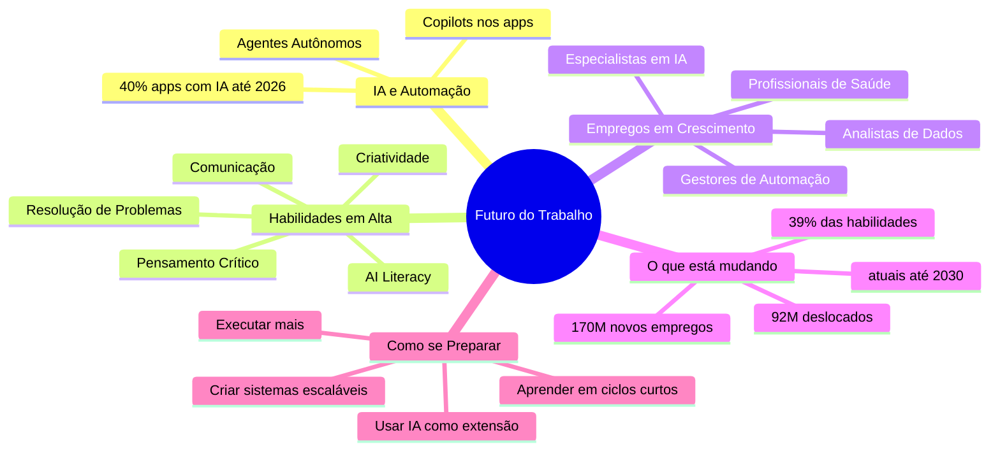
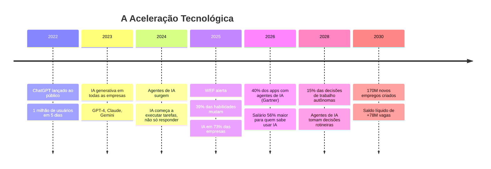
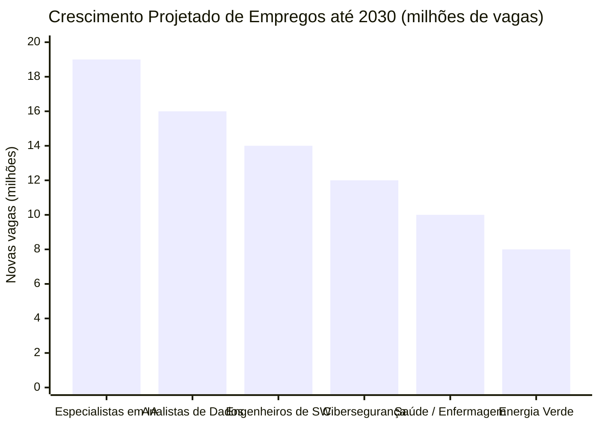

# Introdução ao Futuro

> [!quote] A Nova Realidade
> *Saber sobre algo já não importa. Com as IAs, qualquer conhecimento humano está a 5 segundos de distância. Qualquer um pode saber sobre qualquer coisa. O diferencial é **executar mais do que consumir**.*

---

## 🌍 O Cenário em Números (2025-2026)

> [!warning] O Mercado Já Está Mudando
> Estes dados são reais, publicados por institutos globais em 2025. Não são ficção científica.

| Dado | Fonte | Número |
|------|-------|--------|
| Novos empregos criados até 2030 | WEF Future of Jobs 2025 | **170 milhões** |
| Empregos deslocados até 2030 | WEF Future of Jobs 2025 | **92 milhões** |
| Saldo líquido positivo de empregos | WEF Future of Jobs 2025 | **+78 milhões** |
| Habilidades que mudarão até 2030 | WEF Future of Jobs 2025 | **39% do total** |
| Empresas planejando automatizar mais | WEF Future of Jobs 2025 | **73%** |
| Empresas planejando treinar em IA | WEF Future of Jobs 2025 | **80%** |
| Apps empresariais com agentes de IA em 2026 | Gartner 2025 | **40%** |
| Prêmio salarial para quem tem skills de IA | PwC AI Jobs Barometer 2026 | **56% a mais** |
| Economia de tempo média com IA | PwC Portugal 2026 | **74%** |
| Decisões de trabalho autônomas por IA (até 2028) | Gartner | **15% das decisões diárias** |

> [!tip] A Conclusão Mais Importante
> A IA **não vai acabar com os empregos**. Vai acabar com os empregos de quem **não souber usar IA**. O mercado já premia quem sabe: salários 56% maiores para profissionais com habilidades de IA (PwC, 2026).

---

## 🗺️ Mapa Mental: O Futuro do Trabalho

---

## ⏳ Linha do Tempo: A Aceleração da IA

---

## 🎯 Os 8 Princípios do Futuro

> [!info] Pilares para o Sucesso
> Estes são os princípios fundamentais para se manter relevante na era da IA.

---

### 1️⃣ Executar Mais do que Consumir

> [!tip] Ação > Conhecimento
> *Saber está fácil, fazer continua raro.*

O acesso ao conhecimento foi democratizado. O que diferencia profissionais hoje é a **velocidade de execução**. Quem consome cursos, vídeos e artigos sem nunca aplicar fica para trás. Quem experimenta, erra e aprende na prática avança.

**Pergunta para refletir:** Na última semana, você criou mais do que consumiu?

---

### 2️⃣ Resolver Problemas Reais

> [!tip] Aplicação Prática
> *Foque em aplicar, não em acumular conhecimento.*

O mercado paga por **soluções**, não por diplomas. Um profissional que resolve problemas reais com ferramentas simples vale mais do que alguém com muito conhecimento teórico sem aplicação prática.

**Exemplo concreto:** Use IA para automatizar 1 tarefa repetitiva da sua vida ou trabalho esta semana. Isso já é resolver um problema real.

---

### 3️⃣ Aprender em Ciclos Curtos (Feedback Loop)

> [!tip] Iteração Rápida
> *Estuda, aplica, erra, corrige: rápido e contínuo.*

O modelo antigo era: estuda por anos, depois aplica. O modelo atual é: estuda o mínimo necessário, aplica imediatamente, recebe feedback, corrige, repete. Ciclos de 1 a 2 semanas batem ciclos de 4 anos em adaptação.

---

### 4️⃣ Usar IA como Extensão da Mente

> [!tip] IA como Ferramenta
> *Automatize, sintetize, pense melhor com ela.*

Mais de 50% dos gestores de contratação em 2026 **não consideram candidatos sem AI literacy** (PwC, 2026). IA não é diferencial: está virando requisito mínimo. Quem usa IA bem multiplica sua capacidade de produção.

**Habilidades de IA mais valorizadas em 2026:**
- Prompting eficiente
- Automação de fluxos de trabalho
- Análise e síntese com IA
- Avaliação crítica dos resultados da IA (saber quando ela erra)

---

### 5️⃣ Desenvolver Habilidades Atemporais

> [!tip] Skills Duradouras
> *Comunicação, criatividade, visão estratégica, entre outros.*

- Veja mais em: [[Habilidades atemporais]]

Segundo o WEF (2025), as duas categorias de habilidades que mais crescem são:
1. **Habilidades cognitivas:** pensamento analítico, pensamento crítico, criatividade
2. **Habilidades socioemocionais:** resiliência, flexibilidade, liderança, empatia

Estas são exatamente as habilidades que a IA tem **mais dificuldade** de replicar. Empregos que dependem de empatia, julgamento humano e criatividade crescem 2,5x mais rápido do que empregos puramente técnicos.

| Habilidade | Por que a IA não substitui |
|------------|--------------------------|
| Empatia genuína | IA simula, humano sente |
| Criatividade original | IA combina, humano inventa |
| Julgamento ético | IA calcula, humano decide com valores |
| Liderança inspiradora | IA informa, humano motiva |
| Comunicação contextual | IA gera texto, humano lê a sala |

---

### 6️⃣ Criar Algo que Funcione Sem Você

> [!tip] Escalabilidade
> *Produto, sistema, curso, canal, processo, etc.*

Profissionais que criam sistemas escaláveis (um curso gravado, um código que roda sozinho, um processo documentado) têm alavancagem. Quem só troca horas por dinheiro tem um limite fixo de capacidade.

**Exemplos práticos:**
- Um script Python que automatiza um relatório mensal
- Um curso online que ensina enquanto você dorme
- Uma planilha com fórmulas que calcula sozinha
- Um bot que responde perguntas frequentes

---

### 7️⃣ Estar Sempre Adaptando

> [!tip] Aprendizado Contínuo
> *Crie um sistema pessoal de aprendizagem contínua.*

39% das habilidades que existem hoje estarão obsoletas ou transformadas até 2030 (WEF, 2025). Isso significa que o que você aprendeu nos últimos 5 anos pode não ser suficiente nos próximos 5. A pergunta não é **se** você vai precisar aprender de novo, mas **como** você vai se organizar para isso.

**Sistema mínimo de aprendizado contínuo:**
- 30 minutos por dia explorando novidades da área
- 1 nova ferramenta testada por mês
- 1 projeto pessoal novo por trimestre
- Rede de contatos que troca informação atualizada

---

### 8️⃣ Saber que IA Mudou e Ainda Vai Mudar a Humanidade

> [!warning] Realidade Inegável
> *Não tenha nenhuma dúvida quanto a isso.*

A Gartner projeta que agentes de IA poderão gerar até **US\$ 450 bilhões** em receita de software empresarial até 2035. A IA deixou de ser pesquisa acadêmica: está em 73% das empresas, com 40% dos aplicativos empresariais integrados a agentes de IA já em 2026.

Quem ignorar essa realidade não está sendo prudente: está ficando para trás.

---

## 🔍 Onde Fica a Oportunidade?

> [!success] O Mercado de Trabalho do Futuro
> Enquanto alguns empregos somem, outros explodem. A chave é saber para onde olhar.

**Empregos que mais crescem (WEF, 2025):**

**Empregos mais em risco:**
- Atendimento ao cliente (80% de risco de automação, SSRN)
- Caixas de supermercado (65% das vagas até 2025, estimativas de mercado)
- Processamento de dados repetitivo
- Digitação e transcrição

**A chave:** os empregos que crescem exigem combinação de habilidades técnicas com habilidades humanas. Não é "IA vs. humano", é "humano que sabe usar IA vs. humano que não sabe".

---

## 🧪 Atividades Mão na Massa

> [!example] 🧪 Atividade 1: Monte Seu Roadmap de Habilidades no roadmap.sh
>
> **Site:** [roadmap.sh](https://roadmap.sh)
>
> **O que fazer:**
> 1. Acesse [roadmap.sh](https://roadmap.sh) e escolha uma área que te interessa (ex.: Desenvolvimento Web, IA, DevOps, Cibersegurança).
> 2. Navegue pelo roadmap interativo dessa área.
> 3. Marque quais habilidades você já tem, quais está aprendendo e quais são desconhecidas.
> 4. Tire um print do seu roadmap marcado.
> 5. Identifique as **3 próximas habilidades** que você precisa desenvolver e escreva por que cada uma é relevante para o mercado em 2026.
>
> **Resultado observável:** Um roadmap pessoal marcado + lista de 3 próximas habilidades com justificativa de mercado. Compartilhe na turma.

---

> [!example] 🧪 Atividade 2: Automatize 1 Tarefa com IA e Meça o Tempo Economizado
>
> **Ferramentas sugeridas:** [ChatGPT](https://chat.openai.com), [Claude](https://claude.ai), [Gemini](https://gemini.google.com), [Notion AI](https://notion.so)
>
> **O que fazer:**
> 1. Identifique uma tarefa real que você faz com frequência (resumir textos, responder emails, organizar anotações, criar um plano de estudos, traduzir algo, escrever um código simples).
> 2. Cronometre quanto tempo você leva para fazer essa tarefa manualmente.
> 3. Use uma IA para fazer a mesma tarefa (ou uma versão dela) e cronometre o tempo com a IA.
> 4. Calcule: **tempo economizado = tempo manual menos tempo com IA**.
> 5. Anote: o resultado foi satisfatório? O que precisou ajustar no prompt para melhorar?
>
> **Resultado observável:** Uma tabela com tarefa, tempo manual, tempo com IA, tempo economizado e avaliação da qualidade. Anote o prompt exato que funcionou melhor.

---

> [!example] 🧪 Atividade 3: Descubra 1 Oportunidade de Mercado no Exploding Topics ou Google Trends
>
> **Sites:** [explodingtopics.com](https://explodingtopics.com) e [trends.google.com.br](https://trends.google.com.br)
>
> **O que fazer:**
> 1. Acesse o [Exploding Topics](https://explodingtopics.com) e filtre por categoria "Technology" ou "AI" para ver tendências emergindo agora.
> 2. No [Google Trends](https://trends.google.com.br), compare 2 ou 3 termos da sua área de interesse no Brasil nos últimos 12 meses.
> 3. Identifique 1 tendência crescente que ainda não está saturada.
> 4. Para essa tendência: quem já está lucrando com ela? Que habilidade eu precisaria ter para entrar nesse mercado?
> 5. Escreva 3 frases descrevendo a oportunidade identificada.
>
> **Resultado observável:** Nome da tendência + evidência visual (print do gráfico de crescimento) + 3 frases de oportunidade. Apresente para a turma em 2 minutos.

---

## 📋 Resumo: O Que Fazer Agora

> [!abstract] Checklist do Aluno Preparado para o Futuro
>
> - [ ] Tenho um **roadmap de habilidades** definido (roadmap.sh)
> - [ ] Uso pelo menos **1 ferramenta de IA** na minha rotina
> - [ ] Sei o que é **AI literacy** e estou desenvolvendo
> - [ ] Tenho o hábito de **aprender em ciclos curtos** (menos teoria, mais prática)
> - [ ] Conheço pelo menos **3 profissões em crescimento** na minha área
> - [ ] Já automatizei pelo menos **1 tarefa** com IA
> - [ ] Monitoro **tendências** da minha área (Exploding Topics, Google Trends, LinkedIn)

---

> [!note] 📚 Fontes (2026)
>
> - [WEF Future of Jobs Report 2025](https://www.weforum.org/publications/the-future-of-jobs-report-2025/): 78 milhões de novos empregos líquidos, 39% de habilidades transformadas até 2030.
> - [PwC AI Jobs Barometer 2026](https://www.pwc.com/gx/en/services/ai/ai-jobs-barometer.html): Prêmio salarial de 56% para profissionais com skills de IA; 74% de economia de tempo com IA.
> - [Gartner Strategic Technology Trends 2026](https://www.gartner.com/en/newsroom/press-releases/2025-10-20-gartner-identifies-the-top-strategic-technology-trends-for-2026): 40% dos apps empresariais com agentes de IA até 2026; US\$ 450 bi em receita de software de IA até 2035.
> - [BCG AI Will Reshape More Jobs Than It Replaces](https://www.bcg.com/publications/2026/ai-will-reshape-more-jobs-than-it-replaces): 50 a 55% dos empregos nos EUA serão remodelados pela IA nos próximos 2 a 3 anos.
> - [PwC Portugal: Tendências de Trabalho 2026](https://www.pwc.pt/pt/sala-imprensa/artigos-opiniao/2026/tendencias-trabalho-2026.html): Consolidação do trabalho híbrido e agentes autônomos de IA.
> - [Degreed: 70% das Top Skills de 2026 são Humanas](https://degreed.com/experience/blog/top-skills-for-2026-are-human-skills/): Habilidades humanas lideram o ranking de competências mais buscadas.
> - [Alura: Tendências Tech 2026](https://www.alura.com.br/empresas/artigos/tendencias-tech-2026): Visão brasileira das tendências tecnológicas para 2026.
> - [roadmap.sh](https://roadmap.sh/): Mapas de habilidades interativos por área de tecnologia.
> - [Exploding Topics](https://explodingtopics.com): Detecção de tendências emergentes antes de ficarem populares.
