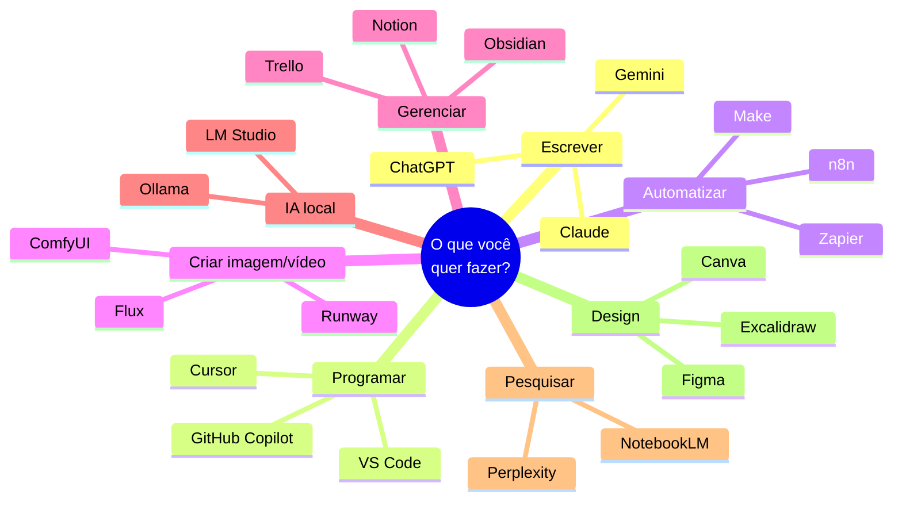
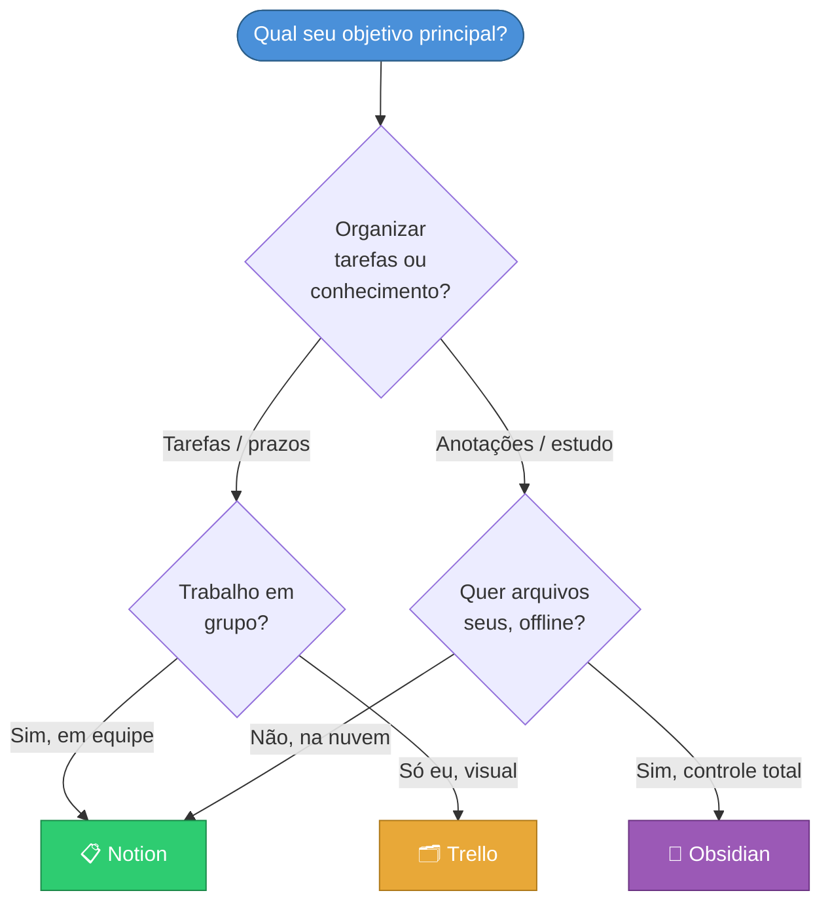
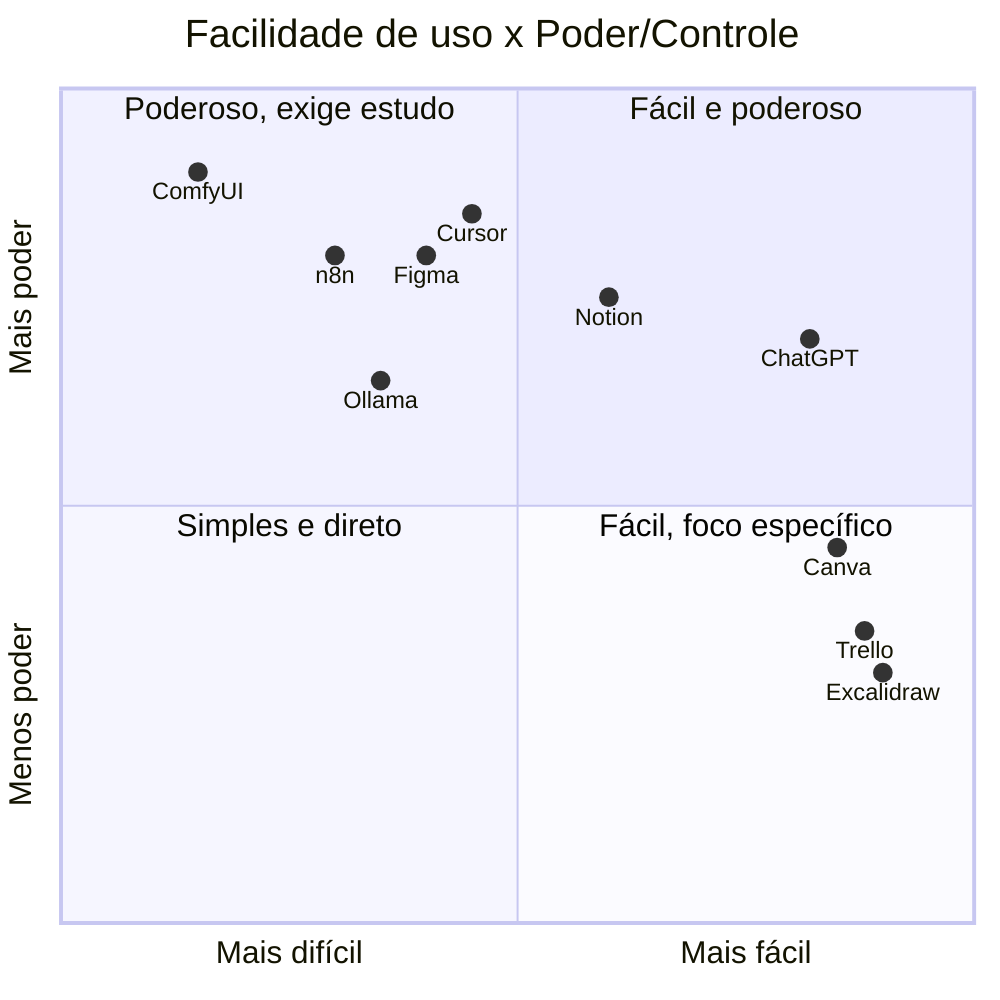

# Melhores Ferramentas para Cada Objetivo

> [!quote] Escolha a Ferramenta Certa
> *A ferramenta não faz o trabalho por você, mas a ferramenta errada faz você trabalhar o dobro. Saber o que existe é metade da batalha.*

> [!info] Como ler este guia (atualizado 2026)
> O mundo das ferramentas muda rápido. Esta aula está organizada **por objetivo** (o que você quer FAZER), não por marca. Cada seção tem uma tabela com **preço real**, **nível recomendado** e uma atividade em que você **produz um artefato de verdade**. Honestidade acima de hype: toda ferramenta tem prós e contras.

---

## 🗺️ Mapa Geral: Objetivo → Ferramentas



> [!tip] Regra de ouro do iniciante
> Comece sempre pela opção **gratuita**. Você só sente falta de um recurso pago depois de bater no limite do grátis, e aí já sabe exatamente pelo que está pagando.

---

## ✍️ Escrever e Redigir (IA + assistentes)

Para redigir, resumir, revisar, traduzir ou destravar um texto. As três grandes IAs cobrem 95% das necessidades.

> [!info] Comparativo (2026)

| Ferramenta | Pra quê | Grátis? / Preço | Nível |
|------------|---------|-----------------|-------|
| **Claude** (Anthropic) | Textos longos, revisão, raciocínio cuidadoso | Grátis (limite diário) / ~US\$ 20/mês | Iniciante a avançado |
| **ChatGPT** (OpenAI) | Tarefa geral: brainstorm, e-mail, resumo | Grátis (GPT mini) / ~US\$ 20/mês | Iniciante |
| **Gemini** (Google) | Pesquisa com dados atuais, integra Google Docs | Grátis (Flash) / ~US\$ 20/mês | Iniciante |

> [!success] Recomendação prática
> Em testes de 2026, o **Claude** é apontado como o melhor para escrita longa e revisão; o **ChatGPT** ganha em versatilidade; o **Gemini** brilha quando o texto depende de dados recentes ou já mora no Google Workspace. Para a maioria dos alunos, o **plano gratuito de qualquer um já resolve**.

> [!warning] Honestidade: o que a IA NÃO faz por você
> - **Inventa fatos** (chamado de "alucinação"): nunca confie em citação, número ou referência sem checar.
> - **Não tem sua voz**: use a IA para destravar e revisar, não para entregar texto cru como se fosse seu.
> - **Plágio e ética**: na vida acadêmica, escrever 100% com IA e assinar como autor é desonestidade. A ferramenta é um copiloto, não o piloto.

> [!example] 🧪 Atividade 1: Escrever COM e SEM IA (e comparar)
>
> **Ferramenta:** [claude.ai](https://claude.ai) ou [chatgpt.com](https://chatgpt.com) (conta gratuita)
>
> **O que fazer:**
> 1. Escreva, **sem ajuda nenhuma**, um parágrafo de 4 a 6 linhas explicando "o que é inteligência artificial" para um aluno do 6º ano. Salve como `versao_sem_ia.txt`.
> 2. Agora peça à IA: *"Reescreva o texto abaixo para um aluno do 6º ano, mais claro e com um exemplo do dia a dia"* e cole o seu parágrafo. Salve a resposta como `versao_com_ia.txt`.
> 3. Compare os dois lado a lado.
>
> **Resultado observável (o artefato):** os dois arquivos `.txt`. No final, escreva **2 frases** apontando o que a IA melhorou e **1 coisa que ela errou ou deixou pior** (sempre tem algo).

---

## 💻 Programar (IDE + IA de código)

![[Recursos/Roadmap do futuro/Melhores ferramentas/vscode.png|VS Code, o editor de código mais usado do mundo|180]]

O ambiente onde você escreve código. Em 2026 o assistente de IA virou parte do editor.

> [!info] Comparativo (2026)

| Ferramenta | Pra quê | Grátis? / Preço | Nível |
|------------|---------|-----------------|-------|
| **VS Code** | Editor de código mais usado do mundo | 100% grátis (open-source) | Iniciante a avançado |
| **GitHub Copilot** | IA de autocomplete dentro do seu editor | Grátis p/ estudante* / US\$ 10/mês | Iniciante |
| **Cursor** | Editor com IA forte: edita vários arquivos | Plano grátis limitado / US\$ 20/mês | Intermediário |

\* Estudantes têm acesso ao **GitHub Copilot gratuito** via [GitHub Student Pack](https://education.github.com/pack).

> [!tip] Por onde começar
> 1. Instale o **VS Code** (grátis, roda em Windows, Mac e Linux).
> 2. Ative o **Copilot grátis de estudante** dentro dele.
> 3. Só migre para o **Cursor** quando sentir que precisa de IA editando o projeto inteiro de uma vez, não é necessário no começo.

> [!warning] Cuidado com a "muleta de IA"
> Aceitar sugestão de código sem entender o que ela faz é o caminho mais rápido para travar quando der erro. No início, **leia e questione** cada sugestão. A IA acelera quem já entende; ela atrapalha quem está fugindo de aprender o básico.

> [!example] 🧪 Atividade 2: Seu primeiro projeto no VS Code
>
> **Ferramenta:** [VS Code](https://code.visualstudio.com/) (instalar) ou, se não puder instalar, [vscode.dev](https://vscode.dev) (roda no navegador, sem instalar)
>
> **O que fazer:**
> 1. Crie um arquivo `saudacao.py`.
> 2. Escreva um programa que pergunta o nome do usuário e responde com uma saudação personalizada:
>    ```python
>    nome = input("Qual é o seu nome? ")
>    print(f"Olá, {nome}! Bem-vindo ao VS Code.")
>    ```
> 3. Rode o programa e teste com o seu nome.
>
> **Resultado observável (o artefato):** o arquivo `saudacao.py` + um **print da tela** mostrando o terminal com a saudação aparecendo com o seu nome de verdade.
>
> **Desafio extra:** peça ao Copilot (ou à IA) para adicionar uma pergunta sobre a idade e calcular em que ano a pessoa nasceu.

---

## 🔧 Automatizar (sem ou com pouco código)

Conectar aplicativos para que tarefas repetitivas aconteçam sozinhas (ex.: "salvar todo anexo de e-mail no Drive").

> [!info] Comparativo (2026)

| Ferramenta | Pra quê | Grátis? / Preço | Nível |
|------------|---------|-----------------|-------|
| **n8n** | Automação visual open-source, self-hosted | Grátis (você hospeda) / nuvem paga | Intermediário |
| **Make** | Cenários visuais com lógica avançada | Plano grátis (1000 operações/mês) | Iniciante a intermediário |
| **Zapier** | Maior catálogo de apps (8000+), mais fácil | Plano grátis limitado / pago caro no volume | Iniciante |

> [!success] Qual escolher
> - **Quer o mais fácil e tem poucos apps?** Zapier.
> - **Quer poder (ramificações, loops) sem pagar caro?** Make, custa de 3 a 5x menos que o Zapier no mesmo volume.
> - **Sabe um pouco de técnica e quer custo zero / privacidade?** n8n self-hosted: paga só o servidor, sem cobrança por execução.

> [!warning] Honestidade
> Automação parece mágica até quebrar silenciosamente. Sempre **teste** o fluxo e cheque os resultados nos primeiros dias. "Automatizar errado" é multiplicar o erro em escala.

> [!example] 🧪 Atividade 3: Sua primeira automação real
>
> **Ferramenta:** [make.com](https://www.make.com) (conta gratuita, sem cartão)
>
> **O que fazer:**
> 1. Crie um cenário novo.
> 2. Conecte um gatilho simples e gratuito, ex.: **agendamento** ("a cada 1 hora") ou **RSS** de um site de notícias.
> 3. Ligue a uma ação de saída visível: enviar a si mesmo um e-mail (módulo Email) ou registrar numa Google Sheet.
> 4. Rode o cenário **uma vez** com o botão "Run once".
>
> **Resultado observável (o artefato):** **print da tela do Make** mostrando o cenário com os módulos conectados e o **histórico de execução com o check verde** (sucesso). Bônus: o e-mail/linha que a automação gerou.

---

## 🎨 Criar Imagem e Vídeo

Gerar imagens e vídeos por IA. Vai de "clica e pronto" (online) até "monta seu pipeline" (local, na sua GPU).

> [!info] Comparativo (2026)

| Ferramenta | Pra quê | Grátis? / Preço | Nível |
|------------|---------|-----------------|-------|
| **Flux** (Black Forest Labs) | Imagem fotorrealista, segue bem o prompt | Versão `dev` grátis (open-weight) / API paga | Intermediário |
| **Stable Diffusion** | Imagem local, enorme ecossistema de modelos | Grátis (roda na sua GPU) | Intermediário |
| **ComfyUI** | "Mesa de trabalho" visual para SD/Flux local | Grátis (open-source) | Avançado |
| **Midjourney** | Imagem de altíssima qualidade artística | Pago (US\$ 10 a 60/mês) | Iniciante |
| **Nano Banana** (Google) | Imagem realista com texto, via Gemini | Grátis com marca d'água / paga | Iniciante |
| **Runway** | Geração e edição de **vídeo** com IA | Plano grátis limitado / pago | Intermediário |

> [!tip] Qual caminho seguir
> - **Só quer testar agora, de graça e no navegador?** Nano Banana (pelo Gemini) ou um gerador grátis online.
> - **Tem uma GPU boa e quer gerar ilimitado, sem censura e sem mensalidade?** Stable Diffusion / Flux local via **ComfyUI** (a instalação leva ~45 min e exige paciência).
> - **Quer a melhor estética e topa pagar?** Midjourney.

> [!warning] Ética e direitos (importante na escola)
> - **Marca d'água e direitos**: imagem de IA pode ter restrições de uso comercial. Leia os termos.
> - **Nunca apresente imagem de IA como foto real** de um fato (desinformação).
> - **Crédito**: em trabalho acadêmico, sempre declare que a imagem foi gerada por IA e qual ferramenta.

> [!example] 🧪 Atividade 4: Gerar e salvar sua primeira imagem
>
> **Ferramenta:** [gemini.google.com](https://gemini.google.com) (Nano Banana, grátis) ou qualquer gerador online gratuito
>
> **O que fazer:**
> 1. Escreva um prompt **descritivo** (não "um gato", mas algo como: *"um gato astronauta flutuando dentro de uma sala de aula, estilo aquarela, cores quentes"*).
> 2. Gere a imagem.
> 3. **Baixe** o arquivo.
> 4. Agora mude UMA palavra do prompt (ex.: troque "aquarela" por "pixel art") e gere de novo.
>
> **Resultado observável (o artefato):** **duas imagens salvas** (`imagem_v1.png` e `imagem_v2.png`) + 1 frase explicando como a troca de palavra mudou o resultado. Isso é o começo do "engenharia de prompt".

---

## 📋 Gerenciar Projetos e Estudos

![[Recursos/Roadmap do futuro/Melhores ferramentas/obsidian.png|Obsidian, base de conhecimento pessoal (esta aula foi escrita nele)|150]]

Organizar tarefas, anotações, prazos e conhecimento. A escolha depende de como **seu cérebro funciona**.

> [!info] Comparativo (2026)

| Ferramenta | Pra quê | Grátis? / Preço | Nível |
|------------|---------|-----------------|-------|
| **Notion** | Tudo-em-um: notas + banco de dados + projetos | Plano grátis generoso (pessoal) | Iniciante a avançado |
| **Obsidian** | Base de conhecimento pessoal, offline, links | 100% grátis para uso pessoal | Intermediário |
| **Trello** | Quadro Kanban visual (cartões que você arrasta) | Plano grátis (boards ilimitados) | Iniciante |

> [!success] Qual combina com você
> - **Quer organização visual e simples (mover cartões)?** Trello.
> - **Quer um sistema completo com tabelas, prazos e colaboração em grupo?** Notion.
> - **Quer suas notas em arquivos seus, no seu PC, conectados entre si para sempre?** Obsidian (esta aula que você está lendo foi escrita nele).



> [!example] 🧪 Atividade 5: Montar seu quadro de estudos
>
> **Ferramenta:** [trello.com](https://trello.com) (conta gratuita) **ou** [notion.so](https://notion.so)
>
> **O que fazer:**
> 1. Crie um board (Trello) ou uma página com banco de dados (Notion) chamado **"Minhas matérias"**.
> 2. Crie 3 colunas/status: **A fazer**, **Fazendo**, **Feito**.
> 3. Adicione pelo menos **4 cartões reais** (tarefas/trabalhos de verdade que você tem esta semana).
> 4. Mova 1 cartão para "Fazendo".
>
> **Resultado observável (o artefato):** **print da tela** do board montado com as 3 colunas e os 4 cartões reais distribuídos. Use de verdade pela próxima semana, esse é o teste real.

---

## 🖥️ Rodar IA Local (no seu próprio computador)

Rodar modelos de IA **offline**, sem mandar seus dados para a nuvem. Privacidade total e custo zero por uso, mas exige hardware.

> [!info] Comparativo (2026)

| Ferramenta | Pra quê | Grátis? / Preço | Nível |
|------------|---------|-----------------|-------|
| **Ollama** | Rodar modelos via terminal, automatizar, servir API | 100% grátis (open-source) | Intermediário |
| **LM Studio** | Mesma ideia, mas com **interface gráfica** | Grátis | Iniciante a intermediário |

> [!tip] Hardware mínimo (2026)
> Para um modelo capaz (3B a 7B parâmetros, quantizado Q4): **16 GB de RAM** + GPU com **6+ GB de VRAM** ou um **Mac com Apple Silicon**. Sem GPU dá para rodar, mas fica lento. Um SSD NVMe ajuda muito (os modelos são arquivos grandes).

> [!success] Estratégia esperta
> Muita gente usa **os dois**: **LM Studio** para explorar e testar modelos com clique (tem navegador de modelos embutido), e **Ollama** para automação e integração com scripts. Modelos abertos de 8B a 14B já chegam perto da qualidade do GPT-4 de 2024.

> [!warning] Expectativa realista
> Modelo local **não é** tão forte quanto o ChatGPT/Claude da nuvem. Você troca um pouco de qualidade por **privacidade, custo zero e funcionamento offline**. Ótimo para estudar, prototipar e dados sensíveis; nem sempre para a tarefa mais difícil.

> [!example] 🧪 Atividade 6: Sua IA rodando offline
>
> **Ferramenta:** [ollama.com](https://ollama.com) **ou** [lmstudio.ai](https://lmstudio.ai) (instalar)
>
> **O que fazer (caminho Ollama, mais simples):**
> 1. Instale o Ollama.
> 2. No terminal, rode: `ollama run llama3.2` (baixa um modelo pequeno automaticamente).
> 3. Faça **3 perguntas** ao modelo, uma delas pedindo um pequeno código em Python.
> 4. Repare: nenhuma conexão com a internet é necessária depois do download.
>
> **Resultado observável (o artefato):** **print do terminal** mostrando o modelo respondendo às suas perguntas offline. Bônus: anote quanto tempo ele levou para responder, isso revela o limite do seu hardware.
>
> *Sem hardware suficiente? Faça a versão "investigação": rode `ollama list` num PC do laboratório ou descreva, com base nas referências, qual modelo caberia no seu PC e por quê (apenas se não houver máquina disponível).*

---

## 🔎 Pesquisar e Aprender

Encontrar informação confiável e estudar a partir do seu próprio material.

> [!info] Comparativo (2026)

| Ferramenta | Pra quê | Grátis? / Preço | Nível |
|------------|---------|-----------------|-------|
| **Perplexity** | Buscar com respostas + **citações** clicáveis | Plano grátis bom / Pro paga | Iniciante |
| **NotebookLM** (Google) | Estudar a partir dos **seus** PDFs/notas | Grátis | Iniciante |

> [!success] A dupla perfeita do estudante
> **Perplexity para ENCONTRAR** a informação (com fontes numeradas, dá para conferir de onde veio) e **NotebookLM para TRABALHAR** com o que você já tem: suba o PDF da aula e peça resumo, perguntas de prova, ou até um "podcast" de áudio explicando o conteúdo.

> [!warning] Confiança não é fé cega
> Mesmo com citações, **abra a fonte e confirme**. IA de pesquisa erra menos que IA "pura", mas ainda erra. Citar a fonte original (não "o ChatGPT disse") é o que vale num trabalho acadêmico.

> [!example] 🧪 Atividade 7: Pesquisa com rastro de fontes
>
> **Ferramenta:** [perplexity.ai](https://perplexity.ai) (sem precisar de conta para testar)
>
> **O que fazer:**
> 1. Faça uma pergunta factual da sua área, ex.: *"Quando foi criado o primeiro computador eletrônico e qual era seu nome?"*
> 2. Leia a resposta e **clique em pelo menos 2 das fontes numeradas**.
> 3. Confira se a fonte realmente diz o que a IA afirmou.
>
> **Resultado observável (o artefato):** um documento curto (`pesquisa.txt`) com: a resposta da IA, os **links das 2 fontes** que você abriu e **1 frase** dizendo se as fontes confirmaram ou contradisseram a resposta.

---

## 🎨 Design (diagramas, layout e visual)

![[Recursos/Roadmap do futuro/Melhores ferramentas/figma.png|Figma, design de interfaces profissional|160]]

Criar diagramas, posts, slides e protótipos. De novo: a ferramenta certa depende do objetivo.

> [!info] Comparativo (2026)

| Ferramenta | Pra quê | Grátis? / Preço | Nível |
|------------|---------|-----------------|-------|
| **Excalidraw** | Diagramas e esquemas "desenhados à mão" | 100% grátis, sem cadastro | Iniciante |
| **Canva** | Posts, slides, cartazes com templates prontos | Plano grátis bem útil / Pro paga | Iniciante |
| **Figma** | UI/UX profissional, protótipo, vetor preciso | Plano grátis (estudante) | Intermediário a avançado |

> [!success] Qual usar
> - **Esboçar uma ideia ou um fluxo rápido?** Excalidraw (abre, desenha, pronto, sem login).
> - **Fazer um cartaz, slide ou post bonito sem ser designer?** Canva.
> - **Projetar a tela de um app de verdade, com precisão?** Figma.

> [!info] Curiosidade
> O **Figma** e o **Canva** **não são concorrentes**: resolvem problemas diferentes. Figma é para produto (telas de app, design system); Canva é para comunicação visual rápida (marketing, redes, apresentação).

> [!example] 🧪 Atividade 8: Seu primeiro diagrama
>
> **Ferramenta:** [excalidraw.com](https://excalidraw.com) (abre direto, sem cadastro)
>
> **O que fazer:**
> 1. Abra o Excalidraw.
> 2. Desenhe um **fluxograma simples** do seu dia: pelo menos 4 caixas ligadas por setas (ex.: Acordar → Aula → Estudar → Dormir).
> 3. Use uma forma de decisão (losango) com dois caminhos, ex.: "Tem prova amanhã?" → Sim / Não.
> 4. Exporte como imagem (`Menu → Export image → PNG`).
>
> **Resultado observável (o artefato):** o arquivo `meu_dia.png` exportado, com no mínimo 4 formas, 1 decisão e as setas conectando tudo.

---

## 📊 Mapa de Decisão: Facilidade x Poder

Nenhuma ferramenta é "a melhor" para tudo. Em geral, quanto **mais fácil** de usar, **menos poder/controle**; quanto **mais poder**, **mais curva de aprendizado**. Veja onde algumas se posicionam:



> [!info] Lendo o gráfico
> Ferramentas no canto **superior direito** (fáceis E poderosas, como o ChatGPT) são ótimas para começar. Ferramentas no canto **superior esquerdo** (poderosas mas difíceis, como ComfyUI e n8n) recompensam quem investe tempo. Comece pela direita, suba para a esquerda conforme amadurece.

---

## 🏆 Resumo: Como Escolher na Vida Real

> [!tip] Checklist de decisão
> 1. **Defina o objetivo primeiro** (escrever? automatizar? desenhar?), nunca escolha a ferramenta antes da tarefa.
> 2. **Tente o grátis.** Quase tudo nesta aula tem versão gratuita boa o suficiente para aprender.
> 3. **Considere seu hardware.** IA local exige máquina; ferramentas de nuvem rodam até no celular.
> 4. **Pense em privacidade.** Dado sensível? Prefira local (Ollama) ou ferramenta com seus arquivos (Obsidian).
> 5. **Não acumule.** Dominar 1 ferramenta por objetivo vale mais que abrir conta em 10 e não usar nenhuma.
> 6. **Reavalie a cada semestre.** Este mercado muda rápido; a "melhor" de hoje pode ter sido superada amanhã.

> [!success] A ferramenta mais importante
> Continua sendo **o seu raciocínio**. A IA e os apps amplificam quem pensa com clareza e atrapalham quem terceiriza o pensamento. Use-os para fazer **mais e melhor**, não para fazer **menos esforço de aprender**.

---

## 📎 Veja Também

- [[Tópicos/Roadmap do futuro/Inteligência artificial|Inteligência artificial]]
- [[ComfyUI - Automações com imagens e vídeos]]
- [[N8N - automações visuais sem código]]
- [[Conceitos gerais de programação]]

---

> [!note] 📚 Fontes (2026)
> - [Cursor vs Claude Code vs GitHub Copilot 2026 (NxCode)](https://www.nxcode.io/resources/news/cursor-vs-claude-code-vs-github-copilot-2026-ultimate-comparison)
> - [AI Coding Tools Pricing Comparison 2026 (NxCode)](https://www.nxcode.io/resources/news/ai-coding-tools-pricing-comparison-2026)
> - [Claude vs ChatGPT vs Gemini: Which AI Writes Best in 2026 (Tactiq)](https://tactiq.io/learn/claude-vs-gemini-vs-chatgpt-for-writing)
> - [ChatGPT vs Claude vs Gemini 2026 (Towards AI)](https://pub.towardsai.net/chatgpt-vs-claude-vs-gemini-which-ai-is-actually-best-in-2026-59a50c70dcdb)
> - [Zapier vs Make vs n8n 2026 (Digital Applied)](https://www.digitalapplied.com/blog/zapier-vs-make-vs-n8n-2026-automation-comparison)
> - [n8n vs Zapier vs Make 2026 (Cipher Projects)](https://cipherprojects.com/blog/posts/n8n-vs-zapier-vs-make-automation-comparison/)
> - [Best AI Image Generators 2026: Midjourney, Flux & More (Miniloop)](https://www.miniloop.ai/blog/best-ai-image-generators-2026)
> - [Free Local AI Image Generators 2026 (SolidAITech)](https://www.solidaitech.com/2026/04/free-local-ai-image-generators-midjourney-alternative.html)
> - [Run Local LLMs 2026: Complete Developer Guide (SitePoint)](https://www.sitepoint.com/run-local-llms-2026-complete-developer-guide/)
> - [Local LLM Hardware Requirements 2026 (Overchat AI)](https://overchat.ai/ai-hub/llm-hardware-requirements)
> - [Notion vs Obsidian 2026 (Slite)](https://slite.com/learn/obsidian-vs-notion)
> - [12 Best Notion Alternatives for Students & Teams 2026 (BrightSEOTools)](https://brightseotools.com/post/Notion-Alternatives)
> - [The 10 Best AI Research Assistants: NotebookLM vs Perplexity (Medium)](https://medium.com/activated-thinker/the-10-best-ai-research-assistants-notebooklm-vs-perplexity-vs-consensus-6e7a27ff5afc)
> - [Best AI Tools for Students 2026 (Storyflow)](https://storyflow.so/blog/best-ai-tools-for-students-2026)
> - [Canva vs Excalidraw vs Figma 2026 (Slashdot)](https://slashdot.org/software/comparison/Canva-vs-Excalidraw-vs-Figma/)
> - [Figma vs Canva 2026 (Style Factory)](https://www.stylefactoryproductions.com/blog/canva-vs-figma)
