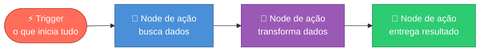
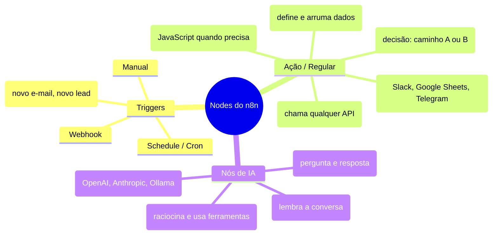
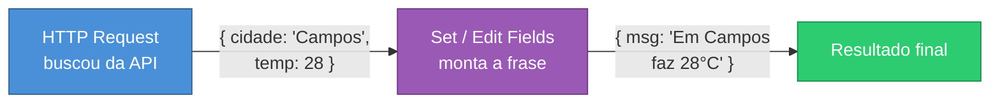
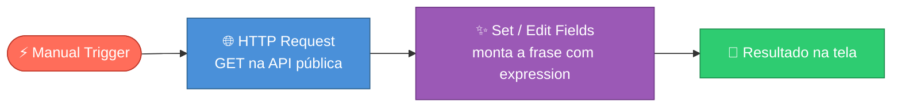
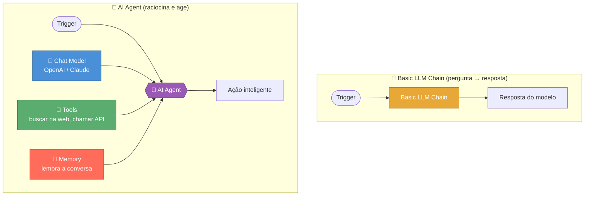
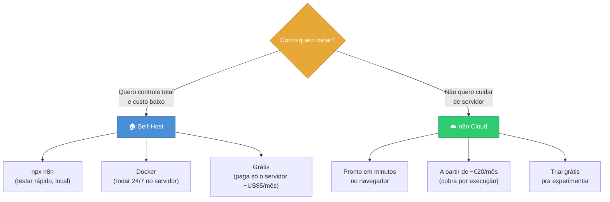

# n8n: Automações Visuais Sem Código

> [!quote] Conectar é programar
> *Se você sabe ligar peças de Lego, você consegue montar uma automação no n8n. Cada bloco faz uma coisa; o programa nasce de como você os encaixa.*

![[Recursos/Roadmap do futuro/N8N/n8n-logo.png|Logo oficial do n8n.io]]

> [!info] O que você vai conseguir fazer ao final
> - Subir o n8n no seu computador (sem instalar nada permanente) ou usar a versão na nuvem.
> - Montar um fluxo que dispara, busca dados de uma API pública na internet e mostra o resultado.
> - Passar e transformar dados de um bloco para o outro usando *expressions*.
> - Entender onde a Inteligência Artificial entra na automação.

---

## 🧩 O que é o n8n (e por que ele existe) 

O **n8n** (lê-se "n-eight-n", de *nodemation* = *node* + *automation*; o "8" são as oito letras entre o primeiro e o último "n") é uma plataforma para **criar automações arrastando blocos numa tela**, em vez de escrever um programa do zero.

A ideia central é a mesma de **peças de Lego**: cada bloco (chamado **node**) faz uma tarefa pequena e bem definida (ler um e-mail, chamar uma API, salvar numa planilha). Você **conecta** os blocos com fios, e o fluxo de dados percorre essa "tubulação" do início ao fim.

> [!question] Por que não usar logo o Zapier ou o Make?
> Zapier e Make são ótimos, mas são **fechados e cobram por execução**. O n8n é a **alternativa open source**: você pode ver o código, modificar e, principalmente, **rodar no seu próprio servidor de graça**. Para quem estuda, isso é ouro: dá pra experimentar sem limite de tarefas e sem cartão de crédito.

> [!info] Licença *fair-code*
> O n8n não é "open source clássico", e sim **fair-code**: o código é aberto, você pode ver, alterar e **auto-hospedar livremente**. As restrições só aparecem em cenários comerciais específicos (revender o n8n como serviço). Para uso pessoal, estudo e automações internas, é livre.

| Aspecto | n8n | Zapier / Make |
|---------|-----|---------------|
| **Código** | Aberto (fair-code) | Fechado |
| **Onde roda** | Sua máquina, seu servidor **ou** nuvem deles | Só na nuvem deles |
| **Custo self-host** | Grátis (paga só o servidor) | Não existe self-host |
| **Cobrança na nuvem** | Por execução de workflow | Por tarefa/operação |
| **Nós de IA nativos** | Sim (AI Agent, LLM Chain) | Limitado / via integração |
| **Aprendizado** | Visual, mas permite código (JavaScript) | Visual |

---

## 🔌 Anatomia de um Workflow: Nodes e Conexões 

Um **workflow** (fluxo de trabalho) é o nome do projeto inteiro que você monta na tela. Ele é feito de **nodes** ligados por fios. Os dados entram por um lado, são processados, e saem pelo outro.



> [!info] A regra de ouro do n8n
> **Todo workflow começa com um node de gatilho (trigger).** Sem um gatilho, o n8n não sabe *quando* rodar o fluxo. Depois do trigger vêm os **nodes de ação**, executados em sequência, sempre da esquerda para a direita.

### Os dois grandes tipos de node



> [!tip] Mais de 400 integrações prontas
> O n8n traz **mais de 400 nodes** prontos para serviços famosos (Gmail, Slack, Notion, Telegram, Google Sheets, OpenAI...). E quando não existe um node pronto, o **HTTP Request** salva: ele conversa com **qualquer** sistema que tenha uma API. É o "node coringa".

---

## ⚡ Triggers: o que dá a partida no fluxo 

O **trigger** é sempre o **primeiro** node. Ele define o *evento* que coloca o workflow para rodar. Os três que você mais vai usar no começo:

| Trigger | Quando dispara | Exemplo de uso |
|---------|----------------|----------------|
| **Manual Trigger** | Quando você clica em "Execute Workflow" na tela | Testar e depurar enquanto monta |
| **Webhook** | Quando chega uma requisição HTTP de fora | Um formulário do site avisa o n8n que alguém se inscreveu |
| **Schedule (Cron)** | Em horários/intervalos definidos | Todo dia às 8h, buscar a previsão do tempo e te avisar |

> [!info] O Schedule é um "cron" visual
> O **Schedule Trigger** funciona como o `cron` do Linux: roda a cada N minutos/horas, todo dia num horário, semanalmente, ou via uma **expressão cron** customizada. Uma expressão cron tem 5 campos: `(minuto) (hora) (dia do mês) (mês) (dia da semana)`. Por exemplo, `0 8 * * *` significa "todo dia às 08:00". A ferramenta [crontab.guru](https://crontab.guru/) ajuda a montar essas expressões.

> [!tip] Por que o Manual Trigger é seu melhor amigo no começo
> Enquanto você está construindo, não dá pra ficar esperando um e-mail chegar a cada teste. O **Manual Trigger** te deixa rodar o fluxo na hora, ver o que cada node devolveu, ajustar e rodar de novo. Só troque por Webhook ou Schedule quando a automação estiver pronta.

---

## 📦 Como os dados andam entre os nodes 

Aqui está o coração do n8n. Cada node **recebe** dados do node anterior, faz seu trabalho, e **entrega** dados para o próximo. Esses dados trafegam em formato **JSON** (a mesma estrutura de "chave: valor" que você vê em APIs).



### Expressions: pegar e transformar o dado do node anterior

Para usar um dado que veio de antes, o n8n tem as **expressions**: trechos escritos entre **chaves duplas `{{ }}`**. Dentro delas, `$json` significa "o dado que chegou neste node".

| Expression | O que faz |
|------------|-----------|
| `{{ $json.cidade }}` | Pega o campo `cidade` do dado que chegou |
| `{{ $json.temp }}` | Pega o campo `temp` (a temperatura) |
| `{{ $json.nome.toUpperCase() }}` | Pega o nome e deixa **MAIÚSCULO** |
| `{{ $json.temp > 30 ? "calor" : "ameno" }}` | Decide o texto conforme a temperatura |
| `{{ $node["HTTP Request"].json.cidade }}` | Pega um campo de um node específico pelo nome |

> [!success] A grande sacada
> As expressions são o que diferencia "ligar blocos" de **programar de verdade**. Com `{{ }}` você reaproveita, combina e transforma dados de qualquer node anterior. É o mesmo raciocínio de **variáveis e operadores** que você já viu em [[Conceitos gerais de programação]], só que dentro da automação.

> [!info] Onde a API entra
> Quando o **HTTP Request** chama um serviço externo, ele está usando uma **API** (a "ponte" entre sistemas que você estudou). A resposta volta em JSON e vira o `$json` do próximo node. Toda automação interessante é, no fundo, "buscar dado de um lugar, transformar, e entregar em outro".

---

## 🧪 Atividade 1: Subir o n8n e rodar seu primeiro fluxo

> [!example] 🧪 Atividade 1: "Olá, n8n" com Manual Trigger
>
> **Objetivo:** colocar o n8n no ar e executar um workflow do zero.
>
> **Opção A, Local com npx (recomendada, não instala nada permanente):**
> 1. Tenha o **Node.js** instalado. No terminal, rode:
>    ```bash
>    npx n8n
>    ```
> 2. Aguarde o download (na 1ª vez demora 1-2 min). Quando aparecer a mensagem de "Editor is now accessible", abra no navegador:
>    ```
>    http://localhost:5678
>    ```
> 3. Crie a conta de dono (tela "Set up owner account") com qualquer e-mail/senha. **É local, fica só na sua máquina.**
>
> **Opção B, Local com Docker (se você já usa Docker):**
> ```bash
> docker volume create n8n_data
> docker run -it --rm -p 5678:5678 -v n8n_data:/home/node/.n8n n8nio/n8n
> ```
> Depois abra `http://localhost:5678` igual à Opção A.
>
> **Opção C, n8n Cloud (zero instalação):** crie um trial grátis em [n8n.io](https://n8n.io/) e use direto no navegador.
>
> **Montando o fluxo:**
> 1. Clique em **"Add first step"** → escolha **Manual Trigger** (ou "Trigger manually").
> 2. Clique no **+** ao lado do trigger → procure o node **"Edit Fields (Set)"** e adicione.
> 3. No node Set, crie um campo: nome `mensagem`, valor `Meu primeiro fluxo no n8n`.
> 4. Clique em **"Execute Workflow"** (botão no rodapé).
>
> **Resultado observável:** o trigger e o node Set ficam com um **✓ verde**. Clicando no node Set, o painel da direita mostra o JSON de saída:
> ```json
> { "mensagem": "Meu primeiro fluxo no n8n" }
> ```
>
> **Entregável:** print da tela mostrando os dois nodes verdes e o JSON `{ "mensagem": ... }` na saída.

---

## 🌐 Conectando o mundo: chamando uma API pública 

Um fluxo só fica útil quando ele **conversa com outros sistemas**. O node **HTTP Request** faz exatamente isso: manda uma requisição para um endereço (URL) e recebe a resposta. Vamos usar **APIs públicas e gratuitas** (sem cadastro):

| API pública | URL | Devolve |
|-------------|-----|---------|
| **Piada aleatória** | `https://official-joke-api.appspot.com/random_joke` | Uma piada (setup + punchline) |
| **CEP (ViaCEP)** | `https://viacep.com.br/ws/01001000/json/` | Endereço de um CEP brasileiro |
| **Previsão do tempo** | `https://wttr.in/Campos?format=j1` | Clima da cidade em JSON |



> [!example] 🧪 Atividade 2: Buscar dados reais de uma API e formatar
>
> **Objetivo:** fazer o fluxo buscar um dado da internet e transformá-lo com uma expression.
>
> **Passo a passo:**
> 1. Reaproveite o fluxo da Atividade 1 (Manual Trigger já no lugar).
> 2. Adicione um node **HTTP Request** depois do trigger. Configure:
>    - **Method:** `GET`
>    - **URL:** `https://viacep.com.br/ws/01001000/json/`
> 3. Clique em **"Execute step"** só nesse node. Veja no painel direito o JSON retornado (vai ter `logradouro`, `bairro`, `localidade`, `uf`...).
> 4. Adicione um node **Edit Fields (Set)** depois do HTTP Request. Crie um campo:
>    - Nome: `endereco_formatado`
>    - Valor (ligue o modo **expression**, ícone de engrenagem/`fx`): 
>      ```
>      {{ $json.logradouro }}, {{ $json.bairro }} - {{ $json.localidade }}/{{ $json.uf }}
>      ```
> 5. Clique em **"Execute Workflow"**.
>
> **Resultado observável:** o node Set devolve algo como:
> ```json
> { "endereco_formatado": "Praça da Sé, Sé - São Paulo/SP" }
> ```
> Você acabou de **buscar um dado real da internet e transformá-lo** sem escrever um programa.
>
> **Desafio extra:** troque a URL para `https://official-joke-api.appspot.com/random_joke` e monte uma expression que junte a piada: `{{ $json.setup }} ... {{ $json.punchline }}`. Rode 3 vezes e veja a piada mudar.

---

## 📡 Webhook: deixando o mundo de fora chamar seu fluxo 

Até agora **você** apertava o botão. Com o **Webhook**, é um sistema externo que dispara o fluxo, mandando uma requisição HTTP para um endereço que o n8n cria pra você. É assim que "um formulário avisa o n8n", "um pagamento dispara um e-mail", etc.

> [!example] 🧪 Atividade 3: Disparar o fluxo de fora com um Webhook
>
> **Objetivo:** criar um endereço (URL) que, ao ser chamado, executa o seu workflow e devolve os dados recebidos.
>
> **Passo a passo:**
> 1. Crie um **novo workflow**. Adicione o trigger **Webhook**.
> 2. No node Webhook, deixe **Method = GET** e copie a **"Test URL"** que ele mostra (algo como `http://localhost:5678/webhook-test/abc-123`).
> 3. Adicione depois um node **Edit Fields (Set)** com um campo `recebido` e valor (expression):
>    ```
>    {{ $json.query.nome }}
>    ```
> 4. Clique em **"Listen for test event"** (o Webhook fica esperando).
> 5. Em **outro terminal**, dispare a chamada com `curl` (substitua pela sua URL):
>    ```bash
>    curl "http://localhost:5678/webhook-test/abc-123?nome=Wesley"
>    ```
>
> **Resultado observável:** assim que o `curl` roda, o n8n **acorda**: os nodes ficam verdes e o node Set mostra `{ "recebido": "Wesley" }`. O terminal do `curl` recebe a resposta do fluxo. Você criou um "endereço de internet" que executa sua automação.
>
> **Entregável:** print da tela do n8n com os nodes verdes + o comando `curl` que você usou.

---

## 🤖 Nós de IA: quando a automação "pensa" 

Aqui está o motivo de o n8n ter explodido em popularidade. Além de mover dados, ele consegue **chamar modelos de linguagem (LLMs)** como ChatGPT (OpenAI) ou Claude (Anthropic) **dentro do fluxo**. Há dois níveis:



> [!info] Basic LLM Chain vs AI Agent
> - **Basic LLM Chain:** o mais simples. Você manda um texto, o modelo responde, e a resposta segue para o próximo node. **Sem memória, sem ferramentas.** Ótimo para "resumir este e-mail" ou "classificar este comentário".
> - **AI Agent:** o modelo vira um **agente** que **raciocina em vários passos**. Ele junta quatro peças: um **Chat Model** (o cérebro), um **system prompt** (as instruções), **Memory** (lembra o que já foi dito) e **Tools** (ações que ele pode executar, como buscar na web ou chamar uma API). O agente decide *sozinho* qual ferramenta usar para cumprir a tarefa.

> [!tip] Encadear LLM = ligar blocos de IA
> No n8n, "usar IA" é o mesmo gesto de sempre: você **conecta um Chat Model** (OpenAI, Anthropic, ou até um modelo local via Ollama) ao node de IA, como quem encaixa mais uma peça de Lego. Em 2026, um recurso comum é o **roteamento de modelos**: perguntas simples vão para um modelo barato e rápido; tarefas complexas vão para um modelo mais poderoso, economizando custo.

> [!warning] IA precisa de chave de API (e isso pode custar)
> Para o node de IA funcionar, você precisa de uma **credencial** (API key) do provedor (OpenAI, Anthropic...). Esses serviços **cobram por uso**. Existem **trials gratuitos** e modelos locais (Ollama) sem custo. Como esta atividade pode gerar cobrança, ela é **opcional** e depende de você já ter acesso a uma chave.

> [!example] 🧪 Atividade 4 (opcional, requer API key): Fluxo com IA
>
> **Objetivo:** fazer o fluxo enviar um texto para um LLM e receber a resposta.
>
> **Pré-requisito:** ter uma API key de algum provedor (OpenAI/Anthropic) **ou** o [Ollama](https://ollama.com/) rodando local com um modelo baixado (ex.: `ollama run llama3`).
>
> **Passo a passo:**
> 1. Novo workflow → **Manual Trigger**.
> 2. Adicione o node **Basic LLM Chain**.
> 3. Conecte um **Chat Model** ao Chain (clique no `+` da entrada "Chat Model" do node) e escolha o provedor; cole sua credencial (ou aponte para o Ollama local).
> 4. No campo de prompt do Chain, escreva: `Explique o que é o n8n em uma frase para um aluno do ensino médio.`
> 5. Clique em **"Execute Workflow"**.
>
> **Resultado observável:** o node Basic LLM Chain fica verde e o painel da direita mostra a **resposta gerada pelo modelo** em texto. Você acabou de colocar uma IA dentro de uma automação.
>
> **Variação:** ligue a saída desse node a um node **Edit Fields** com a expression `{{ $json.text }}` para isolar só a resposta.

---

## 🏠 Onde rodar: Self-Host (npx/Docker) vs n8n Cloud 

Você pode rodar o n8n de dois jeitos. Os dois têm **as mesmas funcionalidades**; a diferença é **quem cuida do servidor**.



| Critério | 🏠 Self-Host | ☁️ n8n Cloud |
|----------|-------------|--------------|
| **Custo** | Grátis (paga só o servidor, ~US\$5-12/mês) | A partir de ~€20/mês (Starter) |
| **Setup** | Você instala (npx ou Docker) | Pronto em minutos |
| **Manutenção** | Por sua conta (updates, backup, segurança) | A empresa cuida |
| **Limite de execuções** | Só o do seu servidor | Conforme o plano (ex.: 2.500/mês no Starter) |
| **Dados** | Ficam na sua máquina | Nos servidores do n8n (EU ou EUA) |
| **Ideal para** | Estudo, controle, muitas execuções | Quem não quer mexer com servidor |

> [!tip] Para esta disciplina
> Use **`npx n8n`** (local) para aprender, sem custo e sem compromisso. Quem tem um servidor próprio pode subir via **Docker** para deixar a automação rodando 24/7. A **Cloud** vale quando você não quer (ou não pode) administrar um servidor. **Atenção:** o `npx n8n` local **não é seguro para produção** real, só para estudo/teste.

---

## 💡 Casos de Uso Reais 

> [!info] O que dá pra automatizar com n8n
> - **Avisos automáticos:** novo e-mail importante chega → manda mensagem no Telegram/Slack.
> - **Coleta de dados:** todo dia às 8h, busca cotação do dólar/clima → salva numa planilha Google.
> - **Atendimento com IA:** mensagem chega no Webhook → AI Agent classifica e responde, ou encaminha para um humano.
> - **Relatórios:** toda sexta, reúne dados de várias APIs → IA resume → envia o resumo por e-mail.
> - **Sincronização:** lead novo no formulário → atualiza CRM + planilha + notifica a equipe, tudo num fluxo só.

> [!success] A grande ideia da automação
> Quase toda automação útil segue o mesmo desenho que você praticou aqui: **um gatilho** dispara, **busca/recebe dados**, **transforma com expressions** e **entrega o resultado** em outro lugar. Domine esse esqueleto e você monta praticamente qualquer fluxo. Veja também [[Automações]] e a linguagem por trás de tudo isso em [[Python - principal linguagem]].

---

## 🧠 Quiz Conceitual (opcional)

> [!question] Teste seu entendimento
> 1. Por que **todo** workflow do n8n precisa começar com um node de trigger?
> 2. Qual a diferença entre o **Manual Trigger** e o **Schedule Trigger**? Quando usar cada um?
> 3. O que a expression `{{ $json.temp > 30 ? "calor" : "ameno" }}` faz?
> 4. Qual node você usa para falar com **qualquer** API que não tem um node pronto?
> 5. Qual a diferença entre o **Basic LLM Chain** e o **AI Agent**?
> 6. Cite uma vantagem do **self-host** e uma vantagem da **n8n Cloud**.

---

## 📎 Veja Também

- [[Automações]]
- [[Python - principal linguagem]]
- [[Conceitos gerais de programação]]

---

> [!note] 📚 Fontes (2026)
> - [n8n Docs: Schedule Trigger node](https://docs.n8n.io/integrations/builtin/core-nodes/n8n-nodes-base.scheduletrigger/)
> - [n8n Docs: Manual Trigger node](https://docs.n8n.io/integrations/builtin/core-nodes/n8n-nodes-base.manualworkflowtrigger/)
> - [n8n Docs: HTTP Request node](https://docs.n8n.io/integrations/builtin/core-nodes/n8n-nodes-base.httprequest/)
> - [n8n Docs: HTTP Request cookbook](https://docs.n8n.io/code/cookbook/http-node/)
> - [n8n Docs: instalação via npm/npx](https://docs.n8n.io/hosting/installation/npm/)
> - [What is n8n? The Ultimate 2026 Workflow Automation & AI Guide (AI.cc)](https://www.ai.cc/blogs/what-is-n8n-automation-guide-2026/)
> - [n8n Guide 2026: Features & Workflow Automation Deep Dive (Hatchworks)](https://hatchworks.com/blog/ai-agents/n8n-guide/)
> - [How to Build AI Agents with n8n: Complete 2026 Guide (Strapi)](https://strapi.io/blog/build-ai-agents-n8n)
> - [n8n Basic LLM Chain Node 2026 (Ryan & Matt Data Science)](https://ryanandmattdatascience.com/n8n-basic-llm-chain/)
> - [n8n Trigger Nodes: Complete Guide 2026 (Ryan & Matt Data Science)](https://ryanandmattdatascience.com/n8n-trigger-node/)
> - [n8n Pricing in 2026: Cloud vs Self-Hosting (Sliplane)](https://sliplane.io/blog/n8n-pricing)
> - [N8N HTTP Request Node Tutorial 2026 (Suyash Raj)](https://rajsuyash.com/blog/n8n-http-request-node-tutorial.html)
> - Imagem: [Logo n8n.io, Wikimedia Commons](https://commons.wikimedia.org/wiki/File:N8n-logo.png)
