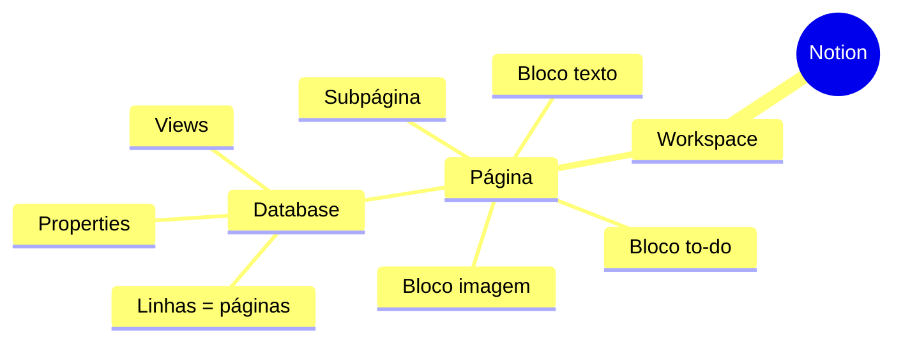
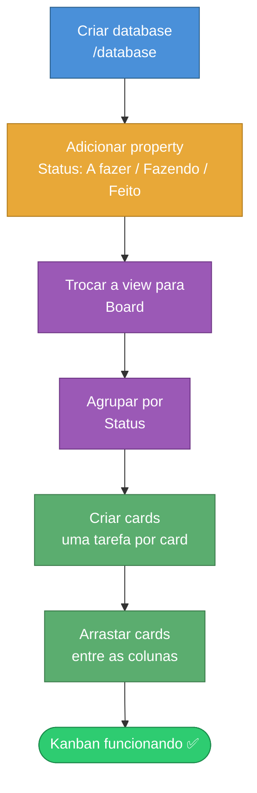
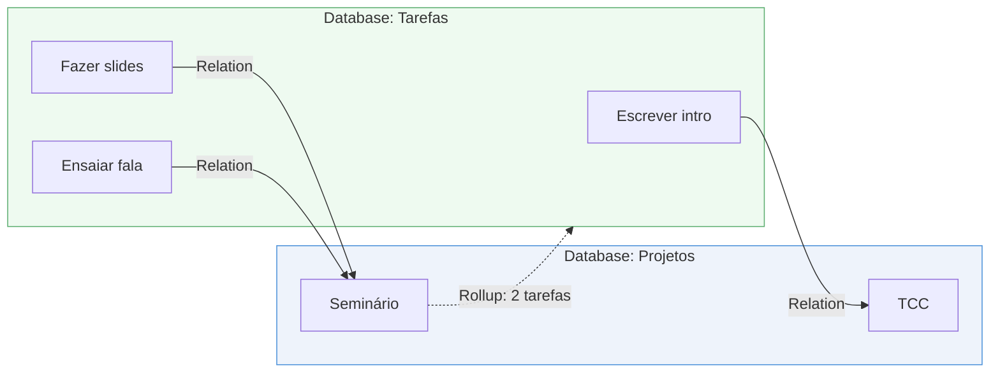

# Notion para Gerenciamento de Projetos e Estudos

> [!quote] Um lugar para tudo
> *Anotações, tarefas, banco de dados, wiki e planejamento na mesma ferramenta. O Notion é onde a bagunça de "vários apps" vira um sistema só.*

> [!info] O que você vai sair sabendo fazer
> Ao final desta aula você terá uma conta no Notion e terá construído, com as próprias mãos, um quadro Kanban de projeto, um calendário de estudos e uma relação entre dois bancos de dados. Tudo prático, dentro do [notion.so](https://notion.so/).

---

## 🧩 O que é o Notion (e por que ele é diferente)

O Notion é um **workspace tudo-em-um**: um único aplicativo que junta o que normalmente você usaria em quatro ou cinco ferramentas separadas (um app de notas, uma planilha, um quadro de tarefas, uma wiki e um calendário).

> [!tip] Duas analogias para fixar
> - **Lego de blocos:** no Notion, tudo é um *bloco* (um parágrafo, uma imagem, uma tabela, um checkbox). Você empilha e reorganiza os blocos como peças de Lego para montar a página que quiser.
> - **Planilha turbinada:** um *database* do Notion é como uma planilha do Excel que ganhou superpoderes. Cada linha pode virar uma página inteira, e a mesma tabela pode ser vista como quadro Kanban, calendário ou galeria.

| Ferramenta tradicional | O que o Notion substitui |
|------------------------|--------------------------|
| Word / Google Docs | Páginas com texto rico |
| Excel / Sheets | Databases (tabelas inteligentes) |
| Trello | View Board (Kanban) |
| Google Agenda | View Calendar |
| Wiki / Confluence | Páginas aninhadas e links |

![[Recursos/Roadmap do futuro/Notion/notion-logo.png|Logo do Notion|180]]

> [!example] 🧪 Atividade 1: Criar sua conta e seu primeiro workspace
> **Passos:**
> 1. Acesse [notion.so](https://notion.so/) e clique em **"Get Notion free"** (a conta gratuita pessoal é suficiente para esta aula inteira).
> 2. Faça login com Google ou e-mail.
> 3. Quando o app abrir, repare na **barra lateral esquerda**: ela lista suas páginas. Clique no botão **"+ New page"** e dê o título **`Meu Workspace de Estudos`**.
>
> **Resultado observável:** uma página em branco com o título `Meu Workspace de Estudos` aparece na barra lateral esquerda. Você está dentro do seu workspace.

---

## 📄 Páginas e Blocos: a unidade fundamental

No Notion, **tudo é uma página** e **toda página é feita de blocos**. Uma página pode conter outra página dentro dela (páginas aninhadas), e é assim que você cria uma hierarquia, igual a pastas dentro de pastas.

Para criar um bloco, basta digitar `/` (barra) em qualquer linha vazia: aparece um menu com todos os tipos de bloco disponíveis.

| Bloco | Como chamar | Para que serve |
|-------|-------------|----------------|
| Texto / Heading | `/h1`, `/h2`, `/text` | Títulos e parágrafos |
| Lista de tarefas | `/todo` | Checkbox que marca/desmarca |
| Callout | `/callout` | Caixa de destaque com ícone |
| Toggle | `/toggle` | Bloco que esconde/mostra conteúdo |
| Subpágina | `/page` | Página dentro da página |
| Database | `/database` | Tabela inteligente (próxima seção) |

> [!info] Lendo o diagrama
> O workspace contém páginas. Cada página é um conjunto de blocos. Um dos tipos de bloco é o **database**, que por dentro tem suas próprias linhas (cada uma também é uma página), suas *properties* e várias *views*. É essa estrutura aninhada que dá flexibilidade ao Notion.

> [!example] 🧪 Atividade 2: Montar uma página com blocos variados
> **Passos:**
> 1. Dentro de `Meu Workspace de Estudos`, digite `/h2` e escreva **`Minhas Metas`**. Tecle Enter.
> 2. Na linha seguinte, digite `/todo` e escreva **`Estudar Notion`**. Crie mais dois: **`Montar meu Kanban`** e **`Criar meu calendário`**.
> 3. Marque a caixa da primeira tarefa clicando no quadradinho.
> 4. Digite `/callout`, escreva **`Foco da semana: organização`** e troque o ícone para 🎯.
>
> **Resultado observável:** sua página tem um subtítulo "Minhas Metas", três checkboxes (um deles marcado e riscado) e uma caixa colorida de destaque com o emoji 🎯.

---

## 🗃️ Databases: a planilha que vira qualquer coisa

Um **database** é uma coleção de itens em que **cada linha é uma página** com campos preenchíveis. É o coração do Notion para gerenciamento de projetos. O mesmo conjunto de dados pode ser exibido de seis maneiras diferentes, chamadas de **views**.

| View | Aparência | Melhor uso |
|------|-----------|------------|
| **Table** 📊 | Planilha (linhas e colunas) | Visão geral completa, editar muitos campos |
| **Board** 📋 | Colunas estilo Kanban | Fluxo de trabalho: A fazer → Fazendo → Feito |
| **Calendar** 📅 | Calendário mensal | Prazos e datas |
| **Timeline** 📆 | Linha do tempo (Gantt) | Duração e dependências de tarefas |
| **List** 📃 | Lista limpa e minimalista | Leitura rápida, poucos detalhes |
| **Gallery** 🖼️ | Cartões com imagem | Destacar capas, fichas visuais |

> [!tip] O pulo do gato
> A mesma tarefa pode aparecer como **Board** para quem executa, **Calendar** para quem acompanha prazos e **Timeline** para quem planeja, **sem duplicar dado nenhum**. Você muda só a forma de ver, não os dados.

### 🔧 Properties: as colunas inteligentes

Cada coluna de um database é uma **property** (propriedade), e ela tem um *tipo* que define o que pode ser guardado ali.

| Property | Tipo de dado | Exemplo no projeto |
|----------|--------------|--------------------|
| **Status** | Etapa com cores | A fazer / Fazendo / Feito |
| **Date** | Data ou intervalo | Prazo: 30/06/2026 |
| **Select** | Uma opção de uma lista | Prioridade: Alta |
| **Multi-select** | Várias opções | Tags: `faculdade`, `urgente` |
| **Person** | Pessoa do workspace | Responsável |
| **Relation** | Link para outro database | Tarefa → Projeto |

> [!warning] Status não é o mesmo que Select
> O tipo **Status** é especial: ele já vem dividido em três grupos (To-do, In progress, Complete) e é desenhado para fluxos de trabalho. Use **Status** para o andamento da tarefa e **Select** para classificações soltas (prioridade, matéria, tipo).

---

## 📋 Montando um Board (Kanban) de projeto

O fluxo abaixo mostra o caminho completo para transformar um database vazio em um quadro Kanban funcional:

> [!example] 🧪 Atividade 3: Criar um Board Kanban e mover cards
> **Passos:**
> 1. Em uma linha nova, digite `/database` e escolha **"Database - Inline"**. Dê o nome **`Projeto: Trabalho de Faculdade`**.
> 2. Ele nasce como Table. Clique no `+` ao lado do nome de uma coluna, escolha o tipo **Status** e nomeie a property como **`Status`** (ela já trará A fazer / Fazendo / Feito).
> 3. No topo do database, clique no nome da view atual (ou no `+` de views) e troque para **Board**. Confirme que o agrupamento (*Group by*) está em **Status**.
> 4. Crie **3 cards**: `Escolher o tema`, `Escrever a introdução`, `Revisar e entregar`.
> 5. **Arraste** o card `Escolher o tema` para a coluna **Feito** e o card `Escrever a introdução` para **Fazendo**.
>
> **Resultado observável:** um quadro com três colunas; um card em "Feito", um em "Fazendo" e um em "A fazer". Ao arrastar, o card muda de coluna E a property Status muda junto, automaticamente.

---

## 📅 Views, Filtros e o Calendário

A grande sacada das views é que você pode aplicar **filtros**, **ordenações** e **agrupamentos** diferentes em cada uma, sobre o mesmo database.

| Recurso | O que faz | Exemplo |
|---------|-----------|---------|
| **Filter** | Mostra só os itens que batem com uma regra | Só tarefas com Status ≠ Feito |
| **Sort** | Ordena os itens | Por prazo, da mais próxima para a mais distante |
| **Group** | Agrupa visualmente | Por matéria, por prioridade |

> [!success] Por que isso importa nos estudos
> Você cria uma view **Calendar** para enxergar todas as provas e entregas do semestre no mês certo, e uma view **Board** filtrada só com "o que falta fazer". Mesmo dado, dois ângulos. Nada é digitado duas vezes.

> [!example] 🧪 Atividade 4: Adicionar uma view Calendar com datas
> **Passos:**
> 1. No mesmo database `Projeto: Trabalho de Faculdade`, adicione uma property do tipo **Date** chamada **`Prazo`**.
> 2. Abra cada um dos 3 cards e preencha um `Prazo` diferente (ex.: hoje, daqui a 3 dias, daqui a 10 dias).
> 3. Clique no `+` de views no topo e crie uma nova view do tipo **Calendar**.
> 4. Em **Filter**, adicione a regra **Status is not Feito**.
>
> **Resultado observável:** um calendário mensal mostrando os cards nos dias dos respectivos prazos, exibindo apenas as tarefas que ainda não foram concluídas (o card "Feito" some do calendário por causa do filtro).

---

## 🔗 Templates: pare de montar tudo do zero

Um **template** é uma estrutura pronta que você duplica para o seu workspace. Em vez de construir um sistema de gestão de projetos peça por peça, você duplica um modelo e adapta.

- **Template Gallery do Notion:** modelos oficiais e da comunidade (em [notion.so/templates](https://www.notion.com/templates)). O modelo oficial **"Projects & Tasks"** já vem com dois databases conectados (Projetos e Tarefas) e views de Board, Table e Timeline prontas.
- **Template buttons (botões de template):** dentro de um database, você define um modelo de página. Toda vez que clicar no botão, um item novo nasce já preenchido (ótimo para "Nova aula", "Nova tarefa", "Nova leitura").

> [!tip] Regra prática
> A maioria dos templates é configurada em **5 a 10 minutos**. Os mais avançados levam de 20 a 30 minutos. Comece com um simples e personalize: adicione properties, mude o layout, adapte ao seu fluxo. A vantagem é não começar da página em branco.

> [!example] 🧪 Atividade 5: Duplicar um template oficial
> **Passos:**
> 1. Acesse [notion.so/templates](https://www.notion.com/templates) e procure por **"Projects & Tasks"** (ou pela categoria *Project Management*).
> 2. Abra o template e clique em **"Get template"** / **"Duplicate"** para copiá-lo ao seu workspace.
> 3. No database de Tarefas que veio junto, **crie uma tarefa de teste** e marque seu Status como "Fazendo".
> 4. Abra a view **Board** desse template e confirme que a tarefa aparece na coluna certa.
>
> **Resultado observável:** o template "Projects & Tasks" aparece na sua barra lateral com os databases já montados, e a tarefa que você criou aparece na coluna "Fazendo" do Board pré-pronto, sem você ter configurado nada.

---

## 🪢 Relações entre Databases

A property **Relation** é a mais poderosa do Notion: ela cria uma **ponte entre dois databases**. Com ela, cada tarefa pode apontar para o projeto a que pertence, e cada projeto enxerga todas as suas tarefas.

A partir de uma Relation, você pode usar um **Rollup**: uma property que "olha para o outro lado da ponte" e traz um resumo (contar quantas tarefas, somar horas, mostrar a data mais próxima).

> [!info] Lendo o diagrama
> Cada tarefa (database **Tarefas**) está ligada por uma **Relation** a um projeto (database **Projetos**). O projeto "Seminário" tem duas tarefas ligadas; um **Rollup** consegue contar e mostrar "2 tarefas" no card do projeto. É assim que você obtém progresso e contagens em tempo real, sem planilha paralela.

> [!example] 🧪 Atividade 6: Ligar Tarefas a Projetos com uma Relation
> **Passos:**
> 1. Crie um novo database inline chamado **`Projetos`** com 2 itens: `TCC` e `Seminário`.
> 2. Volte ao database `Projeto: Trabalho de Faculdade` (suas tarefas) e adicione uma property do tipo **Relation**, apontando para o database **`Projetos`**. Nomeie como **`Projeto`**.
> 3. Em cada tarefa, abra o card e escolha a qual projeto ela pertence.
> 4. (Bônus) No database `Projetos`, adicione uma property **Rollup** que conte quantas tarefas estão relacionadas a cada projeto.
>
> **Resultado observável:** ao abrir o item `Seminário` no database Projetos, você vê listadas as tarefas ligadas a ele. Se fez o bônus, aparece o número de tarefas relacionadas calculado automaticamente.

---

## 🤖 Notion AI (recursos 2026)

Em 2026, a inteligência artificial deixou de ser um "extra pago" e passou a vir **incluída em todos os planos pagos** (a Notion removeu o add-on de IA cobrado por usuário no fim de 2025). As principais capacidades hoje:

| Recurso | O que faz | Novidade |
|---------|-----------|----------|
| **Writer** | Gera rascunhos, resume, corrige texto. Basta apertar a barra de espaço numa linha vazia | Vence o "medo da página em branco" |
| **Q&A / Search** | Você pergunta em linguagem natural e ele responde puxando de todo o seu workspace (e de apps conectados como Drive, Slack, GitHub), **citando a fonte** | Busca que entende contexto |
| **AI Autofill** | Preenche automaticamente colunas de um database (classifica, resume, extrai dados) | Latência caiu para menos de 3 s em 2026 |
| **Custom Agents** | Agentes nomeados que rodam em horários ou gatilhos e escrevem resultados de volta nos seus databases | Lançado em 2026 |
| **Meeting Notes** | Transcreve reuniões e gera resumo/pauta, sem bot externo | Controle de consentimento de áudio |

> [!warning] Cuidado de estudante e profissional
> A IA é assistente, não autora. Use o **Writer** para destravar um rascunho e o **Q&A** para reencontrar o que você mesmo anotou, mas **revise sempre**: o modelo pode errar fatos. Em trabalho acadêmico, conteúdo gerado por IA exige conferência e citação adequada.

> [!example] 🧪 Atividade 7 (opcional): Pedir um resumo ao Notion AI
> **Passos:**
> 1. Em uma página nova, cole um parágrafo qualquer de um material de estudo seu (3 a 5 frases).
> 2. Selecione o texto e clique em **"Ask AI"** (ou aperte a barra de espaço numa linha vazia logo abaixo).
> 3. Escolha **"Summarize"** (resumir) ou peça **"Liste 3 pontos-chave deste texto"**.
> 4. Compare o resumo gerado com o texto original e ajuste o que estiver impreciso.
>
> **Resultado observável:** um bloco novo com o resumo gerado pela IA aparece na página. Você confere se ele representa fielmente o conteúdo e corrige eventuais imprecisões.

---

## 🎓 Notion para estudos: montando o sistema

Juntando tudo, um sistema de estudos completo no Notion costuma ter:

| Peça | Como construir | View ideal |
|------|----------------|------------|
| **Matérias** | Database com uma página por disciplina | List ou Gallery |
| **Tarefas / Entregas** | Database com Status + Date + Relation para Matérias | Board (o que fazer) + Calendar (prazos) |
| **Anotações de aula** | Subpáginas dentro de cada matéria | Página com blocos |
| **Cronograma** | View Timeline das entregas | Timeline |
| **Revisão** | View filtrada (Status = Revisar) | Board ou List |

> [!success] Resultado final
> Com um database de Tarefas ligado a um de Matérias, você abre um **Board** para ver o que fazer hoje, um **Calendar** para os prazos do mês e a página da matéria para suas anotações, tudo conectado. Esse é o ganho real do Notion: um sistema, várias visões.

---

## 🧠 Quiz Rápido (conceitual, opcional)

> [!question] Teste seu entendimento
> 1. Qual a diferença entre uma **view Table** e uma **view Board** sobre o mesmo database?
> 2. Quando usar a property **Status** em vez de **Select**?
> 3. O que uma property **Relation** conecta, e o que um **Rollup** faz a partir dela?
> 4. Por que duplicar um **template** economiza tempo em vez de montar do zero?
>
> *(Responda mentalmente ou anote. As respostas estão espalhadas pelas seções acima.)*

---

> [!note] 📚 Fontes (2026)
> - [Notion Help Center: Views, filters & sorts](https://www.notion.com/help/views-filters-and-sorts)
> - [Notion Help Center: Relations & rollups](https://www.notion.com/help/relations-and-rollups)
> - [Notion Templates (galeria oficial)](https://www.notion.com/templates)
> - [How to Create a Database in Notion (2026 Guide), useCarly](https://www.usecarly.com/blog/how-to-create-database-in-notion/)
> - [The Complete Guide to Notion in 2026: AI Agents, Pricing, Features & Setup](https://smartproductivitytools.com/notion-complete-guide/)
> - [Notion AI Updates 2025-2026: Complete Timeline (Fazm)](https://fazm.ai/blog/notion-ai-updates-2025-2026)
> - [What Is Notion AI? Features, Custom Agents & Pricing 2026 (TechJack)](https://techjacksolutions.com/ai-tools/notion-ai/what-is-notion-ai/)
> - [Best Notion Project Management Templates 2026 (Notion Everything)](https://www.notioneverything.com/blog/notion-project-management-templates)
> - [Notion Database Properties Explained (NotionApps)](https://www.notionapps.com/blog/notion-database-properties-explained)
> - Logo: [Notion-logo.svg (Wikimedia Commons)](https://commons.wikimedia.org/wiki/File:Notion-logo.svg)
