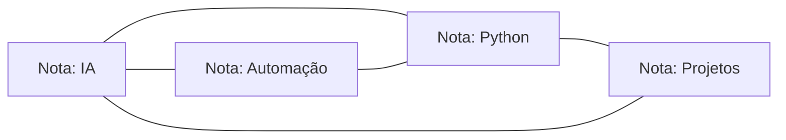

# Obsidian

> [!quote] Seu segundo cérebro
> *Obsidian transforma um monte de anotações soltas em uma rede de conhecimento conectada. Você escreve em arquivos de texto simples (Markdown), que ficam no SEU computador, e liga uma ideia na outra com `[[links]]`.*

> [!info] O que é
> Um app de **notas e gestão de conhecimento** que guarda tudo como arquivos **Markdown** em texto puro no seu dispositivo. Você é dono dos dados: por padrão, nada depende de uma nuvem proprietária.

---

## 🧠 Por que Obsidian

| Recurso | O que faz |
|---|---|
| **Local-first + Markdown** | Suas notas são arquivos `.md` no seu disco: funcionam sem internet, abrem em qualquer editor e duram para sempre. |
| **Links bidirecionais** | Liga uma nota na outra com `[[Nome da Nota]]`. A nota de destino "sabe" quem aponta pra ela (backlinks). |
| **Graph view** | Um grafo visual de todas as notas e conexões. Você vê o conhecimento virar uma rede. |
| **Canvas** | Uma tela infinita pra arrastar notas, imagens e cards e desenhar conexões. Bom pra brainstorm e mapas mentais. |
| **Bases** (2026) | Transforma notas com propriedades em bancos de dados e tabelas, no estilo planilha. |
| **+1000 plugins** | Comunidade enorme: temas, automações, integrações. Um sistema sem teto. |

> Cada nota é um nó; cada `[[link]]` vira uma aresta. É assim que um monte de notas soltas vira um segundo cérebro.

---

## 🆚 Obsidian ou Notion?

| Você quer... | Use |
|---|---|
| Notas pessoais, dono dos arquivos, offline | **Obsidian** |
| Colaboração em equipe, banco de dados na nuvem | **Notion** |
| Documentação técnica | Qualquer um dos dois |

> [!tip] Os dois convivem
> Muita gente usa Obsidian pro conhecimento pessoal (segundo cérebro) e Notion pro trabalho em equipe. Veja também [[Notion - Gerenciamento de Projetos]].

---

> [!example] 🧪 Atividade: monte seu primeiro grafo
> 1. Baixe e instale o **[Obsidian](https://obsidian.md/)** (grátis, Windows/Mac/Linux/celular) e crie um cofre (vault) novo.
> 2. Crie **2 notas**: uma chamada `IA` e outra `Meu Projeto`.
> 3. Dentro de `Meu Projeto`, escreva uma linha ligando à outra: `Este projeto usa [[IA]].`
> 4. Abra o **Graph View** (ícone de grafo na lateral) e veja as duas notas conectadas por uma linha.
> 5. Resultado observável: abra a nota `IA` e veja a seção **Backlinks** mostrando que `Meu Projeto` aponta pra ela. Você acabou de criar conhecimento conectado.

> [!tip] 🤓 Curiosidade
> **Este site de aulas é escrito no Obsidian** e publicado na web automaticamente. As próprias páginas que você está lendo são arquivos Markdown ligados por `[[links]]`.

---

## 📚 Fontes (2026)

> [!note] Para se aprofundar
> - [Site oficial do Obsidian](https://obsidian.md/)
> - [Why Use Obsidian: Graph View & Linked Notes (TechTimes, 2026)](https://www.techtimes.com/articles/315717/20260407/why-use-obsidian-note-taking-graph-view-linked-notes-powerful-knowledge-management.htm)
> - [Obsidian Review 2026 (ClickUp)](https://clickup.com/learn/topic/productivity/tools/obsidian/)

---

## 📎 Veja Também

- [[Notion - Gerenciamento de Projetos]]
- [[Automações]]
- [[Fluxos e orquestração]]
