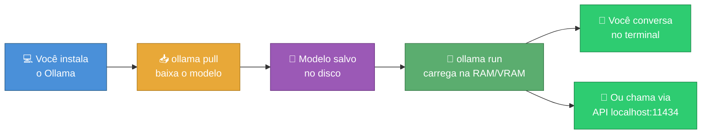
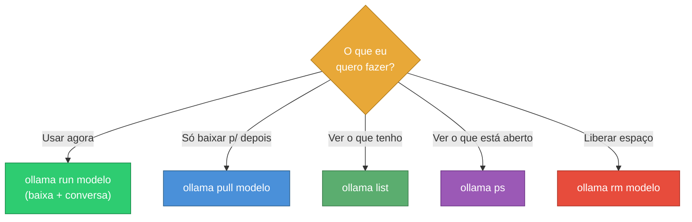
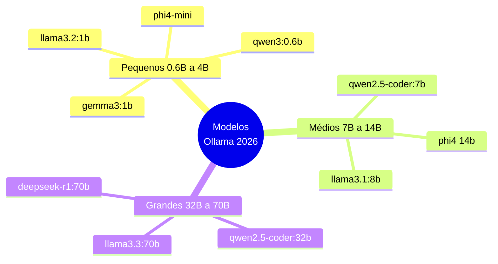
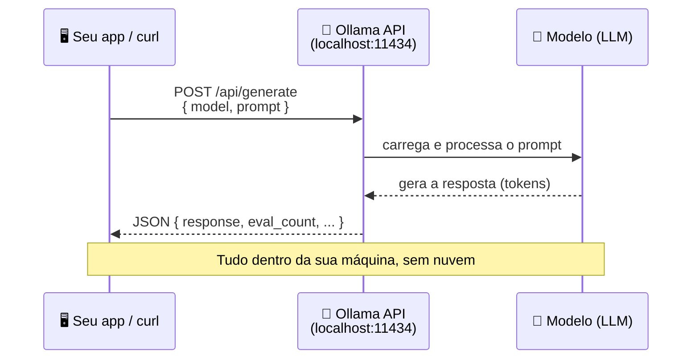
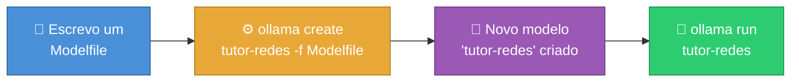

# Ollama - Gerenciamento de Modelos de IA

> [!quote] IA na Sua Máquina
> *Ollama deixa você baixar e conversar com modelos de IA poderosos no seu próprio computador: sem mensalidade, sem internet obrigatória e sem mandar seus dados para a nuvem de ninguém.*

> [!info] O que você vai conseguir fazer ao fim desta aula
> Instalar o Ollama, baixar um modelo, conversar com ele pelo terminal, medir a velocidade em tokens por segundo, chamar a IA pela API local com `curl` e criar a sua própria versão personalizada de um modelo com um Modelfile.

![[Recursos/Roadmap do futuro/Ollama/ollama-logo.png|O mascote do Ollama: uma lhama. O nome vem do animal, primo do "Llama" da Meta]]

---

## 🦙 O que é o Ollama (e por que rodar IA local)

Pense no Ollama como um **"Spotify de modelos de IA, mas offline"**: em vez de pagar por música que toca da nuvem, você baixa o arquivo e ele toca direto no seu aparelho. Aqui o "arquivo" é um modelo de linguagem (LLM, *Large Language Model*) e o "tocador" é o Ollama.

Um LLM é o mesmo tipo de tecnologia por trás do ChatGPT. A diferença é **onde ele roda**: na nuvem de uma empresa ou na sua máquina.

> [!info] Ferramenta open-source
> O Ollama é **código aberto e gratuito**. Ele empacota o modelo, as configurações e o motor de execução em um comando só, escondendo a complexidade técnica de rodar uma IA.

| Motivo para rodar local | O que isso significa na prática |
|----------------------|-------------------------------|
| 🔒 **Privacidade** | O texto que você digita **não sai do seu computador**. Nada de prompt indo para servidor de terceiro. Ideal para dados sensíveis (trabalho, pesquisa, código da empresa). |
| 💸 **Custo zero por uso** | Sem cobrança por token, sem mensalidade, sem cartão de crédito. Você paga só a conta de luz do seu PC. |
| ✈️ **Funciona offline** | Depois de baixar o modelo, funciona **sem internet**: no ônibus, no avião, num lab sem rede. |
| 🛠️ **Controle total** | Você escolhe o modelo, ajusta o comportamento e integra com seus próprios programas. |

> [!warning] O trade-off honesto
> IA local **não é mágica**. Um modelo que cabe num notebook comum é mais fraco que os gigantes da nuvem (GPT, Gemini, Claude). A troca é: você ganha privacidade e custo zero, mas pode perder qualidade e velocidade dependendo do seu hardware. Para muitas tarefas do dia a dia, o modelo local já resolve.

---

## ⚙️ Como o Ollama funciona por dentro

Quando você manda o Ollama rodar um modelo, três coisas acontecem em sequência: ele **baixa** o modelo (uma vez só), **carrega** na memória e abre um **chat** para você.



> [!info] Detalhe importante
> O Ollama roda um **servidor local** em segundo plano (na porta `11434`). É por isso que ele consegue atender tanto o terminal quanto outros programas ao mesmo tempo. Guarde esse número: ele volta na parte da API.

---

## 📥 Instalação (Linux, Mac e Windows)

A instalação é de um comando (ou um clique). Escolha o seu sistema.

| Sistema | Como instalar |
|---------|---------------|
| 🐧 **Linux** | No terminal: `curl -fsSL https://ollama.com/install.sh \| sh` |
| 🍎 **macOS** | Baixe o app em [ollama.com/download](https://ollama.com/download) e arraste para Aplicativos (ou `brew install ollama`). No Apple Silicon (M1/M2/M3+), a GPU é usada automaticamente via Metal. |
| 🪟 **Windows** | Baixe o instalador `.exe` em [ollama.com/download](https://ollama.com/download) e execute. Em 2026 há build **nativo ARM64** (sem perda de desempenho por emulação). |

> [!tip] Como saber se deu certo
> Abra o terminal (no Windows, o PowerShell) e digite `ollama --version`. Se aparecer um número de versão, está instalado. Se der "comando não encontrado", feche e reabra o terminal.

> [!success] Site oficial
> 🔗 [ollama.com](https://ollama.com/): downloads, documentação e a biblioteca completa de modelos em [ollama.com/library](https://ollama.com/library).

---

> [!example] 🧪 Atividade 1: Instalar o Ollama e confirmar a versão
>
> **O que fazer:**
> 1. Acesse [ollama.com/download](https://ollama.com/download) e instale pelo método do seu sistema (tabela acima).
> 2. Abra o terminal (Windows: PowerShell).
> 3. Rode:
>
> ```bash
> ollama --version
> ```
>
> **Resultado observável:** aparece algo como `ollama version is 0.x.x`. Esse número confirma que o servidor local está instalado e pronto.
>
> **Se der errado:** "comando não encontrado" quase sempre se resolve fechando e reabrindo o terminal (o sistema precisa recarregar o PATH).

---

## 💬 Comandos essenciais

Toda a interação com o Ollama acontece por comandos curtos no terminal. Estes seis cobrem 95% do uso real:

| Comando | O que faz | Analogia |
|---------|-----------|----------|
| `ollama pull <modelo>` | **Baixa** o modelo para o disco | Baixar um app da loja |
| `ollama run <modelo>` | **Conversa** com o modelo (baixa antes se preciso) | Abrir o app e usar |
| `ollama list` | **Lista** os modelos que você já baixou | Ver os apps instalados |
| `ollama ps` | Mostra o que está **carregado na memória agora** | Ver os apps abertos |
| `ollama rm <modelo>` | **Apaga** um modelo e libera espaço em disco | Desinstalar um app |
| `ollama show <modelo>` | Mostra **detalhes** (tamanho, parâmetros, licença) | Ver a ficha do app |

> [!tip] Dentro do chat (ollama run)
> Quando você está conversando, digite `/bye` para sair, `/?` para ver os comandos do chat e `/set verbose` para o Ollama mostrar a **velocidade em tokens por segundo** ao fim de cada resposta. Você também pode iniciar já no modo detalhado: `ollama run llama3.2 --verbose`.



---

> [!example] 🧪 Atividade 2: Sua primeira conversa com uma IA local
>
> Vamos usar o **`gemma3:1b`** (modelo do Google, ~815 MB). Ele é pequeno de propósito: cabe até em PC modesto.
>
> **O que fazer:**
> 1. No terminal, rode:
>
> ```bash
> ollama run gemma3:1b
> ```
>
> 2. Espere o download terminar (uma vez só). Quando aparecer o prompt `>>>`, digite uma pergunta, por exemplo: `Explique o que é um algoritmo em uma frase.`
> 3. Para sair, digite `/bye`.
>
> **Resultado observável:** o modelo responde na sua tela, **gerando o texto palavra por palavra, rodando 100% no seu computador**. Desconecte o Wi-Fi e pergunte de novo: continua funcionando.
>
> > [!note] 💻 PC fraco? Sem problema
> > Se mesmo o `gemma3:1b` travar, troque por `llama3.2:1b` (~1.3 GB) ou `qwen3:0.6b` (~500 MB), os menores da lista. Notebook com 8 GB de RAM roda modelos de 1B a 4B tranquilamente.

---

## 🚀 Modelos populares em 2026

A biblioteca oficial passa de **200 modelos** e cresce toda semana. Estes são os mais usados em 2026, com a família e o ponto forte de cada um:

| Modelo (família) | Quem fez | Forte em | Tag de exemplo |
|------------------|----------|----------|----------------|
| **Llama 3.x** | Meta | Conversa geral, o mais baixado | `llama3.2`, `llama3.3` |
| **Gemma 3** | Google | Leve e eficiente, ótimo custo-benefício | `gemma3:4b` |
| **Qwen 3** | Alibaba | Versátil, do 0.6B ao gigante; ótimo em código | `qwen3`, `qwen2.5-coder` |
| **DeepSeek R1** | DeepSeek | **Raciocínio**: mostra o "pensamento" passo a passo | `deepseek-r1` |
| **Phi-4** | Microsoft | Matemática e lógica acima do peso (14B rivaliza com 70B) | `phi4`, `phi4-mini` |

> [!tip] Como ler o nome de um modelo
> O número antes do `b` é a quantidade de **parâmetros em bilhões** (de "billion"). Mais parâmetros = mais "inteligente", porém mais pesado e lento. `gemma3:1b` tem 1 bilhão; `llama3.3:70b` tem 70 bilhões. A tag depois dos dois-pontos escolhe **qual tamanho** baixar.



> [!info] Especialistas existem
> Além dos generalistas, há modelos **especializados**: `qwen2.5-coder` é o mais forte para programação; `deepseek-r1` brilha em problemas que exigem raciocínio (matemática, lógica). Escolha pela tarefa, não pelo hype.

---

## 🧮 Tamanhos, requisitos e quantização

A pergunta que todo iniciante faz: *"meu PC aguenta?"*. A resposta depende de duas coisas: o **tamanho do modelo** e a sua **memória** (RAM, ou VRAM se você tem placa de vídeo dedicada).

> [!info] O que é quantização (sem matemática)
> Quantização é **comprimir** o modelo para ocupar menos memória, com perda mínima de qualidade. É como salvar uma foto em JPEG em vez de RAW: o arquivo fica muito menor e, no dia a dia, você quase não nota a diferença. O Ollama já entrega os modelos quantizados por padrão (geralmente no formato `Q4`, que é o equilíbrio entre tamanho e qualidade).

| Tamanho | Memória recomendada (quantizado Q4) | Roda em... |
|---------|--------------------------------------|-----------|
| **1B a 4B** | 4 a 8 GB | Notebook comum, sem placa de vídeo |
| **7B a 9B** | 8 GB | Cabe em 8 GB; 12-16 GB roda mais folgado e rápido |
| **13B a 14B** | 8 a 10 GB | PC mais robusto ou placa de vídeo dedicada |
| **32B** | ~24 GB | Placa de vídeo parruda |
| **70B** | 38 a 48 GB | Estação de trabalho ou 2 placas de vídeo |

> [!warning] O contexto também pesa
> Quanto mais texto você manda de uma vez (o "contexto"), mais memória o modelo gasta **além** do peso dele. Um modelo de 8B pode usar +5 GB só de contexto numa conversa longa. Conversas curtas pesam pouco; documentos enormes pesam muito.

> [!tip] Regra de bolso
> Comece pequeno. Rode um modelo de 1B ou 4B, veja se a velocidade te agrada, e só suba de tamanho se precisar de mais qualidade **e** seu hardware permitir. É mais fácil subir do que sofrer com um modelo travando.

---

> [!example] 🧪 Atividade 3: Listar modelos e medir a velocidade (tokens/s)
>
> **Parte A, ver o que você baixou:**
> ```bash
> ollama list
> ```
> **Resultado observável:** uma tabela com NOME, ID, TAMANHO (em GB) e quando foi modificado. Você deve ver pelo menos o `gemma3:1b` da Atividade 2.
>
> **Parte B, medir a velocidade:**
> ```bash
> ollama run gemma3:1b --verbose
> ```
> Faça uma pergunta qualquer (ex.: `Liste 3 curiosidades sobre lhamas.`) e, ao fim da resposta, leia as estatísticas.
>
> **Resultado observável:** aparecem linhas como `eval rate: 42.7 tokens/s`. Esse número é **quantas palavras-por-segundo o seu hardware gera**. Anote-o.
>
> **Desafio:** se conseguir, baixe um modelo um pouco maior (`ollama pull gemma3:4b`), rode com `--verbose` e **compare o tokens/s** com o `1b`. O que aconteceu com a velocidade? E com a qualidade da resposta? Saia com `/bye`.

---

## 🔌 A API local (http://localhost:11434)

Aqui mora o superpoder do Ollama: ele não serve só o terminal. Ele expõe uma **API** (uma "tomada" para outros programas) na porta `11434`. Qualquer aplicativo seu, em qualquer linguagem, pode pedir respostas para a IA via HTTP.

> [!info] Por que isso importa
> Com a API, você liga a IA local ao **seu próprio código**: um script Python, um site, um bot, uma automação. A IA vira uma peça do seu sistema, não só um chat. E continua tudo local e gratuito.



Os dois endpoints mais usados:

| Endpoint | Para que serve |
|----------|----------------|
| `POST /api/generate` | Uma pergunta avulsa, resposta única |
| `POST /api/chat` | Conversa com histórico (várias mensagens, papéis `user`/`assistant`) |

> [!tip] stream: false
> Por padrão a API responde **em pedaços** (streaming), útil para ir mostrando o texto. Para receber a resposta **inteira de uma vez** (mais fácil de ler em teste), envie `"stream": false`.

---

> [!example] 🧪 Atividade 4: Chamar a IA pela API com curl
>
> Com o Ollama instalado, o servidor já está rodando na porta `11434`. Vamos pedir uma resposta por HTTP, sem abrir o chat.
>
> **O que fazer (Linux/Mac):**
> ```bash
> curl http://localhost:11434/api/generate -d '{
>   "model": "gemma3:1b",
>   "prompt": "Explique o que e o Ollama em uma frase.",
>   "stream": false
> }'
> ```
>
> > [!note] 🪟 No Windows (PowerShell)
> > O `curl` do PowerShell é diferente. Use:
> > ```powershell
> > curl http://localhost:11434/api/generate -Method POST -Body '{"model":"gemma3:1b","prompt":"Explique o que e o Ollama em uma frase.","stream":false}'
> > ```
>
> **Resultado observável:** volta um **JSON** com vários campos. O que interessa:
> - `response`: o texto que a IA gerou.
> - `eval_count`: quantos tokens (palavras) ela produziu.
> - `eval_duration`: quanto tempo levou, em nanossegundos.
>
> **Conta de padeiro (tokens/s):** `tokens_por_segundo = eval_count / (eval_duration / 1.000.000.000)`. Confira se bate com o número que você viu no `--verbose` da Atividade 3.

---

## 📝 Modelfile: criando o seu próprio modelo

E se você quisesse uma IA que **sempre** se comporta de um jeito específico, sem precisar repetir a instrução toda vez? É para isso que serve o **Modelfile**.

> [!info] Analogia: a "ficha de personagem"
> O Modelfile é como uma **ficha de personagem** que você entrega ao modelo: "você é um tutor de redes paciente, responde sempre em português e em no máximo 3 frases". Você configura uma vez, salva, e o modelo nasce já com essa personalidade. É parecido com um `Dockerfile`, mas para IA.

As instruções principais de um Modelfile:

| Instrução | O que define |
|-----------|--------------|
| `FROM` | O modelo-base de onde você parte (ex.: `llama3.2`) |
| `SYSTEM` | A "personalidade" / regras permanentes do seu modelo |
| `PARAMETER` | Ajustes de comportamento (ex.: `temperature`, a "criatividade") |

> [!tip] Temperature: o botão da criatividade
> `temperature` baixa (ex.: `0.2`) deixa as respostas mais **previsíveis e diretas** (bom para fatos e código). Alta (ex.: `1.0`) deixa mais **criativa e variada** (bom para brainstorm). O padrão costuma ser `0.8`.



---

> [!example] 🧪 Atividade 5: Criar um tutor de redes personalizado
>
> Vamos transformar um modelo genérico num **tutor de redes que responde curto e em português**.
>
> **Passo 1: crie um arquivo chamado `Modelfile`** (sem extensão) com este conteúdo:
> ```
> FROM gemma3:1b
> PARAMETER temperature 0.3
> SYSTEM """
> Voce e um tutor de Redes de Computadores paciente e didatico.
> Responda SEMPRE em portugues do Brasil.
> Use no maximo 3 frases por resposta e de um exemplo simples quando possivel.
> """
> ```
>
> **Passo 2: construa o seu modelo** (no terminal, na pasta onde salvou o arquivo):
> ```bash
> ollama create tutor-redes -f Modelfile
> ```
>
> **Passo 3: use o seu modelo:**
> ```bash
> ollama run tutor-redes
> ```
> Pergunte: `O que e um endereco IP?`
>
> **Resultado observável:** a resposta vem **curta, em português e com exemplo**, exatamente como você definiu no `SYSTEM`, sem você ter pedido isso na pergunta. Confirme que ele apareceu na lista com `ollama list` (vai constar `tutor-redes`).
>
> **Desafio:** mude o `SYSTEM` para outra persona (ex.: "responda como um pirata") e a `temperature` para `1.0`, recrie com outro nome e compare o tom das respostas.

---

## 🔗 Integrações: o Ollama dentro de outras ferramentas

Como o Ollama fala via API padrão, ele se conecta a um ecossistema enorme de aplicativos. Você não fica preso ao terminal.

| Ferramenta | O que ela adiciona |
|------------|--------------------|
| 🖥️ **Open WebUI** | Uma interface web tipo ChatGPT para o seu Ollama: histórico, vários modelos, upload de documentos (RAG). Roda local. |
| 🔁 **n8n** | Plataforma de automação "low-code": coloca a IA local dentro de fluxos (ler email, resumir, responder) sem programar muito. |
| 💻 **Editores de código** | Extensões (VS Code e afins) usam o Ollama como copiloto de programação **offline**. |

> [!info] Compatível com a API da OpenAI
> O Ollama também imita a API da OpenAI. Na prática: muitos apps feitos para o ChatGPT funcionam com o Ollama **trocando só o endereço** para `http://localhost:11434`. Isso abre as portas para centenas de ferramentas já existentes.

> [!success] Combo popular em 2026
> Um setup muito usado para "IA privada caseira" junta **Ollama + Open WebUI + n8n** (geralmente via Docker): o Ollama roda os modelos, o Open WebUI dá a cara de chat e o n8n automatiza tarefas. Tudo local, tudo seu.

---

## 🧠 Quiz Conceitual (opcional)

> [!question] Teste seu entendimento (responda de cabeça, depois confira)
> 1. Qual a principal vantagem de privacidade de rodar um LLM com Ollama em vez de usar uma IA na nuvem?
> 2. No nome `qwen3:8b`, o que significa o `8b`?
> 3. O que a quantização (formato `Q4`) faz com um modelo e por que isso é útil?
> 4. Em qual porta o servidor local do Ollama atende por padrão?
> 5. Qual instrução do Modelfile define a "personalidade" fixa do modelo?

> [!success] Respostas
> 1. O texto digitado não sai da máquina (nenhum prompt vai para servidor de terceiro). 2. O modelo tem **8 bilhões de parâmetros**. 3. Comprime o modelo para ocupar menos memória com perda mínima de qualidade, permitindo rodar em hardware mais modesto. 4. Porta **11434**. 5. A instrução **`SYSTEM`**.

---

## 📎 Veja Também

- [[Tópicos/Roadmap do futuro/Inteligência artificial|Inteligência artificial]]
- [[Conceitos gerais de programação]]
- [[Automações]]

---

> [!note] 📚 Fontes (2026)
> - [Ollama, site oficial e biblioteca de modelos](https://ollama.com/)
> - [Repositório oficial do Ollama no GitHub](https://github.com/ollama/ollama)
> - [Documentação da API do Ollama (/api/generate)](https://docs.ollama.com/api/generate)
> - [Best Ollama Models 2026: ranqueamento por tarefa | Morph](https://www.morphllm.com/best-ollama-models)
> - [Ollama Commands Cheat Sheet 2026 | ComputingForGeeks](https://computingforgeeks.com/ollama-models-cheat-sheet/)
> - [Ollama VRAM Requirements: Guia 2026 | LocalLLM.in](https://localllm.in/blog/ollama-vram-requirements-for-local-llms)
> - [Ollama on 8GB RAM: 7 modelos que funcionam (2026) | Webscraft](https://webscraft.org/blog/ollama-na-8-gb-ram-yaki-modeli-pratsyuyut-u-2026?lang=en)
> - [How to Create Custom Modelfiles in Ollama (fev/2026) | OneUptime](https://oneuptime.com/blog/post/2026-02-02-ollama-custom-modelfiles/view)
> - [Ollama Installation Windows, Mac & Linux: Full Guide 2026 | NeuraPlusAI](https://neuraplus-ai.github.io/blog/ollama-installation-windows-mac-linux-full-guide.html)
> - [Integrating n8n with Open WebUI | Pondhouse Data](https://www.pondhouse-data.com/blog/integrating-n8n-with-open-webui)
> - [Imagem da lhama: Wikimedia Commons, Llama lying down](https://commons.wikimedia.org/wiki/File:Llama_lying_down.jpg)
> - [Logo Ollama: Wikimedia Commons, Ollama-logo.svg](https://commons.wikimedia.org/wiki/File:Ollama-logo.svg)
