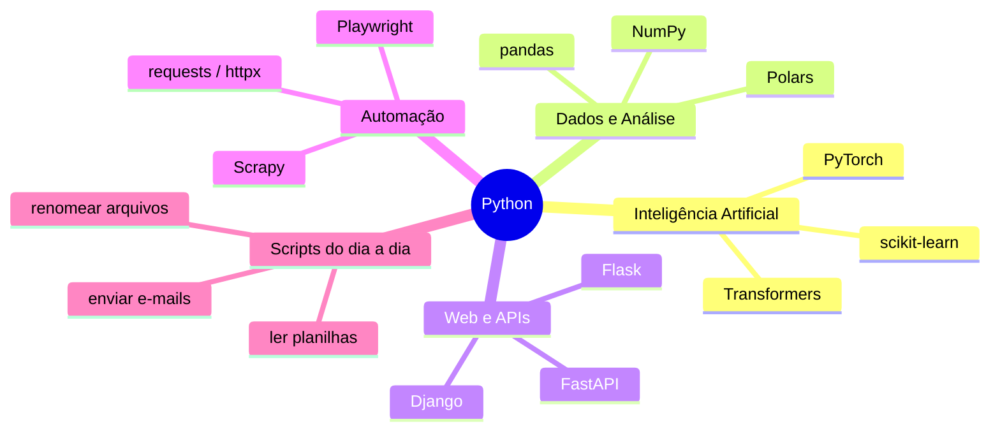
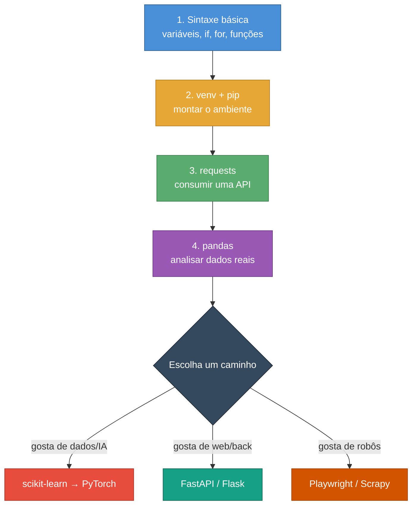

# Python - A Principal Linguagem do Futuro

> [!quote] O ângulo desta aula
> Esta página não ensina a *sintaxe* do Python (isso está nas aulas de Programação, linkadas abaixo). Aqui a pergunta é estratégica: **por que** Python virou a língua franca da IA, dos dados e da automação, e **para quê** vale a pena dominá-la nos próximos anos do mercado de trabalho.

> [!info] Como esta aula se encaixa no Roadmap
> Quase tudo que você vai estudar no Roadmap do futuro (IA, automações, orquestração de fluxos, scripts) é, no fundo, **Python rodando por baixo**. Aprender Python não é "mais uma linguagem": é a chave que abre as outras portas do roadmap.

![[Recursos/Roadmap do futuro/Python/python-logo.png|O logo do Python: duas serpentes entrelaçadas, azul e amarela|320]]

---

> [!warning] 🚧 Pré-requisito: a sintaxe está em outra aula
> Esta página assume que você já viu (ou vai ver em paralelo) o básico da linguagem. **Não vamos repetir** variáveis, `if`, `for` e funções aqui. Para isso, estude antes:
> - [[Introdução à programação com python]]
> - [[Conceitos gerais de programação]]
> - [[Materiais e conceitos básicos]]
> - [[Python]] (índice da disciplina)
>
> Aqui o foco é o **poder** da linguagem: o ecossistema, as bibliotecas e o que dá pra construir com elas.

---

## 🏆 Por que Python domina (2026)

> [!info] O número que conta a história
> Em fevereiro de 2026, o Python liderava o **índice TIOBE com ~21,8%** de participação, à frente de todas as outras linguagens, e é #1 também no **IEEE Spectrum** e no **PYPL**. Em 2025 ele teve o **maior salto de um único ano** já registrado na pesquisa do Stack Overflow. O motor desse crescimento tem nome: a explosão da **IA**, que praticamente fala Python.

Python não venceu por ser a linguagem "mais rápida" ou "mais elegante". Venceu por um conjunto de fatores que se reforçam:

| Fator | O que significa na prática |
|-------|----------------------------|
| **Sintaxe legível** | O código parece pseudocódigo em inglês. Curva de entrada baixíssima. |
| **É a língua da IA** | PyTorch, scikit-learn, Transformers, LangChain: o ferramental de IA nasce em Python. |
| **Pilhas incluídas** | Vem com bibliotecas de fábrica para datas, arquivos, redes, JSON, etc. |
| **PyPI gigante** | Mais de 600 mil pacotes prontos. Quase tudo que você precisa, alguém já fez. |
| **Cola entre mundos** | Conecta banco de dados, API, planilha, IA e web num único script. |
| **Comunidade enorme** | Qualquer erro que você tiver, alguém já resolveu e postou online. |

> [!tip] A "vantagem do efeito de rede"
> Quanto mais gente usa Python, mais bibliotecas surgem; quanto mais bibliotecas, mais gente entra. Esse ciclo é o que torna a aposta em Python **estratégica para o futuro do trabalho**, e não uma moda passageira.

### 🗺️ Python por área de uso

O diagrama abaixo resume **onde** o Python é a escolha padrão hoje. É um mapa do "para quê":



---

## 🧩 Bibliotecas-chave por área

> [!info] A ideia central
> Você raramente programa "do zero" em Python. Você **importa** uma biblioteca que já resolve o problema difícil e escreve só a cola que junta tudo. Saber **qual biblioteca existe para cada problema** vale mais, no mercado, do que decorar sintaxe.

| Área | Bibliotecas (2026) | Para quê serve |
|------|--------------------|----------------|
| 📊 **Dados** | `pandas`, `numpy`, `polars` | Ler/limpar/analisar planilhas e tabelas gigantes |
| 🌐 **Web (cliente)** | `requests`, `httpx` | Consumir APIs, baixar dados da internet |
| 🚀 **APIs (servidor)** | `fastapi`, `flask`, `django` | Criar seu próprio serviço web / backend |
| 🤖 **Automação** | `playwright`, `selenium`, `scrapy`, `beautifulsoup4` | Controlar o navegador, raspar sites, robôs |
| 🧠 **IA / ML** | `scikit-learn`, `pytorch`, `tensorflow`, `xgboost` | Treinar e usar modelos de machine learning |
| 📈 **Visualização** | `matplotlib`, `plotly`, `seaborn` | Transformar números em gráficos |

> [!success] Tendências que valem conhecer em 2026
> - **`httpx`** é o "sucessor espiritual" do `requests` (suporta async e HTTP/2), mas o `requests` ainda é o caminho mais simples para começar.
> - **`PyTorch`** virou a base da IA generativa: é nele que a maioria dos modelos atuais é construída.
> - **`Polars`** (escrito em Rust) é uma alternativa muito mais rápida ao `pandas` para dados grandes, embora o pandas continue sendo o padrão de entrada.

---

## 📦 O ecossistema: pip, venv e PyPI

> [!info] Os três nomes que você precisa entender
> O poder do Python não está só na linguagem, está no **ecossistema de pacotes**. Três peças formam a base:

| Peça | O que é | Analogia |
|------|---------|----------|
| **PyPI** | O repositório central com 600 mil+ pacotes (pypi.org) | A "loja de aplicativos" do Python |
| **pip** | O instalador que baixa pacotes do PyPI | O "instalador de apps" |
| **venv** | Um ambiente isolado de pacotes por projeto | Uma "caixa de areia" separada por projeto |

> [!warning] Por que SEMPRE usar `venv` (ambiente virtual)
> Sem ambiente virtual, todo pacote que você instala vai para o Python do sistema inteiro. Dois projetos que precisam de **versões diferentes** da mesma biblioteca entram em conflito. O `venv` cria uma pastinha isolada por projeto: o que você instala lá **só existe ali**. A própria PyPA (autoridade de empacotamento do Python) recomenda usar ambiente virtual sempre.

### 🔄 O fluxo padrão de qualquer projeto Python

```mermaid
flowchart LR
    A["📁 Criar pasta<br/>do projeto"] --> B["🧪 Criar venv<br/>python -m venv .venv"]
    B --> C["⚡ Ativar<br/>source .venv/bin/activate"]
    C --> D["📦 Instalar libs<br/>pip install ..."]
    D --> E["▶️ Rodar<br/>python script.py"]
    E -->|"congelar versões"| F["📄 pip freeze<br/>> requirements.txt"]

    style A fill:#4A90D9,color:#fff,stroke:#2c5f8a
    style B fill:#E8A838,color:#fff,stroke:#b07a1a
    style C fill:#5BAD6F,color:#fff,stroke:#3a7a4a
    style D fill:#9B59B6,color:#fff,stroke:#6c3483
    style E fill:#2ECC71,color:#fff,stroke:#1a8a4a
    style F fill:#5D6D7E,color:#fff,stroke:#34495e
```



> [!tip] 🆕 O novo astro de 2026: `uv`
> Surgiu uma ferramenta chamada **`uv`** (escrita em Rust) que faz o trabalho do `pip` + `venv` junto, **10 a 100x mais rápido**. Em abril de 2026 ela já passava de **75 milhões de downloads/mês** e virou padrão em muitos ambientes profissionais. Você **não precisa** dela para aprender: `pip` + `venv` ainda é o caminho oficial e mais documentado. Mas é bom saber que ela existe, porque você vai encontrá-la em projetos modernos.

---

## 🛠️ Como instalar e rodar (na prática)

> [!info] Três comandos universais
> Independente do sistema, o ciclo é sempre o mesmo: **criar** o ambiente, **ativar**, **instalar** o que precisa.

**Linux / macOS:**
```bash
python3 -m venv .venv          # cria o ambiente isolado
source .venv/bin/activate      # ativa (o terminal mostra (.venv))
pip install requests pandas    # instala bibliotecas nesse ambiente
```

**Windows (PowerShell):**
```powershell
python -m venv .venv
.venv\Scripts\Activate.ps1
pip install requests pandas
```

> [!tip] Não tem Python instalado? Sem problema
> Você pode fazer **todas as atividades desta aula** no [[Google colaboratory]] (Google Colab), que roda Python no navegador, de graça, já com `pandas`, `numpy` e `requests` instalados. No Colab, instalar algo é só rodar `!pip install nome_da_lib` numa célula.

---

## 🧪 Atividades mão na massa

> [!warning] Regra das atividades
> Toda atividade abaixo produz um **resultado observável** (um JSON, uma tabela, um arquivo novo). Se você só "leu" e não viu a saída na tela, não fez a atividade. Use o [[Google colaboratory]] se não tiver Python na sua máquina.

---

> [!example] 🧪 Atividade 1: Crie um ambiente isolado e prove que ele funciona
>
> **Objetivo:** sentir na prática o que é um `venv`.
>
> **No terminal (Linux/macOS):**
> ```bash
> mkdir meu_primeiro_projeto && cd meu_primeiro_projeto
> python3 -m venv .venv
> source .venv/bin/activate
> pip install requests
> pip list
> ```
> *(No Windows, troque a linha do `source` por `.venv\Scripts\Activate.ps1`.)*
>
> **Resultado observável:** depois do `pip list`, a biblioteca `requests` aparece na lista **junto com suas dependências** (como `certifi`, `urllib3`). Repare que o nome do ambiente `(.venv)` aparece no começo da linha do terminal: isso prova que você está dentro da "caixa de areia".
>
> **Entregável:** print do terminal mostrando `(.venv)` no prompt e o `requests` listado pelo `pip list`.

---

> [!example] 🧪 Atividade 2: Consuma uma API real da internet (o poder da web em 5 linhas)
>
> **Objetivo:** ver o Python buscar dados vivos da internet e ler um campo do JSON.
>
> **Código** (rode no venv da Atividade 1, ou direto no Colab):
> ```python
> import requests
>
> url = "https://api.github.com/users/torvalds"   # perfil do criador do Linux
> resposta = requests.get(url)
> dados = resposta.json()
>
> print("Nome:", dados["name"])
> print("Repositórios públicos:", dados["public_repos"])
> print("Bio:", dados["bio"])
> ```
>
> **Resultado observável:** o programa imprime, ao vivo, dados reais da conta no GitHub, algo como:
> ```
> Nome: Linus Torvalds
> Repositórios públicos: 8
> Bio: None
> ```
> Os números podem mudar (são dados reais e atuais!). **Esse é o poder do Python:** em 5 linhas você falou com um servidor do outro lado do mundo.
>
> **Desafio extra:** troque `torvalds` por `gvanrossum` (criador do Python) e veja a diferença. Depois tente uma API de clima aberta, como `https://wttr.in/Rio_de_Janeiro?format=j1`, e imprima a temperatura atual de dentro do JSON.

---

> [!example] 🧪 Atividade 3: Analise dados com pandas (o motor da ciência de dados)
>
> **Objetivo:** ler uma tabela CSV direto de uma URL e explorar os dados, como faz um cientista de dados.
>
> **Setup:** se não estiver no Colab, instale antes: `pip install pandas`
>
> **Código:**
> ```python
> import pandas as pd
>
> # Dataset clássico (gorjetas de um restaurante), lido direto da web
> url = "https://raw.githubusercontent.com/mwaskom/seaborn-data/master/tips.csv"
> df = pd.read_csv(url)
>
> print("Formato (linhas, colunas):", df.shape)
> print(df.head())                      # primeiras 5 linhas
> print("\nGorjeta média:", df["tip"].mean().round(2))
> ```
>
> **Resultado observável:** o `df.head()` mostra uma tabela formatada com as 5 primeiras linhas (colunas como `total_bill`, `tip`, `sex`, `day`...) e o programa imprime o formato `(244, 7)` e a gorjeta média (~`3.0`). Você acabou de carregar e resumir um dataset inteiro em **3 linhas**.
>
> **Desafio extra:** descubra a gorjeta média **por dia da semana** com uma linha só: `print(df.groupby("day")["tip"].mean())`.

---

> [!example] 🧪 Atividade 4: Escreva um robô de automação (renomeador de arquivos em lote)
>
> **Objetivo:** automatizar uma tarefa chata e repetitiva, o caso de uso mais comum de Python no dia a dia.
>
> **Cenário:** você tem vários arquivos e quer renomear todos em lote. Vamos simular criando arquivos de teste e depois renomeando-os, usando só a biblioteca padrão (sem instalar nada).
>
> **Código:**
> ```python
> from pathlib import Path
>
> pasta = Path("teste_automacao")
> pasta.mkdir(exist_ok=True)
>
> # 1) cria 5 arquivos de exemplo
> for i in range(1, 6):
>     (pasta / f"foto_{i}.txt").write_text("conteudo de teste")
>
> # 2) renomeia todos: foto_1.txt -> aula_python_01.txt
> for n, arquivo in enumerate(sorted(pasta.glob("foto_*.txt")), start=1):
>     novo_nome = pasta / f"aula_python_{n:02d}.txt"
>     arquivo.rename(novo_nome)
>     print("Renomeado:", arquivo.name, "->", novo_nome.name)
> ```
>
> **Resultado observável:** o terminal lista cada renomeação (`Renomeado: foto_1.txt -> aula_python_01.txt`...) e, ao abrir a pasta `teste_automacao`, os 5 arquivos agora têm os **nomes novos e numerados com zero à esquerda**. Imagine fazer isso com 500 arquivos na mão: o Python faz em milissegundos.
>
> **Desafio extra:** modifique o script para renomear apenas os arquivos com número **par** no nome original.

---

## 🧠 Quiz conceitual (opcional)

> [!question] Teste seu entendimento estratégico
> 1. Por que instalar bibliotecas dentro de um `venv` é melhor do que instalar no Python do sistema?
> 2. Qual a diferença de papel entre **PyPI**, **pip** e **venv**?
> 3. Você precisa fazer um robô que clica em botões num site moderno (com muito JavaScript). Qual biblioteca da tabela você escolheria, e por quê?
> 4. Para treinar um modelo de IA generativa hoje, qual biblioteca é a base mais provável?
>
> *(Respostas: 1. isolamento por projeto, evita conflito de versões. 2. PyPI = loja de pacotes, pip = instalador, venv = ambiente isolado. 3. Playwright (lida com sites dinâmicos/JS). 4. PyTorch.)*

---

## 🚀 Caminho de aprendizado sugerido

> [!info] Uma trilha realista, do zero ao útil
> Você não precisa "saber tudo" antes de fazer coisas úteis. A ordem abaixo te leva do básico ao impacto real rápido.



> [!tip] O atalho de 2026: aprender com IA do lado
> Você não está sozinho. Hoje dá para programar com uma IA explicando cada linha. Mas cuidado: **entender o que a IA escreveu** é a habilidade que separa quem usa de quem depende. Veja [[Vibe Coding - programação com IA]] para a forma certa de fazer isso.

---

## 📎 Veja também

- [[Introdução à programação com python]]: a sintaxe básica (pré-requisito)
- [[Conceitos gerais de programação]]: variáveis, condicionais, laços, funções
- [[Banco de códigos e Bibliotecas]]: como reaproveitar código pronto
- [[Google colaboratory]]: rodar Python no navegador, sem instalar nada
- [[Vibe Coding - programação com IA]]: programar com IA do lado
- [[Automações]]: onde Python vira robô de tarefas
- [[Tópicos/Roadmap do futuro/Inteligência artificial|Inteligência artificial]]: o campo que consagrou o Python

---

> [!note] 📚 Fontes (2026)
> - [TIOBE Index: Programming Language Rankings in 2026](https://blog.stackademic.com/the-tiobe-index-programming-language-rankings-in-2026-b75369fbd25e)
> - [46 Python Statistics for 2026: Usage, Jobs & AI Trends | Pynions](https://pynions.com/python-statistics)
> - [Top Programming Languages in 2026: Rankings & Salaries | DistantJob](https://distantjob.com/blog/programming-languages-rank/)
> - [The 48 Best Open-Source Python Libraries and Tools in 2026 | Anaconda](https://www.anaconda.com/guides/open-source-python-libraries)
> - [Essential Python Libraries for Data Science (2026 Guide) | MLJAR](https://mljar.com/blog/essential-python-libraries-data-science/)
> - [Top 31 Python Libraries for Data Science in 2026 | DataCamp](https://www.datacamp.com/blog/top-python-libraries-for-data-science)
> - [The State of Python Packaging in 2026 | RepoForge](https://repoforge.io/blog/posts/the-state-of-python-packaging-in-2026/)
> - [uv in 2026: Why It Replaces pip, conda, and pyenv](https://www.heyuan110.com/posts/python/2026-04-10-uv-python-package-manager/)
> - [Best Python Web Scraping Libraries in 2026 | Oxylabs](https://oxylabs.io/blog/python-web-scraping-libraries)
> - [Documentação oficial do Python (pt-br)](https://docs.python.org/pt-br/3/)
> - [PyPI: o repositório de pacotes Python](https://pypi.org/)
