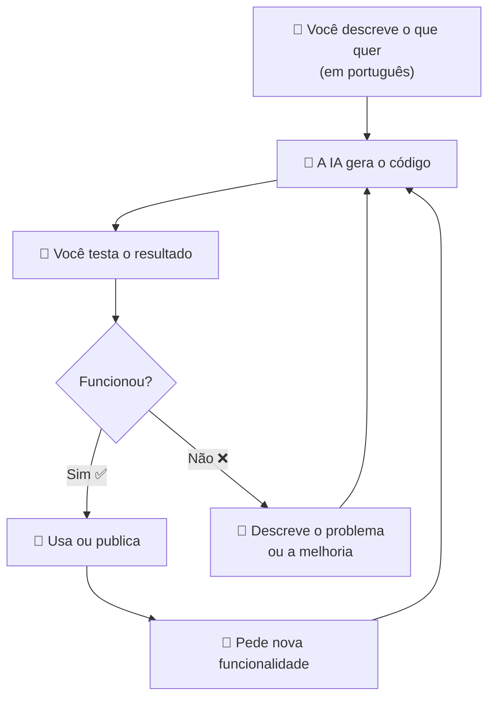

# Vibe Coding - Programação com IA

> [!quote] Programe Descrevendo
> *Vibe Coding é programar descrevendo o que você quer, deixando a IA escrever o código para você.*

---

## 🌱 O que é Vibe Coding?

O termo **vibe coding** foi criado em **fevereiro de 2025** pelo cientista de computação **Andrej Karpathy**, co-fundador da OpenAI. Ele descreveu a ideia assim: "você se entrega completamente às vibes, abraça os exponenciais e esquece que o código existe."

Em 2023, Karpathy já havia dito que "a linguagem de programação mais quente é o inglês". Em 2025, isso virou realidade prática com as ferramentas de IA generativa.

O Merriam-Webster listou o termo em março de 2025 como expressão em ascensão, e o Collins English Dictionary elegeu **"vibe coding" como a palavra do ano de 2025**.

> [!info] Definição rápida
> Vibe coding é programar descrevendo o que você quer em português (ou qualquer língua natural). A IA entende, gera o código e você testa. Você guia, a IA escreve.

---

## 📊 Números do Mercado (2025-2026)

> [!warning] Por que isso importa agora?
> 84% dos desenvolvedores já usam ou planejam usar ferramentas de IA para programar até 2026. O Gartner prevê que **60% de todo o código novo será gerado por IA até 2026**.

| Ferramenta | Avaliação de Mercado | Receita Anual |
|---|---|---|
| Cursor (Anysphere) | US$ 9,9 bilhões | Privado |
| Lovable | US$ 6,6 bilhões | US$ 200 milhões/ano |
| Bolt.new | Privado | US$ 40 milhões/ano |

Lovable atingiu US$ 100 milhões de receita anual em apenas 8 meses, com 100.000 projetos novos por dia. São números que mostram o tamanho desta transformação.

---

## 🛠️ Ferramentas e Tecnologias

> [!info] Stack para Vibe Coding

| Ferramenta | Descrição |
|------------|-----------|
| **Cursor** | Editor de código com IA integrada |
| **Replit** | IDE online com assistente de IA |
| **Windsurf** | Editor focado em produtividade com IA |
| **ChatGPT** | Assistente para planejamento e código |

### 🚀 Construtores de App com IA (sem precisar de editor de código)

| Ferramenta | Melhor para | Gratuito? | Link |
|---|---|---|---|
| **Lovable** | Apps completos com banco de dados e login | Plano pago a partir de US$ 20/mês | [lovable.dev](https://lovable.dev) |
| **Bolt.new** | Prototipagem rápida no navegador, plano gratuito generoso | Sim (plano pago a partir de US$ 10/mês) | [bolt.new](https://bolt.new) |
| **v0 (Vercel)** | Componentes de interface para quem já tem um projeto | Créditos gratuitos | [v0.dev](https://v0.dev) |
| **Replit** | Programação colaborativa em tempo real | Sim (básico) | [replit.com](https://replit.com) |

> [!tip] Qual usar para começar?
> Para quem está aprendendo agora: **Bolt.new** ou **Lovable**. Eles criam um app inteiro a partir de uma frase, sem precisar instalar nada, sem precisar de conta no GitHub, diretamente no navegador.

---

## 🔄 Como funciona o fluxo do Vibe Coding?

O segredo está no **ciclo de feedback**: você não precisa entender o código, mas precisa saber testar, observar e descrever o que está errado ou o que quer diferente.

---

## 📋 Metodologia em 5 Etapas

### 1️⃣ Planejar o Sistema

> [!tip] Descreva Bem
> Descrever o que o programa precisa fazer e usar uma IA para melhorar essa descrição.

**A descrição precisa ter:**
- Como o usuário vai interagir com o programa
- Uma lista de funcionalidades

---

### 2️⃣ Definir Tecnologias

> [!info] Pesquise Antes
> Pesquisar as melhores ferramentas e tecnologias para o seu programa.

---

### 3️⃣ Definir Estrutura do Programa

> [!example] Prompt Sugerido
> "Crie um planejamento de estrutura de diretórios e arquivos utilizando as boas práticas de programação, evitando arquivos grandes, dividindo as responsabilidades em arquivos diferentes."

---

### 4️⃣ Solicitar a Implementação da Base

> [!tip] Comece pela Fundação
> Peça para a IA criar a estrutura básica do projeto antes das funcionalidades.

---

### 5️⃣ Implementar Uma Funcionalidade de Cada Vez

> [!warning] Importante
> Não tente fazer tudo de uma vez. Solicite uma funcionalidade por vez para manter o controle e a qualidade.

---

## 🧪 Atividades Mão na Massa

> [!example] 🧪 Atividade 1: Crie um App em 5 Minutos
>
> **Ferramenta:** [Bolt.new](https://bolt.new) (gratuito, sem cadastro necessário)
>
> **Passo a passo:**
> 1. Acesse bolt.new no navegador.
> 2. No campo de texto, digite uma frase descrevendo seu app. Exemplo: "Crie um app de lista de tarefas com a cor azul e botão para marcar tarefa como concluída."
> 3. Aguarde o Bolt gerar o app (leva segundos).
> 4. Teste o app diretamente no preview ao lado.
> 5. Clique em "Deploy" para publicar e obter uma URL real.
>
> **Resultado observável:** uma URL pública que você pode compartilhar com qualquer pessoa, com um app funcionando, criado em menos de 5 minutos, sem escrever uma linha de código.

---

> [!example] 🧪 Atividade 2: Joguinho em HTML com IA
>
> **Ferramenta:** ChatGPT ([chat.openai.com](https://chat.openai.com)) ou qualquer IA de chat
>
> **Passo a passo:**
> 1. Abra o ChatGPT.
> 2. Digite: "Crie um jogo da memória simples em um único arquivo HTML. O jogo deve ter 8 pares de cartas com emojis, mostrar o número de tentativas e ter um botão para reiniciar."
> 3. Copie o código que a IA gerar.
> 4. Abra o Bloco de Notas (ou qualquer editor de texto) e cole o código.
> 5. Salve o arquivo com o nome `jogo.html`.
> 6. Dê dois cliques no arquivo para abrir no navegador.
>
> **Resultado observável:** um jogo interativo funcionando no seu computador, criado em menos de 2 minutos. Experimente pedir modificações: "Adicione um contador de tempo" ou "Troque os emojis por animais."

---

> [!example] 🧪 Atividade 3: Itere uma Funcionalidade Conversando
>
> **Ferramenta:** [Lovable.dev](https://lovable.dev) ou [Bolt.new](https://bolt.new)
>
> **Passo a passo:**
> 1. Crie um app simples: "Crie uma calculadora de IMC com campos para peso e altura."
> 2. Teste o resultado. Depois, **sem resetar**, peça uma melhoria: "Adicione uma mensagem explicando o resultado (abaixo do peso, normal, sobrepeso, obesidade)."
> 3. Teste novamente. Peça outra melhoria: "Adicione um botão para limpar os campos."
> 4. Anote: quantas mensagens de chat foram necessárias para ter um app completo?
>
> **Resultado observável:** você vai perceber que cada mensagem aprimora o app sem perder o que já foi feito. Isso é o ciclo de vibe coding na prática, você conversa, a IA evolui o projeto.

---

## ⚠️ Limitações e Cuidados

> [!warning] Vibe Coding não é mágica
> Pesquisas de 2025 mostram que **47% do código gerado por IA contém vulnerabilidades de segurança**. Isso não significa que você não deve usar, significa que você precisa entender o que está construindo.

**Principais riscos:**
- Código com falhas de segurança que você não percebe (senhas expostas, dados sem proteção)
- Aplicações que funcionam em teste mas quebram com muitos usuários
- Dificuldade de corrigir problemas depois, pois o código pode ficar desorganizado
- Dependência excessiva da IA sem entender o que está acontecendo por baixo

**Boas práticas para reduzir os riscos:**
- Nunca publique dados reais (senhas, CPF, cartões) em apps de teste
- Prefira ferramentas como Bolt e Lovable para protótipos; projetos profissionais precisam de revisão humana
- Teste cada funcionalidade antes de pedir a próxima
- Aprenda o mínimo de lógica de programação para entender o que a IA está fazendo

---

## 🆚 Vibe Coding vs. Programação Tradicional

| Aspecto | Programação Tradicional | Vibe Coding |
|---|---|---|
| **Quem escreve o código** | Você | A IA |
| **O que você precisa saber** | Linguagem de programação | Descrever bem o que quer |
| **Velocidade de protótipo** | Horas a dias | Minutos |
| **Controle do resultado** | Total | Parcial |
| **Melhor para** | Sistemas críticos e complexos | Protótipos, experimentos, MVPs |
| **Curva de aprendizado** | Alta | Baixa |

---

## 🎯 Onde o Vibe Coding brilha (e onde não funciona)

**Brilha:**
- Criar protótipos rápidos para validar ideias
- Automatizar tarefas pessoais (planilhas, scripts simples)
- Aprender como um sistema funciona sem precisar dominar a linguagem
- Projetos individuais e experimentos

**Não funciona bem:**
- Sistemas bancários, de saúde ou que lidam com dados sensíveis sem revisão profissional
- Aplicações com milhões de usuários (performance e segurança exigem expertise)
- Quando você precisa entender exatamente o que o código faz (por exemplo, em um trabalho acadêmico ou auditoria)

---

## 📎 Veja Também

- [[Python - principal linguagem]]
- [[Automações]]

---

> [!note] 📚 Fontes (2026)
> - [Vibe coding: Wikipedia](https://en.wikipedia.org/wiki/Vibe_coding)
> - [Best Vibe Coding Tools 2026: Lovable](https://lovable.dev/guides/best-vibe-coding-tools-2026-build-apps-chatting)
> - [Vibe Coding Tools Compared: Cursor vs Lovable vs Bolt vs v0 (AIapps)](https://www.aiapps.com/blog/vibe-coding-tools-cursor-vs-lovable-vs-bolt-vs-v0-2026/)
> - [Lovable vs Bolt vs v0: comparativo (blog.ibe.ia.br)](https://blog.ibe.ia.br/blog/lovable-vs-bolt-vs-v0/)
> - [Andrej Karpathy e o termo vibe coding (Klover.ai)](https://www.klover.ai/andrej-karpathy-vibe-coding/)
> - [Riscos do vibe coding nas empresas (Distrito)](https://www.distrito.me/blog/riscos-do-vibecoding-nas-empresas)
> - [O perigo do vibe coding: segurança do código (DougDesign)](https://dougdesign.com.br/vibe-coding-riscos-ia-programacao/)
> - [Bolt.new: guia prático (DataCamp)](https://www.datacamp.com/tutorial/bolt-new-guide-create-apps-without-coding)
> - [Vibe coding: programação por conversa com IA (arXiv 2506.23253)](https://arxiv.org/html/2506.23253v1)
