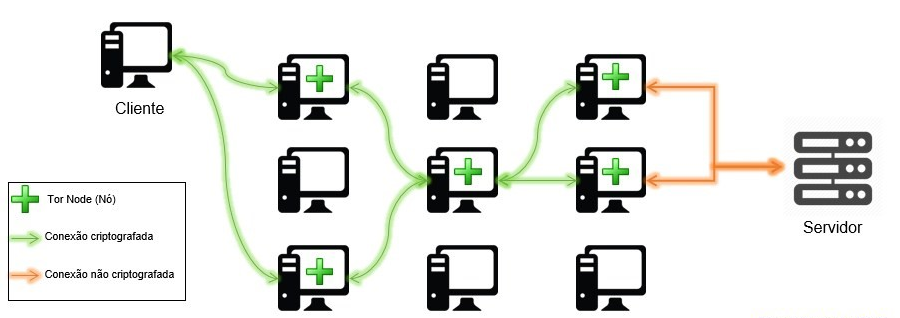
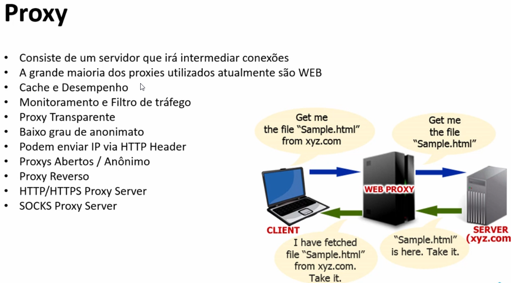
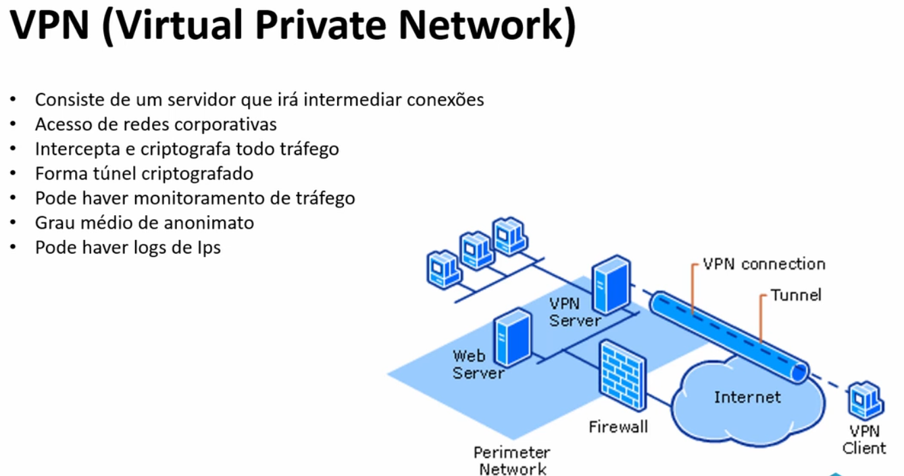

# Anonimato e privacidade

<aside>
✨ Ferramentas utilizadas

- Tor
- VPNs
- Proxychains
- Whonix
- Privoxy
- Polipo
- Socat
- Ghostery
</aside>

Índice


---

# O que é Tor e como utilizar

- o que é TOR
    
    
    
    
    
    Tor é um software livre e de **código aberto** que proporciona a comunicação **anônima** e **segura** ao navegar na Internet e em atividades online, protegendo contra a **censura** e principalmente a **privacidade.**
    
    [https://www.eff.org/pages/tor-and-https](https://www.eff.org/pages/tor-and-https)
    

> Utilização rápida
> 

```bash
apt-get install tor
```

```bash
tor
```

Alguns sites para verificar seu IP de saída:

[https://check.torproject.org/](https://check.torproject.org/)

[https://www.iplocation.net/](https://www.iplocation.net/)

Ao acessar a rede Tor procurar pela hidden wiki

<aside>
📌 Também existe a opção de usar o **Tor Browser**

</aside>

- Alguns erros comuns do tor
    
    [warn] Could not bind to 127.0.0.1:9050: Address already in use. Is Tor already running?
    
    Solução: Execute o comando: `killall tor`
    
    Pode ter ficado algum processo aberto de outras execuções que não foi apropriadamente encerrado pelo sistema. Ou você também pode ter tentado executar algum outro programa que dependa do Tor porém ele não estava rodando. 
    

# Proxychains

- O que é um poxy?
    
    
    
    [Free Proxy List](https://free-proxy-list.net/)
    

<aside>
✅ Proxychains é uma aplicação que utiliza uma cadeia de proxys para tonar sua conexão anônima.

</aside>

Instalação

```jsx
apt-get install proxychains
```

Configuração

```jsx
abrir arquivo de configuração: nano /etc/proxychains.conf
```

```jsx
Comentar a opção strict_chain e descomentar random_chain
Verificar se a linha abaixo não está como comentário
socks4  127.0.0.1 9050 
```

Utilização

```jsx
proxychains nmap -sV uenf.br -p 80
```

[Como não ser rastreado usando proxychains](https://www.youtube.com/watch?v=wftQCS9NiPk)

Para usar o firefox pelo tor e proxychains

1. Rodar o tor com o comando `tor`
2. abrir outra aba no terminal e dar o comando `proxychains firefox` 

# VPNs

- o que é uma VPN
    
    
    

---

- Material antigo
    
    ```bash
    /etc/init.d/privoxy start
    ```
    
    **Algumas definições importantes**
    
    Socks é um protocolo que encaminha pacotes entre cliente-servidor através de um servidor proxy.	Socks 5 implementa autenticação, criptografia, suporte a UDP e IPv6.
    
    Diferença entre proxy **socks** e **http** proxy:
    
    Um proxy socks é um proxy de propósito geral para qualquer conexão TCP em qualquer porta por qualquer aplicação. Um proxy socks não interpreta o tráfego entre a origem e destino.
    
    Já o http proxy é usado especificamente para servidores web e interpreta o tráfego.
    
    IMPORTANTE: Para testar o correto funcionamento dos proxys instalar serviços em uma máquina virtual, disponibilizar o serviço na Internet através de redirecionamento de porta no roteador e analisar os logs. Fazer isso com servidor web, ftp, ssh, antiportscan, etc.
    
    ---
    
    ## TOR
    
    The Onion Router – É um protocolo de roteamento que funciona em cima da pilha TCP/IP visando o anonimato mesmo em conexões inseguras na Internet. Criado pela Marinha dos estados unidos e depois desenvolvido pela DARPA nos anos 90 sendo patenteado pela Marinha em 1998.
    
    O Tor funciona como um proxy socks5.
    
    Depois que a Marinha liberou o código para licença livre alguns pesquisadores se juntaram aos antigos criadores e criaram o **Tor** (minúsculo) como é conhecido hoje, isso em 2006. Tal projeto foi
    baseado no projeto anterior.
    
    Funcionamento:
    
    Passo 1: O cliente acessa um servidor de diretório para pegar uma lista de nós Tor.
    
    Passo
    2: O cliente seleciona aleatoriamente uma lista de nós por onde o tráfego irá passar. IMPORTANTE: o tráfego é criptografado somente até o último nó (nó de saída). Nós podemos tanto ser nós como diretórios.
    
    Para o Tor funcionar é preciso que a data e hora do sistema esteja ajustado:
    
    #ntpd -q -g
    
    É possível esconder serviços no Tor de maneira que só que esteja usando o Tor conseguirá acessá-los.
    
    .onion é o DNS da Deep Web
    
    Para um anonimato mais “completo” é interessante usar o conjunto Tor polipo e privoxy
    
    #apt-get install tor
    
    #tor
    
    #polipo
    
    Configurar tor porta 9050 no browser e marcar opção de remote dns para não vazar as consultas dns fora do tor. Colocar o tor somente em socks pois tor não é um proxy http.
    
    É possível resolver nomes com um comando do Tor
    
    ```
    $ tor-resolve google.com
    ```
    
    Sqlmap tem suporte ao Tor
    
    Tor exit query – é possível saber se um IP é do Tor (de saída).
    No caso de estar recebendo um ataque é interessante saber se veio de uma rede Tor ou não.
    
    [https://torstatus.blutmagie.de/tor_exit_query.php](https://torstatus.blutmagie.de/tor_exit_query.php)
    
    **Torsocks**
    
    Torsocks é um pacote do TOR que tem o objetivo de usar a rede tor em aplicativos da linha de comando como o ssh por exemplo. O torsocks é um wrapper, que é uma espécie de encapsulador de comandos.
    
    Testando o comando torsocks
    
    # curl ifconfig.me
    
    # torsocks ifconfig.me
    
    Utilizando
    
    # torsocks ssh ip
    
    #torsocks telnet ip porta (testado anonimato)
    
    ---
    
    # Privoxy
    
    Privoxy é um webproxy usado para aumentar a privacidade através do controle dos cabeçalhos HTTP dentre várias outras técnicas.
    
    Configurar
    privoxy (http proxy) para usar o tor:
    
    arquivo /etc/privoxy/config
    
    forward-socks5	/	127.0.0.1:9050 .
    
    o privoxy funciona na porta 8118
    
    basta configurar o http proxy nessa porta e deixar o socks na porta
    do tor
    
    ---
    
    # Polipo
    
    Já que usando diversos proxies (uma cadeia de proxies), a conexão fica lenta, o Polipo entra para  dicionar funcionalidades para a performance como um web proxy caching.
    
    #apt-get install polipo
    
    configuração polipo para usar o tor e não vazar requisições dns
    
    socksParentProxy = "localhost:9050"
    
    socksProxyType = socks5
    
    dnsUseGethostbyname = no
    
    ---
    
    # Proxychains
    
    É utilizado para proxiar serviços e aplicações. Já é configurado para usar o Tor por default.
    
    O Proxychains é responsável por executar aplicativos que não tem suporte nativo a SOCKS através de um proxy. O pacote ainda inclui o Proxyresolv que é responsável pela resolução de nomes.
    Com o Proxychains é possível executar aplicativos como nmap, ssh e outros através da rede Tor. O Proxychains suporta apenas conexões TCP, nada de UDP, ICMP e outros.
    
    #apt-get install proxychains
    
    IMPORTANTE: O nmap é limitado quanto ao uso de proxy. Para usar o nmap com proxychains é preciso se atentar aos parâmetros corretos para que não haja vazamento do IP de origem.
    
    #proxychains nmap -sT -PN -n -sV -p 21 [ip]
    (usar sS para scan de muitas portas)
    
    [parâmetros](Anonimato%20e%20privacidade/par%C3%A2metros%20ae9fe48d41f1485b81ecc83d21a1c0b1.csv)
    
    It is possible that we will encounter a situation where scan fails, because Tor endpoints are blocked.
    
    The solution may be in adding commo **public proxy server** to the ‘chain’.
    
    We can do that by simply editing the `/etc/proxychains.conf`and adding a new entry at the end of the **[ProxyList]** (be sure that random_chain option is disabled).
    
    ```
    [ProxyList]# add proxy here ...# meanwile# defaults set to "tor"socks4  127.0.0.1 9050socks4 115.71.237.212 1080
    ```
    
    The new ‘chain’ goes through the **Tor**proxy (127.0.0.1:9050) to some **public proxy server**(115.71.237.212:1080) and then to our scanned host (217.xx.xx.xx).
    
    ```
    $ proxychains nmap -sT -PN -n -sV -p 21 217.xx.xx.xx (usar -sS para scan de muitas portas)ProxyChains-3.1 (http://proxychains.sf.net)Starting Nmap 6.00 ( http://nmap.org ) at 2014-03-25 11:05 EET|S-chain|-<>-127.0.0.1:9050-<>-115.71.237.212:1080-<><>-217.xx.xx.xx:21-<><>-OK|S-chain|-<>-127.0.0.1:9050-<>-115.71.237.212:1080-<><>-217.xx.xx.xx:21-<><>-OKNmap scan report for 217.xx.xx.xxHost is up (1.2s latency).PORT   STATE SERVICE VERSION21/tcp open  ftp     Pure-FTPd
    ```
    
    **Socat**
    
    Permite transmissão bidirecional TCP por meio do proxy Tor SOCKS.
    Recebe as informações na porta 9050.
    
    # socat TCP4-LISTEN:8080, fork SOCKS4a:127.0.0.1:10.10.10.100:80, socksport=9050 &
    
    Assim é possível usar ferramentas como Nessus, Nikto, netcat, etc.
    
    #nc 127.0.0.1 8080
    
    O comando acima é utilizado para se conectar manualmente na parta 80 do destino usando o netcat através do Tor.
    
    ---
    
    ## Rastreadores de cookies
    
    **Ghostery**
    
    “O Ghostery é uma extensão, para Mozilla Firefox, Google Chrome, Safari, iOS e Opera, que informa ao usuário tudo o que acontece durante a sua navegação. Essa extensão consegue detectar rastreadores, bugs, pixels, avisos colocados nas páginas por serviços de propaganda entre outras funções.” (TecTudo)
    
    ---
    
    ## Navegadores
    
    **Turn "Do Not Track" on or off**
    
    “When you browse the web on computers or Android devices, you can send a request to websites not to collect or track your browsing data. It's turned off by default.
    
    However, what happens to your data depends on how a website responds to the request. Many websites will still collect and use your browsing data to improve security, provide content, services, ads and recommendations on their websites, and generate reporting statistics.
    
    Chrome doesn't provide details of which websites and web services respect Do Not Track requests and how websites interpret them.” (Google suport page)
    
    Como marcar essa opção no google chrome:
    
    1. At the top right, click More **Settings**.
    2. At the bottom, click **Show advanced settings**.
    3. Under "Privacy," check or uncheck **Send a	"Do Not Track" request with your browsing traffic**.
    
    **Desabilitar cookies de terceiros**
    
    No chrome: configurações > privacidade > configurações de conteúdo > cookies > bloquear cookies de terceiros
    
- Esteganografia e padrão Exif
    
    <aside>
    🔧 Ferramentas utilizadas
    
    </aside>
    
     
    
    - Exif tool
    
    Exif tool
    
    `#apt-get install exiftool`
    
    ---