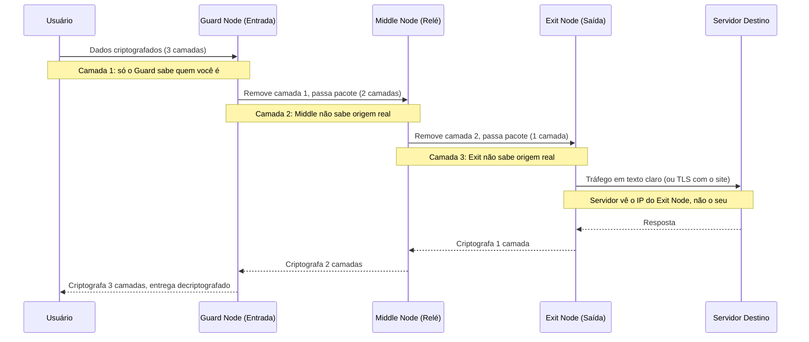
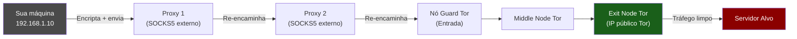
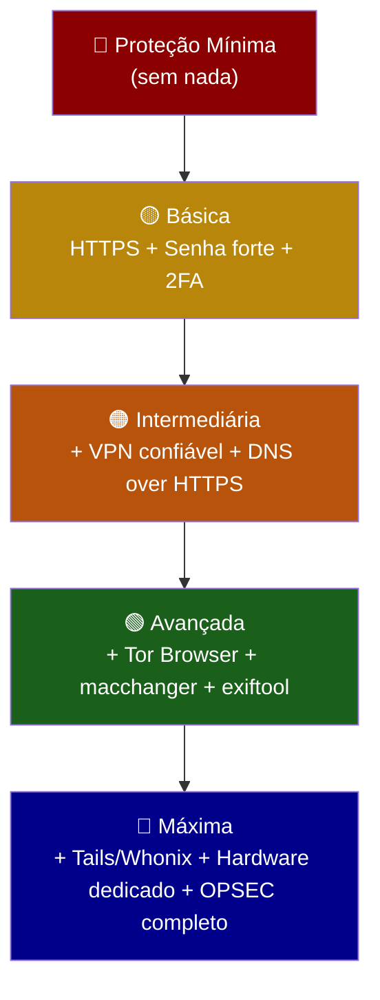

# Anonimato e Privacidade

> [!quote] Por que Anonimato Importa?
> *Em testes de intrusão e pesquisas de segurança, manter o anonimato é essencial para evitar bloqueios e proteger sua identidade.*

> [!info] Ferramentas Abordadas
> - Tor / Tor Browser
> - torsocks
> - Proxychains / Proxychains4
> - VPNs (OpenVPN, WireGuard)
> - Whonix / Tails OS
> - Privoxy
> - Polipo
> - Socat
> - macchanger (MAC spoofing)
> - exiftool (metadados)
> - Ferramentas de DNS leak test

![[Recursos/Segurança da informação/Anonimato e privacidade/anonimato-e-privacidade.png|Diagrama de anonimato]]

> [!warning] ⚖️ Ética e Legalidade
> Anonimato é uma ferramenta legítima de privacidade e segurança. Usar técnicas de anonimato para acessar sistemas sem autorização constitui crime tipificado no **Art. 154-A do Código Penal Brasileiro** (invasão de dispositivo informático), com pena de 1 a 4 anos de reclusão, acrescida de multa. **Pratique sempre no seu próprio tráfego e em ambientes autorizados.**

---

## 🧅 O que é Tor?

> [!tip] The Onion Router
> Tor é um software livre e de **código aberto** que proporciona comunicação **anônima** e **segura** na Internet, protegendo contra **censura** e garantindo **privacidade**.

![[Recursos/Segurança da informação/Anonimato e privacidade/anonimato-e-privacidade-1.png|Como funciona o Tor]]

![[Recursos/Segurança da informação/Anonimato e privacidade/anonimato-e-privacidade-2.png|Arquitetura Tor]]

### 📜 História

O Tor foi criado pela **Marinha dos Estados Unidos** e desenvolvido pela **DARPA** nos anos 90, sendo patenteado em 1998. Em 2006, após a liberação do código sob licença livre, pesquisadores criaram o **Tor** como conhecemos hoje. Em 2024-2025, o Tor Project enfrentou uma das maiores campanhas Sybil documentadas, onde atacantes injetaram relays de alta largura de banda para obter o status de "guard node". A resposta foi implementar verificação mais rigorosa de relays e cross-checking de autoridades de bandwidth.

### ⚙️ Como Funciona

1. O cliente acessa um servidor de diretório para obter lista de nós Tor
2. Seleciona aleatoriamente nós por onde o tráfego passará
3. O tráfego é criptografado em camadas (como uma cebola)

> [!warning] Importante
> O tráfego é criptografado somente até o último nó (nó de saída). A partir daí, vai sem criptografia do Tor.

**Recurso útil:** [Como Tor e HTTPS funcionam juntos](https://www.eff.org/pages/tor-and-https)

### 🗺️ Diagrama: Como o Tor Anonimiza o Tráfego


```mermaid
sequenceDiagram
    participant U as Usuário
    participant G as Guard Node (Entrada)
    participant M as Middle Node (Relé)
    participant E as Exit Node (Saída)
    participant S as Servidor Destino

    U->>G: Dados criptografados (3 camadas)
    Note over U,G: Camada 1: só o Guard sabe quem você é
    G->>M: Remove camada 1, passa pacote (2 camadas)
    Note over G,M: Camada 2: Middle não sabe origem real
    M->>E: Remove camada 2, passa pacote (1 camada)
    Note over M,E: Camada 3: Exit não sabe origem real
    E->>S: Tráfego em texto claro (ou TLS com o site)
    Note over E,S: Servidor vê o IP do Exit Node, não o seu
    S-->>E: Resposta
    E-->>M: Criptografa 1 camada
    M-->>G: Criptografa 2 camadas
    G-->>U: Criptografa 3 camadas, entrega decriptografado
```

> [!info] 🔑 Ponto central do diagrama
> Em nenhum momento um único nó conhece simultaneamente quem você é (origem) e o que você acessa (destino). Essa separação de conhecimento é o coração do anonimato Tor.

---

## 🚀 Utilizando o Tor

### Instalação e Uso Básico

```bash
apt-get install tor
```

```bash
tor
```

### 🔍 Verificando seu IP de Saída

- [check.torproject.org](https://check.torproject.org/)
- [iplocation.net](https://www.iplocation.net/)

> [!success] Tor Browser
> A forma mais fácil de usar o Tor é através do **Tor Browser**, que já vem configurado para máxima privacidade.

### ❌ Erros Comuns

> [!danger] Erro: Address already in use

```
[warn] Could not bind to 127.0.0.1:9050: Address already in use. Is Tor already running?
```

**Solução:**
```bash
killall tor
```

Pode haver um processo aberto de execuções anteriores que não foi encerrado corretamente.

### 🔧 Torsocks

Permite usar a rede Tor em aplicativos de linha de comando:

```bash
# Verificar IP normal
curl ifconfig.me

# Verificar IP via Tor
torsocks curl ifconfig.me

# SSH através do Tor
torsocks ssh usuario@ip

# Verificar no site oficial do Tor se você está na rede
torsocks curl https://check.torproject.org/api/ip

# Usar wget anonimizado
torsocks wget -q -O - https://check.torproject.org/api/ip
```

> [!example] 🧪 Atividade 1: Verificar IP de saída pelo Tor
>
> **Objetivo:** Confirmar que o tráfego passa pela rede Tor e o IP de saída é diferente do IP real.
>
> **Passos:**
> ```bash
> # 1. Instale o Tor se ainda não tiver
> sudo apt-get install -y tor torsocks
>
> # 2. Inicie o serviço Tor
> sudo systemctl start tor
>
> # 3. Aguarde ~30 segundos para o circuito ser estabelecido
>
> # 4. Veja seu IP real (sem Tor)
> curl -s ifconfig.me
>
> # 5. Veja o IP de saída via Tor
> torsocks curl -s ifconfig.me
>
> # 6. Confirme no site oficial do Tor
> torsocks curl -s https://check.torproject.org/api/ip | python3 -m json.tool
> ```
>
> **Resultado esperado:** O IP exibido nos passos 4 e 5 deve ser **completamente diferente**. O passo 6 deve retornar `"IsTor": true`. Isso confirma que o tráfego roteia pelos nós da rede Tor antes de chegar ao destino.

### 🌉 Bridges e Transportes Plugáveis (2024-2026)

Em ambientes onde o Tor é bloqueado (firewalls corporativos, países com censura), é possível usar **bridges** com **transportes plugáveis** que disfarçam o tráfego Tor:

| Transporte | Descrição | Status 2026 |
|-----------|-----------|-------------|
| **obfs4** | Criptografia adicional, parece bytes aleatórios. Resiste a active-probing. | Estável, recomendado |
| **Snowflake** | Usa WebRTC via proxies voluntários no Chrome/Firefox | Estável, fácil de usar |
| **WebTunnel** | Disfarça como HTTPS/WebSocket normal. Lançado em 2024. | Recomendado pós-2024 |
| **meek** | Simula navegação em site comum (CDN). Muito lento. | Limitado |

```bash
# Obter bridges automáticas (Tor Browser 15.0+)
# O recurso "Connection Assist" detecta bloqueio e tenta bridges automaticamente

# Configurar bridge manualmente no torrc
echo "UseBridges 1" | sudo tee -a /etc/tor/torrc
echo "Bridge obfs4 <IP>:<PORT> <FINGERPRINT> cert=<CERT>" | sudo tee -a /etc/tor/torrc
echo "ClientTransportPlugin obfs4 exec /usr/bin/obfs4proxy" | sudo tee -a /etc/tor/torrc
sudo systemctl restart tor
```

---

## 🔗 Proxychains

> [!info] O que é?
> Proxychains é uma aplicação que utiliza uma **cadeia de proxies** para tornar sua conexão anônima.

![[Recursos/Segurança da informação/Anonimato e privacidade/anonimato-e-privacidade-3.png|Funcionamento de Proxy]]

**Lista de proxies gratuitos:** [Free Proxy List](https://free-proxy-list.net/)

### 🗺️ Diagrama: Cadeia de Proxies com Tor


```mermaid
graph LR
    A[Sua máquina\n192.168.1.10] -->|"Encripta + envia"| B["Proxy 1\n(SOCKS5 externo)"]
    B -->|"Re-encaminha"| C["Proxy 2\n(SOCKS5 externo)"]
    C -->|"Re-encaminha"| D["Nó Guard Tor\n(Entrada)"]
    D --> E["Middle Node Tor"]
    E --> F["Exit Node Tor\n(IP público Tor)"]
    F -->|"Tráfego limpo"| G[Servidor Alvo]

    style A fill:#4a4a4a,color:#fff
    style G fill:#8b0000,color:#fff
    style F fill:#1a5f1a,color:#fff
```

> [!note] Quanto mais elos na cadeia, maior a latência. Para pentest real, o equilíbrio entre anonimato e usabilidade é crítico.

### Instalação

```bash
# Versão clássica
apt-get install proxychains

# Versão 4 (recomendada, mantida ativamente)
apt-get install proxychains4
```

### Configuração

```bash
nano /etc/proxychains.conf
# ou, para a versão 4:
nano /etc/proxychains4.conf
```

**Alterações necessárias:**
1. Comentar a opção `strict_chain`
2. Descomentar `random_chain`
3. Verificar se a linha abaixo está ativa:

```
socks4  127.0.0.1 9050
```

**Configuração avançada com múltiplos proxies (exemplo):**
```
# /etc/proxychains4.conf
dynamic_chain
# dynamic_chain: ignora proxies mortos na lista (mais resiliente)
# random_chain: usa proxies em ordem aleatória a cada conexão
# strict_chain: todos os proxies devem estar online

proxy_dns
# proxy_dns: resolve DNS pelos proxies (evita DNS leak!)

tcp_read_time_out 15000
tcp_connect_time_out 8000

[ProxyList]
socks5  127.0.0.1 9050    # Tor local
socks5  <proxy2-ip> <porta>
http    <proxy3-ip> <porta>
```

### Utilização

```bash
proxychains nmap -sV alvo.com.br -p 80
```

### 🌐 Navegador via Tor + Proxychains

1. Rodar o Tor: `tor`
2. Em outra aba: `proxychains firefox`

[📺 Como não ser rastreado usando proxychains](https://www.youtube.com/watch?v=wftQCS9NiPk)

---

## 🔒 VPNs

> [!tip] Virtual Private Network
> Uma VPN cria um túnel criptografado entre você e um servidor, mascarando seu IP real.

![[Recursos/Segurança da informação/Anonimato e privacidade/anonimato-e-privacidade-4.png|Funcionamento VPN]]

### Diferença entre VPN e Tor

| Aspecto | VPN | Tor |
|---------|-----|-----|
| Velocidade | Mais rápida | Mais lenta |
| Anonimato | Depende do provedor | Mais anônimo |
| Criptografia | Ponta a ponta com servidor | Múltiplas camadas |
| Confiança | Precisa confiar no provedor | Descentralizado |
| Custo | Geralmente pago | Gratuito |
| Logs | Depende da política do provedor | Arquitetura sem logs centralizados |
| Caso de uso em pentest | Mascarar IP do cliente | Anonimato completo de origem |

### 🔧 OpenVPN via Linha de Comando

```bash
# Instalar OpenVPN
sudo apt-get install openvpn

# Conectar usando arquivo de configuração do provedor
sudo openvpn --config meu-servidor.ovpn

# Verificar IP após conexão
curl ifconfig.me

# Verificar DNS após conexão (importante! Ver seção de DNS leak)
# Acesse: https://dnsleaktest.com
```

### 🔧 WireGuard (protocolo moderno, mais rápido)

```bash
# Instalar WireGuard
sudo apt-get install wireguard

# Ativar interface (após configurar /etc/wireguard/wg0.conf)
sudo wg-quick up wg0

# Verificar status
sudo wg show

# Desativar
sudo wg-quick down wg0
```

> [!warning] VPN + Tor ("Onion over VPN")
> Algumas configurações combinam VPN e Tor: você conecta na VPN primeiro, depois roteie pelo Tor. Isso esconde do ISP que você usa Tor, mas o provedor VPN vê sua origem. Avaliar o modelo de ameaça antes de usar.

---

## 🌐 DNS Leak: O Risco Invisível

> [!danger] O que é DNS Leak?
> Um **DNS leak** ocorre quando suas consultas DNS (resolução de nomes de domínio) são enviadas fora do túnel VPN/Tor, diretamente para o servidor DNS do seu ISP. Mesmo que seu IP esteja mascarado, o ISP ainda vê quais domínios você consulta.

### Por que Acontece

- VPN mal configurada que não redireciona DNS
- Sistema operacional usando DNS do sistema fora do túnel
- Uso de IPv6 quando o túnel só cobre IPv4
- WebRTC vazando o IP local (em navegadores)
- Em 2026, DoH (DNS over HTTPS) e DoQ (DNS over QUIC) podem vazar se o sistema os enviar diretamente a resolvers públicos, contornando o túnel

### Como Testar

```bash
# 1. Antes de ativar VPN ou Tor: verificar DNS atual
cat /etc/resolv.conf

# 2. Com VPN ou Tor ativo, acessar pelo navegador:
# https://dnsleaktest.com  (teste padrão e extendido)
# https://ipleak.net       (IP + DNS + WebRTC em uma página)
# https://browserleaks.com (análise completa de fingerprint)

# 3. Via linha de comando (com Tor ativo):
# Instalar dnsleak-check ou usar dig com servidor explícito
torsocks dig +short myip.opendns.com @resolver1.opendns.com

# 4. Forçar DNS via resolv.conf enquanto usa VPN
# Editar /etc/resolv.conf temporariamente:
# nameserver 10.8.0.1      (DNS interno da VPN)
```

> [!example] 🧪 Atividade 2: Detectar e Corrigir DNS Leak
>
> **Objetivo:** Verificar se sua VPN ou Tor está vazando consultas DNS.
>
> **Passos:**
> ```bash
> # 1. Anote seu DNS atual (sem proteção)
> cat /etc/resolv.conf
> # Geralmente aponta para seu roteador (192.168.x.x) ou ISP
>
> # 2. Inicie o Tor
> sudo systemctl start tor
>
> # 3. Acesse via torsocks para simular navegação anônima
> torsocks curl -s https://ipleak.net/json/ | python3 -m json.tool | grep -i dns
>
> # 4. No navegador (via Tor Browser), acesse:
> #    https://dnsleaktest.com -> clique em "Extended Test"
>
> # 5. Observe os servidores DNS listados.
> #    Se aparecer IP do seu ISP: você tem um DNS leak!
> #    Se aparecer apenas IPs de nós Tor ou do provedor VPN: ok.
> ```
>
> **O que analisar no resultado:** Servidores DNS listados devem ser da rede Tor (geolocalização variada, não o seu país/ISP). Se o resultado mostrar servidores do seu provedor de internet local, o vazamento está ativo e é preciso corrigir a configuração de DNS.

---

## 💻 Spoofing de Endereço MAC

> [!info] O que é MAC Address?
> O endereço MAC (Media Access Control) é um identificador único gravado na placa de rede. Ao contrário do IP, que muda com DHCP, o MAC é usado para identificação na camada 2 (enlace) da rede local. Em pentest e em cenários de privacidade em redes públicas (Wi-Fi de hotel, aeroporto, campus), mascarar o MAC evita rastreamento físico por equipamentos de rede.

### macchanger: Comandos Completos

```bash
# Instalar
sudo apt-get install macchanger

# Ver MAC atual da interface
ip link show eth0
# ou
macchanger -s eth0

# PASSO OBRIGATÓRIO: desativar a interface antes de mudar o MAC
sudo ip link set eth0 down

# Definir MAC aleatório completamente
sudo macchanger -r eth0

# Definir MAC aleatório de mesmo fabricante (menos suspeito)
sudo macchanger -a eth0

# Definir MAC aleatório de qualquer fabricante
sudo macchanger -A eth0

# Definir MAC específico (formato: XX:XX:XX:XX:XX:XX)
sudo macchanger -m AA:BB:CC:DD:EE:FF eth0

# Restaurar MAC original do hardware
sudo macchanger -p eth0

# Reativar a interface após a mudança
sudo ip link set eth0 up

# Verificar se mudou
ip link show eth0
macchanger -s eth0
```

### Automatizando com systemd (persistência entre reboots)

```bash
# Criar serviço para mudar MAC no boot
sudo nano /etc/systemd/system/macspoof@.service
```

```ini
[Unit]
Description=MAC address spoofing for %I
Wants=network-pre.target
Before=network-pre.target
BindsTo=sys-subsystem-net-devices-%i.device
After=sys-subsystem-net-devices-%i.device

[Service]
Type=oneshot
ExecStart=/usr/bin/macchanger -r %I
RemainAfterExit=yes

[Install]
WantedBy=multi-user.target
```

```bash
# Habilitar para a interface eth0
sudo systemctl enable macspoof@eth0.service
sudo systemctl start macspoof@eth0.service
```

> [!warning] MAC spoofing e redes 802.1X
> Algumas redes corporativas usam autenticação 802.1X que valida o MAC. Spoofing pode causar bloqueio ou alertas no SIEM da empresa alvo. Em pentest autorizado, isso pode ser intencional (testar detecção) ou indesejado (expor operação prematuramente). Planejar antes.

---

## 🛠️ Ferramentas Avançadas

### Privoxy

> [!info] Web Proxy
> Aumenta a privacidade através do controle dos cabeçalhos HTTP.

```bash
/etc/init.d/privoxy start
```

**Configuração para usar com Tor:**
```
# /etc/privoxy/config
forward-socks5 / 127.0.0.1:9050 .
```

O Privoxy funciona na porta **8118**.

### Polipo

> [!tip] Web Proxy Caching
> Adiciona funcionalidades de cache para melhorar performance quando usando múltiplos proxies.

```bash
apt-get install polipo
```

**Configuração:**
```
socksParentProxy = "localhost:9050"
socksProxyType = socks5
dnsUseGethostbyname = no
```

### Socat

> [!info] Transmissão Bidirecional
> Permite transmissão TCP por meio do proxy Tor SOCKS.

```bash
socat TCP4-LISTEN:8080,fork SOCKS4a:127.0.0.1:10.10.10.100:80,socksport=9050 &
```

Assim é possívelível usar ferramentas como **Nessus**, **Nikto** e **Netcat** através do Tor.

---

## 🔐 Protocolos: SOCKS vs HTTP Proxy

> [!info] Entenda a Diferença

| Tipo | Descrição |
|------|-----------|
| **SOCKS Proxy** | Propósito geral para qualquer conexão TCP. Não interpreta o tráfego. |
| **HTTP Proxy** | Específico para servidores web. Interpreta o tráfego HTTP. |

**SOCKS5** implementa: autenticação, criptografia, suporte a UDP e IPv6.

---

## 🍪 Privacidade no Navegador

### Ghostery

Extensão que detecta rastreadores, bugs, pixels e avisos de serviços de propaganda nas páginas.

### Do Not Track

> [!warning] Limitação
> A opção "Do Not Track" apenas envia uma solicitação para sites não rastrearem. **Não garante** que sites respeitarão essa solicitação.

**Como ativar no Chrome:**
1. Configurações → Privacidade
2. Ativar "Enviar solicitação Do Not Track"

### Bloquear Cookies de Terceiros

**Chrome:** Configurações → Privacidade → Configurações de conteúdo → Cookies → Bloquear cookies de terceiros

### Fingerprinting de Navegador

> [!danger] Além dos cookies
> Mesmo sem cookies, sites identificam você por **fingerprint do navegador**: combinação de tamanho de tela, fontes instaladas, plugins, fuso horário, canvas, WebGL, etc. O Tor Browser normaliza essas características para que todos os usuários pareçam idênticos.

Ferramentas para testar seu fingerprint:
- [browserleaks.com](https://browserleaks.com)
- [coveryourtracks.eff.org](https://coveryourtracks.eff.org)

---

## 📷 Metadados e Privacidade

### Exiftool

> [!tip] Removendo Metadados
> Imagens contêm metadados (EXIF) que podem revelar localização, dispositivo e outras informações.

```bash
apt-get install exiftool
```

**Ver metadados:**
```bash
exiftool imagem.jpg
```

**Remover metadados:**
```bash
exiftool -all= imagem.jpg
```

**Exemplos de metadados perigosos que aparecem:**
```bash
# Exemplo de saída do exiftool antes de remover:
exiftool foto_suspeita.jpg

# Campos que podem vazar informação:
# GPS Latitude              : 21 deg 44' 47.20" S
# GPS Longitude             : 41 deg 19' 47.56" W
# Create Date               : 2026:03:15 14:32:01
# Camera Model Name         : iPhone 15 Pro
# Software                  : 19.3.1
# Make                      : Apple
```

> [!example] 🧪 Atividade 3: Ver e Remover Metadados de uma Foto
>
> **Objetivo:** Demonstrar que arquivos de imagem contêm metadados que revelam informações pessoais, e aprender a removê-los antes de compartilhar.
>
> **Passos:**
> ```bash
> # 1. Instalar exiftool
> sudo apt-get install -y libimage-exiftool-perl
>
> # 2. Tirar uma foto com o celular e transferir para o Linux
> #    (ou usar qualquer imagem .jpg disponível)
>
> # 3. Ver TODOS os metadados da imagem
> exiftool minha_foto.jpg
>
> # 4. Ver só os campos de GPS (se houver)
> exiftool -GPS:All minha_foto.jpg
>
> # 5. Remover TODOS os metadados (cria cópia de segurança com sufixo _original)
> exiftool -all= minha_foto.jpg
>
> # 6. Verificar que foram removidos
> exiftool minha_foto.jpg
>
> # 7. (Opcional) Remover sem criar backup
> exiftool -all= -overwrite_original minha_foto.jpg
>
> # 8. Remover metadados em lote (todos os .jpg de uma pasta)
> exiftool -all= -overwrite_original *.jpg
> ```
>
> **Resultado esperado:** Antes da remoção, o exiftool lista dezenas de campos (fabricante, modelo, data, GPS, software). Após `exiftool -all=`, a saída mostra apenas os campos obrigatórios do formato (como tipo de arquivo e dimensões). Qualquer campo de localização, dispositivo ou data de criação deve desaparecer.

---

## 🎯 Nmap com Proxychains

> [!warning] Parâmetros Corretos
> O Nmap é limitado quanto ao uso de proxy. Use os parâmetros corretos para evitar vazamento de IP.

```bash
proxychains nmap -sT -PN -n -sV -p 21 [ip]
```

| Parâmetro | Função |
|-----------|--------|
| `-sT` | TCP connect scan (necessário para proxy) |
| `-PN` | Não fazer ping (evita vazamento ICMP) |
| `-n` | Não resolver DNS |
| `-sV` | Detectar versões de serviços |

> [!danger] Se o scan falhar
> Endpoints Tor podem estar bloqueados. Adicione um proxy público à cadeia editando `/etc/proxychains.conf`.

> [!warning] Limitação técnica do Nmap via Tor
> Nmap usa raw sockets para scans rápidos (SYN scan `-sS`). Isso não é suportado via SOCKS. Use obrigatoriamente `-sT` (TCP connect) ao rotear por proxies. Scans UDP e ICMP também não funcionam via Tor.

---

## ✅ Verificando Conexões Tor

**Verificar se um IP é de saída do Tor:**
[torstatus.blutmagie.de](https://torstatus.blutmagie.de/tor_exit_query.php)

Útil para identificar se um ataque veio de uma rede Tor.

---

## 🛡️ OPSEC do Pentester (Operational Security)

> [!danger] OPSEC não é uma ferramenta, é um comportamento
> Você pode usar Tor corretamente, criptografar tudo com PGP, rotear por proxychains, e ainda assim ser identificado se o seu comportamento vazar padrões. OPSEC é uma disciplina operacional.

### Os 5 Pilares do OPSEC

| Pilar | Descrição | Exemplo prático |
|-------|-----------|-----------------|
| **Separação** | Identidade anônima completamente separada da real | Hardware dedicado para operações; nunca logar em conta pessoal |
| **Consistência** | Nunca misturar comportamento do "eu real" com a operação | Horário de uso, vocabulário, fusos horários |
| **Compartimentalização** | Diferentes operações usam infraestruturas diferentes | Cada alvo tem sua própria cadeia de proxies e identidades |
| **Minimização** | Coletar e expor apenas o mínimo necessário | Não baixar dados que não precisa; não manter logs além do necessário |
| **Verificação** | Checar continuamente se nada vazou | DNS leak test, IP check, revisão de logs |

### Checklist OPSEC para Operações Red Team

```
[ ] Hardware dedicado OU sistema live (Tails/Whonix) para a operação
[ ] MAC address spoofado antes de conectar na rede
[ ] DNS leak testado antes de iniciar
[ ] IP de saída verificado (torsocks curl ifconfig.me)
[ ] Sem login em contas pessoais durante a operação
[ ] Metadados removidos de todos os arquivos compartilhados
[ ] Logs locais mínimos; nada sensível em texto claro
[ ] Infraestrutura de C2 em VPS pagos com crypto ou em cloud anônima
[ ] Separação completa entre operação e vida digital pessoal
[ ] WebRTC desabilitado no navegador (about:config: media.peerconnection.enabled = false)
```

### Erros Clássicos que Expõem Operadores

> [!danger] Não cometa estes erros
> - Logar em conta pessoal durante operação anônima (mesmo por segundos)
> - Usar o mesmo pseudônimo em múltiplos contextos
> - Compartilhar foto com metadados GPS
> - Esquecer de verificar DNS leak antes de iniciar
> - Usar fuso horário local em logs (revela localização geográfica)
> - Comportamento único (estilo de escrita, horário de atividade) em todos os contextos
> - Esquecer que metadados de documentos Word/PDF também revelam autor, organização e datas de edição

### OPSEC em Sistemas Live

```bash
# Tails OS: sistema amnésico, não deixa rastros no disco
# Baixar em: https://tails.boum.org

# Whonix: par de VMs (Gateway Tor + Workstation isolada)
# Todo tráfego da Workstation passa pelo Gateway Tor; impossível vazar
# Baixar em: https://www.whonix.org

# Verificar integridade do Tails após download (verificação de assinatura GPG)
gpg --keyserver keys.gnupg.net --recv-key A490D0F4D311A4153E2BB7CADBB802B258ACD84F
gpg --verify tails-amd64-*.img.sig tails-amd64-*.img
```

---

## 🔐 Privacidade do Usuário Comum

> [!info] Não é só para pentesters
> Privacidade digital é um direito. Usuários comuns enfrentam ameaças como: vigilância comercial (rastreamento por anúncios), vazamentos de dados, stalkerware e coleta massiva por governos e corporações. As ferramentas aqui também protegem cidadãos.

### Camadas de Proteção para o Dia a Dia


```mermaid
graph TD
    A["🔴 Proteção Mínima\n(sem nada)"]
    B["🟡 Básica\nHTTPS + Senha forte + 2FA"]
    C["🟠 Intermediária\n+ VPN confiável + DNS over HTTPS"]
    D["🟢 Avançada\n+ Tor Browser + macchanger + exiftool"]
    E["🔵 Máxima\n+ Tails/Whonix + Hardware dedicado + OPSEC completo"]

    A --> B --> C --> D --> E

    style A fill:#8b0000,color:#fff
    style B fill:#b8860b,color:#fff
    style C fill:#b8530b,color:#fff
    style D fill:#1a5f1a,color:#fff
    style E fill:#00008b,color:#fff
```

### DNS Privado para Uso Diário

```bash
# Configurar DNS over HTTPS no systemd-resolved
sudo nano /etc/systemd/resolved.conf

# Adicionar:
# [Resolve]
# DNS=1.1.1.1#cloudflare-dns.com 9.9.9.9#dns.quad9.net
# DNSOverTLS=yes
# FallbackDNS=8.8.8.8

sudo systemctl restart systemd-resolved
```

### Remover Metadados de Documentos

```bash
# Documentos PDF: remover metadados com exiftool
exiftool -all= documento.pdf

# Documentos Word/LibreOffice: remover via linha de comando
# (LibreOffice deve estar instalado)
libreoffice --headless --convert-to pdf --infilter="writer_pdf_Export" documento.docx
exiftool -all= documento.pdf

# Verificar metadados de PDF
exiftool documento.pdf | grep -E "Author|Creator|Producer|Create|Modify|Title"
```

---

> [!note] 📚 Fontes (2026)
> - [Advanced Tor Anonymity & OSINT Research: Red, Blue, and Purple Team Perspectives](https://medium.com/@arifbatum062/advanced-tor-anonymity-osint-research-red-blue-and-purple-team-perspectives-3cdc586ce9b2) (Medium, fev/2026)
> - [Tor Isn't Dead, But Your OpSec Might Be](https://osintteam.blog/tor-isnt-dead-but-your-opsec-might-be-a-field-guide-to-not-getting-burned-f70d8d9680df) (OSINT Team, abr/2026)
> - [Red Team Infrastructure: Best Practices 2025](https://parrot-ctfs.com/blog/red-team-infrastructure-complete-guide-to-setup-and-best-practices-in-2025/) (Parrot CTFs)
> - [OPSEC for Red Teams](https://www.pentesting.org/opsec-best-practices/) (PenTesting.Org)
> - [VPN Leak Testing 2026: DNS, WebRTC, IPv6](https://vpn.how/en/pages/vpn-leak-testing-in-2026-step-by-step-guide-with-dns-webrtc-and-ipv6-checks.html)
> - [macchanger: Kali Linux Tools](https://www.kali.tools/tools/macchanger/)
> - [MAC Address Spoofing: ArchWiki](https://wiki.archlinux.org/title/MAC_address_spoofing)
> - [Tor Bridges and Pluggable Transports 2025-2026](https://support.torproject.org/tor-browser/circumvention/unblocking-tor/)
> - [Proxy Chaining for Stealth in Pen-Testing](https://dev.to/itsmegsg/proxy-chaining-explained-using-proxychains-for-stealth-and-pivoting-in-pen-testing-8dd)
> - [How Anonymous Is the Dark Web? 2025](https://deepstrike.io/blog/how-anonymous-is-the-dark-web)
> - [EFF: Tor and HTTPS](https://www.eff.org/pages/tor-and-https)
> - [Cover Your Tracks, EFF](https://coveryourtracks.eff.org)
