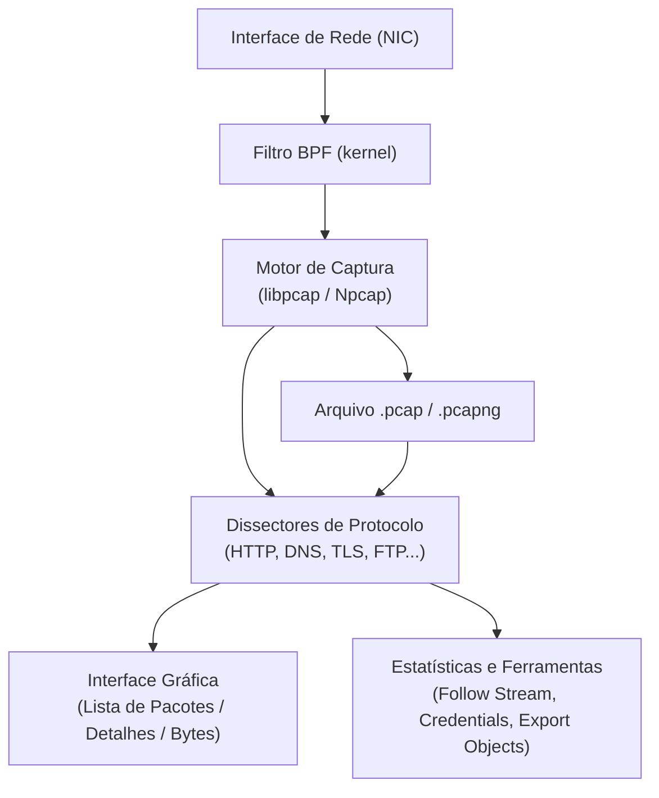
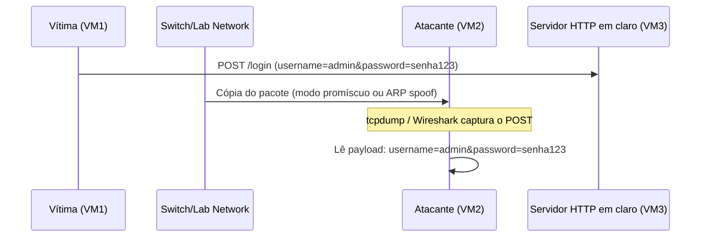
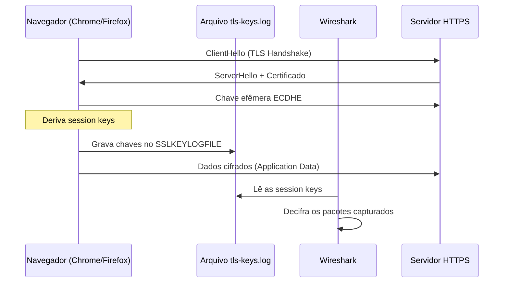

# Análise de Tráfego (Wireshark e TCPdump)

> [!quote] Vendo o Invisível
> *A análise de tráfego permite visualizar e entender toda a comunicação que acontece em uma rede. Para o profissional de segurança, isso significa enxergar o que trafega em claro e detectar o que deveria estar protegido, mas não está.*

---

## 🧭 Contexto Ético e Legal

> [!warning] ⚖️ Legalidade e Ética: Leitura Obrigatória
> Capturar tráfego de rede sem autorização é **crime no Brasil** pelo **Art. 154-A do Código Penal** (invasão de dispositivo informático), acrescentado pela Lei 12.737/2012 (Lei Carolina Dieckmann):
>
> *"Invadir dispositivo informático alheio, conectado ou não à rede de computadores, mediante violação indevida de mecanismo de segurança e com o fim de obter, adulterar ou destruir dados ou informações sem autorização expressa ou tácita do titular do dispositivo..."*
>
> **Penas:** 3 meses a 1 ano + multa; dobrado se o alvo for servidor público.
>
> **Regra do lab:** todo o conteúdo desta aula deve ser praticado **exclusivamente no seu próprio tráfego** ou em laboratório isolado criado com autorização explícita do responsável pela rede. Nunca capturar tráfego de terceiros, vizinhos de Wi-Fi ou ambientes de produção sem contrato assinado.

Relacionado: [[Princípios da segurança da informação]] | [[Introdução à Segurança da informação]] | [[Tipos de ataques]]

---

## 🔍 O que é Análise de Tráfego?

> [!info] Conceito Fundamental
> Toda informação transmitida entre computadores é dividida em pequenos pedaços chamados **pacotes**. Dentro deles está a informação em si e uma série de cabeçalhos para que o pacote possa chegar ao seu destino com integridade e segurança.

### O que é um Pacote?

| Componente | Descrição |
|------------|-----------|
| **Cabeçalhos** | Informações de roteamento, origem, destino |
| **Payload** | Os dados reais sendo transmitidos |
| **Checksum** | Verificação de integridade |

### Por que Protocolos em Claro São Perigosos?

Protocolos criados décadas atrás não foram projetados para ambientes hostis. Eles transmitem dados sem cifração, o que significa que qualquer um na mesma rede local pode capturar e ler o conteúdo completo, incluindo credenciais.

| Protocolo inseguro | Alternativa segura | O que vaza |
|--------------------|--------------------|------------|
| HTTP (porta 80) | HTTPS (porta 443) | URLs, cookies, formulários, credenciais |
| FTP (portas 20-21) | SFTP / FTPS | Usuário, senha, arquivos transferidos |
| Telnet (porta 23) | SSH (porta 22) | Tudo: comandos, senhas, sessão completa |
| SMTP sem TLS (porta 25) | SMTPS (porta 465/587) | Conteúdo de e-mails, credenciais |
| SNMP v1/v2c | SNMP v3 | Community strings (funcionam como senhas) |
| POP3 sem TLS | POP3S | Usuário, senha, mensagens |
| IMAP sem TLS | IMAPS | Usuário, senha, caixa de entrada |

---

## 🦈 Wireshark 🔬

> [!success] O Analisador de Protocolos Mais Popular
> Ferramenta com **interface gráfica** para captura e análise de pacotes. Versão 4.x (2025-2026) traz melhorias de desempenho, novos dissectores e integração aprimorada com formatos modernos de captura.

[🔗 Wireshark · Download Oficial](https://www.wireshark.org/download.html)

### Principais Recursos

| Recurso | Descrição |
|---------|-----------|
| **Captura em tempo real** | Intercepta pacotes enquanto trafegam |
| **Filtros de captura (BPF)** | Reduz o que é capturado antes de gravar |
| **Filtros de exibição** | Filtra pacotes específicos para análise sem descartar o resto |
| **Análise de protocolos** | Decodifica centenas de protocolos com dissectores |
| **Estatísticas** | Gráficos, conversações, endpoints, I/O graph |
| **Follow Stream** | Reconstrói uma conversa TCP/UDP/TLS completa |
| **Export Objects** | Exporta arquivos transferidos via HTTP, FTP, SMB |
| **Tools > Credentials** | Extrai automaticamente credenciais detectadas nos dissectores |
| **Exportação** | Salva capturas para análise posterior (.pcap, .pcapng) |

### Arquitetura Interna (resumida)



### Filtros de Exibição (Display Filters) Úteis

Os filtros de exibição **não descartam pacotes**, apenas ocultam os que não interessam. São muito mais expressivos que os filtros de captura.

| Filtro | O que mostra |
|--------|--------------|
| `http` | Todo tráfego HTTP (inclui requisições e respostas) |
| `http.request` | Apenas requisições HTTP (GET, POST, PUT...) |
| `http.request.method == "POST"` | Somente requisições POST (formulários, logins) |
| `ftp` | Todo tráfego FTP |
| `ftp.request.command == "USER"` | Comando USER do FTP (mostra usuário) |
| `ftp.request.command == "PASS"` | Comando PASS do FTP (mostra senha!) |
| `telnet` | Sessões Telnet (tudo em claro) |
| `smtp` | Tráfego SMTP de e-mail |
| `dns` | Consultas e respostas DNS |
| `ip.addr == 192.168.1.10` | Todo tráfego de/para um IP específico |
| `ip.src == 192.168.1.10` | Tráfego originado de um IP |
| `ip.dst == 192.168.1.10` | Tráfego destinado a um IP |
| `tcp.port == 80` | Tráfego na porta 80 (HTTP) |
| `tcp.port == 443` | Tráfego na porta 443 (TLS/HTTPS) |
| `tcp.flags.syn == 1 && tcp.flags.ack == 0` | Início de handshake TCP (novos SYN) |
| `frame contains "password"` | Qualquer pacote contendo a string "password" |
| `frame contains "login"` | Qualquer pacote contendo "login" |
| `http.request.uri contains "login"` | URLs que contenham "login" |
| `tcp.analysis.flags` | Pacotes com problemas de retransmissão, RST, etc. |
| `!arp && !dns` | Exclui ARP e DNS (reduz ruído de rede local) |

> [!tip] Operadores nos filtros de exibição
> - `&&` ou `and`: ambas as condições
> - `||` ou `or`: qualquer uma das condições
> - `!` ou `not`: negação
> - `==`: igualdade | `!=`: diferente | `contains`: substring | `matches`: regex

### Follow Stream: Reconstruindo Conversas

O recurso **Follow Stream** é um dos mais poderosos para análise forense e ofensiva. Ele reconstrói a conversa completa entre dois endpoints, exibindo dados enviados e recebidos em sequência.

**Como usar:**
1. Encontre um pacote do protocolo que quer analisar (ex: um POST HTTP).
2. Clique com o botão direito no pacote.
3. Selecione `Follow > TCP Stream` (ou `UDP Stream`, `TLS Stream`, `HTTP Stream`).
4. Uma nova janela exibe a conversa completa: dados do cliente em azul, dados do servidor em vermelho.

**O que você encontra num stream HTTP em claro:**
```
POST /login HTTP/1.1
Host: labserver.local
Content-Type: application/x-www-form-urlencoded

username=admin&password=senha123
```

### Export Objects: Extraindo Arquivos Transferidos

Wireshark consegue remontar e exportar arquivos transmitidos em protocolos não cifrados.

**Menu:** `File > Export Objects > HTTP` (ou SMB, DICOM, TFTP, IMF)

Isso permite recuperar imagens, documentos, executáveis e scripts enviados via HTTP, FTP ou SMB sem cifragem.

---

## 💻 TCPdump: Captura via Linha de Comando 🖥️

> [!tip] Análise via Linha de Comando
> Ferramenta em **linha de comando** para captura e análise de pacotes. Ideal para servidores sem interface gráfica, automação de scripts e pivoting remoto em red team. O output do tcpdump é compatível com Wireshark via arquivo `.pcap`.

### Parâmetros Essenciais

| Parâmetro | Descrição | Exemplo |
|-----------|-----------|---------|
| `-i <iface>` | Especifica a interface | `-i eth0`, `-i wlan0`, `-i any` |
| `-w <arquivo>` | Salva em arquivo .pcap | `-w captura.pcap` |
| `-r <arquivo>` | Lê de um arquivo .pcap | `-r captura.pcap` |
| `-c <n>` | Para após capturar N pacotes | `-c 1000` |
| `-n` | Não resolve nomes DNS (mais rápido, evita vazamento) | `-n` |
| `-nn` | Não resolve nomes nem números de porta | `-nn` |
| `-v` | Modo verboso (mais detalhes de protocolo) | `-v` |
| `-vv` | Mais verboso ainda | `-vv` |
| `-A` | Exibe payload em ASCII | `-A` |
| `-X` | Exibe payload em hex + ASCII | `-X` |
| `-l` | Saída em modo linha (útil com pipes e grep) | `-l` |
| `-s <n>` | Tamanho do snaplen (bytes capturados por pacote) | `-s 0` (captura completo) |
| `port <n>` | Filtro BPF por porta | `port 80` |
| `host <ip>` | Filtro BPF por host | `host 192.168.1.1` |
| `net <cidr>` | Filtro BPF por rede | `net 192.168.1.0/24` |

### Comandos BPF Avançados

BPF (Berkeley Packet Filter) é a linguagem de filtros usada tanto pelo tcpdump quanto pelos filtros de **captura** do Wireshark.

```bash
# Captura em interface específica, salva em arquivo, snaplen completo
sudo tcpdump -i eth0 -w captura.pcap -s 0

# Captura apenas tráfego HTTP (porta 80) e exibe payload ASCII
sudo tcpdump -i eth0 -A port 80

# Tráfego de um host específico
sudo tcpdump -i any host 192.168.1.100

# Tráfego entre dois hosts
sudo tcpdump -i eth0 host 192.168.1.10 and host 192.168.1.20

# Capturar só pacotes POST (busca string no payload)
sudo tcpdump -i eth0 -A -s 0 'tcp port 80 and (((ip[2:2] - ((ip[0]&0xf)<<2)) - ((tcp[12]&0xf0)>>2)) != 0)' | grep -A 5 "POST"

# Capturar tráfego FTP (portas 20 e 21) com payload
sudo tcpdump -i eth0 -A port 20 or port 21

# Capturar Telnet e exibir payload
sudo tcpdump -i eth0 -A port 23

# Excluir tráfego SSH (útil em sessões remotas pra não capturar o próprio shell)
sudo tcpdump -i eth0 not port 22

# Combinação: host específico, excluindo SSH, salvando arquivo
sudo tcpdump -i eth0 host 192.168.1.50 and not port 22 -w alvo.pcap

# Captura com limite de tamanho (10MB por arquivo, rotação)
sudo tcpdump -i eth0 -w captura-%Y%m%d-%H%M%S.pcap -C 10

# Ler arquivo existente e filtrar
tcpdump -r captura.pcap 'tcp port 80' -A | grep -i "user\|pass\|login\|password"
```

> [!warning] Dica de Red Team Remoto
> Ao capturar via SSH em um servidor remoto, **sempre exclua a porta 22** do filtro (`not port 22`). Caso contrário, o próprio tráfego da sua sessão SSH enche o buffer e o arquivo fica cheio de lixo. Exemplo: `sudo tcpdump -i eth0 not port 22 -w captura.pcap`

---

## 🎯 Extração Ofensiva de Credenciais

> [!danger] 🔴 Ambiente de Lab Exclusivo
> As técnicas desta seção devem ser praticadas **somente em laboratório isolado**, em serviços configurados por você mesmo, na sua própria máquina virtual ou rede de lab. O objetivo é entender como credenciais vazam para poder defendê-las.

### Fluxo de Ataque via Sniffing (Lab)



### Extraindo Credenciais HTTP com Wireshark

**Método 1: Filtro direto**
```
http.request.method == "POST"
```
Localize o pacote, expanda `HTML Form URL Encoded` nos detalhes. Usuário e senha aparecem em claro.

**Método 2: Follow TCP Stream**
1. Filtro: `http.request`
2. Clique direito em qualquer pacote POST → `Follow > TCP Stream`
3. O stream mostra o formulário completo com credenciais.

**Método 3: Tools > Credentials (Wireshark 3.1+)**
Menu `Tools > Credentials` exibe automaticamente todas as credenciais detectadas pelos dissectores (HTTP, FTP, IMAP, POP, SMTP) em uma tabela com: protocolo, IP de origem, usuário e senha.

### Extraindo Credenciais FTP com Wireshark

```
ftp
```
Filtro simples mostra toda a sessão FTP. Procure os comandos:
- `USER` mostra o nome de usuário
- `PASS` mostra a senha em claro

Com Follow TCP Stream, a sessão completa aparece:
```
220 Welcome to FTP server
USER ftpuser
331 Please specify the password.
PASS s3nh4secreta
230 Login successful.
```

### Extraindo Credenciais com tcpdump + grep

```bash
# Capturar e extrair strings de login em HTTP
sudo tcpdump -i eth0 -A -s 0 port 80 | grep -iE "(username|user|login|pass|password|email|senha)="

# Capturar FTP e exibir usuário e senha
sudo tcpdump -i eth0 -A port 21 | grep -iE "^USER|^PASS"

# Capturar Telnet e exibir tudo
sudo tcpdump -i eth0 -A port 23

# Salvar captura e analisar offline com strings
sudo tcpdump -i eth0 -w raw.pcap
strings raw.pcap | grep -iE "pass|user|login|auth|token"
```

---

## 🔐 Decifração de TLS com SSLKEYLOGFILE

> [!info] Por que TLS não protege contra o dono da máquina
> O TLS protege contra sniffing por **terceiros**. Quem controla a máquina cliente pode interceptar as chaves de sessão antes da cifragem. É exatamente isso que o SSLKEYLOGFILE faz: instrui o navegador ou aplicação a registrar as chaves de sessão em arquivo.

### Como o SSLKEYLOGFILE Funciona

O TLS moderno usa **ECDHE (Elliptic-Curve Diffie-Hellman Ephemeral)**: chaves efêmeras geradas por sessão. Não existe chave privada permanente do servidor que decifre o tráfego retroativamente. Mas a aplicação cliente conhece as chaves antes de usá-las, e o SSLKEYLOGFILE captura exatamente esse momento.



### Configuração Passo a Passo

**Passo 1: Definir a variável de ambiente**
```bash
# Linux / macOS
export SSLKEYLOGFILE=/tmp/tls-keys.log

# Windows (PowerShell)
$env:SSLKEYLOGFILE = "C:\tls-keys.log"

# Windows (cmd)
set SSLKEYLOGFILE=C:\tls-keys.log
```

**Passo 2: Iniciar o navegador a partir do mesmo terminal**
```bash
# Linux
firefox &
# ou
google-chrome &
```

> [!warning] O navegador deve ser iniciado DEPOIS de definir a variável no mesmo shell. Instâncias já abertas não herdam a variável.

**Passo 3: Iniciar captura no Wireshark**
Capture o tráfego normalmente enquanto navega nos sites HTTPS de interesse.

**Passo 4: Configurar Wireshark para usar o arquivo de chaves**
`Edit > Preferences > Protocols > TLS`
Campo `(Pre)-Master-Secret log filename:` → informar o caminho do arquivo (ex: `/tmp/tls-keys.log`)

**Passo 5: Verificar decifração**
Os pacotes TLS que antes mostravam `Application Data` opaco agora mostram o conteúdo HTTP completo, incluindo headers, cookies e formulários.

**Filtro após decifração:**
```
http2 or http
```
Use `Follow > HTTP2 Stream` para sites modernos (HTTP/2 sobre TLS).

> [!tip] Limitações
> - Só funciona para o **cliente** que gerou o log. Não decifra tráfego de terceiros.
> - Navegadores hardened ou em modo sandbox podem bloquear a variável.
> - Aplicativos com pinning de certificado (certificate pinning) são imunes a esse método.

---

## 🔬 Análise Forense com Wireshark

> [!info] Forense de Rede: Contexto
> Em resposta a incidentes, o analista forense analisa capturas de tráfego para reconstruir o que aconteceu: qual comunicação ocorreu, quais dados foram exfiltrados, qual malware se comunicou com o C2.

### Reconstrução de Sessões

**Estatísticas úteis para forense:**
- `Statistics > Conversations`: lista todos os pares IP:porta que se comunicaram, com volume de bytes e pacotes.
- `Statistics > Protocol Hierarchy`: mostra que protocolos foram usados e em que proporção.
- `Statistics > IO Graph`: gráfico de volume de tráfego ao longo do tempo (identifica picos de exfiltração).
- `Statistics > Endpoints`: todos os IPs vistos na captura, com bytes enviados e recebidos.

**Identificando exfiltração de dados:**
```
# Filtrar grandes transferências de dados saindo da rede
ip.dst == <IP_externo> && tcp.len > 1000

# Identificar comunicação DNS suspeita (C2 via DNS)
dns && dns.qry.name contains ".xyz"

# Beaconing: conexões periódicas ao mesmo destino
ip.dst == <IP_C2>
```

**Filtros para análise de malware:**
```
# Requisições HTTP suspeitas com User-Agent vazio ou genérico
http.user_agent == ""
http.user_agent contains "curl"

# Conexões para portas não padrão
tcp.port > 1024 && tcp.port != 8080 && tcp.port != 3306

# ICMP (pode ser usado para tunelamento C2)
icmp
```

---

## 📊 Comparação Completa: Wireshark vs TCPdump

| Aspecto | Wireshark | TCPdump |
|---------|-----------|---------|
| **Interface** | Gráfica (GUI) | Linha de comando |
| **Facilidade de uso** | Mais intuitivo para iniciantes | Exige conhecimento de BPF |
| **Recursos de análise** | Estatísticas, gráficos, dissectores avançados | Captura e filtragem básica |
| **Uso típico** | Desktop, análise detalhada | Servidores, automação, remoto |
| **Filtros de captura** | BPF (igual ao tcpdump) | BPF |
| **Filtros de exibição** | Linguagem própria muito expressiva | Não tem (só BPF) |
| **Seguir streams** | Sim (Follow Stream nativo) | Não nativo (exportar e abrir no Wireshark) |
| **Exportar arquivos** | Sim (Export Objects) | Não |
| **Extrair credenciais** | Sim (Tools > Credentials) | Com grep/strings no output |
| **Decifrar TLS** | Sim (SSLKEYLOGFILE) | Não |
| **Uso em scripts** | Tshark (CLI do Wireshark) | Nativo |
| **Consumo de recursos** | Alto (GUI) | Muito baixo |
| **Ambiente remoto** | Via TShark ou exportar .pcap | Ideal |

> [!tip] TShark: o melhor dos dois mundos
> O `tshark` é a versão CLI do Wireshark. Usa os mesmos dissectores e filtros de exibição do Wireshark, mas roda em linha de comando. Útil para automação e servidores remotos.
> ```bash
> # Capturar e mostrar apenas campos de interesse
> tshark -i eth0 -Y "http.request.method == POST" -T fields -e http.request.uri -e http.file_data
>
> # Extrair credenciais automaticamente
> tshark -r captura.pcap -z credentials -q
> ```

---

## 🧪 Laboratório Prático

> [!example] 🧪 Atividade 1: Capturar e Extrair Credencial de Login HTTP em Claro
>
> **Objetivo:** provar que aplicações sem HTTPS expõem credenciais a qualquer um na mesma rede.
>
> **Pré-requisitos:**
> - Máquina virtual com Kali Linux (ou qualquer Linux com Wireshark e tcpdump instalados)
> - Um servidor HTTP simples local com formulário de login (pode usar DVWA, WebGoat, Mutillidae, ou um servidor Python simples)
>
> **Passo 1: Subir um servidor HTTP com formulário de login (se não tiver)**
> ```bash
> # Com Docker (DVWA)
> docker run --rm -p 80:80 vulnerables/web-dvwa
> # Acesse http://localhost/login.php
> ```
>
> **Passo 2: Iniciar captura com tcpdump**
> ```bash
> sudo tcpdump -i lo -A -s 0 port 80 -w login-captura.pcap
> # Use -i lo para loopback (localhost) ou -i eth0 para rede externa
> ```
>
> **Passo 3: Fazer login no formulário**
> Abra o navegador, acesse o formulário de login HTTP e entre com `admin` / `password`.
>
> **Passo 4: Parar a captura e analisar**
> ```bash
> # Ctrl+C para parar o tcpdump
> # Analisar com grep
> tcpdump -r login-captura.pcap -A | grep -iE "(username|password|user|pass)="
> ```
>
> **Resultado esperado:**
> ```
> username=admin&password=password&Login=Login&user_token=abc123
> ```
>
> **Passo 5: Abrir no Wireshark**
> ```bash
> wireshark login-captura.pcap
> ```
> Filtro: `http.request.method == "POST"`
> Clique no pacote POST → clique direito → `Follow > TCP Stream`
>
> **O que concluir:** a senha `password` apareceu em texto legível para qualquer observador na rede. Se fosse HTTPS, o sniffing veria apenas dados cifrados sem sentido.

> [!example] 🧪 Atividade 2: Seguir um Stream TCP e Comparar HTTP vs HTTPS
>
> **Objetivo:** visualizar a diferença entre tráfego em claro e cifrado na prática.
>
> **Parte A: Capturar tráfego HTTP em claro**
>
> ```bash
> # Terminal 1: iniciar captura
> sudo tcpdump -i eth0 port 80 -w http-vs-https.pcap
>
> # Terminal 2: fazer requisição HTTP (sem S)
> curl -v http://neverssl.com
> # ou curl -v http://httpforever.com
> ```
>
> No Wireshark, abra `http-vs-https.pcap`:
> - Filtro: `http`
> - Clique no pacote GET → `Follow > HTTP Stream`
> - Você vê o HTML completo, headers, cookies
>
> **Parte B: Capturar tráfego HTTPS cifrado**
>
> ```bash
> # Terminal 1: captura na porta 443
> sudo tcpdump -i eth0 port 443 -w https-captura.pcap
>
> # Terminal 2: mesma requisição em HTTPS
> curl -v https://example.com
> ```
>
> No Wireshark, abra `https-captura.pcap`:
> - Você vê apenas `TLSv1.3 Application Data` com dados ilegíveis
> - Clique em qualquer pacote Application Data → `Follow > TLS Stream`
> - Sem o SSLKEYLOGFILE configurado, o conteúdo aparece como bytes aleatórios
>
> **Parte C: Decifrar o HTTPS com SSLKEYLOGFILE**
>
> ```bash
> # Terminal 1: definir variável e capturar
> export SSLKEYLOGFILE=/tmp/tls-keys.log
> sudo tcpdump -i eth0 port 443 -w https-decifrado.pcap &
>
> # Terminal 2: requisição com curl (que respeita SSLKEYLOGFILE)
> curl -v https://example.com
>
> # Parar captura
> kill %1
> ```
>
> No Wireshark:
> 1. Abrir `https-decifrado.pcap`
> 2. `Edit > Preferences > Protocols > TLS`
> 3. Campo `(Pre)-Master-Secret log filename`: `/tmp/tls-keys.log`
> 4. OK e observe: os pacotes `Application Data` agora mostram HTTP legível
>
> **Resultado comparativo esperado:**
>
> | Protocolo | O que o sniffing captura |
> |-----------|--------------------------|
> | HTTP | URL, headers, corpo, cookies, credenciais em claro |
> | HTTPS (sem SSLKEYLOGFILE) | Bytes cifrados sem sentido |
> | HTTPS (com SSLKEYLOGFILE da própria máquina) | HTTP legível (só o dono da máquina consegue) |
>
> **Conclusão:** cifragem não protege o dono da máquina de si mesmo, mas protege contra qualquer observador externo na rede.

> [!example] 🧪 Atividade 3: Extração de Credenciais FTP e Auditoria com TShark
>
> **Objetivo:** capturar e extrair automaticamente credenciais de um servidor FTP local.
>
> **Passo 1: Instalar e configurar servidor FTP de teste**
> ```bash
> # Ubuntu/Debian
> sudo apt install vsftpd -y
> # Configurar usuário de teste (NÃO usar em produção)
> sudo useradd -m ftptest
> echo "ftptest:senhalab123" | sudo chpasswd
> ```
>
> **Passo 2: Capturar tráfego FTP**
> ```bash
> sudo tcpdump -i lo port 21 -w ftp-captura.pcap
> ```
>
> **Passo 3: Fazer login FTP**
> ```bash
> ftp 127.0.0.1
> # Informar: usuario=ftptest, senha=senhalab123
> ```
>
> **Passo 4: Extrair com TShark**
> ```bash
> # Extrair credenciais automaticamente
> tshark -r ftp-captura.pcap -z credentials -q
>
> # Saída esperada:
> # Credentials
> # ========================================================================
> # Packet No.    Protocol       Username      Info
> # ---
> # 5             FTP            ftptest       Password: senhalab123
> ```
>
> **Passo 5: Confirmar com filtro Wireshark**
> Abrir `ftp-captura.pcap` no Wireshark:
> ```
> ftp.request.command == "PASS"
> ```
> O pacote mostra: `PASS senhalab123\r\n`

---

## 🛡️ Defesa: Por que o Sniffing Perde Força com Cifragem

> [!success] 🔒 Defesa Efetiva contra Análise de Tráfego Passiva
>
> O sniffing passivo de rede é eficaz apenas quando os dados trafegam sem cifragem. A adoção de protocolos seguros neutraliza completamente a extração de credenciais por análise de tráfego.

### Medidas Defensivas por Camada

| Camada | Medida Defensiva | Protocolo ou Ferramenta |
|--------|------------------|-------------------------|
| Aplicação | Usar HTTPS em vez de HTTP | TLS 1.2+ (preferencialmente TLS 1.3) |
| Aplicação | Usar SFTP/FTPS em vez de FTP | OpenSSH, ProFTPD com TLS |
| Aplicação | Usar SSH em vez de Telnet | OpenSSH |
| Aplicação | Autenticação multifator (MFA) | TOTP, FIDO2 |
| Rede | HSTS (HTTP Strict Transport Security) | Header de resposta HTTP |
| Rede | Certificate Pinning em apps móveis | Android/iOS SDK |
| Rede | Segmentação de rede (VLANs) | Switches gerenciáveis |
| Rede | Detecção de ARP Spoofing | arpwatch, XArp |
| Host | VPN para tráfego sensível | WireGuard, OpenVPN |

### O Que a Cifragem Não Protege

Mesmo com HTTPS/TLS, alguns metadados ainda são visíveis ao observador:

| Dado ainda visível | Impacto |
|--------------------|---------|
| Endereços IP de origem e destino | Revela com quem você se comunica |
| Tamanho dos pacotes | Pode permitir fingerprinting de ação |
| Frequência e tempo das conexões | Revela padrões de uso (beaconing) |
| Nome de domínio via SNI (TLS 1.2) | Revela o site visitado |
| Nome de domínio via DNS | Sem DNS sobre HTTPS/TLS, o destino é visível |

> [!tip] ECH (Encrypted Client Hello) no TLS 1.3
> O SNI leak (vazamento do nome do domínio no handshake TLS) é mitigado pelo **Encrypted Client Hello (ECH)**, extensão do TLS 1.3 que cifra o ClientHello completo. Suporte crescente em Chrome, Firefox e Cloudflare em 2025-2026.

### Regra de Ouro

> [!success] Resumo Defensivo
> **Cifre tudo que sai da sua máquina.** HTTP, FTP e Telnet são protocolos do passado sem lugar em sistemas modernos. Qualquer credencial transmitida em claro está disponível para leitura por qualquer dispositivo na mesma rede local, por qualquer observador passivo em roteadores intermediários, e em capturas forenses post-mortem.

---

## 🎯 Casos de Uso

> [!success] Quando Usar Análise de Tráfego

1. **Troubleshooting de rede**: identificar problemas de conectividade, latência e pacotes descartados
2. **Análise de segurança (Red Team)**: detectar protocolos inseguros em uso e extrair credenciais no lab
3. **Análise de segurança (Blue Team)**: detectar tráfego malicioso, beaconing de malware, exfiltração
4. **Engenharia reversa**: entender protocolos proprietários de aplicações sem documentação
5. **Forense digital**: investigar incidentes de segurança, reconstruir linha do tempo de um ataque
6. **Desenvolvimento**: debugar aplicações de rede e validar que cifragem está corretamente implementada
7. **Pentest**: evidenciar para o cliente quais dados trafegam em claro (achado de relatório)
8. **Inteligência de ameaças**: analisar amostras de malware em sandbox e estudar o comportamento de rede

Relacionado: [[Ataques em rede local]] | [[Apagando rastros]] | [[Documentação Report]] | [[Exploração do alvo]]

---

> [!note] 📚 Fontes (2026)
>
> - [Wireshark 4.6.0: major updates for packet analysis and decryption](https://www.helpnetsecurity.com/2025/10/23/wireshark-4-6-0-released/) (Help Net Security, out/2025)
> - [Wireshark for Windows (2026 Edition): Beginner-to-Pro Guide](https://medium.com/bug-bounty-hunting-a-comprehensive-guide-in/wireshark-for-windows-2026-edition-the-complete-beginner-to-pro-guide-6eeaed3885d3) (Medium, 2026)
> - [Wireshark Guide 2025: Analyze Traffic Like Pro](https://www.onlinehashcrack.com/guides/security-tools/wireshark-guide-2025-analyze-traffic-like-pro.php) (OnlineHashCrack)
> - [How to Capture HTTPS Traffic and Decrypt TLS with SSLKEYLOGFILE](https://oneuptime.com/blog/post/2026-03-20-decrypt-tls-wireshark-sslkeylogfile/view) (OneUptime, mar/2026)
> - [TLS Decryption: Wireshark Wiki](https://wiki.wireshark.org/TLS) (Wireshark.org, oficial)
> - [Wireshark Traffic Analysis: Cleartext Credentials](https://medium.com/@citadelcybersec/wireshark-traffic-analysis-cleartext-credentials-firewall-rules-3eb7020dd131) (Citadel Cybersec)
> - [Network Traffic Credential Hunting: Pentesting Notes](https://kabaneridev.gitbook.io/pentesting-notes/certification-preparation/cpts-prep/password-attacks-and-lateral-movement/network-and-service-attacks/credential-hunting-network)
> - [BPF Ninja: Making Sense of Tcpdump, Wireshark and the PCAP World](https://www.cyberengage.org/post/bpf-ninja-making-sense-of-tcpdump-wireshark-and-the-pcap-world) (CyberEngage)
> - [Network Forensics Part 03: tcpdump for Network Analysis](https://hackers-arise.com/network-forensics-part-3-tcpdump-for-network-analysis/) (Hackers Arise)
> - [Wireshark 101: Finding Passwords in Plain Text Traffic](https://mawgoud.medium.com/wireshark-101-finding-passwords-credentials-in-plain-text-traffic-0ec04ab0e014) (Medium)
