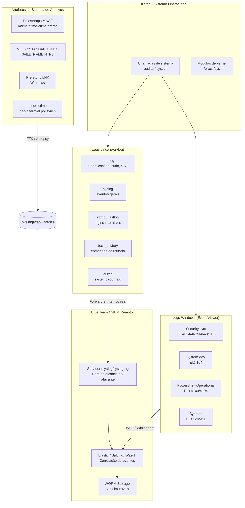
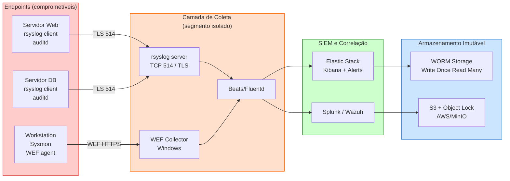

# Apagando Rastros

> [!quote] Cobrindo os Próprios Passos
> *Após uma invasão, atacantes buscam eliminar evidências para evitar detecção e investigação.*

---

## 🎯 O que é?

> [!warning] Fase do Pentest
> **Apagar rastros** (Covering Tracks) é a fase em que um atacante remove ou modifica evidências de sua presença no sistema comprometido.

Dentro do framework MITRE ATT&CK, essa fase corresponde à tática **Defense Evasion** e especialmente às técnicas da família **T1070 (Indicator Removal)**. Cada sub-técnica tem um código próprio:

| MITRE ID | Sub-técnica |
|----------|-------------|
| T1070.001 | Clear Windows Event Logs |
| T1070.002 | Clear Linux or Mac System Logs |
| T1070.003 | Clear Command History |
| T1070.006 | Timestomp |

> [!danger] Atenção Legal: Art. 154-A do Código Penal
> O art. 154-A (incluído pela Lei 12.737/2012, "Lei Carolina Dieckmann") tipifica o acesso não autorizado a dispositivos informáticos. Apagar rastros em sistemas de terceiros configura crime autônomo adicional (destruição de evidência, art. 347 do CP). **Todo o conteúdo desta aula aplica-se exclusivamente em laboratório, em máquinas próprias ou com autorização escrita prévia.**

### Por que Estudar?

| Perspectiva | Motivo |
|-------------|--------|
| **Red Team** | Entender para simular ataques realistas |
| **Blue Team** | Saber o que proteger e monitorar |
| **Forense** | Identificar técnicas de anti-forense |

Compreender como rastros são apagados é o pré-requisito para construir sistemas de logging que resistam a essas tentativas. Quem não sabe o que o atacante vai apagar não consegue proteger o que precisa ser preservado.

---

## 🗺️ Onde Ficam os Rastros: Mapa do Sistema



> [!tip] Ponto-Chave para o Blue Team
> O diagrama mostra que **logs locais são vulneráveis**, mas logs já encaminhados para um SIEM remoto estão fora do alcance do atacante local. Isso é o princípio central da defesa contra anti-forense.

---

## 🛠️ Técnicas Comuns

> [!info] Métodos de Ocultação

| Técnica | MITRE ID | Descrição |
|---------|----------|-----------|
| **Limpar logs** | T1070.001 / T1070.002 | Apagar ou modificar registros de eventos |
| **Modificar timestamps** | T1070.006 | Alterar datas de acesso/modificação (timestomping) |
| **Ocultar arquivos** | T1564.001 | Atributos hidden, alternate data streams |
| **Limpar histórico** | T1070.003 | Bash history, PowerShell history |
| **Remover ferramentas** | T1070.004 | Deletar malware após uso |
| **Tunelamento** | T1572 | Esconder tráfego em protocolos legítimos |
| **Desativar auditd/Sysmon** | T1562.001 | Parar ou matar agente de monitoramento |

---

## 📋 Logs Importantes

> [!tip] O que Atacantes Tentam Apagar

### Linux

| Log | Localização | Conteúdo | Método de Limpeza Comum |
|-----|-------------|----------|------------------------|
| **auth.log** | `/var/log/auth.log` | Autenticações, SSH, sudo | `> /var/log/auth.log` ou `truncate -s 0` |
| **syslog** | `/var/log/syslog` | Eventos do sistema | `cat /dev/null > /var/log/syslog` |
| **wtmp** | `/var/log/wtmp` | Logins de usuários | `utmpdump`, edição binária direta |
| **lastlog** | `/var/log/lastlog` | Último login por usuário | Edição binária por offset do UID |
| **bash_history** | `~/.bash_history` | Comandos executados | `history -c && history -w`, `unset HISTFILE` |
| **journal** | `/run/log/journal/` ou `/var/log/journal/` | Logs binários do systemd | `journalctl --vacuum-time=1s` |
| **audit.log** | `/var/log/audit/audit.log` | Chamadas de sistema (auditd) | Requer root; parar o daemon primeiro |

### Windows

| Log | Localização | Eventos Críticos | Método de Limpeza Comum |
|-----|-------------|-----------------|------------------------|
| **Security.evtx** | `%SystemRoot%\System32\winevt\Logs\` | 4624 (logon), 4625 (falha), 4648, 1102 (log limpo) | `wevtutil cl Security` |
| **System.evtx** | Mesma pasta | 104 (log limpo), 7045 (serviço instalado) | `wevtutil cl System` |
| **Application.evtx** | Mesma pasta | Eventos de aplicações | `wevtutil cl Application` |
| **PowerShell Operational** | `Microsoft-Windows-PowerShell/Operational` | 4103, 4104 (script block logging) | `wevtutil cl "Microsoft-Windows-PowerShell/Operational"` |
| **Sysmon Operational** | `Microsoft-Windows-Sysmon/Operational` | EID 1/3/5/11/13 | Parar o serviço Sysmon + limpar o log |

---

## 💻 Passo a Passo: Limpeza de Logs no Linux (Lab)

> [!danger] Apenas em máquina própria de laboratório. Nunca em produção ou sistemas de terceiros.

### 1. Limpar auth.log e syslog

```bash
# Ver o conteúdo atual (antes de limpar)
tail -50 /var/log/auth.log

# Método 1: truncar (arquivo existe mas fica vazio)
sudo truncate -s 0 /var/log/auth.log
sudo truncate -s 0 /var/log/syslog

# Método 2: redirecionar /dev/null
sudo sh -c 'cat /dev/null > /var/log/auth.log'

# Método 3: apagar e recriar (cria novo inode, deixa rastro!)
sudo rm /var/log/auth.log
sudo touch /var/log/auth.log
sudo chmod 640 /var/log/auth.log
```

**O que sobra para o forense:** O método 3 cria um novo inode com `ctime` recente, o que é imediatamente suspeito. O método 1 preserva o inode mas o `ctime` do arquivo muda na hora da truncagem (o `ctime` não pode ser alterado por `touch`, só via `debugfs` como root). Além disso, se o `rsyslog` ou `journald` já encaminhou as entradas para um SIEM remoto, apagar o arquivo local não remove as evidências centralizadas.

### 2. Limpar o histórico do Bash

```bash
# Ver o que está no histórico
cat ~/.bash_history

# Método 1: limpar a sessão atual e o arquivo
history -c
history -w

# Método 2: desativar o histórico da sessão atual (não salva nada ao sair)
unset HISTFILE

# Método 3: apontar HISTFILE para /dev/null (nada é gravado)
export HISTFILE=/dev/null

# Método 4: apagar o arquivo diretamente
rm ~/.bash_history

# Método 5: zerar o tamanho máximo do histórico
export HISTSIZE=0
export HISTFILESIZE=0
```

**O que sobra para o forense:** O kernel mantém os processos em `/proc/<PID>/environ`. Um investigador pode recuperar o valor de `HISTFILE` de um processo ainda em execução via `cat /proc/<PID>/environ | tr '\0' '\n' | grep HIST`. Além disso, o `auditd` com a regra `-a always,exit -F arch=b64 -S execve` registra cada chamada `execve()`, ou seja, cada comando executado, independentemente do histórico do shell. O Bash também pode estar compilado com `--enable-syslog` em distribuições endurecidas.

### 3. Limpar entradas do wtmp/lastlog

```bash
# wtmp é binário, usar utmpdump para inspecionar
utmpdump /var/log/wtmp

# Editar entradas específicas: exportar, editar, reimportar
sudo utmpdump /var/log/wtmp > /tmp/wtmp.txt
# editar /tmp/wtmp.txt removendo linhas suspeitas
sudo utmpdump -r /tmp/wtmp.txt > /tmp/wtmp_clean
sudo cp /tmp/wtmp_clean /var/log/wtmp

# Método drástico: zerar wtmp
sudo truncate -s 0 /var/log/wtmp
```

**O que sobra para o forense:** O `lastlog` é indexado por UID. Zerar o wtmp faz com que `last` não mostre nada, o que por si só é suspeito em um servidor ativo. Ferramentas forenses como `Autopsy` e `The Sleuth Kit` comparam o `ctime` do arquivo wtmp com os timestamps internos das entradas, detectando inconsistências.

### 4. Limpar o journald

```bash
# Ver logs do journal
sudo journalctl -xe

# Remover logs mais antigos que 1 segundo (esvazia praticamente tudo)
sudo journalctl --vacuum-time=1s

# Remover por tamanho
sudo journalctl --vacuum-size=1M

# Apagar os arquivos binários diretamente (mais agressivo)
sudo rm -rf /var/log/journal/*
sudo systemctl restart systemd-journald
```

**O que sobra para o forense:** O journald usa checksums internos por bloco. Se arquivos foram apagados e o daemon reiniciado, os timestamps de reinicialização ficam registrados no próprio journal subsequente. Análise de `dmesg` e `/proc/kmsg` pode revelar a lacuna temporal.

---

## 💻 Passo a Passo: Limpeza de Logs no Windows (Lab)

> [!danger] Apenas em máquina virtual de laboratório.

### 1. Limpar Event Logs com wevtutil

```powershell
# Listar todos os logs disponíveis
wevtutil el

# Ver eventos de segurança (antes de limpar)
wevtutil qe Security /c:20 /f:text

# Limpar logs individualmente
wevtutil cl Security
wevtutil cl System
wevtutil cl Application
wevtutil cl "Microsoft-Windows-PowerShell/Operational"
wevtutil cl "Microsoft-Windows-Sysmon/Operational"

# Limpar TODOS os logs de uma vez (script)
Get-WinEvent -ListLog * | ForEach-Object {
    wevtutil cl $_.LogName 2>$null
}
```

**O que sobra para o forense:** Ao limpar o log de Segurança, o próprio Windows gera o **Event ID 1102** ("The audit log was cleared") registrando o nome e domínio da conta que executou a limpeza. Esse evento é gerado **antes** da limpeza ocorrer e é encaminhado instantaneamente por WEF (Windows Event Forwarding) para um coletor remoto. O **Event ID 104** no System log serve ao mesmo propósito. APT28 (Fancy Bear) e Volt Typhoon foram documentados usando exatamente `wevtutil cl System` e `wevtutil cl Security`, e foram detectados precisamente por esse par de IDs no SIEM.

### 2. Limpar com PowerShell

```powershell
# Alternativa ao wevtutil via PowerShell
Clear-EventLog -LogName Security
Clear-EventLog -LogName System
Clear-EventLog -LogName Application

# Desativar auditoria (requer privilégio SeSecurityPrivilege)
auditpol /set /category:"Logon/Logoff" /success:disable /failure:disable
```

**O que sobra para o forense:** O PowerShell Operational log (EID 4104, Script Block Logging) registra o conteúdo do script executado. Para apagá-lo, o atacante precisaria de um passo adicional. Se o Script Block Logging estiver habilitado e os logs forem encaminhados remotamente, o próprio comando `Clear-EventLog` fica registrado no SIEM antes de executar.

---

## ⏱️ Timestomping: Manipulação de Timestamps

> [!info] O que é Timestomping
> Timestomping é a modificação deliberada dos atributos de tempo de um arquivo para disfarçar sua criação ou modificação, dificultando a reconstrução da linha do tempo (timeline) forense.

### Atributos de Tempo (MACE)

| Atributo | Significado | Nota |
|----------|-------------|------|
| **M** (mtime) | Última modificação do conteúdo | Alterável por `touch` |
| **A** (atime) | Último acesso | Alterável por `touch` |
| **C** (ctime) | Última mudança de metadados/inode | **NÃO alterável por `touch`** no Linux |
| **E** (crtime/btime) | Data de criação | Disponível em ext4, NTFS |

### Timestomping no Linux

```bash
# Ver timestamps atuais de um arquivo
stat arquivo.sh

# Alterar mtime e atime para parecer antigo
touch -a -m -t 202001011200.00 arquivo.sh

# Copiar timestamps de outro arquivo (camuflagem)
touch -r /bin/ls arquivo.sh

# Verificar o resultado (mtime/atime mudaram, ctime NÃO)
stat arquivo.sh
```

**O que sobra para o forense:** O `ctime` (change time do inode) é atualizado automaticamente pelo kernel sempre que os metadados do arquivo mudam, incluindo a própria operação de `touch`. Não existe comando de usuário que altere o `ctime` sem privilégios de kernel ou acesso direto ao dispositivo (`debugfs`). Um investigador que percebe `mtime` muito antigo mas `ctime` recente sabe imediatamente que houve timestomping.

Além disso, se o `auditd` está monitorando o arquivo com `-w /caminho/arquivo.sh -p wa`, a própria chamada ao `touch` fica registrada no audit.log com o timestamp real do sistema.

### Timestomping no Windows (NTFS)

No NTFS, cada arquivo tem **dois conjuntos** de timestamps:

| Atributo NTFS | Quem controla | Alterável por atacante |
|---------------|--------------|----------------------|
| `$STANDARD_INFORMATION` (SI) | Sistema (API) | Sim, via SetFileTime() |
| `$FILE_NAME` (FN) | Kernel (MFT) | Somente via técnica de "double timestomping" |

```powershell
# Alterar timestamp via PowerShell (modifica apenas SI)
$file = Get-Item "C:\malware.exe"
$file.CreationTime   = "01/01/2020 12:00:00"
$file.LastWriteTime  = "01/01/2020 12:00:00"
$file.LastAccessTime = "01/01/2020 12:00:00"

# Usando Metasploit (post/windows/manage/timestomp)
# meterpreter > timestomp C:\\malware.exe -z "01/01/2020 12:00:00"
```

**O que sobra para o forense:** A técnica clássica de detecção no Windows é comparar os timestamps de `$STANDARD_INFORMATION` (modificáveis) com os de `$FILE_NAME` (mais difíceis de alterar). Ferramentas como FTK Imager e Autopsy fazem essa comparação automaticamente. Outra pista: ferramentas automatizadas de timestomping geralmente zeram os nanossegundos (campo de 100ns no NTFS), gerando timestamps "redondos" como `12:00:00.0000000` que são estatisticamente raros em arquivos legítimos.

---

## 🔒 Defesa: Logging Imutável e Detecção em Tempo Real

> [!success] Estratégia Defensiva Completa

A premissa central da defesa é: **um atacante só pode apagar logs que estão sob seu controle**. Se os logs foram encaminhados para um servidor remoto antes da tentativa de limpeza, o rastro sobrevive.

### 1. Logging Remoto com rsyslog

```bash
# No servidor de logs (receptor, IP: 192.168.1.200)
# /etc/rsyslog.conf - habilitar recepção TCP
module(load="imtcp")
input(type="imtcp" port="514")

# No cliente comprometido (emissor)
# /etc/rsyslog.d/50-remote.conf
*.* @@192.168.1.200:514   # @@ = TCP, @ = UDP

# Reiniciar rsyslog no cliente
sudo systemctl restart rsyslog
```

Com essa configuração, cada linha gravada em `/var/log/auth.log` é simultaneamente encaminhada para o servidor remoto. Apagar o arquivo local não remove a cópia remota.

### 2. Configuração do auditd para Detectar Anti-Forense

```bash
# Instalar auditd
sudo apt install auditd

# Regras em /etc/audit/rules.d/anti-forensics.rules

# Monitorar deleção e modificação de logs críticos
-w /var/log/auth.log -p wa -k log_tampering
-w /var/log/syslog -p wa -k log_tampering
-w /var/log/wtmp -p wa -k log_tampering
-w /var/log/audit/ -p wa -k audit_tampering

# Monitorar escrita em /dev/null via histórico (anti-forense clássico)
-a always,exit -F arch=b64 -S execve -F a0=/dev/null -k history_nulling

# Monitorar chamadas ao truncate/unlink em /var/log
-a always,exit -F arch=b64 -S truncate -F dir=/var/log -k log_truncate
-a always,exit -F arch=b64 -S unlink -F dir=/var/log -k log_delete

# Monitorar TODOS os comandos executados (alto volume, usar com cuidado)
-a always,exit -F arch=b64 -S execve -k all_commands

# Bloquear modificação das próprias regras do auditd (modo imutável)
-e 2
```

A flag `-e 2` coloca o auditd em modo imutável: nenhuma regra pode ser alterada sem reiniciar o sistema. Isso significa que um atacante que tentar parar ou reconfigurar o auditd vai precisar de um reboot, o que gera outros eventos detectáveis.

```bash
# Carregar as regras
sudo augenrules --load

# Verificar o que foi capturado (buscar por chave)
sudo ausearch -k log_tampering
sudo ausearch -k log_delete

# Gerar relatório de eventos
sudo aureport --summary
```

### 3. Sysmon no Windows: Detecção de Anti-Forense

```xml
<!-- Sysmon config para detectar limpeza de logs -->
<!-- Evento 1: Criação de processo -->
<ProcessCreate onmatch="include">
  <Image condition="end with">wevtutil.exe</Image>
  <CommandLine condition="contains">cl </CommandLine>
</ProcessCreate>

<!-- Evento 5: Processo terminado (detectar Sysmon sendo parado) -->
<ProcessTerminate onmatch="include">
  <Image condition="contains">sysmon</Image>
</ProcessTerminate>

<!-- Evento 13: Modificação de valor no registro -->
<RegistryEvent onmatch="include">
  <TargetObject condition="contains">SYSTEM\CurrentControlSet\Services\EventLog</TargetObject>
</RegistryEvent>
```

Sysmon Event ID 1 com `Image = wevtutil.exe` e `CommandLine` contendo `cl` é um indicador direto de limpeza de log. SIEMs como Elastic Security e Splunk possuem regras de detecção pré-construídas para esse padrão.

### 4. Windows Event Forwarding (WEF): Sobrevivência de Logs

```powershell
# No coletor (Subscription Manager)
winrm qc
wecutil qc

# Criar subscription para encaminhar eventos críticos
# Eventos: 1102 (Security cleared), 104 (System cleared),
#           4624/4625 (logon/falha), 4688 (processo criado)

# Nos clientes: configurar via GPO
# Computer Configuration > Windows Settings > Security Settings
# > Advanced Audit Policy Configuration
```

### Tabela de Referência: Rastro, Técnica, Detecção

| Rastro que o atacante quer apagar | Técnica anti-forense | Como o Blue Team detecta |
|-----------------------------------|----------------------|--------------------------|
| Logs de autenticação SSH | `truncate -s 0 /var/log/auth.log` | `ctime` do arquivo muda; auditd regra `-w`; cópia remota no SIEM |
| Histórico de comandos | `unset HISTFILE` / `history -c` | `auditd -S execve`; `/proc/<PID>/environ`; variável `HISTFILE=/dev/null` no ambiente |
| Logins recentes (`last`) | Edição binária de wtmp | `ctime` de wtmp recente vs entradas antigas; Autopsy detecta inconsistência |
| Event Logs Windows | `wevtutil cl Security` | EID 1102 encaminhado via WEF antes da limpeza; Sysmon EID 1 |
| Timestamps de arquivo (mtime/atime) | `touch -t` / timestomping | `ctime` Linux não muda; comparação `$SI` vs `$FN` no NTFS; nanossegundos zerados |
| Ferramenta maliciosa após uso | `rm malware.sh` | Slack space no sistema de arquivos; auditd `-S unlink`; Prefetch no Windows |
| Atividade do auditd | `systemctl stop auditd` | Evento de parada do serviço registrado antes; lacuna no sequence number dos logs |
| Atividade do Sysmon | `sc stop Sysmon` | Sysmon EID 4 (service stop); EID 5 (process terminate); SIEM detecta ausência de heartbeat |

---

## 🧪 Atividades de Laboratório

> [!example] 🧪 Atividade 1: Limpar Bash History e Investigar o que Sobrou

**Objetivo:** Executar técnicas de limpeza de histórico e depois fazer a análise forense do que restou.

**Pré-requisito:** VM Linux (Kali, Ubuntu ou Debian). O auditd NÃO deve estar configurado ainda (para simular o ambiente sem defesa).

**Parte 1: Simular o atacante**

```bash
# 1. Executar alguns comandos que deixam rastros
whoami
id
cat /etc/passwd
ls /root

# 2. Tentar limpar o histórico
history -c
history -w
unset HISTFILE

# 3. Sair e entrar novamente na sessão
exit
# (novo login)
history  # o que aparece?

# 4. Tentar o método do /dev/null
export HISTFILE=/dev/null
ls /tmp
cat /etc/shadow  # (erro esperado, mas o comando foi executado)
exit
# (novo login)
history  # o que aparece agora?
```

**Parte 2: Análise forense**

```bash
# 1. Verificar se o arquivo .bash_history existe e tem conteúdo
ls -la ~/.bash_history
cat ~/.bash_history

# 2. Verificar o ctime do arquivo (quando foi modificado por último no nível de inode)
stat ~/.bash_history

# 3. Verificar variáveis de ambiente de processos ativos
# Abrir um terminal separado ANTES de unset HISTFILE e verificar:
cat /proc/$BASHPID/environ | tr '\0' '\n' | grep -i hist

# 4. Verificar se o journald capturou algo
journalctl _UID=$(id -u) --since "1 hour ago" | grep -E "bash|history|HIST"
```

**Observação para discussão:** Mesmo após `history -c && history -w`, o `stat` do arquivo mostra um `ctime` recente (hora da limpeza). Um arquivo `.bash_history` com `ctime` de 03:47 da madrugada em um servidor de produção é um indicador imediato de comprometimento. Além disso, se o `auditd` estiver ativo com `-S execve`, todos os comandos executados estão em `/var/log/audit/audit.log` independentemente do histórico do shell.

---

> [!example] 🧪 Atividade 2: Configurar auditd e Ver o que Ele Captura

**Objetivo:** Instalar e configurar o auditd, executar ações suspeitas e observar o que ficou registrado, mesmo que um atacante tentasse apagar logs convencionais.

**Pré-requisito:** VM Linux com acesso root.

```bash
# Parte 1: Instalar e configurar auditd
sudo apt update && sudo apt install -y auditd audispd-plugins

# Parte 2: Adicionar regras de monitoramento
sudo tee /etc/audit/rules.d/lab-antiforense.rules << 'EOF'
# Monitorar modificações em arquivos de log
-w /var/log/auth.log -p wa -k log_tampering
-w /var/log/syslog -p wa -k log_tampering
-w /var/log/wtmp -p wa -k log_tampering

# Monitorar execução de comandos (todos)
-a always,exit -F arch=b64 -S execve -k all_commands

# Monitorar operações de truncate em /var/log
-a always,exit -F arch=b64 -S truncate -F dir=/var/log -k log_truncate

# Monitorar deleção de arquivos
-a always,exit -F arch=b64 -S unlink -S unlinkat -k file_delete
EOF

sudo augenrules --load
sudo systemctl restart auditd
sudo systemctl enable auditd

# Parte 3: Simular ações de "atacante"
sudo truncate -s 0 /var/log/auth.log
history -c && history -w
sudo rm /tmp/arquivo_teste.sh 2>/dev/null || sudo touch /tmp/arquivo_teste.sh && sudo rm /tmp/arquivo_teste.sh

# Parte 4: Investigar o que o auditd capturou
sudo ausearch -k log_tampering
sudo ausearch -k log_truncate
sudo ausearch -k file_delete

# Relatório resumido
sudo aureport --summary
sudo aureport -x --summary  # por executável
```

**Observação para discussão:** O auditd operou no nível de chamada de sistema (syscall), registrando as ações **antes** que o resultado (apagar o log) produzisse efeito. O registro inclui: UID real do usuário, PID, nome do executável, caminho do arquivo afetado e timestamp. Mesmo que o atacante tenha apagado `/var/log/auth.log`, o registro da tentativa está em `/var/log/audit/audit.log`. Para contornar isso, o atacante precisaria parar o auditd (o que gera outro evento) ou ter acesso físico para remontar a partição sem o auditd ativo.

---

> [!example] 🧪 Atividade 3: Logging Remoto e Por que ele Derrota o "Apagar Rastros"

**Objetivo:** Configurar um servidor rsyslog receptor, encaminhar logs de um cliente para ele e demonstrar que apagar os logs locais não elimina as evidências.

**Pré-requisito:** Duas VMs na mesma rede: `vm-servidor` (IP: 192.168.56.10) e `vm-cliente` (IP: 192.168.56.20).

```bash
# ===== Na vm-servidor =====

# 1. Instalar e configurar rsyslog como receptor
sudo apt install -y rsyslog

# 2. Habilitar recepção TCP na porta 514
sudo tee /etc/rsyslog.d/00-server.conf << 'EOF'
module(load="imtcp")
input(type="imtcp" port="514")

# Separar logs por host de origem
$template RemoteLogs,"/var/log/remote/%HOSTNAME%/%PROGRAMNAME%.log"
*.* ?RemoteLogs
& ~
EOF

sudo mkdir -p /var/log/remote
sudo systemctl restart rsyslog

# ===== Na vm-cliente =====

# 3. Configurar rsyslog para enviar logs ao servidor
sudo tee /etc/rsyslog.d/50-forward.conf << 'EOF'
*.* @@192.168.56.10:514
EOF

sudo systemctl restart rsyslog

# 4. Gerar eventos de autenticação no cliente
su - outrouser  # tentativa de login (pode falhar, gera evento)
sudo ls /root   # acesso com sudo

# 5. Verificar que os logs chegaram ao servidor
# (na vm-servidor)
ls /var/log/remote/
cat /var/log/remote/vm-cliente/sudo.log

# ===== Simular ataque no cliente =====

# 6. Agora "limpar os rastros" no cliente
sudo truncate -s 0 /var/log/auth.log
sudo journalctl --vacuum-time=1s

# 7. Verificar no servidor que os logs AINDA ESTÃO LÁ
# (na vm-servidor)
cat /var/log/remote/vm-cliente/sudo.log  # evidências intactas!
cat /var/log/remote/vm-cliente/sshd.log
```

**Observação para discussão:** Este exercício demonstra o princípio fundamental: um atacante que comprometeu a `vm-cliente` tem controle total sobre os logs locais daquela máquina. Mas os logs que já foram transmitidos para a `vm-servidor` estão completamente fora do seu alcance (a menos que ele também comprometa o servidor de logs, o que requer um segundo vetor de ataque completamente diferente). Por isso, arquiteturas de segurança maduras usam servidores de log isolados em segmentos de rede separados, com controle de acesso rígido, e frequentemente armazenamento imutável (WORM: Write Once, Read Many).

---

## 🛡️ Defesa: Arquitetura de Logging Resistente a Anti-Forense



### Checklist de Defesa contra Anti-Forense

| Controle | Ferramenta/Método | Prioridade |
|----------|-------------------|-----------|
| Logs encaminhados em tempo real | rsyslog TCP/TLS, WEF, Filebeat | 🔴 Crítico |
| SIEM com correlação | Elastic, Splunk, Wazuh | 🔴 Crítico |
| auditd com modo imutável (`-e 2`) | auditd + augenrules | 🔴 Crítico |
| Sysmon instalado no Windows | Sysmon v15+ | 🔴 Crítico |
| Alertas para EID 1102 / EID 104 | Regras SIEM pré-built | 🟠 Alta |
| Alertas para parada de auditd/Sysmon | systemd + SIEM | 🟠 Alta |
| Armazenamento WORM para logs históricos | MinIO + Object Lock, S3 | 🟠 Alta |
| Monitoramento de integridade de arquivos (FIM) | auditd -w, AIDE, Wazuh FIM | 🟡 Média |
| Análise de timestamps com Autopsy/FTK | Forense pós-incidente | 🟡 Média |
| Alerta para nanossegundos zerados em NTFS | Regra SIGMA personalizada | 🟡 Média |

---

## ⚠️ Considerações Éticas

> [!danger] Atenção
> - Este conhecimento é para **defesa** e **red team autorizado**
> - Apagar rastros em sistemas não autorizados é **crime** (art. 154-A CP e art. 347 CP)
> - Em pentests, documentar tudo antes de limpar qualquer evidência
> - O red teamer que apaga rastros sem autorização contratual pode ser responsabilizado mesmo com contrato de pentest (os contratos geralmente exigem preservação de evidências para o relatório final)
> - Destruição de evidências em investigação judicial é crime autônomo (art. 347 CP: "fraude processual"), independente do crime original

---

> [!note] 📚 Fontes (2026)

- [MITRE ATT&CK: T1070 - Indicator Removal](https://attack.mitre.org/techniques/T1070/)
- [MITRE ATT&CK: T1070.006 - Timestomp](https://attack.mitre.org/techniques/T1070/006/)
- [HackTheBox Blog: 5 anti-forensics techniques to trick investigators](https://www.hackthebox.com/blog/anti-forensics-techniques)
- [inversecos: Detecting Linux Anti-Forensics - Timestomping](https://www.inversecos.com/2022/08/detecting-linux-anti-forensics.html)
- [inversecos: Defence Evasion - Timestomping Detection (NTFS)](https://www.inversecos.com/2022/04/defence-evasion-technique-timestomping.html)
- [SANS: Breaking Time - Timestomping on FAT32, Ext3 e Ext4](https://www.sans.org/white-papers/breaking-time-methods-artifacts-forensic-detection-timestomping-fat32-ext3-ext4-file-systems/)
- [Elastic Security: Clearing Windows Event Logs (wevtutil)](https://www.elastic.co/docs/reference/security/prebuilt-rules/rules/windows/defense_evasion_clearing_windows_event_logs)
- [Splunk: Windows Eventlog Cleared Via Wevtutil](https://research.splunk.com/endpoint/fdb829a8-db84-4832-b64b-3e964cd44f01/)
- [MITRE CAR-2021-01-003: Clearing Windows Logs with Wevtutil](https://car.mitre.org/analytics/CAR-2021-01-003/)
- [Elastic Security Labs: Linux Detection Engineering with Auditd](https://www.elastic.co/security-labs/linux-detection-engineering-with-auditd)
- [Red Hat: Configuring a Remote Logging Solution (rsyslog)](https://docs.redhat.com/en/documentation/red_hat_enterprise_linux/9/html/security_hardening/assembly_configuring-a-remote-logging-solution_security-hardening)
- [Detection.FYI: Linux Command History Tampering (SIGMA)](https://detection.fyi/sigmahq/sigma/linux/builtin/lnx_shell_clear_cmd_history/)
- [GitHub: BlueTeam-Tools](https://github.com/A-poc/BlueTeam-Tools)
- [Splunk: Detecting Linux Auditd Sysmon Service Stop](https://research.splunk.com/endpoint/20901256-633a-40de-8753-7b88811a460f/)
- [pberba.github.io: Hunting for Persistence in Linux with Auditd e Sysmon](https://pberba.github.io/security/2021/11/22/linux-threat-hunting-for-persistence-sysmon-auditd-webshell/)
- [ManageEngine: Detecting Indicator Removal (T1070) com SIEM](https://www.manageengine.com/log-management/mitre-attack/defense-evasion/indicator-removal.html)
