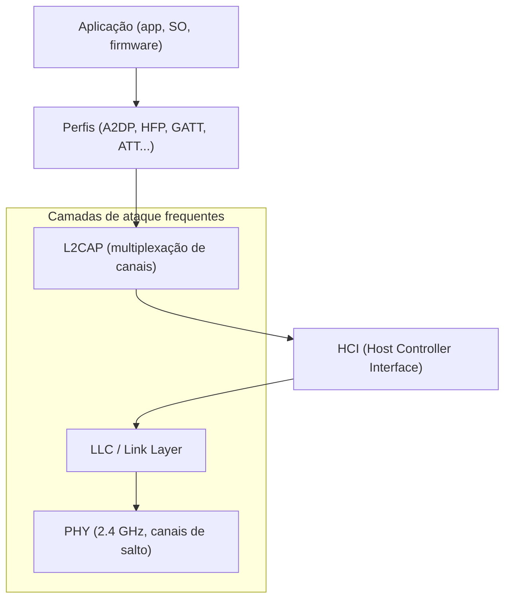
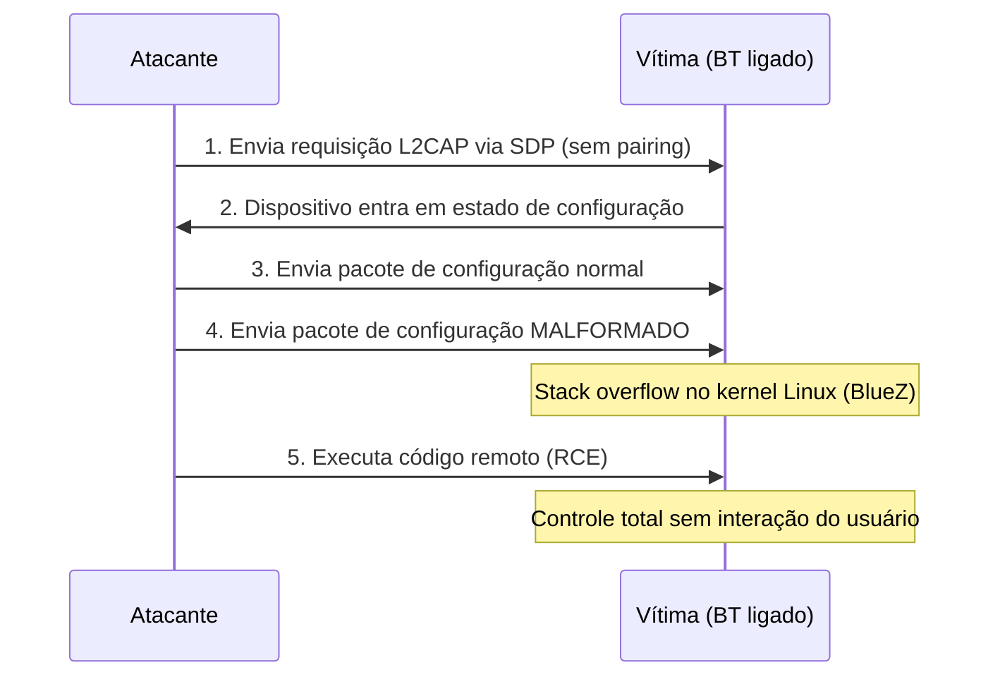

# Bluetooth

> [!quote] Conexão de Curto Alcance
> *Bluetooth está em quase todos os dispositivos modernos: smartphones, fones de ouvido, teclados, relógios, monitores de saúde, fechaduras inteligentes. E com ele, uma superfície de ataque enorme e frequentemente negligenciada.*

---

## 📡 O que é Bluetooth?

> [!info] Visão Geral
> **Bluetooth** é uma tecnologia de comunicação sem fio de curto alcance que opera na faixa de 2.4 GHz (banda ISM). Existem duas variantes principais com arquiteturas e casos de uso distintos: **Bluetooth Clássico (BR/EDR)** e **Bluetooth Low Energy (BLE/LE)**.

### Características Gerais

| Aspecto | Bluetooth Clássico (BR/EDR) | Bluetooth Low Energy (BLE) |
|---------|------------------------------|----------------------------|
| **Frequência** | 2.4 GHz (ISM band) | 2.4 GHz (ISM band) |
| **Alcance** | 1 m a 100 m (por classe) | 10 m a 400 m (BLE 5.x) |
| **Velocidade** | Até 3 Mbps (3.0+EDR) | Até 2 Mbps (5.x) |
| **Consumo** | Alto | Muito baixo (nome diz tudo) |
| **Uso típico** | Áudio, transferência de arquivo | IoT, wearables, sensores, beacons |
| **Versões** | 1.0 até 5.3 | Introduzido no 4.0 |
| **Topologia** | Piconet, Scatternet | Advertiser/Scanner, Central/Peripheral |

### Classes de Potência (Clássico)

| Classe | Potência | Alcance típico |
|--------|----------|----------------|
| Classe 1 | 100 mW (20 dBm) | ~100 m |
| Classe 2 | 2.5 mW (4 dBm) | ~10 m |
| Classe 3 | 1 mW (0 dBm) | ~1 m |

---

## 🏗️ Arquitetura do Stack Bluetooth e BLE

> [!info] Por que entender o stack?
> A maioria dos ataques explora camadas específicas do protocolo. Saber onde cada ataque incide facilita a análise e a defesa.



### Canais BLE (40 canais de 2 MHz)

| Tipo | Canais | Função |
|------|--------|--------|
| Advertising | 37, 38, 39 | Anunciar presença e descoberta |
| Data | 0 a 36 | Troca de dados após conexão |

O BLE usa **frequency hopping** nos canais de dados: mais difícil de sniffar sem hardware dedicado (Ubertooth ou nRF Sniffer).

---

## ⚔️ Ataques Conhecidos

> [!warning] Panorama de Vulnerabilidades Bluetooth (Clássico + BLE)
> Os ataques abaixo estão documentados em CVEs públicos ou em papers revisados por pares. Testá-los em dispositivos de terceiros sem autorização configura **crime (art. 154-A do Código Penal Brasileiro)**.

### Tabela Geral de Ataques

| Ataque | Alvo | Técnica | Ferramenta principal | Defesa |
|--------|------|---------|----------------------|--------|
| **Bluejacking** | Clássico | Mensagem não solicitada via OBEX | `hcitool`, `obexftp` | Modo não-descobrível |
| **Bluesnarfing** | Clássico | Acesso não autorizado a OBEX (contatos, SMS) | `bluesnarfer`, `obexftp` | Atualizar firmware, desativar OBEX |
| **Bluebugging** | Clássico | Comandos AT via canal de serial oculto | `bluesnarfer` | Firmware atualizado |
| **BlueBorne** | Clássico/BLE/LE | RCE via L2CAP sem pareamento (CVE-2017-1000251) | PoC público | Patch do kernel, BT desligado |
| **KNOB Attack** | Clássico/BLE | Rebaixamento de entropia de chave para 1 byte (CVE-2019-9506) | `knob-attack` (PoC) | BT 5.1+, firmware atualizado |
| **BIAS Attack** | Clássico | Bypass de autenticação via impersonação de master/slave | `bias-attack` (PoC) | Firmware com validação de papéis |
| **BLE MITM** | BLE | Interceptação de pareamento Just Works sem autenticação | `bettercap`, `gattacker` | Modo de pareamento seguro (LE Secure) |
| **GATT Spoofing** | BLE | Leitura/escrita de características sem autenticação | `bettercap ble.write` | Exigir autenticação no GATT |
| **BLE Sniffing** | BLE | Captura passiva de advertising e dados | Ubertooth, nRF Sniffer | Criptografia BLE, LE Secure |
| **Headphone RACE** | BLE | Acesso não autenticado a protocolo de debug (CVE-2025-20700/01/02) | Exploit direto por BLE | Atualizar firmware do headphone |
| **Device Tracking** | BLE | Rastreamento por MAC fixo em advertising | Scanner passivo | Randomização de endereço MAC |

---

## 🔬 BlueBorne em Detalhes (CVE-2017-1000251)

> [!danger] Ataque sem pareamento
> O BlueBorne é um vetor de ataque que explora a pilha Bluetooth do sistema operacional **sem que a vítima precise aceitar nenhum pareamento** e **sem que o Bluetooth esteja em modo descobrível**. Basta que o BT esteja ligado.

### Como funciona (passo a passo)



**CVEs do BlueBorne:**
- CVE-2017-1000251: Linux kernel, RCE via L2CAP (BlueZ)
- CVE-2017-1000250: BlueZ, vazamento de informação via SDP
- CVE-2017-0785: Android, vazamento de informação
- CVE-2017-0781/0782: Android, RCE

**Impacto histórico:** Afetou bilhões de dispositivos (Linux, Android, Windows, iOS pré-10). Ainda relevante em dispositivos não atualizados (IoT, equipamentos industriais).

---

## 🔑 KNOB Attack em Detalhes (CVE-2019-9506)

> [!danger] Rebaixamento de Criptografia
> O ataque KNOB (Key Negotiation of Bluetooth) explora uma falha **na especificação** do Bluetooth, não em uma implementação específica. Qualquer dispositivo padrão-compatível está vulnerável se não tiver patch.

**O problema:** O protocolo de negociação de chave de sessão Bluetooth permite negociar **entropia de apenas 1 byte** (o parâmetro `max keysize`). A negociação não é autenticada nem protegida por integridade.

**Sequência do ataque:**

1. Atacante fica no meio (MITM) entre dois dispositivos que já se conhecem.
2. Intercepta a negociação de chave e rebaixa `max keysize` para 1 byte.
3. Ambos os dispositivos aceitam a chave fraca (são padrão-compatíveis).
4. Atacante faz brute-force da chave de 1 byte em tempo real.
5. Descriptografa toda a comunicação.

**Ponto crítico:** O par de dispositivos já havia se pareado com chave forte (16 bytes). O KNOB rebaixa **a cada nova sessão**, sem exigir re-pareamento.

---

## 🔑 BIAS Attack (Bluetooth Impersonation AttackS)

> [!danger] Bypass de Autenticação
> O BIAS explora a autenticação de sessão do Bluetooth Clássico. Um atacante pode se passar por um dispositivo previamente pareado **sem conhecer a chave de longo prazo (LTK)**.

**Mecanismo:** O Bluetooth Clássico permite que um dispositivo declare-se como mestre ou escravo na sessão. O atacante força o papel de mestre e inicia o processo de autenticação com o papel invertido, onde a autenticação **não é mutuamente obrigatória** em versões antigas do protocolo.

**Combinação perigosa:** BIAS + KNOB = impersonação + descriptografia de sessão.

---

## 🆕 Vulnerabilidades Recentes (2025)

> [!warning] CVE-2025-20700/20701/20702: Protocolo RACE em Headphones
> Fones de ouvido Bluetooth de marcas populares (Sony, Marshall, JBL, Jabra, Bose) com chipset **Airoha** expõem o protocolo de debug **RACE (Remote Audio Call Enhancement)** via BLE sem autenticação.

| CVE | Severidade | Impacto |
|-----|-----------|---------|
| CVE-2025-20700 | Alta | Conexão BLE sem pairing a serviços GATT não autenticados |
| CVE-2025-20701 | Alta | Acesso não autenticado via Bluetooth Clássico |
| CVE-2025-20702 | Crítica | Acesso completo ao protocolo RACE: leitura de flash, RAM e extração de link keys |

**Impacto prático:** Um atacante dentro do alcance BLE pode:
1. Conectar silenciosamente ao fone vulnerável.
2. Extrair a **link key** criptográfica armazenada na flash.
3. Impersonar o fone perante o smartphone pareado.
4. Interceptar e injetar áudio em chamadas.

**Defesa:** Atualizar o firmware do fone (verifique o app do fabricante).

---

## 🛠️ Ferramentas de Auditoria

> [!tip] Arsenal para Testes (somente em dispositivos próprios ou com autorização)

| Ferramenta | Tipo | Descrição |
|------------|------|-----------|
| **bluetoothctl** | CLI (BlueZ) | Interface interativa principal para BT/BLE no Linux |
| **hcitool** | CLI (legado) | Controle de adaptador, scan, comandos HCI |
| **hcidump/btmon** | CLI | Dump de tráfego HCI em tempo real |
| **gatttool** | CLI | Enumeração e interação com serviços GATT (legado, mas ainda usado) |
| **bettercap** | Framework | Reconhecimento BLE, MITM, leitura/escrita de características |
| **bluing** | CLI | Scanner e enumerador BLE/BT moderno (Python) |
| **bluesnarfer** | CLI | Exploração de bluesnarfing (OBEX) |
| **Spooftooph** | CLI | Spoofing de endereço MAC Bluetooth |
| **Redfang** | CLI | Descoberta de dispositivos em modo não-descobrível |
| **Ubertooth One** | Hardware+SW | Sniffing de BLE e Bluetooth Clássico com hardware dedicado |
| **nRF Sniffer** | Hardware+SW | Sniffing BLE via dongle Nordic nRF52840 + Wireshark plugin |
| **Wireshark** | GUI | Análise de pacotes Bluetooth (com btmon ou Ubertooth) |
| **gattacker** | Framework Node.js | MITM BLE via proxy de perfil GATT |
| **btlejuice** | Framework | Proxy MITM para BLE (interceptação de apps mobile) |

---

## 🔧 Configuração do Ambiente

> [!info] Pré-requisitos no Kali Linux / Ubuntu

### Verificando e preparando o adaptador

```bash
# Listar adaptadores USB (verificar se o dongle BT está reconhecido)
lsusb

# Verificar interfaces Bluetooth (com detalhes de BD ADDR, tipo, versão)
hciconfig -a

# Ativar adaptador (se estiver DOWN)
sudo hciconfig hci0 up

# Status do serviço BlueZ
systemctl status bluetooth

# Verificar versão do BlueZ instalada
bluetoothctl version

# Instalar ferramentas essenciais
sudo apt update
sudo apt install bluetooth bluez bluez-tools btscanner bluesnarfer \
     ubertooth bettercap python3-bluing -y
```

### Instalando bettercap

```bash
# Via apt (Kali)
sudo apt install bettercap -y

# Via Go (versão mais recente)
go install github.com/bettercap/bettercap@latest

# Verificar módulos disponíveis
sudo bettercap -h
```

### Instalando bluing

```bash
# Via pip
pip3 install bluing

# Verificar instalação
bluing --help
```

---

## 🔍 Reconhecimento Bluetooth Clássico

> [!info] Fase de descoberta: identificar dispositivos, endereços e serviços disponíveis.

### Comandos com bluetoothctl

```bash
# Entrar no shell interativo do bluetoothctl
bluetoothctl

# Dentro do shell:
power on                    # Garantir que o adaptador está ligado
agent on                    # Habilitar agente de pareamento
default-agent               # Definir como agente padrão
scan on                     # Iniciar scan (mostra dispositivos ao vivo)
devices                     # Listar dispositivos encontrados
info XX:XX:XX:XX:XX:XX      # Detalhes de um dispositivo específico
scan off                    # Parar o scan
exit
```

### Comandos com hcitool (legado, ainda útil)

```bash
# Scan de dispositivos clássicos (modo descobrível)
sudo hcitool scan

# Scan BLE (advertising packets)
sudo hcitool lescan

# Informações de um dispositivo específico
sudo hcitool info XX:XX:XX:XX:XX:XX

# Testar conectividade via L2CAP ping (similar ao ping ICMP)
sudo l2ping -c 5 XX:XX:XX:XX:XX:XX

# Flood ping (teste de DoS, somente em lab próprio)
sudo l2ping -f XX:XX:XX:XX:XX:XX
```

### Descobrindo Serviços (SDP)

```bash
# Listar todos os serviços disponíveis no dispositivo
sdptool browse XX:XX:XX:XX:XX:XX

# Listar apenas serviços de áudio
sdptool browse --l2cap XX:XX:XX:XX:XX:XX

# Buscar serviço específico (ex: serial port)
sdptool search --bdaddr XX:XX:XX:XX:XX:XX SP
```

---

## 📶 Reconhecimento BLE com bettercap

> [!tip] bettercap: a canivete suíço do pentest de redes
> O bettercap tem um módulo dedicado ao BLE (`ble.recon`) que permite descobrir, enumerar e interagir com dispositivos BLE de forma automatizada.

### Iniciando o módulo BLE

```bash
# Abrir bettercap com interface do adaptador BT
sudo bettercap -iface hci0

# Dentro do REPL interativo do bettercap:
> ble.recon on          # Iniciar reconhecimento BLE (advertising scan)
> ble.show              # Mostrar tabela de dispositivos encontrados
> ble.recon off         # Parar o reconhecimento
```

### Saída típica do ble.show

```
  ble ▶ ble.show

  ┌──────────────────┬───────────────────────────┬────────┬─────┬──────┬──────────────────┐
  │       MAC        │           Nome            │ Vendor │ RSI │ Conn │     Serviços     │
  ├──────────────────┼───────────────────────────┼────────┼─────┼──────┼──────────────────┤
  │ AA:BB:CC:DD:EE:FF│ Mi Band 7                 │ Xiaomi │ -65 │ true │ 0x1800, 0x180A   │
  │ 11:22:33:44:55:66│ JBL Tune 510BT            │ JBL    │ -72 │ true │ 0x180F           │
  └──────────────────┴───────────────────────────┴────────┴─────┴──────┴──────────────────┘
```

### Enumerando serviços e características GATT

```bash
# Enumerar todos os serviços e características do dispositivo
# (requer que o dispositivo aceite conexão)
> ble.enum AA:BB:CC:DD:EE:FF

# Ler uma característica específica (pelo handle UUID)
> ble.read AA:BB:CC:DD:EE:FF 00002a29-0000-1000-8000-00805f9b34fb

# Escrever em uma característica (ex: mudar configuração de LED/vibração)
> ble.write AA:BB:CC:DD:EE:FF 00002a06-0000-1000-8000-00805f9b34fb ff
```

### UUIDs GATT comuns (referência rápida)

| UUID | Serviço/Característica | Informação exposta |
|------|------------------------|--------------------|
| 0x1800 | Generic Access | Nome do dispositivo, classe de aparência |
| 0x1801 | Generic Attribute | Mudanças de serviço |
| 0x180A | Device Information | Fabricante, modelo, firmware, serial |
| 0x180F | Battery Service | Nível de bateria |
| 0x1810 | Blood Pressure | Leitura de pressão (dispositivos médicos) |
| 0x181A | Environmental Sensing | Temperatura, umidade (sensores IoT) |
| 0x2A29 | Manufacturer Name | Nome do fabricante |
| 0x2A24 | Model Number | Número do modelo |
| 0x2A26 | Firmware Revision | Versão de firmware |

---

## 🔬 Reconhecimento BLE com bluing

> [!tip] bluing: scanner BLE moderno em Python

```bash
# Scan de advertising BLE básico
sudo bluing -i hci0 --scan

# Scan com tempo definido (30 segundos)
sudo bluing -i hci0 --scan --timeout 30

# Enumerar serviços GATT de um dispositivo específico
sudo bluing -i hci0 --gatt-enum AA:BB:CC:DD:EE:FF

# Verificar suporte a BLE privacy (endereço aleatório)
sudo bluing -i hci0 --addr-type random --scan

# Scan com output em JSON (para análise posterior)
sudo bluing -i hci0 --scan --output json > resultado_ble.json
```

---

## 📡 Enumeração GATT com gatttool e bluetoothctl

> [!info] gatttool ainda é amplamente usado em labs e CTFs, mesmo sendo considerado legado.

### Com gatttool (modo interativo)

```bash
# Conectar ao dispositivo BLE em modo interativo
gatttool -b AA:BB:CC:DD:EE:FF --interactive

# Dentro do shell gatttool:
[AA:BB:CC:DD:EE:FF][LE]> connect
[AA:BB:CC:DD:EE:FF][LE]> primary          # Listar serviços primários
[AA:BB:CC:DD:EE:FF][LE]> characteristics  # Listar características
[AA:BB:CC:DD:EE:FF][LE]> char-read-hnd 0x0003   # Ler pelo handle
[AA:BB:CC:DD:EE:FF][LE]> char-write-req 0x0010 01   # Escrever no handle
[AA:BB:CC:DD:EE:FF][LE]> disconnect
```

### Com bluetoothctl (BLE moderno)

```bash
bluetoothctl

# Dentro do shell:
power on
scan on
# Aguardar aparecer o dispositivo BLE desejado
scan off
connect AA:BB:CC:DD:EE:FF
gatt.list-attributes AA:BB:CC:DD:EE:FF    # Listar atributos GATT
gatt.select-attribute /org/bluez/hci0/dev_AA_BB_CC_DD_EE_FF/service0001/char0002
gatt.read                                 # Ler valor da característica
gatt.write "0x01 0x02"                    # Escrever valor
disconnect AA:BB:CC:DD:EE:FF
exit
```

---

## 📻 Sniffing BLE com Hardware Dedicado

> [!warning] Sniffing requer hardware especializado
> O adaptador BT comum do laptop não consegue capturar tráfego BLE de conexões entre outros dispositivos. É necessário um **Ubertooth One** ou um dongle **nRF52840** (Nordic Semiductor) com firmware de sniffer.

### Ubertooth One

O **Ubertooth One** é um hardware open-source desenvolvido por Michael Ossmann especificamente para pesquisa de segurança Bluetooth. Captura tráfego BLE e Bluetooth Clássico.

```bash
# Verificar se o Ubertooth está reconhecido
ubertooth-util -p

# Sniffing de advertising BLE (canais 37, 38, 39)
ubertooth-btle -n

# Sniffing de advertising + seguir conexões
ubertooth-btle -f

# Sniffing com PCAP para Wireshark
ubertooth-btle -f -c captura_ble.pcap

# Seguir conexão de um dispositivo específico (BD ADDR)
ubertooth-btle -f -t AA:BB:CC:DD:EE:FF -c captura_alvo.pcap

# Monitorar advertising sem seguir conexões (menos invasivo)
ubertooth-btle -n -c advertising.pcap
```

### Abrindo a captura no Wireshark

```bash
# Instalar plugin de dissector BLE (já incluso no Wireshark moderno)
wireshark captura_ble.pcap

# Filtros úteis no Wireshark:
# btle.advertising_header       -> Apenas packets de advertising
# btle.data_header              -> Apenas dados de conexão
# btle.adv_address == "AA:BB:CC:DD:EE:FF"  -> Filtrar por MAC
```

### nRF Sniffer (Nordic nRF52840)

O **nRF Sniffer for Bluetooth LE** é um firmware gratuito da Nordic Semiconductor para o dongle nRF52840. Integra diretamente ao Wireshark via pipe.

```bash
# Instalar o plugin do Wireshark (download em infocenter.nordicsemi.com)
# Gravar firmware no dongle via nrfjprog ou nrf-command-line-tools

# Iniciar captura (o Wireshark reconhece o dongle automaticamente como interface)
wireshark

# Na interface "nRF Sniffer for Bluetooth LE":
# Selecionar o dongle na lista de interfaces
# Usar filtro por endereço para seguir um dispositivo específico
```

---

## 🎭 Ataque MITM em BLE

> [!danger] Man-in-the-Middle BLE
> O modo de pareamento **Just Works** (padrão em muitos dispositivos BLE antigos) não autentica as partes, permitindo um ataque MITM onde o atacante proxy a comunicação.

### Condições para o MITM BLE

- Dispositivo usa pareamento **Just Works** (sem PIN, sem confirmação numérica).
- Versão BLE menor que 4.2 (sem LE Secure Connections obrigatório).
- O atacante consegue interceptar a fase de troca de chaves (pairing request/response).

### Conceito do ataque com gattacker

```bash
# Instalar gattacker (Node.js)
npm install -g gattacker

# 1. Escanear o dispositivo alvo e exportar perfil GATT
node scan.js

# 2. Clonar o perfil GATT do dispositivo alvo
# (gattacker cria um dispositivo virtual que imita o original)
node advertise.js -c profile_AA-BB-CC-DD-EE-FF.json

# 3. Quando o app do usuário conectar ao clone:
# Todo o tráfego é proxiado pelo gattacker
# Pode-se ler, modificar ou injetar dados
node mitm.js -c profile_AA-BB-CC-DD-EE-FF.json
```

### Monitoramento de dados MITM em tempo real

```bash
# O gattacker exibe os dados trafegados
# Exemplo de saída típica:
# [WRITE] handle:0x0012 value:0x01 02 03 (Heart Rate Command)
# [NOTIFY] handle:0x0013 value:0x40 5A (Heart Rate: 90 bpm)
```

---

## 🧪 Atividades Práticas

> [!example] 🧪 Atividade 1: Escaneando Dispositivos BLE ao Redor
>
> **Objetivo:** Descobrir dispositivos BLE nas proximidades e analisar os advertising packets sem conectar a nenhum deles.
>
> **Pré-requisitos:** Linux com BlueZ, adaptador BT com suporte a BLE.
>
> **Comandos:**
> ```bash
> # Passo 1: Verificar o adaptador
> hciconfig -a
>
> # Passo 2: Ativar (se necessário)
> sudo hciconfig hci0 up
>
> # Passo 3: Iniciar scan BLE via bluetoothctl
> bluetoothctl
> power on
> scan on
> # Aguardar 30 segundos observando os dispositivos que aparecem
> devices
> scan off
> exit
>
> # Passo 4: Scan via hcitool (formato diferente, mais compacto)
> sudo hcitool lescan
> # Pressionar Ctrl+C após 30 segundos
>
> # Passo 5: Scan via bettercap (mais informações)
> sudo bettercap -iface hci0
> > ble.recon on
> # Aguardar 60 segundos
> > ble.show
> > ble.recon off
> > exit
> ```
>
> **O que observar:**
> - Quantidade de dispositivos BLE ao redor (surpreendente em ambientes urbanos).
> - Dispositivos com endereço MAC **aleatório** (formato `AA:BB:...` onde AA começa par ou ímpar de formas específicas) versus endereço **público** (fixo, rastreável).
> - RSSI (potência do sinal) como estimativa de distância.
> - Nomes de dispositivos: alguns expõem informações sensíveis (nome do usuário, modelo exato).
> - Dispositivos que aparecem e somem: rastreadores, beacons, objetos em movimento.
>
> **Resultado esperado:** Lista com MACs, nomes parciais, RSSI e tipos de endereço. Anote quantos dispositivos têm MAC aleatório versus fixo.

> [!example] 🧪 Atividade 2: Enumerando Serviços GATT do Seu Próprio Dispositivo BLE
>
> **Objetivo:** Usar ferramentas de auditoria para enumerar os serviços e características GATT expostos por um dispositivo BLE **de sua propriedade** (smartphone com BLE ativo, smartwatch, fone Bluetooth, sensor IoT do lab).
>
> **Pré-requisitos:** Um dispositivo BLE próprio com BLE ativo e visível. Em lab: usar o adaptador BLE de um Raspberry Pi ou ESP32 configurado como peripheral.
>
> **Opção A: Via bettercap**
> ```bash
> # Abrir bettercap
> sudo bettercap -iface hci0
>
> # Reconhecimento inicial
> > ble.recon on
> # Aguardar o seu dispositivo aparecer na lista
> > ble.show
> # Anotar o MAC do seu dispositivo: XX:XX:XX:XX:XX:XX
> > ble.recon off
>
> # Enumerar todos os serviços e características
> > ble.enum XX:XX:XX:XX:XX:XX
>
> # Resultado esperado: lista de serviços UUID + características com handles
> # Exemplo de saída:
> # Service: 00001800-... (Generic Access)
> #   Char: 00002a00-... Device Name [READ] -> "Mi Band 7"
> #   Char: 00002a01-... Appearance [READ] -> 0x0180
> # Service: 0000180a-... (Device Information)
> #   Char: 00002a29-... Manufacturer Name [READ] -> "Xiaomi"
> #   Char: 00002a26-... Firmware Rev [READ] -> "V1.0.7.98"
> ```
>
> **Opção B: Via gatttool**
> ```bash
> # Conectar e enumerar
> gatttool -b XX:XX:XX:XX:XX:XX --interactive
> > connect
> > primary
> > characteristics
> > char-read-uuid 00002a00-0000-1000-8000-00805f9b34fb  # Ler Device Name
> > disconnect
> ```
>
> **O que observar:**
> - Quais informações o dispositivo expõe sem autenticação (Device Name, Manufacturer, Firmware).
> - Características com permissão WRITE (potencial vetor de ataque).
> - Características com NOTIFY (o dispositivo vai enviar dados periodicamente).
> - Se o firmware está atualizado (comparar com site do fabricante).
>
> **Resultado esperado:** Mapa completo dos serviços GATT do seu dispositivo. Identificar ao menos uma característica legível e uma notificável.

> [!example] 🧪 Atividade 3: Monitorando Advertising BLE em Tempo Real com btmon
>
> **Objetivo:** Usar o `btmon` (monitor de tráfego HCI) para observar o tráfego BLE bruto que passa pelo adaptador, entendendo o formato dos pacotes de advertising.
>
> **Pré-requisitos:** Linux com BlueZ. Não requer hardware adicional.
>
> **Comandos:**
> ```bash
> # Terminal 1: Iniciar captura com btmon
> sudo btmon -w captura_hci.btsnoop
>
> # Terminal 2: Iniciar scan BLE (para gerar tráfego)
> sudo hcitool lescan &
> # Aguardar 30 segundos
> # Parar: kill %1
>
> # Parar btmon: Ctrl+C no Terminal 1
>
> # Analisar a captura no Wireshark
> wireshark captura_hci.btsnoop
>
> # Filtros Wireshark úteis:
> # btle.advertising_header.pdu_type == 0x00  -> ADV_IND (connectable undirected)
> # btle.advertising_header.pdu_type == 0x02  -> ADV_NONCONN_IND (non-connectable)
> # btle.advertising_header.pdu_type == 0x04  -> SCAN_RSP (resposta a scan request)
> ```
>
> **O que observar no Wireshark:**
> - Tipo de PDU de advertising (connectable vs. non-connectable).
> - Endereços MAC públicos versus aleatórios (bit TxAdd no header).
> - Conteúdo dos AD Types: Flags, Complete Local Name, Manufacturer Specific Data.
> - Devices que usam iBeacon ou Eddystone (formato proprietário de beacon).
>
> **Resultado esperado:** Captura .btsnoop com pacotes BLE visíveis no Wireshark. Identificar ao menos 3 tipos de advertising diferentes.

---

## 🔒 Defesas e Hardening

> [!success] Proteções em Bluetooth e BLE

### Para usuários (dispositivos pessoais)

| Medida | Como aplicar | Impacto |
|--------|--------------|---------|
| **Desativar quando não usar** | Configurações do dispositivo | Elimina superfície de ataque completamente |
| **Modo não-descobrível** | "Visível apenas para dispositivos pareados" | Impede scan passivo por atacantes |
| **Rejeitar pareamentos desconhecidos** | Não aceitar pop-ups de pareamento não solicitados | Evita bluejacking, MITM |
| **Atualizar firmware sempre** | App do fabricante, configurações do SO | Corrige CVEs conhecidos (KNOB, BIAS, BlueBorne) |
| **Verificar pareamentos existentes** | Remover dispositivos desconhecidos da lista | Limpa chaves comprometidas |
| **Usar PIN ou confirmação numérica** | Preferir pareamento com PIN a "Just Works" | Impede MITM BLE |

### Para desenvolvedores de dispositivos BLE

| Medida | Implementação |
|--------|---------------|
| **LE Secure Connections (BLE 4.2+)** | Obrigatório: protege contra MITM no pareamento |
| **Autenticação GATT** | Exigir autenticação antes de ler/escrever características sensíveis |
| **Criptografia de características** | Dados sensíveis nunca em texto claro no GATT |
| **BLE Address Randomization** | MAC address aleatório rotativo impede rastreamento |
| **Atualização OTA segura** | Firmware assinado, canal criptografado |
| **Remover interfaces de debug** | Nunca expor protocolos de debug (como RACE) em produção |
| **Input Validation** | Validar todos os dados recebidos via BLE (anti-fuzzing) |

### Verificando suporte a LE Secure no Linux

```bash
# Verificar versão BLE do adaptador
hciconfig hci0 features

# Checar se LE Secure Connections está disponível
btmgmt -i hci0 info | grep -i "LE Secure"

# Ativar LE Secure Connections no BlueZ
# Editar /etc/bluetooth/main.conf:
# [Policy]
# AutoEnable=true
# ControllerMode = le

# Reiniciar serviço
sudo systemctl restart bluetooth
```

### Hardening no nível do kernel

```bash
# Verificar patches de segurança BT no kernel atual
uname -r
grep CONFIG_BT /boot/config-$(uname -r)

# Desabilitar Bluetooth completamente (servidores sem uso)
sudo systemctl disable bluetooth
sudo systemctl stop bluetooth

# Bloquear módulo no kernel (persistente após reboot)
echo "blacklist btusb" | sudo tee /etc/modprobe.d/disable-bt.conf
echo "blacklist bluetooth" | sudo tee -a /etc/modprobe.d/disable-bt.conf
sudo update-initramfs -u
```

---

## ⚖️ Ética, Responsabilidade Legal e Limites

> [!danger] ATENÇÃO: Responsabilidade Legal
> O Brasil tipifica como crime a invasão de dispositivo informático alheio no **art. 154-A do Código Penal (Lei 12.737/2012, "Lei Carolina Dieckmann")**.
>
> **Art. 154-A:** "Invadir dispositivo informático de uso alheio, conectado ou não à rede de computadores, violando mecanismo de segurança e com o fim de obter, adulterar ou destruir dados ou informações sem autorização expressa ou tácita do titular do dispositivo [...]"
>
> **Pena:** Detenção de 3 meses a 1 ano, mais multa. Se houver dano econômico ou dados pessoais envolvidos: 1 a 4 anos.
>
> **Aplicação ao Bluetooth:** Conectar ao dispositivo BLE de outra pessoa sem autorização, extrair dados via GATT, realizar sniffing de comunicação alheia ou executar ataques de MITM em dispositivos que não lhe pertencem são condutas criminosas.

### Regras de ouro do lab

1. **Testou no seu, aprendeu, parou.** Jamais usar técnicas aprendidas em dispositivos alheios sem autorização formal por escrito.
2. **Lab isolado:** Quando possível, criar uma rede BLE isolada (Raspberry Pi como peripheral, laptop como central). Sem impacto em terceiros.
3. **Autorização formal:** Em testes profissionais (pentest), exigir escopo e autorização assinada antes de qualquer atividade.
4. **Responsabilidade solidária:** O simples ato de escanear dispositivos alheios com intenção de explorar já pode ser enquadrado como preparação de crime.

---

## 🔗 Referências e Continuidade

> [!note] 📚 Fontes (2026)
>
> **Ataques e CVEs:**
> - [KNOB Attack (knobattack.com)](https://knobattack.com/) - Site oficial do ataque KNOB com paper e PoC
> - [BIAS and KNOB Attacks - Daniele Antonioli](https://francozappa.github.io/talk/wac20/talk/) - Apresentação dos autores
> - [Top 6 Bluetooth Vulnerabilities (Thyrasec, 2025)](https://www.thyrasec.com/blog/top-6-bluetooth-vulnerabilities/)
> - [Introduction to Bluetooth Attacks (Tarlogic, 2025)](https://www.tarlogic.com/blog/introduction-to-bluetooth-attacks/)
> - [BlueBorne Analysis (Red Hat)](https://www.redhat.com/en/blog/blueborne-analysis)
> - [CVE-2025-20700/01/02: Bluetooth Headphone Vulnerabilities (CyberPress, 2025)](https://cyberpress.org/new-bluetooth-headphone-vulnerabilities/)
> - [BLE Security Attack Defence (GitHub/Charmve)](https://github.com/Charmve/BLE-Security-Attack-Defence)
> - [BLE MITM on Fitness Trackers (PMC/NCBI, 2025)](https://pmc.ncbi.nlm.nih.gov/articles/PMC11945526/)
>
> **Ferramentas:**
> - [bettercap - GitHub](https://github.com/bettercap/bettercap)
> - [bettercap BLE Module (docs oficiais)](https://www.bettercap.org/modules/ble/)
> - [Bluetooth Hacking with Bettercap (Hackers-Arise, 2025)](https://hackers-arise.net/2025/02/05/bluetooth-hacking-using-bettercap-for-ble-reconnaissance-and-attacks/)
> - [Ubertooth Documentation (ReadTheDocs)](https://ubertooth.readthedocs.io/en/latest/getting_started.html)
> - [Bluetooth Sniffing with Ubertooth (ELVIS Lab)](https://wiki.elvis.science/index.php?title=Bluetooth_Sniffing_with_Ubertooth:_A_Step-by-step_guide)
> - [The Practical Guide to Hacking BLE (Attify)](https://blog.attify.com/the-practical-guide-to-hacking-bluetooth-low-energy/)
> - [Hardware All The Things: Bluetooth (SwissKeyRepo)](https://swisskyrepo.github.io/HardwareAllTheThings/protocols/bluetooth/)
> - [Hidden GATT Services BSAM-SE-02 (Tarlogic)](https://www.tarlogic.com/bsam/controls/hidden-gatt-bluetooth-services/)
>
> **Papers:**
> - BlueSWAT: A Lightweight State-Aware Security Framework for BLE (arXiv:2405.17987)
> - BLEWhisperer: Exploiting BLE Advertisements for Data Exfiltration (arXiv:2204.08042)

### Tópicos relacionados

- **[[Fundamentos e conceitos de Redes Sem Fio|Redes Sem Fio]]** (Wi-Fi attacks: WPA2, PMKID, Deauth)
- **[[Engenharia social|Engenharia Social]]** (Bluetooth como vetor de entrada)
- **[[Análise de tráfego (Wireshark e TCPdump)|Sniffing e Análise de Tráfego]]** (Wireshark, tcpdump)
- **[[Criptografia|Criptografia Aplicada]]** (AES-CCM no BLE, ECDH no LE Secure)
