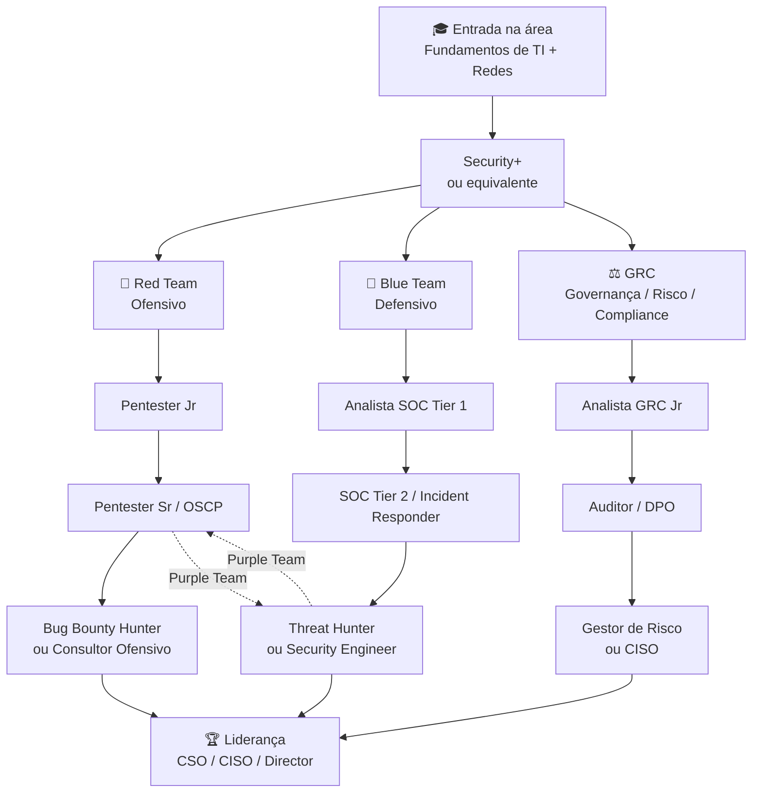

# Carreira em Cybersegurança

> [!quote] Um mercado em expansão
> *A área de cybersegurança está em constante crescimento, com demanda alta por profissionais qualificados e salários competitivos.*

---

## 🗺️ Mapa da Área

> [!info] Visão Geral
> A cybersegurança é um campo amplo com diversas especializações. Entenda onde cada profissional se encaixa.

![[Recursos/Segurança da informação/Carreira em Cybersegurança/carreira-em-cyberseguranca.png|Times de Segurança]]

![[Recursos/Segurança da informação/Carreira em Cybersegurança/carreira-em-cyberseguranca-1.png|Red Team vs Blue Team]]

---

## 🔴 Red Team vs 🔵 Blue Team

> [!tip] Entenda as Diferenças
> Na segurança, existem dois "lados" principais: quem ataca (para testar) e quem defende.

### 🔴 Red Team (Ofensivo)
- Realiza testes de intrusão (pentest)
- Simula ataques reais
- Encontra vulnerabilidades antes dos criminosos
- **Profissões:** Pentester, Ethical Hacker, Bug Bounty Hunter

### 🔵 Blue Team (Defensivo)
- Monitora sistemas e redes
- Responde a incidentes de segurança
- Implementa controles de proteção
- **Profissões:** Analista SOC, Incident Responder, Security Engineer

### 🟣 Purple Team
- Combina habilidades ofensivas e defensivas
- Melhora a comunicação entre Red e Blue
- Otimiza a postura de segurança da organização

---

## 🎯 Tarefa Prática

> [!warning] Atividade Obrigatória
> Complete a sala abaixo na plataforma TryHackMe para entender melhor os fundamentos do Red Team.

[🔗 TryHackMe | Red Team Fundamentals](https://tryhackme.com/room/redteamfundamentals)

---

## 📈 Próximos Passos

> [!success] Como Começar
> Para iniciar na área de cybersegurança, recomendamos:

1. **Fundamentos de TI:** Redes, sistemas operacionais, programação básica
2. **Certificações iniciais:** [[Certificações|CompTIA Security+, CEH]]
3. **Prática em labs:** [[Tópicos/Segurança da informação/Cursos online|TryHackMe, HackTheBox, VulnHub]]
4. **Networking:** Participe de [[Eventos|eventos e comunidades]]
5. **Bug Bounty:** Comece a buscar vulnerabilidades em programas reais

---

## 📊 Mercado em Números (2025-2026)

> [!warning] Oportunidade Real
> O Brasil enfrenta um déficit estimado de **140 mil profissionais** de cibersegurança (IDC/CIESP). No mundo, são mais de **4,7 milhões de vagas sem preenchimento** (ISC2 Workforce Study 2024). Isso significa que quem se qualifica hoje entra num mercado com muito mais demanda do que oferta.

### 💼 Tabela de Cargos, Salários e Perfil (Brasil, 2025-2026)

| Cargo | Nível | Faixa Salarial (R\$/mês) | Foco Principal |
|-------|-------|-------------------------|----------------|
| Analista SOC Jr | Júnior | R\$ 2.500 a R\$ 4.500 | Monitoramento e triagem de alertas |
| Analista SOC Pl/Sr | Pleno/Sênior | R\$ 6.000 a R\$ 12.000 | Investigação e resposta a incidentes |
| Pentester Jr | Júnior | R\$ 4.000 a R\$ 7.000 | Testes de intrusão guiados |
| Pentester Pl/Sr | Pleno/Sênior | R\$ 13.400 a R\$ 18.400 | Testes avançados e relatórios executivos |
| Analista GRC Jr | Júnior | R\$ 3.300 a R\$ 6.000 | Apoio à conformidade e auditorias |
| Analista GRC Sr | Sênior | R\$ 8.600 a R\$ 15.000 | Gestão de risco corporativo e compliance |
| Security Engineer | Sênior | R\$ 12.000 a R\$ 24.600 | Arquitetura e implementação de controles |
| CISO / CSO | Executivo | R\$ 30.000 a R\$ 52.500 | Liderança estratégica de segurança |

> Fonte: Glassdoor Brasil, Robert Half Guia Salarial 2025, IT Forum 2026, BoletimSec.

---

## 🗺️ Trilhas de Carreira

> [!info] Três grandes caminhos
> A carreira em cibersegurança não é linear. Veja as principais trilhas e como elas se conectam.

> [!tip] Purple Team na prática
> Profissionais Purple Team conhecem tanto ataque quanto defesa. São os mais valorizados em empresas maduras em segurança.

---

## 🏅 Certificações Mais Valorizadas (2025)

> [!info] Invista na certificação certa para o seu momento de carreira

| Certificação | Nível | Trilha | Custo aproximado | Destaque |
|---|---|---|---|---|
| CompTIA Security+ | Iniciante | Geral | US\$ 425 | Porta de entrada reconhecida globalmente |
| CEH v13 | Intermediário | Red Team | US\$ 950 a US\$ 1.899 | Inclui módulo de IA em 2025 |
| OSCP | Avançado | Red Team | US\$ 1.499 | Mais respeitada para pentesting prático |
| CompTIA CySA+ | Intermediário | Blue Team | US\$ 392 | Análise de ameaças e SOC |
| CISM | Avançado | GRC | US\$ 575 (membro) | Ideal para gestores e auditores |
| CISSP | Sênior | Geral | US\$ 749 | "Padrão ouro"; exige 5 anos de experiência |

> A sequência recomendada para quem está começando do zero: **Security+** > trilha específica (CEH ou CySA+) > CISSP ou OSCP ao atingir nível sênior.

---

## 🔬 Áreas Emergentes com Alta Demanda (2025-2026)

> [!abstract] Novas especialidades que o mercado está buscando com urgência

- **Cloud Security:** proteção de ambientes AWS, Azure e GCP; crescimento acelerado com migração em massa para a nuvem
- **AppSec (Segurança de Aplicações):** integração de segurança no ciclo DevOps (DevSecOps); revisão de código e testes SAST/DAST
- **Threat Intelligence:** análise de ameaças emergentes; perfil de atacantes; relatórios estratégicos para tomada de decisão
- **IA e Machine Learning em Segurança:** detecção de anomalias; análise comportamental; automação de resposta a incidentes (SOAR)
- **OT/ICS Security:** proteção de sistemas industriais e infraestrutura crítica (energia, água, manufatura)

---

## 🧪 Atividades Mão na Massa

> [!example] 🧪 Atividade 1: Pesquise vagas reais e identifique as skills mais pedidas
>
> **O que fazer:**
> 1. Acesse [LinkedIn Jobs](https://www.linkedin.com/jobs/) ou [Gupy](https://portal.gupy.io/)
> 2. Pesquise por "Analista de Segurança da Informação" ou "SOC Analyst" ou "Pentester" no Brasil
> 3. Abra **3 vagas diferentes** de empresas distintas
> 4. Em cada vaga, anote: cargo, empresa, cidade/remoto, salário (se informado) e as **5 principais habilidades exigidas**
> 5. Compare as 3 listas e identifique quais habilidades aparecem em todas as vagas
>
> **Resultado observável:** uma lista de 5 a 10 habilidades que o mercado está exigindo AGORA, com frequência confirmada por fontes reais. Você vai perceber padrões como: inglês técnico, certificações, ferramentas de SIEM (Splunk, QRadar), scripting em Python e conhecimento de frameworks como MITRE ATT&CK.

---

> [!example] 🧪 Atividade 2: Consulte faixas salariais reais no Glassdoor
>
> **O que fazer:**
> 1. Acesse [Glassdoor Brasil](https://www.glassdoor.com.br/Sal%C3%A1rios/index.htm)
> 2. Pesquise separadamente cada um dos cargos a seguir: **"Analista SOC"**, **"Pentester"** e **"Analista GRC"**
> 3. Para cada cargo, anote: salário mínimo, salário médio e salário máximo reportado
> 4. Filtre por "Brasil" e compare com as faixas da tabela acima nesta aula
>
> **Resultado observável:** você vai ter números atualizados e reais, com dados de empresas brasileiras reais. Vai notar a diferença entre júnior, pleno e sênior, e entender por que investir em certificações impacta diretamente a faixa salarial.

---

> [!example] 🧪 Atividade 3: Monte seu roadmap de carreira em cibersegurança
>
> **O que fazer:**
> 1. Acesse [roadmap.sh/cyber-security](https://roadmap.sh/cyber-security)
> 2. Explore o mapa interativo de carreira em Cyber Security
> 3. Identifique em qual nível você está hoje (marque os tópicos que já conhece)
> 4. Escolha **uma trilha** (Red Team, Blue Team ou GRC) e anote os **3 próximos tópicos** que precisaria estudar para avançar nessa direção
> 5. Pesquise um recurso gratuito (curso, vídeo, documentação) para um desses 3 tópicos
>
> **Resultado observável:** um mini-plano personalizado com sua trilha escolhida, seu ponto de partida real e o próximo passo concreto de estudo, com fonte verificada.

---

## 💡 Dicas para Entrar no Mercado

> [!tip] Para quem está começando agora

- **Monte um portfólio:** documente projetos no GitHub (scripts de análise, labs do TryHackMe, write-ups de CTF)
- **Participe de CTFs (Capture The Flag):** competições onde você resolve desafios de segurança; ótimo para o currículo
- **Crie perfil no LinkedIn:** recrutadores de segurança buscam ativamente; coloque certificações e projetos
- **Siga comunidades:** Hacker News, Reddit r/netsec, grupos no Discord de CTF, grupos brasileiros de segurança no Telegram
- **Inglês técnico é obrigatório:** praticamente toda documentação, CVE, relatório e certificação está em inglês

> [!warning] Atenção ao caminho ético
> Todas as habilidades de segurança ofensiva devem ser praticadas **somente em ambientes autorizados** (seus próprios labs, plataformas como TryHackMe/HackTheBox, programas de Bug Bounty). Usar essas habilidades sem autorização é crime previsto na **Lei nº 12.737/2012 (Lei Carolina Dieckmann)** e no **Marco Civil da Internet (Lei nº 12.965/2014)**.

---

## 🌐 Setores que Mais Contratam no Brasil

> [!abstract] Onde trabalha o profissional de cibersegurança?

- **Setor financeiro:** bancos, fintechs e corretoras são os maiores empregadores; regulação rígida do Banco Central exige equipes robustas
- **Governo:** órgãos federais, estaduais e defesa; crescimento acelerado com a Estratégia Nacional de Cibersegurança (ENCiber 2024-2027)
- **Saúde:** hospitais e planos de saúde são alvos frequentes de ransomware; demanda crescente
- **Energia e infraestrutura:** proteção de sistemas de controle industrial (OT/ICS) em empresas como Petrobras e Eletrobras
- **Tecnologia:** empresas de software e SaaS precisam de AppSec e segurança de nuvem integrada ao desenvolvimento

---

> [!note] 📚 Fontes (2025-2026)
>
> - [Salários de Cibersegurança no Brasil para 2025 - BoletimSec](https://boletimsec.com/salarios-de-ciberseguranca-no-brasil/)
> - [Salário de profissionais de cibersegurança chega a R\$ 24,6 mil no Brasil - IT Forum](https://itforum.com.br/noticias/salarios-ciberseguranca-brasil-2026/)
> - [O mercado de Cibersegurança em 2025: oportunidades, desafios e salários - Acadi-TI](https://acaditi.com.br/o-mercado-de-ciberseguranca-em-2025-oportunidades-desafios-e-salarios/)
> - [Brasil terá déficit de 140 mil profissionais de cibersegurança - PUC-Campinas/CIESP](https://www.puc-campinas.edu.br/presidente-do-ciesp-diz-que-o-brasil-tera-deficit-de-profissionais-de-ciberseguranca-ate-2025/)
> - [Com salário de mais de R\$ 30 mil, área tem déficit de profissionais - IBSEC](https://ibsec.com.br/com-salario-de-mais-de-r-30-mil-area-de-seguranca-da-informacao-tem-deficit-de-profissionais/)
> - [Cybersecurity Skills Gap Statistics 2025: Record 4.8M Roles Unfilled - DeepStrike](https://deepstrike.io/blog/cybersecurity-skills-gap)
> - [2025 ISC2 Cybersecurity Workforce Study](https://www.isc2.org/Insights/2025/12/2025-ISC2-Cybersecurity-Workforce-Study)
> - [Principais certificações de cibersegurança em 2025 - Check Point](https://www.checkpoint.com/pt/cyber-hub/cyber-security/what-is-cybersecurity/top-cybersecurity-certifications-in-2025/)
> - [Glassdoor Brasil: Salários de SOC, Pentester e GRC](https://www.glassdoor.com.br/Sal%C3%A1rios/analista-soc-sal%C3%A1rio-SRCH_KO0,12.htm)
> - [Robert Half Guia Salarial 2025 - PenTester](https://sindpd.org.br/2025/02/28/profissao-ciberseguranca-salarios-ti/)
