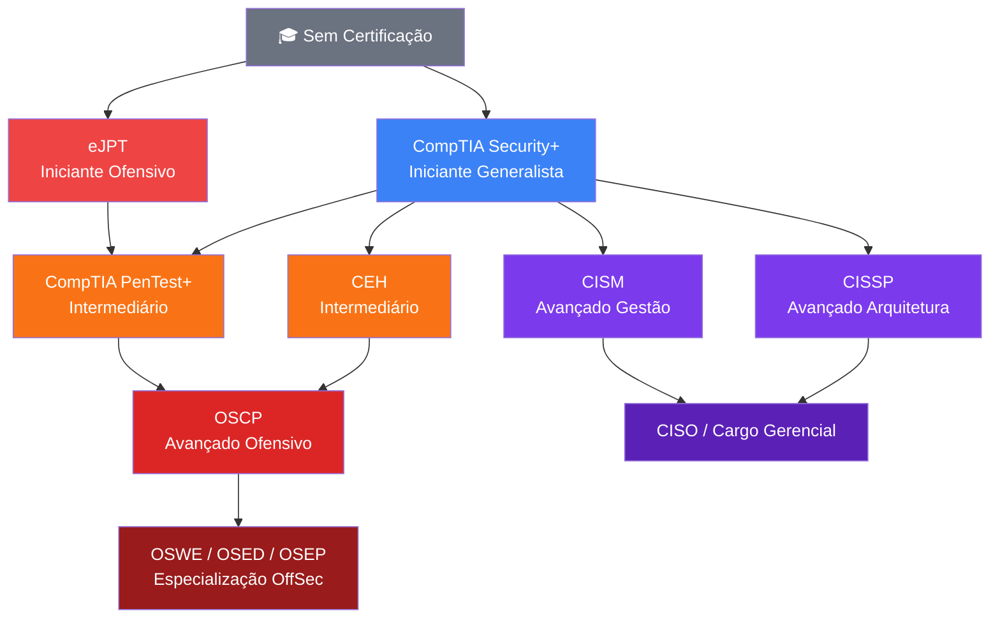

# Certificações em Segurança da Informação

> [!quote] O valor das certificações
> *Dependendo do contexto, uma certificação vale mais que um diploma. Elas comprovam conhecimento prático e são reconhecidas globalmente.*

---

## 🎯 Por que certificar-se?

> [!info] Benefícios das Certificações
> - Validação de conhecimentos técnicos
> - Diferencial competitivo no mercado
> - Requisito para muitas vagas de emprego
> - Aumento salarial comprovado
> - Networking com profissionais da área

> [!tip] 💰 Impacto salarial real (dados 2025-2026)
> Profissionais com CISSP ganham em média **40-60% a mais** que colegas sem certificação equivalente. Security+ já aumenta o salário base em até 20% no mercado norte-americano, e o efeito começa a aparecer no Brasil à medida que multinacionais exigem o credencial em processos seletivos.

---

## 🏆 Principais Certificações

### 🔴 Ofensivas (Red Team / Pentest)

> [!tip] Para quem quer atacar (eticamente)

#### OSCP: Offensive Security Certified Professional
- **Nível:** Avançado
- **Foco:** Pentest prático
- **Prova:** 24 horas de exame prático
- **Reconhecimento:** Uma das mais respeitadas do mercado
- **Pré-requisito:** Conhecimento sólido em Linux, redes e programação
- **Preço (2026):** US\$ 1.749 (inclui 90 dias de lab + 1 tentativa de exame) ou US\$ 2.749 (Learn One, 1 ano de acesso)
- **Validade:** 3 anos (renovável com CPE)
- [🔗 Site oficial OffSec](https://www.offsec.com/pricing/)

#### CEH: Certified Ethical Hacker
- **Nível:** Intermediário
- **Foco:** Metodologias de hacking ético
- **Prova:** Múltipla escolha (125 questões, 4 horas)
- **Reconhecimento:** Amplamente aceita, especialmente em empresas
- **Pré-requisito:** 2 anos de experiência em segurança ou treinamento oficial EC-Council
- **Preço (2026):** US\$ 950 a US\$ 1.199 (exame) + US\$ 850-3.499 (treinamento obrigatório)
- **Validade:** 3 anos (renovação: US\$ 80/ano de membership)
- [🔗 EC-Council CEH](https://www.eccouncil.org/train-certify/certified-ethical-hacker-ceh/)

#### eJPT: Junior Penetration Tester (INE Security)
- **Nível:** Iniciante/Intermediário
- **Foco:** Pentest hands-on para quem está começando
- **Prova:** 100% prática (laboratório virtual, 48 horas)
- **Reconhecimento:** Porta de entrada ideal antes do OSCP
- **Pré-requisito:** Nenhum formal; recomendado conhecer Linux básico e TCP/IP
- **Preço (2026):** US\$ 200 aproximadamente (incluindo curso)
- **Validade:** 3 anos
- [🔗 INE Security eJPT](https://security.ine.com/certifications/ejpt-certification/)

#### CompTIA PenTest+
- **Nível:** Intermediário
- **Foco:** Testes de penetração
- **Prova:** Múltipla escolha + baseada em desempenho
- **Preço (2026):** US\$ 381 (exame)
- **Validade:** 3 anos
- [🔗 Site oficial](https://www.comptia.org/pt/certificacoes/pentest)

---

### 🔵 Defensivas e Gerenciais

> [!info] Para quem quer defender ou gerenciar

#### CompTIA Security+
- **Nível:** Iniciante/Intermediário
- **Foco:** Fundamentos de segurança
- **Ideal para:** Primeira certificação da área
- **Reconhecimento:** Porta de entrada mais comum
- **Pré-requisito:** Nenhum formal; recomendado Network+ e 2 anos de experiência em TI
- **Preço (2026):** US\$ 425 (exame oficial CompTIA, após aumento de 5-7% em jun/2025)
- **Validade:** 3 anos (renovação: US\$ 150)
- [🔗 CompTIA Security+](https://www.comptia.org/certifications/security)

#### CISSP: Certified Information Systems Security Professional
- **Nível:** Avançado
- **Foco:** Gestão de segurança (8 domínios do CBK)
- **Requisito:** 5 anos de experiência em pelo menos 2 dos 8 domínios (1 ano dispensado com diploma universitário)
- **Reconhecimento:** "Gold standard" para gestores e arquitetos de segurança
- **Preço (2026):** US\$ 749 (exame) + US\$ 125/ano de manutenção (ISC2 membership)
- **Validade:** 3 anos (renovação via CPE)
- [🔗 ISC2 CISSP](https://www.isc2.org/certifications/cissp)

#### CISM: Certified Information Security Manager
- **Nível:** Avançado
- **Foco:** Gestão e governança de segurança
- **Ideal para:** Cargos de liderança (CISO, gerentes de TI)
- **Pré-requisito:** 5 anos de experiência em gestão de segurança
- **Preço (2026):** US\$ 575 (membros ISACA) ou US\$ 760 (não-membros)
- **Validade:** 3 anos (renovação: CPE + taxa anual ISACA)
- [🔗 ISACA CISM](https://www.isaca.org/credentialing/cism)

---

## 📊 Tabela Comparativa de Certificações (2026)

| Certificação | Nível | Foco Principal | Preço (exame) | Validade | Pré-requisito |
|---|---|---|---|---|---|
| **eJPT** | Iniciante | Pentest prático | ~US\$ 200 | 3 anos | Nenhum |
| **Security+** | Iniciante/Inter. | Fundamentos segurança | US\$ 425 | 3 anos | Recomendado Network+ |
| **PenTest+** | Intermediário | Testes de penetração | US\$ 381 | 3 anos | Recomendado Security+ |
| **CEH** | Intermediário | Hacking ético | US\$ 950-1.199 | 3 anos | 2 anos experiência |
| **CISM** | Avançado | Gestão/Governança | US\$ 575-760 | 3 anos | 5 anos experiência |
| **CISSP** | Avançado | Gestão segurança | US\$ 749 | 3 anos | 5 anos experiência |
| **OSCP** | Avançado | Pentest ofensivo | US\$ 1.749 | 3 anos | Experiência em Linux/redes |

> [!warning] ⚠️ Preços em dólar: no Brasil, adicione IOF (6,38%) e variação cambial. Em jun/2026, US\$ 1 equivale a aproximadamente R\$ 5,70, o que significa que a Security+ custa cerca de R\$ 2.400 e o OSCP pode ultrapassar R\$ 10.000.

---

## 📈 Trilha Sugerida

> [!success] Caminho de Evolução

```
Iniciante → CompTIA Security+
     ↓
Intermediário → CEH ou PenTest+
     ↓
Avançado → OSCP (técnico) ou CISSP (gestão)
     ↓
Especialização → OSWE, OSCE, GPEN, etc.
```

---

## 🗺️ Diagrama: Trilha de Certificações por Área



> [!note] 🧭 Leitura do diagrama
> - **Vermelho:** trilha ofensiva (Red Team)
> - **Azul/Laranja:** trilha generalista (Security+) como base para ambas as direções
> - **Roxo:** trilha gerencial/estratégica (Blue Team de gestão)
> Você pode começar pelo eJPT se já tem alguma base em Linux, ou pelo Security+ se está começando do zero.

---

## 🧪 Atividades Mão na Massa

> [!example] 🧪 Atividade 1: Comparar 3 Certificações nos Sites Oficiais
>
> **Sites a acessar:**
> 1. [CompTIA Security+](https://www.comptia.org/certifications/security) (em PT-BR disponível)
> 2. [OffSec OSCP](https://www.offsec.com/courses/pen-200/)
> 3. [ISC2 CISSP](https://www.isc2.org/certifications/cissp)
>
> **Tarefa:** Para cada certificação, preencha a tabela abaixo com as informações reais dos sites oficiais:
>
> | Campo | Security+ | OSCP | CISSP |
> |---|---|---|---|
> | Preço exato (US\$) | | | |
> | Preço em R\$ (câmbio do dia) | | | |
> | Pré-requisitos formais | | | |
> | Tempo de validade | | | |
> | Número de domínios/objetivos | | | |
>
> **Resultado esperado:** Tabela preenchida com dados verificados diretamente nas fontes primárias (nada de sites de terceiros). Ao final, escolha a certificação mais adequada ao seu perfil atual e justifique em 3 linhas.

---

> [!example] 🧪 Atividade 2: Criar Conta no TryHackMe e Completar 1 Room Gratuita
>
> **Site:** [https://tryhackme.com](https://tryhackme.com) (gratuito para criar conta)
>
> **Passo a passo:**
> 1. Crie sua conta gratuita em [tryhackme.com/signup](https://tryhackme.com/signup)
> 2. Acesse o caminho **"Pre-Security"** (gratuito) ou busque a room **"Introduction to Cybersecurity"**
> 3. Complete ao menos **1 task** de qualquer room gratuita disponível
> 4. Tire um print da tela mostrando o progresso (barra de conclusão ou badge conquistada)
>
> **Resultado esperado:** Print com seu nome de usuário + pelo menos 1 task concluída. O TryHackMe exibe um badge de "1%" ou similares ao concluir as primeiras tarefas. Rooms gratuitas marcadas com cadeado aberto na listagem.
>
> **Dica:** O tier gratuito inclui 1 hora/dia de AttackBox. Rooms marcadas como "Free" não exigem assinatura.

---

> [!example] 🧪 Atividade 3: Montar um Plano de Certificação com Datas
>
> **Ferramenta:** Seu calendário (Google Calendar, Outlook, Apple Calendar ou papel)
>
> **Tarefa:** Com base na Tabela Comparativa acima e no diagrama de trilha, monte um plano realista com:
> 1. **Certificação-alvo inicial** (escolha 1 que se adequa ao seu nível)
> 2. **Data de início dos estudos** (defina hoje ou na próxima semana)
> 3. **Data estimada do exame** (considere 3-6 meses de preparação para iniciante)
> 4. **Marcos intermediários** (ex.: concluir curso, fazer 2 simulados, revisar pontos fracos)
> 5. **Orçamento total estimado** em reais (exame + material de estudo)
>
> **Resultado esperado:** Um evento ou série de eventos criados no seu calendário, com alarmes configurados. Apresente o print do calendário mostrando as datas e o nome da certificação escolhida.

---

## 📚 Recursos de Estudo

> [!tip] Onde Estudar

- [[Tópicos/Segurança da informação/Cursos online|Cursos online]]: Plataformas e cursos recomendados
- [🔗 SegInfo - Guia de Certificações](https://seginfo.com.br/certificacoes-em-seguranca-da-informacao/)
- [🔗 TryHackMe (gratuito para iniciantes)](https://tryhackme.com)
- [🔗 Hack The Box Academy](https://academy.hackthebox.com) (trilhas gratuitas disponíveis)
- [🔗 INE Security (eJPT)](https://security.ine.com) (cursos gratuitos disponíveis na conta free)
- [🔗 CompTIA CertMaster Learn](https://www.comptia.org/training/certmaster-learn) (simulados oficiais)
- [🔗 ISC2 (CISSP e CC gratuito)](https://www.isc2.org/certifications/cc) (Certified in Cybersecurity: gratuito para membros)

> [!info] 🆓 Ponto de partida gratuito recomendado
> A **ISC2 oferece a certificação CC (Certified in Cybersecurity) sem custo de exame** para quem se cadastrar como membro. É uma certificação reconhecida internacionalmente e ideal para quem ainda não tem experiência. Acesse: [isc2.org/certifications/cc](https://www.isc2.org/certifications/cc)

---

## 💡 Dicas Importantes

> [!warning] Atenção

1. **Não colecione certificações:** foque em qualidade, não quantidade
2. **Pratique sempre:** certificação sem prática vale pouco
3. **Mantenha atualizado:** a maioria exige renovação
4. **Verifique requisitos:** algumas exigem experiência prévia
5. **Considere o custo-benefício:** avalie se faz sentido para sua carreira

> [!tip] 🌎 Estratégia para o mercado brasileiro
> No Brasil, as certificações mais cobradas em vagas de emprego (2025-2026) são:
> - **CompTIA Security+:** exigida por multinacionais e empresas de terceirização de TI
> - **CISSP:** requisito para cargos de CISO e arquiteto de segurança
> - **CEH:** comum em bancos, fintechs e consultorias
> Certificações OffSec (OSCP, OSWE) são valorizadas em empresas de pentest e Red Team, mas ainda são minoria nas descrições de vagas nacionais.

> [!caution] 🔄 Renovação: não ignore
> Todas as principais certificações exigem renovação a cada 3 anos via CPE (Continuing Professional Education) ou re-exame. Um profissional com certificação vencida perde o credencial e precisa retomar do zero. Agende lembretes com 6 meses de antecedência da data de expiração.

---

> [!note] 📚 Fontes (2026)
> Dados verificados em jun/2026 diretamente nos sites oficiais ou fontes especializadas:
> - [CompTIA: preço Security+ (oficial)](https://www.comptia.org/en-us/blog/how-much-does-the-comptia-security-certification-cost/)
> - [OffSec: preço OSCP (oficial)](https://www.offsec.com/pricing/)
> - [Destcert: custo CISSP detalhado](https://destcert.com/resources/how-much-cissp-certification-costs/)
> - [PassItExams: custo CEH 2026](https://passitexams.com/articles/certified-ethical-hacker-ceh-exam-cost/)
> - [Destcert: custo CISM](https://destcert.com/resources/cism-certification-cost/)
> - [Simplilearn: custo CompTIA PenTest+](https://www.simplilearn.com/comptia-certification-cost-article)
> - [HackerDNA: TryHackMe tier gratuito 2026](https://hackerdna.com/blog/tryhackme-pricing)
> - [Pasqualepillitteri.it: roadmap certificações 2026](https://pasqualepillitteri.it/en/news/2123/cybersecurity-certifications-2026-roadmap-by-level)
