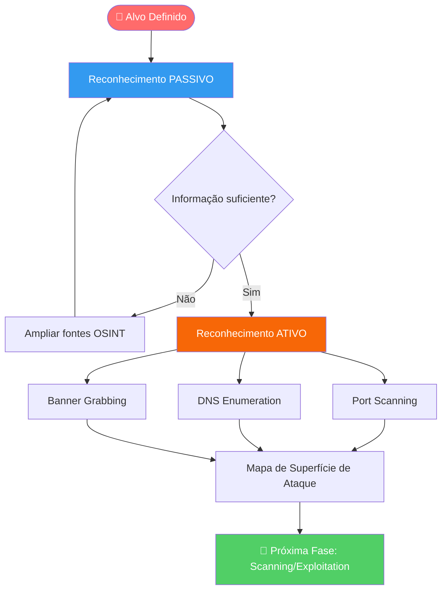
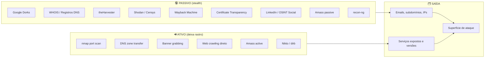
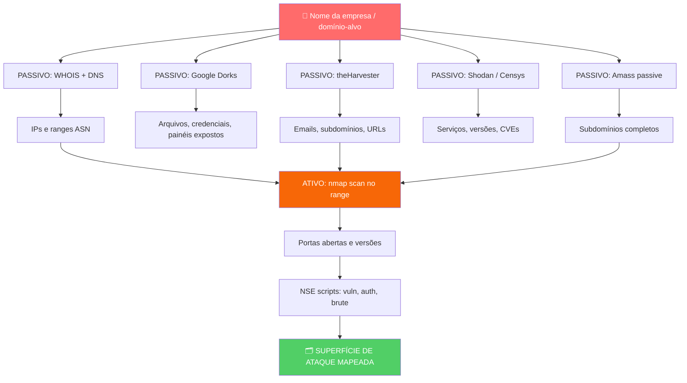

# Coleta de Informações

> [!quote] A primeira etapa
> *É a primeira etapa de um teste de intrusão ou invasão. Quanto mais informações, maior a chance de sucesso.*

> [!info] Termos Relacionados
> **Footprinting**, **Fingerprinting** e **Reconnaissance** são termos usados para descrever essa fase.

---

## 🔍 O que é Coleta de Informações?

Footprinting e Fingerprinting são a arte de coletar e utilizar informações para detectar e entender características do seu alvo.

Para facilitar, podemos dividir essas informações em **técnicas** e **não técnicas**.

---

## ⚖️ Limite Legal: Art. 154-A do Código Penal

> [!danger] Invadiu sem permissão? É crime.
> O **art. 154-A do Código Penal Brasileiro** tipifica como crime o acesso ou perturbação não autorizados a dispositivo informático, com pena de detenção de 3 meses a 1 ano e multa. O que separa o profissional de segurança do criminoso é uma única palavra: **autorização**.

Todo reconhecimento ativo (que interage com o alvo) deve ser realizado APENAS em:

- **Alvos que você possui** (seu próprio domínio, servidor, rede)
- **Alvos autorizados por escrito** (contrato de pentest, escopo assinado)
- **Ambientes de laboratório/CTF** criados para treino
- **Alvos de teste oficialmente liberados**, como `scanme.nmap.org` (autorizado pela equipe Nmap)

Reconhecimento **passivo** sobre informações públicas (WHOIS, Google, Shodan) é legal, pois você não acessa sistemas do alvo diretamente.

---

## 📋 Tipos de Informações

### 🏢 Não Técnicas (Footprinting)

> [!tip] Informações Organizacionais
> Dados sobre a empresa e pessoas que podem ser úteis para o ataque.

- Ramo da empresa
- Site e domínios
- Endereços físicos
- Funcionários e cargos
- E-mails corporativos
- Documentos encontrados no Google
- Notícias relacionadas à empresa
- Projetos e parcerias

### 💻 Técnicas (Fingerprinting)

> [!info] Informações de Infraestrutura
> Dados técnicos sobre sistemas e tecnologias utilizadas.

- Programas (serviços) e versões
- Protocolos de rede
- Sistemas operacionais e versões
- Dispositivos de hardware
- Bancos de dados
- Range de IPs
- Usuários do sistema

---

## 🗺️ Metodologia de Reconhecimento Red Team

O reconhecimento profissional segue um funil: começa amplo (internet pública), afunila para o alvo específico, e termina com uma lista de superfícies de ataque.



---

## 🔇 Reconhecimento Passivo (Passive Recon)

> [!tip] Stealth máximo: zero contato com o alvo
> No recon passivo, você consulta fontes externas e públicas. O alvo não sabe que está sendo estudado. É o ponto de partida de todo red team profissional.

O recon passivo deve SEMPRE preceder o ativo. É mais barato, mais furtivo e frequentemente revela mais do que qualquer scanner.

### Diagrama Passivo vs Ativo



---

## 🛠️ Ferramentas Passivas: Guia Ofensivo

> [!warning] Passiva vs Ativa
> A coleta **passiva** usa informações públicas sem interagir diretamente com o alvo. A **ativa** interage com o alvo e pode deixar rastros.

### 🕷️ Google Hacking (Google Dorks)

O **Google Dorking** usa operadores avançados de pesquisa para forçar o Google a revelar dados sensíveis que a organização expôs inadvertidamente.

Operadores essenciais:

| Operador | O que faz | Exemplo ofensivo |
|----------|-----------|------------------|
| `site:` | Restringe ao domínio | `site:empresa.com.br filetype:pdf` |
| `filetype:` | Filtra por extensão | `site:gov.br filetype:xls` |
| `inurl:` | Busca na URL | `inurl:admin inurl:login site:empresa.com` |
| `intitle:` | Busca no título da página | `intitle:"index of" inurl:backup` |
| `intext:` | Busca no corpo da página | `intext:"password" filetype:txt site:empresa.com` |
| `cache:` | Versão em cache do Google | `cache:empresa.com.br` |

**Dorks ofensivos clássicos (GHDB):**

```
# Painéis de administração expostos
intitle:"admin login" site:alvo.com.br

# Arquivos de configuração vazados
filetype:env "DB_PASSWORD" site:github.com

# Câmeras IP sem autenticação
intitle:"Live View / - AXIS" inurl:view/view.shtml

# Listas de senhas acidentalmente publicadas
filetype:txt "passwords" site:alvo.com.br

# Backups expostos no servidor
intitle:"index of" "backup" site:alvo.com.br

# Documentos internos públicos
site:alvo.com.br filetype:docx OR filetype:xlsx OR filetype:pptx
```

> [!note] Google Hacking Database (GHDB)
> O banco de dorks da Exploit-DB em `exploit-db.com/google-hacking-database` mantém milhares de dorks organizados por categoria. É leitura obrigatória para qualquer profissional de segurança ofensiva.

---

### 📧 theHarvester: Coleta de Emails e Subdomínios

O **theHarvester** é uma ferramenta de linha de comando especializada em coleta passiva de emails, subdomínios, IPs e URLs usando mais de 40 fontes públicas (Google, Bing, Baidu, Shodan, GitHub, entre outras).

**Instalação:**
```bash
# Kali Linux (já incluído)
theHarvester --version

# Outras distros
pip3 install theHarvester
```

**Sintaxe base:**
```bash
theHarvester -d <domínio> -b <fonte> [opções]
```

**Comandos ofensivos:**
```bash
# Coletar tudo de todas as fontes (mais completo)
theHarvester -d empresa.com.br -b all -f relatorio.json

# Focar em emails corporativos
theHarvester -d empresa.com.br -b google,bing,yahoo -l 500

# Mapear subdomínios via Shodan + DNS
theHarvester -d empresa.com.br -b shodan,dnssec

# Salvar resultados em HTML para apresentar no relatório
theHarvester -d empresa.com.br -b all -f relatorio -l 1000
```

**O que o theHarvester descobre:**
- Endereços de email corporativos (usados em phishing e senha spray)
- Subdomínios não documentados
- IPs e hostnames associados ao domínio
- Nomes de funcionários (via LinkedIn scraping)
- URLs indexadas pelos buscadores

---

### 🌐 Amass: Enumeração de Subdomínios

O **Amass** (OWASP) é o padrão da indústria para descoberta de subdomínios. Consulta logs de Certificate Transparency, bancos de DNS passivos, APIs de threat intel e dezenas de outras fontes.

**Instalação:**
```bash
# Via Go
go install -v github.com/owasp-amass/amass/v4/...@master

# Via Docker
docker run -v OUTPUT_DIR_PATH:/root/output caffix/amass enum -d alvo.com
```

**Comandos ofensivos:**
```bash
# Enumeração passiva completa (sem tocar no alvo)
amass enum -passive -d alvo.com.br -o subdomains_passivo.txt

# Enumeração com Certificate Transparency (crt.sh)
amass enum -passive -src -d alvo.com.br

# Enumeração ativa (faz consultas DNS diretas, deixa rastro)
amass enum -active -d alvo.com.br -o subdomains_ativo.txt

# Intel module: encontrar domínios relacionados via WHOIS reverso
amass intel -d alvo.com.br -whois

# Visualizar a árvore de domínios descobertos
amass viz -d3 -d alvo.com.br
```

**Por que subdomínios são ouro para um atacante:**
- `dev.empresa.com` frequentemente não tem WAF
- `old.empresa.com` pode rodar versão vulnerável
- `vpn.empresa.com` revela tecnologia de acesso remoto
- `mail.empresa.com` indica servidor de email para phishing dirigido

---

### 🔭 Shodan: O Google dos Dispositivos Conectados

O **Shodan** indexa continuamente a internet e cataloga banners de serviços, versões, certificados SSL e vulnerabilidades. É passivo por natureza: você consulta o índice do Shodan, não o alvo diretamente.

**Interface web:** `shodan.io`

**CLI do Shodan:**
```bash
# Instalar CLI
pip3 install shodan

# Inicializar com sua API key
shodan init SUA_API_KEY

# Verificar seu próprio IP (sem custo, passivo total)
shodan myip

# Pesquisar por hostname
shodan search hostname:empresa.com.br

# Ver detalhes de um IP específico
shodan host 8.8.8.8

# Contar resultados de uma query
shodan count "org:Empresa SA country:BR"

# Baixar resultados em JSON para análise offline
shodan download resultado.json.gz "org:Empresa SA country:BR port:3389"
```

**Filtros de busca Shodan mais usados em red team:**

| Filtro | Uso ofensivo |
|--------|-------------|
| `org:"Nome Empresa"` | Todos os IPs de uma organização |
| `hostname:empresa.com.br` | Ativos pelo hostname |
| `ssl.cert.subject.CN:"empresa.com.br"` | Via certificado SSL |
| `port:3389 org:"Nome"` | RDP exposto (vetor de acesso) |
| `port:22 "OpenSSH 7.2"` | Versão SSH vulnerável |
| `http.title:"phpmyadmin"` | Bancos MySQL expostos |
| `vuln:CVE-2021-44228` | Log4Shell em produção |
| `country:BR port:1433` | SQL Server no Brasil |

**Shodan para recon do próprio alvo:**
```bash
# Ver o que o Shodan sabe sobre seu IP
shodan host $(shodan myip)

# Verificar se seus serviços têm CVEs conhecidas
shodan host MEU_IP --history
```

---

### 🕵️ WHOIS e DNS Passivo

```bash
# WHOIS de domínio: dono, contatos, data de criação
whois empresa.com.br

# Registrante de IP (ARIN/LACNIC)
whois 200.200.200.200

# Consultas DNS passivas
dig empresa.com.br ANY
dig empresa.com.br MX
dig empresa.com.br NS
nslookup empresa.com.br 8.8.8.8

# Certificate Transparency: subdomínios via certificados
curl "https://crt.sh/?q=%.empresa.com.br&output=json" | jq '.[].name_value' | sort -u
```

---

### 🕰️ Wayback Machine e Cache

Sistemas antigos, páginas removidas e arquivos esquecidos frequentemente estão indexados no Wayback Machine:

```bash
# Consultar histórico de uma URL
curl "https://web.archive.org/cdx/search/cdx?url=empresa.com.br/*&output=text&fl=original&collapse=urlkey"

# Diretamente no browser:
# https://web.archive.org/web/*/empresa.com.br
```

O que procurar:
- Versões antigas com vulnerabilidades conhecidas
- Arquivos removidos que ainda estão em cache (credenciais, backups)
- Subdomínios que aparecem em versões antigas mas não no DNS atual

---

### 🔗 recon-ng: Framework OSINT Modular

O **recon-ng** é um framework modular (estilo Metasploit) para OSINT automatizado. Cada módulo é especializado em uma fonte: LinkedIn, Shodan, GitHub, WHOIS, etc.

```bash
# Iniciar o recon-ng
recon-ng

# Criar workspace dedicado ao alvo
[recon-ng]> workspaces create empresa_alvo

# Explorar módulos disponíveis
[recon-ng][empresa_alvo]> marketplace search

# Instalar módulo de coleta de subdomínios
[recon-ng][empresa_alvo]> marketplace install recon/domains-hosts/google_site_web

# Carregar o módulo
[recon-ng][empresa_alvo]> modules load recon/domains-hosts/google_site_web

# Configurar o alvo
[recon-ng][empresa_alvo][google_site_web]> options set SOURCE empresa.com.br

# Executar
[recon-ng][empresa_alvo][google_site_web]> run

# Ver resultados acumulados no banco de dados
[recon-ng][empresa_alvo]> show hosts
[recon-ng][empresa_alvo]> show contacts
[recon-ng][empresa_alvo]> show credentials

# Gerar relatório HTML
[recon-ng][empresa_alvo]> modules load reporting/html
[recon-ng][empresa_alvo][html]> options set FILENAME /tmp/relatorio.html
[recon-ng][empresa_alvo][html]> run
```

O poder do recon-ng está na **encadeamento de módulos**: o resultado de um (ex.: subdomínios) vira input do próximo (ex.: geolocalização de IP), construindo progressivamente um perfil completo do alvo.

---

## 🔊 Reconhecimento Ativo (Active Recon)

> [!warning] Atenção: rastro garantido
> No recon ativo você **interage diretamente** com o alvo. Logs de firewall, IDS e SIEM registrarão sua origem. Use APENAS em alvos autorizados. Antes de iniciar, estude [[Anonimato e privacidade]].

![[Recursos/Segurança da informação/Coleta de informações/coleta-de-informacoes.png|Recapitulação de conceitos de rede]]

### 🗺️ Nmap: Port Scanning e Service Fingerprinting

O **nmap** é o scanner de rede mais usado no mundo. Mapeia portas abertas, identifica serviços e versões, e executa scripts NSE para enumeração aprofundada.

**Tipos de scan por sigilo (do mais furtivo ao mais barulhento):**


**Comandos essenciais:**
```bash
# Descoberta de hosts (ICMP ping sweep)
nmap -sn 192.168.1.0/24

# TCP SYN scan (mais furtivo, requer root)
nmap -sS scanme.nmap.org

# TCP connect scan (sem root, mais visível)
nmap -sT scanme.nmap.org

# Detecção de serviços e versões
nmap -sV scanme.nmap.org

# Detecção de SO
nmap -O scanme.nmap.org

# Scan completo ofensivo (TOP 1000 portas + versões + scripts + OS)
nmap -sV -sC -O -T4 scanme.nmap.org

# Scan de todas as 65535 portas (demorado mas completo)
nmap -p- -T4 scanme.nmap.org

# Scans stealth (tentam escapar de firewalls)
nmap -sF scanme.nmap.org   # FIN scan
nmap -sN scanme.nmap.org   # NULL scan
nmap -sX scanme.nmap.org   # Xmas scan

# Salvar resultado em todos os formatos
nmap -sV -oA resultado_scan scanme.nmap.org
# Gera: resultado_scan.nmap, resultado_scan.xml, resultado_scan.gnmap
```

**Scripts NSE (Nmap Scripting Engine):**
```bash
# Scripts de segurança padrão
nmap -sC scanme.nmap.org

# Detectar vulnerabilidades conhecidas
nmap --script vuln scanme.nmap.org

# Enumeração de DNS
nmap --script dns-zone-transfer -p 53 ns1.empresa.com.br

# Banner grabbing de HTTP
nmap --script http-title,http-headers -p 80,443 scanme.nmap.org

# SMB: compartilhamentos e usuários
nmap --script smb-enum-shares,smb-enum-users -p 445 192.168.1.1
```

---

### 🌍 DNS Enumeration

```bash
# Tentativa de zone transfer (vazamento de todos os registros DNS)
dig axfr empresa.com.br @ns1.empresa.com.br

# Bruteforce de subdomínios via nmap NSE
nmap --script dns-brute empresa.com.br

# Busca reversa (IP para hostname)
dig -x 200.200.200.200

# Enumeração de registros específicos
dig empresa.com.br TXT   # SPF, DKIM, DMARC
dig empresa.com.br MX    # Servidores de email
dig empresa.com.br SOA   # Servidor autoritativo
```

---

### 📂 Buscas Manuais em Aplicações Web

> [!info] Content Discovery
> Existem várias formas de obter informações sensíveis em um webserver. E isso pode levar a novas vulnerabilidades.

**Arquivos comuns a verificar:**
- `/robots.txt`: Diretórios "escondidos"
- `/sitemap.xml`: Estrutura do site
- `/.git/`: Repositório exposto
- `/backup/`: Arquivos de backup
- `/admin/`: Painéis administrativos

---

## 📊 Tabela Comparativa de Ferramentas

| Ferramenta | Tipo | Foco Principal | Nível | Instalação |
|------------|------|----------------|-------|------------|
| **theHarvester** | Passivo | Emails, subdomínios, IPs | Iniciante | `pip3 install theHarvester` |
| **Amass** | Passivo/Ativo | Subdomínios, superfície de ataque | Intermediário | `go install` / Docker |
| **Shodan** | Passivo | Dispositivos, serviços, CVEs | Iniciante | Web / `pip3 install shodan` |
| **Censys** | Passivo | Certificados, hosts, protocolos | Iniciante | Web / API |
| **recon-ng** | Passivo | OSINT modular, relatórios | Intermediário | `pip3 install recon-ng` |
| **Maltego** | Passivo | Grafos de relacionamento OSINT | Avançado | GUI (Community grátis) |
| **nmap** | Ativo | Portas, serviços, OS, scripts NSE | Iniciante/Avançado | `apt install nmap` |
| **Google Dorks** | Passivo | Dados expostos indexados | Iniciante | Nenhuma (browser) |
| **Wayback Machine** | Passivo | Histórico de sites | Iniciante | Web (archive.org) |
| **WHOIS/dig** | Passivo | Registro de domínios, DNS | Iniciante | Nativo no Linux |
| **crt.sh** | Passivo | Certificate Transparency | Iniciante | Web / curl + jq |
| **SpiderFoot** | Passivo/Ativo | OSINT automatizado completo | Intermediário | `pip3 install spiderfoot` |

---

## 🧪 Atividades Práticas

> [!example] 🧪 Atividade 1: Recon Passivo + Ativo em scanme.nmap.org
>
> **Objetivo:** executar pipeline completo de recon em alvo 100% autorizado.
>
> **Alvo oficial (Nmap autoriza explicitamente):** `scanme.nmap.org`
>
> **Parte A: Coleta Passiva**
> ```bash
> # 1. WHOIS do domínio
> whois scanme.nmap.org
>
> # 2. Registros DNS
> dig scanme.nmap.org ANY
> dig scanme.nmap.org MX
>
> # 3. theHarvester (emails, subdomínios)
> theHarvester -d nmap.org -b google,bing -l 100
>
> # 4. Subdomínios via Certificate Transparency
> curl "https://crt.sh/?q=%.nmap.org&output=json" | jq '.[].name_value' | sort -u
> ```
>
> **Parte B: Scan Ativo**
> ```bash
> # 5. Port scan + detecção de serviços
> nmap -sV -sC -T4 scanme.nmap.org
>
> # 6. Scan de todas as portas
> nmap -p- -T3 scanme.nmap.org
>
> # 7. Detecção de SO
> sudo nmap -O scanme.nmap.org
>
> # 8. Scripts de vulnerabilidade
> nmap --script vuln scanme.nmap.org
> ```
>
> **O que você deve observar e registrar:**
> - Portas abertas e os serviços rodando em cada uma
> - Versões de software identificadas (procurar CVEs no NVD)
> - Banner do servidor HTTP (revela tecnologia)
> - Diferença entre o que o DNS diz e o que o nmap encontra
>
> **Entregável:** relatório em Markdown com: IP resolvido, portas abertas, serviços/versões, 1 CVE encontrado para algum serviço (via `nmap --script vuln` ou busca manual no nvd.nist.gov).

---

> [!example] 🧪 Atividade 2: Recon OSINT do Seu Próprio Alvo
>
> **Objetivo:** mapear o que um atacante externo enxerga sobre você ou sua organização usando apenas fontes públicas.
>
> **Opções de alvo (escolha um):**
> - Seu próprio servidor/VPS/IP residencial
> - Domínio de uma organização ONDE VOCÊ TRABALHA e tem autorização
> - Um domínio de CTF (ex.: HackTheBox, TryHackMe)
>
> **Parte A: Shodan My IP**
> ```bash
> # Instalar CLI Shodan
> pip3 install shodan
> shodan init SUA_API_KEY   # cadastro grátis em shodan.io
>
> # Ver o que o Shodan sabe sobre seu IP público
> shodan myip             # descobre seu IP
> shodan host $(shodan myip)   # detalhes completos
> ```
>
> **Parte B: WHOIS + DNS do domínio**
> ```bash
> # Registrante e contatos
> whois seudominio.com.br
>
> # Servidores de DNS, MX, TXT (SPF/DKIM)
> dig seudominio.com.br ANY
> dig seudominio.com.br MX
> dig seudominio.com.br TXT
>
> # Zone transfer (raramente funciona, mas vale tentar)
> dig axfr seudominio.com.br @ns1.seudominio.com.br
> ```
>
> **Parte C: theHarvester no seu domínio**
> ```bash
> theHarvester -d seudominio.com.br -b all -f recon_proprio.html
> # Abrir recon_proprio.html no browser para ver o relatório
> ```
>
> **Parte D: Google Dorks**
> ```
> site:seudominio.com.br
> site:seudominio.com.br filetype:pdf
> site:seudominio.com.br inurl:admin
> "seudominio.com.br" intext:password
> ```
>
> **O que você deve observar e registrar:**
> - O que o Shodan sabe sobre seu IP: portas, banners, histórico
> - Emails corporativos encontrados pelo theHarvester
> - Subdomínios inesperados descobertos
> - Documentos ou arquivos sensíveis indexados pelo Google
> - Qualquer informação que te surpreendeu estar pública
>
> **Entregável:** "ficha de alvo" com: IP(s), serviços visíveis externamente, emails encontrados, subdomínios mapeados, dados WHOIS relevantes, e pelo menos 1 achado que seria útil para um atacante.

---

> [!example] 🧪 Atividade 3: Mapa Visual de Relacionamentos com recon-ng ou Maltego
>
> **Objetivo:** construir graficamente as relações entre domínio, IPs, emails e pessoas usando ferramentas de OSINT.
>
> **Opção A: recon-ng (linha de comando, gratuito)**
> ```bash
> recon-ng
> [recon-ng]> workspaces create meu_recon
>
> # Instalar e rodar módulos em cadeia
> [recon-ng][meu_recon]> marketplace install recon/domains-hosts/google_site_web
> [recon-ng][meu_recon]> modules load recon/domains-hosts/google_site_web
> [recon-ng][meu_recon][google_site_web]> options set SOURCE seudominio.com.br
> [recon-ng][meu_recon][google_site_web]> run
>
> # Adicionar módulo de geolocalização de IPs
> [recon-ng][meu_recon]> marketplace install recon/hosts-hosts/resolve
> [recon-ng][meu_recon]> modules load recon/hosts-hosts/resolve
> [recon-ng][meu_recon][resolve]> run
>
> # Ver tudo que foi coletado
> [recon-ng][meu_recon]> show hosts
> [recon-ng][meu_recon]> show contacts
>
> # Gerar relatório HTML
> [recon-ng][meu_recon]> marketplace install reporting/html
> [recon-ng][meu_recon]> modules load reporting/html
> [recon-ng][meu_recon][html]> options set FILENAME /tmp/relatorio_recon.html
> [recon-ng][meu_recon][html]> run
> ```
>
> **Opção B: Maltego Community Edition (interface gráfica)**
> 1. Baixar Maltego CE em `maltego.com` (gratuito com cadastro)
> 2. Criar novo grafo
> 3. Arrastar entidade "Domain" e inserir `seudominio.com.br`
> 4. Clicar com botão direito > "Run Transform" > "DNS from Domain"
> 5. Repetir para IPs descobertos: "IP to Domain", "IP to AS"
> 6. Expandir para emails: "Domain to Email Address"
>
> **O que registrar no relatório:**
> - Screenshot do grafo gerado (recon-ng: export HTML; Maltego: screenshot)
> - Quantos hosts, emails e IPs foram mapeados
> - Relacionamentos inesperados encontrados (ex.: mesmo IP hospedando domínios de concorrentes)

---

## 🔑 Resumo: Funil de Recon Red Team



---

> [!note] 📚 Fontes e Referências (2025-2026)
>
> **Ferramentas:**
> - [theHarvester: guia completo 2025](https://blog.cyberhawkconsultancy.org/2025/08/theharvester-complete-guide-for-osint.html)
> - [GitHub oficial: theHarvester](https://github.com/laramies/theharvester)
> - [Amass: Subdomain Enumeration Guide](https://hackviser.com/tactics/tools/amass)
> - [Subdomain Recon Playbook 2025](https://medium.com/meetcyber/subdomain-recon-playbook-2025-cc768950dd74)
> - [Shodan CLI: Complete Guide 2026](https://funofcybersecurity.blogspot.com/2026/02/shodan-cli-complete-guide-to-scanning.html)
> - [Shodan Cheat Sheet: Filters and Dorks](https://infosecone.com/blog/shodan-cheat-sheet/)
>
> **Metodologia:**
> - [OSINT and Recon Methodology: Practical Guide (Hive Security)](https://hivesecurity.gitlab.io/blog/osint-recon-methodology-security-professionals/)
> - [Red Team Toolkit: Open Source Intelligence](https://redteam.ryanheavican.com/reconnaissance/osint)
> - [Raxis: PSE Red Team Series, OSINT and Reconnaissance](https://raxis.com/blog/pse-red-team-series-osint-reconnaissance/)
>
> **Google Dorks:**
> - [Google Dorks Cheat Sheet 2026 (StationX)](https://www.stationx.net/google-dorks-cheat-sheet/)
> - [Google Hacking Database (GHDB), Exploit-DB](https://www.exploit-db.com/google-hacking-database)
> - [CybelAngel: Google Dorks Cheat Sheet 2026](https://cybelangel.com/blog/google-dorks-cheat-sheet-2026/)
>
> **Nmap:**
> - [Nmap Cheat Sheet 2026 (StationX)](https://www.stationx.net/nmap-cheat-sheet/)
> - [Nmap for Ethical Hackers: Scanning, Scripting, and Stealth](https://darkmarc.substack.com/p/nmap-for-ethical-hackers-scanning)
> - [Top 100 Nmap Commands 2025](https://squidhacker.com/2025/03/top-100-nmap-commands-every-hacker-needs-in-2025-with-bonus-tool-cheat-sheets/)
>
> **Legal:**
> - Art. 154-A do Código Penal Brasileiro
> - [What Is OSINT: Cycle, Sources, Tools and Legal Framework](https://secra.es/en/blog/what-is-osint-open-source-intelligence)

---

## 🔗 Páginas relacionadas (ferramentas e sub-tópicos)

- [[Google hacking]]
- [[website recon tools (Reconhecimento de tecnologias|Reconhecimento de tecnologias web)]]
- [[censys]]
- [[Email harvesting]]
- [[open-Source code analysis|Análise de código open-source]]
- [[social media tools|Ferramentas de redes sociais]]
- [[Information Gathering Frameworks (OSINT)|Frameworks de OSINT]]
- [[Escaneamento de IPs e portas (Port Scanning)]]
- [[DNS Enumeration (Enumeração de DNS)]]
- [[Outras enumerações (não precisa fazer)|Outras enumerações]]
- [[Ferramentas ativas de aplicações Web (não precisa|Ferramentas ativas de aplicações Web]]
