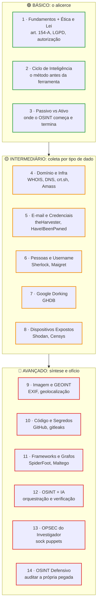
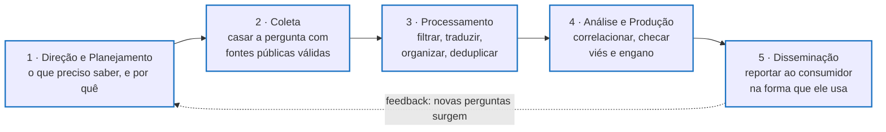
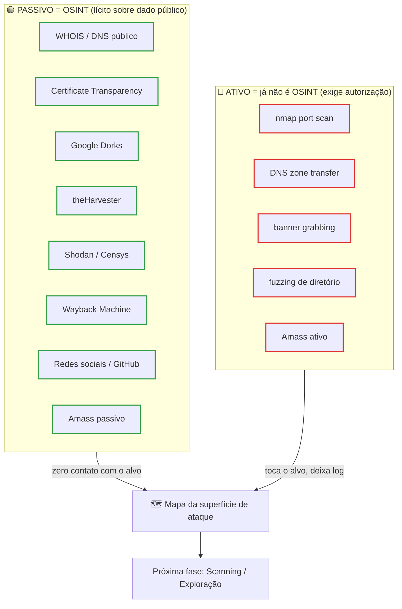
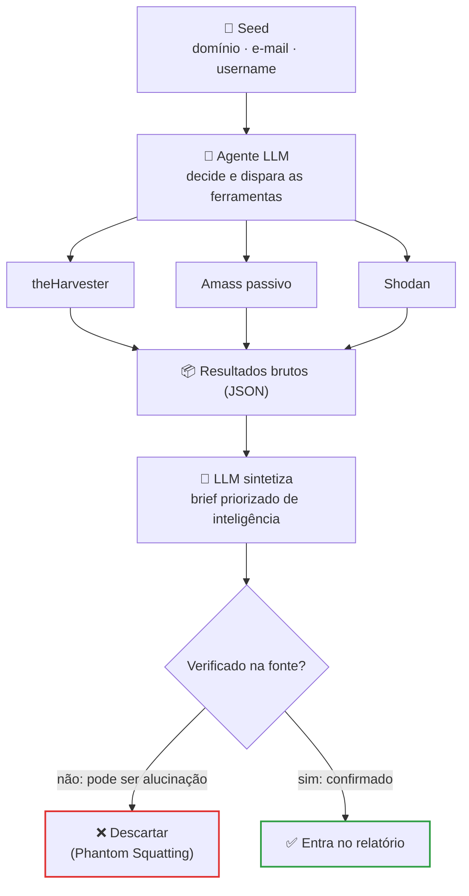
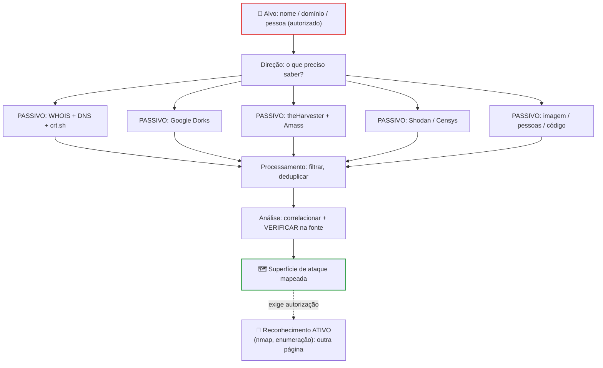

# OSINT: Coleta de Informações e Inteligência de Fontes Abertas

> [!quote] A primeira etapa de todo teste de intrusão
> *OSINT é a arte de coletar e analisar informação de fontes públicas, sem acessar sistema nenhum. Quanto mais você aprende sobre o que o alvo já expõe, mais cirúrgico e barato fica o resto do trabalho. Um recon bem feito frequentemente revela mais do que qualquer scanner.*

**OSINT** (Open Source Intelligence, ou Inteligência de Fontes Abertas) é a coleta e análise de informação a partir de fontes públicas e acessíveis, sem acesso não autorizado a sistemas. Não é uma técnica de hacker de filme: é uma disciplina usada todos os dias por times de red team, jornalistas investigativos, analistas de inteligência, recrutadores, investigadores de fraude e, do outro lado, por quem defende (Blue Team) para entender a própria superfície de exposição.

Nesta disciplina, OSINT é a **fase de reconhecimento** do teste de intrusão. Os termos **Footprinting** (mapear a pegada de uma organização ou pessoa), **Fingerprinting** (identificar tecnologias e versões) e **Reconnaissance** descrevem partes dessa mesma fase.

> [!info] Onde esta página se encaixa
> Esta é a página-mãe de reconhecimento da disciplina. A rota rápida de ponta a ponta está em [[Teste de Intrusão Express]] (o Passo 1 dele aponta pra cá). O projeto-âncora, red team ético com IA, está em [[Projeto GovSec]]. As ferramentas específicas têm páginas próprias, linkadas ao longo do texto e reunidas no fim.

---

## 🗺️ Roadmap: do básico ao avançado

Você não aprende OSINT decorando ferramentas. Aprende seguindo um método e subindo em camadas. Este é o caminho desta página, do fundamento à prática avançada:



> [!tip] Como usar este roadmap
> Se você está começando, faça na ordem. Se já tem base, use como checklist: consegue coletar por cada tipo de dado, sabe a fronteira legal, mantém OPSEC e sabe auditar a si mesmo? Cada número acima vira uma seção abaixo.

---

## ⚖️ Antes de tudo: a lei e a linha que você não cruza

Reconhecimento é a fase onde estudante confunde "informação pública" com "vale tudo". Não vale. No Brasil, duas leis definem o campo, e entender as duas é o que separa o profissional do criminoso.

### Art. 154-A do Código Penal: a fronteira é a autorização

> [!danger] Lei atualizada: o que mudou (e por que a aula antiga está desatualizada)
> O art. 154-A foi **alterado pela Lei 14.155/2021**. A versão que muita apostila ainda ensina é a de 2012, e ela mudou em dois pontos decisivos.

**Redação atual (Código Penal, com a Lei 14.155/2021), verbatim:**

> *"Invadir dispositivo informático de uso alheio, conectado ou não à rede de computadores, com o fim de obter, adulterar ou destruir dados ou informações sem autorização expressa ou tácita do usuário do dispositivo ou de instalar vulnerabilidades para obter vantagem ilícita:"*
> **Pena: reclusão, de 1 (um) a 4 (quatro) anos, e multa.**

**Redação original (Lei 12.737/2012, a "Lei Carolina Dieckmann"), para contraste:**

> *"Invadir dispositivo informático alheio (...) **mediante violação indevida de mecanismo de segurança** e com o fim de obter (...):"*
> **Pena: detenção, de 3 (três) meses a 1 (um) ano, e multa.**

| O que mudou em 2021 | Antes (2012) | Agora (2021) |
|---|---|---|
| **Precisa "burlar proteção"?** | Sim, era elemento obrigatório | **Não.** O caput deixou de exigir a "violação de mecanismo de segurança"; o elemento decisivo passou a ser acessar dispositivo alheio **sem autorização** |
| **Pena** | detenção, 3 meses a 1 ano | **reclusão, 1 a 4 anos** |

> [!warning] A lição que muda a leitura da fronteira
> O crime **não** depende mais de você ter quebrado uma senha ou firewall. O elemento decisivo hoje é **acessar dispositivo alheio sem autorização**. Isso deixa a linha passivo/ativo ainda mais limpa: ler dado já público (zero contato com o sistema do alvo) nunca é "invadir dispositivo"; tocar, sondar ou entrar num sistema de terceiro sem autorização é, independentemente de ter ou não uma proteção no caminho, e "eu só estava aprendendo" **não é defesa**.

Formas qualificadas relevantes: se a invasão obtém comunicações privadas, segredos comerciais ou controle remoto do dispositivo, a pena sobe para **reclusão de 2 a 5 anos** (§3º); há aumento de 1/3 a 2/3 se houver prejuízo econômico (§2º). Varredura ativa agressiva que derruba um serviço de terceiro pode ainda tocar o art. 266 (interrupção de serviço). O crime-âncora da nossa linha, porém, é o 154-A.

### LGPD: dado público não é dado livre

A **LGPD (Lei 13.709/2018)** governa o tratamento de dados pessoais, e "tratamento" é definido de forma amplíssima (coletar, acessar, cruzar, reproduzir). Ou seja: compilar informação pública sobre uma pessoa durante um OSINT **é tratamento** e está sujeito à lei.

> [!info] Os três parágrafos do Art. 7º que todo investigador precisa saber (verbatim)
> **§3º** (dado de acesso público tem finalidade vinculada): *"O tratamento de dados pessoais cujo acesso é público deve considerar a finalidade, a boa-fé e o interesse público que justificaram sua disponibilização."*
>
> **§4º** (dispensa de consentimento para dado que o titular tornou público): *"É dispensada a exigência do consentimento previsto no caput deste artigo para os dados tornados manifestamente públicos pelo titular, resguardados os direitos do titular e os princípios previstos nesta Lei."*
>
> **§6º** (a trava anti-brecha): *"A eventual dispensa da exigência do consentimento não desobriga os agentes de tratamento das demais obrigações previstas nesta Lei, especialmente da observância dos princípios gerais e da garantia dos direitos do titular."*

Traduzindo para a prática do investigador:

- **"Está público" não vira "posso usar para qualquer fim".** O uso tem que respeitar a finalidade e a boa-fé que justificaram o dado estar público (§3º) e continua preso aos princípios do Art. 6º, principalmente **finalidade**, **necessidade** (o mínimo necessário, dados proporcionais e não excessivos) e **não discriminação**.
- **Dado pessoal sensível (Art. 11)** tem regime mais rígido: origem racial, convicção religiosa, opinião política, saúde, vida sexual, dado genético ou biométrico. Para sensível **não existe base de "legítimo interesse"**. É o limite mais afiado contra perfilar pessoas a partir de fontes abertas.
- Em contexto **acadêmico** (uma atividade de aula), a LGPD contempla o uso para estudo por órgão de pesquisa (Art. 7º IV e Art. 11 II "c"), preferindo anonimização sempre que possível. Ainda assim: colete o mínimo, com finalidade clara, e não exponha terceiros.

### Marco Civil: por que você não pega log privado sem ordem judicial

O **Marco Civil da Internet (Lei 12.965/2014)** não é o marco de OSINT (esse é a LGPD), mas explica um limite útil: o sigilo do fluxo e das comunicações privadas é inviolável salvo por **ordem judicial** (Art. 7º II e III), e registros de conexão ou conteúdo só são entregues mediante ordem judicial (Art. 10, §§1º e 2º). Por isso OSINT lícito vive na camada **pública**: você não obtém log, mensagem privada ou dado de cadastro de provedor de terceiro sem processo.

### Onde é legal praticar

| Ambiente | Por que é seguro |
|---|---|
| **Alvos que você possui** (seu domínio, seu servidor, seu IP) | A autorização é sua para dar. Elimina o elemento "sem autorização" do 154-A |
| **`scanme.nmap.org`** | O Projeto Nmap autoriza por escrito: *"For testing purposes, you have permission to scan the host scanme.nmap.org."* Limite informal de poucos scans por dia, sem exploração e sem DoS |
| **Plataformas de treino** | TryHackMe, Hack The Box, TraceLabs, PicoCTF, RootMe. Alvo desenhado para isso |
| **Engajamento real** | Só com **termo de autorização / Rules of Engagement** assinado, escopo e janela definidos |

> [!danger] A regra de ouro
> Reconhecimento **passivo** sobre fonte pública é lícito. Qualquer interação **ativa** com um alvo de terceiro sem autorização escrita pode configurar crime. Autorização, documentada antes, é o que separa o pentester do réu.

---

## 🔄 O Ciclo de Inteligência: o método antes da ferramenta

O erro mais comum de iniciante é abrir dez ferramentas e sair coletando. Profissional segue um **ciclo**. A comunidade de inteligência formaliza isso há décadas, e a OTAN adaptou o modelo especificamente para fontes abertas.



| Etapa | O que você faz de verdade |
|---|---|
| **1. Direção e Planejamento** | Antes de tocar num buscador, articule da forma mais estreita possível o que quer saber e por quê. Sem pergunta, a coleta vira acúmulo |
| **2. Coleta** | Casar a necessidade com as fontes públicas certas. Coleta passiva primeiro (mais barata e furtiva) |
| **3. Processamento** | Separar o importante do irrelevante, o atual do datado, o confiável do não confiável. Traduzir, normalizar, deduplicar |
| **4. Análise e Produção** | Correlacionar fontes distintas, corroborar, e se proteger de viés e de desinformação plantada. Distinguir **informação** de **fato** |
| **5. Disseminação** | Entregar ao consumidor (a gestão, o Blue Team, o cliente) na forma que ele consegue usar. Um achado que ninguém lê não reduz risco |

> [!quote] O resumo mnemônico da OTAN (NATO OSINT Handbook)
> *"The open source intelligence process is about discovery, discrimination, distillation, and dissemination"* (os 4 Ds: descobrir, discriminar, destilar, disseminar).

> [!info] Por que método vence lista de ferramenta
> O próprio manual da OTAN alerta: sem um processo e automação dedicados, a produção de OSINT vira solução ad hoc e esforço bruto. A ferramenta muda todo ano; o ciclo, não. Domine o ciclo e qualquer ferramenta nova encaixa numa das cinco etapas.

---

## 🎯 Passivo vs Ativo: onde o OSINT começa e termina

Esta é a fronteira que dá sentido a tudo. **OSINT é reconhecimento passivo.** No instante em que você manda um pacote para o alvo, você saiu do OSINT e entrou em reconhecimento ativo, com o peso legal que a seção anterior descreveu.

> [!quote] A definição mais limpa (NIST SP 800-115, §4.1)
> Descoberta passiva de rede *"is done without sending out a single probing packet"* (é feita sem enviar um único pacote de sondagem). Técnicas ativas, no mesmo documento, *"send various types of network packets (...) to solicit responses from network hosts."* O critério definidor do NIST: **interação direta com o sistema** é a linha divisória.



O **MITRE ATT&CK** (tática Reconnaissance, TA0043) diz o mesmo com outra linguagem: "Active Scanning" é quando o adversário sonda a infraestrutura da vítima com tráfego, *"as opposed to other forms of reconnaissance that do not involve direct interaction"*. O padrão **PTES** resume a coleta passiva como *"we are never sending any traffic to the target"*.

> [!warning] O reconhecimento ativo saiu desta página, de propósito
> Port scanning, enumeração ativa de DNS e banner grabbing **não são OSINT** e têm páginas próprias na disciplina. Trate esta transição como a saída do território seguro para o território que exige autorização escrita:
> - [[Escaneamento de IPs e portas (Port Scanning)]]
> - [[DNS Enumeration (Enumeração de DNS)]]
> - [[Descobrindo alvos vulneráveis]]
> - Depois: [[Mapeamento de vulnerabilidades]]

---

## 🗂️ OSINT por tipo de dado

Não existe "a ferramenta de OSINT". Existe a ferramenta certa para cada tipo de dado. Organize a coleta pelo que você está atrás.

> [!success] Status das ferramentas verificado em 2026
> Toda ferramenta abaixo foi conferida como ativa e usável em 2026, com o link oficial correto. Onde algo mudou de status desde 2024, está sinalizado. Prefira sempre o repositório ou site oficial: clones com anúncio são vetor de malware e de dado envenenado.

### 🌐 Domínio e infraestrutura

O ponto de partida de quase todo engajamento. Um domínio revela IPs, subdomínios, e-mails e a organização por trás.

| Ferramenta | O que entrega | Link oficial |
|---|---|---|
| **WHOIS / dig** | Registrante, contatos, datas, servidores DNS, MX, TXT (SPF/DKIM/DMARC) | nativo no Linux |
| **Certificate Transparency (crt.sh)** | Subdomínios escondidos, via logs de certificados SSL | https://crt.sh/ |
| **Amass (OWASP)** | Enumeração de subdomínios em escala (use `-passive`) | https://github.com/owasp-amass/amass |
| **Shodan** | O que já está exposto naquele IP: portas, banners, CVEs | https://www.shodan.io/ |

```bash
# WHOIS do domínio: dono, contatos, criação
whois exemplo.com.br

# Registros DNS relevantes (SPF/DKIM ficam em TXT)
dig exemplo.com.br ANY
dig exemplo.com.br MX
dig exemplo.com.br TXT

# Certificate Transparency: subdomínios via certificados (passivo, poderoso)
curl "https://crt.sh/?q=%.exemplo.com.br&output=json" | jq '.[].name_value' | sort -u

# Amass em modo PASSIVO (sem tocar no alvo)
amass enum -passive -d exemplo.com.br -o subdominios.txt
```

> [!tip] Por que subdomínio é ouro
> `dev.empresa.com` costuma não ter WAF; `old.empresa.com` pode rodar versão vulnerável; `vpn.empresa.com` revela a tecnologia de acesso remoto. Aprofunde em [[DNS Enumeration (Enumeração de DNS)]] e [[whois]].

### 📧 E-mail e credenciais

| Ferramenta | O que entrega | Link oficial |
|---|---|---|
| **theHarvester** | E-mails, subdomínios, IPs, hosts de 40+ fontes públicas | https://github.com/laramies/theHarvester |
| **HaveIBeenPwned** | Se um e-mail apareceu em vazamento de dados | https://haveibeenpwned.com/ |
| **Hunter.io** | Padrão de e-mail corporativo (freemium, 25 buscas/mês grátis) | https://hunter.io/ |

```bash
# theHarvester: e-mails e subdomínios de várias fontes
theHarvester -d exemplo.com.br -b all -f relatorio

# Focar em e-mails corporativos
theHarvester -d exemplo.com.br -b google,bing,duckduckgo -l 500
```

> [!info] Padrão de e-mail vira lista de alvos
> Descobrir que a empresa usa `nome.sobrenome@empresa.com` mais um organograma do LinkedIn dá ao atacante uma lista de logins prováveis para phishing dirigido ou password spray. Ver [[Email harvesting]].

### 👤 Pessoas e nome de usuário

> [!danger] Aqui mora a LGPD e o risco ético
> OSINT sobre pessoas é onde estudante vira stalker sem perceber. Só faça sobre **você mesmo**, sobre **alvo autorizado**, ou em **exercício de aula com anonimização**. Nunca sobre um terceiro por curiosidade. Reveja a seção legal.

| Ferramenta | O que faz | Link oficial |
|---|---|---|
| **Sherlock** | Procura um username em 400+ sites | https://github.com/sherlock-project/sherlock |
| **Maigret** | Alternativa moderna ao Sherlock, 3000+ sites | https://github.com/soxoj/maigret |
| **WhatsMyName** | Dataset de enumeração de username (700+ sites) | https://github.com/WebBreacher/WhatsMyName |

```bash
# Sherlock: onde este username existe?
sherlock nomedeusuario

# Maigret: cobertura maior + relatório
maigret nomedeusuario --html
```

> [!warning] Cite a fonte oficial, não o clone (lição de Phantom Squatting)
> O WhatsMyName tem vários clones com anúncio (`.pro`, `.io`, `.dev`, `.net`) e **não há um `.app` oficial claro**. A âncora confiável é o repositório no GitHub. Isso é um caso concreto do risco que veremos na seção de IA: domínios que "parecem certos" mas são armadilha.

### 🖼️ Imagem e GEOINT (geolocalização)

O tipo de dado que **falta na maioria dos cursos** e que resolve investigação de verdade. Uma foto carrega metadados e pistas visuais.

| Ferramenta | O que faz | Link oficial |
|---|---|---|
| **exiftool** | Lê e remove metadados EXIF (GPS, câmera, data) | https://exiftool.org/ |
| **Google Lens** | Busca reversa de imagem | https://lens.google/ |
| **Yandex Images** | Busca reversa (forte em rostos e lugares) | https://yandex.com/images/ |
| **TinEye** | Busca reversa por correspondência exata e histórico | https://tineye.com/ |
| **SunCalc** | Posição do sol por data/hora/lugar (validar sombra em foto) | https://suncalc.org/ |
| **overpass-turbo** | Consultar features do OpenStreetMap (achar o lugar) | https://overpass-turbo.eu/ |

```bash
# Extrair metadados de uma foto (foco no GPS)
exiftool foto.jpg
# Campos críticos: GPS GPSLatitude, GPS GPSLongitude, Make, Model, CreateDate
```

> [!tip] Metodologia de geolocalização
> Quando não há GPS no EXIF, geolocaliza-se pela **imagem**: placas, idioma, arquitetura, vegetação, ângulo do sol (SunCalc) cruzados com busca reversa e OpenStreetMap. O Bellingcat mantém guias abertos de como fazer isso: https://www.bellingcat.com/category/resources/how-tos/

> [!danger] Ética de reconhecimento facial e GEOINT por IA (caso real 2026)
> Ferramentas como **PimEyes** (busca facial) e **GeoSpy AI** (geolocalização por IA) mudam a escala do que é possível. Em 2026, a PimEyes responde a processos na Europa (noyb) e nos EUA (lei BIPA de Illinois) por facilitar perseguição; a GeoSpy foi vendida a polícias (uma agência pagou cerca de US$ 85 mil) em meio a debate sobre vigilância sem mandado. Discuta em aula: só porque a IA consegue, deve? A LGPD trata rosto como **dado biométrico sensível** (Art. 11), sem base de legítimo interesse.

### 🐙 Código e segredos vazados

Repositórios públicos vazam senha, chave de API e token o tempo todo, por descuido de commit.

| Ferramenta | O que faz | Link oficial |
|---|---|---|
| **GitHub dorks / busca** | Achar segredos em código público | busca do GitHub |
| **gitleaks** | Varre repositório atrás de segredo (também na história) | https://github.com/gitleaks/gitleaks |

```bash
# Procurar segredo em um repositório (inclui o histórico completo)
gitleaks git -v --log-opts="--all" ./repo
```

Ver [[open-Source code analysis]] para análise de código-fonte aberto.

### 🔭 Dispositivos expostos e dorks

| Ferramenta | O que faz | Link oficial |
|---|---|---|
| **Shodan** | "O Google dos dispositivos": servidores, IoT, câmeras, CVEs | https://www.shodan.io/ |
| **Censys** | Certificados, hosts, protocolos (hoje enterprise, sem free self-serve) | https://search.censys.io/ |
| **GHDB (Google Hacking DB)** | Milhares de dorks prontos por categoria | https://www.exploit-db.com/google-hacking-database |
| **Wayback Machine** | Versões antigas de sites, arquivos removidos que ficaram em cache | https://web.archive.org/ |

**Operadores de Google Dorking essenciais:**

| Operador | O que faz | Exemplo |
|---|---|---|
| `site:` | Restringe ao domínio | `site:exemplo.com.br filetype:pdf` |
| `filetype:` | Filtra por extensão | `site:gov.br filetype:xls` |
| `inurl:` | Busca na URL | `inurl:admin inurl:login site:exemplo.com` |
| `intitle:` | Busca no título | `intitle:"index of" inurl:backup` |
| `intext:` | Busca no corpo | `intext:"senha" filetype:txt site:exemplo.com` |

Aprofunde em [[Google hacking]], [[shodan]] e [[censys]].

> [!note] Mudanças de status para saber em 2026
> - **recon-ng**: sem releases formais e mantenedor recuou. Trate como **legado** (ainda roda, mas não é dev ativo).
> - **Censys**: tirou a busca gratuita self-serve da home; hoje é enterprise/contato comercial.
> - **DeHashed** e bases de vazamento: uso legítimo é para auditoria autorizada; acesso amplo é pago e gated.

---

## 🛠️ Frameworks que integram tudo

Quando a coleta cresce, você troca ferramenta solta por framework que orquestra fontes e correlaciona.

| Framework | Tipo | Nota (2026) | Link |
|---|---|---|---|
| **SpiderFoot** | Automação OSINT (200+ módulos) | OSS ativo; a última *tag* é de 2022 mas há milhares de commits depois (só quirk de versão) | https://github.com/smicallef/spiderfoot |
| **Maltego CE** | Grafo de relações (link analysis) | Free com cadastro (tier Basic, 200 créditos/mês) | https://www.maltego.com/use-for-free/ |
| **recon-ng** | Framework modular (estilo Metasploit) | Legado (ver acima) | https://github.com/lanmaster53/recon-ng |
| **OSINT Framework** | Diretório de centenas de ferramentas | Mapa mental por tipo de dado; ponto de partida | https://osintframework.com |

Detalhes e transforms em [[Information Gathering Frameworks (OSINT)]] e reconhecimento de tecnologias web em [[website recon tools (Reconhecimento de tecnologias|Reconhecimento de tecnologias web)]].

> [!tip] Referências de ofício que valem mais que qualquer ferramenta
> - **Michael Bazzell, *Open Source Intelligence Techniques*** (inteltechniques.com): o livro-referência de criação de conta de pesquisa e metodologia.
> - **Bellingcat** (bellingcat.com): investigação jornalística aberta, com padrões editoriais e guias práticos.
> - **SANS SEC497 / SEC587**: currículo profissional de OSINT do básico ao avançado.

---

## 🤖 OSINT aumentado por IA (2026)

Este é o tema mais novo e o mais fácil de vender ilusão. A promessa: um agente de IA que orquestra o toolchain de recon, roda as ferramentas e escreve o relatório sozinho. A realidade em 2026 é mais interessante e mais honesta do que o marketing.

### O padrão real: LLM como orquestrador

O jeito que a coisa efetivamente funciona hoje é a IA como **camada de orquestração** sobre as ferramentas clássicas. O **MCP (Model Context Protocol)**, protocolo aberto da Anthropic, virou a cola dominante: um servidor MCP expõe as ferramentas (theHarvester, Shodan, DNS, WHOIS) e qualquer cliente de LLM as chama.



Na prática, o uso mais comum de todos é o mais simples: exportar o JSON do SpiderFoot ou do recon-ng e pedir para um LLM transformar em narrativa priorizada. É um **hábito de workflow maduro**, mesmo que ainda não exista um produto único e consagrado que faça isso ponta a ponta.

### A honestidade que separa o profissional do crédulo

> [!warning] "Agente autônomo" ainda é aspiração, não entrega
> A copy de vendedor promete pentester/investigador "end-to-end, com mínima intervenção humana". O benchmark independente **PentestEval** (arXiv, dez/2025) mede pipelines autônomos reais em **31% (PentestGPT), 6% (VulnBot), 3% (PentestAgent)** de sucesso, contra 86,5% que a própria ferramenta auto-reporta. A pergunta que todo aluno deve fazer diante de qualquer número: *"medido por quem, autônomo ou assistido por humano?"*

### Os riscos que você tem que ensinar

- **Alucinação vira infraestrutura de ataque ("Phantom Squatting").** A Unit 42 (Palo Alto, jun/2026) mostrou que LLMs inventam domínios que nunca existiram, e que atacantes **registram** os mais alucinados dias depois. Um agente que "descobre" um subdomínio pode estar descobrindo algo que não existe. Por isso a regra da caixa acima: **verificar cada achado na fonte** antes de tratar como fato. Isso não é opcional, é a etapa de Análise do ciclo de inteligência.
- **Prompt injection em dado OSINT ingerido.** Se o seu agente lê um README, uma página ou um perfil, esse conteúdo pode conter instruções escondidas que sequestram o agente. É o item nº 1 do OWASP LLM Top 10, e em 2026 até o servidor MCP oficial de Git da Anthropic teve três falhas desse tipo. O Google detectou tentativas reais na web (blog.google/security/prompt-injections-web).
- **Desinformação e deepfake.** O volume de deepfakes explodiu (estimativas de centenas de milhares para milhões entre 2023 e 2025), e a detecção segue problema de pesquisa aberto. Manipulação parcial (só a boca ou a voz num vídeo real) é o caso difícil. OSINT hoje inclui **verificar se a mídia é autêntica**.

### Como o profissional de verdade usa IA (o exemplo aterrado)

O melhor exemplo público é o **Bellingcat**: em 2026 eles construíram um modelo de machine learning (um XGBoost treinado em quase 6 mil posts verificados) para **triar e ranquear** posts do Telegram para revisão humana. Não para concluir sozinho. Compararam com LLMs e o modelo custom de triagem venceu. O consenso do estado da arte: **IA é forte em volume e velocidade** (transcrever, traduzir, ranquear dumps grandes) e **não confiável para o julgamento final**. A decisão e a ética continuam humanas.

> [!info] A conexão com o [[Projeto GovSec]]
> É exatamente aqui que o red team ético com IA da disciplina se materializa: usar a IA para acelerar a coleta e a triagem, com verificação humana obrigatória e ética por construção. A IA orquestra; você decide.

**Fontes desta seção (verificadas):** Bellingcat (uso real de ML), arXiv PentestEval `2512.14233` (benchmark honesto), Unit 42 Phantom Squatting, Google Security (prompt injection), SANS SEC587 (IA como um módulo dentro de OSINT sério).

---

## 🕵️ OPSEC do investigador: sock puppets

Coletar sem se proteger é coletar contra si mesmo. Investigar com a sua conta pessoal é o erro que queima a investigação e, pior, expõe você.

> [!quote] Definição (SANS Institute)
> Sock puppets são *"online fictitious identities used to conceal the true identity of the OSINT investigator and to gain access to information that requires an account to access"* (identidades fictícias para ocultar quem investiga e acessar o que exige conta).

A SANS coloca a pergunta que fecha o argumento: se você fosse policial, faria uma campana no seu carro pessoal? Então por que pesquisar um alvo com o seu Facebook pessoal? Dois riscos concretos:

- Plataformas como o Facebook podem **avisar o alvo** de que ele está sendo investigado, via "pessoas que você talvez conheça" (recomendação de amizade cruzando quem visitou o perfil). A investigação queima.
- Você pode **acidentalmente curtir** um post do alvo ou mandar solicitação de amizade, ligando a sua conta real a ele. Em investigação sensível, isso é risco de segurança pessoal.

> [!tip] Higiene mínima do investigador (avançado)
> Conta de pesquisa separada (o "sock puppet"), navegador ou perfil dedicado, IP protegido (ver [[Anonimato e privacidade]]), e a disciplina do Bellingcat: *"não interagir desnecessariamente com pessoas que não são alvo da investigação"* (padrões editoriais deles). Criar e manter sock puppets de forma robusta é ofício à parte; o clássico é o livro do Bazzell.

---

## 🔒 A outra lente: OSINT defensivo (audite a sua própria pegada)

Toda técnica ofensiva é uma técnica de auditoria. A melhor forma de reduzir a sua exposição é fazer OSINT **contra você mesmo** e fechar o que aparecer. É a lente Blue da disciplina aplicada ao recon, e a atividade mais segura de todas (o alvo é você).

```bash
# 1. Seu e-mail apareceu em vazamento?
#    haveibeenpwned.com (sem cadastro). Ative "Notify me" para alertas futuros.

# 2. O que o Shodan sabe sobre o seu IP público?
pip install shodan
shodan init SUA_API_KEY          # cadastro grátis em shodan.io
shodan host $(shodan myip)       # portas, banners, CVEs do seu IP, em uma linha

# 3. Suas fotos publicadas vazam GPS/câmera?
exiftool foto_publicada.jpg
exiftool -all= -overwrite_original foto.jpg   # remove TODOS os metadados antes de publicar

# 4. Google Dork em você mesmo
#    site:seudominio.com.br filetype:pdf
#    "Seu Nome" filetype:xlsx

# 5. Segredo vazado no seu GitHub?
gitleaks git -v --log-opts="--all" ./seu-repo
```

| Vetor de exposição | Mitigação |
|---|---|
| E-mail em vazamento | Trocar senha, ativar 2FA, monitorar no HIBP |
| Foto com GPS/EXIF | `exiftool -all=` antes de publicar (para PDF, combine com `qpdf`; para Office, use o Inspetor de Documento) |
| Segredo em repositório | **gitleaks** ou **git-secrets** como pre-commit + **push protection** nativo do GitHub (grátis em repo público, bloqueia antes do segredo subir) |
| Cabeçalhos HTTP revelando stack | Endurecer com CSP, HSTS, X-Content-Type-Options (OWASP Secure Headers) |
| Subdomínio órfão (takeover) | Remover o registro DNS assim que o serviço por trás é desativado |

> [!note] WHOIS no Brasil (`.br`) é diferente do genérico
> Em domínios `.br`, o registro.br **não permite ocultação total** dos dados do titular como acontece hoje em muitos gTLDs. Parte dos dados do responsável aparece na consulta pública. Antes de orientar alguém, **confirme a política atual em registro.br**, porque as regras de exibição mudam. Ferramentas de referência de hardening: OWASP Secure Headers (https://owasp.org/www-project-secure-headers/), git-secrets (https://github.com/awslabs/git-secrets) e o próprio HaveIBeenPwned.

---

## 🧪 Atividades práticas

> [!danger] Regra de escopo destas atividades
> Alvo permitido: **você mesmo**, um **domínio/servidor seu**, ou `scanme.nmap.org` (só nmap, poucos scans/dia, sem exploração). Nada de terceiros. Reveja a seção legal antes de começar.

### 🟢 Atividade 1 (básico): OSINT da sua própria pegada digital

**Objetivo:** ver o que um estranho enxerga de você usando só fonte pública, e reduzir.

**Passos:**
1. Cheque seu e-mail em https://haveibeenpwned.com e ative o "Notify me".
2. Rode `shodan host $(shodan myip)` e liste portas/serviços expostos do seu IP.
3. Pegue uma foto sua já publicada e rode `exiftool foto.jpg`. Tem GPS? Modelo de celular?
4. Faça 5 Google Dorks sobre o seu nome/domínio (`site:`, `filetype:`, aspas no nome completo).

**Entregável:** uma "ficha de exposição" com: e-mails vazados, o que o Shodan revela do seu IP, o pior metadado achado numa foto, 1 documento seu indexado que te surpreendeu, e **uma ação de correção por item**.

### 🟡 Atividade 2 (intermediário): recon passivo de alvo autorizado

**Objetivo:** montar o mapa da superfície de um alvo 100% autorizado, sem tocar nele.

**Alvo:** `scanme.nmap.org` (domínio `nmap.org`) ou um domínio seu.

**Passos:**
```bash
whois nmap.org
dig nmap.org ANY
dig nmap.org MX
theHarvester -d nmap.org -b duckduckgo,bing -l 100
curl "https://crt.sh/?q=%.nmap.org&output=json" | jq '.[].name_value' | sort -u
amass enum -passive -d nmap.org -o subs.txt
```

**Entregável:** ficha de alvo (só coleta passiva) com IPs, subdomínios, e-mails, dados de WHOIS relevantes e **1 achado que seria útil num pentest**. Marque na sua ficha onde termina o passivo e começaria o ativo (a fronteira que exigiria autorização).

### 🔴 Atividade 3 (avançado): OSINT com IA orquestradora + verificação

**Objetivo:** usar um agente de IA para acelerar a coleta e, principalmente, treinar a disciplina de **verificar cada achado na fonte**.

**Passos:**
1. Rode uma coleta passiva sobre o seu domínio (Atividade 2) e junte o resultado bruto (JSON ou texto).
2. Peça a um LLM para sintetizar um "brief de inteligência" priorizado a partir desse material.
3. **Pegue cada entidade que o LLM afirmou** (subdomínio, e-mail, IP) e confirme na fonte original (`dig`, `crt.sh`, o site). Marque cada uma como **confirmada** ou **alucinada**.
4. Escreva um parágrafo: quantas o modelo inventou? Como uma alucinação vira risco (Phantom Squatting)?

**Entregável:** o brief da IA + a tabela de verificação (achado → confirmado/alucinado → fonte) + a reflexão. **A nota está na verificação, não no brief.**

### 🔴 Atividade 4 (avançado, opcional): geolocalização de foto

**Objetivo:** geolocalizar uma foto **sua** (tirada por você, com permissão de todos que aparecem).

**Passos:** rode `exiftool` (tem GPS?); se não tiver, geolocalize pela imagem (placas, arquitetura, sombra via SunCalc, busca reversa no Yandex/Google Lens, confirmação no overpass-turbo/OpenStreetMap).

**Entregável:** as coordenadas + as pistas visuais que te levaram até elas + como você removeria esses vazamentos antes de publicar.

---

## 📊 Tabela comparativa das ferramentas

| Ferramenta | Passivo/Ativo | Foco | Nível | Instalação |
|---|---|---|---|---|
| **WHOIS / dig** | Passivo | Domínio, DNS | Iniciante | nativo |
| **crt.sh** | Passivo | Subdomínios via certificado | Iniciante | navegador / curl+jq |
| **theHarvester** | Passivo | E-mails, subdomínios | Iniciante | `pipx install theHarvester` |
| **Amass** | Passivo/Ativo | Subdomínios em escala | Intermediário | Go / `owasp-amass` |
| **Shodan** | Passivo | Dispositivos, serviços, CVEs | Iniciante | web / `pip install shodan` |
| **Sherlock / Maigret** | Passivo | Username entre plataformas | Intermediário | GitHub |
| **exiftool** | Passivo | Metadados de imagem/doc | Iniciante | `apt install libimage-exiftool-perl` |
| **Google Lens / Yandex / TinEye** | Passivo | Busca reversa de imagem | Iniciante | navegador |
| **gitleaks** | Passivo | Segredos em repositório | Intermediário | GitHub |
| **SpiderFoot** | Passivo/Ativo | OSINT automatizado | Intermediário | `pip install spiderfoot` |
| **Maltego CE** | Passivo | Grafo de relações | Avançado | desktop (free c/ cadastro) |
| **nmap** | **Ativo** | Portas, serviços (já não é OSINT) | Iniciante/Avançado | `apt install nmap` |

---

## 🔑 Resumo: o funil de OSINT



O poder do OSINT não está em nenhuma ferramenta isolada. Está em **conectar os pontos**: um domínio revela e-mails via Certificate Transparency, que levam a perfis, que expõem infraestrutura em posts públicos. Coleta passiva primeiro, sempre documentando a fonte de cada dado, e verificando antes de afirmar.

---

> [!note] 📚 Fontes e referências (verificadas em 2026)
>
> **Marco legal (planalto.gov.br, oficial):**
> - LGPD (Lei 13.709/2018): https://www.planalto.gov.br/ccivil_03/_ato2015-2018/2018/lei/l13709.htm
> - Código Penal, art. 154-A: https://www.planalto.gov.br/ccivil_03/decreto-lei/del2848compilado.htm
> - Lei 14.155/2021 (alterou o 154-A): https://www.planalto.gov.br/ccivil_03/_ato2019-2022/2021/lei/l14155.htm
> - Lei 12.737/2012 (redação original): https://www.planalto.gov.br/ccivil_03/_ato2011-2014/2012/lei/l12737.htm
> - Marco Civil (Lei 12.965/2014): https://www.planalto.gov.br/ccivil_03/_ato2011-2014/2014/lei/l12965.htm
> - Autorização do scanme: https://nmap.org/book/legal-issues.html
>
> **Metodologia e ciclo de inteligência:**
> - CIA, "The Intelligence Cycle" (mirror FAS): https://irp.fas.org/cia/product/facttell/intcycle.htm
> - NATO Open Source Intelligence Handbook v1.2: https://archive.org/details/NATOOSINTHandbookV1.2
> - NIST SP 800-115 (passivo vs ativo): https://nvlpubs.nist.gov/nistpubs/legacy/sp/nistspecialpublication800-115.pdf
> - MITRE ATT&CK, Reconnaissance (TA0043): https://attack.mitre.org/tactics/TA0043/
> - PTES, Intelligence Gathering: https://pentest-standard.readthedocs.io/en/latest/intelligence_gathering.html
>
> **Ferramentas (repositório/site oficial):**
> - theHarvester: https://github.com/laramies/theHarvester
> - OWASP Amass: https://github.com/owasp-amass/amass
> - Shodan: https://www.shodan.io/ · Censys: https://search.censys.io/
> - SpiderFoot: https://github.com/smicallef/spiderfoot · Maltego CE: https://www.maltego.com/use-for-free/
> - Sherlock: https://github.com/sherlock-project/sherlock · Maigret: https://github.com/soxoj/maigret · WhatsMyName: https://github.com/WebBreacher/WhatsMyName
> - HaveIBeenPwned: https://haveibeenpwned.com/ · Hunter.io: https://hunter.io/
> - exiftool: https://exiftool.org/ · Google Lens: https://lens.google/ · Yandex: https://yandex.com/images/ · TinEye: https://tineye.com/
> - SunCalc: https://suncalc.org/ · overpass-turbo: https://overpass-turbo.eu/
> - gitleaks: https://github.com/gitleaks/gitleaks · git-secrets: https://github.com/awslabs/git-secrets
> - OWASP Secure Headers: https://owasp.org/www-project-secure-headers/ · GHDB: https://www.exploit-db.com/google-hacking-database
> - OSINT Framework: https://osintframework.com
>
> **OSINT + IA e verificação (2026):**
> - Bellingcat, uso real de ML na triagem: https://www.bellingcat.com/resources/2026/06/25/how-to-use-ai-to-help-find-civilian-harm-conflict-report-monitor-war-machine-learning-telegram/
> - PentestEval, benchmark independente (arXiv): https://arxiv.org/abs/2512.14233
> - PentestGPT: https://github.com/greydgl/pentestgpt
> - Unit 42, "Phantom Squatting" (alucinação vira domínio): https://unit42.paloaltonetworks.com/phantom-squatting-hallucinated-web-domains/
> - Google Security, prompt injection na web: https://blog.google/security/prompt-injections-web/
> - SANS SEC587 (OSINT avançado): https://www.sans.org/cyber-security-courses/advanced-open-source-intelligence-gathering-analysis
>
> **Ofício e ética (OPSEC):**
> - SANS, "What Are Sock Puppets in OSINT": https://www.sans.org/blog/what-are-sock-puppets-in-osint
> - Bellingcat, padrões editoriais: https://www.bellingcat.com/about/editorial-standards-practices/
> - Bellingcat, guias práticos (how-tos): https://www.bellingcat.com/category/resources/how-tos/

---

## 🔗 Páginas relacionadas

- [[Teste de Intrusão Express]]: a rota rápida de ponta a ponta (recon + exploração + relatórios)
- [[Projeto GovSec]]: o projeto-âncora, red team ético com IA
- [[Google hacking]]
- [[Information Gathering Frameworks (OSINT)|Frameworks de OSINT]]
- [[website recon tools (Reconhecimento de tecnologias|Reconhecimento de tecnologias web)]]
- [[shodan]] · [[censys]] · [[whois]]
- [[Email harvesting]]
- [[social media tools|Ferramentas de redes sociais]]
- [[open-Source code analysis|Análise de código open-source]]
- [[Anonimato e privacidade]]: OPSEC e anonimização para o investigador
- Reconhecimento ATIVO (fora do OSINT): [[Escaneamento de IPs e portas (Port Scanning)]] · [[DNS Enumeration (Enumeração de DNS)]] · [[Descobrindo alvos vulneráveis]] · [[Mapeamento de vulnerabilidades]]
