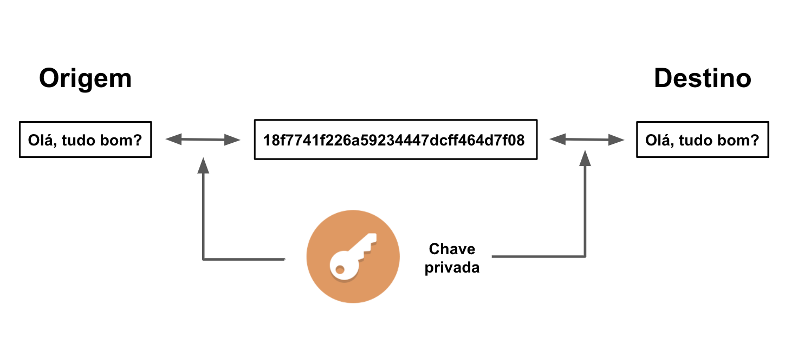
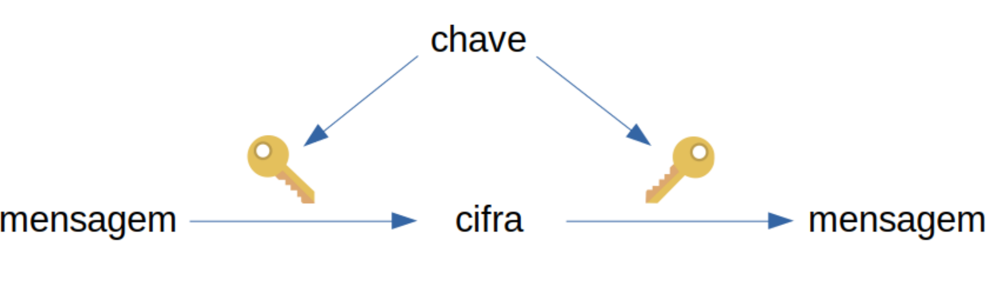
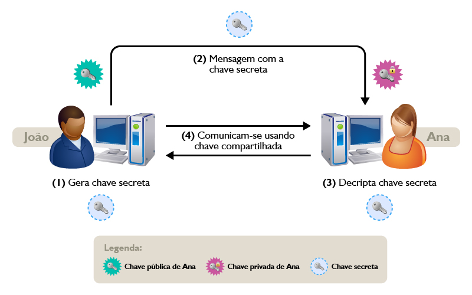
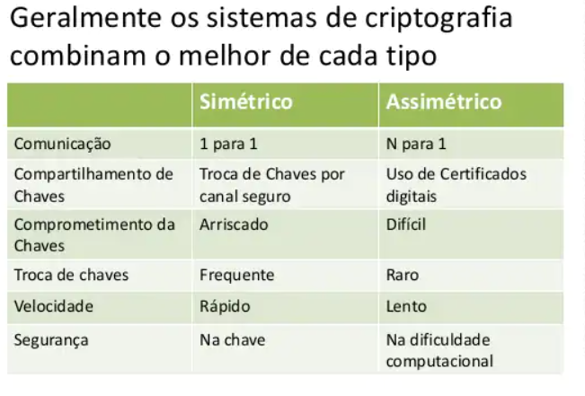
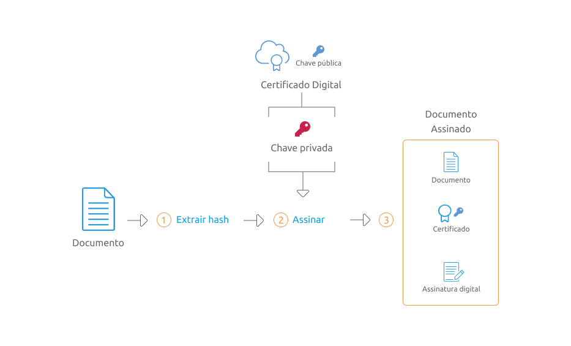
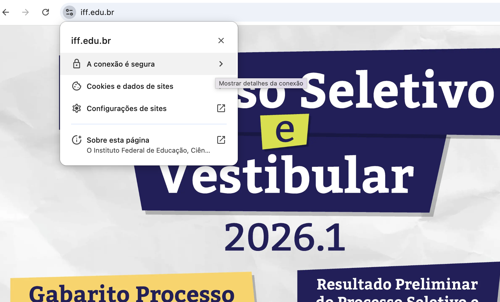

# Criptografia

# Criptografia

A criptografia é um mecanismo de segurança muito eficaz e pode ser entendido como a modificação de uma informação em outra, deixando-a ilegível para pessoas não autorizadas. 

Para obter essas transformações na mensagem, faz-se uso de algoritmos predefinidos e uma chave secreta, que codifica a mensagem em outra e depois é decodificada quando chega ao seu destino com a chave secreta.



[Criptografia | Nerdologia Tech](https://www.youtube.com/watch?v=_Eeg1LxVWa8)

# Criptografia simétrica



A criptografia simétrica é um tipo de criptografia onde só existe uma chave (uma chave secreta) que é usada em ambas as partes do processo, ou seja, tanto na **encriptação** quanto na **decriptação**.

[aes256 encrypt & decrypt online](https://encode-decode.com/aes256-encrypt-online/)

[Criptografia Simétrica - Segurança da Informação - Dicionário de Informática](https://www.youtube.com/watch?v=Yf4T91Kk1Gs)

# Criptografia assimétrica

Chave pública do wesley

-----BEGIN PUBLIC KEY-----
MIIBIjANBgkqhkiG9w0BAQEFAAOCAQ8AMIIBCgKCAQEA5WYVaFaBIkUT1ABgQ1GfRlc1Y1QXjJsM112jJDiPUur+Yfvwv2Wb/NDqZHGtmz4UoLUXhpOTNBKFQCJ68W4NCUodQoJzRpDapWb12c8lmRnBjgQhYQpWYtx9qX0NxP0/PWNwH9TEWKezxbs8SFUikXLlAmmHj2I31PUZaapjHGcmm7pyIo8IQ84zyjW7tM7KgsJmmOHN7LC+w3Lt6uOC5iCVMWlZDdunf4Ng0eE93MNg2VGX/aL8fv97PeEs1cPga9gblsx2gwhFrjaK6/3vYEV8GW/jOAlLZXOk6wKWjNVfqIdAXhfMHH3ElhuDE7MlzU5Kb5Ck18oYYvKs/2PukQIDAQAB
-----END PUBLIC KEY-----

É também chamada de criptografia de **chave pública**.

É um sistema criptográfico que utiliza um par de chaves. Uma chave é publica, a outra é privada (ou secreta)

Possui duas funções:

- Autenticação: Assegura que uma pessoa ou entidade, é qual realmente quem diz ser.
- Criptografia: Somente quem tem a chave privada pode decriptar a mensagem.

É geralmente utilizada para transferir a **chave secreta** da criptografia assimétrica.



[Online RSA Encryption, Decryption And Key Generator Tool | Devglan](https://www.devglan.com/online-tools/rsa-encryption-decryption)

[Criptografia Assimétrica - Segurança da Informação - Dicionário de Informática](https://www.youtube.com/watch?v=GeSnN8Tt04U)




# Hash, o que é e pra que serve

A função Hash (Resumo) é qualquer algoritmo que mapeie dados grandes e de tamanho variável para pequenos dados de tamanho fixo. Por esse motivo, as funções Hash são conhecidas por resumirem o dado. 

Os valores retornados por uma função hash são chamados **valores hash**, **códigos hash**, ou simplesmente **hashes**.

# Algoritmos de hash

- MD5
- SHA1
- SHA256 (mais utilizado atualmente)
- SHA384
- SHA 512
- RIPE hash MD160

# Principais aplicações

- verificar integridade de arquivos
- armazenar e transmitir senhas

[Gerador de Hash](http://andti.com.br/tool/hash)

[🔴 O que é um hash? (bitcoin / blockchain)](https://www.youtube.com/watch?v=sCWeeAPIFoQ)

# Assinatura digital

É um método de autenticação de informação digital tipicamente tratada como substituta à assinatura física, já que elimina a necessidade de ter uma versão em papel do documento que necessita ser assinado.

## Uma assinatura digital deve ter as seguintes propriedades:

- *autenticidade*: o receptor deve poder confirmar que a assinatura foi feita pelo emissor;
- *integridade*: qualquer alteração da mensagem faz com que a assinatura não corresponda mais ao documento;
- *irretratabilidade ou não-repúdio*: o emissor não pode negar a autenticidade da mensagem.

Essas características fazem a assinatura digital ser fundamentalmente diferente da assinatura manuscrita.

## funcionamento

- é gerado um hash da mensagem a ser assinada (vamos chamar de hash 1)
- o hash é criptografado com a chave privada do autor
- é enviada a mensagem e o hash 1 criptografado
- no recebimento é gerado novamente um hash da mensagem (vamos chamar de hash 2)
- o hash 1 é descriptografado com a chave pública do autor da mensagem
- se o hash 1 for igual ao hash 2 a assinatura digital é válida

[Assinatura Digital e Hash - Segurança da Informação - Informática](https://www.youtube.com/watch?v=UlRCVihN3pE)



# Certificado digital

**Certificado digital** é um documento eletrônico que contém dados sobre a pessoa física ou jurídica que o utiliza, serve como uma entidade que atesta que tal chave pública realmente pertence a uma pessoa ou empresa.

A principal função é ligar uma pessoa ou empresa a uma determinada chave pública.

O que tem nesse certificado?

- **Versão** - Número da versão X.509 do certificado.
- **Número de série** - Identificador único do certificado e representado por um inteiro. Não deve haver mais de um certificado emitido com o mesmo número de série por uma mesma AC.
- **Algoritmo de Assinatura da AC** - Identificador do algoritmo usado para assinatura do certificado pela AC.
- **Nome do Emissor** - Nome da AC que produziu e assinou o certificado.
- **Período de Validade** - Intervalo de tempo que determina até quando um certificado deve ser considerado válido
- **Nome do sujeito** - Identifica o dono do Certificado
- **Chave Pública do Sujeito** - Contém o valor da chave pública do certificado junto com informações de algoritmos com o qual a chave deve ser usada.
- **ID único do Emissor** - Campo para permitir o reuso de um emissor com o tempo.
- **ID único do Sujeito** - Campo para permitir o reuso de um sujeito com o tempo.
- **Extensões** - Campos complementares para personalizar um certificado.

*olhar certificados no navegador

[Certificado Digital - Segurança da Informação - Dicionário de Informática](https://www.youtube.com/watch?v=Tcsd9vX1_YE)

[ICP-Brasil e certificado digital](https://www.youtube.com/watch?v=sfZ78441w90)

[ICP-Brasil](https://www.gov.br/iti/pt-br/assuntos/icp-brasil)

# Verificando o certificado digital do site do IFF



---

## 1. A Aba "Geral" (A Visão do Usuário Comum)

**A. Emitido para (Quem é o dono da casa?):**

- **Nome Comum (CN):** `.iff.edu.br`.
    - O asterisco  é um "Curinga" (Wildcard). Significa que este único certificado vale para `www.iff.edu.br`, `portal.iff.edu.br`, `email.iff.edu.br`, etc. É uma forma de economizar: um certificado protege vários subdomínios.
- **O (Organização):** `INSTITUTO FEDERAL...`.
    - **O Pulo do Gato:** Note que aparece o nome oficial da instituição. Isso indica que é um certificado de validação de organização (OV). Não é um certificado "baratinho" que só checa o domínio; a autoridade certificadora verificou a documentação do IFF.

**B. Emitido por (Quem assinou o "cartório"?):**

- **Nome:** `RNP ICPEdu OV SSL CA 2019`.
    - **Conexão Prática:** Aqui entra o contexto. Quem garante a segurança do site do IFF é a **RNP** (Rede Nacional de Ensino e Pesquisa), que é a provedora de internet e serviços para as instituições federais.

**C. Período de Validade (O Prazo):**

- **Expira em:** `14 de maio de 2026`.
    - **Lição de Segurança:** Certificados nunca são eternos. Se fossem, e uma chave privada vazasse, o site ficaria vulnerável para sempre. A validade curta obriga a renovação e a atualização da segurança (criptografia).

**D. Impressões Digitais (O Hash):**

- Lá embaixo você vê códigos enormes (SHA-256).
    - **Lembra da aula anterior?** Isso é o **HASH**. Se um hacker interceptar a conexão e tentar apresentar um certificado falso, o hash não baterá com o que o navegador espera, e o cadeado ficará vermelho.

---

## 2. A Aba "Detalhes" (A Visão Técnica)

A segunda imagem mostra a **Hierarquia de Confiança** (ou Cadeia de Certificação).

Veja a "escadinha" na imagem:

1. **GlobalSign (A Raiz / O Avô):** É uma autoridade mundial, super segura, que já vem pré-instalada no Windows/MacOS/Android. O computador confia nela cegamente.
2. **RNP ICPEdu (A Intermediária / O Pai):** A GlobalSign confia na RNP e deu poder para ela emitir certificados para universidades.
3. **`.iff.edu.br` (O Final / O Filho):** A RNP usou seu poder para garantir que o IFF é legítimo.

**Moral da História:** Seu computador confia no site do IFF não porque ele conhece o IFF, mas porque ele confia na GlobalSign, que confia na RNP, que confia no IFF.

---

## 💡 Exercício Rápido para Sala ("Sherlock do Certificado")

Abram essa mesma tela no computador de vocês (clicando no cadeado do navegador ao acessar o site do IFF ou qualquer outro) e façam 3 perguntas:

1. **Verificação de Phishing:** "O nome na 'Organização' é realmente 'Instituto Federal'? Se estivesse escrito 'Empresa X Ltda', seria o site verdadeiro do IFF?"
2. **Verificação de Validade:** "O certificado ainda está válido hoje? Quantos dias faltam para vencer?"
3. **Tipo de Certificado:** "Esse certificado tem o asterisco (*)? Ele serviria para criar um site falso tipo `notas.iff.edu.br` se a chave privada fosse roubada?" (Resposta: Sim, por causa do curinga, a proteção da chave privada é ainda mais crítica aqui).

**Tomem cuidado com sites falsos!!!**

# Alguns materiais complementares de **criptografia**

[Entendendo Conceitos Básicos de CRIPTOGRAFIA | Parte 1/2](https://www.youtube.com/watch?v=CcU5Kc_FN_4)

[Entendendo Conceitos Básicos de CRIPTOGRAFIA | Parte 2/2](https://www.youtube.com/watch?v=HCHqtpipwu4)

# Tarefas práticas sobre criptografia

## Gerar hash de um arquivo

linux

```bash
sha256sum arquivo.zip
```

macos

```bash
shasum -a 256 arquivo.zip
```

windows (Power shell)

```bash
Get-FileHash arquivo.zip -Algorithm SHA256
```

Site online

```bash
https://hash-file.online/
```

## Wireshark para captura de pacotes

- Wireshark é uma ferramenta de análise de tráfego usada para inspecionar pacotes em tempo real.
- Permite visualizar conteúdos de protocolos sem criptografia, como HTTP, onde cabeçalhos e dados aparecem legíveis.
- Útil para demonstrar, na prática, como a criptografia protege dados durante a transmissão.
- Em conexões HTTPS, os pacotes aparecem cifrados, destacando o uso de criptografia assimétrica no TLS.
    - TLS (*Transport Layer Security*) é um protocolo de segurança que protege a comunicação entre cliente e servidor na internet.
    - Ele usa criptografia simétrica + criptografia assimétrica para garantir confidencialidade, integridade e autenticação.
    - É o responsável por transformar o **HTTP** em **HTTPS**, criando um canal seguro onde os dados não podem ser lidos ou alterados por terceiros.
    - É amplamente usado em sites, e-mails, aplicativos e praticamente qualquer serviço online que exige proteção de dados.

<aside>


Abrir o wireshark e comprar tráfego HTTP e HTTPS usando sites com o portal do IFF e Acadêmico

</aside>

## **Criptografando e Descriptografando com AES-256**

- Acessar o site: [https://encode-decode.com/aes256-encrypt-online/](https://encode-decode.com/aes256-encrypt-online/)
- Escrever uma mensagem simples no campo de texto (ex.: “Prova sexta-feira”).
- Definir uma palavra-chave (senha) para criptografar o texto.
- Clicar em **Encrypt** e copiar apenas o texto criptografado.
- Trocar o texto criptografado com outro colega (sem revelar a senha).
- Cada colega tenta descriptografar usando tentativas de senha até descobrir a correta. (piadas internas são bem-vindas ;D)
- Discutir como senhas fracas são quebradas facilmente e por que chaves fortes são essenciais.
- AES (*Advanced Encryption Standard*) é um algoritmo de criptografia **simétrica** amplamente usado no mundo todo.
- Utiliza **uma única chave** para criptografar e descriptografar dados.
- Opera em blocos de **128 bits**, com chaves de **128, 192 ou 256 bits** (sendo AES-256 o mais seguro).
- É rápido, eficiente e resistente a ataques conhecidos.
- É usado em HTTPS, VPNs, Wi-Fi (WPA2/WPA3), armazenamento seguro e sistemas operacionais.

# **Geração de chaves RSA e Assinatura Digital (Devglan)**

- Acessar o site: [https://www.devglan.com/online-tools/rsa-encryption-decryption](https://www.devglan.com/online-tools/rsa-encryption-decryption)
- Na seção **RSA Key Generator**, selecionar o tamanho da chave (ex.: 2048 bits).
- Clicar em **Generate Keys** e copiar/guardar a **Public Key** e a **Private Key**.
- Escolher uma frase para assinar (ex.: “Entrega do trabalho de segurança”).
- Acessar a ferramenta de **Digital Signature** (mesmo site, seção de assinatura).
- Colar a **Private Key** no campo de chave privada.
- Colar a frase no campo de mensagem.
- Clicar em **Sign** e copiar a **assinatura gerada**.
- Enviar para um colega:
    - a **frase original**
    - a **Public Key**
    - a **assinatura**
- O colega cola a **Public Key**, a **frase** e a **assinatura** na parte de **Verify Signature**.
- Clica em **Verify** e observa se a assinatura é **válida** ou **inválida**.
- Discutir rapidamente:
    - **Autenticidade:** só quem tem a chave privada consegue gerar aquela assinatura.
    - **Integridade:** qualquer alteração na mensagem invalida a assinatura.
    - **Não-repúdio:** quem assinou não pode negar que gerou aquela assinatura.

# Como assinar um arquivo no linux

## 1. Preparar as Chaves (De Texto para Arquivo)

*Comando:*

```python
nano chave_privada.pem
# (Cole o texto da chave, Ctrl+O para salvar, Ctrl+X para sair)
```

*Aplicação:* Salva a chave que você tem em texto num formato de arquivo (`.pem`) que o OpenSSL consegue ler. Faça o mesmo para a `chave_publica.pem`.

---

## 2. Assinar o Documento (Ação do Emissor)

*Comando:*

```python
openssl dgst -sha256 -sign chave_privada.pem -out assinatura.bin arquivo.pdf
```

*Aplicação:* Gera o **Hash** do PDF e o criptografa com sua **Chave Privada**, criando o arquivo de assinatura (`assinatura.bin`). Garante Autenticidade e Integridade.

---

## 3. Verificar a Assinatura (Ação do Receptor)

*Comando:*

```python
openssl dgst -sha256 -verify chave_publica.pem -signature assinatura.bin arquivo.pdf
```

*Aplicação:* O sistema gera um novo Hash do PDF e compara com o Hash descriptografado da assinatura usando a **Chave Pública**.

- **Retorno `Verified OK`**: O arquivo é original e autêntico.
- **Retorno `Verification Failure`**: O arquivo foi alterado ou a assinatura é falsa.

# o que é um arquivo.pem ?

Um arquivo **.pem** é, basicamente, um **container de texto** usado para guardar chaves criptográficas e certificados digitais.

Pense nele como um **envelope padronizado** que todo sistema operacional (Linux, macOS, Windows) e servidor web sabe abrir e ler.

Aqui está uma explicação dividida didaticamente:

## 1. O Nome (Curiosidade Histórica)

A sigla significa **Privacy Enhanced Mail** (E-mail com Privacidade Aprimorada).

- *Origem:* Foi criado originalmente para mandar e-mails seguros. O projeto de e-mail não vingou tanto, mas o **formato do arquivo** era tão bom e flexível que virou o padrão mundial para guardar chaves de segurança na internet.

## 2. A Estrutura (O que tem dentro?)

A grande vantagem do PEM é que ele é **codificado em Base64** (texto ASCII). Isso significa que, diferentemente de um arquivo binário (que se você abrir no Bloco de Notas aparecem símbolos estranhos), o PEM pode ser aberto, copiado e colado em qualquer editor de texto.

Ele tem uma estrutura de "sanduíche":

- **Cabeçalho (Header):** Diz o que tem dentro.
    - `----BEGIN PRIVATE KEY-----`
- **O Conteúdo (Body):** A chave matemática convertida em letras e números aleatórios.
- **Rodapé (Footer):** Diz onde termina.
    - `----END PRIVATE KEY-----`

## 3. A Analogia Didática

Imagine que você tem uma **Jóia** (Sua Chave Privada Matemática).

- Se você guardar a jóia solta, ela pode se perder ou quebrar (formato binário/DER).
- O arquivo **.PEM** é como uma **caixa de transporte acolchoada e etiquetada**.
    - A etiqueta diz: "Cuidado: Jóia dentro" (`----BEGIN...`).
    - A caixa protege e facilita o transporte (você pode copiar o texto e mandar por chat, e-mail, salvar em pendrive, etc).