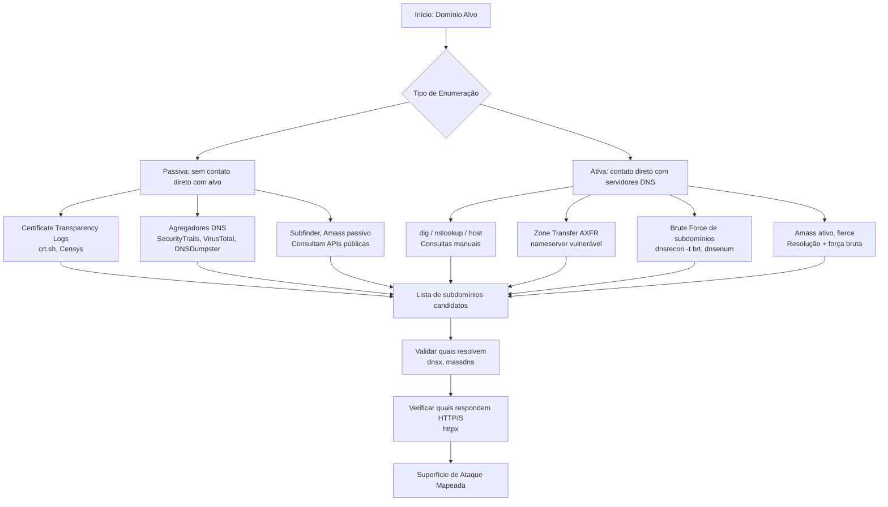
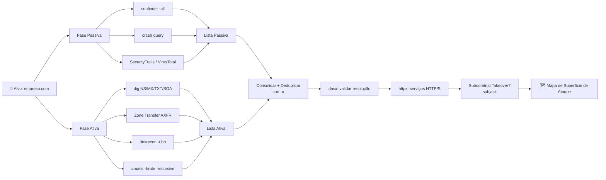

# DNS Enumeration (Enumeração de DNS)

> [!quote] Mapeando o Território
> *Enumerar DNS é descobrir os subdomínios de um determinado domínio, revelando a estrutura oculta de uma organização.*

---

## 🎯 O que é DNS Enumeration?

> [!success] Definição
> **Enumerar DNS** é o processo de descobrir todos os **subdomínios**, **registros DNS** e **servidores de nomes** associados a um domínio alvo. É uma das etapas mais importantes da fase de reconhecimento (reconnaissance) em testes de penetração, pois amplia a **superfície de ataque** visível ao profissional de segurança.

### Por que é importante?

| Objetivo | Benefício |
|----------|-----------|
| **Descobrir subdomínios** | mail.empresa.com, vpn.empresa.com, dev.empresa.com |
| **Identificar serviços** | Servidores web, e-mail, VPN expostos |
| **Mapear infraestrutura** | Entender a arquitetura da organização |
| **Encontrar alvos** | Sistemas esquecidos ou mal configurados |
| **Descobrir ambientes de desenvolvimento** | staging.empresa.com, homolog.empresa.com, test.empresa.com |
| **Identificar provedores de nuvem** | Subdomínios que apontam para AWS, Azure, GCP |

### Contexto Legal e Ético

> [!danger] Atenção: Lei 12.737/2012 (Lei Carolina Dieckmann) e art. 154-A do Código Penal
> A enumeração DNS **passiva** (consultas a bancos de dados públicos, logs de certificados) é legal, pois não envolve acesso não autorizado a sistemas.
> A enumeração **ativa** (brute force, zone transfer) em alvos **sem autorização explícita por escrito** configura crime de invasão de dispositivo informático (art. 154-A do CP), com pena de 1 a 4 anos de reclusão.
> **Regra de ouro: só enumere domínios de alvos que você possui ou para os quais você tem autorização formal e documentada.**

---

## 🗂️ Tipos de Registros DNS

> [!info] Registros Importantes para Enumeração

| Tipo | Descrição | Relevância para Pentest |
|------|-----------|------------------------|
| **A** | Endereço IPv4 do host | Mapear IPs reais dos servidores |
| **AAAA** | Endereço IPv6 | Infraestrutura IPv6 (muitas vezes sem firewall) |
| **MX** | Servidor de e-mail | Identificar provedor de e-mail, gateway de spam |
| **NS** | Servidor de nomes autoritativo | Alvos para zone transfer |
| **TXT** | Texto livre (SPF, DKIM, DMARC, verificações) | Vazar informações de políticas e terceiros |
| **CNAME** | Alias que aponta para outro domínio | Detectar subdomínio takeover |
| **SOA** | Informações de autoridade da zona | Contato do admin, serial da zona, TTLs |
| **PTR** | Reverso: IP aponta para nome | Descobrir hostnames a partir de faixas de IP |
| **SRV** | Serviços (VoIP, LDAP, Kerberos) | Identificar serviços internos expostos |
| **CAA** | Autoridade de emissão de certificados | Quais CAs podem emitir cert. para o domínio |

---

## 🔍 Metodologia: Passiva vs. Ativa



> [!tip] Estratégia 2026
> Profissionais modernos combinam as duas abordagens: **passiva primeiro** (não gera logs no alvo), depois **ativa** com cautela. A maioria dos subdomínios já está em bancos públicos por conta dos **Certificate Transparency Logs** (todo certificado TLS emitido é registrado publicamente).

---

## 🛠️ Arsenal de Ferramentas

> [!tip] Ferramentas por Categoria (2026)

### Ferramentas Nativas (Built-in)

| Ferramenta | Descrição | Disponível em |
|------------|-----------|---------------|
| **dig** | Consulta DNS avançada, suporte a AXFR | Linux/Mac/Windows |
| **nslookup** | Consulta interativa DNS | Linux/Mac/Windows |
| **host** | Consulta DNS simples e rápida | Linux/Mac |

### Ferramentas Especializadas

| Ferramenta | Descrição | Tipo |
|------------|-----------|------|
| **dnsrecon** | Enumeração completa: std, axfr, brt, srv, rvl | Ativo + Passivo |
| **dnsenum** | Enumeração automática com brute force | Ativo |
| **fierce** | Descoberta de DNS e subdomínios | Ativo |
| **subfinder** | Enumeração via fontes OSINT/passivas | Passivo |
| **amass** | Enumeração completa com ASN mapping | Ativo + Passivo |
| **massdns** | Resolução em massa de alto desempenho | Ativo |
| **dnsx** | Validação e resolução de listas | Ativo |
| **httpx** | Verifica quais subdomínios respondem HTTP | Ativo |
| **puredns** | Brute force com wildcard filtering | Ativo |
| **dnsmap** | Força bruta de subdomínios | Ativo |

### Ferramentas Online

| Ferramenta | URL | Uso |
|------------|-----|-----|
| **DNSdumpster** | [dnsdumpster.com](https://dnsdumpster.com/) | Mapa visual de DNS |
| **SecurityTrails** | [securitytrails.com](https://securitytrails.com/) | Histórico e enumeração |
| **VirusTotal** | [virustotal.com](https://www.virustotal.com/) | Subdomínios catalogados |
| **crt.sh** | [crt.sh](https://crt.sh/) | Certificate Transparency Logs |
| **Censys** | [search.censys.io](https://search.censys.io/) | Varredura de internet |
| **Shodan** | [shodan.io](https://www.shodan.io/) | Dispositivos e serviços |

---

## 💻 Passo a Passo com Comandos Reais

### Etapa 1: Reconhecimento Manual com `dig`

O `dig` (Domain Information Groper) é a ferramenta de linha de comando mais poderosa para consultas DNS manuais. Está disponível em praticamente todos os sistemas Linux e no macOS.

```bash
# Consulta básica: registro A (IPv4)
dig exemplo.com

# Consulta silenciosa, só a resposta
dig +short exemplo.com

# Consultar registro AAAA (IPv6)
dig AAAA exemplo.com

# Consultar servidores de e-mail (MX)
dig MX exemplo.com

# Consultar servidores de nomes (NS)
dig NS exemplo.com

# Consultar registros TXT (SPF, DKIM, verificações de domínio)
dig TXT exemplo.com

# Consultar Start of Authority (SOA): info do admin da zona
dig SOA exemplo.com

# Consultar registro CNAME
dig CNAME www.exemplo.com

# Consultar SRV (serviços como LDAP, Kerberos, SIP)
dig SRV _ldap._tcp.exemplo.com

# Consultar PTR: reverso de um IP (quem é o dono?)
dig -x 8.8.8.8

# Usar servidor DNS específico (não o padrão do sistema)
dig @8.8.8.8 exemplo.com

# Tentar zone transfer (AXFR) a partir do nameserver
dig axfr @ns1.exemplo.com exemplo.com

# Exibir todos os registros de uma vez (ANY pode ser bloqueado)
dig ANY exemplo.com +noall +answer
```

> [!example] 🧪 Atividade 1: Inspecionar registros DNS de um domínio público
> **Objetivo:** aprender a ler e interpretar registros DNS reais.
>
> Execute os comandos abaixo e anote o que cada resposta revela:
>
> ```bash
> # 1. Descubra o IP do google.com
> dig +short google.com
>
> # 2. Veja os servidores de e-mail do google.com
> dig +short MX google.com
>
> # 3. Descubra os servidores de nomes do iff.edu.br
> dig +short NS iff.edu.br
>
> # 4. Leia o SPF (política de e-mail) do iff.edu.br
> dig +short TXT iff.edu.br
>
> # 5. Veja o SOA do iff.edu.br (nome do admin, serial da zona)
> dig SOA iff.edu.br
> ```
>
> **Resultado esperado:**
> - Registro A mostrará um ou mais IPs (balanceamento de carga)
> - MX mostrará servidores de e-mail com prioridade (menor número = maior prioridade)
> - TXT poderá revelar serviços de terceiros usados pela organização (Google Workspace, Office 365, etc.)
> - SOA mostrará o e-mail do responsável técnico pelo domínio

---

### Etapa 2: Enumeração Completa com `dnsrecon`

O `dnsrecon` é uma ferramenta Python pré-instalada no Kali Linux que automatiza múltiplos tipos de enumeração DNS em um único comando.

```bash
# Enumeração padrão (registros NS, MX, SOA, A, AAAA, PTR, SRV, TXT, AXFR)
dnsrecon -d exemplo.com

# Tentar zone transfer especificamente
dnsrecon -d zonetransfer.me -t axfr

# Brute force de subdomínios com wordlist padrão do Kali
dnsrecon -d exemplo.com -t brt -D /usr/share/dnsrecon/namelist.txt

# Brute force com wordlist personalizada
dnsrecon -d exemplo.com -t brt -D /usr/share/wordlists/subdomains-top1million-5000.txt

# Lookup reverso em faixa de IPs (descobrir hostnames a partir dos IPs)
dnsrecon -r 192.168.1.0/24

# Salvar resultado em JSON para análise posterior
dnsrecon -d exemplo.com -j resultado.json

# Enumeração de registros SRV (serviços)
dnsrecon -d exemplo.com -t srv

# Combinando: padrão + brute force + salvar CSV
dnsrecon -d exemplo.com -t std,brt -D /usr/share/wordlists/subdomains-top1million-5000.txt --csv resultado.csv
```

---

### Etapa 3: Enumeração Automática com `dnsenum`

O `dnsenum` combina consultas DNS normais, tentativa de zone transfer e brute force de subdomínios em uma única execução.

```bash
# Enumeração completa básica
dnsenum exemplo.com

# Com wordlist para brute force de subdomínios
dnsenum --enum -f /usr/share/wordlists/subdomains-top1million-5000.txt exemplo.com

# Especificar servidor DNS alvo
dnsenum --dnsserver 8.8.8.8 exemplo.com

# Salvar resultado em XML
dnsenum --enum -f /usr/share/wordlists/subdomains-top1million-5000.txt -o resultado.xml exemplo.com

# Limitar threads para evitar detecção
dnsenum --threads 5 exemplo.com
```

---

### Etapa 4: Descoberta Passiva com `subfinder`

O `subfinder` (ProjectDiscovery) consulta dezenas de fontes públicas (VirusTotal, Shodan, SecurityTrails, Certificate Transparency Logs, etc.) sem enviar nenhuma consulta direta ao alvo.

```bash
# Instalar (se não estiver instalado)
go install -v github.com/projectdiscovery/subfinder/v2/cmd/subfinder@latest

# Enumeração básica passiva
subfinder -d exemplo.com

# Usar todas as fontes disponíveis (requer API keys configuradas)
subfinder -d exemplo.com -all

# Salvar resultado em arquivo
subfinder -d exemplo.com -o subdomains.txt

# Modo silencioso (só os subdomínios, sem banner)
subfinder -d exemplo.com -silent -o subdomains.txt

# Enumerar múltiplos domínios de uma vez
subfinder -dL lista-de-dominios.txt -o todos-subdomains.txt

# Configurar API keys para aumentar cobertura
# Editar ~/.config/subfinder/provider-config.yaml
# Adicionar chaves de SecurityTrails, Shodan, VirusTotal, Censys, etc.
```

---

### Etapa 5: Enumeração Avançada com `amass`

O `amass` (OWASP) é a ferramenta mais completa para enumeração de subdomínios, combinando fontes passivas com técnicas ativas e mapeamento de ASN (Autonomous System Number).

```bash
# Instalar
go install -v github.com/owasp-amass/amass/v4/...@master

# Modo passivo (só fontes OSINT, sem contato com o alvo)
amass enum -passive -d exemplo.com -o amass-passive.txt

# Modo ativo (inclui resolução DNS, brute force)
amass enum -active -d exemplo.com -o amass-active.txt

# Ativo com brute force
amass enum -active -d exemplo.com -brute -o amass-brute.txt

# Ativo com brute force recursivo (descobre sub-subdomínios)
amass enum -active -d exemplo.com -brute -recursive -o amass-recursive.txt

# Brute force com wordlist personalizada
amass enum -active -d exemplo.com -brute -w /usr/share/wordlists/subdomains-top1million-5000.txt -o amass-custom.txt

# Descoberta por ASN (todos os domínios da mesma organização)
amass intel -asn 28573 -whois -o asn-resultado.txt

# Visualizar grafo de relacionamentos
amass viz -d exemplo.com -o grafo.html

# Salvar banco de dados para sessões futuras
amass enum -d exemplo.com -dir ./db_exemplo
```

---

### Etapa 6: Zone Transfer (AXFR) com `dig` e `dnsrecon`

A **transferência de zona** é o mecanismo legítimo pelo qual servidores DNS secundários copiam toda a zona de um servidor primário. Quando mal configurado, qualquer cliente pode solicitar uma cópia completa de todos os registros da zona DNS, revelando toda a infraestrutura de uma vez.

```bash
# Passo 1: descobrir os nameservers do domínio
dig +short NS zonetransfer.me

# Resultado esperado:
# nsztm1.digi.ninja.
# nsztm2.digi.ninja.

# Passo 2: tentar zone transfer em cada nameserver
dig axfr zonetransfer.me @nsztm1.digi.ninja
dig axfr zonetransfer.me @nsztm2.digi.ninja

# Verificar se um domínio qualquer está vulnerável
dig axfr @ns1.exemplo.com exemplo.com
# Se retornar "Transfer failed" -> protegido
# Se retornar lista de registros -> VULNERÁVEL

# Usando dnsrecon (automatiza a tentativa em todos os nameservers)
dnsrecon -d zonetransfer.me -t axfr

# Usando host (alternativa simples)
host -l zonetransfer.me nsztm1.digi.ninja
```

> [!warning] Por que o `zonetransfer.me` existe?
> O domínio `zonetransfer.me`, mantido por DigiNinja (Robin Wood), foi criado **especificamente para treinamento**. Ele sempre terá zone transfer habilitado para qualquer IP. É o alvo oficial e seguro para praticar AXFR sem infringir a lei.

> [!example] 🧪 Atividade 2: Zone Transfer no alvo de laboratório `zonetransfer.me`
> **Objetivo:** ver na prática como um zone transfer expõe toda a infraestrutura DNS de uma organização.
>
> ```bash
> # 1. Descubra os nameservers do domínio de laboratório
> dig +short NS zonetransfer.me
>
> # 2. Execute o zone transfer
> dig axfr zonetransfer.me @nsztm1.digi.ninja
>
> # 3. Analise a saída e responda:
> #    - Quantos subdomínios foram descobertos?
> #    - Há registros MX? Quem gerencia o e-mail?
> #    - Há algum registro TXT com informações sensíveis?
> #    - Quais IPs internos (RFC 1918: 10.x, 172.16-31.x, 192.168.x) aparecem?
>
> # 4. Tente via dnsrecon para ver o formato diferente
> dnsrecon -d zonetransfer.me -t axfr
> ```
>
> **Resultado esperado:** dezenas de registros DNS revelados, incluindo subdomínios internos, IPs privados, e-mails de administradores e serviços internos que deveriam ser confidenciais.

---

### Etapa 7: Força Bruta de Subdomínios com `fierce`

O `fierce` é uma ferramenta simples e eficaz para descoberta de subdomínios via força bruta e técnicas de DNS walking.

```bash
# Instalar (se necessário)
pip3 install fierce

# Enumeração básica com wordlist padrão
fierce --domain exemplo.com

# Especificar wordlist personalizada
fierce --domain exemplo.com --wordlist /usr/share/wordlists/subdomains-top1million-5000.txt

# Especificar servidor DNS
fierce --domain exemplo.com --dns-servers 8.8.8.8,1.1.1.1

# Salvar resultado
fierce --domain exemplo.com --output resultado.txt
```

---

### Etapa 8: Workflow Profissional Completo (Pipeline 2026)

Na prática, profissionais de red team combinam múltiplas ferramentas em pipeline para máxima cobertura:

```bash
# ============================================================
# PIPELINE COMPLETO DE ENUMERAÇÃO DNS (uso só em alvo autorizado)
# ============================================================

TARGET="exemplo.com"
OUTPUT_DIR="./recon/$TARGET"
mkdir -p "$OUTPUT_DIR"

# FASE 1: Passiva (sem contato com o alvo)
echo "[*] Fase 1: Enumeração passiva com subfinder..."
subfinder -d "$TARGET" -silent -all -o "$OUTPUT_DIR/subfinder.txt"

echo "[*] Fase 1: Enumeração passiva com amass..."
amass enum -passive -d "$TARGET" -o "$OUTPUT_DIR/amass_passive.txt"

# FASE 2: Consultas DNS manuais
echo "[*] Fase 2: Registros DNS básicos..."
dig +short NS "$TARGET" > "$OUTPUT_DIR/nameservers.txt"
dig +short MX "$TARGET" > "$OUTPUT_DIR/mx.txt"
dig +short TXT "$TARGET" > "$OUTPUT_DIR/txt.txt"

# FASE 3: Tentar zone transfer em cada nameserver
echo "[*] Fase 3: Tentativa de zone transfer..."
while IFS= read -r ns; do
    dig axfr "$TARGET" "@$ns" >> "$OUTPUT_DIR/zone_transfer.txt" 2>&1
done < "$OUTPUT_DIR/nameservers.txt"

# FASE 4: Brute force ativo
echo "[*] Fase 4: Brute force com dnsrecon..."
dnsrecon -d "$TARGET" -t brt -D /usr/share/wordlists/subdomains-top1million-5000.txt \
    -j "$OUTPUT_DIR/dnsrecon.json"

# FASE 5: Consolidar e deduplicar
echo "[*] Fase 5: Consolidando resultados..."
cat "$OUTPUT_DIR/subfinder.txt" "$OUTPUT_DIR/amass_passive.txt" | \
    sort -u > "$OUTPUT_DIR/all_subdomains.txt"

echo "[*] Total de subdomínios encontrados:"
wc -l "$OUTPUT_DIR/all_subdomains.txt"

# FASE 6: Validar quais resolvem (requer dnsx instalado)
# dnsx -l "$OUTPUT_DIR/all_subdomains.txt" -o "$OUTPUT_DIR/live_subdomains.txt"

# FASE 7: Verificar quais respondem HTTP/S (requer httpx instalado)
# httpx -l "$OUTPUT_DIR/live_subdomains.txt" -o "$OUTPUT_DIR/live_http.txt"

echo "[*] Resultados salvos em $OUTPUT_DIR"
```

> [!example] 🧪 Atividade 3: Enumerar subdomínios do SEU domínio ou de um domínio de laboratório
> **Objetivo:** praticar enumeração ativa e passiva em um alvo autorizado.
>
> **Opção A: Use seu próprio domínio (se tiver um)**
> ```bash
> # Substitua SEU-DOMINIO.com pelo seu domínio real
> subfinder -d SEU-DOMINIO.com -o meus-subdomains.txt
> cat meus-subdomains.txt
>
> # Verifique quais subdomínios você mesmo não lembrava que existiam
> dig +short NS SEU-DOMINIO.com
> ```
>
> **Opção B: Use o laboratório HackTheBox/TryHackMe (domínio interno autorizado)**
> ```bash
> # Em uma máquina de laboratório HTB ou THM, enumere o domínio da rede interna
> dnsrecon -d DOMINIO-DO-LAB -t std
> dnsrecon -d DOMINIO-DO-LAB -t brt -D /usr/share/wordlists/subdomains-top1million-5000.txt
> ```
>
> **Opção C: Explore o `zonetransfer.me` a fundo**
> ```bash
> # Use subfinder para ver o que fontes passivas conhecem
> subfinder -d zonetransfer.me -o passive.txt
>
> # Compare com o zone transfer completo
> dig axfr zonetransfer.me @nsztm1.digi.ninja > axfr.txt
>
> # Quais subdomínios o subfinder encontrou que o AXFR não revelou?
> # Quais o AXFR revelou que fontes passivas não conheciam?
> diff passive.txt <(grep -oP '[\w.-]+\.zonetransfer\.me' axfr.txt | sort -u)
> ```

---

## 📊 Tabela Resumo: Registro, Ferramenta e Comando

| Registro DNS | Ferramenta | Comando |
|---|---|---|
| A (IPv4) | dig | `dig +short A exemplo.com` |
| AAAA (IPv6) | dig | `dig +short AAAA exemplo.com` |
| MX (e-mail) | dig | `dig +short MX exemplo.com` |
| NS (nameservers) | dig | `dig +short NS exemplo.com` |
| TXT (SPF/DKIM) | dig | `dig +short TXT exemplo.com` |
| SOA (autoridade) | dig | `dig SOA exemplo.com` |
| PTR (reverso) | dig | `dig -x 8.8.8.8` |
| Zone Transfer | dig | `dig axfr @ns1.exemplo.com exemplo.com` |
| Zone Transfer | dnsrecon | `dnsrecon -d exemplo.com -t axfr` |
| Brute Force subs | dnsrecon | `dnsrecon -d exemplo.com -t brt -D wordlist.txt` |
| Brute Force subs | dnsenum | `dnsenum --enum -f wordlist.txt exemplo.com` |
| Brute Force subs | fierce | `fierce --domain exemplo.com` |
| Passivo OSINT | subfinder | `subfinder -d exemplo.com -all -o subs.txt` |
| Passivo + Ativo | amass | `amass enum -active -d exemplo.com -brute` |
| Resolução em massa | dnsx | `dnsx -l subdomains.txt -o live.txt` |
| HTTP/S vivo | httpx | `httpx -l live.txt -o http.txt` |

---

## 🔎 Técnicas Avançadas

### Certificate Transparency Logs (crt.sh)

Toda vez que um certificado TLS é emitido por uma CA confiável, ele é registrado em um log público (RFC 6962). Isso significa que **qualquer subdomínio com HTTPS já foi anunciado ao mundo** no momento da emissão do certificado.

```bash
# Via curl (sem instalar nada)
curl -s "https://crt.sh/?q=%.exemplo.com&output=json" | \
    python3 -c "import sys,json; [print(e['name_value']) for e in json.load(sys.stdin)]" | \
    sort -u

# Via navegador
# Acesse: https://crt.sh/?q=%25.exemplo.com
```

### Subdomínio Takeover (Sequestro de Subdomínio)

Um subdomínio que aponta via CNAME para um serviço externo (GitHub Pages, Heroku, AWS S3, etc.) que foi desativado pode ser **registrado por um atacante**.

```bash
# Verificar se um CNAME aponta para serviço inexistente
dig CNAME subdomain.exemplo.com
# Se retornar um CNAME para serviço cloud e esse serviço não existir mais,
# é um candidato a subdomínio takeover

# Ferramentas especializadas:
# subjack: https://github.com/haccer/subjack
subjack -w subdomains.txt -t 100 -timeout 30 -o possible-takeovers.txt -ssl
```

### Wildcard DNS

Alguns domínios usam wildcard (`*.exemplo.com`) para resolver qualquer subdomínio. Isso pode gerar **falsos positivos** em ferramentas de brute force.

```bash
# Detectar wildcard: gerar nome aleatório e verificar se resolve
dig +short aleatoriox987654.exemplo.com

# Se retornar um IP, o domínio usa wildcard
# Ferramentas como puredns e massdns já filtram wildcards automaticamente
```

---

## 🛡️ Defesa: Como Proteger sua Infraestrutura DNS

> [!danger] Perspectiva Defensiva
> Entender como atacantes enumeram DNS é o primeiro passo para defender sua infraestrutura.

### 1. Bloquear Zone Transfer não autorizado

A configuração mais crítica: restringir AXFR apenas aos servidores DNS secundários legítimos.

**BIND (named.conf):**
```bash
# Opção global: bloquear zone transfer para todos
options {
    allow-transfer { none; };
};

# Opção por zona: permitir apenas para secundário específico
zone "exemplo.com" {
    type master;
    file "exemplo.com.db";
    allow-transfer { 192.168.1.2; };  # IP do DNS secundário
};
```

**PowerDNS:**
```ini
# No arquivo pdns.conf
allow-axfr-ips=192.168.1.2/32
```

### 2. Minimizar o DNS Split-Horizon

Manter **dois servidores DNS distintos**: um interno (resolve nomes internos) e um externo (só resolve o que deve ser público). Nomes internos (dev, staging, homolog, admin) nunca devem aparecer no DNS público.

### 3. Monitorar Certificate Transparency Logs

Configure alertas para novos certificados emitidos para `*.seudominio.com`:

```bash
# Ferramentas de monitoramento CT:
# - certspotter (SSLMate): https://sslmate.com/certspotter/
# - Facebook CT Monitor
# - Cloudflare Certificate Transparency Monitoring
```

### 4. Remover Subdomínios Obsoletos

Subdomínios que apontam para serviços desativados são vetores de takeover. Auditar periodicamente:

```bash
# Listar todos os subdomínios conhecidos e verificar se resolvem para IPs válidos
subfinder -d seudominio.com -silent | dnsx -silent
# Subdomínios que não resolvem mas têm CNAME = candidatos a remoção
```

### 5. Implementar DNSSEC

O DNSSEC autentica as respostas DNS com assinaturas digitais, prevenindo DNS spoofing e cache poisoning. Não impede a enumeração, mas garante integridade das respostas.

### 6. Limitar informações no registro SOA

O campo de e-mail do SOA (`admin.exemplo.com` corresponde a `admin@exemplo.com`) pode revelar e-mails de administradores. Use um e-mail genérico ou de abuso:

```bash
# Antes (ruim): hostmaster.exemplo.com -> hostmaster@exemplo.com
# Depois (melhor): abuse.exemplo.com -> abuse@exemplo.com
```

---

## 📈 Fluxo Completo de Enumeração DNS (Red Team)



---

## ⚙️ Instalação das Ferramentas (Kali Linux / Parrot OS)

```bash
# Ferramentas já instaladas no Kali Linux
# dig, nslookup, host, dnsrecon, dnsenum, fierce, dnsmap

# Instalar subfinder (ProjectDiscovery)
go install -v github.com/projectdiscovery/subfinder/v2/cmd/subfinder@latest

# Instalar amass (OWASP)
go install -v github.com/owasp-amass/amass/v4/...@master

# Instalar dnsx (validação)
go install -v github.com/projectdiscovery/dnsx/cmd/dnsx@latest

# Instalar httpx (verificação HTTP)
go install -v github.com/projectdiscovery/httpx/cmd/httpx@latest

# Instalar massdns (resolução em massa)
git clone https://github.com/blechschmidt/massdns.git
cd massdns && make && sudo cp bin/massdns /usr/local/bin/

# Wordlists recomendadas (já no Kali)
ls /usr/share/wordlists/
# subdomains-top1million-5000.txt, subdomains-top1million-20000.txt
# Para wordlists maiores: SecLists do Daniel Miessler
git clone https://github.com/danielmiessler/SecLists.git /usr/share/seclists
```

---

## 📝 Checklist de Enumeração DNS

> [!todo] Lista de verificação para uma enumeração completa
> - [ ] Identificar todos os nameservers (NS records)
> - [ ] Tentar zone transfer (AXFR) em cada nameserver
> - [ ] Executar enumeração passiva (subfinder, amass passive)
> - [ ] Consultar Certificate Transparency Logs (crt.sh)
> - [ ] Executar brute force de subdomínios com wordlist atualizada
> - [ ] Verificar registros TXT (SPF, DKIM, DMARC, verificações de domínio)
> - [ ] Identificar padrões de nomenclatura (dev, staging, test, admin, api, v1, v2)
> - [ ] Usar amass para expandir por ASN (encontrar mais ativos da org)
> - [ ] Validar quais subdomínios resolvem (dnsx)
> - [ ] Verificar quais respondem HTTP/S (httpx)
> - [ ] Analisar CNAMEs para possível takeover (subjack)
> - [ ] Documentar todos os achados com timestamps

---

> [!note] 📚 Fontes (2026)
>
> - [Subdomain Enumeration in 2026: Tools, Techniques, and What Actually Works (DEV.to)](https://dev.to/kai_learner/subdomain-enumeration-in-2026-tools-techniques-and-what-actually-works-1en0)
> - [Subdomain Enumeration: A Core Technique Every Bug Hunter Must Master (Medium, jun/2026)](https://securitytalent.medium.com/subdomain-enumeration-a-core-technique-every-bug-hunter-must-master-e80612dd3454)
> - [The Ultimate Guide to Subdomain Enumeration (Medium)](https://medium.com/@mrgh0st/the-ultimate-guide-to-subdomain-enumeration-techniques-tools-and-best-practices-f252fa109b21)
> - [Subdomain Enumeration Like a Pro: Complete Step-by-Step Guide 2025 (Medium)](https://medium.com/@rajeshsahan507/subdomain-enumeration-like-a-pro-complete-step-by-step-guide-2025-edition-692becbf2522)
> - [Subdomains Enumeration: The Hacker Recipes](https://www.thehacker.recipes/web/recon/domains-enumeration)
> - [DNS Zone Transfers (AXFR): Acunetix](https://www.acunetix.com/blog/articles/dns-zone-transfers-axfr/)
> - [ZoneTransfer.me: DigiNinja](https://digi.ninja/projects/zonetransferme.php)
> - [dnsrecon: Kali Linux Tools](https://www.kali.org/tools/dnsrecon/)
> - [Mastering Subdomain Enumeration with Amass (Medium)](https://medium.com/@vivekbhatt2002/mastering-subdomain-enumeration-with-amass-a-complete-guide-for-ethical-hackers-276d6e915e51)
> - [Passive Sources: Subdomain Enumeration Guide (GitBook)](https://sidxparab.gitbook.io/subdomain-enumeration-guide/passive-enumeration/passive-sources)
> - [Segurança no DNS: Boas Práticas (UFRJ Security)](https://www.security.ufrj.br/tutoriais/servidores-de-dns-boas-praticas/)
> - [Securing BIND (Debian Manual)](https://www.debian.org/doc/manuals/securing-debian-manual/sec-bind.pt-br.html)
> - [What is DNS Enumeration? Top Tools and Techniques (Recorded Future)](https://www.recordedfuture.com/threat-intelligence-101/tools-and-techniques/dns-enumeration)
