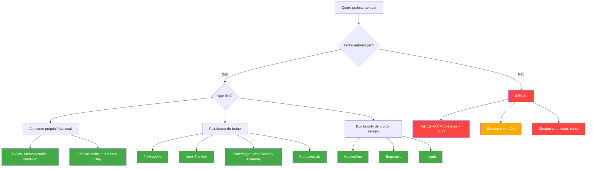

# Descobrindo Alvos Vulneráveis

> [!quote] Encontrando Pontos Fracos
> *Antes de explorar, é preciso descobrir onde estão as vulnerabilidades.*

---

## 🎯 Técnicas e Ferramentas de Reconhecimento

> [!info] Arsenal de Descoberta
> Reconhecimento passivo significa coletar informações sem interagir diretamente com o alvo. Você OBSERVA, não testa e não acessa sistemas de terceiros sem autorização.

### Motores de Busca Especializados

| Ferramenta | Descrição | Link |
|------------|-----------|------|
| **Shodan** | Busca dispositivos conectados à internet (portas abertas, banners, versões de software) | [shodan.io](https://www.shodan.io) |
| **Censys** | Infraestrutura, certificados TLS e serviços expostos | [search.censys.io](https://search.censys.io/) |
| **ZoomEye** | Motor de busca chinês, similar ao Shodan | zoomeye.org |
| **Fofa** | Busca de ativos de rede, foco em infraestrutura asiática | fofa.so |

### Técnicas de Busca

| Técnica | Descrição |
|---------|-----------|
| [[Google hacking\|Google Hacking (Dorking)]] | Buscas avançadas no Google para encontrar informações expostas |
| **Certificate Transparency** | Busca por certificados SSL emitidos para um domínio (crt.sh) |
| **DNS Enumeration** | Descoberta de subdomínios e registros DNS públicos |
| **Port Scanning** | Identificação de serviços em execução em hosts autorizados |

---

## 🔍 Exemplos de Dorks

> [!tip] Buscas para Entender Exposição (reconhecimento passivo)

### Google

```
intitle:"Index of" inurl:/backup
filetype:sql "password"
site:*.gov.br inurl:login
```

### Shodan

```
port:22 country:BR
"default password"
"MongoDB Server Information"
```

### Censys

```
location.country_code: BR
services.http.response.html_title:"Index of"
```

---

## 🔭 Como Usar Shodan e Censys para OBSERVAR (Não Invadir)

> [!danger] Linha Vermelha Intransponível
> Encontrar um dispositivo exposto no Shodan ou Censys **NÃO é autorização para acessá-lo**. Observar é legal. Acessar sem autorização é crime (art. 154-A do Código Penal, pena de 1 a 4 anos de reclusão, ampliada pela Lei 14.155/2021).

O objetivo desta seção é entender o que está visível publicamente, treinar o olhar analítico e aprender a interpretar exposição de superfície de ataque. Toda prática a seguir é de observação passiva.

### Passo a Passo no Shodan

**1. Crie uma conta gratuita em shodan.io.**

A conta gratuita permite pesquisas básicas com resultados limitados, suficientes para fins didáticos.

**2. Pesquise seu próprio IP (recurso "My IP").**

No Shodan, clique em "My IP" (canto superior direito) ou acesse `https://www.shodan.io/host/<seu_ip>`. Você verá:
- Portas abertas visíveis na internet
- Banners de serviços (ex.: versão do SSH, Apache, nginx)
- Localização geográfica aproximada
- Histórico de escaneamentos anteriores

Isso mostra exatamente o que um atacante externo veria do seu endereço, sem que você precise tocar em nada alheio.

**3. Interprete os banners de serviço.**

Cada porta aberta retorna um banner. Exemplos do que observar:
- `OpenSSH_8.2p1` indica versão do SSH (checar CVEs conhecidos via [nvd.nist.gov](https://nvd.nist.gov/))
- `Apache httpd 2.4.29` frequentemente desatualizado (EOL)
- `"default password"` no banner indica dispositivo IoT sem configuração

**4. Use filtros para estudar exposição em escala (dados públicos).**

```
org:"Ministerio da Educacao" country:BR
port:3306 country:BR "MySQL"
ssl.cert.subject.cn:"*.gov.br"
```

Esses filtros mostram o que está exposto publicamente. **Você está lendo dados que o próprio Shodan coletou; não há conexão sua com os alvos.**

**5. No Censys, use a aba "Search" para analisar certificados.**

Acesse `search.censys.io` e pesquise por domínio. O Censys é especialmente útil para mapear subdomínios via Certificate Transparency:
```
parsed.names: exemplo.com.br
```

### O que Você NUNCA deve Fazer

- Conectar a uma porta aberta encontrada no Shodan sem autorização explícita
- Usar credenciais padrão encontradas nos banners para logar em dispositivos de terceiros
- Automatizar requisições para IPs coletados no Shodan (scanning ativo sem autorização)
- Salvar e redistribuir dados de sistemas de terceiros identificados nas buscas

> [!example] 🧪 Atividade: Meu Próprio IP no Shodan
> **Plataforma:** Shodan (conta gratuita em shodan.io)
> **Tarefa:** Acesse `shodan.io/host/<seu-ip>` (use o "My IP" do próprio Shodan). Documente: quantas portas aparecem como abertas, quais serviços são identificados, qual versão de software está exposta. **Não clique, não conecte, não teste: apenas leia o relatório.**
> **Resultado esperado:** Entendimento do que um atacante externo enxerga do seu endereço. Se você estiver usando NAT/roteador doméstico, provavelmente verá o IP público do roteador e não o do seu computador; isso também é uma lição sobre arquitetura de rede.

---

## ⚖️ A Linha Legal: Onde Você Pode e Onde Não Pode Testar

> [!danger] Art. 154-A do Código Penal Brasileiro
> A Lei 12.737/2012 (conhecida como Lei Carolina Dieckmann), ampliada pela Lei 14.155/2021, tipifica o crime de **invasão de dispositivo informático**:
> "Invadir dispositivo informático alheio, conectado ou não à rede de computadores, mediante violação indevida de mecanismo de segurança e com fim de obter, adulterar ou destruir dados ou informações sem autorização expressa ou tácita do titular."
>
> **Pena atual:** reclusão de 1 a 4 anos e multa. Forma qualificada (acesso a comunicações privadas, segredos comerciais): reclusão de 2 a 5 anos.
>
> **Exceção legal:** o técnico que acessa um sistema com autorização expressa ou tácita do proprietário (ex.: contrato de pentest, programa de bug bounty com safe harbor) não comete crime.

A fronteira é simples:

| Situação | Legal? |
|----------|--------|
| Treinar em máquinas do VulnHub na sua própria rede | Sim |
| Resolver labs no TryHackMe ou Hack The Box | Sim |
| Testar em ambiente montado por você (DVWA, Metasploitable) | Sim |
| Bug bounty dentro do escopo definido pelo programa | Sim |
| Testar o próprio servidor/site que você administra | Sim (cuidado com serviços de terceiros hospedados) |
| Observar no Shodan sem conectar | Sim |
| Acessar uma porta aberta de terceiro encontrada no Shodan | **NÃO: crime** |
| Usar credencial padrão de IoT sem autorização | **NÃO: crime** |
| Testar site de empresa sem programa de bug bounty | **NÃO: crime** |
| Testar "só pra ver" um servidor de escola ou governo | **NÃO: crime** |

---

## 🏋️ Onde Treinar Pentest de Forma Legal em 2026

> [!success] Ambientes Criados Exatamente para Isso
> Todas as plataformas abaixo fornecem **autorização expressa** para que você teste os sistemas delas. Você pode atacar, explorar e comprometer: é para isso que foram criadas.

### Plataformas de Labs Online

| Plataforma | Tipo | Gratuito? | Nível | Foco |
|------------|------|-----------|-------|------|
| **TryHackMe** | Labs guiados no browser | Sim (parcial) | Iniciante a intermediário | Trilhas estruturadas, teoria + prática |
| **Hack The Box (HTB)** | Máquinas realistas | Sim (máquinas aposentadas) | Intermediário a avançado | Pentest independente, sem guia |
| **HTB Academy** | Cursos interativos | Sim (módulos iniciais) | Iniciante a avançado | Bug bounty, web, AD, mobile |
| **PortSwigger Web Security Academy** | Labs de web hacking | **100% gratuito** | Todos os níveis | Web: SQLi, XSS, SSRF, CSRF, JWT... |
| **PentesterLab** | Exercícios práticos | Sim (labs básicos) | Iniciante a avançado | Web, crypto, Linux |
| **VulnHub** | VMs para download | **100% gratuito** | Iniciante a avançado | Rede, web, privilege escalation |

### Detalhes de Cada Plataforma

**TryHackMe (tryhackme.com)**

A plataforma ideal para começar. Os labs rodam no browser sem necessidade de instalar nada. Há trilhas de aprendizagem sequenciais: "Pre-Security", "Complete Beginner", "Offensive Pentesting". O plano gratuito dá acesso a muitas salas. Assinatura premium (cerca de US\$ 14/mês em 2026) libera todas as trilhas e salas.

**Hack The Box (hackthebox.com)**

Foco em realismo: as máquinas se comportam como sistemas reais e não há tutorial. O plano pago (VIP+, único disponível desde outubro de 2025, US\$ 25/mês ou US\$ 223/ano) libera máquinas aposentadas com writeups oficiais, que são o caminho recomendado para iniciantes. O HTB Academy (academy.hackthebox.com) tem módulos gratuitos sobre fundamentos e uma trilha específica para bug bounty hunter.

**PortSwigger Web Security Academy (portswigger.net/web-security)**

Completamente gratuito e mantido pela mesma empresa que faz o Burp Suite. Cobre todos os tópicos de web hacking com labs interativos: SQL injection, XSS, SSRF, deserialization, OAuth, JWT, business logic flaws e mais de 250 labs no total. Referência obrigatória para quem quer especialização em web.

**VulnHub (vulnhub.com)**

Máquinas virtuais (.ova/.vmdk) para download e execução local no VirtualBox ou VMware. Totalmente gratuito. Mais de 800 máquinas disponíveis, filtráveis por nível (very easy, easy, medium, hard) e categoria (web, network, CTF). Você monta o lab na sua própria máquina: a VM vulnerável fica em rede isolada (modo "Host-Only" no VirtualBox) e a sua Kali Linux ataca a partir do mesmo host.

**PentesterLab (pentesterlab.com)**

Exercícios práticos com foco em web e exploração de CVEs reais. O plano gratuito cobre exercícios introdutórios. O plano PRO (US\$ 19/mês) libera todos os exercícios, incluindo trilhas certificadas.

---

## 🐛 Bug Bounty: Teste Legal em Sistemas Reais de Empresas

> [!info] O Que É Bug Bounty
> Empresas publicam programas de bug bounty convidando pesquisadores externos para encontrar vulnerabilidades em seus sistemas, em troca de recompensas (de agradecimento público a pagamentos em dinheiro). Ao participar, você recebe autorização explícita para testar, dentro do escopo definido. Isso é pentest legal em sistemas reais de produção.

### Principais Plataformas de Bug Bounty

| Plataforma | Programas | Gratuito para pesquisadores? | Link |
|------------|-----------|------------------------------|------|
| **HackerOne** | Mais de 3.000 programas | Sim | hackerone.com |
| **Bugcrowd** | Centenas de programas | Sim | bugcrowd.com |
| **Intigriti** | Foco europeu | Sim | intigriti.com |
| **Open Bug Bounty** | Programas abertos | Sim | openbugbounty.org |

### Como Ler um Escopo de Bug Bounty

Todo programa de bug bounty tem um documento de escopo (policy). Antes de testar qualquer coisa, leia esse documento do começo ao fim. Ele define:

**1. In scope (o que você PODE testar):**
Normalmente lista domínios, IPs, aplicativos móveis ou funcionalidades específicas. Exemplo real de escopo:
```
In scope:
  - *.exemplo.com (exceto blog.exemplo.com)
  - API: api.exemplo.com
  - App iOS versão 3.2 ou superior
```

**2. Out of scope (o que você NÃO pode testar):**
```
Out of scope:
  - Ataques de DoS/DDoS
  - Engenharia social contra funcionários
  - Testes que interrompam operações normais
  - blog.exemplo.com
  - Infraestrutura de terceiros hospedada no domínio
```

**3. Regras de engajamento:**
Define técnicas proibidas mesmo dentro do escopo (ex.: não usar scanners automáticos agressivos, não exfiltrar dados reais de usuários, não modificar dados de produção).

**4. Safe harbor:**
Cláusula que garante proteção legal ao pesquisador que seguir as regras. Se você testar algo out of scope, o safe harbor não te protege.

> [!danger] Regra de Ouro do Bug Bounty
> **Testar algo fora do escopo descrito, mesmo que seja um subdomínio da mesma empresa, é crime.** O safe harbor só vale para o que está explicitamente listado como in scope. Em caso de dúvida, pergunte ao programa antes de testar.

### Programas Recomendados para Iniciantes

Alguns programas têm escopo amplo e são reconhecidamente amigáveis para iniciantes:
- **HackerOne Security (hackerone.com/security):** O próprio HackerOne tem bug bounty.
- **US Department of Defense (hackerone.com/deptofdefense):** Programa público amplo, escopo em ativos do DoD expostos na internet.
- **Programas "Vulnerability Disclosure Programs" (VDP):** Não pagam recompensa em dinheiro, mas aceitam reportes e são bons para ganhar experiência.

> [!example] 🧪 Atividade: Lendo um Escopo Real no HackerOne
> **Plataforma:** HackerOne (conta gratuita em hackerone.com)
> **Tarefa:**
> 1. Crie uma conta gratuita no HackerOne.
> 2. Acesse [hackerone.com/bug-bounty-programs](https://hackerone.com/bug-bounty-programs).
> 3. Filtre por "Managed Bug Bounty" + "Public".
> 4. Abra o programa de qualquer empresa que você reconheça.
> 5. Leia o documento de Policy completo.
> 6. Responda por escrito: (a) O que está in scope? (b) O que está out of scope? (c) Quais técnicas são proibidas mesmo dentro do escopo? (d) Há safe harbor?
>
> **Resultado esperado:** Você consegue distinguir o que seria legal testar do que seria crime, a partir do documento público do programa, sem ainda executar nenhum teste.

---

## 🏗️ Montando Seu Próprio Lab Local (100% Legal)

Além das plataformas online, você pode montar um ambiente vulnerável na sua própria máquina. Todo o tráfego fica em rede interna: você nunca toca em sistemas de terceiros.

### Aplicações Intencionalmente Vulneráveis

| Aplicação | Foco | Como Rodar |
|-----------|------|------------|
| **DVWA** (Damn Vulnerable Web App) | Web hacking básico | Docker: `docker run -d -p 80:80 vulnerables/web-dvwa` |
| **Metasploitable 2/3** | Exploração de serviços de rede | VM no VirtualBox (download em SourceForge) |
| **WebGoat** (OWASP) | OWASP Top 10 | Docker: `docker run -p 8080:8080 webgoat/goat-and-wolf` |
| **BWAPP** | Mais de 100 vulnerabilidades web | VM ou instalação local |
| **VMs do VulnHub** | Variedade grande | Download e importar no VirtualBox |

### Configuração Segura do Lab

**Isolamento de rede é obrigatório.** Máquinas vulneráveis não podem estar na mesma rede que outros dispositivos. No VirtualBox:

1. Selecione a VM vulnerável, vá em "Configurações" > "Rede".
2. Troque de "NAT" ou "Bridge" para **"Host-Only Adapter"**.
3. Faça o mesmo na sua Kali Linux (ou use "Internal Network" se quiser isolar ainda mais).
4. Resultado: Kali e a VM vulnerável se enxergam, mas nenhuma das duas acessa a internet nem a rede doméstica.

> [!danger] Nunca coloque uma VM vulnerável em Bridge ou NAT sem firewall
> No modo Bridge, a VM fica visível para toda a rede local (e potencialmente para a internet se o roteador tiver forwarding). No modo NAT sem configuração adequada, a VM pode ser acessada por outros dispositivos da rede interna do VirtualBox. Use Host-Only para laboratórios.

---

## ⚠️ Considerações Éticas e Legais

> [!danger] Regras Invioláveis
> - **Descobrir** vulnerabilidades em sistemas alheios via Shodan/Censys é diferente de **explorar** essas vulnerabilidades
> - Apenas realize testes em sistemas para os quais você tem **autorização documentada**
> - Bug bounty só dentro do **escopo explícito** do programa
> - **Reporte vulnerabilidades** encontradas de forma responsável (disclosure coordenado)
> - **Art. 154-A do Código Penal:** invasão de dispositivo informático alheio sem autorização resulta em reclusão de 1 a 4 anos e multa
> - A pena aumenta se houver prejuízo econômico, acesso a comunicações privadas ou controle remoto não autorizado

---

## 🗺️ Mapa: Onde Treinar Legal vs. Ilegal



---

## 🔍 Exemplos de Dorks (revisados)

> [!tip] Buscas para Entender Exposição (reconhecimento passivo)
> Esses exemplos são para fins de estudo e consciência situacional. Os resultados mostram o que está publicamente indexado. **Não acesse, não teste, não interaja com sistemas de terceiros.**

### Google

```
intitle:"Index of" inurl:/backup
filetype:sql "password"
site:*.gov.br inurl:login
```

### Shodan

```
port:22 country:BR
"default password"
"MongoDB Server Information"
```

### Censys

```
location.country_code: BR
services.http.response.html_title:"Index of"
```

---

## 🧪 Atividades Práticas

> [!example] 🧪 Atividade 1: Encontrando e Iniciando uma Máquina no VulnHub
> **Plataforma:** VulnHub (vulnhub.com) + VirtualBox
>
> **Tarefa:**
> 1. Acesse vulnhub.com e filtre por dificuldade "Easy" ou "Very Easy".
> 2. Identifique pelo menos 3 máquinas com foco diferente (ex.: uma web, uma rede, uma Linux privilege escalation).
> 3. Escolha uma e leia a descrição completa: objetivo da máquina, nível, ferramentas sugeridas.
> 4. Faça o download do arquivo .ova.
> 5. Importe no VirtualBox: "Arquivo" > "Importar Appliance".
> 6. Configure a rede da VM para **Host-Only Adapter**.
> 7. Inicie a VM e confirme que ela aparece na rede Host-Only (use `netdiscover` ou `nmap` da Kali contra a subnet 192.168.56.0/24 ou equivalente).
>
> **Resultado esperado:** VM vulnerável rodando, isolada na rede Host-Only, acessível da Kali Linux. Você está pronto para começar o pentest, totalmente dentro do seu próprio ambiente.

> [!example] 🧪 Atividade 2: Lendo um Escopo Real no HackerOne
> **Plataforma:** HackerOne (conta gratuita em hackerone.com)
>
> **Tarefa:**
> 1. Crie uma conta gratuita no HackerOne.
> 2. Acesse [hackerone.com/bug-bounty-programs](https://hackerone.com/bug-bounty-programs).
> 3. Filtre por "Managed Bug Bounty" + "Public".
> 4. Abra o programa de qualquer empresa que você reconheça.
> 5. Leia o documento de Policy completo.
> 6. Responda por escrito:
>    - O que está in scope?
>    - O que está out of scope?
>    - Quais técnicas são proibidas mesmo dentro do escopo?
>    - Há safe harbor? O que ele garante?
>    - Se você encontrasse uma vulnerabilidade em um domínio parecido mas NÃO listado no scope, o que faria?
>
> **Resultado esperado:** Você consegue distinguir o que seria legal testar do que seria crime, a partir do documento público do programa.

> [!example] 🧪 Atividade 3: Meu Próprio IP no Shodan
> **Plataforma:** Shodan (conta gratuita em shodan.io)
>
> **Tarefa:**
> 1. Crie uma conta gratuita no Shodan.
> 2. No menu superior direito, clique em "My IP" (ou acesse `https://www.shodan.io/host/<seu-ip-público>`).
> 3. Observe e documente:
>    - Quais portas aparecem como abertas?
>    - Quais serviços e versões de software são identificados?
>    - Há banners com informações de versão?
>    - Há registros históricos de escaneamentos anteriores?
> 4. Para cada porta/serviço encontrado, consulte [nvd.nist.gov](https://nvd.nist.gov/) e pesquise se há CVEs conhecidos para aquela versão.
>
> **Resultado esperado:** Você entende o que um atacante externo enxerga do seu endereço IP, sem tocar em nenhum sistema de terceiro. Se você estiver atrás de NAT doméstico, verá o IP do roteador, o que também é uma lição sobre perímetro de rede.
>
> **Importante:** Você está lendo dados que o Shodan coletou em varreduras próprias. Você não está fazendo port scan em ninguém: está lendo um banco de dados público.

---

> [!note] 📚 Fontes (2026)
> - [TryHackMe vs Hack The Box 2026: Pricing, Paths & Verdict (HackerDNA)](https://hackerdna.com/blog/tryhackme-vs-hackthebox)
> - [TryHackMe vs HTB vs PortSwigger vs OffSec Labs: Practical Guide 2026 (cyberleveling)](https://cyberleveling.com/blog/cybersecurity-learning-platforms)
> - [HTB Academy: Bug Bounty Hunter Path](https://academy.hackthebox.com/path/preview/bug-bounty-hunter)
> - [Web Security Academy: Free Online Training (PortSwigger)](https://portswigger.net/web-security)
> - [PortSwigger vs PentesterLab Comparison 2025](https://www.leadrpro.com/blog/portswigger-vs-pentesterlab-two-cybersecurity-training-platforms-compared)
> - [VulnHub: Vulnerable By Design](https://www.vulnhub.com/)
> - [Ultimate Guide to VulnHub for Beginners (InfoSec Write-ups)](https://infosecwriteups.com/the-ultimate-guide-to-vulnhub-machines-for-beginners-master-network-web-pentesting-8476a79315ae)
> - [The Best Bug Bounty Websites in 2026 (TrainingCamp)](https://trainingcamp.com/articles/the-best-bug-bounty-websites-in-2026-a-researchers-guide-to-hackerone-bugcrowd-and-beyond/)
> - [Bug Bounty 101: 5 Platforms That Deliver (Medium)](https://medium.com/@Modexa/bug-bounties-101-5-platforms-that-deliver-cb10ede3f6d0)
> - [Art. 154-A CP: Crime de Invasão de Dispositivo Informático (Jusbrasil)](https://www.jusbrasil.com.br/artigos/novo-crime-invasao-de-dispositivo-informatico-cp-art-154-a/121942478)
> - [Lei Carolina Dieckmann: tudo o que você precisa saber (ProJuris)](https://www.projuris.com.br/blog/lei-carolina-dieckman-tudo-o-que-voce-precisa-saber-sobre/)
> - [Bug Bounty 101: Complete Roadmap for Beginners 2026 (Netlas)](https://netlas.io/blog/bug_bounty_roadmap/)
