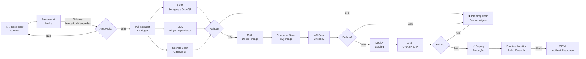

# DevOps

> [!quote] Cultura de Colaboração
> *DevOps é a união de desenvolvimento e operações para entregar software de forma mais rápida e confiável.*

---

## 🎯 O que é DevOps?

> [!success] Definição
> **DevOps** é uma cultura e conjunto de práticas que une desenvolvimento de software (Dev) e operações de TI (Ops) para encurtar o ciclo de desenvolvimento e entregar software de alta qualidade continuamente.

[🔗 DevOps - Wikipedia](https://pt.wikipedia.org/wiki/DevOps)

---

## 🔄 Ciclo DevOps

> [!info] Etapas do Pipeline
> O ciclo DevOps é contínuo e iterativo. Cada etapa alimenta a próxima, e o feedback final retorna ao início, gerando melhoria constante.

```
Plan → Code → Build → Test → Release → Deploy → Operate → Monitor
  ↑                                                              ↓
  └──────────────────── Feedback ────────────────────────────────┘
```

### Descrição de cada fase

| Fase | O que acontece | Exemplos de ferramentas |
|------|----------------|------------------------|
| **Plan** | Definição de requisitos, modelagem de ameaças | Jira, GitHub Issues, STRIDE |
| **Code** | Escrita do código, revisão por pares | VS Code, Git, pre-commit hooks |
| **Build** | Compilação, empacotamento, geração de artefatos | Maven, Gradle, Docker build |
| **Test** | Testes unitários, integração, segurança | JUnit, pytest, Semgrep, OWASP ZAP |
| **Release** | Aprovação e versionamento do artefato | GitHub Releases, Nexus, Harbor |
| **Deploy** | Implantação em ambientes de produção | Helm, ArgoCD, Terraform |
| **Operate** | Operação do sistema em produção | Kubernetes, Ansible, Chef |
| **Monitor** | Observabilidade, alertas, rastreamento de incidentes | Grafana, Prometheus, ELK Stack |

---

## 🔐 DevSecOps

> [!warning] Segurança Integrada
> **DevSecOps** integra segurança em todas as fases do pipeline DevOps, em vez de deixá-la para o final. O lema é *"shift-left security"*: mover os controles de segurança o mais cedo possível no ciclo, onde o custo de correção é menor.

### O problema do modelo tradicional

No modelo clássico, a segurança era responsabilidade de um time separado, auditado apenas antes do deploy ou após um incidente. Isso criava:

- Correções tardias e caras (vulnerabilidade em produção custa 30x mais que em design).
- Atrito entre times (segurança como "guardião do não").
- Falsa sensação de segurança por auditoria pontual.

### O princípio Shift-Left

"Shift-left" significa deslocar os controles de segurança para a esquerda do pipeline, ou seja, para etapas mais iniciais. Um desenvolvedor que recebe feedback de segurança ao salvar o arquivo corrige 5 vezes mais rápido do que aquele que recebe o relatório 3 semanas depois.

```
Modelo ANTIGO:  Code → Build → Test → Deploy → [SEGURANÇA] → Produção
Modelo ATUAL:   [SEGURANÇA] em CADA ETAPA → Produção segura por padrão
```

### Práticas de Segurança por Fase

| Fase | Prática de Segurança | Ferramenta Exemplo |
|------|---------------------|--------------------|
| **Plan** | Modelagem de ameaças (STRIDE, PASTA) | OWASP Threat Dragon |
| **Code** | Análise estática (SAST), detecção de segredos | Semgrep, Gitleaks |
| **Build** | Scan de dependências (SCA), verificação de SBOM | Trivy, Dependabot |
| **Test** | DAST, testes de fuzzing, pentest automatizado | OWASP ZAP, Nuclei |
| **Release** | Assinatura de artefatos, verificação de provenance | Cosign, Sigstore |
| **Deploy** | IaC scan, políticas de admissão no Kubernetes | Checkov, OPA/Gatekeeper |
| **Operate** | Monitoramento de runtime, detecção de anomalias | Falco, Wazuh |
| **Monitor** | SIEM, correlação de eventos, threat intelligence | ELK + Wazuh, Splunk |

---

## 🔍 Tipos de Análise de Segurança no Pipeline

> [!info] As quatro categorias fundamentais de varredura no DevSecOps moderno são SAST, DAST, SCA e Secrets Scanning. Cada uma cobre um vetor diferente.

### SAST: Static Application Security Testing

**O que é:** Analisa o código-fonte sem executar a aplicação. Detecta problemas como injeção de SQL, XSS, uso inseguro de funções criptográficas e lógica perigosa diretamente no código.

**Quando roda:** No momento do commit ou pull request, antes da compilação.

**Vantagem:** Rápido e sem necessidade de ambiente em execução.

**Limitação:** Não detecta vulnerabilidades que só aparecem em tempo de execução.

**Ferramenta principal em 2026: Semgrep**

```bash
# Instalar Semgrep
pip install semgrep

# Escanear o projeto atual com as regras de segurança da comunidade
semgrep --config=p/security-audit .

# Escanear apenas arquivos Python com regras OWASP
semgrep --config=p/owasp-top-ten --lang=python .

# Escanear e gerar relatório JSON (para CI/CD)
semgrep --config=p/security-audit --json -o semgrep-results.json .

# Filtrar apenas CRITICAL e HIGH
semgrep --config=p/security-audit --severity=ERROR --severity=WARNING .
```

**Outras ferramentas SAST:**
- **CodeQL** (GitHub nativo, análise semântica profunda, gratuito para projetos open source).
- **SonarQube** (qualidade de código + segurança, painel web, self-hosted).
- **Bandit** (Python específico, muito leve).

---

### SCA: Software Composition Analysis

**O que é:** Analisa as dependências do projeto (bibliotecas de terceiros) em busca de CVEs (vulnerabilidades conhecidas), licenças incompatíveis e pacotes maliciosos.

**Por que é crítico em 2026:** O OWASP Top 10 2025 eleva **A03:2025 Software Supply Chain Failures** ao terceiro lugar, refletindo ataques reais como o caso `xz-utils` (backdoor plantado por mantenedor comprometido, CVE-2024-3094) e o primeiro worm npm auto-propagante (2025).

**Quando roda:** Após geração do `lock file` (package-lock.json, requirements.txt, go.sum) e após o build.

**Ferramenta principal: Trivy (SCA + containers)**

```bash
# Instalar Trivy
sudo apt install trivy
# ou via script:
curl -sfL https://raw.githubusercontent.com/aquasecurity/trivy/main/contrib/install.sh | sh

# Escanear dependências de um projeto Node.js
trivy fs --scanners vuln .

# Escanear dependências Python
trivy fs --scanners vuln --pkg-types library .

# Filtrar apenas CRITICAL e HIGH
trivy fs --severity CRITICAL,HIGH .

# Gerar SBOM (Software Bill of Materials) em formato SPDX
trivy fs --format spdx-json -o sbom.json .
```

**Outras ferramentas SCA:**
- **Dependabot** (integrado ao GitHub, abre PRs automáticos de atualização).
- **OWASP Dependency-Check** (suporte a múltiplos ecossistemas).
- **Snyk** (SaaS, mais completo, freemium).

---

### DAST: Dynamic Application Security Testing

**O que é:** Testa a aplicação em execução, simulando um atacante externo. Detecta vulnerabilidades que só se manifestam em runtime: XSS refletido, injeção de SQL real, autenticação quebrada, configurações incorretas de cabeçalhos HTTP.

**Quando roda:** Em ambiente de staging (nunca diretamente em produção).

**Ferramenta principal: OWASP ZAP**

```bash
# Rodar ZAP em modo Docker (scan passivo rápido)
docker run -t owasp/zap2docker-stable zap-baseline.py \
  -t http://staging.meuapp.local \
  -r zap-report.html

# Scan ativo (mais profundo, demora mais)
docker run -t owasp/zap2docker-stable zap-full-scan.py \
  -t http://staging.meuapp.local \
  -r zap-full-report.html

# Usar ZAP via API para integração com CI/CD
docker run -d --name zap -p 8090:8090 owasp/zap2docker-stable \
  zap.sh -daemon -port 8090 -host 0.0.0.0 \
  -config api.addrs.addr.name=.* -config api.addrs.addr.enabled=true
```

> [!warning] Ética e Legalidade
> Testes DAST devem ser realizados **somente em sistemas próprios ou com autorização expressa por escrito**. Rodar OWASP ZAP em sistemas de terceiros sem autorização é crime pelo **art. 154-A do Código Penal** (invasão de dispositivo informático), com pena de 1 a 4 anos de reclusão. A autorização deve especificar escopo, janela de tempo e técnicas permitidas.

---

### Secrets Scanning: Detecção de Segredos Expostos

**O que é:** Procura credenciais, tokens de API, senhas e chaves privadas acidentalmente commitados no código ou histórico do Git.

**Cenário real:** Em 2024, pesquisadores encontraram mais de 12,8 milhões de segredos expostos em repositórios GitHub públicos. Um token de AWS exposto pode gerar fatura de US\$ 50.000 em poucas horas.

**Ferramenta principal: Gitleaks**

```bash
# Instalar Gitleaks
brew install gitleaks
# ou
wget https://github.com/gitleaks/gitleaks/releases/latest/download/gitleaks_linux_amd64.tar.gz

# Escanear repositório atual (histórico completo)
gitleaks detect --source . --report-path gitleaks-report.json

# Escanear apenas o último commit (modo rápido para pre-commit)
gitleaks protect --staged

# Verificar um commit específico
gitleaks detect --source . --log-opts="HEAD~1..HEAD"
```

**Configurar como pre-commit hook (`.pre-commit-config.yaml`):**

```yaml
repos:
  - repo: https://github.com/gitleaks/gitleaks
    rev: v8.21.2
    hooks:
      - id: gitleaks
```

```bash
# Instalar e ativar o hook
pip install pre-commit
pre-commit install
```

---

### Container Scanning

**O que é:** Analisa imagens Docker em busca de pacotes do sistema operacional vulneráveis, configurações inseguras e segredos embutidos na imagem.

**Por que importa:** Uma imagem baseada em `ubuntu:20.04` sem atualização pode ter centenas de CVEs, mesmo que o código da aplicação seja seguro.

**Ferramenta: Trivy (container)**

```bash
# Escanear uma imagem local
trivy image minha-app:latest

# Escanear imagem do Docker Hub
trivy image nginx:1.25

# Escanear apenas pacotes do OS + app, filtrar por severidade
trivy image --severity CRITICAL,HIGH minha-app:latest

# Escanear imagem e gerar relatório JSON
trivy image --format json -o trivy-image.json minha-app:latest

# Escanear Dockerfile por misconfigurations
trivy config Dockerfile

# Verificar se a imagem tem rootless (boa prática)
trivy image --scanners config minha-app:latest
```

---

### IaC Security Scanning

**O que é:** Analisa arquivos de Infrastructure as Code (Terraform, Kubernetes manifests, Helm charts, Dockerfiles, CloudFormation) em busca de configurações inseguras antes do deploy.

**Exemplos de problemas detectados:**
- Bucket S3 público sem intenção.
- Pod Kubernetes rodando como root.
- Security Group AWS com porta 22 aberta para 0.0.0.0/0.
- Variável de ambiente com senha hardcoded no manifesto.

**Ferramenta: Checkov**

```bash
# Instalar Checkov
pip install checkov

# Escanear arquivos Terraform
checkov -d ./terraform/

# Escanear manifests Kubernetes
checkov -d ./k8s/ --framework kubernetes

# Escanear Dockerfile
checkov -f Dockerfile

# Gerar relatório JUnit (para CI/CD)
checkov -d ./terraform/ -o junitxml > checkov-results.xml

# Visualizar apenas falhas críticas
checkov -d ./terraform/ --check CKV_AWS_*
```

**Trivy também faz IaC:**

```bash
# Escanear toda a pasta de IaC
trivy config ./infra/

# Escanear manifests Kubernetes
trivy config ./k8s/
```

---

## 🏗️ Pipeline DevSecOps Completo

O diagrama abaixo representa um pipeline seguro de ponta a ponta, integrando todos os controles nas etapas corretas:



---

## ⚙️ GitHub Actions: Pipeline de Segurança Completo

O GitHub Actions é a plataforma de CI/CD nativa do GitHub. O arquivo abaixo implementa um pipeline DevSecOps completo, executando SAST, SCA, Secrets Scan, Container Scan e IaC Scan em sequência.

### Estrutura do repositório

```
meu-projeto/
├── .github/
│   └── workflows/
│       └── security.yml     ← pipeline de segurança
├── src/                     ← código-fonte
├── Dockerfile
├── k8s/                     ← manifests Kubernetes
│   └── deployment.yaml
└── terraform/               ← infra como código
    └── main.tf
```

### `.github/workflows/security.yml`

```yaml
name: DevSecOps Security Pipeline

on:
  push:
    branches: [ main, develop ]
  pull_request:
    branches: [ main ]

jobs:
  # ──────────────────────────────────────
  # 1. SAST: Análise estática com Semgrep
  # ──────────────────────────────────────
  sast:
    name: SAST (Semgrep)
    runs-on: ubuntu-latest
    steps:
      - uses: actions/checkout@v4

      - name: Run Semgrep SAST
        uses: semgrep/semgrep-action@v1
        with:
          config: >-
            p/security-audit
            p/owasp-top-ten
            p/secrets
        env:
          SEMGREP_APP_TOKEN: ${{ secrets.SEMGREP_APP_TOKEN }}

  # ──────────────────────────────────────
  # 2. Secrets Scan com Gitleaks
  # ──────────────────────────────────────
  secrets-scan:
    name: Secrets Detection (Gitleaks)
    runs-on: ubuntu-latest
    steps:
      - uses: actions/checkout@v4
        with:
          fetch-depth: 0  # histórico completo

      - name: Run Gitleaks
        uses: gitleaks/gitleaks-action@v2
        env:
          GITHUB_TOKEN: ${{ secrets.GITHUB_TOKEN }}

  # ──────────────────────────────────────
  # 3. SCA: Scan de dependências com Trivy
  # ──────────────────────────────────────
  sca:
    name: SCA - Dependency Scan (Trivy)
    runs-on: ubuntu-latest
    steps:
      - uses: actions/checkout@v4

      - name: Run Trivy vulnerability scanner (filesystem)
        uses: aquasecurity/trivy-action@master
        with:
          scan-type: 'fs'
          scan-ref: '.'
          severity: 'CRITICAL,HIGH'
          exit-code: '1'        # falha o pipeline se achar CVE crítico
          format: 'table'

  # ──────────────────────────────────────
  # 4. Build da imagem Docker
  # ──────────────────────────────────────
  build:
    name: Docker Build
    runs-on: ubuntu-latest
    needs: [sast, secrets-scan, sca]   # só builda se os scans passarem
    steps:
      - uses: actions/checkout@v4

      - name: Build Docker image
        run: docker build -t minha-app:${{ github.sha }} .

      - name: Save image as artifact
        run: docker save minha-app:${{ github.sha }} | gzip > image.tar.gz

      - uses: actions/upload-artifact@v4
        with:
          name: docker-image
          path: image.tar.gz

  # ──────────────────────────────────────
  # 5. Container Scan com Trivy
  # ──────────────────────────────────────
  container-scan:
    name: Container Image Scan (Trivy)
    runs-on: ubuntu-latest
    needs: build
    steps:
      - uses: actions/download-artifact@v4
        with:
          name: docker-image

      - name: Load Docker image
        run: docker load < image.tar.gz

      - name: Run Trivy container scan
        uses: aquasecurity/trivy-action@master
        with:
          scan-type: 'image'
          image-ref: 'minha-app:${{ github.sha }}'
          severity: 'CRITICAL,HIGH'
          exit-code: '1'
          format: 'sarif'
          output: 'trivy-image.sarif'

      - name: Upload SARIF to GitHub Security
        uses: github/codeql-action/upload-sarif@v3
        with:
          sarif_file: 'trivy-image.sarif'

  # ──────────────────────────────────────
  # 6. IaC Scan com Checkov
  # ──────────────────────────────────────
  iac-scan:
    name: IaC Security Scan (Checkov)
    runs-on: ubuntu-latest
    steps:
      - uses: actions/checkout@v4

      - name: Run Checkov on Terraform
        uses: bridgecrewio/checkov-action@master
        with:
          directory: ./terraform
          framework: terraform
          soft_fail: false
          output_format: cli

      - name: Run Checkov on Kubernetes manifests
        uses: bridgecrewio/checkov-action@master
        with:
          directory: ./k8s
          framework: kubernetes
          soft_fail: false

  # ──────────────────────────────────────
  # 7. DAST com OWASP ZAP (staging only)
  # ──────────────────────────────────────
  dast:
    name: DAST (OWASP ZAP)
    runs-on: ubuntu-latest
    needs: [container-scan]
    if: github.ref == 'refs/heads/main'   # só na branch principal
    steps:
      - uses: actions/checkout@v4

      - name: Start staging application
        run: |
          docker load < image.tar.gz || true
          docker run -d -p 8080:8080 --name staging minha-app:${{ github.sha }}
          sleep 10  # aguardar subida

      - name: Run OWASP ZAP Baseline Scan
        uses: zaproxy/action-baseline@v0.12.0
        with:
          target: 'http://localhost:8080'
          rules_file_name: '.zap/rules.tsv'
          cmd_options: '-a'

      - name: Cleanup
        run: docker stop staging && docker rm staging
```

---

## 🛡️ Tabela Completa: Tipos, Ferramentas e Momento de Execução

| Tipo | Categoria | Ferramenta | Momento | Custo | Open Source |
|------|-----------|------------|---------|-------|-------------|
| **SAST** | Código estático | Semgrep | Pre-commit + PR | Gratuito | Sim |
| **SAST** | Código estático | CodeQL | PR | Gratuito (GitHub) | Sim |
| **SAST** | Código + qualidade | SonarQube | PR + merge | Freemium | Sim |
| **SCA** | Dependências | Trivy fs | PR + build | Gratuito | Sim |
| **SCA** | Dependências | Dependabot | Continuo | Gratuito (GitHub) | Sim |
| **SCA** | Dependências | Snyk | PR | Freemium | Parcial |
| **Secrets** | Vazamento de credenciais | Gitleaks | Pre-commit + PR | Gratuito | Sim |
| **Secrets** | Vazamento de credenciais | TruffleHog | PR | Gratuito | Sim |
| **Container** | Imagem Docker | Trivy image | Após build | Gratuito | Sim |
| **Container** | Dockerfile lint | Hadolint | PR | Gratuito | Sim |
| **IaC** | Terraform, K8s, CF | Checkov | PR + merge | Gratuito | Sim |
| **IaC** | Terraform, K8s | Trivy config | PR | Gratuito | Sim |
| **DAST** | Runtime web | OWASP ZAP | Staging | Gratuito | Sim |
| **DAST** | Runtime web | Nuclei | Staging | Gratuito | Sim |
| **Runtime** | Detecção de anomalias | Falco | Produção 24/7 | Gratuito | Sim |

---

## 🏛️ OWASP Top 10 2025 e DevSecOps

O OWASP Top 10 2025 trouxe mudanças significativas em relação à versão de 2021, com destaque para ameaças à cadeia de fornecimento de software (supply chain).

| Posição | Categoria | Impacto no DevSecOps |
|---------|-----------|---------------------|
| A01:2025 | Broken Access Control | SAST detecta lógica de autorização; DAST testa bypasses |
| A02:2025 | Cryptographic Failures | SAST detecta algoritmos fracos (MD5, SHA1, DES) |
| **A03:2025** | **Software Supply Chain Failures** | **SCA contínua, SBOM, pinning de dependências** |
| A04:2025 | Insecure Design | Modelagem de ameaças na fase Plan |
| A05:2025 | Security Misconfiguration | IaC scan, container scan |
| A06:2025 | Vulnerable and Outdated Components | SCA (Trivy, Dependabot) |
| A07:2025 | Identification and Authentication Failures | DAST testa autenticação |
| A08:2025 | Software and Data Integrity Failures | Assinatura de artefatos (Cosign/Sigstore) |
| A09:2025 | Security Logging and Monitoring Failures | Runtime monitoring (Falco, Wazuh) |
| A10:2025 | Server-Side Request Forgery | DAST testa SSRF; SAST detecta chamadas externas inseguras |

> [!danger] A03:2025 Software Supply Chain Failures
> Esta categoria subiu para o top 3 após ataques reais:
> - **xz-utils backdoor (CVE-2024-3094):** mantenedor comprometido inseriu backdoor em ferramenta de compressão usada por distribuições Linux.
> - **Typosquatting npm:** pacotes com nomes similares a bibliotecas populares (ex: `lodahs` vs `lodash`) que roubam credenciais.
> - **Trivy GitHub Actions breach (2026):** 75 tags da action `aquasecurity/trivy-action` foram força-empurradas com payloads maliciosos para roubar segredos de CI/CD.
>
> **Mitigação:** sempre pinne versões de actions pelo hash SHA256, não pela tag.
>
> ```yaml
> # INSEGURO: tag pode mudar
> uses: aquasecurity/trivy-action@master
>
> # SEGURO: hash imutável
> uses: aquasecurity/trivy-action@f1728e75dfa5a9460e5cf6a7b73c25c9b34f4b31
> ```

---

## 🔒 Segurança no Código: Exemplos Práticos

### O que o Semgrep detecta

**Injeção de SQL (Python + SQLite):**

```python
# VULNERÁVEL: entrada do usuário direto na query
def buscar_usuario(nome):
    conn = sqlite3.connect("banco.db")
    cursor = conn.execute(f"SELECT * FROM usuarios WHERE nome = '{nome}'")
    # Um atacante pode passar: ' OR '1'='1 e listar todos os usuários
    return cursor.fetchall()

# SEGURO: uso de parâmetros preparados
def buscar_usuario(nome):
    conn = sqlite3.connect("banco.db")
    cursor = conn.execute("SELECT * FROM usuarios WHERE nome = ?", (nome,))
    return cursor.fetchall()
```

**Hardcoded secret (detectado pelo Gitleaks e Semgrep):**

```python
# VULNERÁVEL: credencial no código
API_KEY = "sk-abc123456789supersecret"
DATABASE_PASSWORD = "minhasenha123"

# SEGURO: ler de variável de ambiente
import os
API_KEY = os.environ.get("API_KEY")
DATABASE_PASSWORD = os.environ.get("DB_PASSWORD")
```

**Criptografia fraca (detectada pelo SAST):**

```python
# VULNERÁVEL: MD5 para hash de senha
import hashlib
senha_hash = hashlib.md5(senha.encode()).hexdigest()

# SEGURO: bcrypt ou argon2
import bcrypt
senha_hash = bcrypt.hashpw(senha.encode(), bcrypt.gensalt())
```

---

## 📦 SBOM: Software Bill of Materials

> [!info] O que é SBOM?
> SBOM (Software Bill of Materials) é um inventário completo de todos os componentes de software de uma aplicação: bibliotecas, versões, licenças e vulnerabilidades conhecidas. É o "rótulo nutricional" do software.

**Por que é obrigatório em 2026:**
- Executive Order 14028 (EUA, 2021): exige SBOM para software vendido ao governo americano.
- NIST SP 800-204D: recomenda SBOM para segurança de microsserviços.
- Regulatório na UE (Cyber Resilience Act): em vigência gradual até 2027.

**Gerar SBOM com Trivy:**

```bash
# SBOM no formato CycloneDX
trivy fs --format cyclonedx -o sbom-cyclonedx.json .

# SBOM no formato SPDX (ISO/IEC 5962:2021)
trivy fs --format spdx-json -o sbom-spdx.json .

# SBOM de uma imagem Docker
trivy image --format cyclonedx -o sbom-image.json minha-app:latest
```

---

## 🛠️ Ferramentas Relacionadas

> [!tip] Stack DevSecOps Completo 2026

| Categoria | Ferramentas |
|-----------|-------------|
| **CI/CD** | Jenkins, GitLab CI, GitHub Actions, ArgoCD |
| **Containers** | Docker, Kubernetes, Podman |
| **IaC** | Terraform, Ansible, Helm |
| **SAST** | Semgrep, CodeQL, SonarQube, Bandit |
| **SCA** | Trivy, Dependabot, Snyk, OWASP Dependency-Check |
| **Secrets** | Gitleaks, TruffleHog, HashiCorp Vault |
| **DAST** | OWASP ZAP, Nuclei, Burp Suite |
| **Container Scan** | Trivy image, Grype, Clair |
| **IaC Scan** | Checkov, Trivy config, tfsec |
| **Runtime** | Falco, Wazuh, Sysdig Secure |
| **SBOM** | Trivy (CycloneDX/SPDX), Syft |
| **Assinatura** | Cosign, Sigstore, Notary |

---

## 📚 Por que é Importante?

> [!success] Benefícios do DevSecOps

- Entregas mais rápidas e frequentes sem sacrificar segurança.
- Menor tempo de recuperação de falhas (MTTR reduzido).
- Segurança integrada desde o início, não como barreira final.
- Automação de processos repetitivos de verificação.
- Melhor colaboração entre equipes de Dev, Sec e Ops.
- Conformidade regulatória mais fácil de demonstrar (logs automáticos de cada scan).
- Custo de correção 30x menor quando a falha é detectada na fase de código versus produção.

---

## 🧪 Atividades Práticas

> [!example] 🧪 Atividade 1: Escanear seu próprio código com Semgrep
>
> **Objetivo:** Detectar vulnerabilidades reais em código Python ou JavaScript de um projeto próprio.
>
> **Pré-requisito:** Python 3.7+ instalado.
>
> **Passo a passo:**
>
> ```bash
> # 1. Instalar Semgrep
> pip install semgrep
>
> # 2. Criar um arquivo de teste com vulnerabilidade intencional
> cat > teste_vulneravel.py << 'EOF'
> import sqlite3, hashlib, os
>
> # Vulnerabilidade 1: SQL Injection
> def buscar(nome):
>     conn = sqlite3.connect("db.sqlite3")
>     return conn.execute(f"SELECT * FROM users WHERE name='{nome}'").fetchall()
>
> # Vulnerabilidade 2: Hardcoded secret
> SECRET = "minha_senha_secreta_123"
>
> # Vulnerabilidade 3: MD5 para senha
> def hash_senha(s):
>     return hashlib.md5(s.encode()).hexdigest()
>
> # Vulnerabilidade 4: subprocess com shell=True
> import subprocess
> def rodar(cmd):
>     subprocess.run(cmd, shell=True)
> EOF
>
> # 3. Rodar Semgrep
> semgrep --config=p/security-audit teste_vulneravel.py
> semgrep --config=p/python teste_vulneravel.py
>
> # 4. Tentar com seu próprio projeto
> semgrep --config=p/security-audit --lang=python ./seu-projeto/
> ```
>
> **Resultado esperado:** O Semgrep deve reportar pelo menos 3 achados: SQL injection, hardcoded secret e uso de MD5. Leia cada achado, entenda o CWE correspondente e corrija o código.
>
> **Para entregar:** print do terminal com os achados + versão corrigida do arquivo.

---

> [!example] 🧪 Atividade 2: Escanear uma imagem Docker com Trivy
>
> **Objetivo:** Verificar CVEs em imagens Docker oficiais e entender o impacto de usar imagens desatualizadas.
>
> **Pré-requisito:** Docker instalado.
>
> ```bash
> # 1. Instalar Trivy
> curl -sfL https://raw.githubusercontent.com/aquasecurity/trivy/main/contrib/install.sh | sh -s -- -b /usr/local/bin
>
> # 2. Escanear uma imagem antiga (muitas vulnerabilidades)
> trivy image --severity CRITICAL,HIGH python:3.8
>
> # 3. Comparar com imagem mais recente
> trivy image --severity CRITICAL,HIGH python:3.12-slim
>
> # 4. Escanear uma imagem que você mesmo criou
> # Primeiro, crie um Dockerfile simples:
> cat > Dockerfile << 'EOF'
> FROM python:3.8
> WORKDIR /app
> COPY . .
> RUN pip install flask==1.0.0
> CMD ["python", "app.py"]
> EOF
>
> docker build -t minha-app-vulneravel:latest .
>
> # 5. Escanear a imagem criada
> trivy image minha-app-vulneravel:latest
>
> # 6. Gerar relatório JSON
> trivy image --format json -o trivy-report.json minha-app-vulneravel:latest
> ```
>
> **Resultado esperado:**
> - `python:3.8` deve ter dezenas de CVEs CRITICAL/HIGH.
> - `python:3.12-slim` deve ter poucos ou nenhum.
> - `flask==1.0.0` deve aparecer com CVEs na imagem criada.
>
> **Para entregar:** comparativo em tabela: imagem vs. quantidade de CVEs CRITICAL/HIGH encontrados, e proposta de Dockerfile corrigido com imagem atualizada.

---

> [!example] 🧪 Atividade 3: Pipeline GitHub Actions com Security Scan
>
> **Objetivo:** Adicionar um job de segurança a um repositório GitHub e observar o pipeline passar ou falhar.
>
> **Pré-requisito:** Conta no GitHub, repositório com algum código (pode ser o da Atividade 1).
>
> **Passo a passo:**
>
> ```bash
> # 1. Criar a estrutura de diretórios no repo
> mkdir -p .github/workflows
>
> # 2. Criar o workflow de segurança
> cat > .github/workflows/security.yml << 'EOF'
> name: Security Scan
>
> on:
>   push:
>     branches: [ main ]
>   pull_request:
>     branches: [ main ]
>
> jobs:
>   sast:
>     name: SAST com Semgrep
>     runs-on: ubuntu-latest
>     steps:
>       - uses: actions/checkout@v4
>       - uses: semgrep/semgrep-action@v1
>         with:
>           config: p/security-audit
>
>   secrets:
>     name: Secrets Scan com Gitleaks
>     runs-on: ubuntu-latest
>     steps:
>       - uses: actions/checkout@v4
>         with:
>           fetch-depth: 0
>       - uses: gitleaks/gitleaks-action@v2
>         env:
>           GITHUB_TOKEN: ${{ secrets.GITHUB_TOKEN }}
>
>   sca:
>     name: SCA com Trivy
>     runs-on: ubuntu-latest
>     steps:
>       - uses: actions/checkout@v4
>       - name: Trivy filesystem scan
>         uses: aquasecurity/trivy-action@master
>         with:
>           scan-type: fs
>           scan-ref: .
>           severity: CRITICAL,HIGH
>           exit-code: 0   # não falha o pipeline para fins didáticos
> EOF
>
> # 3. Commitar e enviar
> git add .github/
> git commit -m "ci: adicionar pipeline DevSecOps com Semgrep, Gitleaks e Trivy"
> git push origin main
> ```
>
> **Depois:**
> - Abrir o repositório no GitHub, clicar em **Actions** e acompanhar a execução.
> - Mudar `exit-code: 0` para `exit-code: 1` no job SCA e fazer commit de um `requirements.txt` com `flask==1.0.0`. Observe o pipeline **falhar**.
> - Atualizar para `flask==3.0.0` no requirements.txt e observe o pipeline **passar**.
>
> **Para entregar:** link do repositório + screenshot da aba Actions mostrando os três jobs (verde ou vermelho), com comentário explicando o que cada job faz.

---

## 🔑 Conceitos-Chave para a Prova

> [!summary] Resumo dos conceitos
>
> - **DevSecOps** integra segurança em cada etapa do pipeline DevOps (shift-left).
> - **SAST** analisa código estático sem executar: detecta SQL injection, XSS no código, hardcoded secrets.
> - **SCA** analisa dependências: detecta CVEs em bibliotecas de terceiros.
> - **DAST** testa a aplicação em execução: detecta vulnerabilidades reais de runtime.
> - **Secrets Scanning** impede que credenciais sejam commitadas no repositório.
> - **Container Scan** verifica CVEs na imagem Docker e no sistema operacional base.
> - **IaC Scan** verifica configurações inseguras em Terraform, Kubernetes e Dockerfiles.
> - **SBOM** é o inventário de componentes do software, obrigatório em contextos regulatórios.
> - **A03:2025 Supply Chain Failures** destaca ataques à cadeia de fornecimento como ameaça top 3 em 2026.
> - **Art. 154-A do CP** criminaliza testes em sistemas sem autorização: sempre trabalhar em ambiente próprio.

---

## 🔗 Links e Referências

- [🔗 DevOps - Wikipedia](https://pt.wikipedia.org/wiki/DevOps)
- [🔗 OWASP DevSecOps Guideline](https://owasp.org/www-project-devsecops-guideline/)
- [🔗 Semgrep Docs](https://semgrep.dev/docs/)
- [🔗 Trivy Docs](https://trivy.dev/)
- [🔗 Gitleaks](https://github.com/gitleaks/gitleaks)
- [🔗 OWASP ZAP](https://www.zaproxy.org/)
- [🔗 Checkov](https://www.checkov.io/)
- [🔗 GitHub Actions Security Hardening](https://docs.github.com/en/actions/security-guides/security-hardening-for-github-actions)
- [🔗 OWASP Top 10 2025](https://owasp.org/Top10/)
- [🔗 NIST SP 800-204D (Microsserviços)](https://nvlpubs.nist.gov/nistpubs/SpecialPublications/NIST.SP.800-204D.pdf)

---

> [!note] 📚 Fontes (2026)
>
> Pesquisa realizada em junho de 2026:
>
> - [DevSecOps Best Practices for 2026 , orchestrator.dev](https://orchestrator.dev/blog/2026-03-16-devsecops-best-practices/)
> - [DevSecOps in 2026: How to Integrate Security into CI/CD Pipelines , CORE SYSTEMS](https://core.cz/en/blog/2026/devsecops-2026/)
> - [15 Best DevSecOps Tools in 2026 , Plexicus](https://www.plexicus.ai/blog/review/top-devsecops-tools-alternatives/)
> - [A03:2025 Software Supply Chain Failures , OWASP](https://owasp.org/Top10/2025/A03_2025-Software_Supply_Chain_Failures/)
> - [OWASP Top 10 2021 vs. 2025 , Practical DevSecOps](https://www.practical-devsecops.com/owasp-top-10-2021-vs-2025/)
> - [DevSecOps Tools: SAST, DAST, SCA & Secret Scanning , a7.de](https://a7.de/en/wiki/devsecops-tools-comparison-sast-dast-sca-and-secrets-scanning/)
> - [Checkov vs Trivy: DevSecOps Shift-Left Security for Terraform 2026 , HostingX](https://hostingx.co.il/articles/terraform-devsecops-checkov-trivy)
> - [How to Set Up Security Scanning in GitHub Actions , OneUptime](https://oneuptime.com/blog/post/2025-12-20-security-scanning-github-actions/view)
> - [Trivy Security Scanner GitHub Actions Breached , The Hacker News (2026)](https://thehackernews.com/2026/03/trivy-security-scanner-github-actions.html)
> - [Building a Secure GitLab CI/CD Pipeline with SAST Tools , Medium/Manab Pokhrel](https://manabpokhrel7.medium.com/building-a-secure-gitlab-ci-cd-pipeline-with-sast-tools-gitleaks-hadolint-checkov-semgrep-8bd5501ec841)
> - [DevSecOps Tools Guide 2026: Shift Left Security , DevOps Tales](https://devopstales.com/devops/devsecops-tools-guide-2026/)
> - [Top 13 Open-Source DevSecOps Tools for 2025 , Upwind](https://www.upwind.io/glossary/13-best-devsecops-tools-2025s-best-open-source-options-sorted-by-use-case)
