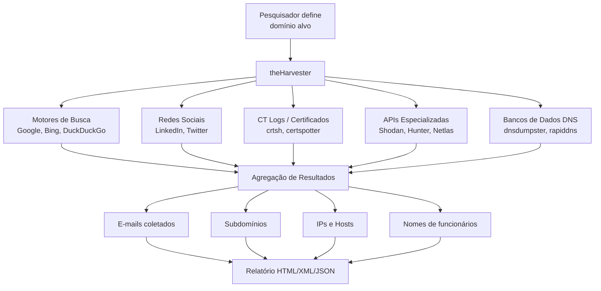
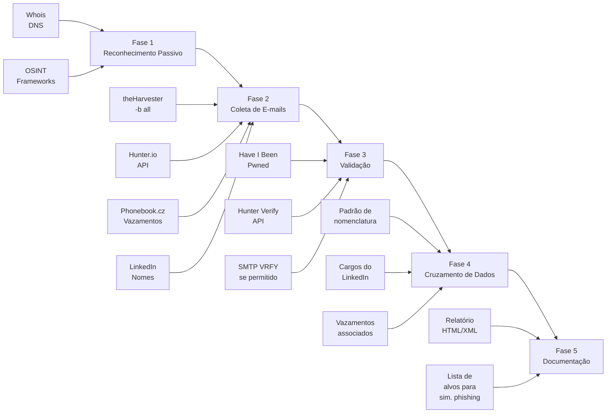
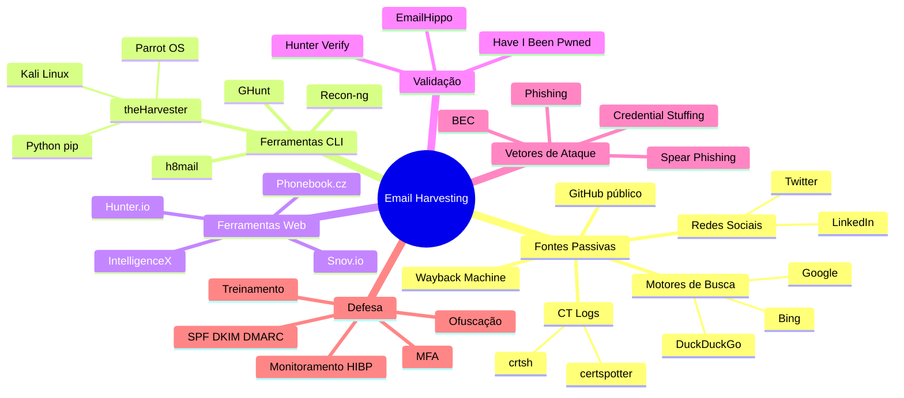

# Email Harvesting

> [!quote] Coletando Contatos
> *E-mails são a porta de entrada para ataques de phishing e engenharia social.*

---

## 🎯 O que é Email Harvesting?

> [!success] Definição
> **Email Harvesting** é o processo de coletar endereços de e-mail de um determinado domínio ou alvo por meio de fontes públicas e abertas, sem necessidade de acesso não autorizado a sistemas. É uma etapa essencial da fase de reconhecimento (reconnaissance) em qualquer teste de penetração ou avaliação de red team.

A coleta de e-mails é **passiva por natureza**: você não envia pacotes para o alvo, não acessa sistemas internos e não viola nenhum dado privado. Você apenas agrega informações que estão disponíveis publicamente na internet, seja em motores de busca, redes sociais, registros de domínio, certificados SSL ou bancos de dados de vazamentos.

Porém, os dados coletados podem ser usados de forma maliciosa. Por isso, a prática é ensinada aqui com foco **defensivo e educacional**, dentro de um contexto de pentest autorizado ou de análise da exposição do seu próprio domínio.

### Por que e-mails são valiosos para um atacante?

Um endereço de e-mail corporativo revela muito mais do que apenas um canal de contato:

- **Padrão de nomenclatura**: descobrir `joao.silva@empresa.com.br` frequentemente significa que `maria.costa@empresa.com.br` também existe. O atacante pode inferir centenas de endereços válidos a partir de um único.
- **Nome completo do funcionário**: combinado com LinkedIn, revela cargo, departamento e senioridade, informações valiosas para ataques de spear phishing.
- **Domínio e subdomínios**: o mesmo domínio do e-mail pode levar à descoberta de `mail.empresa.com.br`, `vpn.empresa.com.br`, `intranet.empresa.com.br`.
- **Pertença a vazamentos**: se o e-mail aparece em bases como Have I Been Pwned, há chance de a senha associada ainda estar em uso (credential stuffing).
- **Vetor de phishing**: com uma lista de e-mails válidos, um atacante pode montar campanhas de phishing altamente direcionadas.

### Informações Coletáveis

| Tipo | Utilidade para o atacante | Utilidade para defesa |
|------|--------------------------|----------------------|
| **E-mails** | Phishing, engenharia social, credential stuffing | Auditar exposição pública |
| **Padrão de e-mail** | Enumerar toda a organização | Restringir publicação em sites |
| **Subdomínios** | Mapear infraestrutura | Identificar ativos esquecidos |
| **Hosts / IPs** | Identificar dispositivos e serviços | Inventariar superfície de ataque |
| **Nomes de funcionários** | Engenharia social direcionada | Conscientizar colaboradores |
| **Portas abertas** | Identificar serviços vulneráveis | Fechar portas desnecessárias |
| **Banners de serviço** | Versões de software com CVEs conhecidos | Atualizar sistemas expostos |
| **Certificados SSL** | Enumeração de subdomínios via CT logs | Auditar certificados emitidos |

---

## ⚖️ Aspectos Legais e Éticos

> [!danger] 🚨 Leia antes de executar qualquer comando
> Coletar e-mails de domínios **sem autorização** pode configurar crime no Brasil. Use sempre em ambientes controlados, com autorização por escrito ou no seu próprio domínio.

### Legislação Brasileira Aplicável

**Art. 154-A do Código Penal (incluído pela Lei 12.737/2012, "Lei Carolina Dieckmann"):**

```
Invadir dispositivo informático alheio, conectado ou não à rede de computadores,
mediante violação indevida de mecanismo de segurança e com o fim de obter,
adulterar ou destruir dados ou informações [...]:
Pena: detenção, de 3 (três) meses a 1 (um) ano, e multa.
```

Embora o harvesting de e-mails em si seja passivo, o uso dos dados coletados para envio de phishing, spam ou para invadir sistemas configura crimes adicionais, incluindo estelionato (art. 171 CP), falsa identidade (art. 307 CP) e violação de dados pessoais (LGPD, Lei 13.709/2018, art. 42 a 45).

**LGPD (Lei 13.709/2018):** endereços de e-mail são dados pessoais. Coletá-los de forma automatizada para fins comerciais ou ilícitos viola a LGPD, sujeitando o infrator a multas de até 2% do faturamento, limitadas a R$ 50 milhões por infração.

> [!warning] Regra de ouro
> **Pratique sempre no seu próprio domínio ou em domínios para os quais você tem autorização expressa e por escrito.** Em laboratório, use domínios de teste como `testphp.vulnweb.com`, `hackerone.com` (programa público), ou crie o seu próprio.

---

## 🛠️ theHarvester

> [!tip] Ferramenta Principal
> **theHarvester** é a ferramenta mais utilizada para email harvesting em pentests. Já vem instalada no Kali Linux e no Parrot OS. Escrita em Python, é open source e mantida ativamente no GitHub.

[🔗 GitHub: laramies/theHarvester](https://github.com/laramies/theHarvester)
[🔗 Kali Linux Tools: theharvester](https://www.kali.org/tools/theharvester/)

### Como Funciona (Arquitetura Interna)



### Instalação (caso não esteja no Kali)

```bash
# Clonar o repositório
git clone https://github.com/laramies/theHarvester.git
cd theHarvester

# Criar ambiente virtual e instalar dependências
python3 -m venv venv
source venv/bin/activate
pip install -r requirements/base.txt

# Verificar instalação
python3 theHarvester.py -h
```

No Kali Linux, a ferramenta já está disponível como `theHarvester` (sem necessidade de clonar).

### Configuração de Chaves de API

Muitas fontes avançadas exigem chave de API. O arquivo de configuração fica em:

```bash
# Kali Linux (instalação via apt)
/etc/theHarvester/api-keys.yaml

# Instalação manual (git clone)
./api-keys.yaml
```

Exemplo de configuração do arquivo:

```yaml
apikeys:
  hunter:
    key: SUA_CHAVE_HUNTER_IO
  shodan:
    key: SUA_CHAVE_SHODAN
  github:
    key: SUA_CHAVE_GITHUB
  securitytrails:
    key: SUA_CHAVE_SECURITYTRAILS
  intelx:
    key: SUA_CHAVE_INTELX
    id: SEU_ID_INTELX
  netlas:
    key: SUA_CHAVE_NETLAS
```

### Parâmetros Completos

| Parâmetro | Descrição | Exemplo |
|-----------|-----------|---------|
| `-d` | Domínio alvo (obrigatório) | `-d empresa.com.br` |
| `-b` | Fonte de busca (obrigatório) | `-b google` ou `-b all` |
| `-l` | Limite de resultados por fonte | `-l 500` |
| `-f` | Salvar resultado em arquivo (HTML + XML) | `-f resultado_empresa` |
| `-v` | Verificar hosts via DNS reverso | `-v` |
| `-n` | Realizar lookup DNS nos hosts descobertos | `-n` |
| `-c` | Realizar busca de certificado no crtsh | `-c` |
| `-e` | Usar servidor DNS específico | `-e 8.8.8.8` |
| `-r` | Quantidade de threads para DNS | `-r 50` |
| `-s` | Iniciar DNS brute force | `-s` |
| `--screenshot` | Capturar screenshot dos subdomínios encontrados | `--screenshot ./screenshots` |

### Fontes Disponíveis (2026)

| Fonte | Tipo de Dados | Requer API |
|-------|---------------|-----------|
| `google` | E-mails, hosts, subdomínios | Não |
| `bing` | E-mails, hosts | Não |
| `duckduckgo` | E-mails, hosts | Não |
| `brave` | E-mails, hosts | Não |
| `yahoo` | E-mails, hosts | Não |
| `linkedin` | Nomes de funcionários, cargos | Não |
| `twitter` | Perfis relacionados | Não |
| `crtsh` | Subdomínios via CT logs | Não |
| `certspotter` | Subdomínios via CT logs | Não |
| `dnsdumpster` | Registros DNS, subdomínios | Não |
| `hackertarget` | Subdomínios, IPs | Não |
| `rapiddns` | Subdomínios | Não |
| `robtex` | Registros DNS | Não |
| `urlscan` | URLs, subdomínios | Não |
| `waybackarchive` | URLs históricas, e-mails em páginas antigas | Não |
| `commoncrawl` | E-mails, URLs, subdomínios | Não |
| `otx` | IPs, domínios (AlienVault OTX) | Não |
| `hunter` | E-mails corporativos verificados | Sim |
| `shodan` | IPs, portas, banners | Sim |
| `securityTrails` | DNS, subdomínios históricos | Sim |
| `intelx` | E-mails em vazamentos, dark web | Sim |
| `netlas` | IPs, hosts, certificados | Sim |
| `github-code` | E-mails em repositórios públicos | Sim |
| `gitlab` | E-mails em repositórios GitLab | Sim |
| `censys` | Hosts, certificados, IPs | Sim |
| `fullhunt` | Subdomínios, ativos expostos | Sim |
| `leakix` | Serviços expostos e vulneráveis | Sim |
| `zoomeye` | Dispositivos e serviços expostos | Sim |
| `criminalip` | IPs maliciosos, hosts | Sim |
| `haveibeenpwned` | E-mails em vazamentos | Sim |
| `all` | Todas as fontes disponíveis | Varia |

---

## 💻 Exemplos Práticos

### Coleta Básica (um motor de busca)

```bash
# Buscar e-mails e subdomínios via Google
theHarvester -d kali.org -l 200 -b google

# Buscar via Bing (menos bloqueio de scrapers)
theHarvester -d empresa.com.br -l 500 -b bing

# Buscar via DuckDuckGo
theHarvester -d empresa.com.br -l 300 -b duckduckgo
```

### Coleta em Fontes Múltiplas

```bash
# Usar todas as fontes disponíveis (incluindo as sem API)
theHarvester -d empresa.com.br -l 500 -b all

# Combinar fontes específicas (separadas por vírgula)
theHarvester -d empresa.com.br -l 500 -b google,bing,crtsh,dnsdumpster,linkedin
```

### Coleta com Verificação de Hosts e Relatório

```bash
# Coletar, verificar hosts e salvar resultado
theHarvester -d empresa.com.br -l 500 -b all -f relatorio_empresa -v

# Salva dois arquivos:
#   relatorio_empresa.html  (abrível no navegador)
#   relatorio_empresa.xml   (processável por scripts)
```

### Coleta com Subdomínios via CT Logs

```bash
# Certificate Transparency Logs revelam subdomínios históricos
theHarvester -d empresa.com.br -b crtsh,certspotter -c

# Exemplo de saída esperada:
# [*] Hosts found: 14
# mail.empresa.com.br
# vpn.empresa.com.br
# intranet.empresa.com.br
# dev.empresa.com.br
# staging.empresa.com.br
```

### Coleta com APIs Configuradas

```bash
# Com Hunter.io e Shodan configurados no api-keys.yaml
theHarvester -d empresa.com.br -l 500 -b hunter,shodan,securityTrails

# Buscar e-mails em repositórios GitHub públicos
theHarvester -d empresa.com.br -b github-code -l 200
```

### Automatizando Coleta em Script

```bash
#!/bin/bash
# harvest.sh: coleta e-mails de um domínio e salva com timestamp

DOMINIO=$1
TIMESTAMP=$(date +%Y%m%d_%H%M%S)
SAIDA="harvest_${DOMINIO}_${TIMESTAMP}"

echo "[*] Iniciando coleta para: $DOMINIO"
theHarvester -d "$DOMINIO" -l 500 -b google,bing,crtsh,dnsdumpster,linkedin,urlscan \
    -f "$SAIDA" -v

echo "[*] Resultados salvos em: ${SAIDA}.html e ${SAIDA}.xml"
```

```bash
chmod +x harvest.sh
./harvest.sh exemplo.com.br
```

---

## 🌐 Ferramentas Online Complementares

> [!info] Ferramentas Web e APIs
> Estas ferramentas complementam o theHarvester e podem encontrar e-mails que motores de busca não indexam.

| Ferramenta | URL | Plano Gratuito | Descrição |
|------------|-----|---------------|-----------|
| **Hunter.io** | [hunter.io](https://hunter.io) | 25 buscas/mês | Busca e verifica e-mails corporativos; infere padrão de nomenclatura |
| **Phonebook.cz** | [phonebook.cz](https://phonebook.cz) | Ilimitado | Busca e-mails, domínios e URLs em vazamentos; integrado ao IntelligenceX |
| **Snov.io** | [snov.io](https://snov.io) | 50 créditos/mês | Encontra e verifica e-mails; extensão para LinkedIn |
| **RocketReach** | [rocketreach.co](https://rocketreach.co) | 5 buscas/mês | E-mails e telefones de profissionais |
| **Skrapp.io** | [skrapp.io](https://skrapp.io) | 150 buscas/mês | E-mails de LinkedIn e sites corporativos |
| **Clearbit Connect** | [clearbit.com](https://clearbit.com) | Limitado | Extensão Chrome; preenche e-mails no Gmail |
| **Have I Been Pwned** | [haveibeenpwned.com](https://haveibeenpwned.com) | Ilimitado | Verifica se e-mail está em vazamento; API gratuita |
| **IntelligenceX** | [intelx.io](https://intelx.io) | Limitado | Busca e-mails em dark web, Tor, pastes, Usenet |

### Hunter.io: Uso Prático via API

```bash
# Substituir SUA_CHAVE pela chave gratuita obtida em hunter.io
CHAVE="SUA_CHAVE_HUNTER_IO"
DOMINIO="empresa.com.br"

# Buscar todos os e-mails do domínio
curl "https://api.hunter.io/v2/domain-search?domain=${DOMINIO}&api_key=${CHAVE}" \
  | python3 -m json.tool

# Verificar se um e-mail específico existe
curl "https://api.hunter.io/v2/email-verifier?email=joao@${DOMINIO}&api_key=${CHAVE}" \
  | python3 -m json.tool

# Descobrir padrão de e-mail da organização
# A resposta inclui o campo "pattern": "first.last", "{first}last", etc.
```

### Phonebook.cz: Busca Manual

```
1. Acessar: https://phonebook.cz
2. Selecionar tipo: "Email addresses"
3. Digitar o domínio alvo: empresa.com.br
4. Clicar em Search
5. Resultados listam e-mails encontrados em vazamentos
6. Clicar em "IntelligenceX" para ver em qual vazamento cada e-mail apareceu
```

---

## 🔍 Outras Ferramentas CLI

| Ferramenta | Instalação | Comando Principal | Diferencial |
|------------|-----------|-------------------|-------------|
| **Recon-ng** | `apt install recon-ng` | `recon-ng -m recon/domains-contacts/whois_pocs` | Framework modular; dozens de módulos OSINT |
| **Maltego** | maltego.com | Interface gráfica | Visualização de relacionamentos em grafo |
| **Infoga** | `pip install infoga` | `infoga --domain empresa.com.br --source all` | Coleta info de e-mails específicos |
| **SimplyEmail** | GitHub | `python3 SimplyEmail.py -all -e empresa.com.br` | Foco em e-mails; múltiplas fontes |
| **Emailharvester** | `pip install emailharvester` | `emailharvester -d empresa.com.br` | Script simples em Python |
| **h8mail** | `pip install h8mail` | `h8mail -t email@empresa.com.br` | Verifica e-mails em bases de vazamento |
| **GHunt** | GitHub | `ghunt email analise email@gmail.com` | OSINT específico de contas Google/Gmail |

### Recon-ng: Módulos de E-mail

```bash
# Iniciar o Recon-ng
recon-ng

# Dentro do Recon-ng:
[recon-ng][default] > workspaces create empresa_pentest
[recon-ng][empresa_pentest] > db insert domains
domain (TEXT): empresa.com.br

# Usar módulo de coleta de e-mails via Google
[recon-ng][empresa_pentest] > modules load recon/domains-contacts/whois_pocs
[recon-ng][empresa_pentest][whois_pocs] > run

# Usar módulo de e-mails via Bing
[recon-ng][empresa_pentest] > modules load recon/domains-contacts/bing_linkedin_cache
[recon-ng][empresa_pentest][bing_linkedin_cache] > run

# Ver e-mails coletados
[recon-ng][empresa_pentest] > show contacts
```

---

## 🔗 Fluxo Completo de Email Harvesting em Pentest



---

## 🧪 Atividades Práticas

> [!example] 🧪 Atividade 1: Coleta com theHarvester em Domínio Público
>
> **Objetivo:** Executar o theHarvester contra um domínio público e analisar os resultados.
>
> **Alvo sugerido:** `kali.org` (domínio oficial do Kali Linux, pentest-friendly) ou o domínio do seu instituto de ensino.
>
> **Passo a passo:**
>
> ```bash
> # 1. Coletar usando Google e crtsh
> theHarvester -d kali.org -l 300 -b google,bing,crtsh,dnsdumpster -f kali_resultado
>
> # 2. Abrir relatório HTML no navegador
> firefox kali_resultado.html
>
> # 3. Anotar:
> #    - Quantos e-mails foram encontrados?
> #    - Qual o padrão de nomenclatura dos e-mails?
> #    - Quantos subdomínios foram descobertos?
> #    - Algum subdomínio parece ser de desenvolvimento/staging?
>
> # 4. Tentar com todas as fontes (mais demorado)
> theHarvester -d kali.org -l 500 -b all -f kali_completo
> ```
>
> **Resultado esperado:**
> ```
> [*] Emails found: 3
>   contact@kali.org
>   devel@kali.org
>   ...
>
> [*] Hosts found: 47
>   archive-5.kali.org:x.x.x.x
>   bugs.kali.org:x.x.x.x
>   cdimage.kali.org:x.x.x.x
>   git.kali.org:x.x.x.x
>   ...
> ```
>
> **Reflexão:** Que informações um atacante poderia extrair desses subdomínios? Quais representam maior risco?

---

> [!example] 🧪 Atividade 2: Verificação em Have I Been Pwned
>
> **Objetivo:** Verificar se e-mails coletados aparecem em vazamentos de dados conhecidos.
>
> **Passo a passo:**
>
> ```bash
> # 1. Coletar e-mails do alvo
> theHarvester -d kali.org -l 200 -b google,crtsh | grep "@" | sort -u > emails.txt
> cat emails.txt
>
> # 2. Verificar manualmente no site
> #    Acessar: https://haveibeenpwned.com
> #    Digitar cada e-mail encontrado
>
> # 3. Verificação via API (gratuita para uso pessoal)
> EMAIL="email@kali.org"
> curl -s -A "PentestLabIFF/1.0" \
>   "https://haveibeenpwned.com/api/v3/breachedaccount/${EMAIL}" \
>   -H "hibp-api-key: SUA_CHAVE_HIBP" \
>   | python3 -m json.tool
>
> # 4. Para cada e-mail vazado, anotar:
> #    - Em qual vazamento apareceu?
> #    - Qual tipo de dado foi exposto (senha, endereço, etc.)?
> #    - Quando ocorreu o vazamento?
> ```
>
> **Reflexão:** Se a senha do vazamento ainda estiver em uso, o que um atacante poderia fazer com ela? O que é "credential stuffing"?

---

> [!example] 🧪 Atividade 3: Identificar Padrão de E-mail com Hunter.io
>
> **Objetivo:** Descobrir o padrão de nomenclatura de e-mails de uma organização pública.
>
> **Passo a passo:**
>
> ```bash
> # 1. Cadastrar-se em hunter.io (gratuito: 25 buscas/mês)
>
> # 2. Via interface web:
> #    - Acessar: https://hunter.io/domain-search
> #    - Digitar o domínio: iff.edu.br (ou outro domínio público)
> #    - Analisar o padrão exibido: {first}.{last}@dominio ou {f}{last}@dominio
>
> # 3. Via API (após obter chave):
> CHAVE="SUA_CHAVE_HUNTER"
> DOMINIO="iff.edu.br"
>
> curl -s "https://api.hunter.io/v2/domain-search?domain=${DOMINIO}&api_key=${CHAVE}" \
>   | python3 -c "
> import json,sys
> d = json.load(sys.stdin)['data']
> print('Padrão:', d.get('pattern','N/A'))
> print('Total estimado:', d.get('total','N/A'))
> print()
> for e in d.get('emails',[])[:10]:
>     print(f\"{e['value']} ({e['type']}) - score: {e.get('confidence','N/A')}\")
> "
>
> # 4. Combinar com theHarvester para validar:
> theHarvester -d iff.edu.br -l 100 -b google,linkedin -f iff_coleta
> ```
>
> **Reflexão:** Com o padrão descoberto e uma lista de funcionários do LinkedIn, quantos e-mails você poderia enumerar sem coleta adicional?

---

## 🛡️ Defesa: Reduzindo a Exposição de E-mails

> [!info] Perspectiva Defensiva
> Entender como atacantes coletam e-mails permite implementar contramedidas eficazes. Abaixo estão as principais técnicas para reduzir a superfície de ataque.

### Por que Reduzir a Exposição?

A exposição de e-mails corporativos aumenta diretamente o risco de:

1. **Phishing dirigido (spear phishing)**: e-mail personalizado com nome, cargo e contexto real do alvo.
2. **Credential stuffing**: se o e-mail aparece em um vazamento, a senha pode ser reutilizada em outros sistemas.
3. **BEC (Business Email Compromise)**: atacante finge ser o CEO ou CFO para solicitar transferências.
4. **Reconhecimento organizacional**: mapeamento completo de funcionários e hierarquia.

### Medidas de Proteção

| Medida | Como Implementar | Eficácia |
|--------|-----------------|---------|
| **Não publicar e-mails em texto claro** | Usar formulários de contato em vez de `mailto:` | Alta |
| **Ofuscação de e-mail no site** | Substituir `@` por `[at]` ou usar JavaScript para renderizar | Média |
| **SPF, DKIM e DMARC** | Configurar registros DNS: evita spoofing do domínio | Alta |
| **Endereços de função** | `contato@`, `suporte@` em vez de e-mails pessoais | Alta |
| **Monitorar CT Logs** | Usar crt.sh e alertas do certspotter para novos certs | Média |
| **Google Alerts** | Alerta para o domínio: detecta novas menções | Baixa/Média |
| **Treinamento de phishing** | Campanhas internas simuladas (Gophish, KnowBe4) | Alta |
| **MFA em todos os serviços** | E-mail + senha capturada não basta para logar | Muito Alta |
| **Monitorar HIBP** | API do HIBP com notificação para o domínio | Alta |
| **Política de e-mails** | Proibir uso de e-mail corporativo em fóruns públicos | Média |

### Configurando SPF, DKIM e DMARC

```bash
# Verificar se o domínio já tem SPF configurado
dig TXT empresa.com.br | grep "v=spf"

# Verificar DMARC
dig TXT _dmarc.empresa.com.br

# Verificar DKIM (substituir "selector" pelo seletor usado pelo provedor)
dig TXT selector._domainkey.empresa.com.br

# Exemplo de registro SPF mínimo (só o Google pode enviar em nome do domínio):
# v=spf1 include:_spf.google.com ~all

# Exemplo de DMARC básico (monitoramento, sem rejeição):
# v=DMARC1; p=none; rua=mailto:dmarc@empresa.com.br

# DMARC com rejeição total:
# v=DMARC1; p=reject; rua=mailto:dmarc@empresa.com.br
```

### Conexão com Engenharia Social

O email harvesting é sempre a etapa anterior ao ataque real. Um atacante que coletou e-mails pode:

1. Montar uma campanha de phishing: ver **[[Engenharia social]]**
2. Descobrir credenciais vazadas e tentar reutilizá-las
3. Usar os nomes de funcionários para se passar por colaboradores internos
4. Identificar alvos de alto valor (CFO, TI, RH) para BEC

Por isso, treinamento de conscientização e simulações de phishing são tão importantes quanto as medidas técnicas de proteção.

---

## 🗺️ Mapa Mental: Ecossistema de Email Harvesting



---

## 📋 Checklist Prático para Red Team

> [!tip] Use este checklist durante a fase de reconhecimento passivo

```
[ ] 1. Coletar e-mails com theHarvester (google, bing, crtsh, dnsdumpster, linkedin)
[ ] 2. Salvar resultado em HTML e XML para o relatório
[ ] 3. Verificar subdomínios encontrados: identificar ambientes de dev/staging
[ ] 4. Confirmar padrão de nomenclatura via Hunter.io
[ ] 5. Cruzar e-mails com Phonebook.cz e IntelligenceX
[ ] 6. Verificar e-mails no Have I Been Pwned
[ ] 7. Buscar e-mails em repositórios GitHub públicos (theHarvester -b github-code)
[ ] 8. Documentar todos os e-mails, cargos e departamentos identificados
[ ] 9. Identificar alvos de alto valor (C-level, TI, RH, Financeiro)
[ ] 10. Registrar tudo no relatório de pentest antes de avançar para a próxima fase
```

---

> [!note] 📚 Fontes (2026)
>
> - [GitHub: laramies/theHarvester (repositório oficial)](https://github.com/laramies/theHarvester)
> - [Kali Linux Tools: theharvester](https://www.kali.org/tools/theharvester/)
> - [Ultimate theHarvester Cheat Sheet (2026): OSINT & Recon Commands](https://blog.cybersamir.com/theharvester-cheat-sheet/)
> - [theHarvester: Hackviser Guide](https://hackviser.com/tactics/tools/the-harvester)
> - [OSINT: Scraping Email Addresses with TheHarvester: Hackers Arise](https://hackers-arise.com/osint-scraping-email-addresses-with-theharvester/)
> - [Best OSINT Email Lookup Tools in 2026 (Tested): Prospeo](https://prospeo.io/s/osint-email-lookup-tools)
> - [Discovering Email Addresses: Pentest Everything](https://viperone.gitbook.io/pentest-everything/everything/everything-osint/discovering-email-addresses)
> - [Hunter.io Email Finder 2026](https://hunter.io/)
> - [Open Source Intelligence Tools: IntelligenceX](https://intelx.io/tools)
> - [Phishing 2026: Guia de proteção para empresas](https://blog.starti.com.br/phishing-guia-de-protecao/)
> - [Lei Carolina Dieckmann (Lei 12.737/2012): projuris.com.br](https://www.projuris.com.br/blog/lei-carolina-dieckman-tudo-o-que-voce-precisa-saber-sobre/)
> - [LGPD e Phishing: Machertecnologia](https://www.machertecnologia.com.br/lgpd-protecao-dados-ataques-phishing/)
