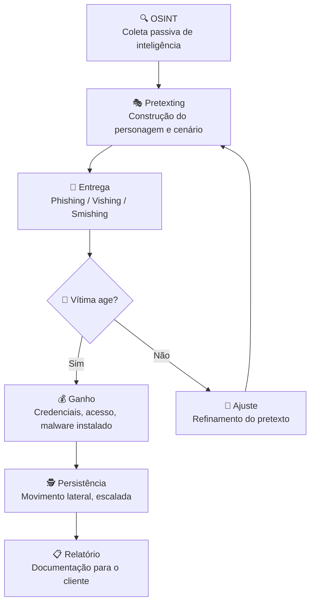

# Engenharia Social

> [!quote] O Fator Humano
> *"A engenharia social é a arte de manipular pessoas para que revelem informações confidenciais. O elo mais fraco na segurança sempre é o ser humano."*

> [!danger] Este tópico é de Segurança Ofensiva
> Aqui você aprende a **pensar como o atacante**. O que separa o red teamer do criminoso é uma única palavra: **autorização**. Toda técnica ensinada aqui é praticada em ambientes que você controla (seu lab, VMs, caixas de teste, CTF) ou em alvos que concederam permissão por escrito. O art. 154-A do Código Penal Brasileiro tipifica invasão sem autorização com pena de 3 meses a 1 ano de detenção. Conhecer o ataque é o primeiro passo para defendê-lo, e para executá-lo de forma profissional e legal.

---

## 🎭 O que é Engenharia Social?

> [!info] Definição
> Engenharia social é o uso de manipulação psicológica para enganar pessoas e fazê-las tomar ações ou divulgar informações confidenciais.

Na prática do red team, engenharia social não é apenas "mandar um e-mail falso". É uma **cadeia de inteligência e influência** que começa muito antes do primeiro contato com a vítima. O atacante estuda, planeja, ensaia e só então age.

Segundo o Relatório DBIR 2025 da Verizon, **74% de todas as violações de dados envolvem um elemento humano**, seja via engenharia social, uso indevido de credenciais ou erro humano. Phishing e engenharia social respondem por 37% das violações (IBM Cost of a Data Breach 2025, custo médio de US\$ 4,88 milhões por incidente).

---

## 🧠 A Psicologia do Ataque: Princípios de Cialdini

Robert Cialdini identificou sete princípios de influência e persuasão. Red teamers e atacantes os exploram sistematicamente. Conhecê-los é entender **por que os ataques funcionam**.

| # | Princípio | Como o atacante usa | Exemplo em phishing |
|---|-----------|---------------------|---------------------|
| 1 | **Autoridade** | Imitar chefes, TI, banco, Receita Federal | "Sou do suporte de TI, preciso resetar sua senha agora" |
| 2 | **Urgência/Escassez** | Criar pressão de tempo, pânico | "Sua conta será bloqueada em 2 horas" |
| 3 | **Reciprocidade** | Dar algo antes de pedir | Enviar "brinde" (PDF útil) e depois pedir ação |
| 4 | **Prova Social** | Citar colegas, normas do grupo | "Todos do seu departamento já atualizaram os dados" |
| 5 | **Simpatia/Afinidade** | Construir rapport, imitar linguagem | Pesquisar interesses no LinkedIn e mencioná-los |
| 6 | **Comprometimento/Consistência** | Obter pequenas concessões antes da grande | Pedir algo pequeno primeiro; depois o pedido real |
| 7 | **Unidade** | Criar senso de pertencimento ao grupo | "Como membros da mesma equipe, precisamos agir juntos" |

> [!tip] Para o red teamer
> Pesquisa publicada na Springer (WISE 2024) confirmou que **Autoridade e Prova Social são os gatilhos mais eficazes** em contextos de engenharia social. Escassez, embora menos potente isolada, amplifica qualquer outro gatilho quando combinada.

---

## 🗺️ Cadeia de Ataque: Do OSINT ao Ganho

O red team não improvisa. Toda campanha de engenharia social segue uma cadeia estruturada:



### Fase 1: OSINT (Reconhecimento Passivo)

O atacante coleta informações **sem contato direto** com o alvo. As fontes mais ricas:

- **LinkedIn:** cargo, hierarquia, ferramentas usadas, projetos recentes, nome do gestor
- **Site corporativo:** comunicados, estrutura de e-mail (ex: `nome.sobrenome@empresa.com`), nomes de executivos
- **Redes sociais pessoais:** rotina, viagens, eventos recentes, relacionamentos
- **Google Hacking:** arquivos expostos, diretórios abertos, metadados de documentos
- **Shodan/Censys:** infraestrutura exposta da empresa alvo
- **Registros WHOIS, DNS, certificados TLS:** histórico de domínios, subdomínios

Ferramentas de OSINT usadas profissionalmente: **Maltego** (correlação visual de entidades), **recon-ng**, **theHarvester**, **SpiderFoot**.

Ver também: [[Information Gathering Frameworks (OSINT)]], [[Coleta de informações]], [[Email harvesting]]

### Fase 2: Pretexting (Construção do Cenário)

Com a inteligência coletada, o red teamer constrói um **personagem crível** e um **cenário plausível**:

- Quem é o atacante? (técnico de TI, auditor externo, colega de outro campus, fornecedor)
- Qual é a história? (atualização urgente, auditoria de compliance, entrega de prêmio)
- Qual é o vetor? (e-mail, telefone, pessoalmente, USB)
- Qual gatilho de Cialdini será ativado?

Um pretexto bem construído usa detalhes reais coletados via OSINT para ganhar credibilidade imediata.

### Fase 3: Entrega (Execução do Ataque)

O pretexto é entregue ao alvo pelo canal escolhido. Detalhes de cada vetor nas seções abaixo.

### Fase 4: Ganho e Persistência

Após a vítima executar a ação desejada, o atacante colhe o fruto: credencial, sessão ativa, arquivo com dados, acesso físico. Em um pentest real, este é o ponto onde o relatório documenta o "ponto de entrada" conquistado.

---

## 🎣 Tipos de Ataques

### Phishing

E-mails ou mensagens falsas que se passam por entidades legítimas para roubar credenciais.

#### Spear Phishing: O Ataque Cirúrgico

O phishing genérico tem taxa de clique de cerca de 12%. O **spear phishing** (direcionado a um indivíduo específico, usando informações reais coletadas via OSINT) alcança **54% de taxa de clique** em estudos recentes (Adaptive Security, 2026). A diferença é a personalização.

Elementos de um spear phishing de alto impacto:
1. Nome correto da vítima e do gestor/colega mencionado
2. Referência a projeto real (obtido via LinkedIn ou site institucional)
3. E-mail remetente com domínio parecido (typosquatting: `g00gle.com`, `iff-edu.br`)
4. Assunto que ativa Autoridade + Urgência
5. Link para landing page clonada (credential harvesting)

**Evolução em 2025/2026:** Desde setembro 2024, 82,6% dos e-mails de phishing usam IA generativa na construção do texto. Em março de 2025, um agente de IA (codenamed JKR) obteve taxa de sucesso **23,8% maior** que equipes humanas de red team em campanhas de spear phishing (GBHackers, 2025). A IA analisa LinkedIn, postagens públicas e comunicados internos expostos para gerar mensagens indistinguíveis de comunicações legítimas.

**Ferramenta para lab:** **GoPhish** (open source, gratuito).

### Vishing

Phishing por telefone (voice phishing).

#### Vishing com Deepfake de Voz

Em 2025, ataques de vishing com voz sintética explodiram: **alta de 1.600% no primeiro trimestre de 2025** em relação ao final de 2024 (Right Hand AI, 2025). Atacantes clonam vozes de executivos a partir de **apenas 3 segundos de áudio** (disponível em vídeos do YouTube, podcasts, calls gravadas).

Plataformas como Xanthorox AI automatizam clonagem de voz e entrega em chamada ao vivo, integrando com Microsoft Teams, Zoom e VoIP empresarial. O "CEO" ou "CTO" da empresa liga para um colaborador solicitando transferência bancária urgente ou credencial de VPN.

No contexto de red team, o vishing educacional usa o SET (Social-Engineer Toolkit) para simular chamadas e medir a resposta dos colaboradores. Em um lab controlado, o red teamer liga para si mesmo ou para colegas consentidos.

### Smishing

Phishing por SMS. Usa urgência extrema e links encurtados. Comum em fraudes bancárias e de entrega (correios falsos).

### Pretexting

Criar um cenário falso para obter informações da vítima. Como visto na cadeia de ataque, o pretexting não é um ataque isolado: é a espinha dorsal de todos os outros vetores. O pretexto define a história; phishing/vishing/smishing são os canais de entrega.

### Baiting

Deixar dispositivos infectados (USBs) em locais públicos. Variante moderna: arquivos maliciosos disfarçados de "Salários 2026.xlsx" compartilhados em drives corporativos ou enviados como anexo.

> [!warning] Experimento real
> Em estudos clássicos de segurança (Starbucks/Google Campus), **45 a 98% dos pendrives encontrados** foram plugados em computadores sem verificação. O baiting continua eficaz em 2025.

### Tailgating

Seguir alguém autorizado para entrar em áreas restritas fisicamente. Variante moderna: o atacante chega carregando caixas (evoca reciprocidade: "vou segurar a porta pra você") ou se veste como técnico de manutenção.

---

## 🛠️ Ferramentas do Red Teamer

| Ferramenta | Categoria | Uso Principal | Licença |
|------------|-----------|---------------|---------|
| **GoPhish** | Phishing | Campanhas completas: e-mail, landing page, tracking | Open Source |
| **SET (Social-Engineer Toolkit)** | Multi-vetor | Phishing, clonagem de sites, payload, vishing | Open Source |
| **Maltego** | OSINT | Correlação visual de entidades (pessoas, domínios, IPs) | Freemium |
| **recon-ng** | OSINT | Framework modular de reconhecimento | Open Source |
| **theHarvester** | OSINT | Coleta de e-mails, subdomínios, IPs | Open Source |
| **Evilginx2** | Phishing avançado | Bypass de MFA via proxy reverso (lab avançado) | Open Source |
| **Zphisher** | Phishing rápido | Templates prontos de páginas clonadas | Open Source |

### GoPhish: Anatomia de uma Campanha

O GoPhish é o padrão de mercado para campanhas de phishing em red team e simulações de conscientização. Interface web amigável, métricas em tempo real, totalmente local.

Componentes de uma campanha:

```
GoPhish
├── Sending Profile     ← servidor SMTP (seu domínio de teste)
├── Email Template      ← corpo do e-mail com variáveis {{.FirstName}}, {{.URL}}
├── Landing Page        ← clone da página alvo (com captura de credencial)
├── Users & Groups      ← lista de alvos (CSV: First Name, Last Name, Email)
└── Campaign            ← junta os 4 acima, define data/hora de disparo
```

Métricas coletadas automaticamente: e-mails enviados, abertos, links clicados, credenciais submetidas, relatórios de phishing pela vítima.

### SET (Social-Engineer Toolkit): Vetor Múltiplo

O SET é um framework completo de engenharia social disponível nativamente no Kali Linux. Permite:

- Clonar qualquer site em segundos (`site cloner`)
- Criar payloads de engenharia social embutidos em PDFs ou arquivos Office
- Simular campanhas de spear phishing com integração de e-mail
- Executar ataques de vishing com scripts de pretexto

---

## 🔍 OSINT Ofensivo: Montando o Dossiê da Vítima

O OSINT ofensivo converte dados públicos em **inteligência acionável**. O processo padrão de um red teamer:

```mermaid
flowchart LR
    subgraph Fontes Passivas
        A[LinkedIn]
        B[Site Corporativo]
        C[Redes Sociais]
        D[Google Hacking]
        E[Shodan / Censys]
        F[WHOIS / DNS]
    end
    subgraph Ferramentas
        G[Maltego]
        H[theHarvester]
        I[recon-ng]
    end
    subgraph Produto Final
        J[Mapa de Entidades<br/>Nomes, e-mails, cargos]
        K[Pretexto Personalizado]
        L[Vetor de Ataque]
    end
    Fontes Passivas --> Ferramentas --> J --> K --> L
```

**O que extrair do LinkedIn de um alvo:**
- Nome completo, foto, cargo atual e histórico
- Nome do gestor e dos pares (para mencionar no pretexto)
- Ferramentas e tecnologias listadas nas experiências
- Projetos recentes (para criar urgência contextual)
- Cursos, certificações, grupos que participa
- Padrão de postagem (horários ativos, temas de interesse)

Com esses dados, um pretexto genérico como "Clique aqui para atualizar sua senha" vira: *"Oi [Nome], vi que você está no projeto [projeto real]. Nosso time de TI precisa que você re-autentique no portal até hoje às 17h por conta da atualização do [sistema mencionado no perfil]. Link seguro abaixo."*

Ver também: [[Information Gathering Frameworks (OSINT)]], [[social media tools]], [[Google hacking]], [[shodan]], [[recon-ng]]

---

## ⚖️ Limite Legal: Art. 154-A do Código Penal Brasileiro

> [!danger] Linha Vermelha Legal
> O **art. 154-A do CP** (incluído pela Lei 12.737/2012, "Lei Carolina Dieckmann") tipifica:
>
> *"Invadir dispositivo informático alheio, conectado ou não à rede de computadores, mediante violação indevida de mecanismo de segurança e com o fim de obter, adulterar ou destruir dados ou informações sem autorização expressa ou tácita do titular do dispositivo ou instalar vulnerabilidades para obter vantagem ilícita."*
>
> **Pena:** detenção de 3 meses a 1 ano, e multa. Formas qualificadas chegam a 4 anos.
>
> O que torna o red team **legal**: autorização expressa, por escrito, definindo escopo, período e sistemas autorizados. Sem isso, qualquer técnica ensinada aqui é crime.

**O que o artigo NÃO cobre:** acesso a sistemas sem mecanismo de segurança (padrão de fábrica sem senha) não configura "violação indevida de mecanismo". Mas como profissional, você documenta tudo e opera sempre dentro do escopo assinado.

**Boas práticas de documentação para red teamers:**
- Contrato de escopo assinado pelo cliente
- Declaração de autorização com CNPJ/CPF e período
- Registro de todas as ações em log com timestamp
- Relatório final entregue ao contratante

---

## 🛡️ Como se Proteger

> [!success] Dicas de Proteção

1. **Desconfie** de e-mails e mensagens urgentes
2. **Verifique** a identidade de quem solicita informações
3. **Nunca clique** em links suspeitos
4. **Confirme** solicitações por outros canais
5. **Treine** funcionários regularmente

> [!tip] Perspectiva do Defensor
> A melhor defesa começa com **consciência dos gatilhos**. Treinar colaboradores a reconhecer Autoridade + Urgência como combinação suspeita reduz significativamente a taxa de clique em campanhas de phishing simuladas. Organizações que realizam simulações trimestrais reduzem em até 60% a vulnerabilidade a phishing após 12 meses (KnowBe4, 2025).

---

## 🧪 Atividades Mão na Massa (Ofensivas, Ambiente Legal)

> [!example] 🧪 Atividade 1: Campanha de Phishing com GoPhish contra Suas Próprias Caixas de Teste
>
> **Objetivo:** montar e disparar uma campanha completa de phishing em ambiente 100% controlado, observar métricas de engajamento e analisar o que tornou o e-mail eficaz ou não.
>
> **Pré-requisitos:** Docker ou Go instalado; conta de e-mail de teste (pode ser Gmail ou conta temporária em tempmail.com); VM ou container isolado.
>
> **Passos:**
>
> 1. Instale o GoPhish:
>    ```bash
>    # Via Docker (mais rápido)
>    docker run -d -p 3333:3333 -p 8080:8080 gophish/gophish
>    # Acesse: https://localhost:3333 (admin:gophish)
>    ```
> 2. Crie um **Sending Profile** apontando para um servidor SMTP local (Mailhog funciona bem em lab: `docker run -p 1025:1025 -p 8025:8025 mailhog/mailhog`).
> 3. Crie um **Email Template** com assunto urgente. Experimente dois: um genérico ("Atualize sua senha") e um personalizado com seu nome e referência a um projeto real. Use `{{.FirstName}}` e `{{.URL}}` como variáveis.
> 4. Crie uma **Landing Page**: clone a página de login do IFF ou de um serviço que você usa (opção "Import Site" no GoPhish). Ative "Capture Submitted Data".
> 5. Crie um **Users & Groups** com suas próprias contas de teste (mínimo 3 endereços diferentes: Gmail pessoal, e-mail IFF de teste, conta temporária).
> 6. Lance a campanha. Clique nos links nas suas caixas de teste.
>
> **Resultado observável:** no dashboard do GoPhish, você verá em tempo real: e-mail aberto, link clicado, credencial submetida. Compare a taxa de clique entre o e-mail genérico e o personalizado. Documente qual gatilho de Cialdini você ativou e por quê funcionou (ou não).
>
> **Reflexão:** O que você mudaria no template para aumentar a taxa de clique? O que na landing page denunciaria o ataque a um olhar mais atento?

---

> [!example] 🧪 Atividade 2: OSINT Ofensivo para Construir Seu Próprio Pretexto
>
> **Objetivo:** executar uma coleta de OSINT sobre **você mesmo** (ou sobre um colega que consentiu explicitamente), usando as mesmas fontes e ferramentas que um atacante usaria, e ao final construir um pretexto de spear phishing plausível.
>
> **Ferramentas:** theHarvester (terminal), LinkedIn (browser), Google Hacking (browser), Have I Been Pwned (haveibeenpwned.com).
>
> **Passos:**
>
> 1. **theHarvester:** colete e-mails e subdomínios associados ao domínio do IFF:
>    ```bash
>    theHarvester -d iff.edu.br -l 200 -b google,bing,linkedin
>    ```
>    Observe quais e-mails aparecem. O padrão de endereço revela o formato usado pela instituição.
>
> 2. **LinkedIn manual:** abra seu próprio perfil como se fosse um atacante. Liste: cargo, projetos recentes, ferramentas mencionadas, nome do chefe, grupos de interesse, cursos recentes.
>
> 3. **Google Hacking:** tente `site:iff.edu.br filetype:pdf "wesley"` ou `site:iff.edu.br "lista de alunos"`. Veja quais documentos internos estão expostos.
>
> 4. **Have I Been Pwned:** acesse `haveibeenpwned.com` e verifique se seu e-mail aparece em vazamentos. Se sim, quais dados vazaram? Senha em plaintext? Isso é ouro para um atacante de credential stuffing.
>
> 5. Com tudo coletado, **escreva um e-mail de spear phishing** direcionado a você mesmo. Use o nome do gestor real, mencione um projeto real, ative Autoridade + Urgência.
>
> **Resultado observável:** você terá um dossiê de inteligência sobre si mesmo e um e-mail de ataque personalizado. Mostre para um colega sem contexto e peça para ele avaliar se clicaria ou não. Discuta o que o convenceu e o que o fez desconfiar.
>
> **Variante avançada:** use o **Maltego Community Edition** (gratuito) para visualizar graficamente as relações entre seu e-mail, domínios, redes sociais e possíveis vazamentos.

---

> [!example] 🧪 Atividade 3: Calibrar o Olhar no Google Phishing Quiz
>
> **Objetivo:** treinar o reconhecimento visual de phishing com exemplos reais, calibrar o olhar antes e depois de aprender as técnicas ofensivas.
>
> **Ferramenta:** Google Phishing Quiz (gratuito, sem cadastro): `phishingquiz.withgoogle.com`
>
> **Passos:**
>
> 1. Acesse o quiz **antes** de revisar os outros materiais desta aula. Anote seu score.
> 2. Revise as seções de spear phishing, OSINT e princípios de Cialdini.
> 3. Refaça o quiz (ou use um simulador alternativo como o da OpenDNS). Anote o novo score.
> 4. Para cada e-mail no quiz, identifique: qual princípio de Cialdini foi explorado? Qual indicador técnico delata o phishing (remetente, URL, tom)?
>
> **Resultado observável:** melhora no score entre a primeira e a segunda tentativa. Lista de indicadores técnicos e psicológicos que você passou a perceber. Discussão em sala: qual e-mail do quiz foi mais difícil de identificar e por quê?

---

## 📊 Panorama de Ameaças 2025/2026

| Vetor | Crescimento (2024-2025) | Dado-chave |
|-------|------------------------|------------|
| Spear phishing com IA | Massivo | IA supera red teamers humanos em 23,8% de eficácia |
| Vishing com deepfake | +1.600% no Q1 2025 | 3 segundos de áudio bastam para clonar voz |
| Phishing geral com IA | Dominante | 82,6% dos e-mails maliciosos usam IA generativa |
| Custo médio de breach | Alta | US\$ 4,88 milhões (IBM 2025) |
| Fator humano em breaches | Estável e alto | 74% de todos os incidentes (Verizon DBIR 2025) |

---

## 📚 Para Aprender Mais

- [[Tipos de ataques|Tipos de Ataques]]: veja mais detalhes sobre ataques de engenharia social
- [[Tópicos/Segurança da informação/Conteúdo e materiais|Materiais]]: livros recomendados sobre o tema
- [[Information Gathering Frameworks (OSINT)]]: ferramentas e metodologias de reconhecimento passivo
- [[Coleta de informações]]: fase de reconhecimento no ciclo de pentest
- [[Email harvesting]]: técnicas de coleta de e-mails corporativos
- [[Google hacking]]: dorks e coleta via mecanismo de busca
- [[social media tools]]: ferramentas de OSINT em redes sociais
- [[recon-ng]]: framework modular de reconhecimento

---

> [!note] 📚 Fontes (2026)
>
> - [Red Teaming in 2026: The Bleeding Edge of Security Testing (CyCognito)](https://www.cycognito.com/learn/red-teaming/)
> - [Spear Phishing in 2026: Detection, Training & Prevention Guide (Adaptive Security)](https://www.adaptivesecurity.com/blog/spear-phishing-in-2026-the-complete-guide-to-detection-training-and-prevention)
> - [AI Surpasses Elite Red Teams in Crafting Effective Spear Phishing Attacks (GBHackers)](https://gbhackers.com/ai-surpasses-elite-red-teams-in-crafting/)
> - [Beyond Phishing: Next-Gen Social Engineering for Red Teams in 2025 (Medium)](https://karlaortizflores.medium.com/beyond-phishing-next-gen-social-engineering-for-red-teams-in-2025-e27725d921e7)
> - [The State of Deep Fake Vishing Attacks in 2025 (Right Hand AI)](https://right-hand.ai/blog/deep-fake-vishing-attacks-2025/)
> - [From Phishing to Vishing: The Sophistication of Social Engineering in 2025 (ANSecurity)](https://www.ansecurity.com/from-phishing-to-vishing-the-sophistication-of-social-engineering-in-2025/)
> - [The Voice of Fraud: Deepfake Vishing and the New Age of Social Engineering (Group-IB)](https://www.group-ib.com/resources/research-hub/voice-of-fraud/)
> - [How OSINT Turns LinkedIn Profiles Into Spear Phishing Blueprints (Optrics)](https://optrics.com/osint-linkedin-spear-phishing-blueprint/)
> - [Social Engineering in Red Teaming (RedTeamGarage)](https://www.redteamgarage.com/social-engineering-in-red-teaming/)
> - [Phishing Simulations with GoPhish: Complete Pentest Guide (RedFoxSec)](https://www.redfoxsec.com/blog/phishing-simulations-with-gophish)
> - [GoPhish Phishing Simulation Lab Guide](https://basil9099.github.io/homelab/phishing_simulation/)
> - [On How Cialdini's Persuasion Principles Influence Individuals in the Context of Social Engineering (Springer, WISE 2024)](https://link.springer.com/chapter/10.1007/978-981-96-0570-5_27)
> - [Crime de Invasão de Dispositivo Informático, art. 154-A CP (Jusbrasil)](https://www.jusbrasil.com.br/artigos/crime-de-invasao-de-dispositivo-informatico-artigo-154-a-cp/153070617)
