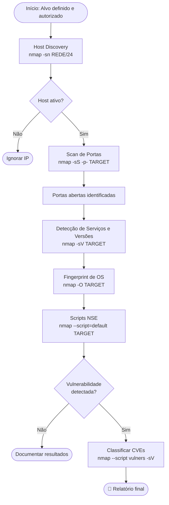

# Escaneamento de IPs e Portas (Port Scanning)

> [!quote] Mapeando a Rede
> *Descobrir quais hosts estão ativos e quais portas estão abertas é fundamental para qualquer teste de segurança.*

> [!info] Ferramentas do Trabalho
> Nmap e Masscan serão as principais ferramentas utilizadas.

> [!warning] ⚖️ Ética e Legalidade
> No Brasil, o acesso não autorizado a sistemas é crime previsto no **art. 154-A do Código Penal** (invasão de dispositivo informático), com pena de detenção de 3 meses a 1 ano, além de multa. Todo escaneamento deve ser realizado **somente em ambientes autorizados**: sua própria máquina, VMs de laboratório (Metasploitable, DVWA), plataformas de CTF (Hack The Box, TryHackMe) ou alvos explicitamente liberados como `scanme.nmap.org`. **Nunca escaneie redes ou IPs de terceiros sem autorização formal por escrito.**

---

## 🎯 O que é Port Scanning?

> [!success] Definição
> Port Scanner é um programa capaz de varrer endereços IPs em uma rede e também portas em determinados hosts.

O escaneamento de portas é uma das fases mais críticas do processo de [[Coleta de informações|reconhecimento]] em um teste de intrusão. Antes de explorar qualquer vulnerabilidade, o atacante (ou pentester autorizado) precisa saber:

- Quais hosts estão **ativos** na rede (host discovery)?
- Quais **portas** estão abertas nesses hosts?
- Quais **serviços e versões** estão rodando nessas portas?
- Qual é o **sistema operacional** da máquina alvo?

Esse conjunto de informações forma a base para o [[Mapeamento de vulnerabilidades]] e a [[Exploração do alvo|fase de exploração]].

### Portas e Estados

Uma porta TCP ou UDP pode estar em três estados distintos:

| Estado | Significado | O que acontece |
|--------|-------------|----------------|
| **open** (aberta) | Serviço ativo aceitando conexões | Retorna SYN-ACK (TCP) ou resposta UDP |
| **closed** (fechada) | Sem serviço, host acessível | Retorna RST (TCP) |
| **filtered** (filtrada) | Firewall ou filtro de pacotes bloqueando | Sem resposta ou ICMP unreachable |
| **open\|filtered** | Incerto: aberta ou filtrada | Típico em UDP sem resposta |
| **unfiltered** | Acessível, mas estado incerto | Apenas no scan ACK |

---

## 🗺️ Fluxo de Reconhecimento com Nmap

O diagrama abaixo mostra o fluxo típico de um escaneamento completo, da descoberta de hosts até a enumeração de serviços e OS:



---

## 🔍 Nmap

> [!tip] O Scanner Mais Usado do Mundo
> O Nmap é o port scan mais popular e possui várias funcionalidades poderosas.

### Recursos Principais

| Recurso | Descrição |
|---------|-----------|
| **Descoberta de hosts** | Encontrar quais hosts estão ativos na rede |
| **Scan de portas** | Verificar quais portas estão abertas em cada host |
| **Detecção de serviços** | Saber o que está rodando em cada porta |
| **Busca específica** | Procurar hosts com determinado serviço |
| **Detecção de OS** | Identificar o sistema operacional |
| **NSE** | Nmap Scripting Engine: 600+ scripts Lua para enumeração e detecção de vulnerabilidades |
| **Evasão** | Fragmentação de pacotes, decoys, source-port spoofing |

### Parâmetros Importantes

| Parâmetro | Descrição |
|-----------|-----------|
| `-A` | Enable OS detection, version detection, script scanning, and traceroute |
| `-sS` | SYN scan: mais rápido, não completa conexão TCP |
| `-sT` | TCP connect scan: conexão completa |
| `-sU` | UDP scan: verifica serviços UDP (DNS, SNMP, DHCP...) |
| `-sn` | Sem detecção de portas (apenas descoberta de hosts) |
| `-sV` | Detecção da versão do serviço |
| `-O` | Detecção de sistema operacional |
| `-D` | Decoy: dificultar detecção por IDS com IPs falsos |
| `-f` | Fragmentar pacotes para evadir filtros simples |
| `--source-port` | Definir porta de origem (ex: 53 para simular DNS) |
| `-p-` | Escanear todas as 65535 portas |
| `-T0` a `-T5` | Templates de timing (paranoid a insane) |
| `--script` | Executar scripts NSE específicos |
| `--script-args` | Passar argumentos para scripts NSE |
| `--min-rate` | Mínimo de pacotes por segundo |
| `--max-rate` | Máximo de pacotes por segundo |
| `--randomize-hosts` | Aleatorizar ordem dos alvos |
| `-oN` / `-oX` / `-oG` | Salvar output em formato normal, XML ou grepável |

---

## 💻 Passo a Passo: Exemplos Práticos com Nmap

### Passo 1: Descoberta de Hosts na Rede (Host Discovery)

O primeiro passo é descobrir quais máquinas estão ativas, sem ainda escanear portas:

```bash
# Descobrir hosts ativos na rede /24
nmap -sn 192.168.18.0/24
# -sn = no port scan (ping scan, apenas descobre hosts ativos)
# /24 é a máscara de rede (256 endereços)
```

Saída esperada:
```
Nmap scan report for 192.168.18.1
Host is up (0.0012s latency).
Nmap scan report for 192.168.18.105
Host is up (0.00045s latency).
Nmap done: 256 IP addresses (2 hosts up) scanned in 2.41 seconds
```

### Passo 2: Scan de Portas Comuns (SYN Scan)

O SYN scan (também chamado de *half-open scan*) envia um pacote SYN e aguarda SYN-ACK. Nunca completa o handshake TCP de 3 vias, o que o torna mais rápido e menos ruidoso:

```bash
# SYN scan nas 1000 portas mais comuns (padrão)
nmap -sS 192.168.18.105

# SYN scan em TODAS as portas (mais lento, mais completo)
nmap -sS -p- 192.168.18.105

# SYN scan com timing agressivo (recomendado em redes internas de lab)
nmap -sS -p- -T4 192.168.18.105
```

> [!note] Por que `-sS` requer root/sudo?
> O SYN scan manipula pacotes raw diretamente na camada de rede, o que exige privilégios de superusuário no Linux. Sem root, o nmap automaticamente cai para o `-sT` (TCP connect scan).

### Passo 3: Scan TCP Connect (sem root)

O `-sT` completa o handshake TCP completo (SYN, SYN-ACK, ACK, RST). É mais detectável, mas funciona sem privilégios elevados:

```bash
# TCP connect scan (sem necessidade de root)
nmap -sT 192.168.18.105
```

Comparação direta entre `-sS` e `-sT`:

| Critério | `-sS` (SYN) | `-sT` (TCP Connect) |
|----------|-------------|----------------------|
| Exige root? | Sim | Não |
| Velocidade | Mais rápido | Mais lento |
| Detectabilidade | Menor (half-open) | Maior (conexão completa) |
| Aparece em logs do alvo | Raramente | Sempre |

### Passo 4: UDP Scan

Muitos serviços críticos usam UDP: DNS (53), SNMP (161), DHCP (67/68), NTP (123), TFTP (69). O scan UDP é mais lento pois aguarda timeout em portas fechadas:

```bash
# Scan UDP nas portas mais comuns
sudo nmap -sU 192.168.18.105

# Scan UDP apenas nas portas mais relevantes (mais rápido)
sudo nmap -sU -p 53,67,68,69,123,161,162,500,1434 192.168.18.105

# Combinando TCP SYN + UDP (cobertura máxima)
sudo nmap -sS -sU -p- 192.168.18.105
```

> [!warning] UDP scan é lento por design
> Portas UDP fechadas retornam ICMP port unreachable. Portas abertas geralmente ficam silenciosas. O nmap aguarda um timeout para cada porta sem resposta, tornando o scan UDP muito mais demorado que o TCP.

### Passo 5: Detecção de Versões de Serviços (`-sV`)

Após descobrir as portas abertas, o próximo passo é identificar exatamente qual serviço e qual versão está rodando:

```bash
# Detecção de versões de serviços
nmap -sV 192.168.18.105

# Intensidade da detecção (0=light, 9=try-all, padrão=7)
nmap -sV --version-intensity 9 192.168.18.105
```

Saída típica com `-sV`:
```
PORT     STATE SERVICE     VERSION
21/tcp   open  ftp         vsftpd 2.3.4
22/tcp   open  ssh         OpenSSH 4.7p1 Debian 8ubuntu1 (protocol 2.0)
80/tcp   open  http        Apache httpd 2.2.8
3306/tcp open  mysql       MySQL 5.0.51a-3ubuntu5
```

> [!tip] Por que a versão importa?
> Saber que a porta 21 roda `vsftpd 2.3.4` é ouro para o pentester: essa versão tem um backdoor famoso (CVE-2011-2523) que permite shell root via porta 6200. Sem `-sV`, você só saberia que a porta 21 está aberta.

### Passo 6: Fingerprint de Sistema Operacional (`-O`)

O nmap analisa características dos pacotes TCP/IP para adivinhar o OS do alvo (TTL, tamanho da janela TCP, opções TCP etc.):

```bash
# Detecção de OS
sudo nmap -O 192.168.18.105

# Aumentar tentativas de detecção de OS
sudo nmap -O --osscan-guess 192.168.18.105
```

Saída típica:
```
OS details: Linux 2.6.9 - 2.6.33
Network Distance: 1 hop
```

### Passo 7: Scan Completo Combinado (`-A`)

O flag `-A` habilita tudo de uma vez: OS detection, version detection, script scanning e traceroute:

```bash
# Scan completo (o mais usado em engagements reais)
sudo nmap -A 192.168.18.105

# Scan completo em todas as portas com timing agressivo
sudo nmap -sS -sV -O -A -p- -T4 192.168.18.105
```

### Passo 8: Salvando Resultados

Em um pentest real, sempre salvar os resultados para o relatório:

```bash
# Salvar em formato normal (legível)
nmap -sS -sV -O -p- -T4 192.168.18.105 -oN resultado.txt

# Salvar em XML (para importar em Metasploit, Nessus etc.)
nmap -sS -sV -O -p- -T4 192.168.18.105 -oX resultado.xml

# Salvar em todos os formatos ao mesmo tempo
nmap -sS -sV -O -p- -T4 192.168.18.105 -oA resultado_completo
```

---

## ⏱️ Timing e Performance: Templates `-T`

O nmap oferece 6 templates de timing que controlam velocidade versus furtividade:

| Template | Nome | Delay entre probes | Uso recomendado |
|----------|------|--------------------|-----------------|
| `-T0` | Paranoid | 5 minutos | Máxima evasão de IDS (raramente usado) |
| `-T1` | Sneaky | 15 segundos | Evasão de IDS em engagements furtivos |
| `-T2` | Polite | 0,4 segundo | Não sobrecarregar a rede |
| `-T3` | Normal | Default do nmap | Uso geral sem pressa |
| `-T4` | Aggressive | Delays mínimos | Redes internas de lab, CTF, pentest padrão |
| `-T5` | Insane | Sem delay | Redes muito rápidas, alta perda de precisão |

> [!tip] Qual timing usar?
> Em labs (Metasploitable, HTB, THM), use **-T4**. Em engagements reais em redes externas, prefira **-T2** ou **-T3** para não alertar IDS/IPS do cliente.

Controles finos de timing (para situações específicas):

```bash
# Limitar a 100 pacotes por segundo (gentil com a rede)
nmap --max-rate 100 192.168.18.105

# Garantir pelo menos 1000 pacotes por segundo (agressivo)
nmap --min-rate 1000 192.168.18.105

# Adicionar delay fixo de 200ms entre probes
nmap --scan-delay 200ms 192.168.18.105
```

---

## 🔧 Nmap Scripting Engine (NSE)

O NSE é um dos recursos mais poderosos do nmap: um framework de scripts em Lua com mais de 600 scripts prontos, organizados em categorias:

### Categorias de Scripts NSE

| Categoria | Descrição | Exemplo de uso |
|-----------|-----------|----------------|
| `default` | Scripts padrão, rápidos e seguros (executam com `-A`) | `--script=default` |
| `safe` | Scripts que não causam danos ao alvo | `--script=safe` |
| `discovery` | Enumeração e descoberta de informações | `--script=discovery` |
| `auth` | Testa autenticações (default credentials, bypass) | `--script=auth` |
| `vuln` | Verifica vulnerabilidades conhecidas | `--script=vuln` |
| `version` | Aumenta precisão de detecção de versões | `--script=version` |
| `brute` | Força bruta em serviços (SSH, FTP, HTTP...) | `--script=brute` |
| `exploit` | Explora vulnerabilidades ativamente | `--script=exploit` |
| `dos` | Testa Denial of Service (NUNCA em produção) | `--script=dos` |
| `malware` | Detecta backdoors e malware em serviços | `--script=malware` |
| `intrusive` | Scripts que podem derrubar serviços ou causar logs | `--script=intrusive` |

> [!danger] Scripts perigosos
> As categorias `dos`, `exploit`, `brute` e `intrusive` podem derrubar serviços, gerar lockouts de contas e deixar rastros massivos nos logs. **Use somente em lab próprio, com autorização documentada.**

### Scripts NSE Mais Úteis na Prática

```bash
# Verificar vulnerabilidades conhecidas (detecção passiva)
sudo nmap --script=vuln -sV 192.168.18.105

# Enumerar SMB (compartilhamentos Windows, versão do Samba)
sudo nmap --script=smb-enum-shares,smb-os-discovery -p 445 192.168.18.105

# Detectar versão HTTP e tecnologias web
nmap --script=http-title,http-headers,http-server-header -p 80,443,8080 192.168.18.105

# Checar configuração de SSL/TLS (fraquezas, ciphers fracos)
nmap --script=ssl-enum-ciphers -p 443 192.168.18.105

# Detectar FTP anônimo
nmap --script=ftp-anon -p 21 192.168.18.105

# Enumerar usuários via SSH
nmap --script=ssh-auth-methods -p 22 192.168.18.105

# Script vulners: mapear CVEs em tempo real (requer -sV)
sudo nmap --script=vulners -sV 192.168.18.105

# Todos os scripts de SMB de uma vez
sudo nmap --script "smb-*" -p 445 192.168.18.105

# Scan completo com scripts padrão
sudo nmap -sS -sV -O --script=default -p- -T4 192.168.18.105
```

> [!tip] Script vulners
> O script `vulners` consulta a base de dados Vulners.com em tempo real e retorna uma lista priorizada de CVEs para cada serviço detectado. É a forma mais rápida de passar de "porta aberta" para "lista de vulnerabilidades exploráveis" sem sair do nmap.

---

## 🥷 Técnicas de Evasão de IDS/Firewall

Em engagements reais (e no estudo de red team), o objetivo é realizar o reconhecimento sem ser detectado. O nmap oferece várias técnicas de evasão:

### 1. Fragmentação de Pacotes (`-f`)

Divide os pacotes em fragmentos menores de 8 bytes. Muitos IDS/firewalls antigos não conseguem remontar fragmentos para análise:

```bash
# Fragmentar pacotes (8 bytes por fragmento)
sudo nmap -f 192.168.18.105

# Fragmentos maiores (múltiplo de 8, ex: 16 bytes)
sudo nmap --mtu 16 192.168.18.105
```

### 2. Decoy Scan (`-D`)

Envia pacotes de múltiplos IPs falsos (decoys) simultaneamente ao IP real, dificultando que o IDS identifique qual é o scanner real:

```bash
# Usar decoys específicos (ME = sua posição na lista)
sudo nmap -D 10.0.0.1,10.0.0.2,ME 192.168.18.105

# Gerar decoys aleatórios (RND:N = N IPs aleatórios)
sudo nmap -D RND:10 192.168.18.105
```

> [!warning] Cuidado com decoys
> IPs de decoy devem estar ativos na rede, caso contrário o alvo receberá RSTs de IPs inexistentes, o que pode chamar mais atenção do que o scan original.

### 3. Source Port Spoofing (`--source-port`)

Muitos firewalls permitem tráfego de portas "confiáveis" como DNS (53) ou HTTP (80). Definir a porta de origem pode contornar regras de firewall:

```bash
# Simular que o scan vem da porta 53 (DNS)
sudo nmap --source-port 53 192.168.18.105

# Combinar com fragmentação para evasão dupla
sudo nmap -f --source-port 53 192.168.18.105
```

### 4. Timing Lento (`-T0` / `-T1`)

Enviar poucos pacotes por hora faz o scan "desaparecer" abaixo do threshold de detecção da maioria dos IDS:

```bash
# Timing paranoid: 1 probe a cada 5 minutos (altíssima furtividade)
sudo nmap -T0 -p 22,80,443 192.168.18.105
```

### 5. Aleatorizar Hosts (`--randomize-hosts`)

Em scans de rede inteira, variar a ordem dos IPs alvos dificulta correlação por IDS:

```bash
sudo nmap -sS --randomize-hosts 192.168.18.0/24
```

### 6. Idle Scan / Zombie Scan (`-sI`)

Técnica avançada: usa um host "zumbi" com IPID previsível como intermediário. O alvo nunca vê o IP real do scanner:

```bash
# Requer host zumbi com IPID previsível
sudo nmap -sI 192.168.18.200 192.168.18.105
```

### Resumo das Técnicas de Evasão

| Técnica | Flag | Contra quê funciona | Limitação |
|---------|------|---------------------|-----------|
| Fragmentação | `-f` / `--mtu` | Firewalls stateless antigos | IDS modernos remontam fragmentos |
| Decoy | `-D` | Correlação de IP | Requer IPs decoy ativos |
| Source Port | `--source-port` | Regras de firewall por porta | Não engana IDS com DPI |
| Timing lento | `-T0`/`-T1` | Detecção por threshold de frequência | Muito demorado |
| Idle/Zombie | `-sI` | Atribuição de IP do scanner | Difícil achar bom zumbi |

---

> [!example] 🧪 Atividade 1: Scan Completo contra Metasploitable (VM de Lab)

**Objetivo:** Realizar um reconhecimento completo de uma VM Metasploitable no seu laboratório, identificando todos os serviços e seus respectivos CVEs.

**Pré-requisito:** Metasploitable2 ou Metasploitable3 rodando na sua VM. Descubra o IP com `nmap -sn 192.168.18.0/24` (veja qual host apareceu novo na rede).

**Etapa 1: Host Discovery**
```bash
sudo nmap -sn 192.168.18.0/24
# Anote o IP do Metasploitable (ex: 192.168.18.105)
```

**Etapa 2: Scan SYN completo em todas as portas**
```bash
sudo nmap -sS -p- -T4 192.168.18.105 -oN metasploitable_ports.txt
```

Saída real esperada (Metasploitable2):
```
PORT      STATE SERVICE
21/tcp    open  ftp
22/tcp    open  ssh
23/tcp    open  telnet
25/tcp    open  smtp
53/tcp    open  domain
80/tcp    open  http
111/tcp   open  rpcbind
139/tcp   open  netbios-ssn
445/tcp   open  microsoft-ds
512/tcp   open  exec
513/tcp   open  login
514/tcp   open  shell
1099/tcp  open  rmiregistry
1524/tcp  open  ingreslock
2049/tcp  open  nfs
2121/tcp  open  ccproxy-ftp
3306/tcp  open  mysql
3632/tcp  open  distccd
5432/tcp  open  postgresql
5900/tcp  open  vnc
6000/tcp  open  X11
6667/tcp  open  irc
6697/tcp  open  ircs-u
8009/tcp  open  ajp13
8180/tcp  open  unknown
```

**Etapa 3: Detecção de versões + OS + Scripts NSE**
```bash
sudo nmap -sS -sV -O --script=default -p- -T4 192.168.18.105 -oA metasploitable_full
```

**Etapa 4: Mapear CVEs com o script vulners**
```bash
sudo nmap --script=vulners -sV 192.168.18.105
```

**Tarefa:** Para cada serviço aberto, identifique:
1. Qual software e versão está rodando?
2. Existe algum CVE crítico (CVSS >= 9.0)?
3. Qual serviço parece o mais fácil de explorar?

---

> [!example] 🧪 Atividade 2: Comparando `-sS` vs `-sT` vs `-sU`

**Objetivo:** Entender na prática as diferenças entre os tipos de scan TCP SYN, TCP Connect e UDP.

**Pré-requisito:** Metasploitable ou qualquer alvo autorizado na rede local.

**Etapa 1: SYN Scan (requer root)**
```bash
sudo nmap -sS -p 1-1000 -T4 192.168.18.105
# Anotar: tempo de execução, portas encontradas
```

**Etapa 2: TCP Connect Scan (sem root)**
```bash
nmap -sT -p 1-1000 -T4 192.168.18.105
# Anotar: tempo de execução, portas encontradas
```

**Etapa 3: UDP Scan nas portas chave**
```bash
sudo nmap -sU -p 53,67,69,111,123,161,162,500,1434 -T4 192.168.18.105
# Anotar: portas open|filtered vs open
```

**Perguntas para responder:**
1. O `-sS` foi mais rápido que o `-sT`? Por quê, em termos do handshake TCP?
2. Alguma porta apareceu em `-sT` mas não em `-sS` (ou vice-versa)? O que isso indica?
3. Quais serviços UDP estavam ativos no Metasploitable? Para que servem?
4. Abra o Wireshark durante os scans e observe a diferença nos pacotes capturados entre SYN scan (RST ao receber SYN-ACK) e TCP connect (ACK + FIN após SYN-ACK).

---

> [!example] 🧪 Atividade 3: Enumerando Serviços com NSE

**Objetivo:** Usar scripts NSE para extrair informações detalhadas de serviços específicos do Metasploitable.

**Etapa 1: Enumerar FTP (buscar acesso anônimo)**
```bash
nmap --script=ftp-anon,ftp-bounce,ftp-syst -p 21 192.168.18.105
```

Saída esperada (vsftpd 2.3.4 com anon ativo):
```
21/tcp open  ftp     vsftpd 2.3.4
| ftp-anon: Anonymous FTP login allowed (FTP code 230)
| ftp-syst:
|   STAT:
| FTP server status:
|      Connected to 192.168.18.x
|      Logged in as ftp
|_     TYPE: BINARY
```

**Etapa 2: Enumerar SMB (compartilhamentos e OS)**
```bash
sudo nmap --script=smb-enum-shares,smb-os-discovery,smb-security-mode -p 445 192.168.18.105
```

**Etapa 3: Verificar HTTP**
```bash
nmap --script=http-title,http-methods,http-headers -p 80 192.168.18.105
```

**Etapa 4: Verificar MySQL sem senha (acesso root sem autenticação)**
```bash
nmap --script=mysql-empty-password,mysql-info -p 3306 192.168.18.105
```

**Tarefa:** Documente cada serviço enumerado com: porta, serviço, versão, informação obtida pelo NSE. Esse documento seria a seção de "Enumeração de Serviços" de um relatório de pentest real.

---

> [!example] 🧪 Atividade 4: Scan Autorizado em scanme.nmap.org

**Objetivo:** Praticar em um alvo publicamente autorizado para scan, sem necessidade de VM.

> [!warning] Autorização explícita
> `scanme.nmap.org` é um serviço oficial da Insecure.org mantido exatamente para que usuários do nmap possam praticar. A política de uso pode ser consultada em `https://nmap.org/book/legal-issues.html`. Não abuse com scans contínuos ou agressivos.

**Etapa 1: Scan básico**
```bash
nmap scanme.nmap.org
```

**Etapa 2: Detecção de versões e OS**
```bash
sudo nmap -sS -sV -O -T4 scanme.nmap.org
```

Saída real típica:
```
PORT      STATE    SERVICE    VERSION
22/tcp    open     ssh        OpenSSH 6.6.1p1 Ubuntu
80/tcp    open     http       Apache httpd 2.4.7
9929/tcp  open     nping-echo Nping echo
31337/tcp open     tcpwrapped
```

**Etapa 3: Scripts NSE padrão**
```bash
nmap -A scanme.nmap.org
```

**Perguntas:**
1. Quantas portas abertas você encontrou?
2. Qual versão do SSH está rodando? Existem CVEs conhecidos para essa versão?
3. O nmap conseguiu identificar o OS? Qual foi a estimativa?
4. O que é a porta 9929 (`nping-echo`)? Para que serve?

---

## 🛡️ Defesa: Detecção e Proteção Contra Port Scanning

> [!info] Perspectiva do Defensor (Blue Team)
> Entender como scans funcionam é essencial para defendê-los. Um bom pentest inclui recomendações de defesa, não apenas achados ofensivos.

### Como Port Scans São Detectados

**IDS/IPS (Snort, Suricata):** Detectam padrões de scan por:
- Alto volume de conexões SYN sem completar handshake (SYN scan)
- Conexões para muitas portas diferentes do mesmo IP em pouco tempo
- Pacotes com flags TCP incomuns (NULL, XMAS, FIN scan)
- Fragmentação excessiva de pacotes

**Suricata** (versão 8.x, 2025) é atualmente o IDS/IPS mais recomendado para detecção de scans em redes corporativas: multithreaded, detecta protocolos automaticamente e tem regras prontas para portscan:

```yaml
# Exemplo de regra Suricata para detectar SYN scan
alert tcp any any -> $HOME_NET any (msg:"SCAN Nmap SYN Scan"; flags:S; threshold: type both, track by_src, count 5, seconds 60; classtype:network-scan; sid:1000001; rev:1;)
```

**Snort 3** (2025, mantido pela Cisco) continua amplamente usado em ambientes corporativos e como backend de firewalls comerciais.

### Medidas de Proteção

| Medida | Ferramenta | Descrição |
|--------|------------|-----------|
| **Firewall com stateful inspection** | iptables, nftables, ufw | Bloquear pacotes com flags incomuns, limitar SYNs |
| **IDS/IPS** | Suricata, Snort 3 | Detectar e bloquear padrões de scan |
| **Rate limiting** | iptables `--connlimit`, fail2ban | Limitar conexões novas por IP por segundo |
| **Port Knocking** | knockd | Esconder portas até que sequência correta seja enviada |
| **Honeypots** | honeyd, OpenCanary | Detectar scans ao monitorar portas que não deveriam ter tráfego |
| **Fechar serviços desnecessários** | systemctl, netstat | Reduzir superfície de ataque eliminando portas abertas |

### Port Knocking: Escondendo Portas Críticas

Port Knocking é uma técnica de defesa que mantém portas (como SSH) fechadas no firewall até que o cliente envie uma sequência correta de "toques" (conexões TCP/UDP) nas portas certas, na ordem certa:

```bash
# Configuração básica do knockd (/etc/knockd.conf)
[options]
    UseSyslog

[openSSH]
    sequence    = 7000,8000,9000
    seq_timeout = 5
    command     = /sbin/iptables -A INPUT -s %IP% -p tcp --dport 22 -j ACCEPT
    tcpflags    = syn

[closeSSH]
    sequence    = 9000,8000,7000
    seq_timeout = 5
    command     = /sbin/iptables -D INPUT -s %IP% -p tcp --dport 22 -j ACCEPT
    tcpflags    = syn
```

Do lado cliente, para "bater nas portas" e abrir o SSH:
```bash
# Cliente envia os toques (com nmap, knock ou netcat)
nmap -Pn --host-timeout 201 --max-retries 0 -p 7000 192.168.18.105
nmap -Pn --host-timeout 201 --max-retries 0 -p 8000 192.168.18.105
nmap -Pn --host-timeout 201 --max-retries 0 -p 9000 192.168.18.105
# Agora a porta 22 está aberta apenas para esse IP
ssh usuario@192.168.18.105
```

### Limitando Conexões com iptables

```bash
# Bloquear IPs que tentarem mais de 20 novas conexões em 60 segundos
iptables -A INPUT -p tcp --syn -m recent --name portscan --rcheck --seconds 60 --hitcount 20 -j DROP
iptables -A INPUT -p tcp --syn -m recent --name portscan --set -j ACCEPT

# Alternativa: rate limiting simples na porta 22
iptables -A INPUT -p tcp --dport 22 -m conntrack --ctstate NEW -m limit --limit 3/min --limit-burst 5 -j ACCEPT
iptables -A INPUT -p tcp --dport 22 -m conntrack --ctstate NEW -j DROP
```

---

## 📺 Recursos de Aprendizado

- [📺 Nmap Tutorial to find Network Vulnerabilities](https://www.youtube.com/watch?v=4t4kBkMsDbQ)
- [🔗 Site oficial do Nmap](https://nmap.org/)
- [📖 Nmap Cheatsheet 2026 com 100+ comandos](https://pentestmindmap.com/nmap-cheatsheet)
- [📖 Nmap Mastery: NSE e IDS Evasion](https://lazyhackers.in/article/nmap-mastery-advanced-scanning-nse-ids-evasion)
- [📖 Timing Templates: Guia completo](https://nmap.org/book/performance-timing-templates.html)
- [📖 NSE Script Categories (docs oficiais)](https://nmap.org/book/man-nse.html)
- [📖 Subverting IDS with Nmap (nmap.org)](https://nmap.org/book/subvert-ids.html)

> [!tip] Zenmap
> Para Windows, existe uma versão com interface gráfica chamada **Zenmap**.

---

## ⚡ Masscan

> [!info] Scanner de Alta Velocidade
> Masscan é um scanner de portas extremamente rápido, capaz de escanear toda a Internet em poucos minutos.

### Características

- Transmite pacotes de forma assíncrona
- Muito mais rápido que Nmap para scans em larga escala
- Sintaxe similar ao Nmap

### Exemplo de Uso

```bash
masscan -p80,443 192.168.1.0/24 --rate=1000
```

### Combinando Masscan + Nmap (Workflow Profissional)

Em engagements reais com grandes ranges de IP, usa-se o Masscan para descoberta rápida e o Nmap para análise detalhada:

```bash
# Passo 1: Masscan rápido para descobrir hosts e portas abertas
masscan -p1-65535 192.168.18.0/24 --rate=10000 -oL masscan_output.txt

# Passo 2: Extrair IPs com portas abertas do output
grep "open" masscan_output.txt | awk '{print $4}' | sort -u > hosts_ativos.txt

# Passo 3: Nmap detalhado apenas nos hosts identificados pelo Masscan
nmap -sS -sV -O --script=default -iL hosts_ativos.txt -oA resultado_completo
```

---

## 🛠️ Outras Ferramentas

### Netcat

> [!tip] O Canivete Suíço da Rede
> Netcat pode ser usado para verificar portas e estabelecer conexões.

```bash
# Verificar porta específica
nc -zv 192.168.18.1 80

# Scan de range de portas
nc -zv 192.168.18.1 20-100
```

---

## 📊 Comparação de Ferramentas

| Ferramenta | Velocidade | Precisão | Recursos | Melhor Uso |
|------------|------------|----------|----------|------------|
| **Nmap** | Média | Alta | Muitos scripts e detecções | Análise detalhada, NSE, fingerprint |
| **Masscan** | Muito alta | Média | Foco em velocidade | Scans em larga escala, descoberta inicial |
| **Netcat** | Baixa | Alta | Simples e versátil | Verificação manual de porta específica |

---

> [!note] 📚 Fontes (2026)
> - [Advanced Port Scanning: Pentest Techniques and Real-World Insights](https://medium.com/@0xZeroDay/advanced-port-scanning-pentest-techniques-and-real-world-insights-d007fec72318)
> - [Nmap Mastery: Advanced Scanning, NSE Scripts and IDS Evasion Techniques](https://lazyhackers.in/article/nmap-mastery-advanced-scanning-nse-ids-evasion)
> - [Nmap Cheatsheet 2026: 100+ Commands and Techniques](https://pentestmindmap.com/nmap-cheatsheet)
> - [Nmap Scanning Techniques: Service Detection, NSE Scripts, and Evasion](https://payloadplayground.com/blog/nmap-scanning-techniques)
> - [Understanding Timing Templates (-T0 to -T5) with Nmap](https://www.siberoloji.com/understanding-timing-templates-t0-to-t5-with-nmap/)
> - [Mastering Nmap Part 5: Timing and Performance Optimization (2025)](https://medium.com/@appsecvenue/mastering-nmap-part-5-in-2025-timing-performance-optimization-a2b98f187e0c)
> - [Nmap NSE Scripts for Vulnerability Scanning (2026 Guide)](https://blog.cyberdesserts.com/nmap-nse-scripting-engine/)
> - [Nmap Official NSE Documentation](https://nmap.org/book/man-nse.html)
> - [Nmap Timing Templates: Master Performance Tuning](https://netalith.com/blogs/cybersecurity/nmap-performance-tuning-faster-network-scans)
> - [Subverting Intrusion Detection Systems (nmap.org)](https://nmap.org/book/subvert-ids.html)
> - [Install Suricata IDS 2025: Detect Threats](https://www.onlinehashcrack.com/guides/tutorials/install-suricata-ids-2025-detect-threats.php)
> - [Secure Your VPS from Port Scans: Practical Defenses](https://vps.do/port-scanning-defenses/)
> - [Vulners NSE Script: CVE mapping in real time](https://nmap.org/nsedoc/scripts/vulners.html)
