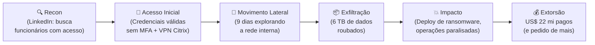
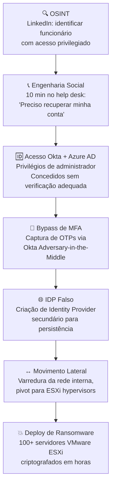

# Estudos de Caso

> [!quote] Aprendendo com Exemplos Reais
> *Estudar casos reais de invasões e vulnerabilidades é essencial para entender como ataques funcionam na prática.*

---

## 🎯 Demonstrações Práticas

> [!tip] Vídeos Educativos
> Exemplos práticos de como vulnerabilidades são exploradas.

### 🍺 IoT e Dispositivos Conectados

[📺 Hackeei uma Máquina de Chopp](https://youtu.be/mFjO-LY_R74?si=544u6KOqDpwVo1PQ)

> [!info] Por que isso importa?
> Dispositivos IoT frequentemente têm segurança negligenciada. Esse caso mostra como atacantes podem explorar equipamentos conectados do dia a dia.

---

### 🌐 Ataques a Navegadores

[📺 How hackers hack web browser with one link](https://www.instagram.com/reel/DBSiXVuqWiE/?igsh=MXJuM2V4ZW5oeDNveA%3D%3D)

> [!warning] Cuidado com Links
> Um único clique em um link malicioso pode comprometer todo o sistema. Demonstração de como ataques baseados em navegador funcionam.

---

### 📱 Comprometimento de Redes Sociais

[📺 How hackers actually hack Instagram](https://www.instagram.com/reel/DBY3QFICD7Q/?igsh=MW5pZzhqc3loOTR5MA%3D%3D)

> [!danger] Proteja Suas Contas
> Técnicas usadas para comprometer contas de redes sociais, incluindo phishing e engenharia social.

---

## 📖 Casos Históricos Famosos

> [!info] Para Pesquisar
> Alguns dos maiores incidentes de segurança da história.

| Caso | Ano | Impacto |
|------|-----|---------|
| **Stuxnet** | 2010 | Primeiro malware a causar danos físicos (centrífugas iranianas) |
| **Sony Pictures Hack** | 2014 | Vazamento massivo de dados corporativos |
| **WannaCry** | 2017 | Ransomware que afetou hospitais e empresas globalmente |
| **Equifax Breach** | 2017 | 147 milhões de pessoas afetadas |
| **SolarWinds** | 2020 | Supply chain attack que afetou governo dos EUA |
| **Colonial Pipeline** | 2021 | Ransomware que parou oleoduto nos EUA |

---

## 🔬 Como Estudar Casos

> [!success] Metodologia de Análise

1. **Vetor de ataque**: Como o atacante entrou?
2. **Vulnerabilidade explorada**: Qual falha foi usada?
3. **Movimento lateral**: Como se espalhou?
4. **Impacto**: Quais foram as consequências?
5. **Lições aprendidas**: Como prevenir?

---

## 🆕 Casos Reais Recentes (2024-2026)

> [!abstract] Por Que Estudar Incidentes Recentes?
> Ataques evoluem rapidamente. Casos de 2024-2026 demonstram técnicas que os atacantes **usam hoje**, não há cinco anos. Entender o padrão técnico real é fundamental para defesa eficaz.
>
> **Nota legal:** A análise técnica a seguir é estritamente educacional, baseada em relatórios públicos, divulgações responsáveis e jornalismo especializado. A reprodução não autorizada das técnicas descritas pode configurar crime tipificado no **art. 154-A do Código Penal Brasileiro** (invasão de dispositivo informático) com pena de reclusão de 1 a 4 anos. Este material destina-se exclusivamente ao estudo de defesa.

---

### 🏥 Caso 1: Change Healthcare (Fev 2024): Ransomware BlackCat/ALPHV

**Contexto:** A Change Healthcare processa cerca de **50% de todas as transações médicas nos Estados Unidos**. Em fevereiro de 2024, o grupo russo **ALPHV/BlackCat** lançou um dos maiores ataques de ransomware da história da saúde.

**Impacto Imediato:** 100 milhões de pacientes afetados, US$ 2,87 bilhões em custos de resposta, resgate de US$ 22 milhões pago, farmácias e hospitais incapazes de processar pedidos por semanas. 74% dos hospitais americanos relataram impacto direto no cuidado ao paciente.

**Kill Chain Detalhada:**

| Fase | O que ocorreu | Técnica (MITRE ATT&CK) |
|------|---------------|------------------------|
| **Recon** | Mapeamento de funcionários com acesso privilegiado via LinkedIn e fontes abertas | T1591 (Gather Victim Org Info) |
| **Acesso Inicial** | Uso de credenciais válidas (compradas ou vazadas) para acessar portal VPN Citrix **sem MFA** | T1078 (Valid Accounts) |
| **Persistência** | Implantação de backdoors durante os 9 dias de presença silenciosa | T1547 (Boot Autostart Execution) |
| **Movimento Lateral** | Escalonamento de privilégios e navegação por redes segmentadas (ou mal segmentadas) | T1021 (Remote Services) |
| **Exfiltração** | Roubo de 6 TB de dados de saúde (diagnósticos, SSNs, planos de saúde) | T1041 (Exfiltration Over C2 Channel) |
| **Impacto** | Criptografia dos sistemas de processamento de pagamentos médicos | T1486 (Data Encrypted for Impact) |

**Defesas que teriam evitado ou mitigado:**

> [!success] Controles Preventivos
> - **MFA obrigatório** em todos os acessos remotos (VPN, portais, cloud). Esta é a falha raiz confirmada pelo CEO da UnitedHealth em depoimento ao Congresso.
> - **Segmentação de rede** para limitar o movimento lateral durante os 9 dias de presença não detectada.
> - **Monitoramento de comportamento anômalo** (UEBA/SIEM): transferência de 6 TB deveria ter gerado alerta imediato.
> - **Plano de continuidade de negócios (BCP)** robusto: dependência de um único provedor para 50% das transações médicas do país é risco sistêmico.
> - **Zero Trust Architecture**: nunca confiar implicitamente em nenhuma credencial, mesmo dentro da rede corporativa.

---

### 🌐 Caso 2: Polyfill.io (Jun 2024): Ataque à Cadeia de Suprimento via CDN

**Contexto:** Em fevereiro de 2024, uma empresa chinesa chamada **Funnull** comprou o domínio `cdn.polyfill.io` e a conta GitHub do projeto. O `polyfill.js` era um script JavaScript amplamente usado para compatibilidade entre navegadores, embarcado em dezenas de milhares de sites por simplesmente incluir uma tag `<script>` apontando para o CDN externo.

**Impacto:** Mais de **490.000 sites** passaram a servir código malicioso sem saber. O código redirecionava usuários móveis para sites de golpe e apostas, e era projetado para evadir ferramentas de análise e pesquisadores de segurança. Em 2026, mais de 61.000 páginas ainda incluíam o script comprometido.

**Kill Chain:**

| Fase | Ação do Atacante |
|------|-----------------|
| **Recon** | Identificação de projeto popular com alta dependência e mantenedor original sem grandes recursos |
| **Aquisição (vetor incomum)** | Compra legítima do domínio e conta GitHub via transação comercial |
| **Armamento** | Modificação do JavaScript servido pelo CDN para incluir redirecionamento condicional (só mobile, só fora de horário de pesquisadores) |
| **Entrega** | Qualquer site que já incluía `<script src="cdn.polyfill.io/...">` passou a distribuir o malware automaticamente, sem ação adicional |
| **Execução no cliente** | Visitantes móveis dos 490.000 sites afetados eram redirecionados para scams e esquemas de pig butchering |
| **Impacto e monetização** | Roubo de dados, golpes financeiros, mineração de criptomoedas, skimming de cartões |

> [!warning] O Que Torna Esse Caso Único
> O atacante nunca precisou invadir nada. Ele **comprou** o acesso. Isso demonstra que supply chain attacks podem ser executados via aquisição comercial de ativos digitais de terceiros.
> Em maio de 2025, o OFAC (Departamento do Tesouro dos EUA) sancionou a Funnull e seu administrador por perdas acima de US$ 200 milhões ligadas a golpes de investimento.

**Defesas que teriam evitado:**

> [!success] Controles Preventivos
> - **Subresource Integrity (SRI):** incluir o atributo `integrity="sha384-..."` na tag `<script>`. O navegador verifica o hash do arquivo antes de executar. Se o arquivo mudar (como aconteceu), a execução é bloqueada automaticamente.
> - **Auto-hospedagem de dependências críticas:** não depender de CDNs externos para scripts executados em produção.
> - **Política de segurança de conteúdo (CSP):** restringir origens de scripts permitidos. Um `Content-Security-Policy` bem configurado bloquearia o carregamento do CDN comprometido.
> - **Auditoria de dependências de terceiros:** inventariar todos os scripts de terceiros e monitorar mudanças.

---

### 🏨 Caso 3: MGM Resorts (Set 2023): Engenharia Social + Ransomware (Scattered Spider)

**Contexto:** Em setembro de 2023, o grupo **Scattered Spider** (também conhecido como UNC3944), em parceria com o ransomware **ALPHV/BlackCat**, atacou o MGM Resorts International, uma das maiores redes de hotéis e cassinos do mundo. O ataque inteiro começou com uma **ligação telefônica de 10 minutos**.

**Impacto:** Cerca de **US$ 100 milhões** em receita perdida, máquinas caça-níqueis offline, fechaduras digitais de quartos de hotel falhando, sistemas de reserva derrubados.

**Kill Chain:**

**Análise da Fase de Engenharia Social:**

O Scattered Spider usou o **LinkedIn** para identificar um funcionário real com acesso privilegiado. Em seguida, ligou para o help desk de TI da MGM fingindo ser esse funcionário com problema de acesso. Com apenas nome, cargo e informações públicas disponíveis na internet (OSINT), conseguiu convencer o atendente a redefinir as credenciais. Isso é chamado de **vishing** (voice phishing) e é notavelmente eficaz porque explora o treinamento de suporte ao usuário, que enfatiza resolver problemas rapidamente.

**Comparação de Resposta: MGM vs. Caesars (atacado na mesma época):**

| | MGM Resorts | Caesars Entertainment |
|--|--|--|
| **Pagou resgate?** | Não | Sim (~US$ 15 milhões) |
| **Duração da disrupção** | Semanas | Menor (operações mantidas) |
| **Prejuízo total estimado** | ~US$ 100 milhões | ~US$ 15 milhões (resgate) |
| **Dados vazados** | Sim (clientes expostos) | Sim (mas menos publicidade) |
| **Lição** | Não pagar não garante impunidade | Pagar não elimina o risco de vazamento |

**Defesas que teriam evitado:**

> [!success] Controles Preventivos
> - **Protocolo rigoroso de verificação de identidade no help desk:** nunca redefinir credenciais de acesso privilegiado por ligação telefônica sem verificação fora de banda (email corporativo, aprovação de gestor).
> - **Princípio do menor privilégio:** o atacante obteve acesso de administrador ao Okta inteiro. A conta comprometida não deveria ter esse nível de acesso.
> - **Detecção de novo Identity Provider:** criação de IDP secundário deveria gerar alerta imediato no SIEM.
> - **Simulações de engenharia social no treinamento de funcionários** (especialmente help desk): é a defesa mais diretamente aplicável a este vetor.

---

### 🐧 Caso 4: Backdoor XZ Utils (CVE-2024-3094, Mar 2024): Operação de Supply Chain em Open Source

**Contexto:** Este caso é considerado por muitos pesquisadores como **o ataque de supply chain mais sofisticado já documentado contra infraestrutura Linux**. Um agente de ameaça (provavelmente ligado a um estado-nação) passou **dois anos e meio** construindo credibilidade dentro de um projeto open source antes de inserir um backdoor.

**O que é o XZ Utils?** Uma biblioteca de compressão de dados presente em praticamente todas as distribuições Linux. Em certas configurações, é dependência do OpenSSH (servidor SSH). Isso significa: comprometer o XZ Utils = comprometer o SSH de milhões de servidores Linux no mundo.

**Timeline do Ataque:**

| Data | Evento |
|------|--------|
| **Nov 2021** | Usuário `Jia Tan` começa a contribuir para o projeto XZ Utils com patches legítimos e de alta qualidade |
| **2022-2023** | Jia Tan acumula reputação, confiança da comunidade e, eventualmente, privilégios de **mantenedor** do projeto |
| **Fev 2024** | Commits finais inserem o backdoor nos tarballs de release (versões 5.6.0 e 5.6.1) via código ofuscado nos scripts de build |
| **29 Mar 2024** | Andres Freund (engenheiro Microsoft) percebe **anomalia de desempenho de 500ms** no SSH em testes e investiga. Descobre o backdoor por acidente |
| **Abr 2024** | CVE-2024-3094 publicado com CVSS 10.0 (máximo). Patch de emergência, distribuições recuam para versão 5.4.x |

**Como o backdoor funcionava:**

O código malicioso não estava no repositório Git diretamente: estava nos **tarballs de release** gerados por scripts de build complexos que incluíam arquivos de teste binários aparentemente inócuos. O backdoor hookeava a função `RSA_public_decrypt` do OpenSSH via `LD_PRELOAD` da liblzma, permitindo **execução remota de código antes da autenticação SSH** para o atacante que possuísse a chave privada correspondente.

**Kill Chain:**

| Fase | Descrição |
|------|-----------|
| **Recon (2 anos)** | Identificação de projeto crítico com mantenedor único sobrecarregado (`Lasse Collin`) |
| **Desenvolvimento de confiança** | Contribuições legítimas e de qualidade ao longo de 2 anos. Criação de persona persistente e profissional |
| **Engenharia Social no Open Source** | Pressão (via terceiros criados pelo próprio atacante) para o mantenedor original aceitar ajuda e transferir controle |
| **Weaponization** | Inserção de backdoor via arquivos binários de teste + scripts de build ofuscados (não visível no `git diff` simples) |
| **Entrega** | Publicação de versões 5.6.0 e 5.6.1 via canais legítimos do projeto. Debian e Fedora já incluíam nas versões beta/testing |
| **Impacto (evitado)** | Se não detectado, permitiria RCE remoto em servidores SSH de grande parte da infraestrutura Linux mundial |

> [!danger] Por que Esse Caso é Diferente de Tudo Anterior?
> O atacante não explorou uma vulnerabilidade de código. Ele **se tornou** um desenvolvedor confiável. O vetor de ataque foi a **confiança humana em comunidades open source**, não uma falha de segurança clássica. Isso levanta questões fundamentais sobre como auditar contribuições a projetos críticos de infraestrutura.

**Defesas e Lições:**

> [!success] Controles e Mitigações
> - **Verificação de integridade de tarballs vs. repositório Git:** as distribuições deveriam verificar que o código no tarball de release corresponde exatamente ao código no repositório, sem adições.
> - **Revisão de código por múltiplos mantenedores independentes** em projetos de infraestrutura crítica (o projeto XZ era mantido por uma pessoa).
> - **Análise de comportamento dinâmico** de libraries em testes automatizados de CI/CD poderia detectar hooks inesperados em funções do OpenSSH.
> - **Dependência mínima:** questionar se o OpenSSH realmente precisa de liblzma como dependência (spoiler: não precisa, e isso foi corrigido).
> - A descoberta acidental por anomalia de desempenho reforça a importância de **benchmarks de baseline**: pequenas variações podem ser sintoma de algo grave.

---

## 📊 Resumo Comparativo dos Casos Recentes

| Caso | Ano | Vetor Principal | Falha Raiz | Impacto | Lição Central |
|------|-----|----------------|------------|---------|---------------|
| **Change Healthcare** | 2024 | Credencial válida + sem MFA | MFA ausente em acesso remoto | 100M pacientes, US$ 2,87 bi | MFA não é opcional em sistemas críticos |
| **Polyfill.io** | 2024 | Compra de ativo de terceiro | Confiança implícita em CDN externo | 490.000+ sites comprometidos | Subresource Integrity (SRI) deveria ser padrão |
| **MGM Resorts** | 2023 | Vishing no help desk (10 min) | Protocolo de verificação de identidade fraco | US$ 100M em prejuízo | O humano é o elo mais fraco |
| **XZ Utils** | 2024 | Engenharia social em open source (2 anos) | Mantenedor único, confiança excessiva | Potencial RCE global evitado por acidente | Infraestrutura crítica precisa de governança robusta |

---

## 🧪 Atividades Práticas

> [!example] 🧪 Atividade 1: Mapear a Kill Chain de um Breach Real
> **Objetivo:** Ler o post-mortem público de um incidente recente e mapear cada fase da kill chain.
>
> **Instruções:**
> 1. Escolha **um** dos seguintes relatórios públicos:
>    - Change Healthcare: [Relatório AHA](https://www.aha.org/change-healthcare-cyberattack-underscores-urgent-need-strengthen-cyber-preparedness-individual-health-care-organizations-and) ou [análise técnica BlackFog](https://www.blackfog.com/change-healthcare-landmark-cybersecurity-breach/)
>    - XZ Utils: [Análise completa Datadog Security Labs](https://securitylabs.datadoghq.com/articles/xz-backdoor-cve-2024-3094/) ou [thread GitHub thesamesam](https://gist.github.com/thesamesam/223949d5a074ebc3dce9ee78baad9e27)
>    - Polyfill.io: [Análise CSIDE](https://cside.com/blog/polyfill-io-supply-chain-attack-timeline) ou [Sonatype](https://www.sonatype.com/blog/polyfill.io-supply-chain-attack-hits-100000-websites-all-you-need-to-know)
> 2. Para o caso escolhido, preencha a tabela:
>
> | Fase da Kill Chain | O que ocorreu neste caso | Técnica MITRE ATT&CK correspondente |
> |--------------------|--------------------------|--------------------------------------|
> | Reconhecimento | | |
> | Armamento | | |
> | Entrega | | |
> | Exploração | | |
> | Instalação/Persistência | | |
> | C2 (Comando e Controle) | | |
> | Ações no Objetivo | | |
>
> 3. Identifique **2 controles defensivos** que, se implementados, teriam interrompido a kill chain antes do impacto final. Justifique em qual fase cada controle atuaria.
>
> **Entregável:** Tabela preenchida + parágrafo de análise dos controles defensivos.

---

> [!example] 🧪 Atividade 2: Analisar um Relatório Real do HackerOne
> **Objetivo:** Ler um relatório de vulnerabilidade divulgado publicamente (full disclosure) e identificar os elementos técnicos do achado.
>
> **Instruções:**
> 1. Acesse [hackerone.com/hacktivity/overview](https://hackerone.com/hacktivity/overview) e filtre por `disclosed:true` (relatórios divulgados publicamente).
> 2. Escolha um relatório com severidade **High** ou **Critical** de um programa público conhecido (ex: HackerOne próprio, Shopify, GitLab, GitHub).
> 3. Responda:
>    - Qual é a vulnerabilidade (tipo: SSRF, RCE, IDOR, XSS, etc.)?
>    - Qual foi o endpoint ou componente afetado?
>    - Como o pesquisador provou o impacto (proof of concept)?
>    - Qual foi a correção aplicada?
>    - Qual controle de segurança (OWASP Top 10 ou similar) teria prevenido essa falha?
> 4. Em não mais de meia página, escreva uma análise no formato: **Contexto, Técnica, Impacto, Correção, Prevenção**.
>
> **Referência alternativa (já divulgado):** [GitHub: reddelexc/hackerone-reports](https://github.com/reddelexc/hackerone-reports) tem centenas de relatórios organizados por tipo de vulnerabilidade.
>
> **Entregável:** Análise estruturada do relatório escolhido com URL do relatório original.

---

> [!example] 🧪 Atividade 3: Comparação de Causa Raiz (Change Healthcare vs. XZ Utils)
> **Objetivo:** Desenvolver análise crítica comparando dois ataques com vetores completamente diferentes.
>
> **Pergunta central:** Ambos os ataques (Change Healthcare e XZ Utils) envolveram "confiança excessiva". Como essa confiança se manifestou de forma diferente em cada caso, e quais princípios de segurança foram violados?
>
> **Estrutura sugerida:**
> 1. **Tipo de confiança violada:** técnica (credencial sem MFA) vs. humana/social (desenvolvedor confiável por 2 anos).
> 2. **Quem foi enganado:** sistema de autenticação vs. comunidade open source e processo de release.
> 3. **Tempo de preparação do atacante:** horas (Change Healthcare) vs. 2,5 anos (XZ Utils).
> 4. **Detectabilidade:** qual seria mais fácil de detectar com ferramentas convencionais de segurança? Por quê?
> 5. **Princípio de segurança violado em cada caso** (ex: "defense in depth", "least privilege", "zero trust", "separation of duties").
>
> **Entregável:** Texto comparativo de 1 página ou tabela comparativa detalhada.

---

## 🔗 Referências e Recursos Adicionais

> [!info] Fontes para Pesquisa Contínua
> Para acompanhar incidentes em tempo real:
> - **CISA Advisories:** [cisa.gov/news-events/cybersecurity-advisories](https://www.cisa.gov/news-events/cybersecurity-advisories)
> - **HackerOne Hacktivity:** [hackerone.com/hacktivity](https://hackerone.com/hacktivity/overview)
> - **NVD (National Vulnerability Database):** [nvd.nist.gov](https://nvd.nist.gov)
> - **MITRE ATT&CK:** [attack.mitre.org](https://attack.mitre.org)
> - **Have I Been Pwned:** [haveibeenpwned.com](https://haveibeenpwned.com)

---

> [!note] 📚 Fontes (2024-2026)
> - BlackFog: [The Change Healthcare Ransomware Attack: A Landmark Cybersecurity Breach](https://www.blackfog.com/change-healthcare-landmark-cybersecurity-breach/)
> - Picus Security: [ALPHV Ransomware: Analyzing the BlackCat After Change Healthcare Attack](https://www.picussecurity.com/resource/blog/alphv-ransomware)
> - Cloud Security Alliance: [Unpacking the 2024 Snowflake Data Breach](https://cloudsecurityalliance.org/blog/2025/05/07/unpacking-the-2024-snowflake-data-breach)
> - Sonatype: [Polyfill.io Supply Chain Attack](https://www.sonatype.com/blog/polyfill.io-supply-chain-attack-hits-100000-websites-all-you-need-to-know)
> - CSIDE: [Polyfill.io Supply Chain Attack: Complete Timeline](https://cside.com/blog/polyfill-io-supply-chain-attack-timeline)
> - Datadog Security Labs: [The XZ Utils backdoor (CVE-2024-3094)](https://securitylabs.datadoghq.com/articles/xz-backdoor-cve-2024-3094/)
> - JFrog: [XZ Backdoor Attack CVE-2024-3094: All You Need To Know](https://jfrog.com/blog/xz-backdoor-attack-cve-2024-3094-all-you-need-to-know/)
> - GitHub (thesamesam): [xz-utils backdoor situation (CVE-2024-3094)](https://gist.github.com/thesamesam/223949d5a074ebc3dce9ee78baad9e27)
> - Specops Software: [MGM Resorts hack: How attackers hit the jackpot with service desk social engineering](https://specopssoft.com/blog/mgm-resorts-service-desk-hack/)
> - Netwrix: [An Overview of the MGM Cyber Attack](https://netwrix.com/en/resources/blog/mgm-cyber-attack/)
> - Kaspersky Securelist: [Review of supply chain attacks in 2024](https://securelist.com/ksb-story-of-the-year-2024/114883/)
> - HackerOne: [Hacktivity](https://hackerone.com/hacktivity/overview)
> - reddelexc/hackerone-reports: [Top disclosed reports from HackerOne](https://github.com/reddelexc/hackerone-reports)
> - AHA: [Change Healthcare Cyberattack Underscores Urgent Need](https://www.aha.org/change-healthcare-cyberattack-underscores-urgent-need-strengthen-cyber-preparedness-individual-health-care-organizations-and)
