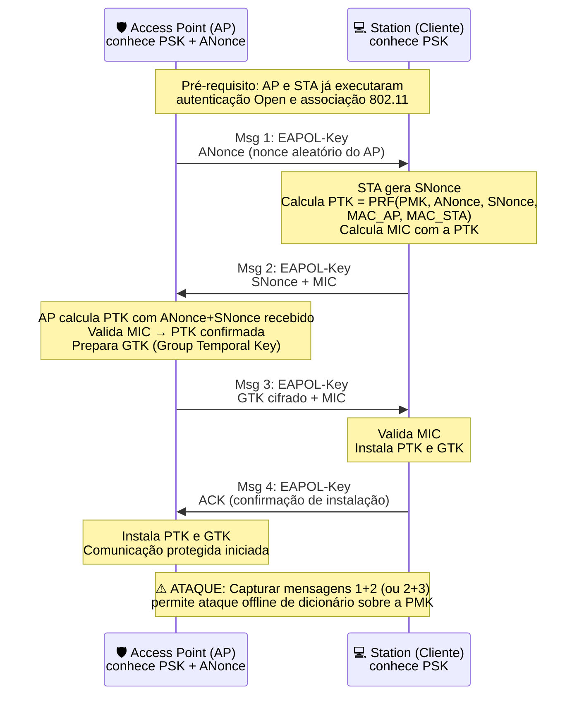
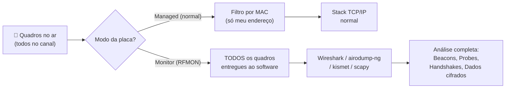

# Fundamentos e Conceitos de Redes Sem Fio

> [!quote] O Mundo Conectado
> *Redes sem fio revolucionaram a forma como nos conectamos, permitindo mobilidade e acesso em qualquer lugar. Para o profissional de segurança, cada protocolo é ao mesmo tempo uma solução de comunicação e uma potencial superfície de ataque.*

---

## 📡 Conceitos Básicos

> [!tip] Definição
> **Rede Sem Fio** é uma infraestrutura de comunicação que não necessita de cabos para conectar dispositivos em uma rede. A comunicação se dá por ondas eletromagnéticas que se propagam pelo ar, o que torna o meio de transmissão inerentemente compartilhado e acessível a qualquer receptor próximo.

### Componentes Principais

| Componente | Função |
|------------|--------|
| **Roteador/AP** | Distribui o sinal sem fio e faz a ponte com a rede cabeada |
| **Dispositivo Cliente (STA)** | Smartphones, laptops, IoT que se associam ao AP |
| **Antena** | Transmite e recebe ondas de rádio; determina ganho, padrão de irradiação e alcance |
| **Controlador Wireless (WLC)** | Centraliza configuração de múltiplos APs em redes corporativas |
| **RADIUS Server** | Autentica usuários em redes WPA2/WPA3-Enterprise |

![[Recursos/Segurança da informação/Ataques em rede local/Ferramentas de redes sem fio (802 11)/Fundamentos e conceitos de Redes Sem Fio/Untitled.png|Componentes de rede sem fio]]

### Frequências de Operação

| Frequência | Características | Canais não sobrepostos | Observação |
|------------|-----------------|------------------------|------------|
| **2.4 GHz** | Maior alcance, mais interferência, penetra paredes | 3 (canais 1, 6, 11) | Saturado em ambientes urbanos |
| **5 GHz** | Menor alcance, menos interferência, mais canais disponíveis | 24+ (depende da regulação) | Preferido para velocidade |
| **6 GHz** | Wi-Fi 6E/7, banda limpa, sem legado, baixíssimo congestionamento | 59 canais de 20 MHz | Só dispositivos novos |

![[Recursos/Segurança da informação/Ataques em rede local/Ferramentas de redes sem fio (802 11)/Fundamentos e conceitos de Redes Sem Fio/Untitled 1.png|Espectro de frequência]]

> [!warning] 🔍 Relevância para Segurança
> O meio compartilhado é a base de todos os ataques passivos em Wi-Fi. Uma placa em **modo monitor** captura todos os quadros que passam pelo ar no canal monitorado, sem precisar se associar a nenhuma rede. Isso possibilita análise de tráfego, captura de handshakes e mapeamento completo de redes próximas.

---

## 📜 História e Evolução

> [!info] Linha do Tempo

| Período | Marco |
|---------|-------|
| **1890s-1900s** | Marconi realiza primeiras transmissões de rádio |
| **1940s-1950s** | Invenção do radar, comunicação móvel militar |
| **1970s-1980s** | Primeiros experimentos com WLANs, ALOHAnet no Havaí |
| **1990s-2000s** | IEEE estabelece padrão 802.11 (Wi-Fi); Wi-Fi Alliance fundada em 1999 |
| **2000s-2010s** | 3G, 4G, Bluetooth, Zigbee, WiMAX; WEP quebrado publicamente |
| **2010s-Presente** | IoT, 5G, Wi-Fi 6; WPA2 comprometido pelo ataque KRACK (2017) |
| **2018** | WPA3 lançado; PMKID attack publicado por Jens Steube |
| **2024** | Wi-Fi 7 (802.11be) certificado pela Wi-Fi Alliance |
| **2025-2026** | Wi-Fi 7 Release 2; WPA3 mandatório para Wi-Fi 7 com MLO |
| **Futuro** | 6G (previsão 2030), Wi-Fi 8 (802.11bn) em pesquisa |

![[Recursos/Segurança da informação/Ataques em rede local/Ferramentas de redes sem fio (802 11)/Fundamentos e conceitos de Redes Sem Fio/Untitled 3.png|Evolução das redes sem fio]]

---

## 🌐 Tipos de Redes Sem Fio

> [!success] Tecnologias Principais

| Tecnologia | Uso | Alcance | Velocidade |
|------------|-----|---------|------------|
| **Wi-Fi (802.11)** | Internet, LAN | ~100m (interno) a ~300m (externo) | Até 46 Gbps (Wi-Fi 7) |
| **Bluetooth** | Dispositivos próximos, áudio, periféricos | ~100m (BR/EDR), ~400m (BLE 5.x) | 1-3 Mbps |
| **Zigbee** | IoT, automação residencial | 10-100m | 250 kbps |
| **NFC** | Pagamentos, autenticação por toque | ~20cm | 424 kbps |
| **LoRa** | IoT de longo alcance, rastreamento | ~15km (aberto) | 50 kbps |
| **5G** | Internet móvel, URLLC, mMTC | Variável (mmWave: ~200m) | Até 20 Gbps |
| **Infravermelho (IR)** | Controles remotos, linha de visada | ~5m | 4 Mbps |
| **Z-Wave** | Automação residencial, saúde | ~30m | 100 kbps |
| **UWB (Ultra-Wideband)** | Localização precisa, Apple AirTags | ~10m | Alta taxa de dados bruta |

---

## 📊 Classificação por Alcance

> [!tip] Tipos de Rede

| Tipo | Nome | Exemplo |
|------|------|---------|
| **WPAN** | Wireless Personal Area Network | Bluetooth, fones de ouvido, NFC |
| **WLAN** | Wireless Local Area Network | Wi-Fi doméstico, corporativo |
| **WMAN** | Wireless Metropolitan Area Network | WiMAX, 5G fixo |
| **WWAN** | Wireless Wide Area Network | Operadoras de celular (4G/5G) |
| **WRAN** | Wireless Regional Area Network | TV de espaço em branco (802.22) |

---

## ⚖️ Comparação: Com Fio vs Sem Fio

| Critério | Redes Cabeadas | Redes Sem Fio |
|----------|----------------|---------------|
| **Velocidade** | Alta (até 400 Gbps em fibra) | Variável (até 46 Gbps Wi-Fi 7) |
| **Custo Inicial** | Alto (infraestrutura física) | Médio a Baixo |
| **Mobilidade** | Baixa | Alta |
| **Segurança Física** | Alta (acesso físico necessário) | Variável (sinal disponível no ar) |
| **Instalação** | Complexa (cabeamento estruturado) | Mais Simples |
| **Interferência** | Baixa (cabo blindado) | Alta (eletromagnética, cocanal) |
| **Escalabilidade** | Moderada | Alta |
| **Superfície de Ataque** | Requer acesso físico ao cabo | Qualquer receptor próximo pode capturar |

> [!danger] 🔴 Implicação de Segurança
> Em redes cabeadas, o atacante precisa estar fisicamente conectado ao meio. Em redes sem fio, o sinal se propaga além das paredes e perímetros físicos, tornando o sniffing passivo possível a partir de um estacionamento ou rua adjacente. Essa é a razão pela qual criptografia forte em Wi-Fi não é opcional.

---

## 📶 Padrões IEEE 802.11 (Wi-Fi)

> [!info] Evolução Completa do Wi-Fi

| Padrão | Nome Comercial | Ano | Frequência | Velocidade Máxima Teórica | Largura de Canal | Técnica Chave |
|--------|---------------|------|------------|--------------------------|------------------|---------------|
| 802.11 | (original) | 1997 | 2.4 GHz | 2 Mbps | 22 MHz | DSSS/FHSS |
| 802.11a | Wi-Fi 2 | 1999 | 5 GHz | 54 Mbps | 20 MHz | OFDM |
| 802.11b | Wi-Fi 1 | 1999 | 2.4 GHz | 11 Mbps | 22 MHz | DSSS |
| 802.11g | Wi-Fi 3 | 2003 | 2.4 GHz | 54 Mbps | 20 MHz | OFDM |
| 802.11n | Wi-Fi 4 | 2009 | 2.4/5 GHz | 600 Mbps | 20/40 MHz | MIMO, OFDM |
| 802.11ac | Wi-Fi 5 | 2013 | 5 GHz | 3.5 Gbps | 20/40/80/160 MHz | MU-MIMO, OFDMA |
| 802.11ax | Wi-Fi 6/6E | 2019/2021 | 2.4/5/6 GHz | 9.6 Gbps | até 160 MHz | OFDMA, BSS Coloring, TWT |
| 802.11be | Wi-Fi 7 | 2024 | 2.4/5/6 GHz | 46 Gbps | até 320 MHz | MLO, 4096-QAM, Multi-RU |

> [!note] Wi-Fi 7 e Segurança (2024-2026)
> O 802.11be traz **Multi-Link Operation (MLO)**: um dispositivo pode manter links simultâneos em múltiplas bandas. Para isso, o Wi-Fi 7 torna **WPA3 e Protected Management Frames (PMF) obrigatórios**. Novos AKMs (AKM 24 e 25) foram adicionados ao WPA3-Personal. A Wi-Fi Alliance publicou a Release 2 da certificação Wi-Fi 7 em dezembro de 2025.

---

## 🧩 Arquitetura de uma WLAN: BSS, ESS e IBSS

> [!tip] Modos de Operação

| Modo | Nome | Descrição |
|------|------|-----------|
| **Infrastructure (BSS)** | Basic Service Set | Clientes se associam a um AP central |
| **ESS** | Extended Service Set | Múltiplos APs com mesmo SSID, roaming habilitado |
| **IBSS (Ad-hoc)** | Independent BSS | Dispositivos comunicam diretamente, sem AP |
| **Mesh** | Mesh BSS | APs formam malha de cobertura colaborativa |
| **Monitor** | Modo passivo | Placa captura todos os quadros no canal sem se associar |

> [!warning] 🔍 Modo Monitor como Superfície de Ataque
> O **modo monitor** (também chamado RFMON) é o fundamento de toda análise passiva de Wi-Fi. Diferente do modo gerenciado (managed), em que a placa filtra apenas quadros destinados ao seu MAC, no modo monitor a placa entrega à pilha de software **todos os quadros** que o receptor capta no ar: beacons, probes, dados cifrados, deauths, handshakes. Isso é legal e legítimo na **sua própria rede**.

---

## 🎯 SSID, BSSID e Identificação de Redes

Esses dois identificadores são a base de toda análise e de muitos ataques. Compreendê-los é pré-requisito para qualquer atividade de red team em Wi-Fi.

### SSID (Service Set Identifier)

- É o **nome da rede** Wi-Fi, com até 32 bytes (caracteres ASCII ou UTF-8).
- Transmitido abertamente nos **Beacon Frames** e nas respostas de Probe.
- Um AP pode transmitir múltiplos SSIDs (múltiplos BSS virtuais na mesma placa física).
- **SSID Oculto (Hidden SSID):** o campo SSID no beacon fica vazio (comprimento zero). Isso **não é segurança**: qualquer ferramenta como `airodump-ng` revela o SSID real ao capturar uma Probe Request de um cliente que já conhece a rede.
- Superfície de ataque: o SSID é copiável. Um **Evil Twin** clona o SSID (e o BSSID) de uma rede legítima para enganar clientes.

### BSSID (Basic Service Set Identifier)

- É o **endereço MAC do rádio do AP** (ou da interface virtual no AP).
- Único por radio/interface virtual; identifica inequivocamente um AP específico.
- Transmitido no campo **Address 3** (e Address 2) dos quadros de gerenciamento.
- Como o MAC é um campo de software, pode ser facilmente **clonado** (`macchanger`).
- Superfície de ataque: clonar o BSSID de um AP legítimo é o primeiro passo do ataque Evil Twin / Rogue AP.

> [!important] 🔑 Relação SSID vs BSSID
> Pense assim: o SSID é o **nome** da loja, o BSSID é o **endereço físico** da filial. Uma rede corporativa com 50 APs tem um SSID único ("CorpWiFi") e 50 BSSIDs diferentes (um por AP). Quando você vê múltiplas entradas com o mesmo SSID e BSSIDs diferentes no `airodump-ng`, você está vendo o roaming de um ESS.

---

## 📦 Estrutura dos Quadros 802.11

Os quadros 802.11 são a unidade básica de comunicação Wi-Fi. Todo ataque a redes sem fio manipula, injeta ou analisa quadros. Existem três tipos principais:

```mermaid
graph TD
    A["Quadros IEEE 802.11"] --> B["🗂️ Gerenciamento<br/>(Management)"]
    A --> C["🔧 Controle<br/>(Control)"]
    A --> D["📊 Dados<br/>(Data)"]

    B --> B1["Beacon<br/>(AP anuncia presença)"]
    B --> B2["Probe Request<br/>(Cliente busca rede)"]
    B --> B3["Probe Response<br/>(AP responde probe)"]
    B --> B4["Authentication<br/>(Início da autenticação)"]
    B --> B5["Association Request/Response<br/>(Cliente solicita associação)"]
    B --> B6["Deauthentication<br/>(⚠️ Termina conexão)"]
    B --> B7["Disassociation<br/>(⚠️ Remove associação)"]
    B --> B8["Action Frames<br/>(QoS, Spectrum, etc.)"]

    C --> C1["RTS / CTS<br/>(Reserva do meio)"]
    C --> C2["ACK<br/>(Confirmação)"]
    C --> C3["Block ACK<br/>(Confirmação em bloco)"]
    C --> C4["CF-End<br/>(Fim de período contention-free)"]

    D --> D1["Data<br/>(Carga útil cifrada)"]
    D --> D2["Null Data<br/>(Keepalive sem payload)"]
    D --> D3["QoS Data<br/>(Dados com prioridade)"]

    style B fill:#1e3a5f,color:#fff
    style C fill:#1a4a1a,color:#fff
    style D fill:#4a2800,color:#fff
    style B6 fill:#8b0000,color:#fff
    style B7 fill:#8b0000,color:#fff
```



### Campos do Cabeçalho 802.11

| Campo | Tamanho | Função |
|-------|---------|--------|
| **Frame Control** | 2 bytes | Tipo (Management/Control/Data), Subtype, flags (To DS, From DS, Protected) |
| **Duration/ID** | 2 bytes | Tempo de reserva do canal (NAV) |
| **Address 1** | 6 bytes | Destinatário imediato (receiver) |
| **Address 2** | 6 bytes | Transmissor imediato (transmitter) |
| **Address 3** | 6 bytes | Endereço filtro (BSSID nos frames de gerenciamento) |
| **Sequence Control** | 2 bytes | Número de sequência e fragmento |
| **Address 4** | 6 bytes | Opcional; usado em pontes WDS |
| **QoS Control** | 2 bytes | Presente em quadros QoS Data |
| **HT/VHT/HE Control** | 4 bytes | Presente em 802.11n/ac/ax |
| **Frame Body** | Variável | Payload (IEs nos management frames; dados cifrados nos data frames) |
| **FCS** | 4 bytes | CRC para verificação de integridade |

### Beacon Frame: o Coração do Wi-Fi

O **Beacon Frame** é transmitido pelo AP tipicamente a cada **100 ms (10 Hz)**. Contém tudo que um cliente precisa saber para se associar:

| Campo no Beacon | Tamanho | Conteúdo e Relevância para Segurança |
|-----------------|---------|---------------------------------------|
| **Timestamp** | 8 bytes | Microsegundos desde boot do AP; usado para sincronização |
| **Beacon Interval** | 2 bytes | Intervalo entre beacons (default 100 TU = 102,4 ms) |
| **Capability Info** | 2 bytes | Flags: ESS/IBSS, Privacy (WEP), Short Preamble, QoS |
| **SSID IE** | Variável | Nome da rede; vazio em SSIDs ocultos |
| **Supported Rates IE** | Variável | Taxas suportadas (revela geração do AP) |
| **DS Parameter Set IE** | 1 byte | **Canal atual** |
| **RSN IE (802.11i)** | Variável | **Protocolos de segurança**: Cipher Suites (TKIP, CCMP, GCMP), AKM (PSK, SAE, EAP), PMF |
| **HT/VHT/HE Capabilities** | Variável | Capacidades MIMO, largura de canal máxima |
| **Country IE** | Variável | Código do país e canais permitidos pela regulação |
| **Vendor Specific IE** | Variável | Dados de fabricantes (WPA legacy, Cisco, Microsoft) |

> [!warning] 🔍 Beacon como Fonte de Inteligência (Passive Recon)
> Analisando apenas os beacons de uma rede você descobre: SSID e BSSID, canal de operação, protocolo de segurança (WEP/WPA2/WPA3), cipher suites suportados, geração do hardware (802.11n/ac/ax), fabricante do AP (via OUI do BSSID), e se PMF está ativo. **Tudo isso sem se associar à rede**.

### Probe Request: o Cliente se Revela

Quando um dispositivo procura redes conhecidas, ele emite **Probe Requests** com o SSID desejado. Esses quadros contêm:
- O SSID que o cliente está procurando (ou broadcast: SSID vazio).
- O MAC do cliente (historicamente o MAC real; hoje muitos dispositivos usam MACs aleatórios por privacidade).
- As taxas suportadas pelo cliente.

Superfície de ataque: capturar probe requests revela quais redes um dispositivo já conheceu (mesmo sem estar associado).

### Deauthentication e Disassociation: quadros de "desligar"

O **Deauth Frame** é um quadro de gerenciamento que força a desconexão de um cliente. Em WPA2 sem PMF, esses quadros **não são autenticados**: qualquer dispositivo pode forjar um Deauth com o BSSID de um AP legítimo e o MAC de um cliente, derrubando a conexão.

> [!danger] 🔴 Deauth como Arma
> O ataque de **Deauthentication Flood** usa isso para: (1) derrubar clientes de forma contínua (DoS), (2) forçar reconexões e capturar o 4-way handshake WPA2, (3) direcionar clientes para um Evil Twin. O WPA3 com PMF obrigatório resolve isso: os quadros de gerenciamento passam a ser cifrados e autenticados.

---

## 🔐 Protocolos de Segurança Wi-Fi

> [!warning] Evolução da Segurança

| Protocolo | Ano | Status | Autenticação | Criptografia | Vulnerabilidade Principal |
|-----------|-----|--------|-------------|-------------|--------------------------|
| **WEP** | 1997 | ❌ Quebrado | Chave estática | RC4 (IV de 24 bits) | IV collision, aircrack em minutos |
| **WPA** | 2003 | ❌ Legado | PSK ou 802.1X | TKIP (RC4 melhorado) | TKIP parcialmente vulnerável, MICHAEL MIC |
| **WPA2** | 2004 | ⚠️ Atual | PSK ou 802.1X | AES-CCMP | PMKID attack, KRACK (sem patch), offline dict. |
| **WPA3** | 2018 | ✅ Recomendado | SAE ou 802.1X-192bit | AES-GCMP-256 | Dragonblood (corrigido), downgrade p/ WPA2 |

### WPA2 vs WPA3 (Detalhado)

| Aspecto | WPA2-Personal | WPA3-Personal |
|---------|--------------|--------------|
| **Protocolo de Autenticação** | PSK (Pre-Shared Key) | SAE (Simultaneous Authentication of Equals) |
| **Base Criptográfica** | Derivação de chave estática da senha | Diffie-Hellman com ECC (Dragonfly, RFC 7664) |
| **Handshake** | 4-Way Handshake (capturável) | Dragonfly (interativo, não capturável offline) |
| **Forward Secrecy** | Não: captura futura de tráfego com a senha retroage | Sim: cada sessão tem chave efêmera independente |
| **Proteção Offline** | Fraca: hash capturado permite ataque de dicionário | Forte: cada tentativa requer interação com o AP |
| **Quadros Mgmt** | Sem proteção (PMF opcional) | PMF obrigatório |
| **Redes Abertas** | Open (sem criptografia) | OWE (Opportunistic Wireless Encryption, criptografia sem senha) |
| **PMKID Attack** | Vulnerável (não precisa de cliente conectado) | Não aplicável |

### WPA2 Enterprise vs WPA3 Enterprise

| Aspecto | WPA2-Enterprise | WPA3-Enterprise |
|---------|----------------|-----------------|
| **Autenticação** | 802.1X + EAP | 802.1X + EAP |
| **Criptografia mínima** | AES-CCMP-128 | AES-GCMP-256 (modo 192-bit) |
| **PMF** | Opcional | Obrigatório |
| **Uso Típico** | Redes corporativas, universidades | Governo, defesa, infraestrutura crítica |

---

## 🔑 O 4-Way Handshake WPA2: Passo a Passo

Este é o mecanismo mais importante a entender para ataques e defesa em Wi-Fi. Ele ocorre após a autenticação 802.11 Open e a associação, estabelecendo as chaves de sessão.



### O que é a PMK e de onde vem?

- Em **WPA2-Personal**: `PMK = PBKDF2(HMAC-SHA1, senha, SSID, 4096 iterações, 256 bits)`. A PMK depende da senha e do SSID.
- Em **WPA2-Enterprise**: a PMK é derivada pelo servidor RADIUS via EAP, nunca baseada em senha simples.
- Em **WPA3-SAE**: não há PMK derivada da senha que possa ser atacada offline; o processo é zero-knowledge.

### PMKID Attack (2018): handshake sem cliente

Jens Steube descobriu que a Mensagem 1 do handshake contém o **PMKID**:

`PMKID = HMAC-SHA1-128(PMK, "PMK Name" || AP_MAC || STA_MAC)`

O PMKID pode ser extraído diretamente do AP, sem precisar esperar um cliente se conectar. Com ele, é possível tentar adivinhar a senha offline, testando candidatos de senha até que o PMKID calculado coincida.

> [!danger] 🔴 Implicação Prática
> Com `hcxdumptool` e `hcxtools` (modernos substitutos do `airodump-ng` para WPA2 em 2025-2026), você coleta o PMKID em segundos sem deautentic ar ninguém. Se a senha for fraca (palavras do dicionário, sequências numéricas), ela cai em minutos com hashcat na GPU.

---

## 👁️ Modo Monitor: Ver Tudo no Canal

O **modo monitor** (RFMON: Radio Frequency MONitor) é o equivalente Wi-Fi do modo promíscuo Ethernet. Enquanto no modo gerenciado (managed) a placa só processa quadros destinados ao seu MAC, em modo monitor a placa entrega à pilha TCP/IP todos os quadros que o receptor físico capta.



### Processo de Ativação do Modo Monitor

```bash
# Passo 1: Listar interfaces wireless disponíveis
iw dev

# Passo 2: Verificar se a placa suporta modo monitor
iw list | grep -A 10 "Supported interface modes"

# Passo 3: Parar processos que conflitam (NetworkManager, wpa_supplicant)
# (airmon-ng faz isso automaticamente com o parâmetro check kill)
airmon-ng check kill

# Passo 4: Ativar modo monitor com airmon-ng (cria interface wlan0mon)
airmon-ng start wlan0

# Alternativa com iw (controle manual)
ip link set wlan0 down
iw dev wlan0 set type monitor
ip link set wlan0 up

# Passo 5: Confirmar que o modo foi ativado
iw dev wlan0mon info
# Deve mostrar: type monitor

# Passo 6: Fixar canal específico (opcional, útil após identificar alvo)
iw dev wlan0mon set channel 6

# Passo 7: Restaurar modo normal ao terminar
airmon-ng stop wlan0mon
# NetworkManager pode precisar ser reiniciado:
systemctl start NetworkManager
```

> [!caution] ⚖️ Legal
> Colocar sua placa em modo monitor e capturar quadros na **sua própria rede** é completamente legal e educativo. Capturar tráfego de redes de terceiros sem autorização é crime tipificado no **Art. 154-A do Código Penal** (invasão de dispositivo informático) com pena de detenção de 3 meses a 1 ano e multa. Em redes corporativas, sempre obtenha autorização por escrito antes de qualquer teste.

---

## 🔭 Reconhecimento Passivo com airodump-ng

O `airodump-ng` é a ferramenta padrão para varredura e captura de quadros Wi-Fi. Ele faz o rádio saltar entre canais automaticamente, listando todas as redes e clientes detectados.

### Sintaxe Principal

```bash
# Varredura geral: salta entre todos os canais
airodump-ng wlan0mon

# Filtrar por banda (só 2.4 GHz, canais 1-14)
airodump-ng --band bg wlan0mon

# Filtrar por banda (só 5 GHz)
airodump-ng --band a wlan0mon

# Focar em canal e BSSID específicos (necessário para capturar handshake)
airodump-ng --channel 6 --bssid AA:BB:CC:DD:EE:FF wlan0mon

# Salvar captura em arquivo .cap para análise posterior no Wireshark
airodump-ng --write captura --output-format pcap wlan0mon
```

### Interpretando a Saída do airodump-ng

```
 BSSID              PWR  Beacons  #Data  #/s  CH   MB   ENC CIPHER AUTH ESSID
 AA:BB:CC:DD:EE:FF  -45     120     350   12   6  130   WPA2 CCMP  PSK  MinhaRede
 11:22:33:44:55:66  -72      45       8    1  11  54e.  WPA2 CCMP  PSK  Vizinho1
 77:88:99:AA:BB:CC  -80      12       0    0   1  WPA3  CCMP  SAE  Outra
```

| Campo | Significado |
|-------|-------------|
| **BSSID** | MAC do AP |
| **PWR** | Potência do sinal em dBm (mais negativo = mais fraco; -30 ótimo, -80 fraco) |
| **Beacons** | Quantos beacons capturados (confirma que o AP está ativo) |
| **#Data** | Quadros de dados capturados (indica tráfego de clientes) |
| **CH** | Canal de operação |
| **MB** | Taxa máxima anunciada no beacon |
| **ENC** | Protocolo de segurança (WEP/WPA/WPA2/WPA3) |
| **CIPHER** | Cipher suite (TKIP/CCMP/GCMP) |
| **AUTH** | Método de autenticação (PSK/SAE/EAP) |
| **ESSID** | Nome da rede (SSID) |

---

## 🧪 Atividades Práticas

> [!example] 🧪 Atividade 1: Colocar a Placa em Modo Monitor e Listar Redes
>
> **Objetivo:** Ativar o modo monitor e observar todas as redes Wi-Fi ao redor, incluindo informações sobre segurança, canal e BSSID.
>
> **Pré-requisito:** Placa Wi-Fi com suporte a modo monitor (ex.: Alfa AWUS036ACH, TP-Link TL-WN722N v1) em sistema Linux (Kali Linux recomendado). Realizar **somente na sua rede e ambiente controlado**.
>
> **Passos:**
> ```bash
> # 1. Ver interfaces disponíveis
> iw dev
>
> # 2. Parar serviços que bloqueiam o modo monitor
> sudo airmon-ng check kill
>
> # 3. Ativar modo monitor
> sudo airmon-ng start wlan0
> # Confirmar: deve aparecer "monitor mode vif enabled for [phy0]wlan0 on [phy0]wlan0mon"
>
> # 4. Iniciar varredura
> sudo airodump-ng wlan0mon
>
> # 5. Deixar rodar por 30 segundos, observar a lista de redes
> # Pressionar Ctrl+C para parar
>
> # 6. Restaurar modo normal
> sudo airmon-ng stop wlan0mon
> sudo systemctl start NetworkManager
> ```
>
> **O que observar e registrar:**
> - Quantas redes foram detectadas?
> - Quais usam WEP, WPA2, WPA3?
> - Qual é o canal mais congestionado?
> - Há redes com SSID oculto (campo vazio)?
> - Alguma rede usa TKIP em vez de CCMP (sinal de hardware legado)?
>
> **Resultado esperado:** Uma lista de redes com BSSID, SSID, canal, protocolo de segurança e intensidade de sinal. Sua própria rede deve aparecer na lista.

> [!example] 🧪 Atividade 2: Identificar Canal e Segurança da Sua Própria Rede com iw
>
> **Objetivo:** Usar a ferramenta `iw` (nativa do Linux) para identificar as propriedades técnicas da sua rede sem precisar de modo monitor, apenas consultando a interface em modo gerenciado.
>
> **Passos:**
> ```bash
> # 1. Verificar a interface wireless e rede atual
> iw dev
>
> # 2. Ver informações detalhadas da conexão atual
> iw dev wlan0 link
> # Mostra: SSID, BSSID (MAC do AP), frequência (canal), sinal, taxa de dados
>
> # 3. Varredura de redes (não precisa de modo monitor)
> sudo iw dev wlan0 scan | grep -E "SSID:|freq:|signal:|WPA|WPA2|WPA3|RSN"
>
> # 4. Mapear frequência para número de canal
> # 2412 MHz = Canal 1, 2437 MHz = Canal 6, 2462 MHz = Canal 11
> # 5180 MHz = Canal 36, 5745 MHz = Canal 149 (exemplos na faixa de 5 GHz)
>
> # 5. Verificar a segurança da sua rede especificamente
> sudo iw dev wlan0 scan | grep -A 20 "SSID: SuaRede"
> ```
>
> **O que registrar:**
> - Em qual canal opera sua rede? É um canal não sobreponível (1, 6 ou 11 em 2.4 GHz)?
> - Qual protocolo de segurança está anunciado no RSN IE: WPA2 (AKM: PSK) ou WPA3 (AKM: SAE)?
> - O campo "Group cipher" é TKIP (legado) ou CCMP/GCMP (correto)?
> - Qual é a frequência exata? Calcule o canal.
>
> **Resultado esperado:** Saída do `iw scan` com campos SSID, frequência e bloco RSN mostrando as cipher suites suportadas.

> [!example] 🧪 Atividade 3: Capturar Beacon Frames da Sua Rede no Wireshark
>
> **Objetivo:** Capturar e analisar os Beacon Frames transmitidos pelo seu AP, identificando todos os campos discutidos na teoria: SSID, BSSID, canal, RSN IE, Beacon Interval e Capability Info.
>
> **Pré-requisito:** Wireshark instalado, placa em modo monitor (use o resultado da Atividade 1).
>
> **Passos:**
> ```bash
> # Opção A: via airodump-ng (mais simples)
> # 1. Ativar modo monitor
> sudo airmon-ng start wlan0
>
> # 2. Descobrir o BSSID e canal da sua rede
> sudo airodump-ng wlan0mon
> # Anote BSSID e CH da sua rede, depois Ctrl+C
>
> # 3. Capturar somente sua rede por 30 segundos
> sudo airodump-ng --channel 6 --bssid AA:BB:CC:DD:EE:FF \
>     --write minha_rede --output-format pcap wlan0mon
> # Substitua 6 pelo canal e AA:BB:CC:DD:EE:FF pelo BSSID da sua rede
>
> # Opção B: via tcpdump em modo monitor
> sudo tcpdump -i wlan0mon -w minha_rede.pcap \
>     'ether host AA:BB:CC:DD:EE:FF'
>
> # 4. Abrir o arquivo .cap no Wireshark
> wireshark minha_rede-01.cap &
> ```
>
> **Filtro Wireshark para isolar Beacons:**
> ```
> wlan.fc.type_subtype == 8
> ```
>
> **Filtro para ver apenas frames do seu AP:**
> ```
> wlan.bssid == aa:bb:cc:dd:ee:ff
> ```
>
> **Filtro para o 4-Way Handshake EAPOL:**
> ```
> eapol
> ```
>
> **O que analisar no Beacon capturado:**
> - Expanda "IEEE 802.11 wireless LAN" no painel de detalhes.
> - Encontre "Tagged parameters" e localize: SSID, DS Parameter Set (canal), RSN Information (cipher suites e AKM).
> - Verifique o campo "Capabilities Information": o bit "Privacy" indica WEP legado; hoje deve aparecer RSN.
> - O "Beacon Interval" deve ser 100 (em unidades de tempo: 102,4 ms).
>
> **Resultado esperado:** Arquivo .pcap com Beacon Frames visíveis no Wireshark, mostrando todos os campos do protocolo 802.11 na hierarquia de dissecção.

---

## 📱 Bluetooth e BLE

> [!info] Comparação

| Aspecto | Bluetooth Clássico (BR/EDR) | BLE (Low Energy / Bluetooth 5.x) |
|---------|----------------------------|----------------------------------|
| **Uso** | Áudio de alta qualidade, periféricos, transferência de arquivos | IoT, wearables, beacons, rastreamento de ativos |
| **Velocidade** | Até 3 Mbps (Basic Rate: 1 Mbps, EDR: 2-3 Mbps) | Até 2 Mbps (LE 2M PHY no BT 5.0+) |
| **Energia** | Moderado | Extremamente baixo (anos com pilha tipo botão) |
| **Conexão** | Pareamento contínuo com estado | Rápida (connectionless advertising) |
| **Alcance** | ~10-100m | Até 400m (BT 5.x longo alcance, coded PHY) |
| **Topologia** | Piconet (mestre-escravo) | Star, Mesh (BT 5.1+) |
| **Segurança** | SSP (Secure Simple Pairing), PIN legado | LE Secure Connections, ECDH |

> [!warning] Bluetooth como Superfície de Ataque
> Ataques históricos: Bluejacking (envio de mensagens), Bluesnarfing (roubo de dados via OBEX), Bluebugging (controle remoto), BlueBorne (2017, execução remota de código sem pareamento). Em BLE, ataques a publicidade (advertising) e GATT não autenticado são comuns em dispositivos IoT.

---

## 📡 Tecnologias Emergentes

### 5G

| Característica | Especificação |
|----------------|---------------|
| **Velocidade** | Até 20 Gbps (pico teórico); 100-400 Mbps típico hoje |
| **Latência** | ~1 ms (URLLC); 10-30 ms na prática hoje |
| **Densidade** | 1 milhão de dispositivos/km² (mMTC) |
| **Tecnologias** | Massive MIMO, Beamforming, mmWave, Network Slicing |
| **Bandas** | Sub-6 GHz (cobertura), mmWave 26/28/39 GHz (capacidade) |
| **Segurança** | SUPI (substituiu IMSI permanente), criptografia de identidade com ECIES |

### Wi-Fi 7 (802.11be, 2024-2026)

| Característica | Especificação |
|----------------|---------------|
| **Velocidade** | 46 Gbps (pico teórico) |
| **Banda** | 2.4, 5 e 6 GHz simultâneos via MLO |
| **Canal** | Até 320 MHz na faixa de 6 GHz |
| **Modulação** | 4096-QAM (vs 1024-QAM no Wi-Fi 6) |
| **Segurança** | WPA3 + PMF obrigatórios para operar em MLO |
| **Latência** | Multi-Link Operation reduz latência e melhora confiabilidade |

### 6G (Previsão 2030)

| Previsão | Especificação |
|----------|---------------|
| **Velocidade** | Até 1 Tbps (laboratório) |
| **Latência** | < 0,1 ms |
| **Tecnologias** | Terahertz (THz), Reconfigurable Intelligent Surfaces (RIS), IA integrada na camada física |
| **Aplicações** | Holografia em tempo real, realidade extendida, gêmeos digitais |

---

## 🎯 Aplicações por Ambiente

| Ambiente | Características | Consideração de Segurança |
|----------|-----------------|--------------------------|
| **Doméstico** | Smart homes, streaming, IoT | Dispositivos IoT com firmware não atualizado são vetores |
| **Empresarial** | Redes corporativas, conferências, VoIP | Segmentação de VLAN, WPA3-Enterprise, monitoramento WIDS |
| **Hotspots Públicos** | Aeroportos, cafés, bibliotecas | Risco de Evil Twin, sniffing; sempre usar VPN |
| **Industrial** | IoT, SCADA, monitoramento em tempo real | Protocolos legados (Modbus, OPC), convergência IT/OT |
| **Educacional** | Campus, laboratórios | BYOD, 802.1X, captive portals (ver [[Captive Portal]]) |

---

## 🔗 Tópicos Relacionados

Esta aula é a base teórica para os tópicos práticos:

- **[[Ferramentas de redes sem fio (802 11)]]**: ferramentas do Aircrack-ng suite, kismet, hcxdumptool, Wireshark com filtros Wi-Fi.
- **[[Análise de tráfego (Wireshark e TCPdump)]]**: dissecção profunda de quadros 802.11 capturados.
- **[[Ataques em rede local]]**: ataques que partem de uma posição na rede sem fio (MITM, ARP poisoning).
- **[[Bluetooth]]**: fundamentos de segurança Bluetooth e BLE.

---

> [!note] 📚 Fontes (2026)
>
> - [Wi-Fi 7 (802.11be) Technical Guide, Cisco Meraki Documentation](https://documentation.meraki.com/Wireless/Design_and_Configure/Architecture_and_Best_Practices/Wi-Fi_7_(802.11be)_Technical_Guide)
> - [Wi-Fi 7: Backgrounder and CES 2025 Announcements, IEEE ComSoc Technology Blog](https://techblog.comsoc.org/2025/01/10/wifi-7-backgrounder-and-ces-2025-announcements/)
> - [WiFi Explained: WPA3, SAE, and PMF, Sven van Ginkel](https://svenvg.com/posts/wifi-explained-wpa3-sae-and-pmf/)
> - [Wireless Penetration Testing Methodology and Tools (2026), Decryption Digest](https://www.decryptiondigest.com/blog/wireless-penetration-testing-methodology)
> - [WPA3 Vulnerabilities Explained: Brute Force and Downgrade Attacks (2026), CavemenTech](https://cavementech.com/2026/04/wpa3-hacking.html)
> - [Dragonblood: Analyzing the Dragonfly Handshake of WPA3 and EAP-pwd, ResearchGate](https://www.researchgate.net/publication/343337146_Dragonblood_Analyzing_the_Dragonfly_Handshake_of_WPA3_and_EAP-pwd)
> - [Hunt for Weak Spots in Your Wireless Network with Airodump-ng, Black Hills Information Security](https://www.blackhillsinfosec.com/hunt-for-weak-spots-in-your-wireless-network-with-airodump-ng/)
> - [Airodump-ng for Beginners: Scanning and Monitoring Wi-Fi Networks, DEV Community](https://dev.to/rijultp/airodump-ng-for-beginners-scanning-and-monitoring-wi-fi-networks-377d)
> - [airmon-ng Documentation, Aircrack-ng Project](https://www.aircrack-ng.org/doku.php?id=airmon-ng)
> - [802.11 Sniffer Capture Analysis, Cisco Support Forums](https://supportforums.cisco.com/document/101431/80211-sniffer-capture-analysis-management-frames-and-open-auth)
> - [Beacon Frame Flooding: How WiFi AP Spam Works at the Packet Level, InfiShark Tech](https://infishark.com/blogs/learn/beacon-frame-flooding-how-wifi-ap-spam-works-at-the-packet-level)
> - [Faster and More Secure Wi-Fi in Windows, Microsoft Support](https://support.microsoft.com/en-us/windows/faster-and-more-secure-wi-fi-in-windows-26177a28-38ed-1a8e-7eca-66f24dc63f09)
