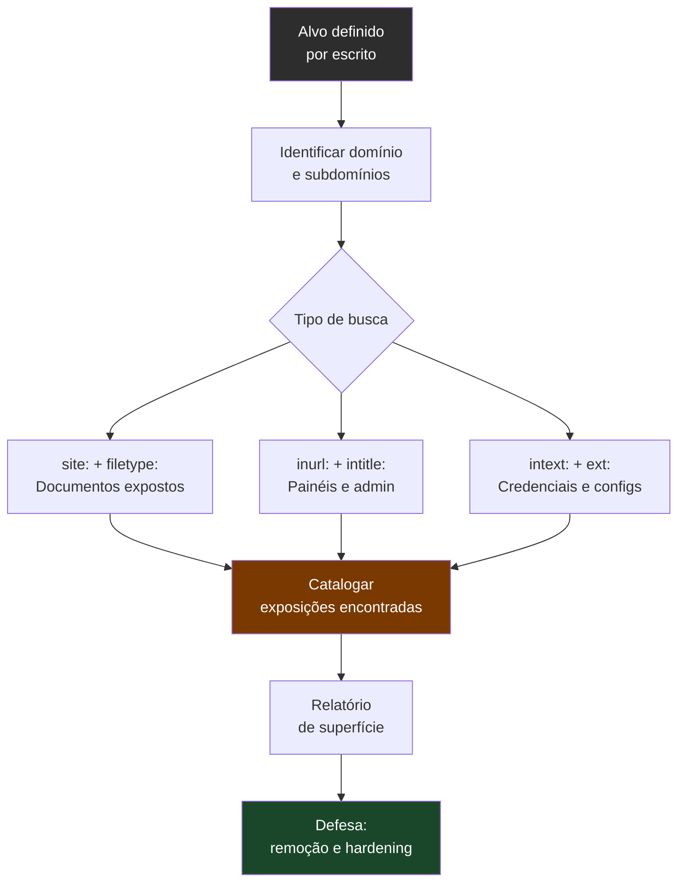
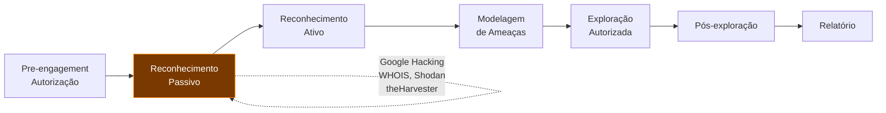

# Google Hacking

> [!quote] O Poder das Buscas Avançadas
> *Google Hacking é a utilização de filtros específicos do Google com o objetivo de obter informações específicas ou "escondidas".*

---

## 🔍 Filtros Básicos

> [!tip] Operadores de Busca
> Estes filtros permitem refinar suas pesquisas de forma poderosa.

| Filtro | Descrição | Exemplo |
|--------|-----------|---------|
| `intitle:` | Busca somente no título da página | `intitle:login` |
| `inurl:` | Busca na URL da página | `inurl:admin` |
| `site:` | Busca em um domínio específico | `site:iff.edu.br` |
| `ext:` ou `filetype:` | Busca por tipos de arquivo | `filetype:pdf` |
| `intext:` | Busca por texto no conteúdo da página | `intext:password` |
| `link:` | Busca páginas que contém um link específico | `link:exemplo.com` |

### Operadores Lógicos

| Operador | Símbolo | Função |
|----------|---------|--------|
| AND | `+` | Ambos os termos devem estar presentes |
| OR | `\|` | Um ou outro termo |
| NOT | `-` | Excluir termo da busca |

---

## 🎯 Combinando Filtros

> [!success] Dica
> É possível misturar os filtros para buscas mais precisas.

```
site:iff.edu.br filetype:pdf
```

```
site:empresa.com.br inurl:login intitle:admin
```

```
filetype:sql "password" -site:github.com
```

---

## 🎨 Filtros Avançados (Dorks)

> [!warning] Use com Responsabilidade
> Estes filtros podem revelar informações sensíveis. Use apenas em alvos autorizados.

### Listar instalações padrão do Apache

```
intitle:Test.Page.for.Apache "It worked!"
```

### Encontrar painéis de administração

```
inurl:admin intitle:login
```

### Encontrar arquivos de configuração

```
filetype:env "DB_PASSWORD"
```

### Encontrar diretórios expostos

```
intitle:"Index of" inurl:/backup
```

---

## 🕵️ Google Cache

> [!tip] Acessando Páginas sem Deixar Rastros
> É possível acessar o cache de uma página através do Google. Isso permite acessar uma página sem registrar seu IP diretamente.

![[Recursos/Segurança da informação/Coleta de informações/coleta-de-informacoes.png|Como acessar o cache do Google]]

Basta clicar na setinha ao lado do resultado de busca.

---

## 📚 Google Hacking Database (GHDB)

> [!success] Banco de Dados de Dorks
> A GHDB é um repositório com milhares de dorks testados e categorizados.

[🔗 Exploit-DB Google Hacking Database](https://www.exploit-db.com/google-hacking-database)

### Categorias de Dorks

- **Foothold**: Pontos de entrada
- **Sensitive Directories**: Diretórios sensíveis
- **Web Server Detection**: Detecção de servidores
- **Vulnerable Files**: Arquivos vulneráveis
- **Error Messages**: Mensagens de erro
- **Juicy Info**: Informações interessantes

---

## ⚠️ Considerações Éticas

> [!danger] Atenção
> - Utilize apenas para reconhecimento autorizado
> - Não acesse sistemas sem permissão
> - O Google pode bloquear IPs que fazem muitas buscas automatizadas

---

## 🗂️ Tabela Completa de Operadores

> [!info] Referência Rápida
> Use esta tabela como cheat sheet durante exercícios e pentests autorizados.

| Operador | Função | Sintaxe | Exemplo Real |
|----------|--------|---------|--------------|
| `site:` | Restringe a busca a um domínio | `site:dominio.com.br` | `site:gov.br filetype:pdf` |
| `inurl:` | Filtra por palavra na URL | `inurl:termo` | `inurl:phpMyAdmin` |
| `intitle:` | Filtra por palavra no título HTML | `intitle:"termo"` | `intitle:"Index of"` |
| `filetype:` / `ext:` | Filtra por extensão de arquivo | `filetype:ext` | `filetype:env` |
| `intext:` | Filtra por texto no corpo da página | `intext:"termo"` | `intext:"DB_PASSWORD"` |
| `cache:` | Exibe versão em cache do Google | `cache:url` | `cache:alvo.com.br` |
| `link:` | Páginas que linkam para a URL | `link:url` | `link:exemplo.com` |
| `allinurl:` | Todos os termos devem estar na URL | `allinurl:t1 t2` | `allinurl:admin login` |
| `allintitle:` | Todos os termos devem estar no título | `allintitle:t1 t2` | `allintitle:index backup` |
| `-` (NOT) | Exclui termo da busca | `-termo` | `filetype:sql -site:github.com` |
| `OR` / `\|` | Um ou outro termo | `t1 OR t2` | `inurl:admin OR inurl:painel` |
| `""` (aspas) | Busca pelo trecho exato | `"frase exata"` | `"Index of" "/etc"` |
| `*` (asterisco) | Coringa para qualquer palavra | `termo * outro` | `"password *" filetype:txt` |
| `..` (intervalo) | Intervalo numérico | `N..M` | `port:80..443` |

---

## 🧠 Como Funciona: Fluxo de Reconhecimento Passivo



> [!note] Reconhecimento Passivo
> Google Hacking é reconhecimento **passivo**: você não toca no alvo diretamente. O Google já rastreou e indexou as páginas. Mesmo assim, acessar o que você encontrou pode ser crime se o alvo não for seu ou não houver autorização.

---

## ⚖️ Marco Legal Brasileiro

> [!danger] Art. 154-A do Código Penal (Lei 12.737/2012, "Lei Carolina Dieckmann")
> **Invasão de dispositivo informático:**
> "Invadir dispositivo informático alheio, conectado ou não à rede de computadores, mediante violação indevida de mecanismo de segurança e com o fim de obter, adulterar ou destruir dados ou informações sem autorização expressa ou tácita do titular do dispositivo ou instalar vulnerabilidades para obter vantagem ilícita."
>
> **Pena:** reclusão de 1 a 4 anos + multa. Agravada de 1/3 a 2/3 se resultar em prejuízo econômico.

### O que isso significa na prática

- **Usar o Google para buscar**: legal. Os dados já estão públicos e indexados.
- **Acessar o sistema/arquivo que você achou**: pode ser crime, mesmo que esteja "aberto".
- **Acessar o servidor exposto ou baixar o banco de dados que apareceu no dork**: crime se não houver autorização.
- **Fazer o dork no seu próprio domínio**: totalmente legal e recomendado.
- **Bug bounty e pentest com contrato escrito**: legal dentro do escopo definido.

> [!warning] Linha de Ouro
> Encontrar a informação via Google não é crime. Explorar o que você encontrou em sistema de terceiros sem autorização é crime. Pratique sempre em ambientes autorizados.

---

## 🔥 Dorks Reais por Categoria

### Arquivos de Configuração e Credenciais

```
filetype:env "DB_PASSWORD"
```
```
filetype:env "APP_SECRET" OR "API_KEY" OR "SECRET_KEY"
```
```
ext:env "DATABASE_URL" OR "REDIS_URL"
```
```
filetype:cfg "password=" -site:github.com
```
```
filetype:xml "connectionString" "password"
```
```
filetype:yml "password:" -site:github.com
```

### Bancos de Dados Expostos

```
filetype:sql "INSERT INTO" "password"
```
```
filetype:sql "CREATE TABLE users"
```
```
ext:bak inurl:sql
```
```
intitle:"phpMyAdmin" "Welcome to phpMyAdmin"
```
```
inurl:phpMyAdmin/index.php intitle:phpMyAdmin
```

### Diretórios Abertos (Open Directory Listing)

```
intitle:"Index of" "backup"
```
```
intitle:"Index of" inurl:/uploads
```
```
intitle:"Index of /" inurl:"/etc"
```
```
intitle:"Index of" ".git"
```
```
intitle:"Index of" inurl:"/private"
```

### Painéis de Administração

```
inurl:admin intitle:login
```
```
inurl:/wp-admin/login intitle:WordPress
```
```
inurl:phpmyadmin intitle:phpMyAdmin
```
```
inurl:"/panel/" intitle:dashboard
```
```
allinurl:admin login site:br
```

### Câmeras e Dispositivos IoT

```
intitle:"Live View / - AXIS" inurl:view/view.shtml
```
```
inurl:"/view/index.shtml" intitle:Live
```
```
intitle:"WebcamXP 5" inurl:8080
```
```
inurl:top.htm inurl:currenttime
```

### Servidores Web Expostos

```
intitle:Test.Page.for.Apache "It worked!"
```
```
intitle:"Welcome to nginx!" inurl:80
```
```
intitle:"IIS Windows Server" inurl:iis-85.png
```

### Documentos Sensíveis

```
site:gov.br filetype:xls "cpf"
```
```
site:edu.br filetype:pdf "confidencial"
```
```
filetype:docx intext:"senha" intext:"usuário"
```
```
filetype:xlsx "username" "password"
```

### Repositórios Git Expostos

```
inurl:"/.git/config" -site:github.com
```
```
intitle:"Index of" ".git/refs"
```
```
inurl:/.git/HEAD ext:HEAD
```

### Erros e Stack Traces

```
intext:"Fatal error:" inurl:".php"
```
```
intext:"SQL syntax" inurl:".php"
```
```
intext:"Warning: mysql_" filetype:php
```
```
intext:"Notice: Undefined variable:" filetype:php
```

### Combinações de Alto Impacto (Pentesting Avançado)

```
site:alvo.com.br inurl:login intitle:admin filetype:php
```
```
site:alvo.com.br ext:env OR ext:cfg OR ext:bak
```
```
site:alvo.com.br intitle:"Index of" inurl:backup
```
```
site:alvo.com.br filetype:sql OR filetype:db
```

---

## 🔬 Ferramentas que Integram GHDB

> [!info] Automatizando a Coleta
> Diversas ferramentas consomem os dorks da GHDB automaticamente.

| Ferramenta | Descrição | Comando/Uso |
|------------|-----------|-------------|
| **Recon-ng** | Framework OSINT modular | módulo `recon/domains-vulnerabilities/ghdb_sjau` |
| **Metasploit** | Framework pentest | módulo `auxiliary/gather/search_email_collector` |
| **theHarvester** | Coleta de emails e domínios | `theHarvester -d alvo.com -b google` |
| **dork-cli** | CLI para Google dorks | `dork-cli "site:alvo.com filetype:env"` |
| **GooFuzz** | Fuzzing via Google | `goofuzz -d alvo.com` |

> [!warning] Cuidado com Automação
> Ferramentas automatizadas disparam o CAPTCHA do Google rapidamente. Use com moderação ou via APIs pagas (Custom Search API). Muitas buscas seguidas de um mesmo IP podem resultar em bloqueio temporário.

---

## 🛡️ Defesa: Como Proteger Seu Domínio

> [!info] Perspectiva Defensiva
> Pentesters precisam entender defesa para recomendar correções. Administradores precisam entender ataque para saber o que proteger.

### robots.txt: O Primeiro Passo

O arquivo `robots.txt` instrui robôs (incluindo o Googlebot) sobre quais diretórios não rastrear:

```
User-agent: *
Disallow: /admin/
Disallow: /backup/
Disallow: /private/
Disallow: /uploads/
```

> [!warning] Limitação Crítica do robots.txt
> O `robots.txt` é um pedido de cortesia, não um controle de acesso. Bots maliciosos ignoram o arquivo. Pior: o arquivo é público. Um atacante pode ler seu `robots.txt` e descobrir exatamente quais caminhos você quer esconder. **Nunca confie apenas no robots.txt para proteger dados sensíveis.**

### Meta Tag noindex

Para páginas específicas que não devem aparecer no Google:

```html
<meta name="robots" content="noindex, nofollow">
```

### X-Robots-Tag (HTTP Header)

Para arquivos que não têm código HTML (PDF, imagens, DOC):

```
X-Robots-Tag: noindex
```

### Medidas Estruturais de Defesa

| Problema | Solução |
|----------|---------|
| Diretório aberto (index of) | Desativar `Options +Indexes` no Apache / `autoindex off` no Nginx |
| `.env` acessível via web | Mover para fora do `public_html` ou bloquear no `.htaccess` |
| `.git/` acessível via web | Bloquear via regra de servidor (nunca deixar `.git` em `public/`) |
| Arquivos de backup expostos | Nunca salvar `.bak`, `.sql`, `.zip` na raiz web |
| Credenciais em código | Usar variáveis de ambiente e cofre de segredos |
| Mensagens de erro detalhadas | Desativar `display_errors` em produção |

### Google Search Console: Remover Indexação

Se uma página sensível já foi indexada:

1. Acesse [search.google.com/search-console](https://search.google.com/search-console)
2. Ferramenta "Remoção de URLs" (Removals)
3. Solicite remoção temporária (6 meses) ou permanente
4. Para permanente: adicione `noindex` na página E solicite remoção

### Auditoria Periódica

Execute esses dorks no seu próprio domínio regularmente para detectar exposições:

```
site:seudominio.com.br filetype:env OR filetype:sql OR filetype:cfg
```
```
site:seudominio.com.br intitle:"Index of"
```
```
site:seudominio.com.br inurl:admin OR inurl:login OR inurl:painel
```
```
site:seudominio.com.br intext:"error" OR intext:"exception" OR intext:"stack trace"
```

---

## 🧩 Metodologia: Google Hacking na Fase de Reconhecimento

> [!tip] Onde o Google Hacking se encaixa no Pentest
> Segundo o [[Preparando o terreno|PTES]] (Penetration Testing Execution Standard) e o **OWASP Testing Guide**, Google Hacking pertence à fase de **Reconhecimento Passivo** (Passive Reconnaissance / OSINT).



### Checklist de Reconhecimento com Google Hacking

- [ ] Mapear subdomínios: `site:*.dominio.com`
- [ ] Checar documentos públicos: `site:dominio.com filetype:pdf OR filetype:docx OR filetype:xls`
- [ ] Verificar diretórios abertos: `site:dominio.com intitle:"Index of"`
- [ ] Buscar arquivos de configuração: `site:dominio.com ext:env OR ext:cfg OR ext:ini`
- [ ] Verificar repositórios expostos: `site:dominio.com inurl:.git`
- [ ] Checar painéis de admin: `site:dominio.com inurl:admin OR inurl:login`
- [ ] Procurar stack traces e erros: `site:dominio.com intext:"Fatal error" OR intext:"SQL syntax"`
- [ ] Buscar tecnologias usadas: `site:dominio.com inurl:wp-admin OR inurl:joomla OR inurl:drupal`

---

## 🧪 Atividades Práticas

> [!example] 🧪 Atividade 1: Auditoria do Seu Domínio
> **Objetivo:** descobrir o que o Google sabe sobre um domínio que você controla.
>
> **Tarefa:** execute os dorks abaixo substituindo `seudominio.com` pelo domínio ou subdomínio do seu projeto, portfólio, GitHub Pages ou site pessoal.
>
> ```
> site:seudominio.com filetype:pdf OR filetype:docx
> ```
> ```
> site:seudominio.com intitle:"Index of"
> ```
> ```
> site:seudominio.com inurl:admin OR inurl:login
> ```
> ```
> site:seudominio.com intext:"password" OR intext:"senha"
> ```
>
> **Resultado esperado:** listar tudo que o Google indexou do seu domínio e identificar se há algo que não deveria ser público. Se encontrar exposições: documentar e corrigir.
>
> **Reflexão:** se você encontrou algo sensível no seu próprio site, imagine o que um atacante poderia encontrar em sites corporativos descuidados.

> [!example] 🧪 Atividade 2: Explorar a Google Hacking Database
> **Objetivo:** entender como a GHDB categoriza e disponibiliza dorks para pesquisadores.
>
> **Tarefa:**
> 1. Acesse [exploit-db.com/google-hacking-database](https://www.exploit-db.com/google-hacking-database)
> 2. Escolha uma das categorias: **Files Containing Passwords**, **Sensitive Directories** ou **Web Server Detection**
> 3. Selecione um dork da lista
> 4. Execute no Google **acrescentando `site:seudominio.com`** ao início para restringir ao seu alvo autorizado
> 5. Anote: o dork encontrou algo? O que ele buscava originalmente?
>
> **Exemplo de dork da GHDB adaptado para uso seguro:**
> ```
> site:seudominio.com intitle:"Index of" "parent directory"
> ```
> ```
> site:seudominio.com ext:bak OR ext:old OR ext:backup
> ```
>
> **Resultado esperado:** compreender como a GHDB organiza dorks por categoria e gravidade, e praticar a adaptação de dorks genéricos para escopo controlado.

> [!example] 🧪 Atividade 3: Construindo Dork Combinado (3 Operadores)
> **Objetivo:** praticar a sintaxe combinada de operadores.
>
> **Tarefa:** construa um dork usando pelo menos 3 operadores diferentes e execute-o no Google. Siga o modelo:
>
> ```
> site:DOMINIO filetype:EXTENSAO intext:"TERMO_SENSIVEL"
> ```
>
> **Exemplos para praticar (use com seu domínio):**
> ```
> site:seudominio.com filetype:pdf intitle:"confidencial"
> ```
> ```
> site:seudominio.com inurl:upload filetype:php intext:"<?php"
> ```
> ```
> site:seudominio.com intitle:"login" inurl:admin intext:"password"
> ```
>
> **Entregável:** registre o dork que você construiu, o alvo usado, e o que o resultado mostrou (ou não mostrou). Explique o que cada operador fez na busca.

---

## 🌐 Shodan: O Google dos Dispositivos

> [!tip] Indo Além do Google
> O Shodan ([shodan.io](https://www.shodan.io)) é um mecanismo de busca especializado em dispositivos conectados à internet: servidores, câmeras, roteadores, impressoras, sistemas SCADA. Funciona de forma similar ao Google Hacking, mas com foco em banners de serviço e portas abertas.

| Filtro Shodan | Equivalente Google | Exemplo |
|---|---|---|
| `hostname:dominio.com` | `site:dominio.com` | `hostname:iff.edu.br` |
| `port:22` | (não tem equivalente) | `port:22 country:BR` |
| `org:"Nome da Org"` | (não tem equivalente) | `org:"IFF"` |
| `product:nginx` | `intitle:"Welcome to nginx"` | `product:apache country:BR` |
| `country:BR` | `site:.br` | `port:3389 country:BR` |

> [!warning] Shodan e o Contexto Legal
> Assim como no Google Hacking, usar o Shodan para descobrir exposições é legal. Tentar acessar o dispositivo exposto que você encontrou, sem autorização, é crime (art. 154-A CP).

---

## 🧭 Dorks por Tecnologia Alvo

### WordPress

```
site:alvo.com inurl:wp-content/uploads filetype:php
```
```
site:alvo.com inurl:wp-json/wp/v2/users
```
```
site:alvo.com intitle:"WordPress" inurl:wp-login
```

### Joomla

```
site:alvo.com inurl:administrator/index.php intitle:Joomla
```

### Laravel / PHP

```
site:alvo.com intext:"APP_KEY=" filetype:env
```
```
site:alvo.com intext:"Whoops! There was an error."
```

### Node.js / Express

```
site:alvo.com intext:"Cannot GET" filetype:html
```
```
site:alvo.com filetype:json inurl:package.json -site:github.com
```

### Bancos de Dados

```
site:alvo.com filetype:sql intext:"INSERT INTO"
```
```
site:alvo.com inurl:adminer.php intitle:Adminer
```

---

> [!note] 📚 Fontes (2026)
> - [Google Hacking Database (GHDB), Exploit-DB, Offensive Security](https://www.exploit-db.com/google-hacking-database)
> - [GHDB Guide 2026, CybelAngel](https://cybelangel.com/blog/google-hacking-database-ghdb-guide/)
> - [Google Dork Operators Cheat Sheet 2026, DorkPlus](https://dorkplus.com/blog/google-dork-operators-cheat-sheet-2026)
> - [Google Dorks: OSINT and Red Team Use, Secra](https://secra.es/en/blog/google-dorks-osint-reconnaissance)
> - [Google Dorks Cheat Sheet 2026, StationX](https://www.stationx.net/google-dorks-cheat-sheet/)
> - [Google Dorking: Bug Bounty & Pentest Guide, IntelligenceX Blog](https://blog.intelligencex.org/google-dorking-bug-bounty-penetration-testing-osint-guide)
> - [Mastering Google Hacking, WebAsha Technologies](https://www.webasha.com/blog/mastering-google-hacking-advanced-search-operators-and-exploit-db-for-cybersecurity-and-osint)
> - [Crime de Invasão de Dispositivo Informático, Art. 154-A CP, Jusbrasil](https://www.jusbrasil.com.br/artigos/crime-de-invasao-de-dispositivo-informatico-artigo-154-a-cp/153070617)
> - [Robots.txt Introduction and Guide, Google Search Central](https://developers.google.com/search/docs/crawling-indexing/robots/intro)
> - [Google Hacking, T3ch Solução (PT-BR, 2025)](https://www.t3chsolucao.com/2025/04/google-hacking-explorando-pesquisas.html)
> - [Google Dorks 2026 Guia Completo, CanalQB (PT-BR)](https://www.canalqb.com.br/2026/05/google-dorks-2026-guia-completo-de.html)
