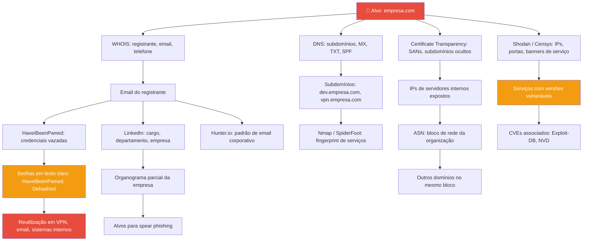

# Information Gathering Frameworks (OSINT)

> [!quote] Inteligência de Fontes Abertas
> *OSINT é a arte de coletar informações de fontes publicamente acessíveis, sem interagir diretamente com o alvo.*

---

## 🔍 O que é OSINT?

> [!success] Open Source Intelligence
> **OSINT** (Open Source Intelligence) é a coleta e análise de informações a partir de fontes públicas e acessíveis, sem acesso não autorizado a sistemas. A disciplina é usada por profissionais de segurança, jornalistas, analistas de inteligência e times de red team para mapear superfícies de ataque, identificar vazamentos e entender o perfil de um alvo antes de qualquer interação direta.

OSINT é sempre a **primeira fase** de um teste de penetração ético: você aprende tudo que o alvo já expõe publicamente antes de tocar em qualquer sistema. Quanto mais informação coletada nessa fase, mais cirúrgico e eficiente é o ataque simulado.

### Fontes de OSINT

| Categoria | Exemplos |
|-----------|----------|
| **Internet** | Sites, redes sociais, fóruns, Pastebin |
| **Registros públicos** | WHOIS, certidões, processos, Receita Federal |
| **Mídia** | Notícias, press releases, podcasts |
| **Acadêmico** | Papers, teses, conferências, arXiv |
| **Geográfico** | Mapas, imagens de satélite, Street View |
| **Técnico** | DNS, certificados SSL, logs de Certificate Transparency |
| **Dark Web** | Fóruns Tor, mercados underground, dumps de credenciais |
| **Código-fonte** | GitHub, GitLab, Bitbucket (segredos vazados em repos) |

---

## 🛠️ Frameworks Populares

> [!tip] Estruturas de Trabalho
> Cada framework tem um nicho: automatização em massa (SpiderFoot), visualização de relações (Maltego), diretório de ferramentas (OSINT Framework) ou reconhecimento modular via CLI (Recon-ng). Na prática, usam-se dois ou mais em conjunto.

| Framework | Tipo | Interface | Destaques |
|-----------|------|-----------|-----------|
| **OSINT Framework** | Diretório de ferramentas | Web (site) | Centenas de ferramentas categorizadas |
| **SpiderFoot** | Automatização OSINT | CLI + Web UI | 200+ módulos, 100+ fontes de dados |
| **Maltego** | Visualização de grafo | Desktop (GUI) | Transforms, link analysis, CE gratuito |
| **Recon-ng** | Framework modular | CLI (Metasploit-like) | Workspaces, banco SQL, outputs para Metasploit |
| **theHarvester** | Coleta rápida | CLI | Emails, subdomínios, IPs; sem API nativa |
| **Amass** | Enumeração de ativos | CLI | Subdomain discovery em escala |
| **Shodan** | Busca de dispositivos | Web + API | IoT, servidores, câmeras, dispositivos expostos |

---

## 🕷️ SpiderFoot: OSINT Automatizado em Profundidade

SpiderFoot é uma das ferramentas mais poderosas para OSINT automatizado. Escrita em Python 3, licença MIT, inclusa no Kali Linux. Você fornece um **seed** (semente: domínio, IP, email, nome de pessoa, endereço Bitcoin, ASN) e o SpiderFoot varre dezenas de fontes automaticamente, correlacionando os resultados.

### Capacidades Técnicas (2025-2026)

- **Mais de 200 módulos** integrados, a maioria sem necessidade de chave de API.
- Integração com **mais de 100 fontes de dados**: Shodan, HaveIBeenPwned, AlienVault OTX, GreyNoise, SecurityTrails, VirusTotal, Censys, Dehashed, AWS S3, Azure Blobs, Google Cloud Storage, redes Tor e muito mais.
- **Motor de correlação YAML** com 37 regras pré-definidas para detectar padrões suspeitos.
- Backend **SQLite** com suporte a queries customizadas.
- Exportação em **CSV, JSON e GEXF** (GraphML para visualização de grafos).
- Suporte a **Docker** para implantação isolada.
- **Interface Web** embutida (servidor local) e **CLI completa** para automação.

### Tipos de Alvo que o SpiderFoot Aceita

```
Domínios e subdomínios    exemplo.com.br
Endereços IP              192.0.2.1
Subredes CIDR             192.0.2.0/24
Endereços de email        joao@empresa.com
Nomes de pessoa           João Silva
Nomes de usuário          joaosilva99
Números de telefone       +55 21 99999-9999
Endereços Bitcoin/Ethereum  1A2B3C...
ASNs                      AS12345
Hostnames                 mail.empresa.com
```

### Instalação no Kali Linux

```bash
# Opção 1: via gerenciador de pacotes (Kali)
sudo apt update && sudo apt install spiderfoot -y

# Opção 2: via pip (qualquer Linux com Python 3.8+)
git clone https://github.com/smicallef/spiderfoot.git
cd spiderfoot
pip3 install -r requirements.txt

# Opção 3: via Docker
docker pull smicallef/spiderfoot
docker run -p 5001:5001 smicallef/spiderfoot
```

### Iniciando a Interface Web

```bash
# Iniciar servidor local
python3 ./sf.py -l 127.0.0.1:5001

# Ou com spiderfoot instalado via apt
spiderfoot -l 127.0.0.1:5001
```

Acesse no navegador: `http://127.0.0.1:5001`

### Uso via CLI (Linha de Comando)

```bash
# Conectar ao servidor SpiderFoot via CLI
spiderfoot-cli -s http://127.0.0.1:5001

# Scan básico de um domínio (todos os módulos)
python3 ./sfcli.py -s empresa.com -t INTERNET_NAME -u all

# Scan com output em CSV
python3 ./sf.py -s empresa.com -m sfp_dnsresolve,sfp_ssl,sfp_whois -o csv > resultado.csv

# Scan exportando em JSON para integrar com outras ferramentas
python3 ./sf.py -s 192.0.2.1 -u all -o json > ips_encontrados.json

# Autenticação em servidor remoto
spiderfoot-cli -s http://servidor:5001 -u admin -P ~/.sfpass
```

> [!warning] Boas Práticas de Segurança
> Use `-P` com um arquivo de senha em vez de digitar a senha diretamente no terminal. Isso evita que a credencial apareça no histórico do shell (`~/.bash_history`). Nunca exponha a porta 5001 para a internet sem autenticação.

### Perfis de Scan (Casos de Uso)

| Perfil | Uso | Intensidade |
|--------|-----|-------------|
| **Passive** | Sem contato com o alvo, apenas dados públicos | Baixa |
| **Safe** | Fontes públicas + verificações não intrusivas | Média |
| **All** | Todos os módulos (inclui alguns ativos) | Alta |
| **Footprint** | Mapeamento de ativos da organização | Média |
| **Investigate** | Investigação de suspeito/IOC | Média-Alta |

### Análise de Resultados

Após o scan, o SpiderFoot apresenta:

1. **Grafo de relacionamentos**: entidades conectadas (domínios, IPs, emails, credenciais vazadas).
2. **Tabela de dados**: filtrável por tipo de dado e módulo.
3. **Alertas de risco**: vulnerabilidades identificadas, credenciais expostas, domínios suspeitos.
4. **Exportação**: CSV para planilhas, JSON para pipelines, GEXF para Gephi/Cytoscape.

```bash
# Agendar scan recorrente via cron (monitoramento contínuo)
# Exemplo: scan diário às 02h, resultado salvo com data
0 2 * * * cd /opt/spiderfoot && python3 sf.py -s meudominio.com -u all -o json > /logs/scan_$(date +\%Y\%m\%d).json
```

---

## 🕵️ Maltego: Visualização de Inteligência em Grafos

Maltego é uma plataforma de investigação que representa dados como **grafos de entidades**: cada nó é um dado (domínio, IP, email, pessoa, organização) e cada aresta é uma relação descoberta por um **transform**. É amplamente utilizado pelo FBI, INTERPOL e equipes de threat intelligence corporativas.

### Community Edition (CE) vs Versões Pagas

| Aspecto | Community Edition (CE) | XL / Enterprise |
|---------|------------------------|-----------------|
| **Custo** | Gratuito | A partir de US\$ 6.600/ano |
| **Entidades por grafo** | Até 10.000 | Ilimitado |
| **Resultados por transform** | Máximo 24 | Ilimitado |
| **Créditos mensais** | 200 créditos | Volume maior |
| **Colaboração** | Real-time graph sharing | Sim |
| **Exportação** | PDF, CSV, GraphML, PNG | Completa |
| **Cloud Graphs** | Disponível (2025) | Sim |

> [!tip] Para o Laboratório
> A Community Edition é suficiente para aprender OSINT e conduzir investigações educacionais. O limite de 24 resultados por transform pode parecer restritivo, mas é adequado para mapear infraestruturas de pequeno e médio porte.

### Versão Atual (2026)

Maltego Graph Desktop: **versão 4.11.3** (maio de 2026). Principais avanços recentes:
- **Cloud Graphs com criptografia ponta a ponta** (out/2025, versão 4.11.0).
- **Integração com Maltego Academy** (jan/2025, versão 4.9).
- **Suporte a BigInteger** em propriedades de entidades.
- **Autenticação por Maltego ID** com 2FA disponível.
- Correções de segurança em Jackson, Bouncy Castle e Keycloak (mai/2026, versão 4.11.3).

### Conceitos Fundamentais

**Entidades (Entities)**: os nós do grafo. Exemplos: `Domain`, `IP Address`, `Email Address`, `Person`, `Organization`, `Phone Number`, `URL`, `Netblock`.

**Transforms**: as operações que enriquecem entidades. Um transform recebe uma entidade como entrada, consulta uma API ou banco de dados externo e retorna novas entidades relacionadas. São os "verbos" do Maltego.

**Hubs (Transform Hubs)**: repositórios de transforms organizados por fornecedor ou caso de uso. Exemplos incluídos na CE:
- **Maltego Standard Transforms (CTAS)**: DNS, WHOIS, email lookup, redes sociais públicas.
- **Shodan**: dispositivos expostos, banners de serviço.
- **HaveIBeenPwned**: verificação de vazamentos de credenciais.
- **VirusTotal**: reputação de domínios e IPs.
- **Companies House** (UK): dados corporativos públicos.

### Instalação e Configuração Inicial

```
1. Acesse: https://www.maltego.com/ce-registration/
2. Crie seu Maltego ID (email + senha + verificação)
3. Baixe o Maltego Graph Desktop para seu SO
4. Instale e abra o aplicativo
5. Autentique com seu Maltego ID
6. Aceite o EULA e selecione "Browser login"
7. Acesse o Hub Store para instalar transforms adicionais
```

### Primeiros Passos: Investigar um Domínio

```
1. Abra o Maltego Graph
2. Crie um novo grafo (File > New Graph)
3. Na barra de entidades (esquerda), arraste "Domain" para o grafo
4. Dê duplo clique na entidade e digite o domínio: empresa.com
5. Clique com o botão direito na entidade
6. Selecione "Run Transforms" > "DNS from Domain"
   Resultado: subdomínios, IPs associados
7. Clique com o botão direito em um IP resultante
8. Selecione "Run Transforms" > "To Shodan [using Shodan]"
   Resultado: portas abertas, banners de serviço, geolocalização
9. Continue expandindo o grafo a partir de qualquer entidade
```

### Transforms Mais Úteis para Pentest (CE)

| Transform | Entrada | Saída |
|-----------|---------|-------|
| `To DNS Name (from Domain)` | Domain | Subdomínios |
| `To IP Address (DNS)` | Domain | IPs |
| `To Netblock (owner)` | IP Address | Bloco de rede |
| `To Websites (from WHOIS)` | Domain | Sites relacionados |
| `To Email Addresses (from Domain)` | Domain | Emails |
| `To Phone Numbers` | Person | Telefones públicos |
| `To Social Media Profiles` | Email/Person | Perfis em redes |
| `Shodan: To Open Port` | IP Address | Portas e serviços |
| `HIBP: To Breaches` | Email Address | Vazamentos de dados |

---

## 🗺️ OSINT Framework: O Mapa de Ferramentas

O **OSINT Framework** (osintframework.com) não é uma ferramenta de coleta em si, mas um **diretório interativo organizado como mapa mental** com centenas de ferramentas OSINT gratuitas, categorizadas por objetivo de investigação. É o ponto de partida ideal para qualquer investigador que precisa saber qual ferramenta usar para cada tipo de dado.

### Como Navegar o Site

```
1. Acesse: https://osintframework.com
2. Você verá um mapa mental (árvore interativa)
3. Clique em qualquer categoria para expandir
4. Ao chegar em uma folha (ferramenta), clique para abrir
5. Use os indicadores para entender o tipo de ferramenta
```

### Indicadores de Tipo de Ferramenta

| Indicador | Significado |
|-----------|-------------|
| **(T)** | Requer instalação local |
| **(D)** | Google Dork (operador de busca avançada) |
| **(R)** | Requer cadastro/registro |
| **(M)** | URL precisa ser editada manualmente |
| *(sem indicador)* | Acesso direto pelo navegador, sem cadastro |

### Categorias Principais

```
OSINT Framework
├── Username (rastreamento de usuário entre plataformas)
├── Email Address (verificação, vazamentos, titular)
├── Domain Name (WHOIS, DNS, subdomínios, histórico)
├── IP Address (geolocalização, ASN, blacklists)
├── Images / Videos (busca reversa, metadados EXIF)
├── Social Networks (Facebook, Instagram, LinkedIn, Twitter/X)
├── Instant Messaging (Telegram, Discord, Signal)
├── People Search (nomes, endereços, relações)
├── Dating (perfis em apps de relacionamento)
├── Phone Numbers (operadora, localização, identidade)
├── Business Records (CNPJ, WHOIS, registros comerciais)
├── Transportation (veículos, placas, aviação)
├── Geospatial (coordenadas, imagens de satélite)
├── Dark Web (buscadores Tor, mercados)
└── Threat Intelligence (IOCs, malware, campanhas APT)
```

### Ferramentas Destaque por Categoria

| Categoria | Ferramentas Notáveis |
|-----------|---------------------|
| **Domínios** | ViewDNS.info, DNSDumpster, SecurityTrails |
| **Email** | Hunter.io, EmailRep, HaveIBeenPwned |
| **Redes Sociais** | Social Blade, Sherlock (username), Namechk |
| **Imagens** | TinEye, Google Images, InVID, Jeffrey's Exif Viewer |
| **Pessoas** | Pipl, Spokeo, BeenVerified |
| **Ameaças** | Shodan, Censys, GreyNoise, AbuseIPDB |
| **Dark Web** | Tor2web, OnionSearch, IntelX |

---

## 🔗 Como os Frameworks OSINT Correlacionam Dados

O verdadeiro poder do OSINT está em **conectar os pontos** entre fontes distintas. Um único domínio pode revelar emails de funcionários via Certificate Transparency, que levam a perfis em redes sociais, que expõem informações de infraestrutura em posts públicos.



---

## 📊 Comparativo de Frameworks OSINT (2026)

| Critério | SpiderFoot | Maltego CE | OSINT Framework | Recon-ng |
|----------|------------|------------|-----------------|----------|
| **Tipo** | Automação | Visualização | Diretório | Modular CLI |
| **Interface** | Web + CLI | Desktop GUI | Web (site) | CLI |
| **Custo** | Gratuito | Gratuito (CE) | Gratuito | Gratuito |
| **Módulos/Transforms** | 200+ módulos | Centenas de transforms | N/A (links) | 100+ módulos |
| **Fontes de dados** | 100+ APIs | 120+ data partners | Centenas de links | 50+ fontes |
| **Automatização** | Total | Parcial | Nenhuma | Parcial |
| **Curva de aprendizado** | Média | Alta | Baixa | Média |
| **Output** | CSV, JSON, GEXF | PDF, CSV, GraphML | N/A | CSV, JSON, DB |
| **Dark web** | Sim (via Tor) | Não (CE) | Sim (links) | Não |
| **Melhor para** | Scan automatizado | Relações visuais | Escolha de ferramenta | Recon programático |
| **Requisito** | Python 3 + pip | Java (desktop) | Só navegador | Python 3 + pip |
| **Uso em red team** | Excelente | Excelente | Referência | Excelente |

---

## 🎯 Metodologia OSINT para Red Team

> [!success] Processo de Coleta Estruturado
> A metodologia segue um ciclo iterativo: coleta passiva primeiro, ativa depois, sempre documentando.

```
1. DEFINIR ESCOPO E OBJETIVOS
   Quem é o alvo? Qual o perímetro autorizado?
   Quais informações são relevantes para o engajamento?
   ↓
2. RECONHECIMENTO PASSIVO (Zero contato com o alvo)
   WHOIS, DNS público, Certificate Transparency
   Redes sociais, LinkedIn, GitHub
   Shodan/Censys para IPs do alvo
   Busca de credenciais vazadas (HIBP, Dehashed)
   ↓
3. AGREGAÇÃO E CORRELAÇÃO
   Juntar dados de múltiplas fontes
   Identificar padrões (email format, ASN blocks)
   Construir grafo de relações no Maltego ou SpiderFoot
   ↓
4. RESOLUÇÃO DE ENTIDADES
   Eliminar falsos positivos
   Confirmar atribuições (esse IP é mesmo da empresa?)
   ↓
5. ANÁLISE DE LACUNAS
   O que ainda não sei? Quais subdomínios não resolvi?
   Quais credenciais podem estar ativas?
   ↓
6. RECONHECIMENTO ATIVO DIRIGIDO (Apenas no escopo autorizado)
   Nmap em IPs confirmados
   Enumeração ativa de subdomínios
   Fingerprinting de aplicações web
   ↓
7. DOCUMENTAR E REPORTAR
   Evidências com timestamps
   Fontes de cada dado
   Vetores de ataque identificados
```

### Passive vs Active Reconnaissance

| Aspecto | Passiva | Ativa |
|---------|---------|-------|
| **Contato com o alvo** | Nenhum | Direto |
| **Risco de detecção** | Mínimo | Alto |
| **Exemplos** | WHOIS, OSINT Framework, Shodan | Nmap, Nikto, DirBuster |
| **Legalidade** | Sempre lícita (fontes públicas) | Exige autorização explícita |
| **Fase no pentest** | Reconhecimento | Scanning/Enumeration |

> [!danger] Art. 154-A do Código Penal Brasileiro
> "Invadir dispositivo informático alheio, conectado ou não à rede de computadores, mediante violação indevida de mecanismo de segurança (...), com o fim de obter, adulterar ou destruir dados (...) Pena: detenção, de 3 (três) meses a 1 (um) ano, e multa."
> 
> **OSINT passivo é legal** porque usa apenas dados publicamente disponíveis. O art. 154-A tipifica o acesso não autorizado a sistemas. Qualquer scan ativo ou acesso a sistemas sem contrato de pentest assinado pode configurar crime. Sempre obtenha autorização por escrito antes de qualquer atividade ativa.

---

## ⚙️ Fluxo Real: SpiderFoot + Maltego + OSINT Framework

A prática profissional combina as três ferramentas em um pipeline complementar:

```
OSINT Framework (osintframework.com)
    → Identificar qual ferramenta usar para cada tipo de dado
    → Navegar categoria "Domain Name" para ver opções

SpiderFoot (automação em massa)
    → Fornecer seed (ex: empresa.com)
    → Deixar rodar com perfil "Passive" ou "Safe"
    → Exportar resultado em JSON

Maltego CE (visualização e correlação)
    → Importar entidades do SpiderFoot
    → Executar transforms específicos sobre os resultados
    → Identificar conexões não óbvias no grafo
    → Exportar relatório visual (PDF/PNG) para o cliente
```

### Exemplo Prático: Investigação de Domínio Passo a Passo

**Objetivo**: mapear a superfície de ataque de `alvo.com.br` (domínio fictício, uso em laboratório autorizado).

**Passo 1: OSINT Framework para orientação**
```
1. Acesse osintframework.com
2. Expanda: Domain Name > WHOIS Records
   Ferramentas: ViewDNS.info, DomainTools (R)
3. Expanda: Domain Name > Subdomains
   Ferramentas: DNSDumpster, Sublist3r (T)
4. Expanda: Email Address > Breach Data
   Ferramentas: HaveIBeenPwned (padrão: não requer cadastro)
```

**Passo 2: SpiderFoot CLI para automação**
```bash
# Iniciar SpiderFoot
spiderfoot -l 127.0.0.1:5001 &

# Scan passivo do domínio alvo (apenas fontes públicas)
# Via interface web: abrir http://127.0.0.1:5001
# New Scan > Target: alvo.com.br > Use Case: Passive

# Via CLI com módulos específicos
python3 sf.py -s alvo.com.br \
  -m sfp_dnsresolve,sfp_ssl,sfp_whois,sfp_shodan,sfp_haveibeenpwned \
  -o json > /tmp/scan_alvo.json

# Aguardar conclusão e examinar resultados
# Filtrar só emails encontrados
cat /tmp/scan_alvo.json | python3 -c "
import json, sys
data = json.load(sys.stdin)
emails = [r for r in data if r['type'] == 'EMAILADDR']
for e in emails:
    print(e['data'])
"
```

**Passo 3: Maltego CE para visualização**
```
1. Abrir Maltego Graph > New Graph
2. Arrastar entidade "Domain" > digitar: alvo.com.br
3. Botão direito > Run Transforms > DNS from Domain
   Resultado: subdomínios, IPs resolvidos
4. Selecionar um IP > Run Transforms > Shodan: To Open Port
   Resultado: portas abertas, fingerprint de serviço
5. Selecionar um email > Run Transforms > HIBP: Email to Breach
   Resultado: breach datasets onde o email aparece
6. File > Export Graph > PDF (relatório visual para cliente)
```

---

## 📱 Rastreamento Digital e Pegada Digital

> [!warning] Pegada Digital
> Com apenas um número de telefone, é possível rastrear uma pessoa através de sua pegada digital. O mesmo vale para um email ou username: cada dado é um ponto de entrada para uma investigação OSINT completa.

[📺 How someone can track your digital footprint with just a phone number](https://www.instagram.com/reel/DBJsVBrI0l6/?igsh=MXgwMHEzbzh5MG1pMA%3D%3D)

### O que é Pegada Digital?

| Tipo | Exemplos |
|------|----------|
| **Ativa** | Posts em redes sociais, comentários, perfis criados |
| **Passiva** | Cookies, logs de acesso, metadados de fotos |
| **Profissional** | LinkedIn, currículos online, publicações acadêmicas |
| **Financeira** | Processos públicos, registros de empresa, CNPJ |
| **Técnica** | Registros WHOIS, commits no GitHub, headers de email |

---

## 🛡️ Defesa: Gerenciando sua Própria Pegada Digital

Entender OSINT também é entender como **reduzir a superfície de exposição** pessoal e organizacional. As mesmas técnicas usadas para atacar podem ser usadas para auditar e fortalecer.

### Auditoria Pessoal

```bash
# Verificar seu email em bases de vazamento
# Site: haveibeenpwned.com (sem cadastro)

# Busca reversa do seu nome no Google
"João Silva" site:linkedin.com
"João Silva" filetype:pdf

# Verificar seus dados no WHOIS de domínios registrados
whois seudominio.com.br

# Verificar metadados EXIF de fotos que você publicou
# Instalar: sudo apt install exiftool
exiftool foto_publicada.jpg
# Campos críticos: GPS GPSLatitude, GPS GPSLongitude, Make, Model
```

### Medidas de Mitigação para Organizações

| Vetor de Exposição | Mitigação |
|--------------------|-----------|
| WHOIS com dados reais | Usar serviço de privacidade WHOIS / domínio via CNPJ da empresa |
| Emails de funcionários em sites | Considerar formato não padrão ou contato via formulário |
| Subdomínios de staging/dev expostos | Remover ou colocar atrás de VPN |
| Metadados em documentos publicados | Limpar com `exiftool -all= documento.pdf` antes de publicar |
| Credenciais em repositórios GitHub | Usar git-secrets, gitleaks no pre-commit hook |
| Versões de software em headers HTTP | Configurar servidor para remover `X-Powered-By`, `Server` |
| Certificados SSL com SANs internos | Usar wildcard certificates ou SANs apenas para domínios públicos |

### Ferramentas de Auto-Auditoria

```bash
# SpiderFoot contra seu próprio domínio (autorizado)
spiderfoot -l 127.0.0.1:5001 &
# Interface web: New Scan > Target: seudominio.com > Use Case: Footprint

# theHarvester (rápido, emails e subdomínios)
theHarvester -d seudominio.com -b google,bing,linkedin -l 100

# Amass (subdomínios em escala)
amass enum -passive -d seudominio.com

# Sherlock (seu username em centenas de plataformas)
sherlock seuusername
```

---

## ⚠️ Considerações Éticas e Legais

> [!danger] Atenção: Limites Legais e Éticos
> - Use apenas para fins **legítimos e autorizados**
> - **OSINT passivo** é legal: dados públicos, sem acesso a sistemas
> - **Qualquer interação ativa** sem autorização escrita pode configurar crime (art. 154-A CP)
> - Respeite a **privacidade** das pessoas: dado público não significa dado de uso irrestrito
> - Documente sempre suas fontes, métodos e escopo
> - Em ambientes de laboratório e CTF: ataque apenas os alvos designados
> - Em testes de penetração reais: exija Carta de Autorização (Rules of Engagement) assinada

### Princípio da Proporcionalidade

A coleta de OSINT deve ser proporcional ao objetivo. Mapear a infraestrutura de uma empresa para um pentest contratado é legítimo. Usar as mesmas técnicas para investigar um indivíduo sem motivo ou sem autorização configura violação de privacidade, podendo violar a **LGPD (Lei Geral de Proteção de Dados, Lei 13.709/2018)**, que protege dados pessoais mesmo que publicamente acessíveis, quando o tratamento não tem base legal adequada.

---

## 🧪 Atividades Práticas

> [!example] 🧪 Atividade 1: Scan SpiderFoot no Seu Próprio Domínio
> **Ferramenta**: SpiderFoot (web interface ou CLI)
> **Objetivo**: Mapear a superfície de ataque do seu próprio domínio ou de um domínio de laboratório autorizado.
>
> **Passos**:
> 1. Instale o SpiderFoot (`sudo apt install spiderfoot`) e inicie: `spiderfoot -l 127.0.0.1:5001`
> 2. Acesse `http://127.0.0.1:5001` no navegador
> 3. Clique em "New Scan"
> 4. Target: insira seu domínio ou o domínio de laboratório fornecido pelo professor
> 5. Use Case: selecione "Passive" (zero contato com o alvo)
> 6. Clique em "Run Scan" e aguarde a conclusão (pode levar 5-15 minutos)
> 7. Ao terminar, navegue pelas abas: "Browse", "Graph", "Summary"
>
> **Resultados esperados para documentar**:
> - Quantos subdomínios foram descobertos?
> - Quais emails foram encontrados?
> - Alguma credencial vazada (HaveIBeenPwned)?
> - Quais serviços o Shodan identificou?
> - Qual dado te surpreendeu mais?
>
> **Entregável**: Screenshot do grafo + tabela dos 5 dados mais críticos encontrados + análise de risco (1 parágrafo).

---

> [!example] 🧪 Atividade 2: Primeiro Transform no Maltego CE
> **Ferramenta**: Maltego Graph Community Edition
> **Objetivo**: Usar o Maltego para investigar a infraestrutura de um domínio de laboratório e visualizar as relações entre entidades.
>
> **Passos**:
> 1. Cadastre-se em `https://www.maltego.com/ce-registration/` e instale o Maltego Graph Desktop
> 2. Autentique com seu Maltego ID
> 3. Crie um novo grafo (File > New Graph)
> 4. Arraste a entidade "Domain" para o grafo e insira o domínio de laboratório
> 5. Clique com o botão direito na entidade > "Run Transforms" > "DNS from Domain"
> 6. Observe os subdomínios e IPs que aparecem
> 7. Clique com o botão direito em um IP > "Run Transforms" > "To Netblock (owner)"
> 8. No bloco de rede resultante > "Run Transforms" > "To Domains in Network"
> 9. Selecione um email encontrado > "Run Transforms" > "HIBP: Email to Breach"
>
> **Resultados esperados para documentar**:
> - Screenshot do grafo com pelo menos 3 níveis de expansão
> - Identificação do provedor de hospedagem (ASN owner)
> - Outros domínios na mesma rede (co-hospedados)
> - Resultado da verificação de vazamentos de email
>
> **Entregável**: Export do grafo em PDF (File > Export Graph) + análise de 3 relações descobertas que poderiam ser úteis em um pentest real.

---

> [!example] 🧪 Atividade 3: Explorar o OSINT Framework e Montar um Plano de Investigação
> **Ferramenta**: osintframework.com (navegador, sem instalação)
> **Objetivo**: Dado um objetivo de investigação, navegar o OSINT Framework e selecionar 3 ferramentas adequadas, justificando a escolha.
>
> **Cenário**: Você foi contratado para fazer um teste de penetração em uma empresa. Antes de qualquer ação ativa, precisa mapear emails corporativos, subdomínios e possíveis credenciais vazadas usando apenas fontes públicas.
>
> **Passos**:
> 1. Acesse `https://osintframework.com`
> 2. Para **emails**: navegue em "Email Address" e escolha 1 ferramenta. Anote o indicador (T/D/R/M) e o que ela faz.
> 3. Para **subdomínios**: navegue em "Domain Name > Subdomains" e escolha 1 ferramenta.
> 4. Para **credenciais vazadas**: navegue em "Email Address > Breach Data" e escolha 1 ferramenta.
> 5. Para cada ferramenta escolhida: acesse o link, use o domínio de laboratório como teste e documente o resultado.
>
> **Entregável**:
> - Tabela com: Objetivo | Ferramenta Escolhida | Indicador | Por que essa ferramenta? | Resultado obtido
> - Qual das 3 ferramentas foi mais eficaz? Por quê?
> - Bônus: encontrou alguma ferramenta no OSINT Framework que não conhecia e te pareceu útil? Descreva.

---

## 📚 Recursos de Aprendizado

> [!info] Plataformas e Tutoriais

| Recurso | Link | Descrição |
|---------|------|-----------|
| **OSINT Dojo** | [osintdojo.com/resources](https://www.osintdojo.com/resources/) | Recursos e exercícios práticos |
| **OSINT Framework** | [osintframework.com](https://osintframework.com) | Diretório interativo de ferramentas |
| **IntelTechniques** | [inteltechniques.com](https://inteltechniques.com) | Tutoriais e ferramentas avançadas |
| **Bellingcat** | [bellingcat.com](https://bellingcat.com) | Investigação jornalística com OSINT |
| **Maltego Academy** | [maltego.com/maltego-academy](https://www.maltego.com/maltego-academy/) | Trilhas de aprendizado oficiais |
| **SpiderFoot GitHub** | [github.com/smicallef/spiderfoot](https://github.com/smicallef/spiderfoot) | Código-fonte e documentação |
| **TryHackMe: Red Team Recon** | [tryhackme.com](https://tryhackme.com) | Laboratório prático de OSINT |
| **HaveIBeenPwned** | [haveibeenpwned.com](https://haveibeenpwned.com) | Verificação de emails em vazamentos |

---

> [!note] 📚 Fontes (2026)
> - GitHub SpiderFoot (smicallef/spiderfoot): módulos, CLI, releases, integrações. Versão 4.0 (abr/2022), 3.742 commits ativos. https://github.com/smicallef/spiderfoot
> - Maltego Release Notes Desktop: versão 4.11.3 (mai/2026), histórico completo de versões 2024-2026. https://docs.maltego.com/en/support/solutions/articles/15000053036-release-notes-for-maltego-graph-desktop-
> - Maltego CE Documentation: limitações CE (10.000 entidades, 24 resultados/transform, 200 créditos/mês). https://docs.maltego.com/en/support/solutions/articles/15000018947-what-is-maltego-graph-community-edition-ce-
> - Penligent AI: OSINT Framework Guide 2026, categorias e casos de uso. https://www.penligent.ai/hackinglabs/osint-framework-a-comprehensive-guide-to-open-source-intelligence-in-2026/
> - BitSight CTI: OSINT Framework definição, best practices 2026. https://www.bitsight.com/learn/cti/osint-framework
> - Dark Army UK: OSINT Tools 2026, integração com IA, SpiderFoot updates. https://darkarmy.uk/2026/05/05/osint-tools-2026-open-source-intelligence-gathering/
> - Heunify: Top 7 OSINT Tools Compared, APIs e real-world lessons. https://heunify.com/content/product/top-7-open-source-intelligence-tools-compared-features-apis-and-real-world-lessons
> - Toolkitly: DMitry vs SpiderFoot vs Recon-ng vs Maltego (2025), comparativo de preços e features. https://www.toolkitly.com/compare-ai-tools/622-629-620-619/628/dmitry-vs-spiderfoot-vs-recon-ng-vs-maltego
> - Medium / Manas Mahato: SpiderFoot CLI no Kali Linux, comandos práticos. https://medium.com/@manasmahato528/zero-to-hero-osint-automating-recon-with-spiderfoot-cli-on-kali-linux-4be8ffa33783
> - Maltego Blog: Beginners Guide to Maltego CE, setup step-by-step. https://www.maltego.com/blog/beginners-guide-to-maltego-setting-up-maltego-community-edition-ce/
