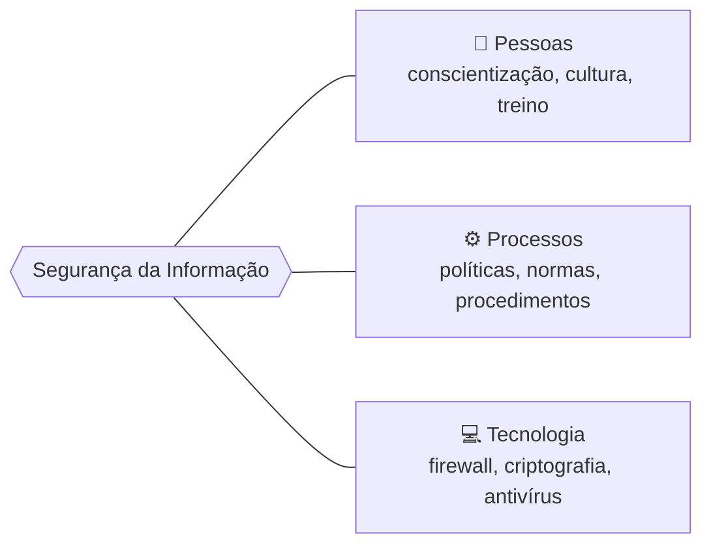
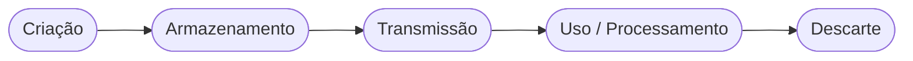
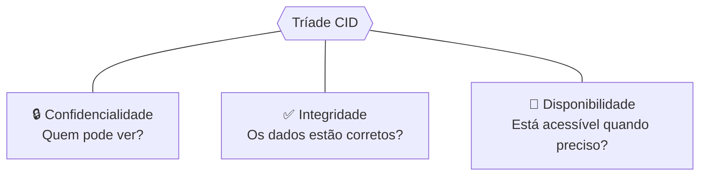
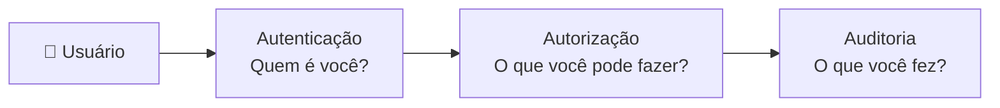
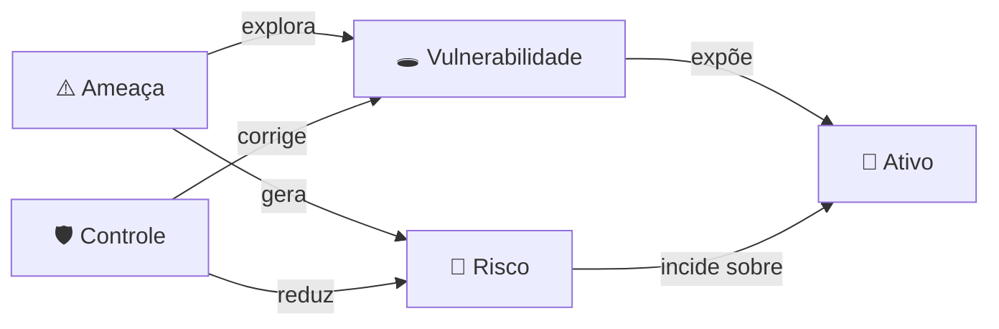
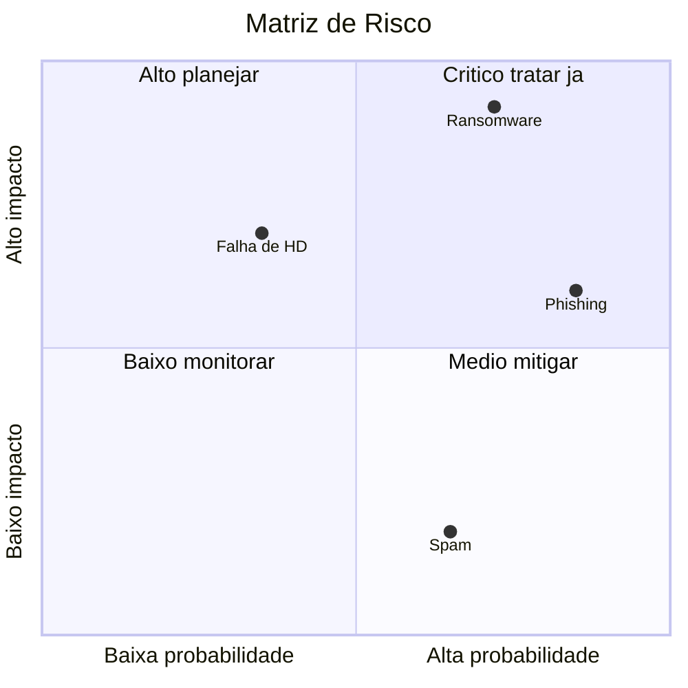
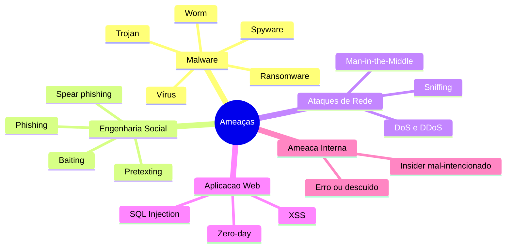
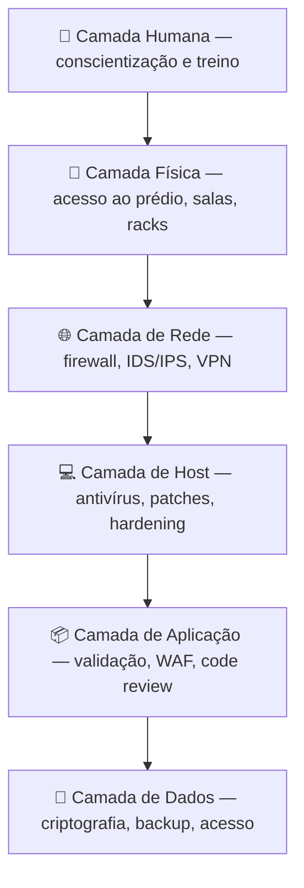
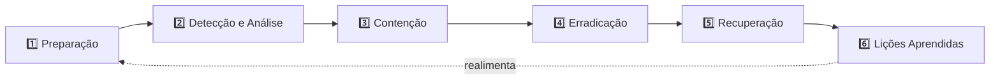

# Introdução à Segurança da Informação

![[Recursos/Segurança da informação/Introdução à Segurança da informação/hero-seguranca-informacao.png]]

> [!quote] Sobre esta aula
> *Esta é a base de toda a disciplina. Aqui construímos o vocabulário e os princípios que vamos usar o semestre inteiro: o que é segurança, o que protegemos, contra o quê, e como. Cada conceito vem com uma **atividade prática** — segurança se aprende fazendo.*

> [!abstract] O que você vai dominar nesta aula
> - O que é Segurança da Informação (e o que **não** é)
> - A **Tríade CID** (Confidencialidade, Integridade, Disponibilidade) e os princípios estendidos
> - O quarteto **Ativo → Ameaça → Vulnerabilidade → Risco**
> - O **panorama atual de ameaças** (2025-2026)
> - **Defesa em profundidade** e tipos de controle
> - Os **frameworks e normas** que organizam a área (ISO 27001, NIST CSF 2.0, LGPD)
> - O ciclo de **resposta a incidentes**

---

## 🎯 Por que isso importa agora?

> [!danger] A informação virou o ativo mais valioso (e mais atacado) do mundo
> Não é exagero acadêmico. É o cenário real de 2025-2026.

| Indicador (2025) | Número | O que significa |
|------------------|--------|-----------------|
| **Phishing como vetor inicial** | ~60% das invasões | A maioria dos ataques começa enganando uma **pessoa**, não quebrando uma máquina |
| **Phishing turbinado por IA generativa** | +1.265% | E-mails de golpe ficaram convincentes e em escala industrial |
| **Taxa de sucesso do phishing com IA** | ~60% | Quase 4× mais eficaz que o phishing tradicional |
| **Ransomware no pós-invasão** | 83,5% dos códigos maliciosos | Sequestro de dados domina o crime digital |
| **Custo médio de um ataque de ransomware** | > US$ 1,18 milhão | Impacto financeiro direto e brutal |
| **Setor público como alvo** | 38,2% dos incidentes | Institutos, prefeituras e escolas estão na linha de frente |

> [!info] E no Brasil? A LGPD entrou na conta
> A **Lei Geral de Proteção de Dados (Lei 13.709/2018)** tornou a segurança da informação uma **obrigação legal**. Vazar dados pessoais pode gerar multa de até **2% do faturamento** (limitada a R$ 50 milhões por infração), além do dano à reputação. Segurança deixou de ser "problema de TI" e virou **problema de gestão e de lei**.

> [!example] 🧪 Atividade 1 — Termômetro de exposição
> 1. Acesse **[Have I Been Pwned](https://haveibeenpwned.com/)** e digite seu e-mail. Em quantos vazamentos ele apareceu?
> 2. Liste **3 informações suas** que, se vazassem hoje, causariam algum prejuízo (financeiro, social ou legal).
> 3. Discuta: por que o elo mais fraco da segurança quase sempre é o **ser humano**, e não a tecnologia?

> [!note] Fontes dos dados
> [ENISA Threat Landscape 2025](https://www.enisa.europa.eu/topics/cyber-threats/threats-and-trends) · [CrowdStrike 2025 Ransomware Report](https://www.crowdstrike.com/en-us/press-releases/ransomware-report-ai-attacks-outpacing-defenses/) · [WEF Global Cybersecurity Outlook 2025](https://reports.weforum.org/docs/WEF_Global_Cybersecurity_Outlook_2025.pdf)

---

## 🧩 O que é Segurança da Informação?

> [!info] Definição
> **Segurança da Informação** é o conjunto de **práticas, processos e tecnologias** que protegem a informação contra acesso, alteração, destruição ou indisponibilidade **não autorizados** — em qualquer forma que ela exista (digital, impressa, falada).

Um erro comum é achar que segurança é só firewall e antivírus. Na verdade, ela se apoia em **três dimensões** que precisam andar juntas:

> [!tip] A informação tem um ciclo de vida — e cada etapa precisa de proteção
> A informação não fica parada. Ela nasce, é guardada, trafega, é usada e um dia é descartada.

E em qualquer instante ela está em **um de três estados**, cada um com ameaças típicas:

| Estado | Onde está | Ameaça típica | Proteção típica |
|--------|-----------|---------------|-----------------|
| **Em repouso** | Disco, banco de dados, backup | Roubo de dispositivo, acesso ao banco | Criptografia de disco |
| **Em trânsito** | Rede, Wi-Fi, internet | Interceptação (sniffing), MITM | TLS/HTTPS, VPN |
| **Em uso** | Memória RAM, tela | Malware, "ombro espião" (shoulder surfing) | Controle de acesso, tela bloqueada |

> [!example] 🧪 Atividade 2 — Rastreando um dado
> Pegue **um dado real** do seu dia (ex.: sua senha do Instagram, sua nota no acadêmico, uma foto no celular).
> Descreva o **ciclo de vida** dele e, em **cada um dos 3 estados**, aponte: onde ele fica, qual a ameaça e como você poderia protegê-lo.

---

## 🔐 A Tríade CID — os três pilares

> [!quote] A base de tudo
> *Toda a segurança da informação se apoia em três pilares conhecidos como **Tríade CID**: **C**onfidencialidade, **I**ntegridade e **D**isponibilidade. Em inglês: **CIA Triad** (Confidentiality, Integrity, Availability).*

![[Recursos/Segurança da informação/Introdução à Segurança da informação/principios-da-seguranca-da-informacao.png|A Tríade CID]]

> [!info] A regra de ouro
> Um sistema só é **seguro** quando os **três** pilares são respeitados ao mesmo tempo. Quebrou um, houve incidente de segurança.

---

### 🔒 Confidencialidade

> [!tip] Protegendo o acesso
> Garante que a informação **só seja acessada por quem tem autorização**. É o oposto de "vazamento".

**Como se garante:**
- Criptografia de dados sensíveis (em repouso e em trânsito)
- Controle de acesso (senha, biometria, MFA)
- Classificação da informação: *público, interno, confidencial, secreto*
- Princípio do **menor privilégio** (cada um vê só o que precisa)

**Ameaças à confidencialidade:** interceptação de comunicações · acesso não autorizado · engenharia social · "ombro espião".

> [!example] 🧪 Atividade 3 — Classifique a informação
> Classifique cada item como **Público / Interno / Confidencial / Secreto** e justifique:
> (a) o cardápio da cantina · (b) a lista de alunos da turma · (c) o gabarito da próxima prova · (d) a senha do Wi-Fi administrativo do campus.

---

### ✅ Integridade

> [!success] Garantindo que o dado não foi adulterado
> Garante que a informação **não foi alterada** de forma indevida — seja por ataque, erro ou falha. O dado que chega é **idêntico** ao que saiu.

> [!info] Hashes: a "impressão digital" do arquivo
> Uma **função hash** (ex.: SHA-256) transforma qualquer arquivo em um código de tamanho fixo. Mudou **1 bit** do arquivo, o hash muda **completamente**. É assim que se verifica integridade na prática.

[🔧 Ferramenta: SHA-256 File Checksum (online)](https://emn178.github.io/online-tools/sha256_checksum.html)

**Onde aparece:** verificar se um download corrompeu · garantir que logs não foram alterados · assinaturas digitais · blockchain.

**Ameaças à integridade:** modificação não autorizada de dados · injeção de código malicioso · corrupção de arquivos · ataques *man-in-the-middle*.

> [!example] 🧪 Atividade 4 — Veja o hash mudar
> 1. Crie um arquivo de texto com a frase: `Seguranca da informacao`.
> 2. Gere o **SHA-256** dele na ferramenta acima. Anote o código.
> 3. Troque **uma única letra** (ex.: `seguranca`) e gere o hash de novo.
> 4. Compare os dois hashes. Quantos caracteres mudaram? O que isso prova sobre o uso de hash para detectar adulteração?

---

### 📡 Disponibilidade

> [!warning] Acesso quando se precisa
> Garante que a informação e os sistemas estejam **disponíveis sempre que requisitados** por quem tem direito. De nada adianta um dado secreto e íntegro se ninguém consegue acessá-lo na hora da necessidade.

**Como se garante:**
- Redundância de sistemas (servidores em paralelo)
- Backups regulares e testados
- Plano de recuperação de desastres (DRP)
- Proteção contra DDoS

**Ameaças à disponibilidade:** ataques de negação de serviço (DoS/DDoS) · falhas de hardware · desastres naturais · **ransomware** (sequestra e torna o dado indisponível).

> [!example] 🧪 Atividade 5 — Plano de continuidade
> O sistema acadêmico do campus ficou **fora do ar** no dia do fechamento de notas. Liste **3 medidas** que a instituição poderia ter adotado **antes** para que isso não parasse o trabalho dos professores. Qual delas é mais barata? Qual é mais eficaz?

---

### 📊 CID em uma tabela

| Pilar | Pergunta-chave | Garante que... | Ameaça principal | Defesa típica |
|-------|----------------|----------------|------------------|---------------|
| **Confidencialidade** | Quem pode ver? | só autorizados acessam | Vazamento de dados | Criptografia, MFA |
| **Integridade** | O dado está correto? | nada foi adulterado | Modificação indevida | Hash, assinatura digital |
| **Disponibilidade** | Está acessível? | está no ar quando preciso | Indisponibilidade (DDoS) | Backup, redundância |

> [!tip] O equilíbrio é uma decisão de engenharia
> Os três pilares **competem** entre si. Reforçar um pode enfraquecer outro:
> - **+ Confidencialidade** (mais controles, mais senhas) → **− Disponibilidade** (mais lento, mais atrito)
> - **+ Disponibilidade** (acesso fácil, sem barreiras) → **− Confidencialidade** (mais exposto)
>
> Segurança é, no fundo, a arte de **balancear** esses três pilares de acordo com o valor do que se protege.

> [!example] 🧪 Atividade 6 — Trade-off na prática
> Para cada caso, diga **qual pilar é o mais crítico** e por quê:
> (a) prontuário médico de um paciente · (b) site de vendas na Black Friday · (c) registro de votação eletrônica.

---

## ➕ Além da CID: princípios estendidos

A tríade CID é o núcleo, mas a segurança moderna trabalha com princípios **complementares**, formalizados em normas como a ISO/IEC 27000:

| Princípio | O que garante | Exemplo |
|-----------|----------------|---------|
| **Autenticidade** | A informação vem de uma **fonte verificável** e é genuína | Assinatura digital prova quem escreveu o e-mail |
| **Não-repúdio** (irretratabilidade) | Quem fez uma ação **não pode negar** que a fez | Log assinado prova que o usuário X aprovou a transação |
| **Legalidade / Conformidade** | A informação é tratada **conforme a lei** (LGPD, ISO) | Coletar dados só com base legal e consentimento |
| **Posse / Controle** | Controle sobre **onde o dado está** (mesmo cifrado) | Pendrive perdido = perda de posse, mesmo sem leitura |
| **Utilidade** | O dado está em formato **utilizável** | Backup cifrado sem a chave = inútil |

> [!info] Da tríade CID ao "Hexágono de Parker"
> Confidencialidade + Integridade + Disponibilidade + **Posse + Autenticidade + Utilidade** formam o **Parkerian Hexad**, uma extensão usada quando a CID "não dá conta" de explicar certos incidentes.

> [!abstract] AAA — o tripé do controle de acesso
> Na prática, controle de acesso se organiza em três perguntas (em inglês, **AAA**):

> [!example] 🧪 Atividade 7 — Caça aos princípios
> Você recebe um boleto por e-mail. Como **cada um** destes princípios ajuda a confiar (ou desconfiar) dele?
> - **Autenticidade**: o boleto é mesmo do banco?
> - **Integridade**: o valor/código de barras foi adulterado?
> - **Não-repúdio**: se você pagar, há prova de quem emitiu?

---

## 🧠 O quarteto fundamental: Ativo, Ameaça, Vulnerabilidade e Risco

> [!info] O vocabulário que organiza a área toda
> Antes de defender, é preciso nomear. Estes quatro conceitos aparecem em **toda** a segurança da informação.

| Conceito | Definição | Exemplo |
|----------|-----------|---------|
| **Ativo** (*asset*) | Algo de **valor** que se quer proteger | Banco de dados de alunos, servidor, reputação |
| **Ameaça** (*threat*) | **Evento ou agente** que pode causar dano | Hacker, malware, incêndio, funcionário descuidado |
| **Vulnerabilidade** (*vulnerability*) | **Fraqueza** que a ameaça pode explorar | Senha fraca, software desatualizado, falta de backup |
| **Risco** (*risk*) | **Probabilidade × impacto** de a ameaça explorar a vulnerabilidade | "Alta chance de ransomware criptografar tudo" |
| **Controle** (*control*) | **Medida** que reduz o risco | Antivírus, backup, treinamento, firewall |

A relação entre eles é o coração da **gestão de risco**:

> [!tip] A "equação" do risco
> O risco não é um número exato, mas pensar nele como uma fórmula ajuda a priorizar:

$$\text{Risco} = \text{Probabilidade} \times \text{Impacto}$$

Por isso priorizamos riscos numa **matriz**: tratamos primeiro o que é **provável E grave**.

> [!example] 🧪 Atividade 8 — Mini análise de risco
> Escolha um ativo da sua casa ou do campus (ex.: o notebook do laboratório). Preencha:
> 1. **Ativo** e seu valor · 2. duas **ameaças** · 3. duas **vulnerabilidades** · 4. classifique cada cenário na **matriz de risco** (alto/médio/baixo) · 5. proponha **um controle** para o maior risco.

---

## ⚔️ Panorama de Ameaças

![[Recursos/Segurança da informação/Introdução à Segurança da informação/engenharia-social-phishing.png|Exemplo real e clássico de phishing: e-mail do falso "TrustedBank". Repare nos erros de escrita e no link suspeito.]]

> [!danger] O ataque mais comum não é técnico — é psicológico
> A **engenharia social** manipula pessoas para que entreguem acesso ou informação. O **phishing** é sua forma mais comum, e hoje é gerado em escala por IA.

| Categoria | Ameaça | Como funciona (resumo) |
|-----------|--------|------------------------|
| **Malware** | Ransomware | Cifra os dados da vítima e exige resgate |
| | Trojan | Programa "útil" que esconde código malicioso |
| | Spyware | Espiona e rouba informações silenciosamente |
| **Engenharia social** | Phishing | E-mail/mensagem falsos induzem a clicar ou entregar senha |
| | Spear phishing | Phishing **personalizado** para um alvo específico |
| **Rede** | DDoS | Sobrecarrega o serviço até ele cair (ataca disponibilidade) |
| | MITM | Atacante se põe "no meio" da comunicação e a intercepta |
| **Aplicação** | SQL Injection | Injeta comandos no banco via campos de um site |
| | Zero-day | Explora falha **ainda desconhecida** pelo fabricante |
| **Interna** | Insider | Pessoa de dentro abusa do acesso que já tem |

> [!example] 🧪 Atividade 9 — Anatomia de um phishing
> **Comece pelo exemplo "TrustedBank" acima.** Encontre nele pelo menos **3 sinais de fraude** (dica: há erros de escrita como *"recieved"* e *"discrepency"*, um link genérico e um pretexto de urgência).
> Depois pegue um e-mail/SMS de golpe **que você mesmo recebeu** e liste **4 sinais**: remetente suspeito · senso de urgência ("sua conta será bloqueada!") · link diferente do texto · erros de ortografia · pedido de dados sensíveis · anexo inesperado.
> **Desafio:** qual pilar da CID o phishing tenta quebrar primeiro?

---

## 🛡️ Mecanismos de Defesa

![[Recursos/Segurança da informação/Introdução à Segurança da informação/defesa-em-profundidade.png|Modelo "onion" da defesa em profundidade: os dados no centro, protegidos por camadas (aplicação → host → rede)]]

> [!info] Defesa em Profundidade (*Defense in Depth*)
> Nenhuma proteção é perfeita. Por isso usamos **várias camadas** independentes: se uma falha, a próxima ainda segura o ataque. É o princípio do castelo medieval — fosso, muralha, portão, torre.

Os controles de segurança se classificam de **duas formas** ao mesmo tempo:

| Por **natureza** | Exemplos | | Por **função** | Exemplos |
|------------------|----------|---|----------------|----------|
| **Físico** | Catraca, cadeado, CFTV | | **Preventivo** | Firewall, criptografia, treino |
| **Lógico/Técnico** | Firewall, antivírus, MFA | | **Detectivo** | IDS, log, alarme, antivírus |
| **Administrativo** | Política, norma, treinamento | | **Corretivo** | Backup, plano de recuperação |

> [!example] 🧪 Atividade 10 — Monte sua defesa em camadas
> O laboratório de informática guarda as provas no servidor. Proponha **um controle por camada** (humana, física, rede, host, aplicação, dados) para proteger esse ativo. Marque cada um como preventivo, detectivo ou corretivo.

---

## 📐 Frameworks e Normas

> [!info] Você não precisa reinventar a roda
> A comunidade já organizou as boas práticas em **frameworks e normas**. Conhecê-los é o que separa o amador do profissional.

### NIST Cybersecurity Framework 2.0 (2024)

![[Recursos/Segurança da informação/Introdução à Segurança da informação/nist-csf-2.0-funcoes.png|As 6 funções do NIST CSF 2.0]]

> [!tip] As 6 funções (a versão 2.0 adicionou a "Govern")
> Publicado pelo NIST (EUA) em **fevereiro de 2024**, organiza a segurança em **seis funções** contínuas. A grande novidade da 2.0 é a função **Governar (Govern)** no centro — segurança virou responsabilidade da **alta gestão**, não só da TI.

| Função | O que cobre |
|--------|-------------|
| 🟡 **Govern (Governar)** | Estratégia, papéis, políticas e risco de fornecedores *(nova na 2.0)* |
| 🔵 **Identify (Identificar)** | Conhecer ativos, riscos e o ambiente |
| 🟣 **Protect (Proteger)** | Controles de acesso, criptografia, treino |
| 🟠 **Detect (Detectar)** | Monitorar e perceber incidentes |
| 🔴 **Respond (Responder)** | Conter e tratar o incidente |
| 🟢 **Recover (Recuperar)** | Restaurar operação e aprender |

### Outras normas essenciais

| Norma / Lei | Origem | Para que serve |
|-------------|--------|----------------|
| **ISO/IEC 27001:2022** | Internacional | Requisitos de um **SGSI** (Sistema de Gestão de Segurança da Informação) — base para **certificação** |
| **ISO/IEC 27002:2022** | Internacional | **Catálogo de controles** práticos para implementar o 27001 |
| **CIS Controls v8** | EUA (CIS) | Lista priorizada e prática de **18 controles** essenciais |
| **LGPD (Lei 13.709/2018)** | 🇧🇷 Brasil | Obriga a proteção de **dados pessoais** — apoia-se na CID |

> [!info] ISO 27001 e LGPD andam juntas
> Quem implementa os controles da **ISO 27001** já atende boa parte das exigências da **LGPD**. Confidencialidade, integridade e disponibilidade são, ao mesmo tempo, princípios técnicos e **deveres legais**.

> [!example] 🧪 Atividade 11 — Mapeie para o framework
> Pegue **3 medidas de segurança** que você já usa (ex.: senha no celular, backup no Google, antivírus). Em qual **função do NIST CSF 2.0** cada uma se encaixa (Identificar, Proteger, Detectar, Responder, Recuperar)?

---

## 🔄 Resposta a Incidentes

> [!warning] A pergunta não é "se", é "quando"
> Nenhuma organização é 100% segura. Por isso existe um processo estruturado para **quando o ataque acontece** — baseado no NIST SP 800-61.

> [!example] 🧪 Atividade 12 — Simulação de incidente
> Cenário: um aluno clicou num link e o computador do laboratório foi infectado por ransomware. Descreva **o que fazer em cada uma das 6 fases**. Qual a primeira atitude técnica na fase de **contenção**? (Dica: pense na rede.)

---

## 🧪 Laboratório — coloque a mão na massa

> [!success] Atividades práticas consolidadas
> Faça pelo menos **três** destas. Todas usam ferramentas gratuitas e gratuitas e legais.

| # | Prática | Ferramenta | Pilar/conceito |
|---|---------|------------|----------------|
| L1 | Verificar se seu e-mail vazou | [Have I Been Pwned](https://haveibeenpwned.com/) | Confidencialidade |
| L2 | Gerar e comparar hashes de um arquivo | [SHA-256 Checksum](https://emn178.github.io/online-tools/sha256_checksum.html) | Integridade |
| L3 | Testar a força de uma senha | [security.org/password-checker](https://www.security.org/how-secure-is-my-password/) | Autenticação |
| L4 | Analisar um e-mail de phishing real | [PhishTank](https://phishtank.org/) | Engenharia social |
| L5 | Ver dados de um site (cabeçalhos de segurança) | [Security Headers](https://securityheaders.com/) | Defesa/Aplicação |

> [!tip] Ativando a defesa pessoal
> Antes da próxima aula: ative **autenticação de dois fatores (MFA)** na sua conta de e-mail principal. Traga um print (sem mostrar a senha!) e conte qual segundo fator você escolheu.

---

## ❓ Quiz de Fixação

> [!question] Teste seu entendimento
> 1. Um hospital teve seus prontuários **criptografados por ransomware** e não consegue mais acessá-los. **Qual pilar da CID** foi violado? *(E qual continua intacto?)*
> 2. Qual a diferença entre **ameaça** e **vulnerabilidade**? Dê um exemplo de cada.
> 3. Por que aumentar a **confidencialidade** pode reduzir a **disponibilidade**? Dê um exemplo.
> 4. O que a função **Govern**, nova no NIST CSF 2.0, mudou na forma de pensar segurança?
> 5. Um **hash** serve para garantir qual pilar? Por quê?
> 6. Cite **dois controles** para cada uma das três naturezas: físico, lógico e administrativo.
> 7. Por que se diz que o **ser humano** é o elo mais fraco da segurança? Como a **defesa em profundidade** ajuda mesmo quando uma pessoa erra?

---

## 📚 Para Aprofundar

> [!abstract] Materiais atuais e confiáveis (gratuitos)
> - 📖 **[Cartilha de Segurança para Internet — CERT.br](https://cartilha.cert.br/)** — referência brasileira, didática e atualizada
> - 🛡️ **[OWASP Top 10](https://owasp.org/www-project-top-ten/)** — os riscos mais críticos em aplicações web
> - 🏛️ **[NIST Cybersecurity Framework 2.0](https://www.nist.gov/cyberframework)** — o framework completo, na fonte
> - 🇧🇷 **[LGPD — texto oficial da lei](http://www.planalto.gov.br/ccivil_03/_ato2015-2018/2018/lei/l13709.htm)**
> - 🎓 **[ENISA Threat Landscape](https://www.enisa.europa.eu/topics/cyber-threats/threats-and-trends)** — panorama anual de ameaças (Europa)

> [!note] Continue na disciplina
> Esta base é aplicada e aprofundada no projeto-âncora da disciplina: [[Projeto GovSec]]. Os trabalhos e laboratórios estão em [[Trabalhos e Projetos de Segurança da Informação]].

> [!note] Créditos das imagens
> Roda do **NIST CSF 2.0** e exemplo de phishing **"TrustedBank"**: NIST / Wikimedia Commons (domínio público). Modelo *onion* de **defesa em profundidade** e **imagem de abertura**: Wikimedia Commons. Uso educacional em instituição pública de ensino.

> [!quote] Fecho
> *Segurança da informação não é um produto que se compra, é um **processo** que se mantém. Você acabou de montar o vocabulário e os princípios. A partir daqui, cada técnica que aprendermos vai se encaixar nesse mapa.*
