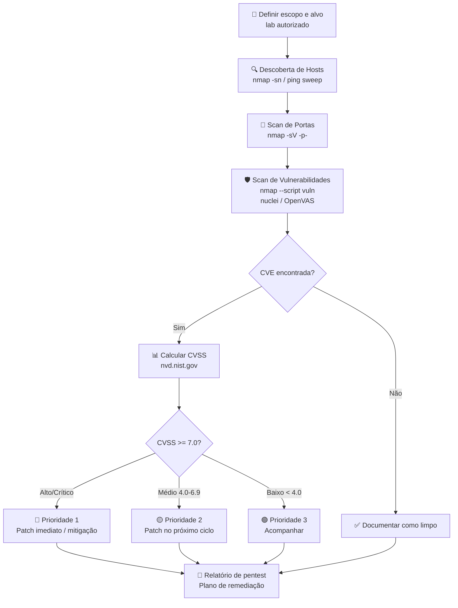
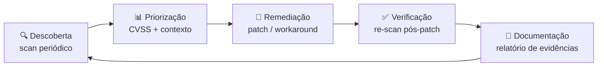

# Mapeamento de Vulnerabilidades

> [!quote] Encontrando as Fraquezas
> *É descobrir as vulnerabilidades (fraquezas) de um sistema ou rede. Essas fraquezas serão utilizadas mais tarde para um possível ataque bem-sucedido.*

> [!danger] ⚖️ Aviso Legal Obrigatório
> O mapeamento de vulnerabilidades sem autorização prévia e por escrito é crime tipificado no **art. 154-A do Código Penal Brasileiro** ("invasão de dispositivo informático"), com pena de 1 a 4 anos de reclusão e multa. Todos os comandos, ferramentas e técnicas desta aula são praticados **exclusivamente em laboratório autorizado**: VMs próprias, Metasploitable 2/3, DVWA, OWASP Juice Shop, Hack The Box, TryHackMe, PortSwigger Web Academy ou scanme.nmap.org. **Nunca execute contra alvos de terceiros.**

---

## 📋 Conceitos Básicos

### Tipos de Mapeamento

O mapeamento de vulnerabilidades pode ser classificado de três formas:

> [!tip] Manual vs Automático

| Tipo | Descrição | Prós | Contras |
|------|-----------|------|---------|
| **Automático** | Utiliza softwares que verificam vulnerabilidades | Rápido, abrangente | Falsos positivos/negativos |
| **Manual** | Não usa ferramentas de scan, testa cada serviço | Mais preciso | Demorado, requer experiência |

Hackers experientes usam uma **combinação** das duas técnicas.

> [!tip] Rede Local vs Internet

| Tipo | Descrição |
|------|-----------|
| **Rede Local** | Mapear vulnerabilidades na rede onde você está conectado |
| **Internet** | Mapear alvos em outras redes (requer mais cuidado) |

> [!tip] Autenticado vs Não Autenticado

| Tipo | Descrição |
|------|-----------|
| **Autenticado** | Scanner configurado com credenciais válidas, análise mais profunda |
| **Não Autenticado** | Sem credenciais, mais rápido, menos resultados |

---

## 🛠️ Ferramentas de Mapeamento de Vulnerabilidades (2026)

A tabela abaixo consolida as principais ferramentas usadas em assessments reais e em laboratórios de pentest em 2025/2026:

| Ferramenta | Tipo | Comando de referência | Uso principal |
|------------|------|-----------------------|---------------|
| **Nmap NSE** | CLI, gratuito | `nmap --script vuln <alvo>` | Scan rápido de vulnerabilidades + detecção de versão |
| **OpenVAS / GVM** | GUI + CLI, gratuito | `gvm-cli socket ...` | Scan completo de rede, relatório CVSS |
| **Nessus Essentials** | GUI, freemium | UI web + API | Scan profissional, até 16 IPs grátis |
| **Nuclei** | CLI, gratuito | `nuclei -u <alvo> -tags cve` | Scan baseado em templates YAML, 12.000+ templates |
| **Nikto** | CLI, gratuito | `nikto -h http://<alvo>` | Scanner de vulnerabilidades web |
| **Searchsploit** | CLI, gratuito | `searchsploit <serviço> <versão>` | Consulta local ao Exploit-DB |
| **Metasploit** | Framework | `msfconsole` | Verificação e exploração pós-scan |

> [!info] 🔗 Repositório oficial Nuclei
> O repositório [nuclei-templates](https://github.com/projectdiscovery/nuclei-templates) tem mais de **12.000 templates** e cresce com novos CVEs em horas após a divulgação pública.

---

## 🔄 Fluxo Geral: Scan → Análise → Priorização



---

## 🔍 Análise de Vulnerabilidades com Nmap NSE

> [!info] Nmap Scripting Engine (NSE)
> O Nmap possui uma poderosa funcionalidade que permite a utilização, criação e compartilhamento de **scripts** para análise automatizada de vulnerabilidades.

### Localização dos Scripts

```bash
/usr/share/nmap/scripts/
```

**Documentação:** [nmap.org/book/nse-usage.html](https://nmap.org/book/nse-usage.html)

### Categorias de Scripts

> [!warning] Cuidado com Scripts Intrusivos
> Os scripts são divididos em categorias. Focaremos em `vuln` e `exploit`, mas atenção à diferença entre `safe` e `intrusive`.

| Categoria | Descrição | Segurança |
|-----------|-----------|-----------|
| **safe** | Não afetam o alvo | Seguros |
| **intrusive** | Podem derrubar serviços | Usar apenas em labs |
| **vuln** | Detectam vulnerabilidades | Alguns são intrusivos |
| **exploit** | Tentam explorar falhas | Usar apenas em labs |

> [!danger] Atenção
> **NÃO EXECUTEM SCRIPTS DA CATEGORIA INTRUSIVE EM ALVOS REAIS, SOMENTE EM MÁQUINAS VIRTUAIS!**

Mesmo scripts da categoria `vuln` podem realizar atividades de `exploit` e prejudicar o alvo.

### Consultando Informações dos Scripts

O arquivo `script.db` contém informações sobre cada script:

```bash
# Ver primeiras linhas
head -n 5 /usr/share/nmap/scripts/script.db

# Filtrar por categoria
cat /usr/share/nmap/scripts/script.db | grep '"vuln"\|"exploit"'
```

### Executando Scripts de Vulnerabilidade

```bash
# Rodar todos os scripts de vulnerabilidade
nmap --script vuln 10.11.1.10

# Rodar script específico (EternalBlue / MS17-010)
nmap -p445 --script smb-vuln-ms17-010 192.168.1.1

# Combinar com scan de serviços e salvar saída
nmap -sV --script vuln -oN resultado_vuln.txt 192.168.1.1

# Script vulners: cruza versões detectadas com CVEs do vulners.com
nmap -sV --script vulners --script-args mincvss=7.0 192.168.1.1

# Scan completo de sub-rede com detecção de versão
nmap -sV --script vuln 192.168.1.0/24
```

> [!tip] 💡 Script `vulners`
> O script `vulners.nse` é um dos mais úteis: ele detecta a versão do serviço e consulta automaticamente o banco de dados [vulners.com](https://vulners.com) para listar CVEs associadas, já com pontuação CVSS. Instale com: `nmap --script-updatedb`

---

> [!example] 🧪 Atividade 1: nmap --script vuln contra Metasploitable 2

**Objetivo:** identificar vulnerabilidades reais com CVE em uma VM de laboratório.

**Pré-requisito:** Metasploitable 2 rodando na mesma rede host-only (ex.: `192.168.56.101`). Kali Linux como máquina atacante.

```bash
# Passo 1: confirmar que o alvo responde
ping -c 3 192.168.56.101

# Passo 2: scan de portas + detecção de versão
nmap -sV -p- --open 192.168.56.101 -oN portas.txt

# Passo 3: scan de vulnerabilidades NSE
nmap -sV --script vuln 192.168.56.101 -oN vuln_scan.txt

# Passo 4: script vulners com threshold CVSS 7.0
nmap -sV --script vulners --script-args mincvss=7.0 192.168.56.101
```

**Resultado observável esperado:**

```
PORT    STATE SERVICE     VERSION
21/tcp  open  ftp         vsftpd 2.3.4
|_ftp-vuln-cve2011-2523: VULNERABLE
|   CVE-2011-2523  vsftpd 2.3.4 backdoor
|     Risk factor: High
|     CVSSv2: 10.0
|     References:
|       https://nvd.nist.gov/vuln/detail/CVE-2011-2523
...
445/tcp open  netbios-ssn Samba smbd 3.X - 4.X
| smb-vuln-ms17-010:
|   VULNERABLE: MS17-010 EternalBlue
|     CVSSv2: 9.3
```

**Discussão:** o vsftpd 2.3.4 tem um backdoor deliberado inserido por atacante no código-fonte em 2011. CVSS 10.0, crítico. O que fazer? Ver seção de gestão de vulnerabilidades.

---

## 🔎 Exploit-DB e Searchsploit

O **Exploit-DB** ([exploit-db.com](https://www.exploit-db.com)) é o banco de dados público de exploits mantido pela Offensive Security. O `searchsploit` é a interface de linha de comando que consulta uma cópia local desse banco, sem necessidade de internet.

### Por que usar searchsploit?

Durante um pentest, após identificar um serviço e sua versão, o passo natural é verificar se existe exploit público. O `searchsploit` faz isso em segundos, localmente, sem revelar sua pesquisa ao alvo.

### Comandos Essenciais

```bash
# Atualizar a base local
searchsploit -u

# Busca simples por serviço e versão
searchsploit vsftpd 2.3.4

# Busca por CVE
searchsploit CVE-2011-2523

# Busca por serviço web
searchsploit apache 2.4.49

# Exibir o caminho completo do exploit
searchsploit -p 17491

# Copiar exploit para o diretório atual
searchsploit -m 17491

# Busca excluindo resultados DoS (útil para focar em RCE/LFI)
searchsploit openssh --exclude="DoS"

# Busca por CVE e exibir detalhes
searchsploit -w CVE-2021-41773
```

### Interpretando o Resultado

```
---------------------------------------------------------------------------------
 Exploit Title                              |  Path
---------------------------------------------------------------------------------
vsftpd 2.3.4 - Backdoor Command Execution  | unix/remote/17491.rb
vsftpd 2.3.4 - Backdoor Command Execution  | unix/remote/49757.py
---------------------------------------------------------------------------------
```

O caminho `unix/remote/17491.rb` indica: sistema Unix, exploit remoto, arquivo Ruby (módulo Metasploit). O `49757.py` é um script Python standalone.

---

> [!example] 🧪 Atividade 2: searchsploit para mapear exploits de serviços do Metasploitable

**Objetivo:** dado o resultado do nmap da Atividade 1, usar searchsploit para encontrar exploits de cada serviço vulnerável.

```bash
# Serviços encontrados no Metasploitable 2:
# vsftpd 2.3.4, OpenSSH 4.7, Apache 2.2.8, Samba 3.0.20

# Buscar exploits para cada um
searchsploit vsftpd 2.3.4
searchsploit openssh 4.7
searchsploit apache 2.2.8
searchsploit samba 3.0.20

# Busca mais ampla para Samba (username map script - CVE-2007-2447)
searchsploit samba usermap

# Copiar o exploit samba para o diretório atual e inspecionar
searchsploit -m 16320
cat 16320.rb | head -50
```

**Resultado observável esperado:**

```
Samba 3.0.20 < 3.0.25rc3 - 'Username Map Script' Command Execution (Metasploit)
| unix/remote/16320.rb
```

**CVE-2007-2447:** CVSS 10.0. Permite execução remota de código sem autenticação via campo de username no protocolo SMB. Versão 3.0.20 do Samba (padrão no Metasploitable 2) é afetada.

**Discussão em aula:** o que significa ter um CVSS 10.0 em um serviço exposto na internet? Qual é o plano de resposta?

---

## 🌿 Scanner Moderno: Nuclei (ProjectDiscovery)

O **Nuclei** é um scanner de vulnerabilidades baseado em templates YAML, mantido pela comunidade global de segurança. Em 2026, conta com mais de **12.000 templates** e detecta novos CVEs muitas vezes em horas após a divulgação pública.

### Por que nuclei é relevante em 2026?

- Templates YAML simples: qualquer pesquisador pode criar e contribuir
- Velocidade: escaneia dezenas de hosts em paralelo
- Cobertura: CVEs, misconfigurations, exposições de painel de admin, APIs, cloud
- Integração: aceita entrada de outras ferramentas (subfinder, httpx, nmap)

### Instalação

```bash
# Via apt (Kali Linux)
sudo apt update && sudo apt install nuclei -y

# Via Go (versão mais recente)
go install -v github.com/projectdiscovery/nuclei/v3/cmd/nuclei@latest

# Atualizar templates
nuclei -update-templates
```

### Comandos Essenciais

```bash
# Scan básico com todos os templates
nuclei -u http://192.168.56.101

# Scan somente CVEs de 2025
nuclei -u http://192.168.56.101 -tags cve -t ~/nuclei-templates/cves/2025/

# Scan somente templates críticos e altos
nuclei -u http://192.168.56.101 -severity critical,high

# Scan de web app vulnerável (DVWA)
nuclei -u http://192.168.56.101/dvwa -tags sqli,xss

# Scan com output em JSON para análise posterior
nuclei -u http://192.168.56.101 -json-export resultados.json

# Pipeline: subfinder + httpx + nuclei (exemplo de integração)
echo "192.168.56.101" | httpx -silent | nuclei -tags cve -severity critical,high

# Escanear CVE específica
nuclei -u http://192.168.56.101 -id CVE-2021-41773
```

---

> [!example] 🧪 Atividade 3: nuclei contra DVWA ou Juice Shop no lab

**Objetivo:** usar o nuclei para identificar vulnerabilidades web em aplicação vulnerável de laboratório.

**Pré-requisito:** DVWA ou OWASP Juice Shop rodando localmente (Docker ou VM).

```bash
# Subir DVWA via Docker (se ainda não estiver rodando)
docker run -d -p 80:80 vulnerables/web-dvwa

# Atualizar templates primeiro
nuclei -update-templates

# Scan completo na DVWA
nuclei -u http://localhost -severity critical,high,medium

# Scan focado em SQL injection e XSS
nuclei -u http://localhost -tags sqli,xss

# Para Juice Shop (porta 3000 por padrão)
docker run -d -p 3000:3000 bkimminich/juice-shop
nuclei -u http://localhost:3000 -tags cve,sqli,xss,exposure -severity critical,high
```

**Resultado observável esperado (Juice Shop):**

```
[INF] Loaded 1543 templates
[high] [http] [CVE-2021-23337] http://localhost:3000 - Prototype Pollution
[medium] [http] [exposure] http://localhost:3000/api-docs - Swagger/OpenAPI Exposed
[high] [http] [sqli] http://localhost:3000/rest/user/login - SQL Injection Login Bypass
```

**Discussão:** cada finding traz: severidade, tipo, CVE (quando aplicável), URL afetada. Como priorizar com base no CVSS?

---

## 🏢 OpenVAS / GVM: Scanner Profissional Gratuito

O **OpenVAS** (rebatizado como **GVM**, Greenbone Vulnerability Management) é a alternativa open source ao Nessus. Oferece interface web, relatórios PDF, scan autenticado e mais de **60.000 NVTs** (Network Vulnerability Tests).

### Instalação no Kali Linux (2025)

```bash
# Instalar GVM
sudo apt update && sudo apt install gvm -y

# Configuração inicial (demora 10-30 min pela primeira vez)
sudo gvm-setup

# Verificar instalação
sudo gvm-check-setup

# Iniciar serviços
sudo gvm-start

# Acessar interface web
# Abrir: https://127.0.0.1:9392
# Usuário: admin | Senha: gerada pelo gvm-setup (anotada no terminal)
```

> [!warning] ⏱️ Tempo de setup
> O `gvm-setup` baixa feeds de vulnerabilidades (NASL, SCAP, CERT-Bund). Pode levar de 15 a 45 minutos dependendo da conexão. Executar uma vez e manter atualizado com `sudo greenbone-feed-sync`.

### Fluxo de Scan pela Interface Web

1. Acesse `https://127.0.0.1:9392`
2. Menu **Configuration** → **Targets** → botão de novo target
3. Informe o IP do Metasploitable (ex.: `192.168.56.101`)
4. Menu **Scans** → **Tasks** → **New Task**
5. Selecione o target criado, escolha **Full and fast** como scan config
6. Clique em **Start**

### Comandos GVM via CLI (gvm-cli)

```bash
# Listar hosts descobertos
gvm-cli socket --xml "<get_hosts/>"

# Iniciar scan via linha de comando (requer configuração de target e task previamente)
gvm-cli socket --xml "<start_task task_id='<ID>'/>"

# Exportar relatório em PDF
gvm-cli socket --xml "<get_reports report_id='<ID>' format_id='<PDF_FORMAT_ID>'/>"
```

### Interpretando o Relatório GVM

O relatório exibe cada vulnerabilidade com:

| Campo | Significado |
|-------|-------------|
| **CVSS Score** | Pontuação de severidade (0 a 10) |
| **QoD** | Quality of Detection (% de confiança no resultado) |
| **CVE** | Identificador da vulnerabilidade no NVD |
| **Solution** | Ação recomendada (patch, workaround, etc.) |
| **References** | Links para NVD, vendor advisory, Exploit-DB |

---

## 📐 CVSS: Sistema de Pontuação de Vulnerabilidades

O **CVSS** (Common Vulnerability Scoring System) é o padrão internacional para quantificar a severidade de vulnerabilidades. A versão **4.0** foi lançada em novembro de 2023 e o NVD passou a publicar scores CVSS 4.0 para novos CVEs em 2025.

### Faixas de Severidade CVSS (v3.1 e v4.0)

| Score | Severidade | Cor | Ação recomendada |
|-------|------------|-----|-----------------|
| 0.0 | Nenhuma | Branco | Monitorar |
| 0.1 a 3.9 | Baixa | Verde | Patch no próximo ciclo |
| 4.0 a 6.9 | Média | Amarelo | Patch em 30 dias |
| 7.0 a 8.9 | Alta | Laranja | Patch em 7 dias |
| 9.0 a 10.0 | Crítica | Vermelho | Patch imediato (24-72h) |

### Grupos de Métricas CVSS 4.0

```
CVSS:4.0/AV:N/AC:L/AT:N/PR:N/UI:N/VC:H/VI:H/VA:H/SC:N/SI:N/SA:N
```

| Grupo | Métricas | O que mede |
|-------|----------|------------|
| **Base** | AV, AC, AT, PR, UI | Características intrínsecas da vulnerabilidade |
| **Threat** | E (Exploit Maturity) | Disponibilidade de exploit público |
| **Environmental** | CR, IR, AR, MAV... | Criticidade no ambiente específico |
| **Supplemental** | S, AU, R, V, RE, U | Informações contextuais adicionais |

> [!info] 💡 CVSS 4.0 vs 3.1: novidades
> - **AT (Attack Requirements)**: novo campo que distingue entre pré-condições necessárias ao ataque
> - **Scope dividido**: vulnerabilidade no sistema vulnerável (VC/VI/VA) vs impacto em sistemas subsequentes (SC/SI/SA)
> - **Calculadora oficial:** [nvd.nist.gov/vuln-metrics/cvss/v4-calculator](https://nvd.nist.gov/vuln-metrics/cvss/v4-calculator)

### Como Consultar CVEs no NVD

```bash
# Via curl (API NVD v2.0)
curl "https://services.nvd.nist.gov/rest/json/cves/2.0?cveId=CVE-2011-2523"

# Filtrar CVEs por produto (exemplo: vsftpd)
curl "https://services.nvd.nist.gov/rest/json/cves/2.0?keywordSearch=vsftpd&cvssV3Severity=CRITICAL"

# Busca web direta
# https://nvd.nist.gov/vuln/search
```

---

## 🌐 Análise Manual de Aplicações Web

> [!tip] Buscas Manuais
> Além de ferramentas automatizadas, a análise manual revela detalhes importantes que scanners perdem, como lógica de negócio quebrada, IDOR e controles de acesso falhos.

### Técnicas de Análise

| Técnica | O que Procurar |
|---------|---------------|
| **Código-fonte da página** | Comentários, links escondidos, JavaScript, framework |
| **Developer Tools - Debugger** | Scripts carregados, breakpoints |
| **Developer Tools - Network** | Requisições HTTP, headers, cookies |
| **Developer Tools - Console** | Erros JavaScript, mensagens de debug |

### Passos para Análise Manual

1. **View Source**: analise comentários HTML e scripts inline
2. **Debugger/Sources**: examine arquivos JavaScript carregados
3. **Network Tab**: observe requisições e respostas
4. **Robots.txt**: verifique diretórios ocultos
5. **Sitemap.xml**: mapeie a estrutura do site

---

## 📊 Workflow de Mapeamento (Passo a Passo Textual)

```
1. Descoberta de Hosts
       ↓
2. Scan de Portas
       ↓
3. Detecção de Serviços
       ↓
4. Identificação de Versões
       ↓
5. Scan de Vulnerabilidades
       ↓
6. Validação Manual
       ↓
7. Documentação
```

---

## 🎯 Exemplos Práticos Adicionais

### Scan Básico de Vulnerabilidades

```bash
# Scan completo com detecção de versões e vulnerabilidades
nmap -sV --script vuln 192.168.1.0/24
```

### Scan de Vulnerabilidade SMB

```bash
# Verificar EternalBlue (MS17-010)
nmap -p445 --script smb-vuln-ms17-010 192.168.1.1
```

### Scan de Vulnerabilidades Web com Nikto

```bash
# Usar Nikto para web
nikto -h http://192.168.1.1

# Com output salvo
nikto -h http://192.168.56.101 -o resultado_nikto.txt -Format txt
```

### Combinando Ferramentas em Pipeline

```bash
# Fluxo completo: nmap identifica versões, searchsploit busca exploits
nmap -sV 192.168.56.101 | grep "open" | awk '{print $5, $6}' > servicos.txt
while read servico versao; do
    echo "=== $servico $versao ==="
    searchsploit "$servico $versao" 2>/dev/null | head -5
done < servicos.txt
```

---

## 🛡️ Gestão de Vulnerabilidades e Defesa

Identificar vulnerabilidades é apenas metade do trabalho. O objetivo final é **reduzir a superfície de ataque** através de um ciclo contínuo de gestão.

### Ciclo de Gestão de Vulnerabilidades



### Princípios de Remediação (Patch Management)

| Princípio | Descrição |
|-----------|-----------|
| **Prioridade por CVSS** | CVEs críticos (9.0-10.0) em até 24-72h; altos (7.0-8.9) em 7 dias |
| **EPSS complementar** | EPSS v4 (2025) estima probabilidade de exploração nos próximos 30 dias |
| **Contexto importa** | CVSS 9.8 em software não usado é menos urgente que CVSS 7.0 em serviço exposto |
| **Patch em staging primeiro** | Testar em ambiente de homologação antes de produção |
| **Compensating controls** | Quando patch imediato não é possível: WAF, firewall, desabilitar serviço |

### Ações de Defesa por Achado

| Vulnerabilidade | Ação de defesa |
|-----------------|----------------|
| **vsftpd 2.3.4 backdoor (CVE-2011-2523)** | Atualizar para versão atual, desabilitar FTP anônimo, preferir SFTP |
| **EternalBlue MS17-010** | Aplicar patch MS17-010, bloquear porta 445 externamente |
| **Samba username map (CVE-2007-2447)** | Atualizar Samba, restringir acesso SMB por IP |
| **Apache path traversal (CVE-2021-41773)** | Atualizar Apache 2.4.50+, desabilitar `mod_cgi` |

### Ferramentas de Gestão Contínua

- **OpenVAS agendado:** configure scans semanais automáticos na interface GVM (Scans → Schedules)
- **Nessus Essentials:** gratuito para até 16 IPs, permite alertas por email
- **Nuclei em CI/CD:** integre o nuclei no pipeline de deploy para detectar vulnerabilidades antes de ir para produção

> [!tip] 🔄 Princípio de Menor Privilégio
> Além do patching, aplique o princípio de menor privilégio: serviços desnecessários desligados, portas fechadas no firewall, contas com privilégios mínimos. Um serviço desligado não tem CVEs exploráveis.

---

> [!note] 📚 Fontes (2026)

- [Nmap NSE Scripts for Vulnerability Scanning (2026 Guide)](https://blog.cyberdesserts.com/nmap-nse-scripting-engine/)
- [Nmap Cheatsheet 2026 Pentester's Reference](https://macksofy.com/blog/nmap-cheatsheet-2026)
- [OpenVAS/Nessus Setup and Usage Cheat Sheet (OffSec Focus)](https://vespersec.net/docs/vulnerability-assessment/openvas-nessus-setup-and-usage-cheat-sheet/)
- [How to Install and Use OpenVAS (GVM) on Kali Linux](https://techjunction.co/download/how-to-install-and-use-openvas-gvm-on-kali-linux-full-home-lab-vulnerability-scanning-guide/)
- [Nuclei Community-powered vulnerability scanning (ProjectDiscovery)](https://projectdiscovery.io/nuclei)
- [The Ultimate Nuclei Guide 2026 (Bug Bounty Edition)](https://systemweakness.com/the-ultimate-nuclei-guide-how-to-find-bugs-with-9-000-templates-2026-bug-bounty-edition-d5daf02666a1)
- [nuclei-templates GitHub (12.000+ templates)](https://github.com/projectdiscovery/nuclei-templates)
- [Exploit-DB in 2026 (penligent.ai)](https://www.penligent.ai/hackinglabs/exploit-db-in-2026/)
- [Exploit Database SearchSploit Manual (oficial)](https://www.exploit-db.com/searchsploit)
- [Prioritizing Vulnerabilities: Best Practices for Risk-Based Patching](https://www.zafran.io/ctem-academy/prioritizing-vulnerabilities-risk-based-patching)
- [CVSS v4.0 Specification Document (FIRST.org)](https://www.first.org/cvss/v4.0/specification-document)
- [NVD CVSS v4.0 Official Support](https://nvd.nist.gov/general/news/cvss-v4-0-official-support)
- [How CVSS v4.0 works (Malwarebytes, 2025)](https://www.malwarebytes.com/blog/news/2025/11/how-cvss-v4-0-works-characterizing-and-scoring-vulnerabilities)
- [Best Vulnerability Assessment Tools Comparison 2025/2026 (SecPortal)](https://secportal.io/blog/penetration-testing-tools-comparison)
- [Nessus vs OpenVAS Vulnerability Scanners Guide](https://mycybersecuritypath.com/tools/vulnerability-scanners/)
- [GitHub: Vulnerability Scanning Lab with OpenVAS and Metasploitable2](https://github.com/aaronamran/Vulnerability-Scanning-Lab-with-OpenVAS-and-Metasploitable2)
