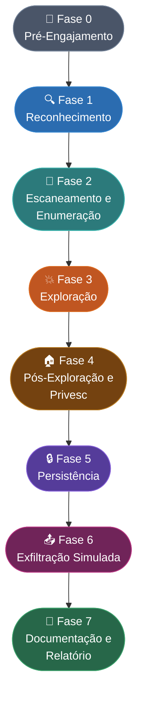

# Master Checklist

> [!quote] O Caminho do Pentester
> *Uma abordagem sistemática para testes de penetração garante que nenhuma etapa seja esquecida.*

> [!warning] ⚖️ Aviso Legal
> Todo conteúdo desta aula é exclusivo para **engajamentos autorizados por escrito** e ambientes de laboratório (TryHackMe, Hack The Box, VMs locais).
> A execução não autorizada configura crime tipificado no **art. 154-A do Código Penal Brasileiro** (invasão de dispositivo informático), com pena de reclusão de 1 a 4 anos e multa, agravada se houver obtenção de dados ou prejuízo econômico.

---

## 🗺️ Visão Geral das Fases (Mermaid)



---

## 🎯 Fluxo de Decisão (Alvo: Interno ou Externo?)

```
┌─────────────────────────────────────────────────────────────┐
│                    1. DEFINIR ALVO                          │
└─────────────────────────────────────────────────────────────┘
                            │
                            ▼
┌─────────────────────────────────────────────────────────────┐
│         2. TIPO DE ATAQUE: INTERNO ou EXTERNO?              │
└─────────────────────────────────────────────────────────────┘
                            │
              ┌─────────────┴─────────────┐
              ▼                           ▼
     ┌───────────────┐           ┌───────────────┐
     │   INTERNO     │           │   EXTERNO     │
     │ (Rede Local)  │           │  (Internet)   │
     └───────────────┘           └───────────────┘
              │                           │
              ▼                           ▼
     Passo 3: Wi-Fi           Passo 4: Coleta de
     e Rede Local             Informações (OSINT)
```

---

## 📋 Checklist Detalhado por Fase

### 🔏 Fase 0: Pré-Engajamento

> [!info] Escopo e Autorização
> Esta fase equivale ao **Pre-Engagement Interactions** do PTES e ao **Planning Phase** do NIST SP 800-115.
> Sem autorização formal, qualquer passo seguinte configura crime.

#### Autorização e Escopo
- [ ] Identificar o alvo: domínio, faixa de IP, organização
- [ ] Redigir e assinar **Acordo de Confidencialidade (NDA)**
- [ ] Obter **Autorização de Teste por Escrito** (Letter of Authorization, LoA)
- [ ] Definir escopo: IPs/domínios incluídos e excluídos
- [ ] Definir janela de tempo autorizada (horários de teste)
- [ ] Definir **Regras de Engajamento (RoE)**: o que pode/não pode ser feito
- [ ] Identificar sistemas fora do escopo (produção crítica, sistemas de terceiros)
- [ ] Definir contato de emergência do cliente para incidentes reais durante o teste
- [ ] Documentar objetivos: caixa preta, caixa branca ou caixa cinza?
- [ ] Combinar formato do relatório final com o cliente

#### Preparação do Ambiente
- [ ] Montar VM de ataque isolada (Kali Linux, Parrot OS)
- [ ] Configurar VPN ou rede isolada de laboratório
- [ ] Instalar e atualizar todas as ferramentas necessárias
- [ ] Verificar conectividade com o alvo dentro do escopo
- [ ] Criar pasta de projeto com estrutura de evidências (screenshots, logs, outputs)

---

### 🔍 Fase 1: Reconhecimento (Intelligence Gathering)

> [!info] OSINT e Reconhecimento Passivo
> Corresponde à **Intelligence Gathering** do PTES e à etapa de **Coleta de Informações** no fluxo. Ver também: [[Information Gathering Frameworks (OSINT)]] e [[Coleta de informações]].

#### Reconhecimento Passivo (sem contato direto com o alvo)
- [ ] **WHOIS** do domínio e bloco de IPs (ver [[whois]])
- [ ] Pesquisa no **Shodan** por serviços expostos (ver [[shodan]])
- [ ] Pesquisa no **Censys** por certificados e hosts (ver [[censys]])
- [ ] **Google Hacking (Google Dorks)**: arquivos expostos, painéis de admin, erros (ver [[Google hacking]])
- [ ] Coleta de e-mails via **theHarvester**, Hunter.io, **email harvesting** (ver [[Email harvesting]])
- [ ] Busca em redes sociais (LinkedIn, Twitter/X, GitHub) por funcionários e tecnologias (ver [[social media tools]])
- [ ] Análise de metadados de documentos públicos (PDFs, DOCx) com **ExifTool** ou FOCA
- [ ] Consulta a bancos de dados de vazamentos (HaveIBeenPwned, Dehashed)
- [ ] Enumeração de subdomínios via **Sublist3r**, **Amass**, **crt.sh**
- [ ] Reconhecimento de tecnologias via **BuiltWith**, **Wappalyzer**, Shodan (ver [[website recon tools (Reconhecimento de tecnologias|Reconhecimento de tecnologias web]])
- [ ] Verificar arquivos `robots.txt`, `sitemap.xml`, `.well-known/`
- [ ] Usar **recon-ng** para automatizar múltiplas fontes (ver [[recon-ng]])
- [ ] Verificar histórico via **Wayback Machine** (web.archive.org)
- [ ] Identificar fornecedores e provedores de cloud (AWS, Azure, GCP) no DNS/WHOIS

#### Reconhecimento Ativo (contato direto com o alvo)
- [ ] Identificar servidores de e-mail via registros MX
- [ ] **Enumeração de DNS** (zonas, registros A, AAAA, MX, TXT, SPF, DKIM) (ver [[DNS Enumeration (Enumeração de DNS)]])
- [ ] Realizar **zone transfer** (AXFR) se permitido
- [ ] Detectar WAF (Web Application Firewall) com **wafw00f**
- [ ] Fazer **banner grabbing** em serviços expostos (netcat, curl, telnet)

---

### 🔎 Fase 2: Escaneamento e Enumeração

> [!info] Mapeamento da Superfície de Ataque
> Corresponde à **Vulnerability Analysis** do PTES e ao escopo de **Discovery** do NIST SP 800-115. Ver também: [[Escaneamento de IPs e portas (Port Scanning)]] e [[Mapeamento de vulnerabilidades]].

#### Escaneamento de Rede
- [ ] **Varredura de hosts ativos**: `nmap -sn <rede>/24` (ping sweep)
- [ ] **Port scanning completo**: `nmap -sS -sV -sC -O -p- --min-rate 5000 <alvo>`
- [ ] Identificar sistemas operacionais (OS fingerprinting)
- [ ] Identificar versões de serviços (service version detection)
- [ ] Escaneamento UDP em portas críticas: `nmap -sU -p 53,67,68,69,123,161,162,500 <alvo>`
- [ ] Identificar portas filtradas vs. fechadas (possíveis bypasses de firewall)
- [ ] Scan de vulnerabilidades com **Nessus**, **OpenVAS** ou **Nuclei**

#### Enumeração de Serviços
- [ ] **SMB/NetBIOS** (porta 445/139): `enum4linux`, `smbclient`, `crackmapexec`
- [ ] **SNMP** (porta 161): community strings padrão (public, private) com `snmpwalk`, `onesixtyone`
- [ ] **LDAP/Active Directory** (porta 389/636): `ldapsearch`, `BloodHound`
- [ ] **FTP** (porta 21): acesso anônimo, versão vulnerável
- [ ] **SSH** (porta 22): versão, algoritmos permitidos (`ssh -v`, `nmap --script ssh-auth-methods`)
- [ ] **RDP** (porta 3389): BlueKeep (CVE-2019-0708), NLA desabilitado
- [ ] **HTTP/HTTPS** (portas 80/443/8080/8443): tecnologias, headers de segurança
- [ ] **DNS** (porta 53): recursão aberta, zone transfer
- [ ] **NFS** (porta 2049): exports acessíveis (`showmount -e <alvo>`)
- [ ] **MySQL/MSSQL/PostgreSQL** (portas 3306/1433/5432): acesso sem senha, versões
- [ ] **MongoDB** (porta 27017): instâncias sem autenticação
- [ ] **Redis** (porta 6379): acesso sem senha, execução remota
- [ ] **Elasticsearch** (porta 9200): índices públicos sem autenticação

#### Enumeração Web
- [ ] **Directory brute-force**: `gobuster dir`, `ffuf`, `dirbuster` com wordlists SecLists
- [ ] Identificar painéis administrativos: `/admin`, `/wp-admin`, `/phpmyadmin`, `/manager`
- [ ] Detectar tecnologias com **Nikto**, **WhatWeb**
- [ ] Enumerar parâmetros e endpoints com **Arjun**, **Burp Suite**
- [ ] Verificar **CORS**, headers de segurança (CSP, HSTS, X-Frame-Options, X-Content-Type-Options)
- [ ] Testar **Virtual Hosts** com wordlists de subdomínios

---

### 💥 Fase 3: Exploração (Exploitation)

> [!warning] ⚠️ Apenas em Ambientes Autorizados
> Corresponde à fase **Exploitation** do PTES. Todas as ações aqui requerem autorização explícita (LoA assinada). Ver [[Exploração do alvo]].

#### Exploração de Serviços de Rede
- [ ] Verificar credenciais padrão em todos os serviços identificados
- [ ] **Força bruta controlada**: Hydra, Medusa (dentro do escopo autorizado)
- [ ] **Exploração de vulnerabilidades conhecidas**: Metasploit, ExploitDB, searchsploit
- [ ] Testar **EternalBlue** (MS17-010) em SMB desatualizado
- [ ] Explorar **credenciais reutilizadas** (password spraying com CrackMapExec)
- [ ] Testar **Kerberoasting** e **AS-REP Roasting** em ambientes AD
- [ ] Explorar serviços de impressão (PrintNightmare, CVE-2021-34527)
- [ ] Testar injeção SQL em bancos de dados com **sqlmap**
- [ ] Explorar **RCE via desserialização** (Java, PHP, .NET)

#### Exploração Web (baseada no OWASP WSTG)
- [ ] **SQL Injection** (WSTG-INPV-05): manual + sqlmap
- [ ] **XSS Refletido e Armazenado** (WSTG-CLNT-01/02): payloads básicos e avançados
- [ ] **CSRF** (WSTG-SESS-05): tokens ausentes ou fracos
- [ ] **IDOR** (WSTG-ATHZ-04): troca de IDs em parâmetros e headers
- [ ] **Path Traversal / LFI / RFI** (WSTG-ATHZ-01): `../../etc/passwd`
- [ ] **SSRF** (Server-Side Request Forgery): metadados de cloud (169.254.169.254)
- [ ] **XXE** (XML External Entity): upload de XMLs maliciosos
- [ ] **Upload irrestrito de arquivos**: webshells via extensões não filtradas
- [ ] **Quebra de Autenticação**: brute force em login, bypass por manipulação de token JWT
- [ ] **Injeção de Comandos OS**: `; id`, `| whoami`, backticks
- [ ] **Open Redirect**: abuso para phishing e bypass de filtros

#### Exploração de Redes Sem Fio
- [ ] Identificar redes Wi-Fi do alvo (ver [[Ferramentas de redes sem fio (802 11)]])
- [ ] **WPS Attack**: explorar vulnerabilidades do protocolo WPS com Reaver/Bully
- [ ] **Força bruta de WPA2**: captura de handshake + hashcat/aircrack-ng
- [ ] **Evil Twin**: criar ponto de acesso falso para capturar credenciais (ver [[Captive Portal]])
- [ ] **Captive Portal**: verificar existência e tentar burlar autenticação
- [ ] Testar **PMKID attack** (sem cliente associado) com hcxdumptool
- [ ] Avaliar possibilidade de acesso físico via cabo de rede (ver [[Ataques em rede local]])

---

### 🏠 Fase 4: Pós-Exploração e Escalação de Privilégios

> [!info] Demostrar Impacto Real
> Corresponde ao **Post-Exploitation** do PTES e ao **Post-Testing** do NIST SP 800-115. Ver [[Escalonamento de privilégios]].
> MITRE ATT&CK TA0004 (Privilege Escalation) e TA0008 (Lateral Movement).

#### Enumeração Interna (Pós-Acesso)
- [ ] Identificar usuário atual e grupos: `whoami /all`, `id`
- [ ] Listar usuários do sistema: `net user` (Windows), `cat /etc/passwd` (Linux)
- [ ] Enumerar processos rodando: `ps aux`, `tasklist`
- [ ] Listar serviços e aplicações instaladas
- [ ] Verificar variáveis de ambiente (senhas em variáveis, tokens de API)
- [ ] Mapear a rede interna: `ipconfig /all`, `ip a`, `arp -a`, `netstat -an`
- [ ] Identificar shares SMB e arquivos de configuração com credenciais
- [ ] Coletar hashes com **Mimikatz** (Windows) ou `/etc/shadow` (Linux)
- [ ] Usar **LinPEAS** (Linux) ou **WinPEAS** (Windows) para enumerar vetores de privesc

#### Escalação de Privilégios (Linux)
- [ ] Verificar permissões SUID/SGID: `find / -perm -4000 2>/dev/null`
- [ ] Verificar entradas no crontab (scripts graváveis pelo usuário atual)
- [ ] Verificar `sudo -l`: comandos permitidos sem senha
- [ ] PATH Hijacking: diretórios graváveis antes de binários no PATH
- [ ] Verificar arquivos `.bash_history`, `.bashrc`, `.env` com credenciais
- [ ] Explorar kernel desatualizado: DirtyCow (CVE-2016-5195), Dirty Pipe (CVE-2022-0847)
- [ ] Verificar serviços rodando como root com configurações graváveis
- [ ] Abusar de capabilities Linux (`cap_setuid`, `cap_net_bind_service`)

#### Escalação de Privilégios (Windows)
- [ ] AlwaysInstallElevated (registro): instalação de MSI como SYSTEM
- [ ] Unquoted Service Paths: binários em caminhos com espaços sem aspas
- [ ] Permissões fracas em serviços (sc qc, AccessChk)
- [ ] DLL Hijacking: DLLs ausentes em caminhos graváveis
- [ ] Token Impersonation: PrintSpoofer, RoguePotato, JuicyPotato
- [ ] Credenciais no registro: `reg query HKLM /f password /t REG_SZ /s`
- [ ] SAM/SYSTEM dump: extração de hashes locais
- [ ] Pass-the-Hash com CrackMapExec ou Impacket

#### Movimento Lateral
- [ ] Reutilização de credenciais em outros hosts da rede
- [ ] **Pass-the-Hash (PtH)** e **Pass-the-Ticket (PtT)** em AD
- [ ] Pivoting com **Metasploit** (route), **Chisel**, **SSHuttle**
- [ ] Abuso de WMI, PsExec, WinRM para execução remota
- [ ] Verificar confiança entre domínios (Domain Trust) no AD
- [ ] **BloodHound**: mapear caminhos de ataque até Domain Admin

---

### 🔒 Fase 5: Persistência e Manutenção do Acesso

> [!info] Manutenção do Acesso
> MITRE ATT&CK TA0003 (Persistence). Ver [[Manutenção do acesso]].
> Em pentest real: documentar SEMPRE que persistência for estabelecida e removê-la ao final do engajamento.

- [ ] **Backdoors de usuário**: criar conta de usuário oculta (documentar e remover ao final)
- [ ] **Web shells**: manter acesso via shell em aplicação web comprometida
- [ ] **Scheduled Tasks / Cron Jobs**: execução automática de payload
- [ ] **Registry Run Keys** (Windows): `HKCU\Software\Microsoft\Windows\CurrentVersion\Run`
- [ ] **Startup Folder**: colocar payload em `C:\Users\<user>\AppData\Roaming\Microsoft\Windows\Start Menu\Programs\Startup`
- [ ] **Serviços Windows maliciosos**: criar serviço que executa payload
- [ ] **SSH Authorized Keys** (Linux): adicionar chave pública em `~/.ssh/authorized_keys`
- [ ] **Rootkits de nível usuário**: bibliotecas LD_PRELOAD, .bashrc modificado
- [ ] Verificar persistência em **BIOS/UEFI** (apenas em engajamentos avançados Red Team)
- [ ] Documentar TODOS os mecanismos de persistência criados para remoção pós-teste

---

### 📤 Fase 6: Exfiltração Simulada

> [!warning] ⚠️ Apenas Simulação
> MITRE ATT&CK TA0010 (Exfiltration). Em pentests reais, NUNCA exfiltrar dados reais de clientes. Usar arquivos de teste (honeydocs) para demonstrar o vetor.

- [ ] Identificar dados sensíveis acessíveis: credenciais, PII, dados financeiros, propriedade intelectual
- [ ] Testar exfiltração via **HTTP/HTTPS** para servidor controlado (Burp Collaborator, interactsh)
- [ ] Testar exfiltração via **DNS** (dnscat2, iodine) para bypass de firewalls
- [ ] Testar exfiltração via **ICMP** (tunneling) para redes com DPI
- [ ] Verificar se DLP (Data Loss Prevention) bloqueia transferências
- [ ] Testar compressão e criptografia de dados antes da exfiltração (bypass de IDS)
- [ ] Verificar limites de tamanho de transferência e detecção por volume
- [ ] Documentar o que poderia ser exfiltrado e o impacto de negócio correspondente
- [ ] Testar via **protocolos alternativos**: SMB, FTP, SFTP para destinos externos
- [ ] Verificar **egress filtering**: quais portas/protocolos saem sem bloqueio

---

### 🕵️ Fase 6.1: Apagando Rastros (Anti-Forensics)

> [!info] Evasão e Ocultação
> MITRE ATT&CK TA0005 (Defense Evasion) e TA0006 (Credential Access). Ver [[Apagando rastros]].

- [ ] Limpar logs de sistema: Event Viewer (Windows), `/var/log/` (Linux)
- [ ] Remover artefatos criados: binários, scripts, arquivos temporários
- [ ] Reverter alterações em registros, crontabs, arquivos de configuração
- [ ] Verificar se o antivírus/EDR detectou o payload (fonte valiosa de relatório)
- [ ] Documentar TODOS os artefatos criados para garantir limpeza completa
- [ ] Verificar timestamps de arquivos (timestomping) e restaurar se necessário
- [ ] Remover todas as contas criadas durante o teste

---

### 📄 Fase 7: Documentação e Relatório

> [!info] Entregável Final
> Corresponde à **Reporting** do PTES e ao **Post-Testing Activities** do NIST SP 800-115. Ver [[Documentação Report]].

#### Estrutura do Relatório
- [ ] **Resumo Executivo**: para a diretoria não técnica. Impacto de negócio, risco geral, recomendações prioritárias
- [ ] **Metodologia**: quais frameworks foram seguidos (PTES, OWASP WSTG, NIST SP 800-115)
- [ ] **Escopo**: o que foi testado, janela de tempo, tipo de teste
- [ ] **Sumário de Vulnerabilidades**: tabela com contagem por severidade (Crítico, Alto, Médio, Baixo, Informativo)
- [ ] **Achados Técnicos Detalhados**: para cada vulnerabilidade encontrada

#### Para Cada Vulnerabilidade
- [ ] Título e identificador único
- [ ] Severidade baseada no **CVSS v3.1** (Common Vulnerability Scoring System)
- [ ] Descrição técnica clara
- [ ] Prova de exploração (screenshots, output de comandos, logs)
- [ ] Impacto: o que um atacante real poderia fazer
- [ ] Recomendação de remediação com prazo sugerido
- [ ] Referências: CVE, CWE, OWASP Top 10, MITRE ATT&CK TTP

#### Pós-Relatório
- [ ] Agendar reunião de debriefing com o cliente
- [ ] Oferecer reteste após aplicação das correções (retest/validation)
- [ ] Arquivar evidências de forma segura (criptografada)
- [ ] Destruir dados do cliente coletados durante o teste (conforme NDA)

---

## 1️⃣ Definir o Alvo

> [!info] Escopo do Teste
> - [ ] Identificar o alvo (domínio, IP, organização)
> - [ ] Definir escopo autorizado
> - [ ] Obter autorização por escrito

---

## 2️⃣ Tipo de Ataque

> [!warning] Decisão Importante

| Tipo | Descrição | Próximo Passo |
|------|-----------|---------------|
| **Interno** | Acesso físico ou via rede local | Ir para Passo 3 |
| **Externo** | Acesso remoto via Internet | Ir para Passo 4 |

---

## 3️⃣ Ataque Interno (Rede Local)

> [!tip] Avaliação de Redes Sem Fio

#### a) Avaliação Inicial
- [ ] Identificar redes Wi-Fi do alvo
- [ ] Avaliar possibilidade de acesso físico (cabo de rede)

#### b) Ataques em Redes Sem Fio

| Ataque | Descrição |
|--------|-----------|
| **WPS Attack** | Explorar vulnerabilidades do protocolo WPS |
| **Força Bruta** | Descoberta de senha por dicionário/brute force |
| **Evil Twin** | Criar ponto de acesso falso para capturar credenciais |
| **Captive Portal** | Verificar existência e tentar burlar |

#### c) Após Obter Acesso

> [!success] Próximos Passos
> Caso obtenha acesso à rede:
> - [ ] [[Ataques em rede local|Enumerar os hosts]] (dispositivos) da rede
> - [ ] Partir para o Passo 4

---

## 4️⃣ Coleta de Informações

> [!info] Ferramentas de Coleta Ativa e Passiva

| Fase | Ferramentas |
|------|-------------|
| **Passiva (OSINT)** | whois, Google Hacking, Shodan, redes sociais |
| **Ativa** | nmap, nikto, dirb/gobuster, DNS enumeration |

---

## 🧩 Mapeamento MITRE ATT&CK por Fase

> [!info] ATT&CK Enterprise Matrix (2026)
> Cada fase do pentest mapeia para táticas específicas do MITRE ATT&CK. Use para comunicar ao cliente quais TTPs (Táticas, Técnicas e Procedimentos) foram testadas.

| Fase do Pentest | Tática ATT&CK | ID | Técnicas Representativas |
|---|---|---|---|
| Reconhecimento | Reconnaissance | TA0043 | Active Scanning (T1595), Phishing for Info (T1598), OSINT (T1589) |
| Escaneamento | Discovery | TA0007 | Network Service Scanning (T1046), System Info Discovery (T1082) |
| Exploração | Initial Access | TA0001 | Exploit Public-Facing App (T1190), Valid Accounts (T1078) |
| Pós-Exploração | Execution | TA0002 | Command and Scripting Interpreter (T1059), WMI (T1047) |
| Privesc | Privilege Escalation | TA0004 | Exploitation for Privesc (T1068), Abuse Elevation Control (T1548) |
| Movimento Lateral | Lateral Movement | TA0008 | Pass the Hash (T1550.002), Remote Services (T1021) |
| Persistência | Persistence | TA0003 | Scheduled Task (T1053), Boot/Logon Autostart (T1547) |
| Exfiltração | Exfiltration | TA0010 | Exfiltration Over C2 Channel (T1041), DNS (T1048.003) |
| Evasão | Defense Evasion | TA0005 | Indicator Removal (T1070), Process Injection (T1055) |

> **Nota 2026:** Segundo o Picus Red Report 2026, 8 das 10 técnicas mais usadas por atacantes reais visam **Evasão de Defesas, Persistência e C2 furtivo**. Virtualização/Sandbox Evasion (T1497) teve o maior crescimento. Process Injection (T1055) foi o mais prevalente em mais de 1 milhão de amostras de malware analisadas.

---

## ⚠️ Top 10 Vulnerabilidades por Tipo de Alvo

### Aplicações Web (OWASP Top 10 2021)
| Ranking | Vulnerabilidade | WSTG ID |
|---|---|---|
| A01 | Broken Access Control | WSTG-ATHZ-* |
| A02 | Cryptographic Failures | WSTG-CRYP-* |
| A03 | Injection (SQL, OS, LDAP) | WSTG-INPV-* |
| A04 | Insecure Design | WSTG-BUSL-* |
| A05 | Security Misconfiguration | WSTG-CONF-* |
| A06 | Vulnerable Components | WSTG-CONF-* |
| A07 | Auth and Session Failures | WSTG-ATHN-*, WSTG-SESS-* |
| A08 | Software and Data Integrity | WSTG-INPV-* |
| A09 | Logging and Monitoring Failures | WSTG-ERRH-* |
| A10 | SSRF | WSTG-INPV-19 |

### Redes e Infraestrutura
| Vetor | Frequência (2025) |
|---|---|
| Credenciais padrão não alteradas | Muito Alta |
| Serviços desnecessários expostos | Alta |
| Patches de OS atrasados | Alta |
| SMB/RDP exposto sem MFA | Alta |
| SNMP com community string "public" | Média |
| Wildcard certificates | Média |

---

## 🧪 Atividades Práticas

> [!example] 🧪 Atividade 1: Aplicar o Checklist Completo em Máquina de Lab
>
> **Plataforma:** TryHackMe (sala "Basic Pentesting", "Overpass", "VulnNet") ou Hack The Box (máquinas Easy)
>
> **Objetivo:** executar cada fase deste checklist em uma máquina vulnerável de laboratório e marcar cada item ao concluí-lo.
>
> **Procedimento:**
> 1. Escolha uma máquina "Easy" no TryHackMe ou HTB.
> 2. Imprima (ou abra em paralelo) este checklist.
> 3. Execute a Fase 0 (documente o "escopo" fictício e o objetivo da máquina).
> 4. Execute Fases 1 a 7, marcando os itens completados.
> 5. Ao final, produza um mini-relatório (Resumo Executivo + 3 achados técnicos com CVSS).
>
> **Resultado esperado:** checklist com pelo menos 60% dos itens marcados e um relatório de 1 página documentando os achados. Compartilhe o relatório em PDF com o professor.

> [!example] 🧪 Atividade 2: Adaptar o Checklist para Aplicação Web com OWASP WSTG
>
> **Plataforma:** DVWA (Damn Vulnerable Web Application), OWASP WebGoat, ou HackTheBox (máquinas web Easy)
>
> **Objetivo:** usar o OWASP WSTG como referência para testar uma aplicação web vulnerável, mapeando cada teste para um item do checklist.
>
> **Procedimento:**
> 1. Instale o DVWA localmente via Docker: `docker run --rm -it -p 80:80 vulnerables/web-dvwa`
> 2. Acesse `http://localhost` e configure o nível de segurança para "Low".
> 3. Para cada vulnerabilidade da seção "Exploração Web" deste checklist:
>    a. Localize o teste correspondente no OWASP WSTG (ex.: SQL Injection = WSTG-INPV-05).
>    b. Execute o teste conforme a metodologia do WSTG.
>    c. Documente o payload usado e o resultado obtido (screenshot).
>    d. Marque o item no checklist.
> 4. Ao final, compare quais itens do OWASP WSTG você cobriu e quais ficaram fora.
>
> **Resultado esperado:** relatório técnico com pelo menos 5 vulnerabilidades documentadas (título, payload, evidência, CVSS, recomendação).

> [!example] 🧪 Atividade 3: Comparar seu Checklist com o PTES
>
> **Plataforma:** Estudo teórico + laboratório (qualquer VM)
>
> **Objetivo:** identificar gaps entre o que você executa naturalmente e o que o PTES exige em cada fase.
>
> **Procedimento:**
> 1. Acesse o PTES em `http://www.pentest-standard.org/`
> 2. Para cada uma das 7 fases do PTES, anote as ações recomendadas em uma coluna.
> 3. Em outra coluna, liste o que você fez na Atividade 1 (checklist aplicado na máquina de lab).
> 4. Identifique: quais etapas do PTES você pulou? Por quê?
> 5. Reflita: quais etapas fazem mais diferença em um pentest real vs. um CTF?
>
> **Resultado esperado:** tabela comparativa PTES vs. execução real com pelo menos 5 gaps identificados e justificativa para cada um. Discussão em aula.

---

## 🔗 Links Relacionados

> [!tip] Aprofundamento por Fase

| Tópico | Fase Relacionada |
|--------|-----------------|
| [[Juntando tudo (745)]] | Visão geral: checklist completo de pentest |
| [[Information Gathering Frameworks (OSINT)]] | Fase 1: reconhecimento passivo e frameworks OSINT |
| [[Coleta de informações]] | Fase 1: técnicas de coleta ativa e passiva |
| [[Ferramentas de redes sem fio (802 11)]] | Fase 3: ataques Wi-Fi em detalhes |
| [[Escaneamento de IPs e portas (Port Scanning)]] | Fase 2: port scanning com nmap |
| [[Mapeamento de vulnerabilidades]] | Fase 2: análise de vulnerabilidades |
| [[Exploração do alvo]] | Fase 3: técnicas de exploração |
| [[Escalonamento de privilégios]] | Fase 4: privesc Linux e Windows |
| [[Manutenção do acesso]] | Fase 5: persistência e backdoors |
| [[Apagando rastros]] | Fase 6.1: anti-forensics e evasão |
| [[Documentação Report]] | Fase 7: estrutura do relatório profissional |
| [[Ataques em rede local]] | Fase 3/4: lateral movement na LAN |
| [[Anonimato e privacidade]] | Apoio: anonimato durante o teste |
| [[Engenharia social]] | Fase 1/3: vetor humano no pentest |

---

> [!note] 📚 Fontes (2026)
>
> - **PTES (Penetration Testing Execution Standard):** http://www.pentest-standard.org/ - framework de 7 fases que define o padrão da indústria para condução de pentests do início ao fim.
> - **OWASP WSTG v4.2 (Web Security Testing Guide):** https://owasp.org/www-project-web-security-testing-guide/ - guia com mais de 90 casos de teste específicos para aplicações web, organizados em 12 categorias. Versão 5.0 em desenvolvimento (2026).
> - **MITRE ATT&CK Enterprise Matrix:** https://attack.mitre.org/ - base de conhecimento de táticas e técnicas usadas por adversários reais, com mapeamento para fases de pentest.
> - **Picus Red Report 2026:** https://www.picussecurity.com/red-report - análise de 1 milhão de amostras de malware mapeadas para ATT&CK. Top: Process Injection (T1055), Virtualization Evasion (T1497).
> - **NIST SP 800-115:** https://www.softwaresecured.com/post/nist-sp-800-115-and-penetration-testing - guia técnico do NIST para testes de segurança, com fases: Planning, Discovery, Exploitation, Post-Testing.
> - **Deepstrike Penetration Testing Methodology (2025):** https://deepstrike.io/blog/penetration-testing-methodology - guia completo de metodologia de pentest com checklists por fase.
> - **Qualysec Pentest Checklist (2026):** https://qualysec.com/penetration-testing-checklist/ - checklist abrangente por fase para testes de penetração.
> - **HackerDNA OWASP WSTG (2026):** https://hackerdna.com/blog/owasp-web-security-testing-guide - como usar o WSTG na prática.
