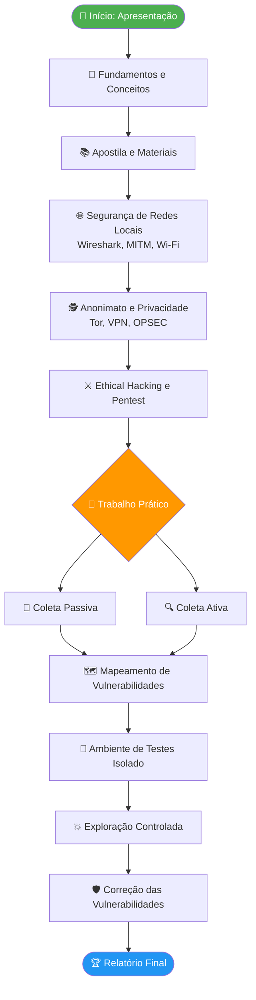

# Possível Cronograma da Disciplina

> [!quote] Planejamento Flexível
> *Cronograma em formato de tópicos, não utilizando datas específicas para permitir adaptação.*

---

## 🎓 Integrado 3º TI

> [!info] Cronograma para Ensino Médio Integrado

| Etapa | Conteúdo | Recurso Sugerido |
|-------|----------|-----------------|
| **1** | Apresentação da disciplina, materiais e ferramentas de aula | Criar conta no TryHackMe |
| **2** | Passeio pelos materiais complementares. Contribuição valendo nota (Tarefa) | Explorar trilha Pre-Security (THM) |
| **3** | Fundamentos e conceitos da Segurança da Informação (resumido; itens mais importantes) | OWASP Top 10 (leitura guiada) |
| **4** | Passear pela apostila | Apostila + laboratório local |
| **5** | Prática e Segurança de redes locais (Redes locais, redes sem fio, Wireshark e MITM) | Wireshark + room "Wireshark: The Basics" (THM) |
| **6** | Anonimato e Privacidade | Room "What is Networking?" + Tor Project docs |
| **7** | Ethical Hacking e pentest | PortSwigger Web Security Academy |
| **8** | Trabalho prático: Testes de intrusão | Ambiente isolado (VirtualBox/DVWA) |

### 📋 Detalhamento do Trabalho Prático

1. Definição do alvo (e equipes)
2. Coleta de informações (Parte 1: Ferramentas passivas)
3. Coleta de informações (Parte 2: Ferramentas ativas)
4. Mapeamento de vulnerabilidades
5. Elaboração do ambiente de testes (baseado no alvo)
6. Exploração do alvo (ambiente de teste)
7. Correção das vulnerabilidades exploradas

---

## 📚 Concomitante 4º Período

> [!tip] Cronograma para Curso Técnico Concomitante

| Etapa | Conteúdo | Recurso Sugerido |
|-------|----------|-----------------|
| **1** | Apresentação da disciplina, materiais e tecnologias | Criar conta no TryHackMe |
| **2** | Passeio pelos materiais complementares. Contribuição valendo nota (Tarefa) | Tracker pessoal de estudo (Notion ou planilha) |
| **3** | Fundamentos e conceitos da Segurança da Informação (resumido; itens mais importantes) | OWASP Top 10 + Perallis Security (PT-BR) |
| **4** | Passear pela apostila | Apostila + laboratório local |
| **5** | Prática e Segurança de redes locais (Redes locais, redes sem fio, Wireshark e MITM) | Wireshark + room "Wireshark: The Basics" (THM) |
| **6** | Anonimato e Privacidade | Room "What is Networking?" + Tor Project docs |
| **7** | Ethical Hacking e pentest | PortSwigger Web Security Academy |
| **8** | Trabalho prático: Testes de intrusão | Ambiente isolado (VirtualBox/DVWA) |

### 📋 Detalhamento do Trabalho Prático

1. Definição do alvo
2. Coleta de informações (Parte 1: Ferramentas passivas)
3. Coleta de informações (Parte 2: Ferramentas ativas)
4. Mapeamento de vulnerabilidades
5. Elaboração do ambiente de testes (baseado no alvo)
6. Exploração do alvo (ambiente de teste)
7. Correção das vulnerabilidades exploradas

---

## 🗺️ Jornada Visual dos Tópicos

O diagrama abaixo mostra a progressão lógica dos tópicos ao longo da disciplina, do mais teórico ao mais prático:

---

## 🔄 Flexibilidade

> [!warning] Nota Importante
> O cronograma pode ser ajustado conforme o ritmo da turma e disponibilidade de recursos (laboratório, máquinas virtuais, etc.).

---

## 🧪 Atividades Mão na Massa

> [!example] 🧪 Atividade 1: Primeira Missão no TryHackMe
>
> **Plataforma:** [TryHackMe](https://tryhackme.com) (gratuita, sem instalação)
>
> **Passo a passo:**
> 1. Acesse tryhackme.com e crie uma conta gratuita.
> 2. Inicie a trilha **"Pre-Security"** (disponível gratuitamente).
> 3. Complete a room **"Introductory Networking"** (inclui conceitos de IP, portas, protocolos).
> 4. Tire um print da tela com o badge ou a barra de progresso ao concluir.
>
> **Resultado observável:** badge de conclusão da room visível no perfil + compreensão prática de como pacotes trafegam em redes reais.
>
> **Restrição ética:** todos os exercícios ocorrem dentro do ambiente virtual do TryHackMe. Nenhuma ação deve ser direcionada a redes ou sistemas de terceiros.

> [!example] 🧪 Atividade 2: Meu Tracker de Estudo em Segurança
>
> **Plataforma:** Notion (gratuito) ou Google Planilhas
>
> **Passo a passo:**
> 1. Crie uma tabela com as colunas: **Tópico**, **Recurso**, **Plataforma**, **Status**, **Data de Conclusão**.
> 2. Preencha cada linha com um tópico do cronograma desta disciplina (ex.: "Fundamentos", "Wireshark", "MITM", "Pentest").
> 3. Para pelo menos **um tópico**, pesquise e anote um recurso gratuito específico: uma room no TryHackMe, um lab no PortSwigger Academy ou um desafio no PicoCTF.
> 4. Agende uma data no calendário pessoal para completar esse recurso.
>
> **Resultado observável:** planilha ou página Notion compartilhável com pelo menos 5 tópicos mapeados, 1 recurso vinculado e 1 data agendada.
>
> **Por que isso importa:** autogestão de aprendizagem é habilidade essencial em segurança, uma área que exige aprendizado contínuo por conta própria.

> [!example] 🧪 Atividade Bônus: Inspecionando Tráfego com Wireshark
>
> **Plataforma:** [Wireshark](https://www.wireshark.org) (instalação local, gratuito) + room "Wireshark: The Basics" no TryHackMe
>
> **Passo a passo:**
> 1. Instale o Wireshark na sua máquina (ou use a VM do laboratório).
> 2. Abra o Wireshark e capture tráfego na sua própria interface de rede por 30 segundos enquanto acessa um site HTTP simples.
> 3. Use o filtro `http` para isolar requisições HTTP.
> 4. Identifique: endereço IP de origem, IP de destino e o campo "Host" no cabeçalho HTTP.
> 5. Registre as descobertas num print anotado.
>
> **Resultado observável:** print do Wireshark com filtro aplicado e pelo menos 3 campos identificados e anotados pelo aluno.
>
> **Restrição ética:** captura realizada SOMENTE na própria rede ou em ambiente de laboratório autorizado. Capturar tráfego de redes alheias sem permissão é crime (Lei 12.737/2012).

---

## 📊 Mapa de Recursos por Módulo

| Módulo | Tópico Principal | Plataforma | Recurso Gratuito | Nível |
|--------|-----------------|------------|-----------------|-------|
| 1 | Apresentação e Contexto | TryHackMe | Trilha "Intro to Cyber Security" | Iniciante |
| 2 | Materiais e Ferramentas | Notion / Google Sheets | Template de tracker pessoal | Iniciante |
| 3 | Fundamentos de SI | OWASP | OWASP Top 10 (leitura) | Iniciante |
| 4 | Apostila e Conceitos | Apostila local | Material da disciplina | Iniciante |
| 5 | Redes e Wireshark | TryHackMe | "Wireshark: The Basics" | Intermediário |
| 5 | MITM e Redes Sem Fio | TryHackMe | "Network Security" room | Intermediário |
| 6 | Anonimato e Privacidade | Tor Project | Documentação oficial (PT-BR) | Intermediário |
| 7 | Ethical Hacking | PortSwigger Academy | Labs gratuitos (XSS, SQLi) | Intermediário |
| 7 | Pentest Metodologia | TryHackMe | "Jr Penetration Tester" path | Intermediário |
| 8 | Trabalho Prático | VirtualBox + DVWA | Ambiente local isolado | Avançado |
| Extra | CTF e Desafios | PicoCTF | Desafios sem paywall | Todos |

---

> [!note] 📚 Fontes e Plataformas Recomendadas (2026)
>
> Recursos verificados e disponíveis gratuitamente para estudo de segurança da informação:
>
> **Plataformas de Prática Hands-on:**
> - [TryHackMe](https://tryhackme.com): plataforma gamificada com rooms no browser, sem instalação. Trilha "Pre-Security" e "Intro to Cyber Security" são 100% gratuitas. Ideal para iniciantes.
> - [PortSwigger Web Security Academy](https://portswigger.net/web-security): criada pelos desenvolvedores do Burp Suite. Foco em vulnerabilidades web (SQLi, XSS, CSRF, IDOR). Labs interativos gratuitos.
> - [Hack The Box](https://www.hackthebox.com): plataforma com CTFs e máquinas vulneráveis. Nível mais avançado. Evento anual "Cyber Apocalypse 2026" aberto a equipes.
> - [PicoCTF](https://picoctf.org): 100% gratuito, sem paywall, sem assinatura. Desafios de CTF criados pela Carnegie Mellon University. Excelente para iniciantes.
>
> **Referências Técnicas:**
> - [OWASP Top 10](https://owasp.org/www-project-top-ten/): os 10 riscos mais críticos em aplicações web. Leitura obrigatória.
> - [OWASP São Paulo](https://owasp.org/www-chapter-sao-paulo/): capítulo brasileiro com eventos e palestras gratuitas.
> - [Perallis Security: O que é OWASP Top 10](https://www.perallis.com/news/o-que-e-o-owasp-top-10-quais-sao-as-vulnerabilidades-mais-comuns): artigo introdutório em PT-BR.
> - [Comparativo de plataformas 2026 (CyberLeveling)](https://cyberleveling.com/blog/cybersecurity-learning-platforms): análise atualizada de THM vs HTB vs PortSwigger vs OffSec Labs.
>
> **Lei brasileira de referência:**
> - Lei 12.737/2012 (Lei Carolina Dieckmann): tipifica crimes informáticos no Brasil. Leitura recomendada antes do módulo de Ethical Hacking.
