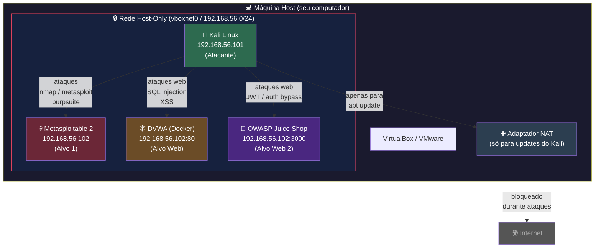

# Preparando o Terreno

> [!quote] Antes de Hackear, Entenda o Processo
> *Um teste de intrusão bem-sucedido começa com planejamento, metodologia e um ambiente controlado.*

---

## 🎯 O que é um Teste de Intrusão?

> [!info] Definição
> É um método que avalia a segurança de um sistema ou rede, **simulando um ataque** de uma fonte maliciosa.

O processo envolve análise das atividades do sistema, buscando **vulnerabilidades** que podem resultar de:
- Má configuração do sistema
- Falhas em hardware/software desconhecidas
- Deficiências no sistema operacional
- Falhas nas técnicas de defesa

![[Recursos/Segurança da informação/Preparando o terreno/preparando-o-terreno.png|Processo de pentest]]

> [!success] Resultado
> O teste de intrusão gera um **relatório** com todas as análises, vulnerabilidades e, muitas vezes, a **solução técnica** para os problemas encontrados.

---

## 👨‍💻 O que é um Ethical Hacker?

> [!tip] Hacker Ético
> É um profissional de TI que trabalha na área de Segurança da Informação, com a função de encontrar vulnerabilidades **antes** que hackers maliciosos as explorem.

Este profissional precisa ter conhecimentos **iguais ou superiores** a um hacker com intenção maliciosa, mas utiliza esse conhecimento para:
- Investigar sistemas
- Analisar vulnerabilidades
- Reportar problemas
- Evitar incidentes de segurança

> [!quote] Filosofia
> *"A filosofia por trás do Hacker Ético é tentar capturar o ladrão, pensando como um ladrão."*

> [!warning] Autorização é Obrigatória
> Um teste de intrusão **deve ser autorizado** pela empresa. Testar sistemas sem permissão é crime!

---

## 🔄 Etapas de um Ataque

> [!info] Metodologia Geral
> Não existe uma forma única de definir as etapas, mas este é um modelo amplamente aceito.

![[Recursos/Segurança da informação/Preparando o terreno/preparando-o-terreno-1.png|Etapas do ataque]]

| Etapa | Descrição |
|-------|-----------|
| **1. Coleta de Informações** | Ramo da empresa, e-mails, nomes, VPN, servidores DNS |
| **2. Mapeamento de Rede** | Descobrir topologia, IPs, quantidade de computadores |
| **3. Enumeração de Serviços** | Descobrir serviços e portas usando nmap |
| **4. Busca de Vulnerabilidades** | Examinar software em busca de falhas exploráveis |
| **5. Exploração** | Invadir o software, comprometer o serviço |
| **6. Implantação de Backdoors** | Deixar acesso para retorno futuro |
| **7. Eliminação de Vestígios** | Apagar logs e arquivos temporários |

---

## 🎨 Tipos de Testes de Intrusão

![[Recursos/Segurança da informação/Preparando o terreno/preparando-o-terreno-2.png|Tipos de pentest]]

| Tipo | Conhecimento do Pentester | Descrição |
|------|---------------------------|-----------|
| **Black Box** | Nenhum | Simula atacante externo sem informações prévias |
| **White Box** | Total | Acesso a código-fonte, documentação, credenciais |
| **Grey Box** | Parcial | Algumas informações, como credenciais de usuário comum |

---

## 📋 Metodologias de Testes de Intrusão

> [!tip] Por que usar metodologia?
> Não existe uma única forma de realizar um pentest. Dependendo do objetivo, existem métodos específicos.

> [!info] O que é Metodologia?
> São os **passos (checklist)** realizados pelo pentester para realizar um teste de intrusão de forma organizada.

### Padrão Geral

| Stage | Description |
|-------|-------------|
| **Information Gathering** | Coleta de informações públicas sobre o alvo (OSINT). Sem escanear sistemas. |
| **Enumeration/Scanning** | Descobrir aplicações e serviços rodando nos sistemas. |
| **Exploitation** | Explorar vulnerabilidades descobertas usando exploits. |
| **Privilege Escalation** | Expandir acesso: horizontal (outro usuário) ou vertical (admin). |
| **Post-exploitation** | Pivoting, coleta de informações adicionais, cobertura de rastros, relatório. |

---

### 📘 PTES: Penetration Testing Execution Standard

> [!info] 7 Seções Principais
> Abrange tudo relacionado a um pentest, desde comunicação inicial até relatórios.

![[Recursos/Segurança da informação/Preparando o terreno/preparando-o-terreno-3.png|PTES]]

**Mais informações:** [pentest-standard.org](http://www.pentest-standard.org/index.php/Main_Page)

---

### 📗 OSSTMM: Open Source Security Testing Methodology Manual

> [!info] Auditoria de Segurança
> Desenvolvida para avaliar requisitos regulamentares e do setor.

![[Recursos/Segurança da informação/Preparando o terreno/preparando-o-terreno-4.png|OSSTMM]]

**Mais informações:** [OSSTMM.3.pdf](https://www.isecom.org/OSSTMM.3.pdf)

---

### 📙 OWASP Top 10: Teste de Intrusão Web

> [!warning] As 10 Vulnerabilidades Mais Comuns
> Lista das vulnerabilidades de aplicativos web mais vistas. Atualizada a cada 3-4 anos.

![[Recursos/Segurança da informação/Preparando o terreno/preparando-o-terreno-5.png|OWASP Top 10]]

**Mais informações:** [OWASP Top Ten Project](https://www.owasp.org/index.php/Category:OWASP_Top_Ten_Project)

---

### 📕 NIST 800-115: National Institute of Standards and Technology

> [!info] Guia Técnico
> Recomendações práticas para execução de análise de vulnerabilidades em aplicações e redes.

![[Recursos/Segurança da informação/Preparando o terreno/preparando-o-terreno-6.png|NIST 800-115]]

**Mais informações:** [NIST SP 800-115 PDF](https://nvlpubs.nist.gov/nistpubs/Legacy/SP/nistspecialpublication800-115.pdf)

---

### 📓 NCSC CAF: Cyber Assessment Framework

> [!info] Infraestrutura Crítica
> Framework de 14 princípios para organizações que realizam "serviços vitalmente importantes".

![[Recursos/Segurança da informação/Preparando o terreno/preparando-o-terreno-7.png|NCSC CAF]]

Foca em:
- Data security
- System security
- Identity and access control
- Resiliency
- Monitoring
- Response and recovery planning

---

## 🖥️ Ambiente de Hacking e Estudo

> [!danger] Atenção Legal
> Testar hacking em sistemas na internet **sem autorização prévia é crime!**

### 🛡️ Proteja seu Sistema Operacional

1. Não instale softwares de sites não oficiais
2. Tenha um antivírus
3. Use pendrive o mínimo possível
4. Não clique em links sem antes analisar

### 🔧 Configurando seu Lab

> [!tip] Recomendações

- **Sistema separado** para estudo (pode ser máquina virtual, como Kali Linux)
- **Cuidado com anonimato**: aprenda sobre Tor e técnicas de privacidade
- **VPS na nuvem**: alternativa a VMs locais (tem custo financeiro)

### 🎯 Alvos Legais para Praticar

| Plataforma | Descrição |
|------------|-----------|
| **Metasploitable2** | Sistema Linux vulnerável para aprendizado |
| [VulnHub](https://www.vulnhub.com/) | Máquinas virtuais com desafios |
| [TryHackMe](https://tryhackme.com/) | Plataforma gamificada para iniciantes |
| [PicoCTF](https://picoctf.org/) | CTFs para estudantes |

---

## 💰 Bug Bounty

> [!success] Ganhe Dinheiro Hackeando
> **Bug bounty** são programas de recompensas criadas por empresas para pagar pessoas que descobrem vulnerabilidades em seus sistemas.

Plataformas que conectam hackers a empresas:
- [HackerOne](https://www.hackerone.com/)
- [Bugcrowd](https://www.bugcrowd.com/)
- [Synack](https://www.synack.com/)

---

## 📺 Recurso Recomendado

[📺 Como Estudar Hacking e Pentest - Montando um ambiente de estudo](https://www.youtube.com/watch?v=syXuqAKZfA0)

---

## ✅ Checklist de um Teste de Intrusão

> [!tip] Passos Básicos

1. ☐ Definir um alvo
2. ☐ Escolher metodologia e modelo de relatório
3. ☐ Usar ferramentas de anonimato
4. ☐ Executar etapas de coleta e mapeamento (no alvo escolhido)
5. ☐ Clonar o alvo em máquina virtual
6. ☐ Executar etapas de exploração e pós-exploração (na máquina virtual)
7. ☐ Elaborar relatório e apresentação

---

## ⚖️ Marco Legal: Art. 154-A do Código Penal

> [!danger] O que diz a lei
> O **Art. 154-A do Código Penal** (inserido pela Lei 12.737/2012, conhecida como **Lei Carolina Dieckmann**, e endurecido pela Lei 14.155/2021) tipifica a **invasão de dispositivo informático alheio** sem autorização expressa ou tácita do titular.

### Pena atual (após Lei 14.155/2021)

| Conduta | Pena |
|---------|------|
| Invasão simples (acesso sem autorização) | Reclusão de **1 a 4 anos** + multa |
| Invasão com obtenção de comunicações privadas, segredos comerciais ou controle remoto | Reclusão de **2 a 5 anos** + multa |
| Invasão com divulgação, comercialização ou transmissão dos dados obtidos | Reclusão de **3 a 6 anos** + multa |

> [!warning] O que muda no pentest autorizado
> A **autorização prévia e por escrito** do titular do sistema é o elemento que transforma a conduta de crime em serviço profissional legítimo. Sem esse documento assinado (chamado de **Rules of Engagement** ou **Carta de Autorização**), qualquer acesso não autorizado, mesmo com fins didáticos fora do lab, configura o tipo penal.

### O que é permitido nesta disciplina

Toda prática de ataque realizada neste curso ocorre exclusivamente em:
- VMs locais na rede **host-only isolada** (sem contato com a internet)
- Plataformas de treinamento com autorização explícita: Hack The Box, TryHackMe, PortSwigger Academy
- Alvo oficial para teste de conectividade: `scanme.nmap.org` (único IP externo autorizado publicamente pelo Nmap)
- Máquinas próprias do aluno dentro do lab

**Nunca** aplique técnicas aprendidas aqui em sistemas de terceiros, redes corporativas, ou qualquer infraestrutura para a qual você não possua autorização assinada.

---

## 🧪 Montando o Laboratório de Pentest (Passo a Passo Completo)

> [!info] Visão Geral
> O lab de pentest tem três camadas: a **máquina atacante** (Kali Linux), os **alvos vulneráveis** (Metasploitable2, DVWA, OWASP Juice Shop) e a **rede isolada** que os conecta. Nada disso deve ter acesso à internet durante os ataques.

### Arquitetura do Lab



---

### Fluxo de Montagem do Lab

```mermaid
flowchart LR
    A["1️⃣ Instalar<br/>VirtualBox"] --> B["2️⃣ Criar rede<br/>Host-Only"]
    B --> C["3️⃣ Instalar<br/>Kali Linux"]
    C --> D["4️⃣ Atualizar<br/>Kali"]
    D --> E["5️⃣ Snapshot<br/>Kali limpo"]
    E --> F["6️⃣ Instalar<br/>Metasploitable 2"]
    F --> G["7️⃣ Configurar<br/>rede isolada"]
    G --> H["8️⃣ Testar<br/>conectividade"]
    H --> I["9️⃣ Snapshot<br/>alvos limpos"]
    I --> J["✅ Lab pronto<br/>para atacar"]

    style A fill:#2d6a4f,color:#fff
    style J fill:#e94560,color:#fff
```



---

### Passo 1: Instalar o VirtualBox

Baixe a versão mais recente em [virtualbox.org](https://www.virtualbox.org/). No Linux (Ubuntu/Debian):

```bash
# Adicionar repositório oficial Oracle VirtualBox
echo "deb [arch=amd64 signed-by=/usr/share/keyrings/oracle-virtualbox-2016.gpg] \
  https://download.virtualbox.org/virtualbox/debian $(lsb_release -cs) contrib" \
  | sudo tee /etc/apt/sources.list.d/virtualbox.list

# Importar chave GPG
wget -O- https://www.virtualbox.org/download/oracle_vbox_2016.asc \
  | sudo gpg --dearmor -o /usr/share/keyrings/oracle-virtualbox-2016.gpg

# Instalar
sudo apt update && sudo apt install virtualbox-7.1 -y

# Verificar instalação
VBoxManage --version
```

> [!tip] Alternativa
> VMware Workstation Pro (agora gratuito para uso pessoal) tem performance ligeiramente superior para labs complexos com 5+ VMs.

---

### Passo 2: Criar a Rede Host-Only Isolada

A rede **Host-Only** é a espinha dorsal do lab: as VMs se comunicam entre si e com o host, mas ficam **completamente isoladas da internet**. Isso garante que nenhum ataque escape para a rede real.

#### Via Interface Gráfica (VirtualBox)

1. Menu: `Arquivo` → `Ferramentas` → `Gerenciador de Rede`
2. Clique em `Criar` para adicionar `vboxnet0`
3. Configure o adaptador:
   - **Endereço IPv4:** `192.168.56.1`
   - **Máscara:** `255.255.255.0`
4. Na aba **Servidor DHCP**, marque `Habilitar Servidor`:
   - Endereço do servidor: `192.168.56.100`
   - Limite inferior: `192.168.56.101`
   - Limite superior: `192.168.56.254`

#### Via Linha de Comando

```bash
# Criar rede host-only
VBoxManage hostonlyif create

# Configurar IP e máscara
VBoxManage hostonlyif ipconfig vboxnet0 \
  --ip 192.168.56.1 \
  --netmask 255.255.255.0

# Habilitar DHCP na rede host-only
VBoxManage dhcpserver add \
  --ifname vboxnet0 \
  --ip 192.168.56.100 \
  --netmask 255.255.255.0 \
  --lowerip 192.168.56.101 \
  --upperip 192.168.56.254 \
  --enable

# Verificar criação
VBoxManage list hostonlyifs
```

> [!warning] Por que isolado é obrigatório?
> Se Metasploitable2 tiver acesso à internet com as credenciais padrão `msfadmin:msfadmin`, qualquer worm ou scanner externo pode comprometer sua máquina em minutos. A rede host-only elimina esse risco.

---

### Passo 3: Instalar o Kali Linux (Máquina Atacante)

Baixe a imagem oficial em [kali.org/get-kali](https://www.kali.org/get-kali/). Prefira a **imagem de VM** (`.ova`) para importar direto no VirtualBox sem precisar instalar do zero.

#### Importar OVA no VirtualBox

```bash
# Importar a imagem OVA baixada
VBoxManage import kali-linux-2025.2-virtualbox-amd64.ova \
  --vsys 0 --vmname "Kali-Pentest-Lab"

# Configurar memória (mínimo 4GB, recomendado 8GB)
VBoxManage modifyvm "Kali-Pentest-Lab" --memory 8192

# Configurar CPUs (mínimo 2, recomendado 4)
VBoxManage modifyvm "Kali-Pentest-Lab" --cpus 4
```

#### Configurar os Dois Adaptadores de Rede

O Kali precisa de dois adaptadores: um **NAT** (para baixar atualizações) e um **Host-Only** (para o lab).

```bash
# Adaptador 1: NAT (acesso à internet para updates)
VBoxManage modifyvm "Kali-Pentest-Lab" \
  --nic1 nat

# Adaptador 2: Host-Only (comunicação com os alvos)
VBoxManage modifyvm "Kali-Pentest-Lab" \
  --nic2 hostonlyif \
  --hostonlyadapter2 vboxnet0

# Iniciar a VM
VBoxManage startvm "Kali-Pentest-Lab" --type gui
```

> [!tip] Credenciais padrão do Kali OVA
> Login: `kali` | Senha: `kali`
> Mude a senha imediatamente após o primeiro boot: `passwd`

---

### Passo 4: Atualizar o Kali Linux Completamente

Sempre atualizar o Kali antes de começar um pentest real ou uma sessão de lab. Ferramentas desatualizadas podem falhar contra targets modernos.

```bash
# Atualizar lista de pacotes e upgrade completo (comando recomendado pelo Kali)
sudo apt update && sudo apt full-upgrade -y

# Remover pacotes desnecessários
sudo apt autoremove -y && sudo apt autoclean

# Verificar versão do Kali após update
cat /etc/os-release | grep VERSION

# Atualizar o Metasploit Framework especificamente
sudo msfupdate

# Verificar versão do Nmap
nmap --version

# Instalar metapacote completo de pentest (se ainda não instalado)
# ATENÇÃO: ocupa ~15GB em disco
sudo apt install kali-linux-everything -y
```

> [!tip] Metapacotes do Kali por categoria
> Prefira instalar só o que vai usar para economizar espaço:
> - `kali-tools-top10`: as 10 ferramentas mais usadas (Nmap, Metasploit, Burp Suite, etc.)
> - `kali-tools-web`: ferramentas para pentest web
> - `kali-tools-wireless`: ferramentas para redes sem fio
> - `kali-tools-exploitation`: exploits e frameworks de exploração

---

### Passo 5: Instalar o Metasploitable 2 (Alvo Clássico)

O **Metasploitable 2** é uma VM Linux **intencionalmente vulnerável**, criada pela Rapid7 para treinamento com Metasploit. Contém dezenas de serviços mal configurados e desatualizados.

#### Download e Importação

1. Baixe em: [sourceforge.net/projects/metasploitable](https://sourceforge.net/projects/metasploitable/)
2. Descompacte o arquivo `.zip`: extraia a pasta `Metasploitable2-Linux`

```bash
# Importar o disco VMDK no VirtualBox
VBoxManage createvm \
  --name "Metasploitable2" \
  --ostype Ubuntu_64 \
  --register

# Configurar hardware mínimo (512MB RAM é suficiente)
VBoxManage modifyvm "Metasploitable2" \
  --memory 512 \
  --cpus 1

# Adicionar controlador SATA e conectar o VMDK
VBoxManage storagectl "Metasploitable2" \
  --name "SATA Controller" \
  --add sata \
  --controller IntelAHCI

VBoxManage storageattach "Metasploitable2" \
  --storagectl "SATA Controller" \
  --port 0 \
  --device 0 \
  --type hdd \
  --medium "/caminho/para/Metasploitable.vmdk"
```

#### Configurar APENAS Rede Host-Only (sem internet)

```bash
# IMPORTANTE: apenas um adaptador, somente host-only (sem NAT!)
VBoxManage modifyvm "Metasploitable2" \
  --nic1 hostonlyif \
  --hostonlyadapter1 vboxnet0

# Garantir que o adaptador 2 está desabilitado
VBoxManage modifyvm "Metasploitable2" --nic2 none
VBoxManage modifyvm "Metasploitable2" --nic3 none
VBoxManage modifyvm "Metasploitable2" --nic4 none

# Iniciar
VBoxManage startvm "Metasploitable2" --type gui
```

> [!danger] Credenciais padrão do Metasploitable2
> Login: `msfadmin` | Senha: `msfadmin`
> **NUNCA** deixe esta VM com acesso à internet. Com essas credenciais e todos os serviços vulneráveis ativos, ela seria comprometida em segundos.

---

### Passo 6: Adicionar Alvos Web com Docker (DVWA e OWASP Juice Shop)

Os alvos web podem rodar diretamente dentro do Kali Linux via Docker, facilitando o setup.

```bash
# Instalar Docker no Kali
sudo apt update && sudo apt install docker.io -y
sudo systemctl enable docker --now

# Adicionar usuário kali ao grupo docker (para não precisar de sudo)
sudo usermod -aG docker kali
newgrp docker

# Subir DVWA (Damn Vulnerable Web Application)
docker pull sagikazarmark/dvwa
docker run -d \
  --name dvwa \
  -p 80:80 \
  --restart unless-stopped \
  sagikazarmark/dvwa

# Subir OWASP Juice Shop
docker pull bkimminich/juice-shop
docker run -d \
  --name juice-shop \
  -p 3000:3000 \
  --restart unless-stopped \
  bkimminich/juice-shop

# Verificar containers rodando
docker ps

# Acessar os alvos no browser do Kali:
# DVWA:       http://localhost/dvwa/
# Juice Shop: http://localhost:3000
```

> [!tip] DVWA: primeiro acesso
> Acesse `http://localhost/dvwa/setup.php` e clique em **Create / Reset Database**. Login padrão: `admin` / `password`.

> [!tip] Juice Shop: primeiro acesso
> Acesse `http://localhost:3000`. O scoreboard (painel de desafios) fica em `/#/score-board`. Tente encontrá-lo sem spoilers: é o primeiro desafio!

---

### Passo 7: Tirar Snapshots (Estado Limpo para Restauração)

Snapshots são **obrigatórios** no lab de pentest. Após um ataque bem-sucedido (ex.: você obteve root no Metasploitable), o alvo fica comprometido. Com o snapshot, você reverte para o estado original em segundos e recomeça com um vetor de ataque diferente.

```bash
# Tirar snapshot do Kali após atualização e configuração inicial
VBoxManage snapshot "Kali-Pentest-Lab" take "kali-limpo-2026" \
  --description "Kali atualizado, ferramentas instaladas, rede configurada"

# Tirar snapshot do Metasploitable2 antes de qualquer ataque
VBoxManage snapshot "Metasploitable2" take "meta2-virgem-2026" \
  --description "Metasploitable2 estado original, sem modificações"

# Listar snapshots de uma VM
VBoxManage snapshot "Metasploitable2" list

# RESTAURAR snapshot (quando quiser voltar ao estado limpo)
VBoxManage snapshot "Metasploitable2" restore "meta2-virgem-2026"

# Restaurar e iniciar em um comando
VBoxManage snapshot "Metasploitable2" restore "meta2-virgem-2026" && \
VBoxManage startvm "Metasploitable2" --type gui
```

> [!tip] Boas práticas de snapshot
> - Tire um snapshot **antes** de cada atividade nova
> - Nomeie com data: `meta2-virgem-2026-06-17`
> - Snapshots ocupam espaço: apague os antigos periodicamente
> - No VMware: `VM` → `Snapshot` → `Take Snapshot`

---

## 🌐 Plataformas Online de Treinamento (2025-2026)

> [!info] Para quem não pode ou não quer rodar VMs localmente, existem labs prontos na nuvem.

| Plataforma | Estilo | Nível | Custo |
|------------|--------|-------|-------|
| [Hack The Box](https://hackthebox.com) | CTF + labs guiados | Iniciante a avançado | Gratuito / Pro |
| [TryHackMe](https://tryhackme.com) | Caminhos guiados, gamificado | Iniciante | Gratuito / Premium |
| [PortSwigger Web Academy](https://portswigger.net/web-security) | Labs web (SQL injection, XSS, SSRF...) | Todos | 100% Gratuito |
| [VulnHub](https://vulnhub.com) | VMs para download local | Iniciante a avançado | 100% Gratuito |
| [PentesterLab](https://pentesterlab.com) | Exercícios estruturados por CVE | Intermediário | Gratuito / Pro |
| [OWASP WebGoat](https://owasp.org/www-project-webgoat/) | App web didático com lições | Iniciante | 100% Gratuito |
| [scanme.nmap.org](http://scanme.nmap.org) | Servidor real autorizado para scan Nmap | Todos | Gratuito |
| [PicoCTF](https://picoctf.org) | CTF para estudantes universitários | Iniciante a Intermediário | 100% Gratuito |

> [!warning] scanme.nmap.org: limite de uso
> Autorizado para scans ocasionais com Nmap. Não use ferramentas de exploração nem faça scans repetitivos/agressivos. Leia os termos em [nmap.org/book/legal-issues.html](https://nmap.org/book/legal-issues.html).

---

## 📄 Rules of Engagement (RoE) e Escopo

> [!info] O que é RoE?
> **Rules of Engagement** (Regras de Engajamento) é o documento que define **o que você pode e não pode fazer** durante um pentest. É o contrato entre o pentester e o cliente.

### Elementos Obrigatórios de uma RoE

| Elemento | Descrição | Exemplo |
|----------|-----------|---------|
| **Escopo** | IPs, domínios e sistemas autorizados | `192.168.10.0/24`, `app.empresa.com` |
| **Fora do escopo** | O que está explicitamente proibido | Servidores de produção, base de dados de clientes |
| **Janela de tempo** | Quando os testes podem ocorrer | Segunda a sexta, 20h às 06h |
| **Técnicas proibidas** | Ataques que podem causar dano real | DoS, destruição de dados |
| **Contato de emergência** | Quem acionar se algo sair do controle | `ti@empresa.com`, `(xx) 9xxxx-xxxx` |
| **Confidencialidade** | NDA sobre as vulnerabilidades encontradas | Assinado por ambas as partes |

### Exemplo de Carta de Autorização Simplificada (Lab)

```
AUTORIZAÇÃO DE TESTE DE INTRUSÃO

Eu, [Nome], responsável pelo ambiente de lab composto pelas VMs
Metasploitable2 (192.168.56.102) e DVWA (192.168.56.102:80),
AUTORIZO o pentester [Nome do aluno] a executar testes de
intrusão neste ambiente entre os dias [DATA INÍCIO] e [DATA FIM],
das [HORA INÍCIO] às [HORA FIM], utilizando ferramentas ofensivas
incluindo scanners de porta, frameworks de exploração e ferramentas
de análise de tráfego.

FORA DO ESCOPO: qualquer sistema fora da rede 192.168.56.0/24.

[Local, data, assinatura]
```

> [!success] Por que isso importa no lab?
> No ambiente de estudo do IFF, o professor é o "cliente" que autoriza o lab. Em engajamentos reais, a ausência de RoE assinada pode transformar um pentest legítimo em processo criminal (Art. 154-A do CP).

---

## 🔬 Verificando a Conectividade do Lab

Antes de iniciar qualquer ataque, **verificar a conectividade** entre Kali e os alvos é o primeiro passo.

```bash
# No Kali: descobrir qual IP foi atribuído ao adaptador host-only
ip addr show eth1
# ou
ip addr show | grep "192.168.56"

# Teste básico de conectividade com o Metasploitable2
ping -c 4 192.168.56.102

# Descobrir IPs ativos na rede host-only com Nmap
nmap -sn 192.168.56.0/24

# Resultado esperado: Kali, Metasploitable2 e o host aparecem como "up"
# Exemplo de saída:
# Nmap scan report for 192.168.56.1 (host VirtualBox)
# Nmap scan report for 192.168.56.101 (Kali)
# Nmap scan report for 192.168.56.102 (Metasploitable2)

# Confirmar que o Metasploitable2 NÃO tem rota para a internet
# (rodar dentro do Metasploitable2 via SSH ou console da VM)
ping -c 2 8.8.8.8
# Resultado esperado: "Network is unreachable" ou timeout
```

> [!warning] Isolamento confirmado
> Se o `ping 8.8.8.8` dentro do Metasploitable2 responder, a rede host-only foi configurada errada. **Interrompa imediatamente** e verifique os adaptadores: o Metasploitable2 deve ter APENAS o adaptador host-only ativo (nenhum NAT).

---

> [!example] 🧪 Atividade 1: Subir o Metasploitable2 e Confirmar Isolamento de Rede

**Objetivo:** montar a VM do alvo e provar que ela está acessível pelo Kali, mas isolada da internet.

**Pré-requisitos:** VirtualBox instalado, rede `vboxnet0` criada, Kali rodando.

**Passos:**

1. Importe o Metasploitable2 no VirtualBox conforme o Passo 5 acima.
2. Verifique que o Adaptador 1 está configurado como **Host-Only (vboxnet0)** e que os adaptadores 2, 3 e 4 estão **desabilitados**.
3. Inicie a VM. Faça login com `msfadmin` / `msfadmin`.
4. Dentro do Metasploitable2, obtenha o IP:
   ```bash
   ifconfig eth0
   # Deve mostrar 192.168.56.xxx
   ```
5. Dentro do Metasploitable2, teste que NÃO há internet:
   ```bash
   ping -c 2 8.8.8.8
   # Esperado: "connect: Network is unreachable"
   ```
6. No terminal do **Kali**, escaneie a rede para encontrar o alvo:
   ```bash
   nmap -sn 192.168.56.0/24
   ```
7. Faça um scan de portas básico no Metasploitable2:
   ```bash
   nmap -sV 192.168.56.102
   ```

**Resultado observável:** o Kali encontra o Metasploitable2 com dezenas de portas abertas (21, 22, 23, 25, 80, 139, 445, 3306...), mas o Metasploitable2 não consegue alcançar a internet. Isolamento confirmado.

**Contraparte defensiva:** em um servidor real, as mesmas portas abertas são vetor de ataque. O hardening básico seria: fechar todas as portas não utilizadas com `ufw`, desabilitar serviços desnecessários (`systemctl disable telnet`), e jamais usar credenciais padrão.

---

> [!example] 🧪 Atividade 2: Instalar e Atualizar o Kali Linux, Tirar Snapshot de Estado Limpo

**Objetivo:** ter um Kali completamente atualizado com ferramentas de pentest prontas, e preservar esse estado com um snapshot para restauração rápida após experimentos.

**Passos:**

1. Inicie o Kali Linux no VirtualBox.
2. Abra o terminal e execute a atualização completa:
   ```bash
   sudo apt update && sudo apt full-upgrade -y
   sudo apt autoremove -y && sudo apt autoclean
   ```
3. Verifique as versões das ferramentas principais:
   ```bash
   nmap --version
   msfconsole --version
   burpsuite &   # abre a interface gráfica
   ```
4. Atualize o Metasploit Framework:
   ```bash
   sudo msfupdate
   ```
5. **Desligue** a VM do Kali completamente (`sudo shutdown -h now`).
6. No terminal do **host** (ou pela interface gráfica do VirtualBox), tire o snapshot:
   ```bash
   VBoxManage snapshot "Kali-Pentest-Lab" take "kali-limpo-$(date +%Y-%m-%d)" \
     --description "Kali atualizado e pronto para lab"
   ```
7. Inicie a VM novamente e confirme que o snapshot aparece:
   ```bash
   VBoxManage snapshot "Kali-Pentest-Lab" list
   ```

**Resultado observável:** a VM inicia normalmente; o snapshot aparece listado com nome e data. Para restaurar o estado limpo após qualquer experimento:
```bash
VBoxManage snapshot "Kali-Pentest-Lab" restore "kali-limpo-2026-06-17"
```

**Por que isso importa no pentest profissional:** em engajamentos reais, você frequentemente precisa testar um exploit de formas diferentes. Com snapshots, você reverte o alvo ao estado original sem reinstalar. Em um DAST (Dynamic Application Security Testing), isso é equivalente ao conceito de *test isolation* no desenvolvimento de software.

---

> [!example] 🧪 Atividade 3 (Bônus): Primeiro Scan Completo no Metasploitable2

**Objetivo:** realizar o scan de reconhecimento inicial que seria a fase 3 (Enumeração de Serviços) do ciclo de pentest.

**Pré-requisito:** Atividade 1 concluída. Metasploitable2 rodando na rede host-only.

```bash
# Scan completo com detecção de versão e scripts padrão do Nmap
# -sV: detecta versões dos serviços
# -sC: executa scripts NSE padrão (banner grabbing, enumeração básica)
# -O: tenta detectar o sistema operacional
# -oN: salva output em arquivo texto
nmap -sV -sC -O 192.168.56.102 -oN scan-metasploitable2.txt

# Ver o resultado salvo
cat scan-metasploitable2.txt
```

**Resultado observável:** o Nmap retorna um mapa completo de serviços:

| Porta | Serviço | Versão | Vulnerabilidade Conhecida |
|-------|---------|--------|--------------------------|
| 21/tcp | FTP | vsftpd 2.3.4 | **Backdoor** (CVE-2011-2523) |
| 22/tcp | SSH | OpenSSH 4.7p1 | Versão muito antiga |
| 23/tcp | Telnet | Linux telnetd | Credenciais em texto puro |
| 80/tcp | HTTP | Apache 2.2.8 | Múltiplas CVEs |
| 139/445/tcp | SMB | Samba 3.0.20 | **MS08-067** equivalente Unix |
| 3306/tcp | MySQL | 5.0.51a | Acesso sem senha possível |
| 5432/tcp | PostgreSQL | 8.3.0 | Credenciais padrão |

**Contraparte defensiva:** cada serviço acima tem um CVE documentado. Em um servidor de produção, a resposta defensiva seria: remover serviços não utilizados (Telnet nunca deve existir em prod), atualizar versões, configurar firewall para expor apenas portas necessárias, e monitorar com IDS/IPS.

---

## 💰 Bug Bounty: Aprofundamento

> [!success] Ganhe Dinheiro Hackeando
> **Bug bounty** são programas de recompensas criadas por empresas para pagar pessoas que descobrem vulnerabilidades em seus sistemas.

Plataformas que conectam hackers a empresas:
- [HackerOne](https://www.hackerone.com/)
- [Bugcrowd](https://www.bugcrowd.com/)
- [Synack](https://www.synack.com/)

### Quanto se ganha?

| Severidade | Faixa de Recompensa (USD) | Exemplo de Vulnerabilidade |
|------------|--------------------------|---------------------------|
| **Crítica** | \$10.000 a \$100.000+ | RCE, bypass de autenticação em infraestrutura crítica |
| **Alta** | \$3.000 a \$15.000 | SQLi com acesso a dados de usuários, SSRF interno |
| **Média** | \$500 a \$3.000 | XSS persistente, IDOR moderado |
| **Baixa** | \$100 a \$500 | Clickjacking, missing security headers |

> [!warning] Bug bounty NÃO substitui autorização
> Mesmo em programas de bug bounty, há **escopo definido**. Testar fora do escopo, mesmo que seja sistema da mesma empresa, pode resultar em processo criminal. Leia o programa inteiro antes de começar.

---

## 🔧 Ferramentas Essenciais do Kali (2025-2026)

| Ferramenta | Categoria | Comando de Verificação | Para que serve no lab |
|------------|-----------|----------------------|-----------------------|
| **Nmap** | Reconhecimento | `nmap --version` | Scan de portas e serviços |
| **Metasploit Framework** | Exploração | `msfconsole --version` | Exploits, payloads, post-exploitation |
| **Burp Suite** | Web | `burpsuite` | Interceptar e modificar requisições HTTP |
| **Gobuster / Feroxbuster** | Web Enumeration | `gobuster version` | Descobrir diretórios e arquivos ocultos |
| **Hydra** | Força Bruta | `hydra -h \| head -5` | Ataques de dicionário em serviços (SSH, FTP, HTTP) |
| **John the Ripper** | Criptoanálise | `john --version` | Quebrar hashes de senhas |
| **Wireshark** | Análise de Tráfego | `wireshark --version` | Capturar e analisar pacotes de rede |
| **SQLmap** | Injeção SQL | `sqlmap --version` | Automatizar detecção e exploração de SQLi |
| **Netcat** | Rede Geral | `nc -h 2>&1 \| head -3` | Shells reversas, transferência de arquivos, banner grabbing |
| **Nikto** | Web Scanner | `nikto -Version` | Scanner automático de vulnerabilidades web |

---

> [!note] 📚 Fontes (2026)

- [How to Build a Cybersecurity Practice Lab in 2026](https://blog.cyberdesserts.com/cybersecurity-practice-lab-setup/)
- [How to Set Up an Ethical Hacking Lab Using VirtualBox, Kali Linux, and Metasploitable 2](https://cavementech.com/2026/01/hacking-lab-setup.html)
- [Mastering Metasploitable 2 for VirtualBox: The Complete Safe Lab Setup](https://0xgz.com/metasploitable-2-for-virtualbox-complete-safe-lab-setup/)
- [How to Set Up a Penetration Testing Lab in 2026](https://www.webasha.com/blog/how-to-set-up-a-penetration-testing-lab-complete-guide-with-tools-os-network-topology-and-real-world-practice-scenarios)
- [Updating Kali Linux: Official Documentation](https://www.kali.org/docs/general-use/updating-kali/)
- [Kali Linux Metapackages Reference](https://www.kali.org/docs/general-use/metapackages/)
- [Build a Local Pentest Lab in 20 Minutes: Kali + DVWA + Juice Shop](https://medium.com/@divyanshusainialok/build-a-local-pentest-lab-in-20-minutes-attacker-kali-vulnerable-vm-owasp-juice-shop-dvwa-ed8a24f09ff0)
- [OWASP Juice Shop Oficial](https://owasp.org/www-project-juice-shop/)
- [Art. 154-A CP: Crime de Invasão de Dispositivo Informático (Jusbrasil)](https://www.jusbrasil.com.br/artigos/o-crime-de-invasao-de-dispositivo-de-informatica-art-154-a-do-codigo-penal/199631200)
- [Lei Carolina Dieckmann: tudo o que você precisa saber](https://www.projuris.com.br/blog/lei-carolina-dieckman-tudo-o-que-voce-precisa-saber-sobre/)
- [Metasploitable: Security Training Guide 2026](https://subrosacyber.com/en/blog/metasploitable-training-guide)
