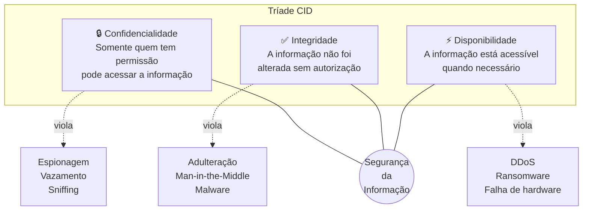
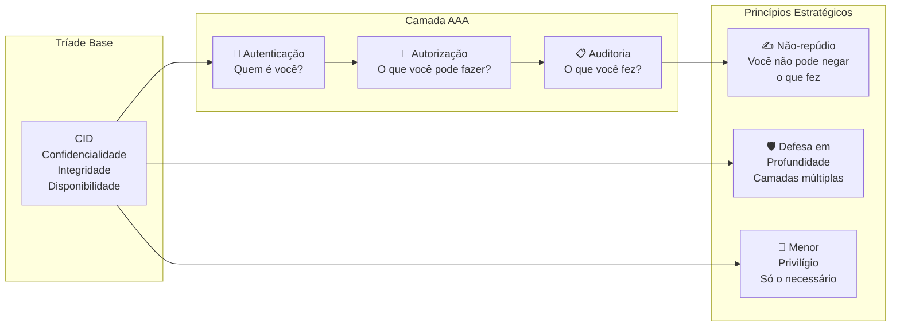
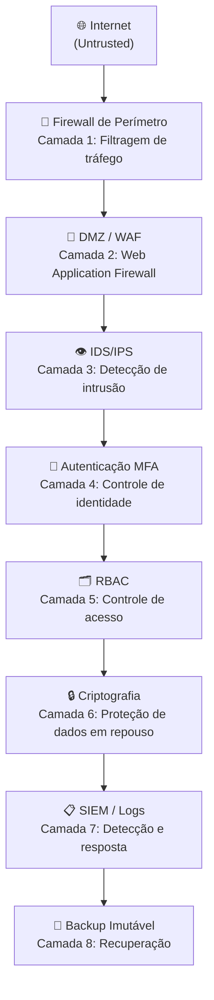
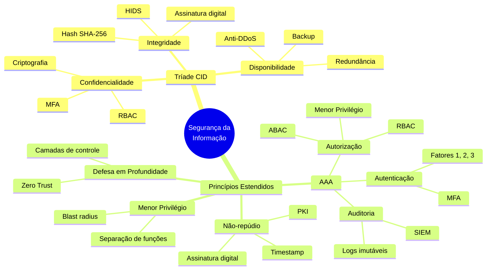

# Princípios da Segurança da Informação

> [!info] Conteúdo consolidado
> Esta página reúne a **Tríade CID** (Confidencialidade, Integridade e Disponibilidade) e os **princípios estendidos** (Autenticidade, Não-repúdio, AAA, Defesa em Profundidade, Menor Privilégio) com exemplos reais, atividades práticas e diagramas.
>
> 👉 Para o contexto introdutório e histórico, veja também **[[Introdução à Segurança da informação]]**, seção "A Tríade CID, os três pilares".

---

## 🧭 Por que princípios importam?

Antes de configurar firewalls, escrever código seguro ou responder incidentes, precisamos de uma **linguagem comum** para raciocinar sobre o que estamos protegendo e por quê. Os princípios da segurança da informação cumprem exatamente esse papel: são abstrações que guiam decisões técnicas, políticas e organizacionais.

Sem esses princípios, corremos o risco de proteger o que é visível (senhas, antivírus) e ignorar o que é invisível (integridade de logs, disponibilidade em desastres, rastreabilidade de ações).

> [!tip] 💡 Perspectiva histórica
> A Tríade CID foi formalizada no final dos anos 1980 e consolidada pelo **NIST** nos anos 1990. Em 2024, o NIST publicou o **Cybersecurity Framework 2.0 (CSF 2.0)**, que expande a estrutura para incluir governança, mas os três pilares originais continuam sendo o núcleo de qualquer análise de risco ou auditoria de conformidade (ISO 27001, SOC 2, LGPD).

---

## 🔺 A Tríade CID: os três pilares fundamentais

A Tríade CID é o modelo mais reconhecido da segurança da informação. Cada letra representa um objetivo de proteção distinto, e a violação de qualquer um deles constitui um incidente de segurança.



---

### 🔒 Confidencialidade

**Definição:** Garantia de que a informação é acessada somente por entidades autorizadas.

**O que protege:** segredos de negócio, dados pessoais (LGPD), credenciais, comunicações privadas.

**Controles típicos:**
- Criptografia (AES-256, TLS 1.3)
- Controle de acesso baseado em papel (RBAC)
- Autenticação multifator (MFA)
- Classificação de dados (público, interno, confidencial, secreto)

**Exemplos de violação:**
- Um atacante intercepta pacotes HTTP em rede Wi-Fi pública (sniffing) e lê e-mails em texto claro.
- Um funcionário copia base de dados de clientes para pen drive sem autorização (insider threat).
- Engenharia social induz um usuário a revelar senha por telefone (pretexting).

> [!warning] ⚠️ Confidencialidade vs. Privacidade
> Confidencialidade é um controle **técnico/organizacional** aplicado a qualquer tipo de dado. Privacidade é um **direito** do titular do dado (protegido pela LGPD no Brasil). Podemos ter confidencialidade sem privacidade (dado sigiloso de empresa) e vice-versa (dado público mas anonimizado). Na prática, os dois conceitos se sobrepõem frequentemente.

---

### ✅ Integridade

**Definição:** Garantia de que a informação não foi modificada de forma não autorizada, seja por erro ou por ação maliciosa.

**O que protege:** registros financeiros, logs de auditoria, código-fonte, contratos digitais, atualizações de software.

**Controles típicos:**
- Funções hash criptográficas (SHA-256, SHA-3)
- Assinaturas digitais (RSA, ECDSA)
- Controle de versão (Git com commits assinados)
- Checksums em transferências de arquivo
- Sistemas de detecção de intrusão baseados em host (HIDS), como o AIDE

**Exemplos de violação:**
- Um atacante realiza ataque Man-in-the-Middle (MitM) e modifica o valor de uma transferência bancária em trânsito.
- Malware injeta código malicioso em um executável legítimo antes do download.
- Um administrador desonesto edita logs de acesso para encobrir suas ações.

> [!note] 📝 Integridade de dados vs. integridade de sistema
> Integridade se aplica a dois níveis: (1) **dados em repouso** (arquivos, banco de dados) e (2) **dados em trânsito** (pacotes de rede). Ambos exigem controles distintos. A NIST SP 800-53 endereça cada nível separadamente nos controles da família SC (System and Communications Protection).

---

### ⚡ Disponibilidade

**Definição:** Garantia de que os sistemas e dados estão acessíveis e operacionais quando os usuários autorizados precisam deles.

**O que protege:** continuidade de negócio, operações críticas (saúde, energia, transporte), SLAs contratuais.

**Controles típicos:**
- Redundância de hardware e energia (RAID, UPS, geradores)
- Balanceamento de carga e CDN
- Planos de continuidade de negócio (BCP) e recuperação de desastres (DR)
- Proteção anti-DDoS (Cloudflare, AWS Shield)
- Backups regulares com testes de restauração

**Exemplos de violação:**
- Ataque DDoS volumétrico satura a largura de banda de um servidor web, tornando-o inacessível.
- Ransomware criptografa todos os arquivos de um hospital, impedindo acesso a prontuários.
- Falha em equipamento de rede sem redundância derruba serviço crítico por horas.

> [!danger] 🚨 O caso do ransomware em hospitais
> Em 2021, o ataque de ransomware ao HSE (Health Service Executive) da Irlanda comprometeu a disponibilidade de sistemas de saúde por semanas, forçando cancelamento de cirurgias e retorno ao papel. Custo estimado: mais de 100 milhões de euros. É o exemplo mais didático de como a violação de disponibilidade pode custar vidas, não apenas dinheiro.

---

## 📊 Tabela Resumo: Tríade CID

| Princípio | Definição | Exemplo real | Ataque que viola | Controle principal |
|---|---|---|---|---|
| **Confidencialidade** | Acesso somente por autorizados | Criptografar e-mail com PGP | Sniffing, phishing, insider threat | Criptografia, MFA, RBAC |
| **Integridade** | Dados não alterados sem autorização | Hash SHA-256 de arquivo baixado | MitM, ransomware, SQL injection | Hash, assinatura digital, HIDS |
| **Disponibilidade** | Sistema acessível quando necessário | SLA de 99,9% em cloud | DDoS, ransomware, falha de hardware | Redundância, CDN, DR, backup |

---

## 🔐 Princípios Estendidos: além da Tríade

Com a evolução das ameaças, a Tríade CID sozinha mostrou-se insuficiente. Precisamos responder perguntas como: "Quem fez essa ação?" e "Como garantir que ninguém vai negar o que fez?". Os princípios estendidos respondem essas questões.



---

### 🪪 Autenticação (Authentication)

**Definição:** Processo de verificar a identidade declarada de uma entidade (usuário, sistema, serviço).

**Os 3 fatores de autenticação:**
1. **Algo que você sabe:** senha, PIN, resposta a pergunta secreta
2. **Algo que você tem:** token físico (YubiKey), TOTP (Google Authenticator), smart card
3. **Algo que você é:** biometria (impressão digital, reconhecimento facial, voz)

A **Autenticação Multifator (MFA)** combina dois ou mais fatores, tornando muito mais difícil para um atacante comprometer a autenticação mesmo que obtenha a senha.

**Ataques que violam:**
- Credential stuffing (usar senhas vazadas de outros serviços)
- Brute force e dictionary attack
- SIM swapping (sequestrar número de telefone para interceptar SMS de MFA)
- Phishing de credenciais em páginas falsas

> [!example] 🔐 Autenticação vs. Identificação
> Identificação é dizer quem você é ("Eu sou Maria"). Autenticação é **provar** que você é quem diz ser. Um sistema que aceita o nome de usuário sem senha tem identificação mas não autenticação. Os dois juntos formam o fundamento do controle de acesso.

---

### 🔑 Autorização (Authorization)

**Definição:** Processo de determinar quais recursos e ações uma entidade autenticada tem permissão de acessar ou executar.

**Autenticação e autorização são conceitos distintos:**
- Autenticação responde: "Você é quem diz ser?"
- Autorização responde: "Você tem permissão para fazer isso?"

**Modelos de controle de acesso:**

| Modelo | Sigla | Como funciona | Exemplo |
|---|---|---|---|
| Controle de Acesso Obrigatório | MAC | Rótulos de segurança definidos pelo sistema | Sistemas militares (Top Secret, Secret) |
| Controle de Acesso Discricionário | DAC | Dono do recurso define permissões | Permissões de arquivo Unix (chmod) |
| Controle de Acesso baseado em Papel | RBAC | Permissões vinculadas a papéis | Admin, editor, leitor em um CMS |
| Controle de Acesso baseado em Atributo | ABAC | Políticas baseadas em contexto | Acesso liberado só de rede interna, horário comercial |

**Ataques que violam:**
- Escalada de privilégios (explorar vulnerabilidade para obter permissões maiores)
- IDOR (Insecure Direct Object Reference): acessar recurso de outro usuário mudando ID na URL
- Configuração incorreta de permissões (misconfiguration: bucket S3 público sem querer)

---

### 📋 Auditoria (Accounting/Auditing)

**Definição:** Registro sistemático e rastreável de todas as ações realizadas por entidades no sistema, criando uma trilha de auditoria (*audit trail*) que permite reconstruir eventos passados.

**O que registrar:**
- Tentativas de login (sucesso e falha)
- Acessos a dados sensíveis
- Alterações de configuração
- Criação, modificação e exclusão de arquivos críticos
- Execução de comandos privilegiados

**Ferramentas típicas:**
- Syslog / journald (Linux)
- Windows Event Log
- SIEM (Security Information and Event Management): Splunk, ELK Stack, Wazuh
- Auditd (Linux, rastreamento de chamadas de sistema)

**Por que logs importam:**
- Permitem detectar incidentes após o fato
- São exigidos por normas (ISO 27001, PCI-DSS, LGPD)
- São evidência legal em investigações forenses

> [!warning] ⚠️ Logs devem ser protegidos
> Um atacante que comprometeu um sistema vai tentar apagar ou modificar os logs para encobrir suas ações. Logs devem ser enviados a um sistema externo (servidor de log centralizado, SIEM) em tempo real, com integridade garantida (hash ou assinatura). Log local sem proteção de integridade tem valor forense limitado.

---

### ✍️ Não-repúdio

**Definição:** Garantia de que uma entidade não pode negar ter realizado uma ação. O não-repúdio cria evidência irrefutável de que uma mensagem foi enviada, um contrato foi assinado, ou uma transação foi executada.

**Como é implementado:**
- **Assinatura digital:** vincula matematicamente o conteúdo ao par de chaves do signatário. Sem a chave privada, a assinatura não pode ser gerada; com a chave pública, qualquer um pode verificar.
- **Certificado digital (ICP-Brasil):** infraestrutura de chave pública que vincula a identidade legal a um par de chaves criptográficas.
- **Registro em blockchain:** imutabilidade estrutural impede alteração retroativa de registros.
- **Carimbos de tempo (timestamp):** provam que um documento existia em determinado momento.

**Aplicações práticas:**
- Nota fiscal eletrônica (NF-e) com assinatura digital obrigatória
- Contratos eletrônicos com validade jurídica (Lei 14.063/2020 no Brasil)
- E-mail com assinatura S/MIME ou PGP

**Relação com a Tríade:** Não-repúdio combina Integridade (o conteúdo não foi alterado) com Autenticação (a entidade é quem diz ser), criando prova legal de uma ação.

---

### 🛡️ Defesa em Profundidade (Defense in Depth)

**Definição:** Estratégia de segurança que emprega múltiplas camadas de controles independentes, de forma que a falha de um controle não comprometa o sistema inteiro. Originalmente um conceito militar, foi adaptado pela NSA e NIST para segurança da informação.

**O princípio central:** não existe controle infalível. A defesa em profundidade aceita que qualquer camada pode ser comprometida e garante que existem camadas adicionais para limitar o dano.



**Camadas típicas em um sistema corporativo:**
1. Segurança física (datacenter, controle de acesso físico)
2. Segurança de rede (firewall, segmentação, VPN)
3. Segurança de host (antivírus, EDR, hardening de OS)
4. Segurança de aplicação (WAF, validação de input, OWASP Top 10)
5. Segurança de dados (criptografia, DLP)
6. Segurança de identidade (MFA, PAM)
7. Monitoramento e resposta (SIEM, SOC, playbooks de IR)

> [!note] 📎 Defesa em profundidade vs. Zero Trust
> Zero Trust (confiança zero) é um modelo arquitetural moderno que complementa a defesa em profundidade. Enquanto a defesa em profundidade empilha camadas, o Zero Trust adiciona o princípio "nunca confie, sempre verifique" a cada transação, independentemente de onde ela ocorre (dentro ou fora do perímetro). Os dois modelos são complementares, não excludentes.

---

### 👤 Menor Privilégio (Principle of Least Privilege)

**Definição:** Cada entidade (usuário, processo, serviço) deve ter apenas as permissões mínimas necessárias para realizar suas funções, e nada mais. Formalizado na NIST SP 800-53 como controle AC-6.

**Por que importa:** quando um atacante compromete uma conta ou processo, o menor privilégio limita o raio de explosão (*blast radius*). Uma conta com privilégios mínimos comprometida causa dano limitado; uma conta de administrador comprometida pode destruir toda a infraestrutura.

**Aplicações práticas:**
- Serviço de banco de dados que roda como usuário sem senha de root
- Container Docker que roda como usuário não-root
- Desenvolvedor que tem acesso de leitura ao banco de produção, mas não de escrita
- Usuário de service account com permissão apenas para leitura de um bucket S3 específico
- Política de IAM na AWS com permissões específicas por recurso (não `*`)

**Princípios correlatos:**
- **Separação de funções (Separation of Duties):** nenhuma pessoa deve ter controle completo sobre uma operação crítica. Exemplo: quem aprova pagamento não é quem o executa.
- **Need-to-know:** usuário só acessa informações relevantes para sua função atual, mesmo que tenha clearance para mais.

> [!danger] 🚨 O risco do superusuário onipresente
> Uma das configurações mais perigosas em ambientes reais é o uso cotidiano de contas de administrador (root, Administrator, sudo sem senha) para tarefas rotineiras. Se o usuário clicar em phishing ou executar malware enquanto está como administrador, o código malicioso herda todos os privilégios. Solução: conta separada para tarefas administrativas, ativada apenas quando necessário.

---

## 📊 Tabela Completa: Todos os Princípios

| Princípio | Definição resumida | Exemplo prático | Ataque que viola | Controle principal |
|---|---|---|---|---|
| **Confidencialidade** | Acesso só por autorizados | Criptografia de e-mail | Sniffing, phishing | AES, TLS, MFA |
| **Integridade** | Dado não alterado sem autorização | Hash SHA-256 de ISO | MitM, malware, SQL injection | Hash, assinatura digital |
| **Disponibilidade** | Sistema acessível quando necessário | SLA 99,9% em cloud | DDoS, ransomware | Redundância, CDN, DR |
| **Autenticação** | Provar quem você é | Login com MFA (senha + TOTP) | Brute force, phishing, SIM swap | MFA, certificado digital |
| **Autorização** | Definir o que você pode fazer | RBAC: leitor não edita | Escalada de privilégio, IDOR | RBAC, ABAC, MAC |
| **Auditoria** | Registrar o que você fez | Logs de acesso no SIEM | Apagar logs, log tampering | SIEM, log imutável |
| **Não-repúdio** | Não poder negar o que fez | Assinatura digital em contrato | Falsificação de identidade | PKI, assinatura digital |
| **Defesa em profundidade** | Múltiplas camadas de proteção | Firewall + WAF + MFA + SIEM | Bypass de única camada | Arquitetura em camadas |
| **Menor privilégio** | Permissão mínima necessária | Service account sem root | Escalada, movimento lateral | IAM granular, PAM |

---

## 🔗 Relações entre os princípios

Os princípios não são independentes: eles se reforçam mutuamente e, em alguns casos, criam tensões que precisam ser gerenciadas.

**Relações de reforço:**
- Autenticação fortalece Confidencialidade (só quem prova quem é acessa)
- Auditoria suporta Integridade (logs permitem detectar alterações)
- Não-repúdio depende de Autenticação e Integridade simultaneamente
- Menor Privilégio reduz o impacto de violações de Confidencialidade

**Tensões clássicas:**
- Confidencialidade vs. Disponibilidade: criptografia forte pode introduzir latência; sistemas offline são seguros mas inúteis.
- Segurança vs. Usabilidade: MFA aumenta segurança mas adiciona fricção para o usuário.
- Menor Privilégio vs. Produtividade: restrições excessivas impedem o trabalho legítimo.

> [!tip] 💡 Gestão de risco como árbitro
> Quando princípios entram em conflito, a decisão correta depende do contexto e da análise de risco. Um banco digital priorizará Confidencialidade e Integridade mesmo com algum custo em usabilidade. Uma plataforma de streaming priorizará Disponibilidade. Segurança não é absoluta: é uma função do risco aceito pela organização.

---

## 🧪 Atividades Práticas

> [!example] 🧪 Atividade 1: Classificar controles por princípio CID/AAA
>
> **Objetivo:** Identificar qual princípio da segurança cada controle atende na prática.
>
> **Ferramenta:** Lápis e papel (ou planilha). Nenhuma instalação necessária.
>
> **Tarefa:** Para cada controle abaixo, indique quais princípios ele atende (pode ser mais de um) e justifique em uma frase:
>
> | Controle | Princípios atendidos | Justificativa |
> |---|---|---|
> | HTTPS (TLS) | ? | |
> | Backup diário em nuvem | ? | |
> | 2FA (senha + TOTP) | ? | |
> | Log de acesso centralizado | ? | |
> | RBAC (papéis de acesso) | ? | |
>
> **Gabarito orientativo:**
> - HTTPS: Confidencialidade (criptografia em trânsito) + Integridade (prevenção de MitM) + Autenticação (certificado do servidor)
> - Backup: Disponibilidade (recuperação após falha/ransomware)
> - 2FA: Autenticação (segundo fator dificulta comprometimento de credencial)
> - Log centralizado: Auditoria (trilha de ações) + Não-repúdio (evidência de quem fez o quê)
> - RBAC: Autorização (define o que cada papel pode fazer) + Menor Privilégio (papéis têm escopo mínimo)
>
> **Resultado observável:** Perceber que bons controles frequentemente atendem mais de um princípio ao mesmo tempo, e que gaps em um princípio raramente ficam isolados.

---

> [!example] 🧪 Atividade 2: Analisar um incidente real e identificar o princípio violado
>
> **Objetivo:** Aplicar os princípios da Tríade CID e estendidos para diagnosticar incidentes reais.
>
> **Ferramenta:** Acesse o site **[Have I Been Pwned](https://haveibeenpwned.com/)** (haveibeenpwned.com) para consultar vazamentos de dados conhecidos.
>
> **Parte A (individual):** Digite um e-mail (pode ser fictício ou de teste) e observe quais vazamentos são reportados. Para cada vazamento listado, identifique:
> - Qual princípio foi violado? (Confidencialidade? Integridade? Disponibilidade?)
> - Qual dado foi exposto? (senha, e-mail, telefone, dados financeiros)
> - Qual foi o controle que falhou? (criptografia fraca, senha em texto claro, misconfiguration)
>
> **Parte B (grupo):** Pesquise um dos incidentes abaixo e responda as perguntas acima para o grupo:
> - Vazamento do LinkedIn (2021): 700 milhões de perfis raspados
> - Ataque ransomware ao HSE Irlanda (2021): hospitais sem acesso a prontuários por semanas
> - Caso Uber (2022): atacante acessou sistemas internos via engenharia social em funcionário
> - Vazamento de dados do Ministério da Saúde BR (2021): CPFs e dados de vacinação expostos
>
> **Resultado observável:** Construir um "diagnóstico de incidente" com princípio violado, vetor de ataque, controle ausente e sugestão de melhoria. Esse formato é usado em relatórios de resposta a incidentes (IR reports) profissionais.

---

> [!example] 🧪 Atividade 3: Verificar integridade de arquivo com sha256sum
>
> **Objetivo:** Usar hashing criptográfico para verificar se um arquivo foi modificado, aplicando o princípio de Integridade na prática.
>
> **Ferramenta:** Terminal Linux (ou WSL no Windows). Comando `sha256sum` disponível por padrão em qualquer distribuição Linux moderna.
>
> **Passo a passo:**
>
> ```bash
> # 1. Criar um arquivo de teste
> echo "Este arquivo é o documento original." > documento.txt
>
> # 2. Calcular o hash SHA-256 do arquivo
> sha256sum documento.txt
> # Saída esperada (exemplo):
> # a1b2c3d4e5f6...  documento.txt
>
> # 3. Salvar o hash num arquivo de referência
> sha256sum documento.txt > documento.txt.sha256
>
> # 4. Verificar integridade (deve retornar "OK")
> sha256sum --check documento.txt.sha256
>
> # 5. Simular uma adulteração
> echo "Linha adicionada por atacante!" >> documento.txt
>
> # 6. Verificar novamente (deve retornar "FAILED")
> sha256sum --check documento.txt.sha256
> ```
>
> **Resultado observável:**
> - Antes da adulteração: `documento.txt: OK`
> - Após a adulteração: `documento.txt: FAILED`
>
> **Extensão (desafio):** Baixe a ISO do Ubuntu do site oficial junto com o arquivo `SHA256SUMS` fornecido pela Canonical. Use `sha256sum --check SHA256SUMS` para verificar se a imagem baixada é autentica. Esse é exatamente o processo que distribuições Linux usam para garantir que ninguém adulterou o instalador do sistema operacional antes de você instalar.
>
> **Reflexão:** Por que um hash SHA-256 sozinho garante integridade mas não autenticidade? O que precisaria ser adicionado para garantir que o hash em si não foi substituído por um atacante? (Resposta: assinatura digital com chave privada, verificável com chave pública, como no GPG.)

---

## 📌 Síntese e mapa mental final



---

> [!note] 📚 Fontes (2026)
>
> - **NIST SP 800-53 Rev. 5** (controles AC-6 Least Privilege, AC-2 Account Management): [csrc.nist.gov](https://csrc.nist.gov/CSRC/media/Projects/risk-management/800-53%20Downloads/800-53r5/SP_800-53_v5_1-derived-OSCAL.pdf)
> - **NIST Cybersecurity Framework 2.0** (governança e princípios): [nist.gov/cyberframework](https://www.nist.gov/cyberframework)
> - **CIA Triad: Confidentiality, Integrity, Availability** (Zscaler, 2025): [zscaler.com/zpedia](https://www.zscaler.com/zpedia/what-is-the-cia-triad-in-cybersecurity)
> - **The Five Pillars of Information Security: CIA Triad and More** (DestCert, 2025): [destcert.com](https://destcert.com/resources/five-pillars-information-security/)
> - **AAA Security Model: Authentication, Authorization & Auditing Explained** (LIS Academy): [lis.academy](https://lis.academy/ict-fundamentals/aaa-security-model-authentication-authorization-auditing/)
> - **What is AAA Security? Authentication, Authorization, and Accounting** (StrongDM, 2025): [strongdm.com](https://www.strongdm.com/blog/aaa-security)
> - **Linux Integrity Check: SHA256 and GPG Verification Guide** (LinuxSecurity, 2025): [linuxsecurity.com](https://linuxsecurity.com/news/server-security/checksums-in-linux-integrity-guide)
> - **Verifying data integrity and authenticity using SHA-256 and GPG** (Linux Kamarada): [linuxkamarada.com](https://linuxkamarada.com/en/2018/11/08/verifying-data-integrity-and-authenticity-using-sha-256-and-gpg/)
> - **What is the CIA Triad and Why is it important?** (Fortinet): [fortinet.com](https://www.fortinet.com/resources/cyberglossary/cia-triad)
> - **CIA Triad** (EBSCO Research Starters, 2025): [ebsco.com](https://www.ebsco.com/research-starters/information-technology/confidentiality-integrity-and-availability-cia-triad)
