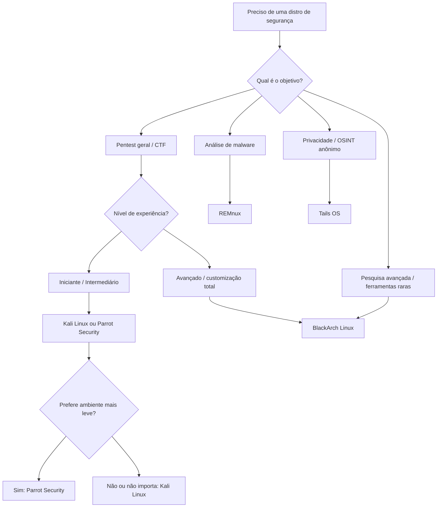

# Sistemas Utilizados

> [!quote] Preparando seu Laboratório
> *Para estudar segurança da informação, você precisa de um ambiente controlado. Máquinas virtuais são a melhor opção.*

> [!warning] Uso Ético e Legal
> Todo o conteúdo desta aula é voltado exclusivamente para ambientes controlados e autorizados. A invasão de sistemas sem autorização configura crime previsto no **art. 154-A do Código Penal Brasileiro** (invasão de dispositivo informático), com pena de reclusão de 1 a 4 anos. Nunca pratique técnicas em sistemas de terceiros sem autorização explícita por escrito.

Veja também: [[Preparando o terreno]] para os primeiros passos de configuração do laboratório.

---

## 🐧 Distribuições Linux para Segurança

> [!tip] Sistemas Especializados
> Essas distribuições já vêm com centenas de ferramentas de segurança pré-instaladas, economizando horas de configuração e garantindo compatibilidade entre as ferramentas.

O ecossistema de distribuições Linux voltadas para segurança evoluiu muito em 2025-2026. Cada distro tem um perfil diferente: algumas são generalistas (Kali, Parrot), outras são especializadas em subáreas como análise de malware (REMnux) ou privacidade extrema (Tails). Conhecer as diferenças permite escolher a ferramenta certa para cada tarefa.

---

### 🔴 Kali Linux

> [!success] A Distribuição Mais Popular em 2026
> Desenvolvida e mantida pela Offensive Security, é o padrão da indústria para pentesting profissional. Em 2026, chegou à versão 2026.1, com kernel 6.18.

[🔗 Kali Linux - Our Most Advanced Penetration Testing Distribution](https://www.kali.org/)

**Inclui mais de 600 ferramentas, entre elas:**
- Nmap, Metasploit, Burp Suite
- Aircrack-ng, Wireshark
- John the Ripper, Hashcat
- Gobuster, Nikto, SQLmap
- Ferramenta nova (2025.4): `hexstrike-ai`, servidor MCP que conecta agentes de IA a ferramentas de segurança
- `evil-winrm-py`: execução remota via Windows Remote Management

**Novidades em 2025-2026:**
- **Kali 2026.1 (mar/2026):** kernel 6.18, modo BackTrack (homenagem ao BackTrack, precursor do Kali, em seu 20º aniversário), 8 novos programas adicionados aos repositórios
- **Kali 2025.4 (dez/2025):** suporte a temas de cor no Xfce, reorganização de ferramentas no GNOME em pastas por categoria, 3 ferramentas especializadas novas
- **Kali 2025.3:** reintegração do suporte Nexmon para chipsets Broadcom/Cypress Wi-Fi, habilitando monitor mode e injeção em dispositivos como Raspberry Pi
- **CARsenal** (rebrand do CAN Arsenal): integração de pentest veicular e forense digital num ambiente unificado, refletindo o crescimento do setor de segurança de veículos conectados

**Variantes do Kali:**
| Variante | Uso principal |
|----------|--------------|
| Kali Linux Live (USB) | Uso sem instalação, portátil |
| Kali Linux VM (OVA/VMDK) | Lab fixo em VirtualBox ou VMware |
| Kali WSL2 | Windows 10/11, integrado ao terminal |
| Kali NetHunter | Android (dispositivos compatíveis) |
| Kali Cloud | AWS, Azure, GCP (imagens prontas) |
| Kali ARM | Raspberry Pi, dispositivos embarcados |

---

### 🦜 Parrot Security OS

> [!info] Alternativa Leve e Developer-Friendly em 2026
> Similar ao Kali em cobertura de ferramentas, mas com foco adicional em privacidade, forense digital e ambiente de desenvolvimento. Versão 7.0 lançada em dezembro de 2025, baseada em Debian 13.

[🔗 Parrot Security](https://www.parrotsec.org/)

**Diferenciais:**
- Mais leve que o Kali em consumo de RAM
- Ferramentas de privacidade incluídas por padrão (Tor Browser, Tor Routing do tráfego do sistema)
- Ambiente de desenvolvimento integrado (ideal para quem escreve exploits)
- Mais de 600 ferramentas de pentest, vulnerabilidade e forense

**Variantes do Parrot:**
| Edição | Foco |
|--------|------|
| Parrot Security | Pentest, forense, privacidade |
| Parrot Home | Uso cotidiano com privacidade, sem tools de pentest |
| Parrot HTB Edition | Parceria com HackTheBox, configurada para CTFs |

**Roadmap 2026 do Parrot:**
- Suporte melhorado a deployments em containers e cloud
- Foco crescente em segurança de sistemas de IA (estudo de vetores de ataque em modelos e APIs de IA)
- Expansão de documentação e guias de lab reproduzíveis

---

### ⚫ BlackArch Linux

> [!warning] Para Usuários Experientes
> Expansão do Arch Linux para pentesters avançados. Repositório com mais de 2.850 ferramentas em 2025, o maior de qualquer distro de segurança.

[🔗 BlackArch Linux](https://blackarch.org/)

**Características:**
- Rolling release: ferramentas sempre na versão mais recente, sem esperar releases
- Funciona como overlay do Arch Linux (instala por cima do Arch) ou como live ISO independente
- Disponível como imagem em AWS, Azure e GCP
- Consome cerca de 330 MB de RAM em idle, extremamente leve
- Docker e dispositivos ARM suportados

**Quando usar o BlackArch:**
- Quando precisar de uma ferramenta que não está no Kali/Parrot
- Quando quiser total controle sobre o sistema base (filosofia Arch)
- Para pesquisa avançada ou work custom com ferramentas bleeding-edge

> [!caution] Curva de Aprendizado
> O BlackArch assume familiaridade com Arch Linux. A documentação é mais esparsa que a do Kali. Recomendado somente após dominar o Kali.

---

### 🔬 REMnux

> [!info] Especialista em Análise de Malware
> Distribuição voltada exclusivamente para análise de malware e engenharia reversa. Versão 8 lançada em 2024, celebrando 15 anos do projeto. Baseada em Ubuntu 24.04 LTS.

[🔗 REMnux](https://remnux.org/)

**Ferramentas organizadas por categoria:**
- Análise estática de executáveis (PE, ELF, Mach-O)
- Análise dinâmica (sandbox, intercepção de rede)
- Documentos maliciosos (PDF, Office, email)
- Código malicioso em Python, PowerShell, Java, VBScript
- Análise de memória (injeções de código)
- Malware para Android

**Novidade no REMnux 8:**
- Suporte a análise assistida por IA via servidor MCP
- Instalador mais resiliente
- Pode ser instalado como camada sobre Ubuntu 24.04 existente

**Formas de usar:**
- VM em VirtualBox/VMware (OVA)
- Containers Docker por ferramenta
- Instalado sobre Ubuntu 24.04 LTS

---

### 🧅 Tails OS

> [!info] Privacidade Máxima
> Sistema operacional voltado para anonimato, projetado para rodar inteiramente de um pendrive sem deixar rastros no computador hospedeiro.

[🔗 Tails](https://tails.boum.org/)

**Características:**
- Todo tráfego de rede passa pela rede Tor
- Não deixa rastros no computador (amnesiac OS)
- Contém Aircrack-ng para auditoria de redes sem fio
- Útil em operações OSINT que exigem anonimato
- Não é voltado para pentest ativo, mas para investigação anônima

---

## 📊 Tabela Comparativa de Distribuições

| Distro | Base | Foco | Ferramentas | RAM Idle | Nível | Ideal Para |
|--------|------|------|-------------|----------|-------|------------|
| **Kali Linux** | Debian | Pentest geral | 600+ | ~500 MB | Iniciante/Pro | Pentest, CTF, cert. OSCP |
| **Parrot Security** | Debian | Pentest + Dev + Privacidade | 600+ | ~350 MB | Iniciante/Pro | Dev, privacidade, forense |
| **BlackArch** | Arch | Pentest avançado | 2.850+ | ~330 MB | Avançado | Pesquisa, ferramentas raras |
| **REMnux** | Ubuntu | Malware/RE | 200+ | ~600 MB | Intermediário/Pro | Análise de malware |
| **Tails** | Debian | Privacidade/Anonimato | 30+ | ~500 MB | Iniciante | OSINT anônimo, proteção |
| **Metasploitable 2** | Ubuntu | Alvo vulnerável | N/A | ~256 MB | N/A | Prática de exploração |

---

## 🗺️ Fluxograma de Escolha da Distro



---

## 🎯 Sistemas Vulneráveis para Prática

> [!warning] Sistema Intencionalmente Vulnerável
> Sistemas vulneráveis são usados APENAS em laboratório isolado, nunca conectados à internet ou a redes de produção.

### Metasploitable 2

Uma VM Linux repleta de vulnerabilidades intencionais para praticar exploração de forma segura e legal.

[🔗 Download Metasploitable 2](https://sourceforge.net/projects/metasploitable/files/Metasploitable2/)

**Vulnerabilidades incluídas:**
- Serviços desatualizados (vsftpd 2.3.4 com backdoor, UnrealIRCd backdoor)
- Configurações inseguras (Samba aberto, NFS mal configurado)
- Aplicações web vulneráveis (DVWA, Mutillidae, phpMyAdmin exposto)
- Senhas fracas e contas padrão

### Metasploitable 3

Versão mais moderna, baseada em Windows Server 2008 R2 (para prática em ambientes Windows) ou Ubuntu 14.04.

### DVWA (Damn Vulnerable Web Application)

Aplicação web intencionalmente vulnerável, instalável em qualquer servidor PHP. Cobre SQL Injection, XSS, CSRF, File Upload, Command Injection e outros vetores OWASP Top 10.

### VulnHub e HackTheBox (VMs offline)

Plataformas que distribuem VMs vulneráveis prontas para praticar cenários realistas de comprometimento.

---

## 💿 Máquinas Virtuais Prontas

> [!tip] Economize Tempo
> Muitos sistemas já estão disponíveis em formato de VM, prontos para uso. Útil para começar rapidamente sem passar pelo processo de instalação.

[🔗 OSBoxes - Virtual Machines for VirtualBox & VMware](https://www.osboxes.org/)

O Kali Linux também disponibiliza OVAs e VMDKs oficiais diretamente em seu site, garantindo integridade (verificar o hash SHA256 antes de importar).

---

## 🖥️ Softwares de Virtualização

> [!info] Qual Escolher?
> VirtualBox e VMware são os mais comuns. Ambos são excelentes opções para construir um laboratório local.

### VirtualBox

| Aspecto | Descrição |
|---------|-----------|
| **Preço** | Gratuito e open-source |
| **Plataformas** | Windows, Linux, macOS |
| **Facilidade** | Fácil de usar, interface intuitiva |
| **Guest Additions** | Necessário instalar para clipboard e pasta compartilhada |
| **Redes** | NAT, Bridge, Host-Only, Internal (isolado) |

[🔗 Oracle VM VirtualBox](https://www.virtualbox.org/)

**Modos de rede recomendados para lab:**
- **Host-Only:** Kali e alvo se comunicam entre si, sem acesso à internet (mais seguro)
- **NAT:** Kali com internet, sem expor o alvo
- **Internal Network:** rede completamente isolada entre VMs

### VMware Workstation Player

| Aspecto | Descrição |
|---------|-----------|
| **Preço** | Gratuito para uso pessoal |
| **Plataformas** | Windows, Linux |
| **Performance** | Geralmente melhor que VirtualBox em I/O de disco |
| **VMware Tools** | Melhor integração com o host |
| **Snapshots** | Disponível (limitado no Player) |

[🔗 VMware Workstation Player](https://www.vmware.com/products/workstation-player/workstation-player-evaluation.html)

> [!tip] Snapshot é Essencial
> Antes de qualquer exploit ou teste destrutivo, crie um snapshot da VM limpa. Assim você restaura o estado original em segundos.

---

## 🪟 Kali Linux no Windows via WSL2

> [!info] WSL2: Windows Subsystem for Linux 2
> O WSL2 permite rodar o Kali Linux diretamente no Windows 10/11, sem precisar de VM dedicada. Ideal para quem já usa Windows e quer ter o Kali disponível rapidamente.

**Requisitos:**
- Windows 10 versão 2004+ (Build 19041+) ou Windows 11
- Virtualização habilitada na BIOS/UEFI

**Instalação passo a passo:**

```powershell
# 1. Habilitar WSL e VirtualMachinePlatform (PowerShell como Administrador)
dism.exe /online /enable-feature /featurename:Microsoft-Windows-Subsystem-Linux /all /norestart
dism.exe /online /enable-feature /featurename:VirtualMachinePlatform /all /norestart

# 2. Reiniciar o computador, depois definir WSL 2 como padrão
wsl --set-default-version 2

# 3. Instalar Kali Linux
wsl --install --distribution kali-linux

# 4. Verificar instalação
wsl --list --verbose
```

**Após a instalação inicial do Kali WSL:**

```bash
# Atualizar todos os pacotes
sudo apt update && sudo apt full-upgrade -y

# Instalar metapacote com as ferramentas mais usadas (~2 GB)
sudo apt install kali-linux-default -y

# Instalar Win-KeX (ambiente gráfico no Windows)
sudo apt install kali-win-kex -y

# Iniciar Win-KeX com integração de janela
kex --win -s
```

**Limitações do WSL2 para pentest:**
- Sem acesso direto a interfaces de rede para monitor mode (sem suporte nativo a raw sockets em modo Wi-Fi)
- Sem suporte a Bluetooth para ferramentas de RF
- Para pentest de rede avançado, VM dedicada ainda é recomendada

---

## 🔐 Conexão VPN para Plataformas

> [!tip] Conectando ao TryHackMe e HackTheBox
> Muitas plataformas de prática requerem conexão VPN para acessar os laboratórios remotos.

### OpenVPN

O cliente mais comum para conexão com plataformas de segurança.

[🔗 OpenVPN Client for Windows](https://openvpn.net/client-connect-vpn-for-windows/)

**Conectando ao TryHackMe via terminal (Kali):**

```bash
# Baixar o arquivo .ovpn do TryHackMe (na área do usuário > Access)
# Depois conectar:
sudo openvpn --config seu-usuario.ovpn

# Verificar se a interface tun0 foi criada
ip a show tun0
```

### Como usar no TryHackMe

[🔗 TryHackMe - OpenVPN Room](https://tryhackme.com/room/openvpn)

### SoftEther VPN

Alternativa ao OpenVPN, útil quando portas estão bloqueadas (usa HTTPS na porta 443).

[🔗 SoftEther VPN](https://www.vpngate.net/en/howto_softether.aspx)

---

## 📋 Checklist de Instalação

> [!success] Passos para Configurar seu Lab

1. ☐ Instalar VirtualBox ou VMware
2. ☐ Baixar imagem do Kali Linux (verificar hash SHA256)
3. ☐ Configurar VM com pelo menos 4 GB RAM e 50 GB disco
4. ☐ Criar snapshot da VM limpa (para restaurar após testes)
5. ☐ Baixar Metasploitable 2 para praticar
6. ☐ Configurar rede em Host-Only (Kali + Metasploitable isolados)
7. ☐ Instalar OpenVPN para conectar em plataformas (TryHackMe / HTB)
8. ☐ Atualizar todos os pacotes após instalação: `sudo apt update && sudo apt full-upgrade -y`

---

## 🧪 Atividades Práticas

> [!example] 🧪 Atividade 1: Instalar o Kali Linux em VM e Atualizar
> **Objetivo:** montar o ambiente base do laboratório.
>
> **Passos:**
> 1. Acesse https://www.kali.org/get-kali/ e baixe a imagem OVA para VirtualBox (ou VMDK para VMware)
> 2. Verifique o hash SHA256 do arquivo baixado:
>    ```bash
>    sha256sum kali-linux-*.ova
>    # Compare com o hash exibido no site do Kali
>    ```
> 3. Importe a OVA no VirtualBox: Arquivo > Importar Appliance
> 4. Configure a rede como "Host-Only" (sem acesso à internet, isolada)
> 5. Inicie a VM (usuário: `kali`, senha: `kali`)
> 6. Atualize o sistema:
>    ```bash
>    sudo apt update && sudo apt full-upgrade -y
>    ```
> 7. Crie um snapshot: Máquina > Criar Snapshot > "Kali Limpo Atualizado"
>
> **Resultado esperado:** sistema com kernel 6.18+ e pacotes atualizados, snapshot salvo.

---

> [!example] 🧪 Atividade 2: Instalar Kali no WSL2 (Windows)
> **Objetivo:** ter o Kali disponível no Windows sem VM dedicada.
>
> **Passos:**
> 1. Abra o PowerShell como Administrador
> 2. Execute:
>    ```powershell
>    wsl --install --distribution kali-linux
>    ```
> 3. Reinicie o computador quando solicitado
> 4. Na janela do Kali que abrir, crie um usuário e senha
> 5. Atualize e instale ferramentas padrão:
>    ```bash
>    sudo apt update && sudo apt full-upgrade -y
>    sudo apt install kali-linux-default -y
>    ```
> 6. Verifique a versão do kernel:
>    ```bash
>    uname -r
>    ```
>
> **Resultado esperado:** Kali rodando no WSL2, kernel Linux exibido, metapacote de ferramentas instalado.

---

> [!example] 🧪 Atividade 3: Comparar Kali e Parrot numa Tabela Própria
> **Objetivo:** entender as diferenças práticas entre as duas distribuições mais populares.
>
> Acesse os sites do [Kali Linux](https://www.kali.org/) e do [Parrot Security](https://parrotsec.org/) e preencha a tabela abaixo com suas observações:
>
> | Critério | Kali Linux | Parrot Security |
> |----------|------------|-----------------|
> | Versão atual | 2026.1 | 7.0 |
> | Base | Debian | Debian |
> | Interface padrão | Xfce | MATE |
> | Tamanho da ISO | ~3,5 GB | ~2,2 GB |
> | Ferramentas de privacidade | Não por padrão | Sim (Tor integrado) |
> | Ambiente dev integrado | Parcial | Sim |
> | Suporte a ARM | Sim | Sim |
> | Comunidade/documentação | Muito ampla | Boa |
> | Melhor para... | Pentest clássico / OSCP | Dev + pentest + privacidade |
>
> **Discussão:** qual das duas você escolheria para o laboratório da disciplina? Por quê?

---

> [!example] 🧪 Atividade 4: Rodar uma Ferramenta Pré-Instalada e Ver a Versão
> **Objetivo:** confirmar que as ferramentas do Kali funcionam corretamente e explorar o ambiente.
>
> **No terminal do Kali (VM ou WSL2):**
>
> ```bash
> # Ver versão do Nmap
> nmap --version
>
> # Ver versão do Metasploit Framework
> msfconsole --version
>
> # Ver versão do Burp Suite Community
> burpsuite --version 2>/dev/null || echo "Abrir via menu: Applications > Web Application Analysis > burpsuite"
>
> # Listar todas as ferramentas de reconhecimento disponíveis
> ls /usr/share/kali-menu/applications/ | head -20
>
> # Rodar um scan básico no localhost para testar o Nmap
> nmap -sV 127.0.0.1
> ```
>
> **Resultado esperado:** versões exibidas, saída do Nmap com portas do localhost. Anote as versões encontradas.

---

> [!note] 📚 Fontes (2026)
> - [Kali Linux 2026.1 ships BackTrack mode, eight new tools, and a kernel upgrade to 6.18 - Help Net Security](https://www.helpnetsecurity.com/2026/03/25/kali-linux-2026-1-release/)
> - [Kali Linux 2025.4 Released With 3 New Hacking Tools and Wifipumpkin3 - Cybersecurity News](https://cybersecuritynews.com/kali-linux-2025-4/)
> - [Kali Linux 2025.3 Lands: Enhanced Wireless Capabilities, Ten New Tools - Linux Journal](https://www.linuxjournal.com/content/kali-linux-20253-lands-enhanced-wireless-capabilities-ten-new-tools-infrastructure-refresh)
> - [Parrot OS shares its 2026 plans for security tools and platform support - Help Net Security](https://www.helpnetsecurity.com/2026/01/13/parrot-os-2026-plans-security-platform-roadmap/)
> - [Parrot 7.0 Release Notes - ParrotSec](https://parrotsec.org/blog/2025-12-24-parrot-7.0-release-notes/)
> - [Best Linux Distros for Ethical Hacking in 2026 - AnonHaven](https://anonhaven.com/en/best-linux-distros-for-ethical-hacking-which-one-should-you-choose/)
> - [REMnux 8 Linux Toolkit for Malware Analysis Is Out to Celebrate 15th Anniversary - 9to5Linux](https://9to5linux.com/remnux-8-linux-toolkit-for-malware-analysis-is-out-to-celebrate-15th-anniversary)
> - [REMnux: A Linux Toolkit for Malware Analysis - Official Docs](https://docs.remnux.org/)
> - [Kali WSL Documentation - kali.org](https://www.kali.org/docs/wsl/wsl-preparations/)
> - [Top 10 Operating Systems for Ethical Hacking 2026 - CyberSapiens](https://cybersapiens.com.au/top-10-operating-systems-for-ethical-hacking-and-penetration-testing-experts-picks/)
> - [BlackArch Linux Official Site](https://blackarch.org/)
